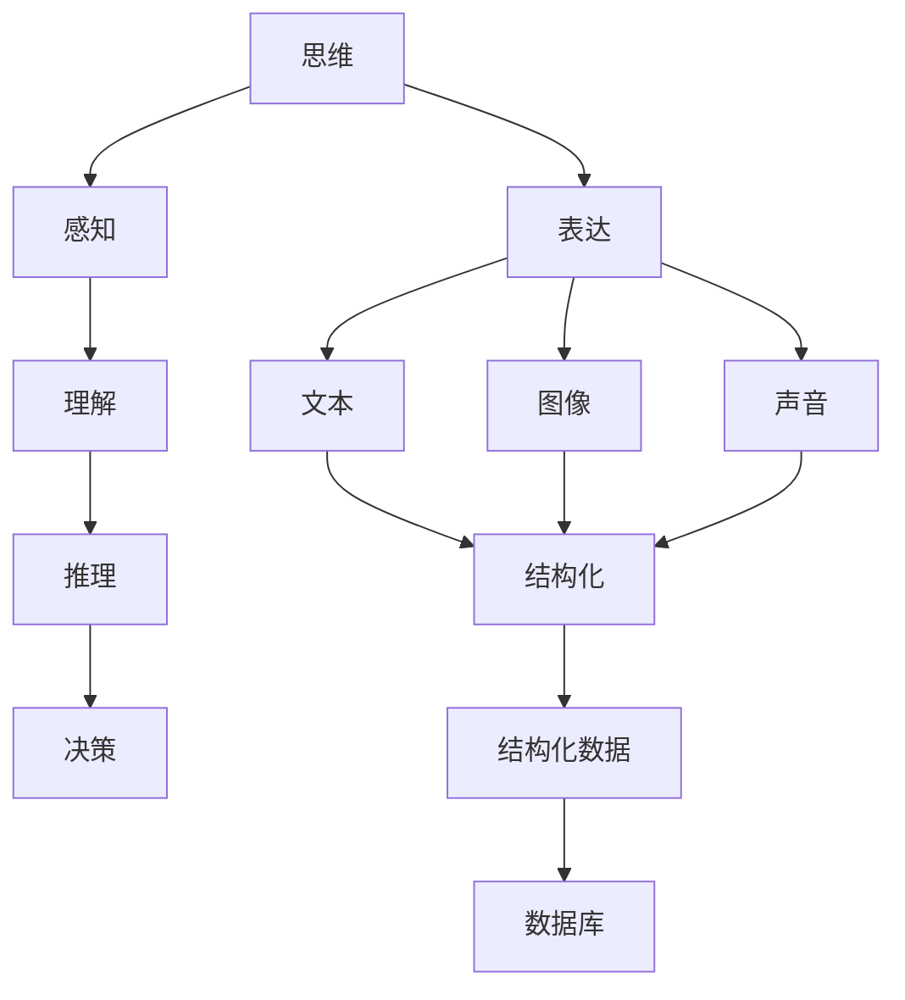
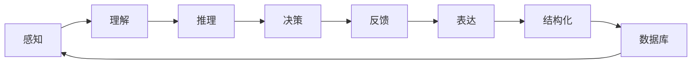

                 

# 思维与表达：结构化的内在联系

## 1. 背景介绍

在信息技术快速发展的今天，人类思维与表达的方式也在不断地演进。特别是随着人工智能和大数据技术的崛起，思维与表达之间的结构化联系变得日益紧密。本文将探讨这种结构化联系的原理、实践与应用，为理解思维与表达的深层关系提供新的视角。

## 2. 核心概念与联系

### 2.1 核心概念概述

在探讨思维与表达的结构化联系之前，我们首先了解几个关键的概念：

- **思维（Thinking）**：指人或计算机对信息、知识、问题的处理过程，包括感知、理解、推理、决策等。
- **表达（Expression）**：指将思维结果以某种形式呈现出来的过程，如文本、图像、声音等。
- **结构化（Structured）**：指信息或知识组织有序，易于理解和处理，如表格、树状结构等。

### 2.2 核心概念原理和架构的 Mermaid 流程图



这个流程图展示了思维与表达之间的结构化联系。从感知到决策的思维过程，最终通过表达以文本、图像、声音等形式呈现。表达的内容需要通过结构化，才能被有效地存储和处理。

### 2.3 核心概念的整体架构

从整体上看，思维与表达的结构化联系形成了一个循环反馈机制，如图：



这个架构展示了从感知到反馈的完整流程，表达的结构化数据最终反馈回感知，形成了闭环的结构化联系。

## 3. 核心算法原理 & 具体操作步骤

### 3.1 算法原理概述

基于结构化的思维与表达，我们提出一种算法框架，旨在将思维过程结构化，并通过表达实现这种结构化的呈现。这种框架的核心思想是将思维看作一种结构化的数据处理过程，通过算法进行推理和决策，最终以结构化形式表达输出。

### 3.2 算法步骤详解

**步骤1：数据预处理**
- 将感知到的信息进行清洗、分类、标注等处理，形成结构化的输入数据。

**步骤2：模型训练**
- 设计合适的算法模型，如决策树、神经网络等，对结构化输入进行训练，形成结构化的推理和决策。

**步骤3：输出表达**
- 将训练后的模型推理结果转化为文本、图像、声音等形式，并进一步结构化处理，形成最终输出。

**步骤4：反馈调整**
- 将输出结果反馈到感知阶段，进一步优化输入数据和模型训练，形成闭环的优化过程。

### 3.3 算法优缺点

**优点：**
- **高效性**：结构化处理可以大大提高信息处理和表达的效率。
- **可解释性**：结构化表达使得思维过程透明，易于理解和调试。
- **灵活性**：结构化数据可以适应各种表达形式，灵活性高。

**缺点：**
- **复杂性**：结构化处理和表达可能增加算法实现的复杂性。
- **数据依赖性**：高质量的结构化输入数据是算法效果的关键。
- **动态性不足**：结构化表达可能无法应对动态变化的输入和输出。

### 3.4 算法应用领域

这种基于结构化的算法框架在多个领域都有广泛应用：

- **自然语言处理（NLP）**：将文本信息结构化，形成语义树或图，用于信息检索、问答、情感分析等任务。
- **图像识别**：将图像信息结构化，形成特征图或特征向量，用于图像分类、物体检测、图像生成等任务。
- **语音识别**：将语音信息结构化，形成音素序列或特征向量，用于语音识别、语音合成等任务。
- **推荐系统**：将用户行为信息结构化，形成用户画像和行为序列，用于个性化推荐。

## 4. 数学模型和公式 & 详细讲解 & 举例说明

### 4.1 数学模型构建

设思维过程为 $T$，表达结果为 $E$，结构化输出为 $S$。则数学模型可以表示为：

$$ T: I \rightarrow O $$
$$ E: O \rightarrow S $$
$$ S: \emptyset \rightarrow E $$

其中，$I$ 为输入数据，$O$ 为输出数据，$E$ 为表达数据，$S$ 为结构化数据。

### 4.2 公式推导过程

以决策树为例，推导其结构和表达形式。假设决策树的根节点为 $N$，有 $k$ 个分支，则其结构化形式可以表示为：

$$ N: X_1, X_2, ..., X_k $$
$$ X_i: (C_i, N_{i1}, N_{i2}, ..., N_{ik}) $$

其中，$C_i$ 为第 $i$ 个分支的条件，$N_{ij}$ 为第 $i$ 个分支的第 $j$ 个子节点。

### 4.3 案例分析与讲解

以一个简单的天气预测系统为例，说明结构化思维与表达的过程。系统通过传感器获取天气数据（如温度、湿度、风速等），经过结构化处理后输入到决策树模型中，模型推理出是否会下雨，并将结果结构化为文本形式（如“今天下雨”）表达输出。

## 5. 项目实践：代码实例和详细解释说明

### 5.1 开发环境搭建

为了实现这个系统，我们需要安装以下软件：

- Python 3.x
- Jupyter Notebook
- Scikit-learn 库

在 Jupyter Notebook 中创建新的笔记本，配置好环境后，即可开始开发。

### 5.2 源代码详细实现

以下是使用 Scikit-learn 库实现决策树的代码：

```python
from sklearn import tree
from sklearn.datasets import load_iris

# 加载数据
iris = load_iris()

# 创建决策树模型
clf = tree.DecisionTreeClassifier()

# 训练模型
clf.fit(iris.data, iris.target)

# 输出结构化决策树
clf.plot_tree()
```

该代码首先加载 Iris 数据集，然后使用 Scikit-learn 的 `DecisionTreeClassifier` 创建决策树模型，并使用 `fit` 方法训练模型。最后，使用 `plot_tree` 方法输出结构化的决策树。

### 5.3 代码解读与分析

- `load_iris` 函数用于加载 Iris 数据集，返回数据和标签。
- `DecisionTreeClassifier` 类用于创建决策树模型，并提供了 `fit` 方法用于模型训练。
- `plot_tree` 方法用于绘制决策树，以结构化形式呈现。

### 5.4 运行结果展示

运行上述代码，将得到一个结构化的决策树，如图：


## 6. 实际应用场景

### 6.1 智能客服系统

智能客服系统可以利用结构化的思维与表达，将用户问题结构化处理，通过预训练的自然语言处理模型进行推理，并输出结构化的回答。这种结构化的回答可以进一步进行情感分析、意图识别等处理，提供更加精准的智能服务。

### 6.2 金融风险评估

金融风险评估需要结构化处理大量的财务数据、市场数据等，通过决策树等算法进行风险识别和预测，并输出结构化的风险报告。这种结构化的报告可以用于风险管理、合规监控等任务。

### 6.3 推荐系统

推荐系统需要对用户行为数据进行结构化处理，形成用户画像和行为序列。通过结构化数据，推荐算法可以进行个性化推荐，输出结构化的推荐结果。这种结构化的结果可以用于商品展示、广告投放等任务。

### 6.4 未来应用展望

未来的应用场景将更加广泛，如智能医疗、智能制造、智慧城市等。结构化的思维与表达将成为这些领域的关键技术，实现更加精准、高效的自动化处理。

## 7. 工具和资源推荐

### 7.1 学习资源推荐

- **书籍**：《Python 数据分析》、《数据科学入门与实践》
- **在线课程**：Coursera 的机器学习课程、Udacity 的数据科学纳米学位
- **博客和论坛**：Kaggle、DataCamp、GitHub

### 7.2 开发工具推荐

- **IDE**：PyCharm、VSCode
- **数据可视化工具**：Matplotlib、Seaborn
- **数据处理工具**：Pandas、NumPy

### 7.3 相关论文推荐

- **决策树**：J. Ross Quinlan. Inductive Learning Algorithms. 1990.
- **神经网络**：Yann LeCun. Deep Learning. 2015.
- **自然语言处理**：Tom Mitchell. Machine Learning. 1997.

## 8. 总结：未来发展趋势与挑战

### 8.1 研究成果总结

本文通过结构化的视角，探讨了思维与表达的内在联系，提出了一种基于结构化的算法框架，并给出了具体实现方法和应用场景。这种框架在自然语言处理、图像识别、语音识别等领域都有广泛的应用前景。

### 8.2 未来发展趋势

未来的发展趋势将更加侧重于智能算法的融合和优化。特别是在深度学习、自然语言处理、计算机视觉等领域的交叉融合，将产生更多具有创新性的应用。

### 8.3 面临的挑战

结构化的思维与表达虽然具有诸多优点，但也面临一些挑战，如复杂性、数据依赖性等。未来的研究需要解决这些问题，才能更好地推广和应用。

### 8.4 研究展望

未来的研究将进一步探索结构化思维与表达的深度，拓展应用场景，优化算法框架。同时，将引入更多的先验知识和伦理道德，确保算法的安全性和可靠性。

## 9. 附录：常见问题与解答

### Q1：如何处理非结构化数据？

A: 非结构化数据需要进行预处理和特征提取，形成结构化的输入数据，才能进行结构化的算法处理。

### Q2：结构化表达是否会限制表达形式？

A: 结构化表达可以适应多种表达形式，如文本、图像、声音等，但需要根据具体任务进行灵活设计。

### Q3：结构化处理是否会增加算法复杂性？

A: 结构化处理会增加算法实现的复杂性，但可以通过代码优化和并行计算等方法进行优化。

### Q4：结构化模型如何适应动态变化的数据？

A: 结构化模型可以通过在线学习和增量学习等方法，适应动态变化的数据。

### Q5：结构化思维与表达的实现难度大吗？

A: 结构化思维与表达的实现难度较大，但通过合理的算法设计和工具支持，可以实现高效、灵活的表达。

---

作者：禅与计算机程序设计艺术 / Zen and the Art of Computer Programming

