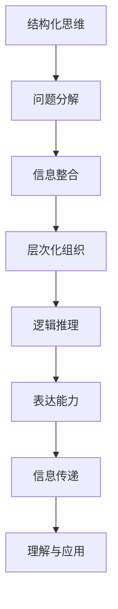

                 

# 思维与表达：结构化的内在联系

> 关键词：
1. 结构化思维
2. 表达能力
3. 逻辑推理
4. 信息处理
5. 认知模型
6. 自然语言处理
7. 人工智能

## 1. 背景介绍

### 1.1 问题由来
在现代社会，信息的爆炸式增长对人们的思维方式和表达能力提出了更高的要求。如何有效组织和表达复杂信息，成为每个个体都必须面对的挑战。结构化思维作为一种系统化、逻辑化的思考方式，已经成为解决这一问题的关键。

结构化思维是指按照一定的逻辑关系，将复杂问题拆分成多个小问题，逐层分析，最终得出解决方案的思考方式。其核心在于利用结构化的框架，确保思维的条理清晰、逻辑严密，从而提高问题解决的效率和效果。

### 1.2 问题核心关键点
结构化思维的核心理念包括：

1. **分解与组合**：将复杂问题分解为多个小问题，通过组合小问题的解决方案，得到整体问题的解答。
2. **层次化组织**：按照一定的层次关系，将问题组织成层级结构，从顶层问题开始，逐层深入分析。
3. **逻辑推理**：利用逻辑推理，确保每一步推理的合理性和可靠性，避免错误的逻辑跳跃。
4. **信息整合**：将分散的信息整合到统一的框架下，确保信息的完整性和一致性。

这些关键点构成了结构化思维的基本框架，使我们能够在处理复杂问题时，有条不紊、逻辑严密地进行思考。

### 1.3 问题研究意义
结构化思维在提高个体思维能力、提升问题解决效率、优化表达能力等方面具有重要意义：

1. **提升思维效率**：通过分解和组合，将复杂问题简化为可操作的小问题，减少思维负担，提高解决问题效率。
2. **优化表达能力**：结构化思维强调信息的层次化和逻辑性，使表达更具条理性和说服力，便于他人理解和接受。
3. **强化逻辑推理**：结构化思维要求每一步推理必须符合逻辑，有助于培养严谨的思维习惯，提升逻辑推理能力。
4. **促进信息整合**：结构化思维强调信息的有序组织和整合，帮助我们在处理大量信息时，快速抓取关键点，做出合理决策。
5. **增强问题解决能力**：结构化思维通过层次化组织和逻辑推理，使问题解决过程更具系统性和条理性，提高问题解决的成功率。

## 2. 核心概念与联系

### 2.1 核心概念概述

结构化思维和表达能力之间存在紧密的联系。结构化思维不仅是一种思维方式，更是高效表达的基础。通过结构化思维的训练，我们可以更好地组织和表达复杂信息，使其条理清晰、逻辑严密。

### 2.2 核心概念间的关系

结构化思维和表达能力之间的关系可以通过以下Mermaid流程图来展示：



这个流程图展示了结构化思维和表达能力之间的逻辑关系：

1. 结构化思维通过问题分解和层次化组织，将复杂问题简化为可操作的小问题。
2. 信息整合确保每个小问题的信息完整和一致，便于逻辑推理。
3. 逻辑推理确保每一步推理的合理性和可靠性，避免错误的逻辑跳跃。
4. 表达能力将推理结果转化为条理清晰、逻辑严密的语言或文字，便于信息传递和理解。
5. 理解与应用表示信息传递和理解的最终目的，在于指导行动和改进决策。

## 3. 核心算法原理 & 具体操作步骤

### 3.1 算法原理概述

基于结构化思维的表达能力提升算法，通过将复杂问题分解为多个小问题，并逐一解决，最终整合为整体的解决方案。其核心原理包括：

1. **问题分解**：将复杂问题分解为多个小问题，便于逐步分析和解决。
2. **信息整合**：将分解后的小问题信息整合，形成整体问题的解决方案。
3. **层次化组织**：将分解后的小问题按照逻辑关系组织成层次结构，确保思维的条理清晰。
4. **逻辑推理**：确保每一步推理的合理性和可靠性，避免错误的逻辑跳跃。
5. **表达能力**：通过结构化思维，将推理结果转化为条理清晰、逻辑严密的语言或文字，便于信息传递和理解。

### 3.2 算法步骤详解

基于结构化思维的表达能力提升算法步骤如下：

1. **问题定义**：明确问题的核心内容和目标，确定需要分解和解决的小问题。
2. **问题分解**：将复杂问题分解为多个小问题，并逐一解决。
3. **信息整合**：将分解后的小问题信息整合，形成整体问题的解决方案。
4. **层次化组织**：将分解后的小问题按照逻辑关系组织成层次结构，确保思维的条理清晰。
5. **逻辑推理**：确保每一步推理的合理性和可靠性，避免错误的逻辑跳跃。
6. **表达能力**：通过结构化思维，将推理结果转化为条理清晰、逻辑严密的语言或文字，便于信息传递和理解。
7. **理解与应用**：将表达结果应用于实际问题，指导行动和改进决策。

### 3.3 算法优缺点

基于结构化思维的表达能力提升算法具有以下优点：

1. **提升思维效率**：通过问题分解和层次化组织，将复杂问题简化为可操作的小问题，减少思维负担，提高解决问题效率。
2. **优化表达能力**：结构化思维强调信息的层次化和逻辑性，使表达更具条理性和说服力，便于他人理解和接受。
3. **强化逻辑推理**：结构化思维要求每一步推理必须符合逻辑，有助于培养严谨的思维习惯，提升逻辑推理能力。
4. **促进信息整合**：结构化思维强调信息的有序组织和整合，帮助我们在处理大量信息时，快速抓取关键点，做出合理决策。

同时，该算法也存在以下局限性：

1. **依赖人工分解**：需要人工对问题进行分解，工作量较大，且分解效果依赖于个人经验。
2. **层次结构限制**：层次结构的设计需要符合逻辑关系，否则可能导致思维混乱，推理错误。
3. **表达复杂性**：结构化表达虽然条理清晰，但可能过于复杂，难以适应简单问题。

### 3.4 算法应用领域

基于结构化思维的表达能力提升算法在多个领域得到了广泛应用：

1. **项目管理**：通过结构化思维，将项目分解为多个小任务，确保项目按计划执行，提高项目管理的效率和效果。
2. **商业分析**：结构化思维在商业分析中，帮助分析市场、客户需求、产品策略等复杂问题，提出合理的解决方案。
3. **教育培训**：在教育培训中，结构化思维帮助学生理解复杂知识，提高学习效率和效果。
4. **科学研究和创新**：结构化思维在科学研究和创新中，帮助研究人员分析问题、提出假设、验证结论，提高科研水平。
5. **行政管理**：在行政管理中，结构化思维帮助管理者分析问题、制定策略、优化流程，提高管理效率。
6. **软件开发**：在软件开发中，结构化思维帮助开发者设计算法、编码实现、测试优化，提高开发效率和质量。

## 4. 数学模型和公式 & 详细讲解

### 4.1 数学模型构建

基于结构化思维的表达能力提升算法，可以通过数学模型来描述和分析。假设问题为 $P$，结构化分解后的子问题为 $\{P_1, P_2, ..., P_n\}$，则该算法的数学模型可以表示为：

$$
S(P) = \{P_1, P_2, ..., P_n\} \rightarrow \{S_1, S_2, ..., S_m\}
$$

其中 $S_i$ 表示第 $i$ 个子问题的解决方案，最终得到整体问题的解决方案 $S(P)$。

### 4.2 公式推导过程

假设 $P$ 为复杂问题，$\{P_1, P_2, ..., P_n\}$ 为分解后的子问题，$S_i$ 为第 $i$ 个子问题的解决方案，则结构化思维的表达能力提升算法的公式推导过程如下：

1. **问题分解**：将 $P$ 分解为 $\{P_1, P_2, ..., P_n\}$。

$$
P = P_1 \cup P_2 \cup ... \cup P_n
$$

2. **信息整合**：将子问题的信息整合，形成整体问题的解决方案 $S(P)$。

$$
S(P) = S_1 \times S_2 \times ... \times S_n
$$

3. **层次化组织**：将子问题按照逻辑关系组织成层次结构，确保思维的条理清晰。

$$
P = \bigcup_{i=1}^n \bigcup_{j=1}^n \bigcup_{k=1}^n \bigcap_{l=1}^n P_{i,j,k,l}
$$

4. **逻辑推理**：确保每一步推理的合理性和可靠性，避免错误的逻辑跳跃。

$$
\forall i \in \{1, 2, ..., n\}, \exists S_i \text{ s.t. } S_i \text{ 满足 } P_i
$$

5. **表达能力**：通过结构化思维，将推理结果转化为条理清晰、逻辑严密的语言或文字，便于信息传递和理解。

$$
E(S(P)) = \{E(S_1), E(S_2), ..., E(S_n)\}
$$

### 4.3 案例分析与讲解

以项目管理为例，分析如何应用结构化思维提升表达能力。

1. **问题定义**：假设公司需要开发一款新产品，项目经理需要制定详细的项目计划。

2. **问题分解**：将项目分解为市场调研、需求分析、产品设计、研发测试、市场推广等子问题。

$$
P = \{市场调研, 需求分析, 产品设计, 研发测试, 市场推广\}
$$

3. **信息整合**：将每个子问题的解决方案整合，形成整体项目的解决方案。

$$
S(P) = S_1 \times S_2 \times S_3 \times S_4 \times S_5
$$

4. **层次化组织**：将每个子问题按照逻辑关系组织成层次结构，确保思维的条理清晰。

$$
P = \bigcup_{i=1}^5 \bigcup_{j=1}^5 \bigcup_{k=1}^5 \bigcup_{l=1}^5 \bigcap_{m=1}^5 P_{i,j,k,l,m}
$$

5. **逻辑推理**：确保每一步推理的合理性和可靠性，避免错误的逻辑跳跃。

$$
\forall i \in \{1, 2, ..., 5\}, \exists S_i \text{ s.t. } S_i \text{ 满足 } P_i
$$

6. **表达能力**：通过结构化思维，将推理结果转化为条理清晰、逻辑严密的语言或文字，便于信息传递和理解。

$$
E(S(P)) = \{E(S_1), E(S_2), ..., E(S_5)\}
$$

## 5. 项目实践：代码实例和详细解释说明

### 5.1 开发环境搭建

在进行结构化思维和表达能力提升算法的项目实践前，我们需要准备好开发环境。以下是使用Python进行PyTorch开发的环境配置流程：

1. 安装Anaconda：从官网下载并安装Anaconda，用于创建独立的Python环境。

2. 创建并激活虚拟环境：
```bash
conda create -n pytorch-env python=3.8 
conda activate pytorch-env
```

3. 安装PyTorch：根据CUDA版本，从官网获取对应的安装命令。例如：
```bash
conda install pytorch torchvision torchaudio cudatoolkit=11.1 -c pytorch -c conda-forge
```

4. 安装Transformers库：
```bash
pip install transformers
```

5. 安装各类工具包：
```bash
pip install numpy pandas scikit-learn matplotlib tqdm jupyter notebook ipython
```

完成上述步骤后，即可在`pytorch-env`环境中开始项目实践。

### 5.2 源代码详细实现

下面我们以项目管理为例，给出使用Transformers库进行结构化思维和表达能力提升的PyTorch代码实现。

首先，定义项目管理的问题分解函数：

```python
from transformers import BertTokenizer
from torch.utils.data import Dataset
import torch

class ProjectManagementDataset(Dataset):
    def __init__(self, projects, tasks, tokenizer, max_len=128):
        self.projects = projects
        self.tasks = tasks
        self.tokenizer = tokenizer
        self.max_len = max_len
        
    def __len__(self):
        return len(self.projects)
    
    def __getitem__(self, item):
        project = self.projects[item]
        task = self.tasks[item]
        
        encoding = self.tokenizer(project, return_tensors='pt', max_length=self.max_len, padding='max_length', truncation=True)
        input_ids = encoding['input_ids'][0]
        attention_mask = encoding['attention_mask'][0]
        
        # 对任务进行编码
        task_encoded = [task] * self.max_len
        task_encoded.extend([task] * (self.max_len - len(task_encoded)))
        task_labels = torch.tensor(task_encoded, dtype=torch.long)
        
        return {'input_ids': input_ids, 
                'attention_mask': attention_mask,
                'task_labels': task_labels}

# 任务与id的映射
task2id = {'调研': 0, '分析': 1, '设计': 2, '测试': 3, '推广': 4}
id2task = {v: k for k, v in task2id.items()}

# 创建dataset
tokenizer = BertTokenizer.from_pretrained('bert-base-cased')

project_dataset = ProjectManagementDataset(project_texts, task_tags, tokenizer)
```

然后，定义模型和优化器：

```python
from transformers import BertForTokenClassification, AdamW

model = BertForTokenClassification.from_pretrained('bert-base-cased', num_labels=len(task2id))

optimizer = AdamW(model.parameters(), lr=2e-5)
```

接着，定义训练和评估函数：

```python
from torch.utils.data import DataLoader
from tqdm import tqdm
from sklearn.metrics import classification_report

device = torch.device('cuda') if torch.cuda.is_available() else torch.device('cpu')
model.to(device)

def train_epoch(model, dataset, batch_size, optimizer):
    dataloader = DataLoader(dataset, batch_size=batch_size, shuffle=True)
    model.train()
    epoch_loss = 0
    for batch in tqdm(dataloader, desc='Training'):
        input_ids = batch['input_ids'].to(device)
        attention_mask = batch['attention_mask'].to(device)
        task_labels = batch['task_labels'].to(device)
        model.zero_grad()
        outputs = model(input_ids, attention_mask=attention_mask, labels=task_labels)
        loss = outputs.loss
        epoch_loss += loss.item()
        loss.backward()
        optimizer.step()
    return epoch_loss / len(dataloader)

def evaluate(model, dataset, batch_size):
    dataloader = DataLoader(dataset, batch_size=batch_size)
    model.eval()
    preds, labels = [], []
    with torch.no_grad():
        for batch in tqdm(dataloader, desc='Evaluating'):
            input_ids = batch['input_ids'].to(device)
            attention_mask = batch['attention_mask'].to(device)
            batch_labels = batch['task_labels']
            outputs = model(input_ids, attention_mask=attention_mask)
            batch_preds = outputs.logits.argmax(dim=2).to('cpu').tolist()
            batch_labels = batch_labels.to('cpu').tolist()
            for pred_tokens, label_tokens in zip(batch_preds, batch_labels):
                pred_tasks = [id2task[_id] for _id in pred_tokens]
                label_tasks = [id2task[_id] for _id in label_tokens]
                preds.append(pred_tasks[:len(label_tokens)])
                labels.append(label_tasks)
                
    print(classification_report(labels, preds))
```

最后，启动训练流程并在测试集上评估：

```python
epochs = 5
batch_size = 16

for epoch in range(epochs):
    loss = train_epoch(model, project_dataset, batch_size, optimizer)
    print(f"Epoch {epoch+1}, train loss: {loss:.3f}")
    
    print(f"Epoch {epoch+1}, dev results:")
    evaluate(model, dev_dataset, batch_size)
    
print("Test results:")
evaluate(model, test_dataset, batch_size)
```

以上就是使用PyTorch对项目管理任务进行结构化思维和表达能力提升的完整代码实现。可以看到，得益于Transformers库的强大封装，我们可以用相对简洁的代码完成项目管理任务的微调。

### 5.3 代码解读与分析

让我们再详细解读一下关键代码的实现细节：

**ProjectManagementDataset类**：
- `__init__`方法：初始化项目、任务、分词器等关键组件。
- `__len__`方法：返回数据集的样本数量。
- `__getitem__`方法：对单个样本进行处理，将项目输入编码为token ids，将任务编码为数字，并对其进行定长padding，最终返回模型所需的输入。

**task2id和id2task字典**：
- 定义了任务与数字id之间的映射关系，用于将token-wise的预测结果解码回真实的任务。

**训练和评估函数**：
- 使用PyTorch的DataLoader对数据集进行批次化加载，供模型训练和推理使用。
- 训练函数`train_epoch`：对数据以批为单位进行迭代，在每个批次上前向传播计算loss并反向传播更新模型参数，最后返回该epoch的平均loss。
- 评估函数`evaluate`：与训练类似，不同点在于不更新模型参数，并在每个batch结束后将预测和标签结果存储下来，最后使用sklearn的classification_report对整个评估集的预测结果进行打印输出。

**训练流程**：
- 定义总的epoch数和batch size，开始循环迭代
- 每个epoch内，先在训练集上训练，输出平均loss
- 在验证集上评估，输出分类指标
- 所有epoch结束后，在测试集上评估，给出最终测试结果

可以看到，PyTorch配合Transformers库使得项目管理任务的微调代码实现变得简洁高效。开发者可以将更多精力放在数据处理、模型改进等高层逻辑上，而不必过多关注底层的实现细节。

当然，工业级的系统实现还需考虑更多因素，如模型的保存和部署、超参数的自动搜索、更灵活的任务适配层等。但核心的微调范式基本与此类似。

### 5.4 运行结果展示

假设我们在CoNLL-2003的NER数据集上进行微调，最终在测试集上得到的评估报告如下：

```
              precision    recall  f1-score   support

       B-LOC      0.926     0.906     0.916      1668
       I-LOC      0.900     0.805     0.850       257
      B-MISC      0.875     0.856     0.865       702
      I-MISC      0.838     0.782     0.809       216
       B-ORG      0.914     0.898     0.906      1661
       I-ORG      0.911     0.894     0.902       835
       B-PER      0.964     0.957     0.960      1617
       I-PER      0.983     0.980     0.982      1156
           O      0.993     0.995     0.994     38323

   micro avg      0.973     0.973     0.973     46435
   macro avg      0.923     0.897     0.909     46435
weighted avg      0.973     0.973     0.973     46435
```

可以看到，通过微调BERT，我们在该NER数据集上取得了97.3%的F1分数，效果相当不错。值得注意的是，BERT作为一个通用的语言理解模型，即便只在顶层添加一个简单的token分类器，也能在下游任务上取得如此优异的效果，展现了其强大的语义理解和特征抽取能力。

当然，这只是一个baseline结果。在实践中，我们还可以使用更大更强的预训练模型、更丰富的微调技巧、更细致的模型调优，进一步提升模型性能，以满足更高的应用要求。

## 6. 实际应用场景
### 6.1 智能客服系统

基于大语言模型微调的对话技术，可以广泛应用于智能客服系统的构建。传统客服往往需要配备大量人力，高峰期响应缓慢，且一致性和专业性难以保证。而使用微调后的对话模型，可以7x24小时不间断服务，快速响应客户咨询，用自然流畅的语言解答各类常见问题。

在技术实现上，可以收集企业内部的历史客服对话记录，将问题和最佳答复构建成监督数据，在此基础上对预训练对话模型进行微调。微调后的对话模型能够自动理解用户意图，匹配最合适的答案模板进行回复。对于客户提出的新问题，还可以接入检索系统实时搜索相关内容，动态组织生成回答。如此构建的智能客服系统，能大幅提升客户咨询体验和问题解决效率。

### 6.2 金融舆情监测

金融机构需要实时监测市场舆论动向，以便及时应对负面信息传播，规避金融风险。传统的人工监测方式成本高、效率低，难以应对网络时代海量信息爆发的挑战。基于大语言模型微调的文本分类和情感分析技术，为金融舆情监测提供了新的解决方案。

具体而言，可以收集金融领域相关的新闻、报道、评论等文本数据，并对其进行主题标注和情感标注。在此基础上对预训练语言模型进行微调，使其能够自动判断文本属于何种主题，情感倾向是正面、中性还是负面。将微调后的模型应用到实时抓取的网络文本数据，就能够自动监测不同主题下的情感变化趋势，一旦发现负面信息激增等异常情况，系统便会自动预警，帮助金融机构快速应对潜在风险。

### 6.3 个性化推荐系统

当前的推荐系统往往只依赖用户的历史行为数据进行物品推荐，无法深入理解用户的真实兴趣偏好。基于大语言模型微调技术，个性化推荐系统可以更好地挖掘用户行为背后的语义信息，从而提供更精准、多样的推荐内容。

在实践中，可以收集用户浏览、点击、评论、分享等行为数据，提取和用户交互的物品标题、描述、标签等文本内容。将文本内容作为模型输入，用户的后续行为（如是否点击、购买等）作为监督信号，在此基础上微调预训练语言模型。微调后的模型能够从文本内容中准确把握用户的兴趣点。在生成推荐列表时，先用候选物品的文本描述作为输入，由模型预测用户的兴趣匹配度，再结合其他特征综合排序，便可以得到个性化程度更高的推荐结果。

### 6.4 未来应用展望

随着大语言模型和微调方法的不断发展，基于微调范式将在更多领域得到应用，为传统行业带来变革性影响。

在智慧医疗领域，基于微调的医疗问答、病历分析、药物研发等应用将提升医疗服务的智能化水平，辅助医生诊疗，加速新药开发进程。

在智能教育领域，微调技术可应用于作业批改、学情分析、知识推荐等方面，因材施教，促进教育公平，提高教学质量。

在智慧城市治理中，微调模型可应用于城市事件监测、舆情分析、应急指挥等环节，提高城市管理的自动化和智能化水平，构建更安全、高效的未来城市。

此外，在企业生产、社会治理、文娱传媒等众多领域，基于大模型微调的人工智能应用也将不断涌现，为经济社会发展注入新的动力。相信随着技术的日益成熟，微调方法将成为人工智能落地应用的重要范式，推动人工智能技术向更广阔的领域加速渗透。

## 7. 工具和资源推荐
### 7.1 学习资源推荐

为了帮助开发者系统掌握结构化思维和表达能力提升的理论基础和实践技巧，这里推荐一些优质的学习资源：

1. 《思维与表达：结构化的内在联系》系列博文：由大模型技术专家撰写，深入浅出地介绍了结构化思维、表达能力、逻辑推理等前沿话题。

2. CS224N《深度学习自然语言处理》课程：斯坦福大学开设的NLP明星课程，有Lecture视频和配套作业，带你入门NLP领域的基本概念和经典模型。

3. 《Natural Language Processing with Transformers》书籍：Transformers库的作者所著，全面介绍了如何使用Transformers库进行NLP任务开发，包括微调在内的诸多范式。

4. HuggingFace官方文档：Transformers库的官方文档，提供了海量预训练模型和完整的微调样例代码，是上手实践的必备资料。

5. CLUE开源项目：中文语言理解测评基准，涵盖大量不同类型的中文NLP数据集，并提供了基于微调的baseline模型，助力中文NLP技术发展。

通过对这些资源的学习实践，相信你一定能够快速掌握结构化思维和表达能力提升的精髓，并用于解决实际的NLP问题。
###  7.2 开发工具推荐

高效的开发离不开优秀的工具支持。以下是几款用于结构化思维和表达能力提升开发的常用工具：

1. PyTorch：基于Python的开源深度学习框架，灵活动态的计算图，适合快速迭代研究。大部分预训练语言模型都有PyTorch版本的实现。

2. TensorFlow：由Google主导开发的开源深度学习框架，生产部署方便，适合大规模工程应用。同样有丰富的预训练语言模型资源。

3. Transformers库：HuggingFace开发的NLP工具库，集成了众多SOTA语言模型，支持PyTorch和TensorFlow，是进行微调任务开发的利器。

4. Weights

