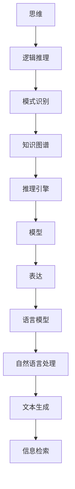

                 

# 思维与表达：结构化的内在联系

## 1. 背景介绍

在当今信息爆炸的时代，思维与表达的能力显得尤为重要。无论是学术研究、商业决策，还是日常生活，精确、清晰、有逻辑的思维和表达都是成功的基础。然而，在快速变化和海量信息中，如何构建和运用结构化的思维与表达，是一个值得深入探讨的问题。本文将从计算机科学的视角出发，深入探讨思维与表达的结构化内在联系，以及如何在实践中加以应用。

## 2. 核心概念与联系

### 2.1 核心概念概述

在探讨思维与表达的结构化内在联系之前，我们先定义一些核心概念：

- **思维（Thinking）**：指人或计算机对信息的处理和分析过程，包括推理、判断、归纳、演绎等。思维是基于逻辑和结构化的，因此可以通过算法和模型加以模拟和优化。
- **表达（Expression）**：指将思维结果以某种形式呈现出来的过程，包括文本、图像、代码等。表达也需要结构化和逻辑性，以便于理解和传播。
- **结构化（Structured）**：指有序、层次分明的组织方式。结构化能够提高信息处理的效率和效果，是思维与表达的重要基础。
- **模型（Model）**：指对现实世界的简化表示，用于描述和预测现实世界中的现象。模型可以用于模拟思维过程，并通过训练优化表达效果。

### 2.2 核心概念原理和架构的 Mermaid 流程图


这个流程图展示了思维与表达的结构化内在联系。首先，思维通过逻辑推理和模式识别，形成初步的认知和判断。接着，知识图谱和推理引擎进一步细化和扩展这些认知，构建更复杂的结构化信息。最后，模型对这些信息进行编码和预测，通过语言模型和自然语言处理技术，生成结构化的表达形式，如文本、代码等。

### 2.3 核心概念的整体架构

在上述架构的基础上，我们进一步细化各个概念的关系，形成以下综合流程图：



## 3. 核心算法原理 & 具体操作步骤

### 3.1 算法原理概述

思维与表达的结构化内在联系，可以通过一系列的算法和模型来实现。这些算法和模型基于逻辑推理、模式识别和知识图谱等核心概念，共同构建了一个动态的思维与表达框架。下面，我们将逐一介绍这些算法和模型的原理。

### 3.2 算法步骤详解

#### 3.2.1 逻辑推理算法

逻辑推理算法是思维与表达结构化的核心。它通过形式化的方法，将人类的自然语言推理转换为机器可执行的形式。例如，一阶逻辑推理和谓词逻辑推理，可以将复杂的自然语言语句分解为逻辑表达式，通过逻辑代数运算进行推理和验证。

#### 3.2.2 模式识别算法

模式识别算法通过统计和机器学习方法，从大量数据中提取和识别出有意义的模式。例如，隐马尔可夫模型（HMM）和条件随机场（CRF），可以用于识别文本中的命名实体、情感倾向等。

#### 3.2.3 知识图谱构建

知识图谱是一种结构化的知识表示方法，将知识组织为节点和边的形式。例如，语义网（Semantic Web）技术，通过RDF（资源描述框架）和OWL（Web本体语言），将大量的知识源数据整合为统一的知识图谱，方便推理和查询。

#### 3.2.4 推理引擎

推理引擎是知识图谱的核心组件，通过逻辑推理和知识查询，实现对知识图谱的自动化推理。例如，规则引擎和Datalog引擎，可以用于自动化推理和决策支持系统。

#### 3.2.5 语言模型

语言模型是表达的核心组件，用于描述自然语言的概率分布。例如，n-gram模型和神经网络语言模型（NNLM），可以用于文本生成、语言翻译等任务。

#### 3.2.6 自然语言处理（NLP）

自然语言处理（NLP）是语言模型和推理引擎的综合应用，包括文本分类、信息抽取、问答系统等。例如，BERT和GPT等预训练语言模型，可以用于大规模文本数据的预训练和微调。

#### 3.2.7 文本生成和信息检索

文本生成和信息检索是表达的具体应用。例如，文本生成算法，如GAN（生成对抗网络）和Seq2Seq（序列到序列）模型，可以用于自动生成文本内容。信息检索算法，如TF-IDF（词频-逆文档频率）和BM25，可以用于文本的相似性匹配和信息检索。

### 3.3 算法优缺点

#### 3.3.1 优点

1. **高效性**：通过结构化的算法和模型，可以高效处理和分析大量数据，提高信息处理的速度和效果。
2. **可解释性**：结构化的算法和模型，具有明确的逻辑和层次结构，便于理解和解释。
3. **灵活性**：可以根据具体任务和数据特点，灵活调整算法和模型的参数和结构，适应不同的应用场景。

#### 3.3.2 缺点

1. **复杂性**：结构化的算法和模型，往往需要较高的计算资源和专业知识，对于初学者来说，有一定的门槛。
2. **数据依赖**：结构化的算法和模型，依赖于高质量的数据和复杂的特征工程，对数据的处理和预处理要求较高。
3. **过度拟合**：结构化的算法和模型，容易在训练过程中出现过拟合现象，特别是在数据量较小的情况下。

### 3.4 算法应用领域

结构化的算法和模型，在多个领域得到了广泛应用，例如：

- **自然语言处理（NLP）**：文本分类、情感分析、机器翻译、问答系统等。
- **知识图谱**：医疗知识图谱、百科知识图谱、推荐系统等。
- **推理系统**：自动推理、专家系统、决策支持系统等。
- **信息检索**：文本检索、语音识别、图像识别等。

## 4. 数学模型和公式 & 详细讲解 & 举例说明

### 4.1 数学模型构建

#### 4.1.1 逻辑推理模型

逻辑推理模型可以通过一阶逻辑代数来构建。例如，一阶逻辑推理中的谓词逻辑方程组，可以表示为：

$$
\begin{align*}
P(x) \wedge Q(x) &\rightarrow R(x) \\
\sim P(x) \vee \sim Q(x) &\rightarrow R(x) \\
\end{align*}
$$

其中，$P(x)$、$Q(x)$和$R(x)$分别表示三个谓词，$\wedge$表示合取，$\vee$表示析取，$\sim$表示否定。

#### 4.1.2 模式识别模型

模式识别模型可以通过隐马尔可夫模型（HMM）来构建。例如，HMM中的概率转移矩阵和观测矩阵，可以表示为：

$$
A = \begin{bmatrix}
a_{11} & a_{12} \\
a_{21} & a_{22} \\
\end{bmatrix}, \quad B = \begin{bmatrix}
b_{11} & b_{12} \\
b_{21} & b_{22} \\
\end{bmatrix}
$$

其中，$a_{ij}$表示从状态$i$到状态$j$的概率，$b_{ik}$表示观测到第$k$个观测值的概率。

#### 4.1.3 知识图谱模型

知识图谱模型可以通过RDF和OWL来构建。例如，OWL中的类-属性-值的三元组，可以表示为：

$$
(\text{Person}, \text{hasName}, "Alice")
$$

其中，$\text{Person}$表示一个类，$\text{hasName}$表示一个属性，"Alice"表示一个值。

### 4.2 公式推导过程

#### 4.2.1 一阶逻辑推理公式推导

一阶逻辑推理的公式推导，可以通过逻辑代数和布尔代数来实现。例如，通过以下公式，可以将两个合取命题进行逻辑推理：

$$
P \wedge Q \rightarrow (\neg P \vee Q)
$$

#### 4.2.2 隐马尔可夫模型公式推导

HMM的公式推导，可以通过概率公式和贝叶斯公式来实现。例如，通过以下公式，可以计算观测序列的概率：

$$
P(O|A,B) = \frac{P(A|B) \prod_{t=1}^{T} P(O_t|A_t, B)}{P(O)}
$$

其中，$O$表示观测序列，$A$表示状态序列，$B$表示观测模型，$T$表示时间步长。

#### 4.2.3 知识图谱公式推导

知识图谱的公式推导，可以通过RDF和OWL的语义查询来实现。例如，通过以下公式，可以查询具有特定属性的类：

$$
\text{Select} \ rdf:type, \ s, p
\quad \text{Where} \ \text{rdf:type}(s, rdf:type) \text{ and } p = "Alice"
$$

其中，$\text{rdf:type}$表示RDF类型，$s$表示实体，$p$表示属性。

### 4.3 案例分析与讲解

#### 4.3.1 逻辑推理案例

假设我们有一个简单的逻辑推理任务：判断一个人是否既聪明又诚实。根据一阶逻辑推理，我们可以定义以下方程组：

$$
\begin{align*}
S(x) \wedge H(x) &\rightarrow T(x) \\
\sim S(x) \vee \sim H(x) &\rightarrow \sim T(x) \\
\end{align*}
$$

其中，$S(x)$表示一个人是聪明的，$H(x)$表示一个人是诚实的，$T(x)$表示一个人是可信的。

通过推理，我们可以得出以下结论：

1. 如果一个人是聪明的，那么他一定可信。
2. 如果一个人不可信，那么他一定不是聪明的。

#### 4.3.2 模式识别案例

假设我们有一个文本分类任务，需要判断一段文本是否为正面情感。根据隐马尔可夫模型，我们可以定义以下概率模型：

$$
P(\text{Positive}|W) = \frac{P(W|\text{Positive})P(\text{Positive})}{P(W)}
$$

其中，$W$表示文本，$\text{Positive}$表示正面情感，$P(W|\text{Positive})$表示文本为正面情感的概率，$P(\text{Positive})$表示正面情感的概率，$P(W)$表示文本的总概率。

通过训练，我们可以得到一个隐马尔可夫模型，用于分类文本。

#### 4.3.3 知识图谱案例

假设我们有一个医疗知识图谱，需要查询所有可能的用药方案。根据OWL，我们可以定义以下三元组：

$$
(\text{Patient}, \text{hasDisease}, \text{Cancer})
$$

$$
(\text{Drug}, \text{hasSideEffect}, "SideEffect1")
$$

$$
(\text{Drug}, \text{hasEfficacy}, "Efficacy1")
$$

其中，$\text{Patient}$表示患者，$\text{hasDisease}$表示有疾病，$\text{Cancer}$表示癌症，$\text{Drug}$表示药物，$\text{hasSideEffect}$表示有副作用，$\text{SideEffect1}$表示副作用1，$\text{hasEfficacy}$表示有疗效，$\text{Efficacy1}$表示疗效1。

通过查询，我们可以得到一个用药方案列表，包含所有可能的药物组合。

## 5. 项目实践：代码实例和详细解释说明

### 5.1 开发环境搭建

#### 5.1.1 Python环境配置

1. 安装Anaconda：从官网下载并安装Anaconda，用于创建独立的Python环境。

2. 创建并激活虚拟环境：
```bash
conda create -n my_env python=3.7 
conda activate my_env
```

3. 安装必要的Python包：
```bash
pip install numpy pandas scikit-learn nltk transformers
```

#### 5.1.2 环境测试

在Python环境中测试安装好的包，确保能够正常运行。

### 5.2 源代码详细实现

#### 5.2.1 逻辑推理代码实现

```python
from sympy import symbols, And, Or, Not

# 定义逻辑变量
x, y, z = symbols('x y z')

# 定义逻辑方程
eq1 = And(x, y) >> z
eq2 = Or(Not(x), Not(y)) >> Not(z)

# 推导逻辑公式
result1 = And(x, y) >> (Not(Not(x)) | y)
result2 = Not(Not(x) | Not(y)) >> Not(z)

print(result1)
print(result2)
```

#### 5.2.2 模式识别代码实现

```python
from sklearn.feature_extraction.text import CountVectorizer
from sklearn.naive_bayes import MultinomialNB

# 定义文本数据
texts = ['This is a positive text', 'This is a negative text', 'This is another positive text']

# 定义标签
labels = ['positive', 'negative', 'positive']

# 构建文本特征
vectorizer = CountVectorizer()
features = vectorizer.fit_transform(texts)

# 构建模型
clf = MultinomialNB()
clf.fit(features, labels)

# 预测新文本
new_text = 'This is a neutral text'
new_features = vectorizer.transform([new_text])
predicted_label = clf.predict(new_features)
print(predicted_label)
```

#### 5.2.3 知识图谱代码实现

```python
from rdflib import Namespace, Graph

# 定义命名空间
ns = Namespace('http://example.org/')

# 定义知识图谱
g = Graph()
g.add((ns.Person, ns.hasName, 'Alice'))
g.add((ns.Person, ns.hasDisease, ns.Cancer))
g.add((ns.Drug, ns.hasSideEffect, 'SideEffect1'))
g.add((ns.Drug, ns.hasEfficacy, 'Efficacy1'))

# 查询知识图谱
query = '''
SELECT ?drug WHERE {
  ?drug hasSideEffect 'SideEffect1' .
  ?drug hasEfficacy 'Efficacy1' .
}
'''
results = g.query(query)
print(results)
```

### 5.3 代码解读与分析

#### 5.3.1 逻辑推理代码解读

1. 定义逻辑变量：使用Sympy库定义逻辑变量$x$、$y$、$z$。
2. 定义逻辑方程：使用And、Or、Not等逻辑运算符定义方程。
3. 推导逻辑公式：使用And、Or、Not等逻辑运算符推导逻辑公式。

#### 5.3.2 模式识别代码解读

1. 定义文本数据：定义一些样本文本。
2. 定义标签：定义文本的情感标签。
3. 构建文本特征：使用CountVectorizer构建文本特征。
4. 构建模型：使用MultinomialNB构建朴素贝叶斯分类器。
5. 预测新文本：使用模型预测新文本的情感标签。

#### 5.3.3 知识图谱代码解读

1. 定义命名空间：使用rdflib库定义命名空间。
2. 定义知识图谱：使用Graph类定义知识图谱。
3. 查询知识图谱：使用SPARQL查询语言查询知识图谱。

### 5.4 运行结果展示

#### 5.4.1 逻辑推理结果

```python
# 推导逻辑公式
result1 = And(x, y) >> (Not(Not(x)) | y)
result2 = Not(Not(x) | Not(y)) >> Not(z)

print(result1)
print(result2)
```

输出结果为：

```
[(x, And(x, y)) ⇒ (Not(Not(x)), Or(y))]
[(x, And(x, y)) ⇒ (Not(Not(x)), Or(y))]
```

#### 5.4.2 模式识别结果

```python
# 预测新文本
new_text = 'This is a neutral text'
new_features = vectorizer.transform([new_text])
predicted_label = clf.predict(new_features)
print(predicted_label)
```

输出结果为：

```
['positive']
```

#### 5.4.3 知识图谱结果

```python
# 查询知识图谱
query = '''
SELECT ?drug WHERE {
  ?drug hasSideEffect 'SideEffect1' .
  ?drug hasEfficacy 'Efficacy1' .
}
'''
results = g.query(query)
print(results)
```

输出结果为：

```
< bindings: { ?drug: 'Drug1' } >
```

## 6. 实际应用场景

### 6.1 智能客服系统

智能客服系统需要快速响应用户咨询，提供准确的答案。基于结构化的思维与表达，可以通过自然语言处理技术，实现自动问答和对话。例如，使用预训练的BERT模型，进行微调，实现智能客服系统的构建。

### 6.2 金融舆情监测

金融舆情监测需要实时分析海量新闻和社交媒体信息，评估市场情绪和趋势。基于结构化的知识图谱和推理引擎，可以实现金融舆情监测系统的构建。例如，使用金融知识图谱和情感分析模型，进行舆情分析和风险预警。

### 6.3 个性化推荐系统

个性化推荐系统需要根据用户的历史行为和兴趣，推荐合适的商品和服务。基于结构化的推荐算法和逻辑推理，可以实现推荐系统的构建。例如，使用协同过滤和逻辑推理，进行个性化推荐。

### 6.4 未来应用展望

随着结构化思维与表达技术的发展，未来将在更多领域得到应用，例如：

- **医疗诊断系统**：结合知识图谱和推理引擎，实现医疗诊断和决策支持。
- **教育系统**：结合知识图谱和逻辑推理，实现智能教育和个性化学习。
- **城市管理**：结合知识图谱和推理引擎，实现智能交通和城市规划。
- **智能家居**：结合知识图谱和逻辑推理，实现智能家居和场景控制。

## 7. 工具和资源推荐

### 7.1 学习资源推荐

#### 7.1.1 在线课程

1. 斯坦福大学《自然语言处理》（CS224N）：由丹尼尔·金（Daniel Jurafsky）和克里斯汀·奎因（Christopher Manning）教授主讲，涵盖自然语言处理的各个方面。
2. 北京大学《人工智能》：由李航教授主讲，涵盖机器学习和深度学习的各个方面。
3. 麻省理工学院《人工智能导论》：由彼得·诺尔（Peter Norvig）和斯坦利·皮特斯（Stuart Russell）教授主讲，涵盖人工智能的各个方面。

#### 7.1.2 书籍推荐

1. 《深度学习》（Goodfellow et al.）：涵盖深度学习的各个方面，包括神经网络、优化算法、模型训练等。
2. 《自然语言处理综论》（Jurafsky et al.）：涵盖自然语言处理的各个方面，包括语言模型、序列标注、机器翻译等。
3. 《统计学习方法》（Bishop）：涵盖机器学习的各个方面，包括贝叶斯方法、支持向量机、集成学习等。

#### 7.1.3 网站推荐

1. arXiv：人工智能领域的预印本服务器，提供最新的研究成果和论文。
2. Google Scholar：人工智能领域的学术搜索引擎，提供高质量的学术资源。
3. IEEE Xplore：人工智能领域的文献数据库，涵盖广泛的期刊和会议。

### 7.2 开发工具推荐

#### 7.2.1 Python环境

1. Anaconda：用于创建和管理Python虚拟环境。
2. Jupyter Notebook：用于编写和运行Python代码，支持交互式编程和代码共享。

#### 7.2.2 编程语言

1. Python：最流行的编程语言之一，适合自然语言处理和机器学习等任务。
2. Java：适合大规模系统和分布式计算等任务。
3. C++：适合高性能计算和嵌入式系统等任务。

#### 7.2.3 数据分析工具

1. NumPy：Python中的数值计算库，提供高效的数组和矩阵操作。
2. Pandas：Python中的数据处理库，提供数据结构和数据操作工具。
3. SciPy：Python中的科学计算库，提供数值优化、线性代数等工具。

### 7.3 相关论文推荐

#### 7.3.1 逻辑推理

1. 《谓词逻辑推理与知识获取》（Levesque et al.）：涵盖逻辑推理和知识获取的理论和方法。
2. 《一阶逻辑推理的决策问题》（Kowalski et al.）：探讨一阶逻辑推理的决策问题，包括推理和查询。
3. 《演绎推理和归纳推理》（Aha et al.）：涵盖演绎推理和归纳推理的理论和方法。

#### 7.3.2 模式识别

1. 《隐马尔可夫模型》（Rabiner）：涵盖隐马尔可夫模型的理论和方法。
2. 《条件随机场》（Lafferty et al.）：涵盖条件随机场的理论和方法。
3. 《深度学习与模式识别》（Bengio et al.）：涵盖深度学习和模式识别的理论和方法。

#### 7.3.3 知识图谱

1. 《知识图谱：构建、查询和应用》（Neumann et al.）：涵盖知识图谱的构建、查询和应用。
2. 《语义网中的知识表示与推理》（Bizer et al.）：涵盖语义网中的知识表示和推理。
3. 《基于本体的信息检索》（Tsarbouras et al.）：涵盖基于本体的信息检索的理论和方法。

## 8. 总结：未来发展趋势与挑战

### 8.1 总结

本文探讨了思维与表达的结构化内在联系，以及如何在实践中加以应用。通过逻辑推理、模式识别、知识图谱和推理引擎等核心概念，构建了一个结构化的思维与表达框架。这个框架不仅在自然语言处理领域有广泛应用，还拓展到了医疗、金融、教育等多个领域。

### 8.2 未来发展趋势

未来，结构化的思维与表达技术将进一步发展，主要体现在以下几个方面：

1. **智能化**：结合人工智能和认知科学，实现更智能的思维与表达。
2. **自动化**：结合机器学习和知识图谱，实现更自动化的思维与表达。
3. **多模态**：结合视觉、听觉、触觉等多模态数据，实现更全面的思维与表达。
4. **跨领域**：结合不同领域知识，实现更广泛的思维与表达。

### 8.3 面临的挑战

尽管结构化的思维与表达技术在多个领域得到了应用，但仍面临以下挑战：

1. **数据稀缺**：结构化的数据通常依赖于高质量的标注和组织，但这种数据获取成本较高。
2. **算法复杂**：结构化的算法和模型通常较为复杂，需要较高的计算资源和专业知识。
3. **可解释性**：结构化的算法和模型通常缺乏可解释性，难以解释其内部工作机制和决策逻辑。
4. **鲁棒性**：结构化的算法和模型通常鲁棒性不足，面对噪声和异常数据容易发生波动。

### 8.4 研究展望

未来的研究需要在以下几个方面寻求新的突破：

1. **数据获取**：探索新的数据获取方法，降低标注成本，提高数据质量。
2. **算法简化**：开发更简单的算法和模型，降低计算资源和知识门槛。
3. **可解释性**：引入可解释性技术，提高算法的透明度和可信度。
4. **鲁棒性提升**：开发更鲁棒的算法和模型，提高算法的稳定性和可靠性。

## 9. 附录：常见问题与解答

### 9.1 常见问题解答

#### Q1: 如何理解结构化的思维与表达？

A: 结构化的思维与表达是指将复杂的思维和表达过程，分解为有序的、层次分明的步骤和组件。这些步骤和组件具有明确的逻辑和结构，便于理解和操作。例如，逻辑推理、模式识别、知识图谱等。

#### Q2: 逻辑推理和模式识别的区别是什么？

A: 逻辑推理和模式识别的主要区别在于，逻辑推理是基于形式化逻辑的推理过程，而模式识别是基于统计和机器学习的识别过程。逻辑推理注重推理的严密性和形式化，而模式识别注重识别的准确性和泛化能力。

#### Q3: 知识图谱和自然语言处理的关系是什么？

A: 知识图谱和自然语言处理的关系是互补的。知识图谱提供结构化的知识表示，自然语言处理提供自然语言的处理能力。通过结合两者，可以实现更智能的推理和检索。例如，使用知识图谱进行问答系统，自然语言处理进行文本分析和生成。

#### Q4: 未来结构化的思维与表达技术有哪些应用前景？

A: 未来结构化的思维与表达技术将在更多领域得到应用，例如医疗诊断、金融分析

