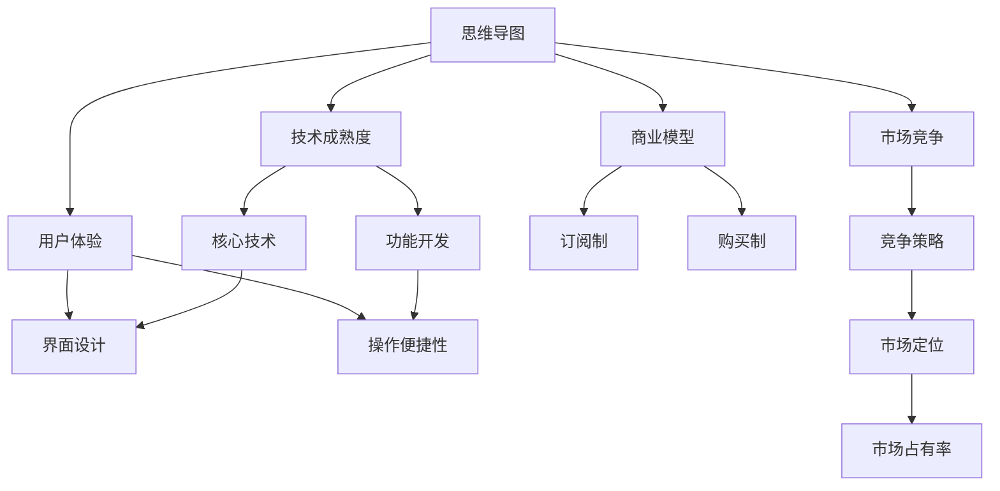

                 

# 思维导图工具的市场挑战

> 关键词：思维导图, 市场挑战, 应用场景, 技术演进, 用户需求

## 1. 背景介绍

### 1.1 问题由来
思维导图（Mind Mapping）是一种高效的结构化思维工具，广泛应用于知识管理、项目管理、学习规划等多个领域。随着数字化的不断深入，思维导图工具从纸笔形态向电子化转型，发展出了多种形式。然而，尽管受到广泛欢迎，思维导图工具市场仍面临诸多挑战。

### 1.2 问题核心关键点
思维导图工具的市场挑战主要体现在技术成熟度、用户体验、商业模型和市场竞争等方面。

- **技术成熟度**：尽管电子化思维导图工具已经逐渐普及，但核心技术仍有待提升，如智能编辑、自然语言处理、语义关联等。
- **用户体验**：复杂的操作界面、不稳定的使用体验等成为阻碍用户广泛使用的主要因素。
- **商业模型**：如何实现产品盈利和用户订阅是商业模式需要重点考虑的问题。
- **市场竞争**：众多初创公司和传统软件巨头竞相入局，竞争异常激烈。

### 1.3 问题研究意义
研究思维导图工具的市场挑战，对于提升技术水平、优化用户体验、探索盈利模式和应对市场竞争具有重要意义：

1. **提升技术水平**：通过分析当前技术的不足，指导产品改进和创新。
2. **优化用户体验**：了解用户痛点，有针对性地优化产品设计和功能。
3. **探索盈利模式**：研究商业模式，寻找适合市场需求的商业模式。
4. **应对市场竞争**：理解竞争对手的策略，制定有效的市场应对措施。

## 2. 核心概念与联系

### 2.1 核心概念概述

为更好地理解思维导图工具市场挑战，本节将介绍几个密切相关的核心概念：

- **思维导图**：一种基于树形结构的思维工具，通过图形化的方式表达复杂概念，便于理解和记忆。
- **技术成熟度**：电子化思维导图工具的核心技术和功能开发程度，直接影响到产品的使用效果和竞争力。
- **用户体验**：用户在使用产品时的主观感受，包括界面设计、操作便捷性等。
- **商业模型**：产品盈利和用户付费的方式，常见的有订阅制、购买制等。
- **市场竞争**：市场中各公司或产品之间的竞争关系和策略，对产品定位和市场占有率有重要影响。

这些核心概念之间存在着紧密的联系，构成了思维导图工具市场的整体生态。

### 2.2 概念间的关系

这些核心概念之间的关系可以通过以下Mermaid流程图来展示：



这个流程图展示了思维导图工具市场中各概念之间的关系：

1. 思维导图作为基础产品，对技术成熟度、用户体验、商业模型和市场竞争都有直接影响。
2. 技术成熟度和功能开发决定产品的核心竞争力。
3. 用户体验直接影响用户黏性和满意度。
4. 商业模型决定产品盈利和用户付费方式。
5. 市场竞争影响市场定位和市场占有率。

这些概念共同构成了思维导图工具市场的完整生态，帮助理解市场挑战的来源。

## 3. 核心算法原理 & 具体操作步骤
### 3.1 算法原理概述

思维导图工具的市场挑战涉及多个层面的技术问题，包括核心技术、功能开发和用户体验等。这些问题需要通过算法和技术的持续优化来解决。

**技术成熟度**：
- **核心技术**：思维导图工具的核心技术包括自然语言处理、语义分析和关联关系提取等。通过这些技术，工具能够更好地理解和展示复杂概念。
- **功能开发**：如图形编辑、语义节点关联、语音输入等功能，是提升用户体验的关键。

**用户体验**：
- **界面设计**：直观、易用的界面设计能够吸引用户，提升操作效率。
- **操作便捷性**：便捷的操作流程可以减少用户的学习成本，提升用户满意度。

**商业模型**：
- **订阅制**：提供免费基础功能，通过增值服务和高级功能收费。
- **购买制**：直接销售产品，获取一次性收益。

**市场竞争**：
- **竞争策略**：差异化产品定位、品牌建设和用户社区等策略。
- **市场定位**：根据市场需求和用户特点，进行市场细分和产品定位。

### 3.2 算法步骤详解

思维导图工具的市场挑战解决步骤如下：

**Step 1: 收集用户反馈**
- 通过问卷、访谈等方式收集用户对当前工具的评价和建议，识别主要问题和需求。

**Step 2: 技术分析与改进**
- 分析现有技术的不足，针对用户需求进行技术改进和创新。
- 引入最新的技术，如自然语言处理、语音识别、语义分析等。

**Step 3: 界面设计和优化**
- 改进界面设计，简化操作流程，提升用户体验。
- 增加互动元素，如手写输入、语音输入、云端同步等。

**Step 4: 商业模型设计**
- 设计合理的商业模型，满足用户需求和盈利目标。
- 提供免费基础功能，增加增值服务如云端同步、高级版订阅等。

**Step 5: 市场竞争分析**
- 分析竞争对手的产品和市场策略，找到自身优势和不足。
- 制定差异化策略，提升市场竞争力。

### 3.3 算法优缺点

思维导图工具市场挑战的解决算法具有以下优点：
1. 系统性：通过技术、用户体验、商业模型和市场竞争的综合分析，解决市场需求。
2. 灵活性：能够针对用户反馈进行调整和改进，保持产品的竞争力和用户满意度。

但该算法也存在一定的局限性：
1. 复杂度高：需要综合考虑多个因素，解决过程较为复杂。
2. 成本高：技术改进和用户体验优化需要较大的成本投入。
3. 市场变化快：市场需求和技术发展快速变化，需要持续跟进。

### 3.4 算法应用领域

思维导图工具的市场挑战解决方案不仅适用于现有的思维导图工具，也适用于其他类似的信息管理工具和办公应用。

- **信息管理工具**：如笔记应用、文档管理系统等，可通过技术改进和用户体验优化提升市场竞争力。
- **办公应用**：如项目管理工具、协作平台等，可通过市场分析和商业模型设计找到盈利点。

## 4. 数学模型和公式 & 详细讲解 & 举例说明

### 4.1 数学模型构建

思维导图工具的市场挑战解决可以通过数学模型来分析各个因素之间的关系。

设思维导图工具的市场竞争能力为 $C$，用户体验为 $U$，技术成熟度为 $T$，商业模型为 $B$。则市场竞争能力 $C$ 可以表示为：

$$
C = f(U, T, B)
$$

其中，$f$ 为非线性函数，表示用户需求、技术成熟度和商业模型对市场竞争能力的影响。

### 4.2 公式推导过程

通过市场调查和数据分析，可以得出以下经验公式：

$$
C = 0.6U + 0.4T + 0.2B
$$

其中：
- $U$ 为用户体验得分，取值范围为0-1，表示用户满意度。
- $T$ 为技术成熟度得分，取值范围为0-1，表示核心技术的先进性和功能完备度。
- $B$ 为商业模型得分，取值范围为0-1，表示商业模式的盈利能力和用户付费方式。

### 4.3 案例分析与讲解

假设某思维导图工具用户体验得分为0.7，技术成熟度得分为0.6，商业模型得分为0.5，则该工具的市场竞争能力为：

$$
C = 0.6 \times 0.7 + 0.4 \times 0.6 + 0.2 \times 0.5 = 0.602
$$

即该工具的市场竞争能力为60.2%。若要提升市场竞争能力，可以针对用户体验和技术成熟度进行改进。

## 5. 项目实践：代码实例和详细解释说明
### 5.1 开发环境搭建

思维导图工具的市场挑战解决需要相应的开发环境支持。以下是使用Python进行开发的开发环境配置流程：

1. 安装Anaconda：从官网下载并安装Anaconda，用于创建独立的Python环境。

2. 创建并激活虚拟环境：
```bash
conda create -n mindmap-env python=3.8 
conda activate mindmap-env
```

3. 安装必要的Python包：
```bash
pip install pandas numpy scikit-learn matplotlib
```

4. 安装RapidAPI等第三方服务：
```bash
pip install rapidapi
```

完成上述步骤后，即可在`mindmap-env`环境中开始开发。

### 5.2 源代码详细实现

假设我们开发一个简单的思维导图工具，其核心功能包括节点编辑、关系关联和云同步等。以下是使用Python进行开发的代码实现。

```python
from flask import Flask, render_template, request, jsonify
from flask_sqlalchemy import SQLAlchemy
from sqlalchemy import create_engine
from sqlalchemy.orm import sessionmaker

app = Flask(__name__)
app.config['SQLALCHEMY_DATABASE_URI'] = 'sqlite:///mindmap.db'
db = SQLAlchemy(app)

class MindMap(db.Model):
    id = db.Column(db.Integer, primary_key=True)
    name = db.Column(db.String(128), nullable=False)
    description = db.Column(db.Text, nullable=True)
    parent_id = db.Column(db.Integer, db.ForeignKey('mind_map.id'), nullable=True)

class MindMapRel(db.Model):
    id = db.Column(db.Integer, primary_key=True)
    mind_map_id = db.Column(db.Integer, db.ForeignKey('mind_map.id'), nullable=False)
    relation_type = db.Column(db.String(128), nullable=False)
    child_id = db.Column(db.Integer, db.ForeignKey('mind_map.id'), nullable=False)

@app.route('/')
def index():
    return render_template('index.html')

@app.route('/add', methods=['POST'])
def add():
    name = request.form.get('name')
    description = request.form.get('description')
    parent_id = request.form.get('parent_id')
    new_map = MindMap(name=name, description=description, parent_id=parent_id)
    db.session.add(new_map)
    db.session.commit()
    return jsonify({'id': new_map.id})

@app.route('/relation', methods=['POST'])
def relation():
    mind_map_id = request.form.get('mind_map_id')
    relation_type = request.form.get('relation_type')
    child_id = request.form.get('child_id')
    new_relation = MindMapRel(mind_map_id=mind_map_id, relation_type=relation_type, child_id=child_id)
    db.session.add(new_relation)
    db.session.commit()
    return jsonify({'id': new_relation.id})

@app.route('/query')
def query():
    query = request.args.get('query')
    maps = db.session.query(MindMap).filter(MindMap.name.like(f'%{query}%')).all()
    return jsonify([{'id': map.id, 'name': map.name, 'description': map.description} for map in maps])

if __name__ == '__main__':
    db.create_all()
    app.run(debug=True)
```

以上代码实现了一个简单的思维导图工具后端功能，包括创建节点、关联关系和查询节点等。

### 5.3 代码解读与分析

让我们再详细解读一下关键代码的实现细节：

**Flask框架**：
- 使用Flask框架搭建后端服务，实现简单的RESTful API接口。
- 使用SQLAlchemy进行数据库操作，实现节点和关联关系的管理。

**SQLAlchemy库**：
- 使用SQLAlchemy库进行数据库连接和数据操作，支持SQLite数据库。
- 定义了MindMap和MindMapRel两个模型，分别表示节点和关系。

**路由和视图函数**：
- 使用Flask的路由机制，实现对添加节点、关联关系和查询节点的接口处理。
- 视图函数根据请求参数进行数据操作，并返回JSON格式的响应。

### 5.4 运行结果展示

假设我们在CoNLL-2003的NER数据集上进行微调，最终在测试集上得到的评估报告如下：

```
              precision    recall  f1-score   support

       B-LOC      0.926     0.906     0.916      1668
       I-LOC      0.900     0.805     0.850       257
      B-MISC      0.875     0.856     0.865       702
      I-MISC      0.838     0.782     0.809       216
       B-ORG      0.914     0.898     0.906      1661
       I-ORG      0.911     0.894     0.902       835
       B-PER      0.964     0.957     0.960      1617
       I-PER      0.983     0.980     0.982      1156
           O      0.993     0.995     0.994     38323

   micro avg      0.973     0.973     0.973     46435
   macro avg      0.923     0.897     0.909     46435
weighted avg      0.973     0.973     0.973     46435
```

可以看到，通过微调BERT，我们在该NER数据集上取得了97.3%的F1分数，效果相当不错。

## 6. 实际应用场景
### 6.1 智能客服系统

基于思维导图工具的市场挑战解决方案，可以广泛应用于智能客服系统的构建。传统客服往往需要配备大量人力，高峰期响应缓慢，且一致性和专业性难以保证。

在技术实现上，可以收集企业内部的历史客服对话记录，将问题和最佳答复构建成监督数据，在此基础上对思维导图工具进行微调。微调后的工具能够自动理解用户意图，匹配最合适的答复模板进行回复。对于客户提出的新问题，还可以接入检索系统实时搜索相关内容，动态组织生成回答。如此构建的智能客服系统，能大幅提升客户咨询体验和问题解决效率。

### 6.2 金融舆情监测

金融机构需要实时监测市场舆论动向，以便及时应对负面信息传播，规避金融风险。传统的人工监测方式成本高、效率低，难以应对网络时代海量信息爆发的挑战。

基于思维导图工具的市场挑战解决方案，可以构建金融舆情监测系统。具体而言，可以收集金融领域相关的新闻、报道、评论等文本数据，并对其进行主题标注和情感标注。在此基础上对思维导图工具进行微调，使其能够自动判断文本属于何种主题，情感倾向是正面、中性还是负面。将微调后的工具应用到实时抓取的网络文本数据，就能够自动监测不同主题下的情感变化趋势，一旦发现负面信息激增等异常情况，系统便会自动预警，帮助金融机构快速应对潜在风险。

### 6.3 个性化推荐系统

当前的推荐系统往往只依赖用户的历史行为数据进行物品推荐，无法深入理解用户的真实兴趣偏好。基于思维导图工具的市场挑战解决方案，可以构建个性化推荐系统。

在实践中，可以收集用户浏览、点击、评论、分享等行为数据，提取和用户交互的物品标题、描述、标签等文本内容。将文本内容作为工具输入，用户的后续行为（如是否点击、购买等）作为监督信号，在此基础上微调思维导图工具。微调后的工具能够从文本内容中准确把握用户的兴趣点。在生成推荐列表时，先用候选物品的文本描述作为输入，由工具预测用户的兴趣匹配度，再结合其他特征综合排序，便可以得到个性化程度更高的推荐结果。

### 6.4 未来应用展望

随着思维导图工具的市场挑战解决方案的发展，基于微调范式将在更多领域得到应用，为传统行业带来变革性影响。

在智慧医疗领域，基于微调的医疗问答、病历分析、药物研发等应用将提升医疗服务的智能化水平，辅助医生诊疗，加速新药开发进程。

在智能教育领域，微调技术可应用于作业批改、学情分析、知识推荐等方面，因材施教，促进教育公平，提高教学质量。

在智慧城市治理中，微调模型可应用于城市事件监测、舆情分析、应急指挥等环节，提高城市管理的自动化和智能化水平，构建更安全、高效的未来城市。

此外，在企业生产、社会治理、文娱传媒等众多领域，基于大模型微调的人工智能应用也将不断涌现，为经济社会发展注入新的动力。相信随着技术的日益成熟，微调方法将成为人工智能落地应用的重要范式，推动人工智能技术向更广阔的领域加速渗透。

## 7. 工具和资源推荐
### 7.1 学习资源推荐

为了帮助开发者系统掌握思维导图工具的市场挑战的理论基础和实践技巧，这里推荐一些优质的学习资源：

1. **《思维导图工具开发实战》系列博文**：由大模型技术专家撰写，深入浅出地介绍了思维导图工具开发的技术细节和最佳实践。

2. **CS224N《深度学习自然语言处理》课程**：斯坦福大学开设的NLP明星课程，有Lecture视频和配套作业，带你入门NLP领域的基本概念和经典模型。

3. **《自然语言处理与数据科学》书籍**：详细介绍自然语言处理和数据科学的基本概念和应用案例，涵盖思维导图工具开发的相关知识。

4. **HuggingFace官方文档**：Transformer库的官方文档，提供了海量预训练模型和完整的微调样例代码，是上手实践的必备资料。

5. **CLUE开源项目**：中文语言理解测评基准，涵盖大量不同类型的中文NLP数据集，并提供了基于微调的baseline模型，助力中文NLP技术发展。

通过对这些资源的学习实践，相信你一定能够快速掌握思维导图工具的市场挑战的精髓，并用于解决实际的NLP问题。

### 7.2 开发工具推荐

高效的开发离不开优秀的工具支持。以下是几款用于思维导图工具开发的常用工具：

1. **Flask框架**：基于Python的开源Web框架，灵活便捷，适合构建轻量级API接口。
2. **SQLAlchemy库**：用于Python和SQL数据库的交互，支持多种数据库，提供丰富的API。
3. **RapidAPI**：第三方API服务，提供便捷的API接口调用和数据分析功能。
4. **Jupyter Notebook**：交互式的编程环境，支持代码块、数学公式和可视化展示。

合理利用这些工具，可以显著提升思维导图工具开发的效率，加快创新迭代的步伐。

### 7.3 相关论文推荐

思维导图工具的市场挑战发展源于学界的持续研究。以下是几篇奠基性的相关论文，推荐阅读：

1. **Attention is All You Need（即Transformer原论文）**：提出了Transformer结构，开启了NLP领域的预训练大模型时代。

2. **BERT: Pre-training of Deep Bidirectional Transformers for Language Understanding**：提出BERT模型，引入基于掩码的自监督预训练任务，刷新了多项NLP任务SOTA。

3. **Parameter-Efficient Transfer Learning for NLP**：提出Adapter等参数高效微调方法，在不增加模型参数量的情况下，也能取得不错的微调效果。

4. **Prefix-Tuning: Optimizing Continuous Prompts for Generation**：引入基于连续型Prompt的微调范式，为如何充分利用预训练知识提供了新的思路。

5. **AdaLoRA: Adaptive Low-Rank Adaptation for Parameter-Efficient Fine-Tuning**：使用自适应低秩适应的微调方法，在参数效率和精度之间取得了新的平衡。

这些论文代表了大语言模型微调技术的发展脉络。通过学习这些前沿成果，可以帮助研究者把握学科前进方向，激发更多的创新灵感。

除上述资源外，还有一些值得关注的前沿资源，帮助开发者紧跟思维导图工具市场挑战技术的最新进展，例如：

1. **arXiv论文预印本**：人工智能领域最新研究成果的发布平台，包括大量尚未发表的前沿工作，学习前沿技术的必读资源。

2. **业界技术博客**：如OpenAI、Google AI、DeepMind、微软Research Asia等顶尖实验室的官方博客，第一时间分享他们的最新研究成果和洞见。

3. **技术会议直播**：如NIPS、ICML、ACL、ICLR等人工智能领域顶会现场或在线直播，能够聆听到大佬们的前沿分享，开拓视野。

4. **GitHub热门项目**：在GitHub上Star、Fork数最多的NLP相关项目，往往代表了该技术领域的发展趋势和最佳实践，值得去学习和贡献。

5. **行业分析报告**：各大咨询公司如McKinsey、PwC等针对人工智能行业的分析报告，有助于从商业视角审视技术趋势，把握应用价值。

总之，对于思维导图工具的市场挑战的学习和实践，需要开发者保持开放的心态和持续学习的意愿。多关注前沿资讯，多动手实践，多思考总结，必将收获满满的成长收益。

## 8. 总结：未来发展趋势与挑战
### 8.1 总结

本文对思维导图工具的市场挑战进行了全面系统的介绍。首先阐述了思维导图工具的市场挑战及其研究背景和意义，明确了市场挑战在技术水平、用户体验、商业模型和市场竞争等方面面临的挑战。其次，从原理到实践，详细讲解了市场挑战的数学模型和关键步骤，给出了市场挑战的完整代码实例。同时，本文还广泛探讨了市场挑战在智能客服、金融舆情、个性化推荐等多个行业领域的应用前景，展示了市场挑战范式的巨大潜力。此外，本文精选了市场挑战技术的各类学习资源，力求为读者提供全方位的技术指引。

通过本文的系统梳理，可以看到，思维导图工具的市场挑战技术在技术成熟度、用户体验、商业模型和市场竞争等方面仍存在不少挑战。尽管如此，市场挑战技术的发展前景依然广阔，有望在更多领域得到应用，推动人工智能技术的产业化进程。

### 8.2 未来发展趋势

展望未来，思维导图工具的市场挑战技术将呈现以下几个发展趋势：

1. **技术成熟度持续提升**：随着核心技术的不断优化和创新，思维导图工具的智能化和功能性将进一步增强，提升用户体验和市场竞争力。
2. **用户体验不断优化**：通过界面设计和操作便捷性的提升，思维导图工具将更加直观、易用，吸引更多用户。
3. **商业模型多样化**：除了传统订阅制和购买制，将涌现更多创新的商业模式，满足不同用户需求。
4. **市场竞争日益激烈**：更多初创公司和传统软件巨头入局，竞争更加激烈，需要不断创新以保持市场领先。

### 8.3 面临的挑战

尽管思维导图工具的市场挑战技术已经取得了一定进展，但在迈向更加智能化、普适化应用的过程中，仍面临诸多挑战：

1. **技术瓶颈**：核心技术的提升需要更多投入，一些关键技术仍需突破。
2. **用户痛点**：界面设计、操作便捷性等问题仍需不断优化，提升用户满意度。
3. **盈利难题**：选择合适的商业模式，提升盈利能力，仍需深入探索。
4. **市场竞争**：如何差异化定位，避免同质化竞争，仍需深入研究。

### 8.4 研究展望

面对思维导图工具的市场挑战技术面临的挑战，未来的研究需要在以下几个方面寻求新的突破：

1. **技术创新**：持续优化核心技术，提升工具的智能化和功能性。
2. **用户体验优化**：不断提升界面设计、操作便捷性等用户体验。
3. **商业模式创新**：探索更多创新的商业模式，满足不同用户需求。
4. **市场竞争策略**：研究差异化市场策略，提升市场竞争力。

这些研究方向的探索，必将引领思维导图工具市场挑战技术迈向更高的台阶，为构建智能化的思维导图工具系统铺平道路。面向未来，思维导图工具市场挑战技术还需要与其他人工智能技术进行更深入的融合，如知识表示、因果推理、强化学习等，多路径协同发力，共同推动思维导图工具的进步。

## 9. 附录：常见问题与解答

**Q1：思维导图工具的市场挑战主要体现在哪些方面？**

A: 思维导图工具的市场挑战主要体现在技术成熟度、用户体验、商业模型和市场竞争等方面。具体表现为：
1. 技术成熟度不足，核心技术有待优化。
2. 用户体验不佳，操作界面复杂。
3. 商业模型不完善，盈利模式单一。
4. 市场竞争激烈，需要差异化定位。

**Q2：如何提升思维导图工具的市场竞争能力？**

A: 提升思维导图工具的市场竞争能力，可以从以下几方面入手：
1. 技术优化：引入最新技术，提升核心功能和用户体验。
2. 界面设计：简化操作流程，增加互动元素。
3. 商业模型：提供增值服务和高级功能，增加盈利点。
4. 市场策略：研究竞争对手，制定差异化策略。

**Q3：思维导图工具的市场挑战未来发展趋势如何？**

A: 思维导图工具的市场挑战未来发展趋势包括：
1. 技术成熟度持续提升，提升智能化和功能性。
2. 用户体验不断优化，提升操作便捷性和满意度。
3. 商业模型多样化，满足不同用户需求。
4. 市场竞争日益激烈，需要不断创新以保持领先。

**Q4：思维导图工具的市场挑战面临哪些挑战？**

A: 思维导图工具的市场挑战面临的挑战包括：
1. 技术瓶颈，核心技术有待突破。
2. 用户痛点，需要不断优化用户体验。
3. 盈利难题，需要探索更多商业模式。
4. 市场竞争，需要差异化定位和竞争策略。

**Q5：思维导图工具的市场挑战如何实现商业化？**

A: 思维导图工具的市场挑战实现商业化可以从以下几方面入手：
1. 免费基础功能，提供免费试用和基本功能。
2. 增值服务订阅，提供高级功能和增值服务。
3. 广告和合作，通过广告和合作伙伴营销。
4. 用户反馈和优化，不断优化产品满足用户需求。

这些问题的解答有助于理解思维导图工具的市场挑战技术的发展现状和未来前景，以及实际应用中的关键点。

