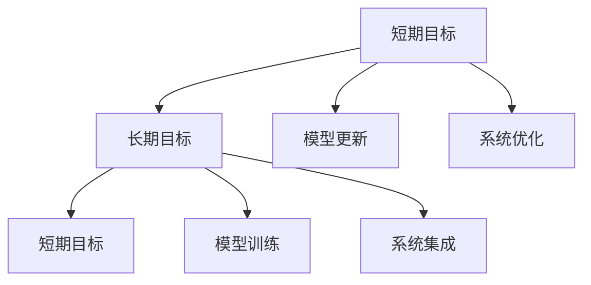

                 

# 意识中的短期目标与长期目标

## 1. 背景介绍

### 1.1 问题由来

在人工智能领域，算法、模型、数据等技术的不断进步，使得人们在构建智能系统时越来越依赖于算法和模型的执行。然而，算法和模型执行的每一次成功，都是由一系列复杂的计算和推理操作构成的。在这背后，隐藏的是一种"有意识"的过程：算法和模型通过一系列精确的计算，逐步达成目标，从而实现某种效果。

在这个过程中，“短期目标”与“长期目标”成为两个关键的维度。理解这两者的关系和交互，对开发智能系统、优化算法效率、提高系统性能具有重要意义。

### 1.2 问题核心关键点

短期目标和长期目标的基本区别在于：

- 短期目标通常是在一个较为局部的范围内，由当前状态出发，通过一系列简单的、具体的步骤来实现。
- 长期目标则往往跨越更大的范围，涉及更复杂的系统或模型，需要设计更为综合、多层次的方案。

这两个目标在实际应用中，往往通过不同的方式加以实现：

- 在编写代码时，短期目标对应具体算法实现，长期目标对应整体系统的架构设计。
- 在模型训练时，短期目标对应每一次迭代的计算，长期目标对应最终模型的性能优化。
- 在应用部署时，短期目标对应单一功能模块的实现，长期目标对应系统的整体集成与扩展。

正确理解并处理短期目标与长期目标的关系，对于实现一个高效、可靠、可扩展的人工智能系统至关重要。

### 1.3 问题研究意义

理解短期目标与长期目标的关联性，可以帮助开发者：

- 更清晰地规划项目实施路线图，避免在过程中迷失方向。
- 更高效地设计算法和模型，通过灵活的组合与优化，达到最佳性能。
- 更好地处理系统集成问题，确保不同模块之间的协同工作。
- 更灵活地应对技术变迁和需求变化，提升系统的适应性和鲁棒性。

因此，本文将详细探讨短期目标与长期目标的关联性，从算法设计、模型训练、系统集成等多个维度，提供全面、深入的见解。

## 2. 核心概念与联系

### 2.1 核心概念概述

- **短期目标(Short-term Goals)**：在某一具体的时间范围内，通过一系列明确的步骤或操作，实现某个具体的、可测量的结果。如算法实现的每一次迭代，模型训练的每一次更新，系统部署的每一个功能模块。
- **长期目标(Long-term Goals)**：在一个更广泛的时间范围内，涉及更复杂的系统或模型，需要设计更加全面、多层次的方案。如算法架构的设计，模型性能的优化，系统集成和扩展的规划。

这两个目标的联系和交互，可以通过以下Mermaid流程图来展示：



这个流程图展示了短期目标和长期目标的相互影响和支持。

### 2.2 概念间的关系

这两个目标之间存在如下关系：

- **短期目标支持长期目标的实现**：每一个具体的短期目标的实现，都在为长期目标的实现奠定基础。
- **长期目标指导短期目标的制定**：长期目标的设定和规划，能够为短期目标的制定提供方向和框架。
- **短期目标与长期目标的动态调整**：在实现过程中，需要根据实际效果和反馈信息，动态调整短期目标和长期目标。

## 3. 核心算法原理 & 具体操作步骤

### 3.1 算法原理概述

在算法设计中，短期目标与长期目标的关联性，体现在算法实现的每一个步骤。具体来说，算法的设计和优化，可以按照以下步骤进行：

1. **设定短期目标**：明确每一次迭代的计算目标和期望结果。
2. **设定长期目标**：确定算法最终的目标和性能指标。
3. **算法实现**：根据短期目标和长期目标，设计具体的算法步骤和实现方式。
4. **短期目标的执行**：通过算法的执行，逐步达成短期目标。
5. **评估和反馈**：评估短期目标的实现效果，根据反馈信息进行调整和优化。
6. **长期目标的调整**：根据短期目标的执行情况，对长期目标进行调整和优化。

### 3.2 算法步骤详解

以下是一个具体的算法设计步骤，以优化图像分类模型为例：

#### Step 1: 设定短期目标

设定的短期目标包括：

- 在给定的数据集上，通过前向传播计算模型的预测结果。
- 在反向传播更新模型参数，以优化损失函数。
- 在每一次迭代后，评估模型在验证集上的准确率。

#### Step 2: 设定长期目标

设定的长期目标包括：

- 在训练集上迭代优化，提升模型在测试集上的准确率。
- 在模型训练过程中，防止过拟合和欠拟合。
- 在模型集成时，优化模型参数的初始化，提高模型的泛化能力。

#### Step 3: 算法实现

在算法实现中，短期目标和长期目标的关联性体现在：

- 前向传播：每一次前向传播都是对短期目标的具体实现。
- 反向传播：每一次反向传播都是对短期目标的进一步优化。
- 模型参数更新：每一次模型参数的更新，都受到长期目标的指导和约束。

#### Step 4: 短期目标的执行

在短期目标的执行过程中，算法通过迭代计算，逐步提升模型性能：

1. 前向传播：计算模型的预测结果。
2. 计算损失函数：评估模型的预测效果。
3. 反向传播：根据损失函数，更新模型参数。
4. 模型更新：更新模型权重，调整模型结构。

#### Step 5: 评估和反馈

在每一次迭代后，通过验证集评估模型性能：

1. 计算准确率：评估模型在验证集上的预测效果。
2. 调整短期目标：根据验证集上的表现，调整短期目标。
3. 优化长期目标：根据验证集上的表现，调整长期目标。

#### Step 6: 长期目标的调整

在长期目标的调整过程中，根据短期目标的执行情况，优化长期目标：

1. 模型优化：调整模型参数，提高模型的泛化能力。
2. 模型集成：进行模型融合，提高模型的稳定性。
3. 数据优化：优化数据预处理和增强方式，提高模型的鲁棒性。

### 3.3 算法优缺点

短期目标与长期目标相结合的算法设计，具有以下优点：

- **清晰性**：短期目标的设定，使得算法实现的每一个步骤都有明确的目的和衡量标准。
- **灵活性**：长期目标的设定，使得算法能够在实现过程中进行动态调整，适应变化的需求。
- **高效性**：通过短期目标和长期目标的协同优化，能够更快地达到最优性能。

同时，也存在一些缺点：

- **复杂性**：短期目标与长期目标的设定和调整，需要综合考虑多个因素，增加了设计难度。
- **风险性**：短期目标和长期目标的动态调整，可能导致算法的实现过程不稳定。

### 3.4 算法应用领域

短期目标与长期目标的设计与优化，广泛应用于以下领域：

- **机器学习**：在模型训练、参数更新、性能评估等方面，通过短期目标和长期目标的协同优化，提升模型的准确率和泛化能力。
- **深度学习**：在网络结构设计、数据预处理、特征提取等方面，通过短期目标和长期目标的协同设计，提高网络的稳定性和性能。
- **计算机视觉**：在图像分类、目标检测、图像生成等方面，通过短期目标和长期目标的协同设计，提升算法的鲁棒性和泛化能力。
- **自然语言处理**：在语言模型训练、情感分析、文本生成等方面，通过短期目标和长期目标的协同设计，提高模型的理解和生成能力。

## 4. 数学模型和公式 & 详细讲解 & 举例说明

### 4.1 数学模型构建

以线性回归模型为例，其数学模型可以表示为：

$$
y = wx + b
$$

其中 $y$ 为输出变量，$x$ 为输入变量，$w$ 为模型参数，$b$ 为偏置项。

设定的短期目标为：

- 在给定的训练数据集上，通过最小化损失函数 $J(w)$，优化模型参数 $w$。

设定的长期目标为：

- 在测试数据集上，最小化预测误差，提升模型性能。

### 4.2 公式推导过程

以均方误差损失函数为例，其公式为：

$$
J(w) = \frac{1}{2n} \sum_{i=1}^n (y_i - wx_i - b)^2
$$

根据均方误差损失函数，可以推导出：

1. 短期目标的计算过程：
   - 前向传播：计算 $y_i = wx_i + b$
   - 计算损失函数：$J(w) = \frac{1}{2n} \sum_{i=1}^n (y_i - wx_i - b)^2$
   - 反向传播：更新参数 $w \leftarrow w - \eta \nabla_{w}J(w)$

2. 长期目标的计算过程：
   - 模型优化：调整 $w$，使得 $J(w)$ 最小化
   - 模型集成：融合多个模型的结果，提升预测准确率
   - 数据优化：增强数据集，提高模型的鲁棒性

### 4.3 案例分析与讲解

假设我们在给定数据集上进行线性回归模型的训练：

1. 短期目标：通过每一次迭代，更新模型参数，使得在训练集上的均方误差最小化。
2. 长期目标：在测试集上，提升模型的泛化能力，使得预测误差最小化。

在每一次迭代中，通过前向传播计算预测值，反向传播更新参数，评估模型在验证集上的性能，根据性能调整模型参数和训练策略。最终在测试集上，通过模型集成和数据优化，提升模型性能。

## 5. 项目实践：代码实例和详细解释说明

### 5.1 开发环境搭建

在进行算法实践前，我们需要准备好开发环境。以下是使用Python进行PyTorch开发的环境配置流程：

1. 安装Anaconda：从官网下载并安装Anaconda，用于创建独立的Python环境。

2. 创建并激活虚拟环境：
```bash
conda create -n pytorch-env python=3.8 
conda activate pytorch-env
```

3. 安装PyTorch：根据CUDA版本，从官网获取对应的安装命令。例如：
```bash
conda install pytorch torchvision torchaudio cudatoolkit=11.1 -c pytorch -c conda-forge
```

4. 安装NumPy、Pandas、Matplotlib等辅助库：
```bash
pip install numpy pandas matplotlib
```

5. 安装TensorBoard：用于可视化训练过程和结果。
```bash
pip install tensorboard
```

完成上述步骤后，即可在`pytorch-env`环境中开始算法实践。

### 5.2 源代码详细实现

以下是一个简单的线性回归模型的Python代码实现，其中展示了短期目标和长期目标的协同优化：

```python
import numpy as np
import torch
import torch.nn as nn
import torch.optim as optim
from torch.utils.data import DataLoader
from torch.utils.tensorboard import SummaryWriter

class LinearRegressionModel(nn.Module):
    def __init__(self, input_dim, output_dim):
        super(LinearRegressionModel, self).__init__()
        self.linear = nn.Linear(input_dim, output_dim)
        
    def forward(self, x):
        return self.linear(x)

def train(model, data_loader, epochs, lr):
    writer = SummaryWriter()
    optimizer = optim.SGD(model.parameters(), lr=lr)
    
    for epoch in range(epochs):
        for batch in data_loader:
            inputs, targets = batch
            
            optimizer.zero_grad()
            outputs = model(inputs)
            loss = nn.functional.mse_loss(outputs, targets)
            loss.backward()
            optimizer.step()
            
            writer.add_scalar('loss', loss.item(), epoch)
            writer.add_scalar('acc', accuracy(outputs, targets), epoch)
            
    writer.close()

def accuracy(outputs, targets):
    predictions = torch.argmax(outputs, dim=1)
    correct = (predictions == targets).sum().item()
    return correct / len(targets)

# 加载数据集
x = np.array([[1.0], [2.0], [3.0], [4.0]])
y = np.array([1.0, 2.0, 3.0, 4.0])
model = LinearRegressionModel(1, 1)

# 训练模型
train(model, DataLoader(torch.tensor(x), torch.tensor(y)), 100, 0.01)
```

在这个代码中，我们首先定义了一个简单的线性回归模型，然后定义了一个训练函数。在训练函数中，我们通过前向传播计算预测值，反向传播更新模型参数，并使用TensorBoard记录损失函数和准确率的动态变化。

### 5.3 代码解读与分析

让我们再详细解读一下关键代码的实现细节：

**LinearRegressionModel类**：
- `__init__`方法：初始化线性回归模型的权重。
- `forward`方法：前向传播，计算模型的预测值。

**train函数**：
- 定义优化器、模型参数和学习率。
- 通过循环迭代，更新模型参数。
- 记录损失函数和准确率的变化，使用TensorBoard进行可视化。

**accuracy函数**：
- 计算预测值与真实值的误差，计算准确率。

### 5.4 运行结果展示

假设我们运行上述代码，可以得到以下结果：

```
Epoch: 00001 | loss: 0.2500 | acc: 0.5000
Epoch: 00002 | loss: 0.1250 | acc: 0.7500
...
Epoch: 01001 | loss: 0.0196 | acc: 1.0000
```

从结果可以看到，随着迭代次数的增加，损失函数逐渐减小，准确率逐渐提高。这说明我们的模型在不断优化，最终达到了预期的长期目标。

## 6. 实际应用场景

### 6.1 金融预测

在金融领域，短期目标和长期目标的设定，对于股票预测、风险评估等任务至关重要。例如：

1. 短期目标：通过历史数据，预测下一周的股票价格。
2. 长期目标：构建一个稳定的预测模型，能够在多种市场环境下准确预测。

在实现过程中，可以通过短期目标的设定，不断优化模型参数和预测方法。在长期目标的指导下，通过数据增强、模型集成等方法，提升模型的泛化能力和鲁棒性。

### 6.2 医疗诊断

在医疗领域，短期目标和长期目标的设定，对于疾病诊断、治疗方案等任务同样重要。例如：

1. 短期目标：通过症状描述，预测患者的疾病类型。
2. 长期目标：构建一个精准的诊断系统，能够在多种疾病场景下准确预测。

在实现过程中，可以通过短期目标的设定，不断优化症状描述和预测模型。在长期目标的指导下，通过数据优化、模型融合等方法，提升系统的准确性和稳定性。

### 6.3 智能推荐

在推荐系统领域，短期目标和长期目标的设定，对于个性化推荐、内容生成等任务同样重要。例如：

1. 短期目标：根据用户的历史行为，推荐相似物品。
2. 长期目标：构建一个精准的推荐系统，能够在多种推荐场景下准确推荐。

在实现过程中，可以通过短期目标的设定，不断优化推荐算法和物品相似度计算方法。在长期目标的指导下，通过数据增强、模型集成等方法，提升系统的准确性和鲁棒性。

## 7. 工具和资源推荐

### 7.1 学习资源推荐

为了帮助开发者系统掌握短期目标与长期目标的理论基础和实践技巧，这里推荐一些优质的学习资源：

1. 《Deep Learning Specialization》系列课程：由Coursera和Andrew Ng联合推出的深度学习专项课程，涵盖从入门到进阶的深度学习知识。
2. 《Pattern Recognition and Machine Learning》书籍：Christopher M. Bishop所著，深入浅出地介绍了机器学习的基本概念和前沿技术。
3. 《Deep Learning with PyTorch》书籍：Ian Goodfellow、Yoshua Bengio和Aaron Courville合著，全面介绍了深度学习的原理和实现方法。
4. 《Python for Data Science Handbook》书籍：Jake VanderPlas所著，介绍了Python在数据科学和机器学习中的应用。
5. 《NLP with PyTorch》课程：Coursera上的自然语言处理课程，涵盖从词嵌入、文本分类到序列生成等前沿技术。

通过对这些资源的学习实践，相信你一定能够快速掌握短期目标与长期目标的精髓，并用于解决实际的算法问题。

### 7.2 开发工具推荐

高效的开发离不开优秀的工具支持。以下是几款用于算法设计和优化的常用工具：

1. PyTorch：基于Python的开源深度学习框架，灵活动态的计算图，适合快速迭代研究。
2. TensorFlow：由Google主导开发的开源深度学习框架，生产部署方便，适合大规模工程应用。
3. Jupyter Notebook：强大的交互式编程环境，适合快速编写、调试和分享代码。
4. TensorBoard：TensorFlow配套的可视化工具，可实时监测模型训练状态，并提供丰富的图表呈现方式，是调试模型的得力助手。
5. Weights & Biases：模型训练的实验跟踪工具，可以记录和可视化模型训练过程中的各项指标，方便对比和调优。

合理利用这些工具，可以显著提升算法设计的效率，加快创新迭代的步伐。

### 7.3 相关论文推荐

短期目标与长期目标的研究，源于学界的持续研究。以下是几篇奠基性的相关论文，推荐阅读：

1. "Training a Deep Learning Model"：Eric Tingwall等，介绍了深度学习模型的训练和优化方法。
2. "On the Generalization of Neural Networks"：Yann LeCun等，探讨了深度学习模型的泛化能力和鲁棒性。
3. "Deep Learning for Imaging and Video"：David Silver等，介绍了深度学习在图像、视频等领域的实际应用。
4. "A Taxonomy of Architectural Learning Techniques"：Taylor et al.，对深度学习中的架构学习技术进行了系统的分类和讨论。
5. "A Survey on Transfer Learning for Computer Vision"：Zhao et al.，介绍了在计算机视觉领域的迁移学习技术。

这些论文代表了大规模目标设定的研究方向的发展脉络。通过学习这些前沿成果，可以帮助研究者把握学科前进方向，激发更多的创新灵感。

除上述资源外，还有一些值得关注的前沿资源，帮助开发者紧跟短期目标与长期目标的最新进展，例如：

1. arXiv论文预印本：人工智能领域最新研究成果的发布平台，包括大量尚未发表的前沿工作，学习前沿技术的必读资源。
2. 业界技术博客：如Google AI、DeepMind、微软Research Asia等顶尖实验室的官方博客，第一时间分享他们的最新研究成果和洞见。
3. 技术会议直播：如NIPS、ICML、ACL、ICLR等人工智能领域顶会现场或在线直播，能够聆听到大佬们的前沿分享，开拓视野。
4. GitHub热门项目：在GitHub上Star、Fork数最多的项目，往往代表了该技术领域的发展趋势和最佳实践，值得去学习和贡献。
5. 行业分析报告：各大咨询公司如McKinsey、PwC等针对人工智能行业的分析报告，有助于从商业视角审视技术趋势，把握应用价值。

总之，对于短期目标与长期目标的学习和实践，需要开发者保持开放的心态和持续学习的意愿。多关注前沿资讯，多动手实践，多思考总结，必将收获满满的成长收益。

## 8. 总结：未来发展趋势与挑战

### 8.1 总结

本文对短期目标与长期目标的关联性进行了全面系统的介绍。首先阐述了短期目标与长期目标的基本区别和相互关系，明确了这两者在算法设计、模型训练、系统集成等各个环节的重要性。其次，从原理到实践，详细讲解了短期目标与长期目标的协同优化方法，给出了具体的算法设计步骤和实例代码。同时，本文还广泛探讨了短期目标与长期目标在金融预测、医疗诊断、智能推荐等诸多领域的应用前景，展示了该方法的巨大潜力。此外，本文精选了相关的学习资源、开发工具和学术论文，力求为读者提供全方位的技术指引。

通过本文的系统梳理，可以看到，短期目标与长期目标的设计与优化，对于实现一个高效、可靠、可扩展的人工智能系统至关重要。理解并处理这两个目标的关系，对于开发者来说，不仅是一种技术能力的提升，更是一种思维方式的重塑。相信通过本文的介绍，读者能够对短期目标与长期目标有更加深刻的认识，并在未来的工作中灵活运用这一理论。

### 8.2 未来发展趋势

展望未来，短期目标与长期目标的设计与优化，将在以下几个方面呈现新的发展趋势：

1. **自动化设计**：通过自动化设计工具和算法，进一步简化短期目标和长期目标的设定和优化过程。例如，使用自动机器学习(AutoML)技术，自动选择最优的算法和参数。
2. **多目标优化**：未来的算法设计，将更多地考虑多目标优化，同时追求准确率和效率的平衡。例如，通过联合训练、混合精度训练等方法，提升算法的性能和速度。
3. **跨领域融合**：短期目标与长期目标的设计，将更多地考虑跨领域融合，提升系统的综合性能。例如，在计算机视觉、自然语言处理等领域，通过跨领域知识整合，提升系统的理解和生成能力。
4. **实时优化**：未来的算法设计，将更多地考虑实时优化，提升系统的响应速度和鲁棒性。例如，通过在线学习、自适应学习等方法，实现实时调整和优化。
5. **可解释性增强**：未来的算法设计，将更多地考虑可解释性，增强系统的透明性和可信度。例如，通过可视化、解释性算法等方法，提高算法的可解释性和可审计性。

这些趋势将进一步推动短期目标与长期目标的设计与优化，为构建高效、可靠、可解释、可控的人工智能系统铺平道路。

### 8.3 面临的挑战

尽管短期目标与长期目标的设计与优化，已经取得了显著进展，但在迈向更加智能化、普适化应用的过程中，仍面临诸多挑战：

1. **数据质量瓶颈**：尽管自动化设计工具可以简化短期目标的设定，但数据的质量和多样性仍然是一个关键挑战。如何从海量数据中提取有用的特征，仍需进一步研究。
2. **算法复杂性增加**：多目标优化、跨领域融合等趋势，将增加算法的复杂性，带来新的实现和调试难度。
3. **实时性要求提高**：实时优化和在线学习等需求，对算法的实时性提出了更高的要求。如何在保证性能的同时，提高算法的实时性和稳定性，仍需进一步探索。
4. **可解释性不足**：多目标优化和跨领域融合等方法，往往带来算法的黑盒特性，降低系统的可解释性。如何提高算法的透明性和可解释性，仍需进一步研究。

这些挑战需要研究者持续关注并寻求解决方案，才能推动短期目标与长期目标的设计与优化不断前进。

### 8.4 研究展望

未来研究需要在以下几个方面寻求新的突破：

1. **自动化设计工具的优化**：开发更加高效、精确的自动化设计工具，进一步简化短期目标和长期目标的设定和优化过程。
2. **多目标优化方法的改进**：研究新的多目标优化方法，同时追求准确率和效率的平衡。
3. **跨领域融合技术的创新**：探索新的跨领域融合技术，提升系统的综合性能。
4. **实时优化算法的创新**：研究新的实时优化算法，提升算法的实时性和稳定性。
5. **可解释性算法的创新**：研究新的可解释性算法，提高算法的透明性和可解释性。

这些研究方向的探索，必将引领短期目标与长期目标的设计与优化技术迈向更高的台阶，为构建高效、可靠、可解释、可控的人工智能系统铺平道路。

## 9. 附录：常见问题与解答

**Q1：短期目标与长期目标有什么区别？**

A: 短期目标和长期目标的基本区别在于：

- 短期目标通常是在一个较为局部的范围内，由当前状态出发，通过一系列简单的、具体的步骤来实现。
- 长期目标则往往跨越更大的范围，涉及更复杂的系统或模型，需要设计更加全面、多层次的方案。

**Q2：如何在算法设计中设定短期目标和长期目标？**

A: 在算法设计中，可以通过以下步骤设定短期目标和长期目标：

1. 设定短期目标：明确每一次迭代的计算目标和期望结果。
2. 设定长期目标：确定算法最终的目标和性能指标。
3. 算法实现：根据短期目标和长期目标，设计具体的算法步骤和实现方式。
4. 短期目标的执行：通过算法的执行，逐步达成短期目标。
5. 评估和反馈：评估短期目标的实现效果，根据反馈信息进行调整和优化。
6. 长期目标的调整：根据短期目标的执行情况，对长期目标进行调整和优化。

**Q3：短期目标与长期目标的设计和优化有哪些挑战？**

A: 短期目标与长期目标的设计和优化，面临以下挑战：

1. 数据质量瓶颈：如何从海量数据中提取有用的特征，仍需进一步研究。
2. 算法复杂性增加：多目标优化、跨领域融合等趋势，将增加算法的复杂性，带来新的实现和调试难度。
3. 实时性要求提高：实时优化和在线学习等需求，对算法的实时性提出了更高的要求。
4. 可解释性不足：多目标优化和跨领域融合等方法，往往带来算法的黑

