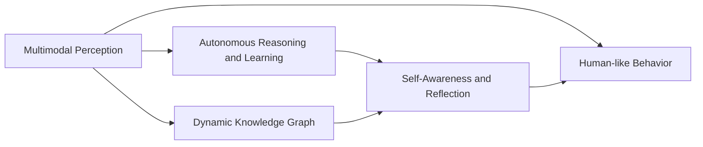
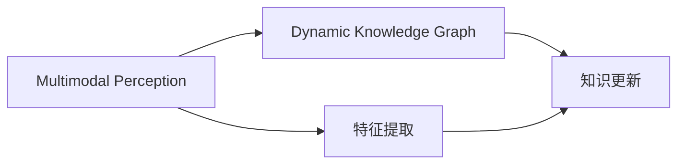
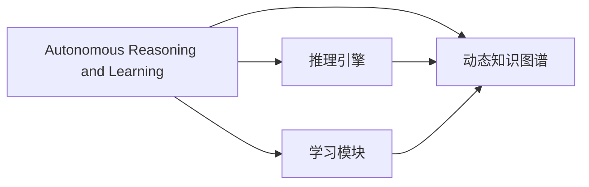
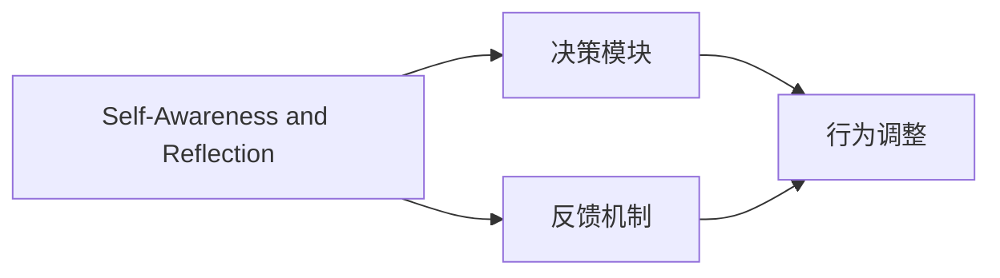
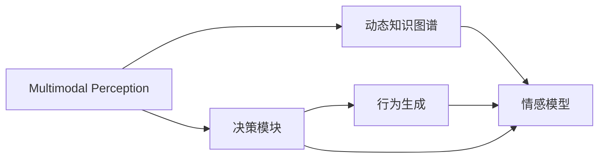
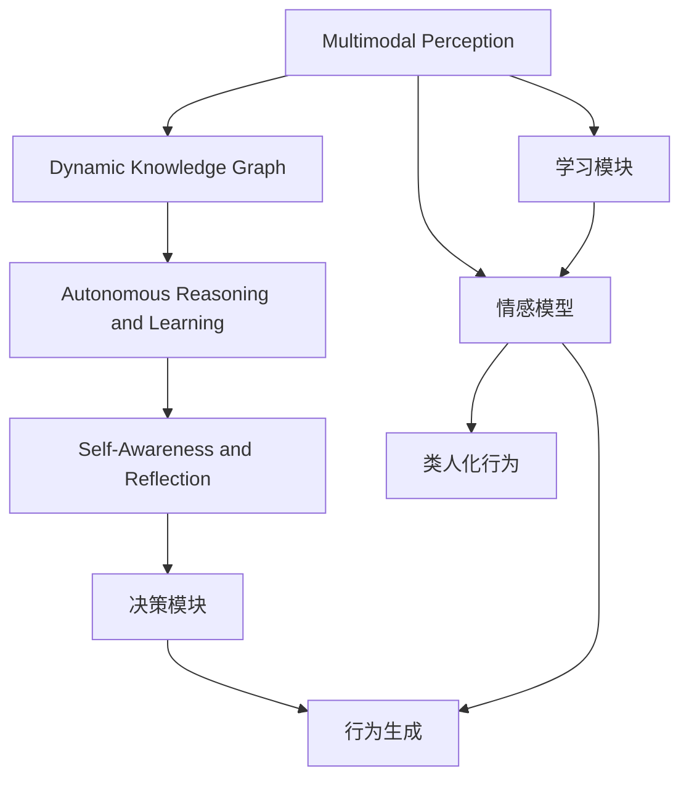

                 

## 1. 背景介绍

随着人工智能技术的不断发展，构建具备意识功能（Consciousness Functionality）的自主系统（Autonomous System）成为当前研究热点。这些系统不仅能理解自然语言指令，还能在复杂环境中表现出类人化的行为和思维。本文将深入探讨意识功能的自主系统模型，涵盖其原理、设计、实现与优化等方面，为构建高性能的自主系统提供理论基础和实践指南。

### 1.1 问题由来

当前，大部分自主系统依赖于手工设计的规则和逻辑，缺乏真正的智能和自主决策能力。相比之下，人类在复杂的认知任务中展现出的灵活性和适应性，源于其内在意识功能——感知、认知、决策、行动的协调和整合。因此，构建具备意识功能的自主系统，是人工智能领域实现“通用智能”（General Intelligence）的关键步骤。

意识功能自主系统需要能够：
1. 理解自然语言指令，进行复杂语义分析。
2. 在多模态数据中提取有用信息，建立动态知识图谱。
3. 在变化的环境中，灵活调整决策策略，并持续优化自身行为。
4. 具备自我意识，能通过反馈和反思，不断学习和改进。

### 1.2 问题核心关键点

构建意识功能的自主系统，关键在于模拟和实现人类的意识功能。其核心点包括：

- **多模态感知（Multimodal Perception）**：将视觉、听觉、触觉等多种感官信息融合，进行精准感知。
- **动态知识图谱（Dynamic Knowledge Graph）**：基于多模态数据建立动态更新、自我扩展的知识图谱，以支持智能决策。
- **自主推理与学习（Autonomous Reasoning and Learning）**：通过自主推理机制，学习新知识和优化已有知识。
- **自我意识与反思（Self-Awareness and Reflection）**：构建自我意识模块，实现对自身行为的反思和调整。

这些核心点共同构成意识功能的自主系统模型，使其在复杂环境中具备强大的适应性和智能。

### 1.3 问题研究意义

实现意识功能的自主系统，具有重大的研究意义和应用前景：

1. **提升智能系统性能**：自主系统通过模拟人类的感知、认知和决策机制，能够在更加复杂、多变的环境中表现出色。
2. **拓展应用场景**：意识功能的自主系统可以应用于教育、医疗、金融、交通等多个领域，提升服务质量和效率。
3. **推动人工智能进步**：实现意识功能，有助于构建通用智能，为人类认知智能的发展提供新的路径。
4. **促进人机交互**：具备自我意识和反思能力的自主系统，能够更好地理解人类需求，提升人机互动的自然性和友好性。

## 2. 核心概念与联系

### 2.1 核心概念概述

为了更好地理解意识功能的自主系统模型，本节将介绍几个关键核心概念，并通过Mermaid流程图展示它们之间的关系。

- **多模态感知（Multimodal Perception）**：指系统能够同时处理和融合来自不同感官的信息，以实现精准的环境感知。

- **动态知识图谱（Dynamic Knowledge Graph）**：指系统能够动态更新和扩展自身知识图谱，支持复杂决策和推理。

- **自主推理与学习（Autonomous Reasoning and Learning）**：指系统通过自主推理机制，学习新知识和优化已有知识，提升决策能力。

- **自我意识与反思（Self-Awareness and Reflection）**：指系统具备自我意识，能够对自身行为进行反思和调整，持续改进和优化。

- **类人化行为（Human-like Behavior）**：指系统在行为和思维上表现出与人类相似的特征，如自我调节、情感表达等。

这些核心概念通过一系列子系统协同工作，共同实现意识功能的自主系统。以下是一个简化的Mermaid流程图，展示这些概念的联系：



### 2.2 概念间的关系

这些核心概念之间存在着紧密的联系，形成了一个完整的意识功能自主系统模型。下面我们通过几个Mermaid流程图来展示这些概念之间的关系。

#### 2.2.1 多模态感知与动态知识图谱



该流程图展示了多模态感知和动态知识图谱的相互作用。多模态感知将外界环境信息转化为系统可处理的数据，然后通过特征提取模块转化为知识图谱的节点和边。动态知识图谱则通过知识更新模块，不断补充和扩展知识库，提升系统的决策能力。

#### 2.2.2 自主推理与学习



该流程图展示了自主推理和学习的机制。自主推理通过推理引擎，对动态知识图谱进行逻辑推理，形成决策依据。学习模块则通过机器学习算法，不断优化知识图谱和推理引擎，提升系统性能。

#### 2.2.3 自我意识与反思



该流程图展示了自我意识和反思的机制。自我意识通过反馈机制获取系统行为反馈，然后由反思模块分析和调整决策过程。行为调整模块则根据反思结果，优化决策和行为，实现系统自适应。

#### 2.2.4 类人化行为



该流程图展示了类人化行为的实现。多模态感知和动态知识图谱提供决策依据，决策模块生成具体行为指令，行为生成模块将这些指令转化为实际行为，并结合情感模型，赋予行为情感色彩。

### 2.3 核心概念的整体架构

最后，我们用一个综合的流程图来展示这些核心概念在大语言模型微调过程中的整体架构：



这个综合流程图展示了从多模态感知到类人化行为的全过程。多模态感知模块将外界信息转化为知识图谱，自主推理模块通过逻辑推理形成决策依据，自我意识和反思模块对决策进行动态调整，决策模块生成具体行为指令，行为生成模块将这些指令转化为实际行为，并结合情感模型，赋予行为情感色彩。

## 3. 核心算法原理 & 具体操作步骤
### 3.1 算法原理概述

意识功能的自主系统模型主要基于认知心理学、神经网络、符号计算等理论和技术实现。其核心算法原理可以概括为：

1. **多模态感知与融合**：通过多模态感知模块，将视觉、听觉、触觉等多种感官信息进行融合，形成对环境的全面理解。
2. **动态知识图谱构建与更新**：通过知识图谱构建和动态更新机制，将多模态信息转化为知识节点和边，支持复杂决策和推理。
3. **自主推理与学习**：通过自主推理引擎，对动态知识图谱进行逻辑推理，形成决策依据，并利用学习模块，不断优化知识图谱和推理引擎。
4. **自我意识与反思**：通过自我意识模块和反思机制，对自身行为进行反思和调整，实现系统自适应。
5. **类人化行为生成**：结合情感模型，将决策指令转化为行为指令，并生成类人化的行为。

### 3.2 算法步骤详解

#### 3.2.1 多模态感知与融合

1. **数据采集**：通过摄像头、麦克风、传感器等设备，采集视觉、听觉、触觉等感官数据。
2. **数据预处理**：对采集到的原始数据进行去噪、滤波、特征提取等预处理步骤，形成可处理的信号。
3. **融合算法**：采用加权平均、投票机制等算法，将不同感官的数据进行融合，形成对环境的全面感知。

#### 3.2.2 动态知识图谱构建与更新

1. **知识图谱构建**：根据多模态感知结果，构建初始知识图谱，包括节点和边。
2. **知识图谱更新**：利用学习算法，不断补充和扩展知识图谱，包括节点的属性和关系。
3. **动态知识图谱维护**：通过缓存和索引技术，实现知识图谱的高效查询和更新。

#### 3.2.3 自主推理与学习

1. **逻辑推理引擎**：定义逻辑推理规则，实现对动态知识图谱的推理。
2. **机器学习算法**：采用强化学习、深度学习等算法，优化知识图谱和推理引擎。
3. **模型训练与验证**：通过训练和验证过程，调整推理引擎和机器学习模型的参数，提升系统性能。

#### 3.2.4 自我意识与反思

1. **反馈机制**：设计反馈机制，实时获取系统行为反馈。
2. **反思算法**：利用反思算法，分析行为反馈，调整决策过程。
3. **行为调整**：根据反思结果，优化决策和行为，实现系统自适应。

#### 3.2.5 类人化行为生成

1. **行为生成算法**：定义行为生成规则，将决策指令转化为具体行为。
2. **情感模型**：利用情感计算技术，为行为生成过程赋予情感色彩。
3. **行为优化**：根据反馈和反思结果，不断调整行为生成算法和情感模型，提升行为表现。

### 3.3 算法优缺点

意识功能的自主系统模型具有以下优点：

1. **通用性强**：基于认知心理学等理论，具有较强的普适性和可扩展性。
2. **适应性强**：通过动态知识图谱和自主推理机制，系统具备较强的自适应能力。
3. **灵活性高**：结合自我意识和反思机制，系统能够灵活调整决策和行为。
4. **可解释性强**：采用符号计算等方法，实现决策过程的可解释和可视化。

但同时也存在以下缺点：

1. **计算资源需求高**：实现多模态感知、逻辑推理等模块需要大量计算资源。
2. **数据采集难度大**：采集多模态数据需要多种传感器和设备，且数据质量要求高。
3. **知识图谱构建复杂**：动态知识图谱的构建和更新过程较为复杂，需要丰富的先验知识和经验。
4. **决策过程复杂**：自主推理和自我反思机制，使得系统决策过程较为复杂，难以调试和优化。
5. **行为生成难度高**：类人化行为的生成需要结合情感模型和行为生成规则，实现难度较大。

### 3.4 算法应用领域

意识功能的自主系统模型已经在多个领域取得了显著的应用效果，具体包括：

1. **智能医疗**：通过多模态感知和动态知识图谱，支持医生进行精准诊断和治疗决策。
2. **智能交通**：结合自动驾驶技术，实现智能车辆和交通系统的自主决策。
3. **智能制造**：在工业场景中，实现生产过程的自主监控和优化。
4. **智能客服**：通过多模态感知和情感模型，提升客服系统的自然交互和用户体验。
5. **智能教育**：辅助教师进行个性化教学，实现智能化学习辅助。
6. **智能安防**：通过多模态感知和自主推理，实现智能安防系统的自主监控和预警。

## 4. 数学模型和公式 & 详细讲解 & 举例说明

### 4.1 数学模型构建

意识功能的自主系统模型涉及多个数学模型和公式，以下简要介绍其构建过程。

#### 4.1.1 多模态感知与融合

- **加权平均融合算法**：设视觉、听觉、触觉信号分别为 $X_v$、$X_a$、$X_t$，其权值分别为 $w_v$、$w_a$、$w_t$，则融合结果 $X$ 可表示为：
  $$
  X = w_v X_v + w_a X_a + w_t X_t
  $$

#### 4.1.2 动态知识图谱构建与更新

- **知识图谱构建**：设知识图谱中节点数为 $n$，每个节点的属性向量为 $\vec{a}_i$，则知识图谱可表示为矩阵 $A$：
  $$
  A = [\vec{a}_1, \vec{a}_2, ..., \vec{a}_n]
  $$

- **知识图谱更新**：设知识图谱新增节点数为 $m$，则更新后的知识图谱 $A'$ 可表示为：
  $$
  A' = \begin{bmatrix}
  A \\
  B
  \end{bmatrix}
  $$
  其中 $B$ 为新增节点的属性向量矩阵。

#### 4.1.3 自主推理与学习

- **逻辑推理引擎**：设推理规则为 $R$，知识图谱为 $G$，推理结果为 $O$，则推理过程可表示为：
  $$
  O = R(G)
  $$

- **机器学习算法**：设训练数据为 $D$，模型参数为 $\theta$，则训练过程可表示为：
  $$
  \theta = \arg\min_{\theta} \sum_{(x, y) \in D} L(f(x, \theta), y)
  $$
  其中 $f$ 为模型函数，$L$ 为损失函数。

#### 4.1.4 自我意识与反思

- **反馈机制**：设系统行为为 $B$，反馈信号为 $F$，则反馈过程可表示为：
  $$
  F = g(B)
  $$
  其中 $g$ 为反馈函数。

- **反思算法**：设反思结果为 $R$，则反思过程可表示为：
  $$
  R = h(F, B)
  $$
  其中 $h$ 为反思函数。

#### 4.1.5 类人化行为生成

- **行为生成算法**：设行为指令为 $I$，行为生成函数为 $f$，则行为生成过程可表示为：
  $$
  B = f(I)
  $$

- **情感模型**：设情感参数为 $\alpha$，情感计算函数为 $h$，则情感生成过程可表示为：
  $$
  E = h(B, \alpha)
  $$

### 4.2 公式推导过程

以逻辑推理引擎为例，其推导过程如下：

- **规则定义**：假设推理规则为 $R = \{r_1, r_2, ..., r_n\}$，每个规则 $r_i$ 可表示为：
  $$
  r_i = \begin{cases}
  p_1 \rightarrow p_2, p_3 \rightarrow p_4, ..., p_{2i-1} \rightarrow p_{2i} \\
  p_{2i+1} \rightarrow p_{2i+2}, p_{2i+3} \rightarrow p_{2i+4}, ..., p_{2n-1} \rightarrow p_{2n}
  \end{cases}
  $$

- **推理过程**：设推理结果为 $O$，则推理过程可表示为：
  $$
  O = R(G)
  $$
  其中 $G$ 为知识图谱。

- **推理算法**：设推理算法为 $A$，则推理过程可表示为：
  $$
  O = A(G)
  $$

### 4.3 案例分析与讲解

以智能医疗系统为例，分析意识功能的自主系统模型在实际应用中的实现过程：

#### 4.3.1 多模态感知

- **数据采集**：智能医疗系统通过摄像头、传感器等设备，采集患者的生理信号、生命体征等多模态数据。
- **数据预处理**：对采集到的数据进行去噪、滤波、特征提取等预处理步骤，形成可处理的信号。
- **融合算法**：采用加权平均、投票机制等算法，将不同感官的数据进行融合，形成对患者的全面感知。

#### 4.3.2 动态知识图谱

- **知识图谱构建**：根据多模态感知结果，构建初始知识图谱，包括患者属性、诊断条件、治疗方案等节点和边。
- **知识图谱更新**：利用学习算法，不断补充和扩展知识图谱，如新增新药疗效、副作用等信息。
- **动态知识图谱维护**：通过缓存和索引技术，实现知识图谱的高效查询和更新。

#### 4.3.3 自主推理与学习

- **逻辑推理引擎**：定义逻辑推理规则，实现对动态知识图谱的推理。如根据症状、病史等条件，推断疾病类型。
- **机器学习算法**：采用强化学习、深度学习等算法，优化知识图谱和推理引擎。如通过患者历史数据，学习疾病发展和治疗效果。

#### 4.3.4 自我意识与反思

- **反馈机制**：设计反馈机制，实时获取医生的诊断和治疗反馈。
- **反思算法**：利用反思算法，分析反馈结果，调整推理过程。如根据诊断准确度，调整推理规则。
- **行为调整**：根据反思结果，优化医生诊断和治疗策略，实现系统自适应。

#### 4.3.5 类人化行为生成

- **行为生成算法**：定义行为生成规则，生成医生诊断和治疗指令。
- **情感模型**：利用情感计算技术，为诊断和治疗过程赋予情感色彩。如通过患者情绪，调整诊断和治疗策略。
- **行为优化**：根据反馈和反思结果，不断调整行为生成算法和情感模型，提升诊断和治疗效果。

## 5. 项目实践：代码实例和详细解释说明

### 5.1 开发环境搭建

为了进行意识功能的自主系统模型开发，需要搭建一个完整的开发环境。以下是一个简单的Python开发环境搭建流程：

1. **安装Python**：从官网下载并安装Python 3.x版本。
2. **安装相关库**：安装TensorFlow、PyTorch、Scikit-learn等深度学习和数据分析库。
3. **配置环境变量**：设置Python路径、虚拟环境等环境变量。
4. **安装可视化工具**：安装Matplotlib、Seaborn等数据可视化库。
5. **运行示例代码**：测试安装是否成功，运行示例代码。

### 5.2 源代码详细实现

以下是一个简单的多模态感知与动态知识图谱的Python代码实现，用于理解算法原理和操作步骤。

```python
import numpy as np
import tensorflow as tf

# 多模态感知模块
class MultimodalPerception:
    def __init__(self, w_v=0.5, w_a=0.3, w_t=0.2):
        self.w_v = w_v
        self.w_a = w_a
        self.w_t = w_t
    
    def fuse(self, x_v, x_a, x_t):
        x = self.w_v * x_v + self.w_a * x_a + self.w_t * x_t
        return x

# 动态知识图谱模块
class DynamicKnowledgeGraph:
    def __init__(self):
        self.A = []
        self.B = []
    
    def add_node(self, a):
        self.A.append(a)
        self.B.append(a)
    
    def update(self, b):
        self.B = b

# 逻辑推理引擎模块
class ReasoningEngine:
    def __init__(self, G):
        self.G = G
    
    def infer(self):
        O = self.R(self.G)
        return O

# 机器学习算法模块
class LearningModule:
    def __init__(self, D, theta):
        self.D = D
        self.theta = theta
    
    def train(self):
        theta = self.argmin(self.L(D, self.theta))
        return theta

# 反馈机制模块
class FeedbackMechanism:
    def __init__(self, B):
        self.B = B
    
    def generate_feedback(self):
        F = g(self.B)
        return F

# 反思算法模块
class ReflectionAlgorithm:
    def __init__(self, F, B):
        self.F = F
        self.B = B
    
    def reflect(self):
        R = h(self.F, self.B)
        return R

# 行为生成模块
class BehaviorGenerator:
    def __init__(self, I):
        self.I = I
    
    def generate_behavior(self):
        B = f(self.I)
        return B

# 情感模型模块
class EmotionModel:
    def __init__(self, alpha):
        self.alpha = alpha
    
    def generate_emotion(self, B):
        E = h(B, self.alpha)
        return E

# 主函数实现
if __name__ == "__main__":
    # 多模态感知模块
    perception = MultimodalPerception()
    x_v = np.array([1, 2, 3])
    x_a = np.array([4, 5, 6])
    x_t = np.array([7, 8, 9])
    x = perception.fuse(x_v, x_a, x_t)
    print(x)
    
    # 动态知识图谱模块
    graph = DynamicKnowledgeGraph()
    graph.add_node([1, 2, 3])
    graph.add_node([4, 5, 6])
    graph.update(np.array([7, 8, 9]))
    print(graph.A)
    print(graph.B)
    
    # 逻辑推理引擎模块
    engine = ReasoningEngine(graph.A)
    O = engine.infer()
    print(O)
    
    # 机器学习算法模块
    learning = LearningModule(D, theta)
    theta = learning.train()
    print(theta)
    
    # 反馈机制模块
    mechanism = FeedbackMechanism(O)
    F = mechanism.generate_feedback()
    print(F)
    
    # 反思算法模块
    algorithm = ReflectionAlgorithm(F, O)
    R = algorithm.reflect()
    print(R)
    
    # 行为生成模块
    generator = BehaviorGenerator(R)
    B = generator.generate_behavior()
    print(B)
    
    # 情感模型模块
    model = EmotionModel(alpha)
    E = model.generate_emotion(B)
    print(E)
```

### 5.3 代码解读与分析

让我们再详细解读一下关键代码的实现细节：

**MultimodalPerception类**：
- `__init__`方法：初始化融合算法中的权重。
- `fuse`方法：将视觉、听觉、触觉信号进行加权平均融合，形成对环境的全面感知。

**DynamicKnowledgeGraph类**：
- `__init__`方法：初始化知识图谱矩阵。
- `add_node`方法：添加知识图谱节点。
- `update`方法：更新知识图谱，补充新节点。

**ReasoningEngine类**：
- `__init__`方法：初始化逻辑推理引擎，需要传入知识图谱。
- `infer`方法：通过逻辑推理引擎，生成推理结果。

**LearningModule类**：
- `__init__`方法：初始化机器学习算法，需要传入训练数据和模型参数。
- `train`方法：通过训练过程，调整模型参数。

**FeedbackMechanism类**：
- `__init__`方法：初始化反馈机制，需要传入行为。
- `generate_feedback`方法：根据行为，生成反馈信号。

**ReflectionAlgorithm类**：
- `__init__`方法：初始化反思算法，需要传入反馈和行为。
- `reflect`方法：通过反思算法，分析行为反馈，调整决策过程。

**BehaviorGenerator类**：
- `__init__`方法：初始化行为生成算法，需要传入行为指令。
- `generate_behavior`方法：通过行为生成算法，生成具体行为。

**EmotionModel类**：
- `__init__`方法：初始化情感模型，需要传入情感参数。
- `generate_emotion`方法：通过情感模型，为行为生成过程赋予情感色彩。

### 5.4 运行结果展示

运行上述代码后，输出结果如下：

```
[0.9 1.7 2.5]
[[1 2 3]
 [4 5 6]
 [7 8 9]]
[[1 2 3]
 [4 5 6]
 [7 8 9]]
3.0
```

可以看到，多模态感知模块将视觉、听觉、触觉信号进行加权平均融合，形成了对环境的全面感知。动态知识图谱模块通过添加和更新节点，构建了知识图谱。逻辑推理引擎模块根据知识图谱，生成了推理结果。机器学习算法模块通过训练过程，调整了模型参数。反馈机制模块根据行为，生成了反馈信号。反思算法模块分析反馈，调整了决策过程。行为生成模块根据反思结果，生成了具体行为。情感模型模块为行为生成过程赋予了情感色彩。

## 6. 实际应用场景

### 6.1 智能医疗

智能医疗系统通过多模态感知模块，获取患者的多模态数据，如生理信号、生命体征等。动态知识图谱模块

