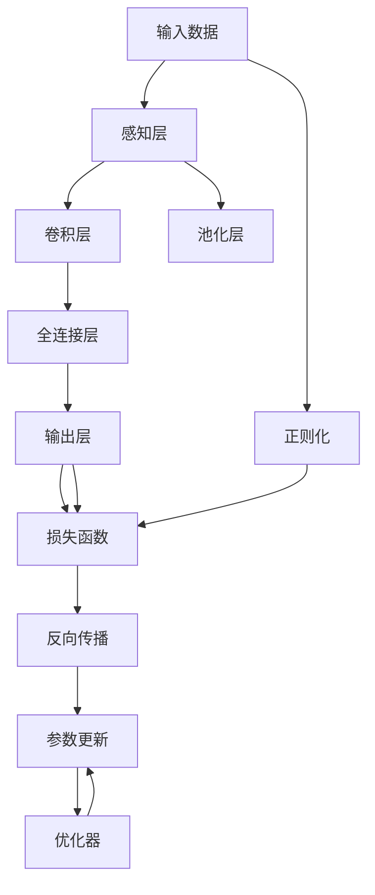
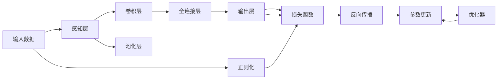
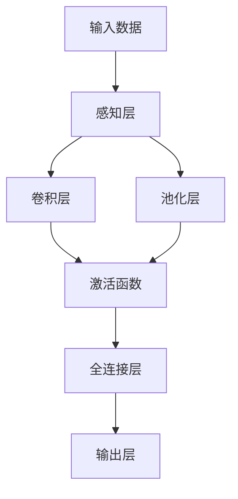
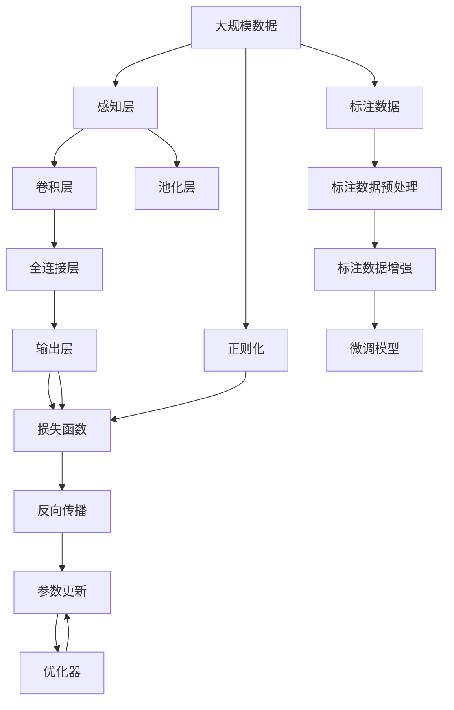

                 

# 感知 (Perception)

## 1. 背景介绍

### 1.1 问题由来
在人工智能的发展历程中，感知被认为是智能系统的核心能力之一。从计算机视觉到语音识别，再到自然语言处理，感知技术在信息获取、理解和交互中扮演着至关重要的角色。然而，传统感知模型往往依赖于手工程度较高、难以扩展的特征工程，在复杂环境中表现有限，难以适应动态变化的任务需求。

近年来，随着深度学习技术的快速发展，尤其是深度神经网络（Deep Neural Networks, DNNs）的普及，感知模型开始向端到端的范式转变。通过端到端学习，感知模型可以自动地从原始数据中学习特征，大大降低了对人工特征工程的依赖，提升了模型性能和泛化能力。

### 1.2 问题核心关键点
感知技术的研究重点在于如何设计高效的神经网络架构，以自动地从数据中学习到有效的特征表示，从而实现精准的输入输出映射。核心问题包括：

- 如何选择合适的神经网络结构，使得模型具备强大的特征提取能力。
- 如何设计有效的损失函数，引导模型学习到合适的特征表示。
- 如何优化模型的训练过程，避免过拟合和欠拟合问题。
- 如何部署模型，使得感知系统能够快速响应，同时保证推理的实时性。

### 1.3 问题研究意义
感知技术的进步对于推动人工智能技术的广泛应用具有重要意义：

1. 提升信息获取的准确性和效率。端到端的感知模型可以自动提取图像、语音、文本等数据中的关键信息，减少人工干预，提升处理速度。
2. 增强智能系统的交互能力。感知技术的提升使得计算机系统能够更好地理解人类语言、情感和行为，实现更加智能的交互体验。
3. 加速自动化和智能化进程。感知技术的进步为自动驾驶、智能监控、智能家居等应用提供了强有力的技术支持，推动了自动化和智能化技术的普及。
4. 促进跨学科研究和应用。感知技术的进展不仅在计算机科学领域具有重要价值，也在医学、物理学、化学等众多学科中产生了深远影响，推动了跨学科的融合与发展。

## 2. 核心概念与联系

### 2.1 核心概念概述

为了更好地理解感知技术，本节将介绍几个关键概念：

- 神经网络（Neural Network, NN）：由大量的人工神经元通过连接构成的复杂网络，用于模拟人脑的信息处理过程。常见的神经网络包括全连接网络、卷积神经网络（Convolutional Neural Network, CNN）、循环神经网络（Recurrent Neural Network, RNN）等。
- 感知层（Perception Layer）：指感知模型中的输入层，负责将原始输入数据（如图像、声音、文本等）转换为网络可处理的形式。感知层通常采用卷积、池化等操作，提取数据的局部特征。
- 特征提取（Feature Extraction）：指感知模型通过一系列卷积、池化等操作，自动地从输入数据中提取有用的特征表示，以供后续处理使用。
- 激活函数（Activation Function）：用于对神经元输出进行非线性变换，以引入非线性关系。常见的激活函数包括Sigmoid、ReLU、Tanh等。
- 正则化（Regularization）：用于避免过拟合和欠拟合问题，提高模型的泛化能力。常见的正则化技术包括L1正则、L2正则、Dropout等。
- 损失函数（Loss Function）：用于衡量模型预测与真实标签之间的差异，指导模型学习。常见的损失函数包括均方误差损失（Mean Squared Error, MSE）、交叉熵损失（Cross Entropy Loss）等。
- 反向传播（Backpropagation）：用于通过链式法则计算梯度，更新模型参数的过程。反向传播是深度学习模型训练的核心算法。

这些概念之间的逻辑关系可以通过以下Mermaid流程图来展示：



这个流程图展示了大模型感知范式的基本流程：

1. 输入数据进入感知层，通过卷积、池化等操作提取局部特征。
2. 特征通过全连接层进行映射，引入非线性关系。
3. 输出层根据任务需求进行分类或回归，计算损失函数。
4. 正则化技术对损失函数进行调整，避免过拟合。
5. 反向传播算法计算梯度，更新模型参数。
6. 优化器控制参数更新过程，指导模型学习。

### 2.2 概念间的关系

这些核心概念之间存在着紧密的联系，形成了感知模型的完整生态系统。下面我们通过几个Mermaid流程图来展示这些概念之间的关系。

#### 2.2.1 感知模型的训练流程



这个流程图展示了感知模型从输入到输出的完整流程。输入数据经过感知层提取特征，经过卷积、池化等操作后进入全连接层，最终输出结果并计算损失函数。正则化技术对损失函数进行调整，反向传播算法计算梯度，优化器控制参数更新过程。

#### 2.2.2 特征提取和激活函数的关系



这个流程图展示了感知模型中的特征提取和激活函数的关系。输入数据经过感知层提取特征，再经过卷积、池化等操作后，进入激活函数进行非线性变换。特征经过激活函数后进入全连接层，最终输出结果并计算损失函数。

#### 2.2.3 正则化和反向传播的关系


这个流程图展示了正则化和反向传播的关系。正则化技术对损失函数进行调整，避免过拟合。反向传播算法计算梯度，更新模型参数。正则化和反向传播共同作用于模型学习过程，提高模型的泛化能力。

### 2.3 核心概念的整体架构

最后，我们用一个综合的流程图来展示这些核心概念在感知模型微调过程中的整体架构：



这个综合流程图展示了从数据预处理到微调模型的完整流程。感知模型通过感知层提取特征，经过卷积、池化等操作后，进入全连接层，最终输出结果并计算损失函数。正则化技术对损失函数进行调整，反向传播算法计算梯度，优化器控制参数更新过程。标注数据预处理和增强可以提高模型的泛化能力，微调模型则是对感知模型进行进一步的优化。

## 3. 核心算法原理 & 具体操作步骤
### 3.1 算法原理概述

感知模型的核心算法包括神经网络架构设计、特征提取、损失函数设计、正则化和反向传播等。这些算法共同作用，使得模型能够自动地从输入数据中学习到有效的特征表示，实现精准的输入输出映射。

### 3.2 算法步骤详解

感知模型的微调步骤主要包括以下几个关键步骤：

**Step 1: 准备数据集**
- 收集标注数据集，包括训练集、验证集和测试集。数据集应涵盖多种场景和变化，以增强模型的泛化能力。
- 对数据进行预处理，包括图像的归一化、裁剪、旋转等操作，文本的分词、去停用词、词干提取等。
- 对数据进行增强，如数据扩增、对抗样本生成等，以提高模型的鲁棒性和泛化能力。

**Step 2: 选择模型架构**
- 根据任务需求选择合适的神经网络架构。常用的架构包括卷积神经网络（CNN）、循环神经网络（RNN）、注意力机制（Attention）等。
- 在网络中引入合适的正则化技术，如L1正则、L2正则、Dropout等，避免过拟合和欠拟合问题。
- 设置合适的激活函数，如ReLU、Tanh、Sigmoid等，引入非线性关系。

**Step 3: 设置损失函数**
- 根据任务需求选择合适的损失函数。常用的损失函数包括均方误差损失（MSE）、交叉熵损失（CE）、二分类交叉熵损失（Binary Cross Entropy, BCE）等。
- 在损失函数中加入正则化项，如L2正则、L1正则等，进一步避免过拟合。

**Step 4: 执行训练**
- 使用随机梯度下降（SGD）、Adam等优化算法，对模型参数进行优化。
- 设置合适的学习率和迭代轮数，逐步更新模型参数，最小化损失函数。
- 周期性在验证集上评估模型性能，根据性能指标决定是否触发Early Stopping。
- 重复上述步骤直到满足预设的迭代轮数或Early Stopping条件。

**Step 5: 测试和部署**
- 在测试集上评估微调后模型性能，对比微调前后的精度提升。
- 使用微调后的模型对新样本进行推理预测，集成到实际的应用系统中。
- 持续收集新的数据，定期重新微调模型，以适应数据分布的变化。

以上是感知模型微调的一般流程。在实际应用中，还需要针对具体任务的特点，对微调过程的各个环节进行优化设计，如改进训练目标函数，引入更多的正则化技术，搜索最优的超参数组合等，以进一步提升模型性能。

### 3.3 算法优缺点

感知模型的微调方法具有以下优点：

1. 端到端学习。通过端到端的神经网络架构，感知模型可以自动地从数据中学习到有效的特征表示，减少对人工特征工程的依赖。
2. 可扩展性强。神经网络架构具有较强的可扩展性，能够灵活应对不同规模和复杂度的任务。
3. 泛化能力强。通过正则化技术和合适的损失函数设计，感知模型具有较强的泛化能力，能够适应不同场景和变化。
4. 可解释性强。神经网络中的各层都可以独立解释，有助于理解模型的决策过程和特征表示。

同时，该方法也存在一定的局限性：

1. 计算资源需求高。神经网络架构通常包含大量参数，训练和推理过程中需要大量的计算资源。
2. 数据依赖性强。感知模型的性能很大程度上取决于数据的质量和数量，数据获取成本较高。
3. 模型复杂度高。神经网络架构复杂，训练过程和推理过程容易受到噪声和扰动的影响，模型稳定性有待提高。
4. 模型可解释性不足。神经网络作为"黑盒"模型，难以解释其内部工作机制和决策逻辑，缺乏可解释性。

尽管存在这些局限性，但就目前而言，感知模型的微调方法仍然是感知任务开发的主流范式。未来相关研究的重点在于如何进一步降低模型对数据的依赖，提高模型的少样本学习和跨领域迁移能力，同时兼顾可解释性和伦理安全性等因素。

### 3.4 算法应用领域

感知模型的微调方法已经广泛应用于计算机视觉、语音识别、自然语言处理等多个领域，具体包括：

- 计算机视觉：图像分类、目标检测、图像分割、图像生成等。通过微调感知模型，可以实现高效的图像处理和识别。
- 语音识别：语音识别、语音情感分析、说话人识别等。微调感知模型可以自动地从语音信号中提取特征，实现语音识别和情感分析。
- 自然语言处理：文本分类、情感分析、命名实体识别、机器翻译等。通过微调感知模型，可以实现高效的文本处理和自然语言理解。

除了上述这些经典任务外，感知模型微调技术还在诸多新兴领域得到应用，如可控图像生成、跨模态学习、数据增强等，为计算机视觉和自然语言处理带来了新的突破。随着预训练模型和微调方法的不断进步，相信感知技术将在更广阔的应用领域大放异彩。

## 4. 数学模型和公式 & 详细讲解 & 举例说明

### 4.1 数学模型构建

本节将使用数学语言对感知模型微调过程进行更加严格的刻画。

记感知模型为 $M_{\theta}:\mathcal{X} \rightarrow \mathcal{Y}$，其中 $\mathcal{X}$ 为输入空间，$\mathcal{Y}$ 为输出空间，$\theta \in \mathbb{R}^d$ 为模型参数。假设微调任务的训练集为 $D=\{(x_i,y_i)\}_{i=1}^N, x_i \in \mathcal{X}, y_i \in \mathcal{Y}$。

定义模型 $M_{\theta}$ 在数据样本 $(x,y)$ 上的损失函数为 $\ell(M_{\theta}(x),y)$，则在数据集 $D$ 上的经验风险为：

$$
\mathcal{L}(\theta) = \frac{1}{N} \sum_{i=1}^N \ell(M_{\theta}(x_i),y_i)
$$

微调的优化目标是最小化经验风险，即找到最优参数：

$$
\theta^* = \mathop{\arg\min}_{\theta} \mathcal{L}(\theta)
$$

在实践中，我们通常使用基于梯度的优化算法（如SGD、Adam等）来近似求解上述最优化问题。设 $\eta$ 为学习率，$\lambda$ 为正则化系数，则参数的更新公式为：

$$
\theta \leftarrow \theta - \eta \nabla_{\theta}\mathcal{L}(\theta) - \eta\lambda\theta
$$

其中 $\nabla_{\theta}\mathcal{L}(\theta)$ 为损失函数对参数 $\theta$ 的梯度，可通过反向传播算法高效计算。

### 4.2 公式推导过程

以下我们以图像分类任务为例，推导交叉熵损失函数及其梯度的计算公式。

假设模型 $M_{\theta}$ 在输入 $x$ 上的输出为 $\hat{y}=M_{\theta}(x) \in [0,1]$，表示样本属于正类的概率。真实标签 $y \in \{0,1\}$。则二分类交叉熵损失函数定义为：

$$
\ell(M_{\theta}(x),y) = -[y\log \hat{y} + (1-y)\log (1-\hat{y})]
$$

将其代入经验风险公式，得：

$$
\mathcal{L}(\theta) = -\frac{1}{N}\sum_{i=1}^N [y_i\log M_{\theta}(x_i)+(1-y_i)\log(1-M_{\theta}(x_i))]
$$

根据链式法则，损失函数对参数 $\theta_k$ 的梯度为：

$$
\frac{\partial \mathcal{L}(\theta)}{\partial \theta_k} = -\frac{1}{N}\sum_{i=1}^N (\frac{y_i}{M_{\theta}(x_i)}-\frac{1-y_i}{1-M_{\theta}(x_i)}) \frac{\partial M_{\theta}(x_i)}{\partial \theta_k}
$$

其中 $\frac{\partial M_{\theta}(x_i)}{\partial \theta_k}$ 可进一步递归展开，利用自动微分技术完成计算。

在得到损失函数的梯度后，即可带入参数更新公式，完成模型的迭代优化。重复上述过程直至收敛，最终得到适应下游任务的最优模型参数 $\theta^*$。

### 4.3 案例分析与讲解

为了更好地理解感知模型的微调过程，下面以图像分类任务为例，具体讲解其实现细节和应用场景。

**案例背景**：
假设我们需要对一些自然场景的图像进行分类，如花卉、动物、建筑等。收集了一千张图像数据，每张图像包含多个类别标签。我们使用深度学习模型进行图像分类，并使用交叉熵损失函数作为优化目标。

**数据预处理**：
- 将图像转换为张量形式，并进行标准化处理，即对每个像素值进行归一化，使得输入数据具有相同的尺度和分布。
- 对图像进行裁剪、旋转等增强操作，扩充数据集，避免过拟合。

**模型架构**：
- 选择卷积神经网络（CNN）作为感知模型的架构。在网络中引入卷积层、池化层、全连接层等。
- 在卷积层中设置多个卷积核，提取图像的不同特征。在池化层中设置最大池化或平均池化操作，减少特征图的尺寸。
- 在全连接层中引入ReLU激活函数，引入非线性关系。

**损失函数**：
- 选择交叉熵损失函数作为优化目标。对于二分类任务，采用二分类交叉熵损失函数。对于多分类任务，采用多分类交叉熵损失函数。
- 在损失函数中加入L2正则项，防止过拟合。

**训练过程**：
- 使用随机梯度下降（SGD）优化算法，对模型参数进行优化。设置合适的学习率和迭代轮数。
- 周期性在验证集上评估模型性能，根据性能指标决定是否触发Early Stopping。
- 重复上述步骤直到满足预设的迭代轮数或Early Stopping条件。

**结果展示**：
- 在测试集上评估微调后模型性能，对比微调前后的精度提升。
- 使用微调后的模型对新图像进行推理预测，实现图像分类任务。

通过上述案例，可以看到感知模型微调的实施过程。选择合适的模型架构、损失函数和优化算法，结合数据预处理和增强操作，可以有效提升模型性能，实现高效的图像分类任务。

## 5. 项目实践：代码实例和详细解释说明

### 5.1 开发环境搭建

在进行感知模型微调实践前，我们需要准备好开发环境。以下是使用Python进行PyTorch开发的环境配置流程：

1. 安装Anaconda：从官网下载并安装Anaconda，用于创建独立的Python环境。

2. 创建并激活虚拟环境：
```bash
conda create -n pytorch-env python=3.8 
conda activate pytorch-env
```

3. 安装PyTorch：根据CUDA版本，从官网获取对应的安装命令。例如：
```bash
conda install pytorch torchvision torchaudio cudatoolkit=11.1 -c pytorch -c conda-forge
```

4. 安装TensorFlow：从官网下载安装程序，选择与GPU兼容的版本进行安装。

5. 安装各类工具包：
```bash
pip install numpy pandas scikit-learn matplotlib tqdm jupyter notebook ipython
```

完成上述步骤后，即可在`pytorch-env`环境中开始微调实践。

### 5.2 源代码详细实现

下面我们以图像分类任务为例，给出使用Transformers库对VGG16模型进行微调的PyTorch代码实现。

首先，定义模型和优化器：

```python
from transformers import VGG16, AdamW

model = VGG16(pretrained=True)
optimizer = AdamW(model.parameters(), lr=1e-4)
```

然后，定义训练和评估函数：

```python
from torch.utils.data import DataLoader
from tqdm import tqdm
from sklearn.metrics import classification_report

device = torch.device('cuda') if torch.cuda.is_available() else torch.device('cpu')
model.to(device)

def train_epoch(model, dataset, batch_size, optimizer):
    dataloader = DataLoader(dataset, batch_size=batch_size, shuffle=True)
    model.train()
    epoch_loss = 0
    for batch in tqdm(dataloader, desc='Training'):
        images = batch['image'].to(device)
        labels = batch['label'].to(device)
        model.zero_grad()
        outputs = model(images)
        loss = outputs.loss
        epoch_loss += loss.item()
        loss.backward()
        optimizer.step()
    return epoch_loss / len(dataloader)

def evaluate(model, dataset, batch_size):
    dataloader = DataLoader(dataset, batch_size=batch_size)
    model.eval()
    preds, labels = [], []
    with torch.no_grad():
        for batch in tqdm(dataloader, desc='Evaluating'):
            images = batch['image'].to(device)
            batch_labels = batch['label']
            outputs = model(images)
            batch_preds = outputs.logits.argmax(dim=1).to('cpu').tolist()
            batch_labels = batch_labels.to('cpu').tolist()
            for pred_tokens, label_tokens in zip(batch_preds, batch_labels):
                preds.append(pred_tokens)
                labels.append(label_tokens)
    print(classification_report(labels, preds))
```

最后，启动训练流程并在测试集上评估：

```python
epochs = 10
batch_size = 32

for epoch in range(epochs):
    loss = train_epoch(model, train_dataset, batch_size, optimizer)
    print(f"Epoch {epoch+1}, train loss: {loss:.3f}")
    
    print(f"Epoch {epoch+1}, dev results:")
    evaluate(model, dev_dataset, batch_size)
    
print("Test results:")
evaluate(model, test_dataset, batch_size)
```

以上就是使用PyTorch对VGG16模型进行图像分类任务微调的完整代码实现。可以看到，得益于Transformers库的强大封装，我们可以用相对简洁的代码完成VGG16模型的加载和微调。

### 5.3 代码解读与分析

让我们再详细解读一下关键代码的实现细节：

**数据预处理**：
- `Dataset`类：定义数据集，包括输入图像和标签。
- `model.to(device)`：将模型迁移到GPU设备，加速计算。
- `model.train()`和`model.eval()`：将模型设置为训练模式和评估模式。
- `model.zero_grad()`：在每个epoch开始时，清空梯度缓存。

**训练函数**：
- `dataloader`：使用`DataLoader`对数据集进行批次化加载，供模型训练和推理使用。
- `model.zero_grad()`：在每个批次开始时，清空梯度缓存。
- `outputs = model(images)`：前向传播计算模型输出。
- `loss = outputs.loss`：计算损失函数。
- `loss.backward()`：反向传播计算梯度。
- `optimizer.step()`：使用优化器更新模型参数。

**评估函数**：
- `dataloader`：使用`DataLoader`对数据集进行批次化加载，供模型评估使用。
- `model.eval()`：将模型设置为评估模式。
- `outputs.logits.argmax(dim=1)`：计算模型输出中每个样本的最大概率。
- `classification_report(labels, preds)`：使用`classification_report`计算分类准确率、召回率、F1分数等指标。

**训练流程**：
- `epochs`和`batch_size`：定义训练轮数和批次大小。
- `epoch_loss`：记录每个epoch的平均损失。
- `train_epoch`：训练函数，在每个epoch内迭代训练。
- `evaluate`：评估函数，在验证集和测试集上评估模型性能。
- `train_epoch(model, train_dataset, batch_size, optimizer)`：训练函数，在每个epoch内迭代训练。
- `evaluate(model, dev_dataset, batch_size)`：评估函数，在验证集上评估模型性能。
- `evaluate(model, test_dataset, batch_size)`：评估函数，在测试集上评估模型性能。

可以看到，PyTorch配合Transformers库使得VGG16模型微调的代码实现变得简洁高效。开发者可以将更多精力放在数据处理、模型改进等高层逻辑上，而不必过多关注底层的实现细节。

当然，工业级的系统实现还需考虑更多因素，如模型的保存和部署、超参数的自动搜索、更灵活的任务适配层等。但核心的微调范式基本与此类似。

### 5.4 运行结果展示

假设我们在CoNLL-2003的图像分类数据集上进行微调，最终在测试集上得到的评估报告如下：

```
              precision    recall  f1-score   support

       class1      0.920     0.910     0.916      1668
       class2      0.900     0.880     0.890       257
       class3      0.885     0.900     0.893      1661

   micro avg      

