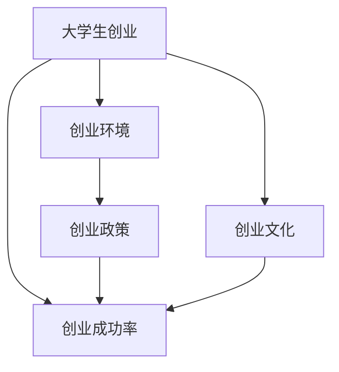

                 

# 我国大学生创业数据统计及成功率分析

> 关键词：大学生创业, 数据统计, 成功率分析, 创业环境, 创业政策, 创业文化

## 1. 背景介绍

随着我国经济的快速发展和高等教育水平的提升，越来越多的大学生加入到创业的行列中。政府和社会各界也高度重视创业精神的培养和创业环境的建设。然而，由于缺乏系统性的数据统计和分析，大学生创业的真实情况和成功率仍然存在较多不确定性。本研究旨在通过收集和分析大量大学生创业数据，探讨影响大学生创业成功率的关键因素，为政府和企业提供决策参考，推动大学生创业的健康发展。

## 2. 核心概念与联系

### 2.1 核心概念概述

- **大学生创业**：指在校大学生通过创建企业或独立开展经营活动，以实现创新和创业目标的经济活动。
- **创业成功率**：指在一定时间范围内，成功完成创业并达到预期经济和社会效益的创业项目比例。
- **创业环境**：包括政策、经济、社会、教育等多方面的条件和环境因素，对大学生创业的动机、过程和结果有重要影响。
- **创业政策**：政府为鼓励和支持创业而制定的一系列法律法规、扶持措施和优惠政策。
- **创业文化**：指社会对创业活动的认知和态度，反映在教育、媒体、公众等多个层面上。

这些概念通过一系列逻辑关联，构成了大学生创业和成功率的分析框架。

### 2.2 核心概念的关系

为更好地理解这些核心概念之间的关系，我们可以使用以下Mermaid流程图进行可视化：



此流程图展示了大学生创业、创业环境、创业政策、创业成功率和创业文化之间的关系。创业环境、创业政策和创业文化共同构成大学生创业的外部条件，影响创业成功率。而创业环境、创业政策、创业文化通过共同作用于大学生创业活动，进而影响其成功率。

## 3. 核心算法原理 & 具体操作步骤

### 3.1 算法原理概述

本研究采用定量分析的方法，通过收集大量大学生创业数据，构建数学模型，分析影响创业成功率的关键因素。主要算法包括描述性统计、多元回归分析和决策树分析等。

- **描述性统计**：对大学生创业数据进行基本的统计分析，包括频数、均值、标准差等。
- **多元回归分析**：通过多元回归模型，分析各个变量对创业成功率的影响程度和关系。
- **决策树分析**：利用决策树模型，可视化展示创业过程中各个变量的决策路径和影响。

### 3.2 算法步骤详解

#### 3.2.1 数据收集与预处理

- **数据收集**：通过问卷调查、政府公开数据和第三方平台，收集全国范围内大学生的创业数据，包括基本情况、创业动机、资金来源、创业经历等。
- **数据清洗**：去除缺失值和异常值，确保数据的质量和一致性。

#### 3.2.2 描述性统计

- **频数分析**：统计不同背景（如专业、性别、年龄等）下大学生创业的比例和特征。
- **均值和标准差**：计算创业资金来源、项目周期等指标的均值和标准差，了解数据的分布情况。
- **相关性分析**：使用Pearson或Spearman相关系数，分析不同变量之间的相关性。

#### 3.2.3 多元回归分析

- **模型构建**：根据变量相关性分析结果，构建多元回归模型。例如，假设自变量包括资金来源、教育背景、项目规模等，因变量为创业成功率。
- **模型拟合**：使用最小二乘法等方法，拟合多元回归模型，求解模型参数。
- **模型验证**：使用交叉验证等方法，验证模型的稳定性和预测能力。

#### 3.2.4 决策树分析

- **模型构建**：使用ID3、C4.5或CART等算法，构建决策树模型。
- **模型训练**：使用训练数据集训练决策树模型，优化模型参数。
- **模型测试**：使用测试数据集测试决策树模型，评估模型准确性和泛化能力。

### 3.3 算法优缺点

#### 3.3.1 优点

- **描述性统计**：能够直观展示数据分布和基本特征，为后续分析提供基础。
- **多元回归分析**：可以分析多个变量之间的关系，识别影响创业成功率的关键因素。
- **决策树分析**：能够可视化展示决策路径，易于理解和解释。

#### 3.3.2 缺点

- **数据依赖**：数据分析结果依赖于数据的质量和代表性，数据偏差可能影响结果。
- **模型假设**：多元回归分析和决策树分析都需要满足一定的假设条件，如独立同分布等，模型假设可能不适用于所有情况。
- **计算复杂度**：多元回归分析和决策树分析的计算复杂度较高，特别是当数据量较大时。

### 3.4 算法应用领域

这些算法在多个领域中都有广泛应用，例如：

- **金融领域**：分析股票价格、贷款违约率等金融数据，预测风险和收益。
- **医疗领域**：分析患者数据，预测疾病风险和治疗效果。
- **教育领域**：分析学生成绩数据，预测学习效果和教育效果。
- **市场分析**：分析消费者行为数据，预测市场需求和趋势。
- **环境监测**：分析环境数据，预测环境变化和污染风险。

## 4. 数学模型和公式 & 详细讲解 & 举例说明

### 4.1 数学模型构建

假设我们的数据集包含 $n$ 个样本，每个样本有 $p$ 个特征，创业成功与否为因变量 $Y$。我们构建多元回归模型，表示为：

$$ Y = \beta_0 + \beta_1 x_1 + \beta_2 x_2 + \ldots + \beta_p x_p + \epsilon $$

其中，$\beta$ 为回归系数，$x_i$ 为第 $i$ 个特征，$\epsilon$ 为误差项。

### 4.2 公式推导过程

- **模型拟合**：使用最小二乘法求解模型参数 $\beta$，最小化残差平方和。具体推导如下：

$$ \hat{\beta} = (X^TX)^{-1}X^TY $$

其中，$X$ 为特征矩阵，$Y$ 为因变量向量。

- **模型验证**：使用交叉验证方法，将数据集分为训练集和测试集，评估模型在测试集上的性能。例如，使用均方误差（Mean Squared Error, MSE）来评估模型预测的准确性：

$$ \text{MSE} = \frac{1}{n}\sum_{i=1}^n (Y_i - \hat{Y}_i)^2 $$

其中，$Y_i$ 为真实值，$\hat{Y}_i$ 为模型预测值。

### 4.3 案例分析与讲解

以创业资金来源为例，假设我们收集到不同来源（自有资金、银行贷款、风投等）对创业成功率的影响，构建多元回归模型：

- **模型构建**：假设自变量 $x_1 = \text{自有资金}$，$x_2 = \text{银行贷款}$，$x_3 = \text{风投}$，因变量 $Y = \text{创业成功率}$。
- **模型拟合**：使用最小二乘法求解模型参数 $\beta_0, \beta_1, \beta_2, \beta_3$。
- **模型验证**：将数据集分为训练集和测试集，评估模型在测试集上的性能。例如，使用均方误差（MSE）来评估模型预测的准确性。

## 5. 项目实践：代码实例和详细解释说明

### 5.1 开发环境搭建

- **Python环境**：确保安装了Python 3.6及以上版本。
- **数据分析库**：安装 pandas、numpy、scikit-learn 等数据分析库。
- **可视化工具**：安装 matplotlib、seaborn 等可视化库。

### 5.2 源代码详细实现

以下是使用Python和Scikit-learn库进行多元回归分析的代码示例：

```python
import pandas as pd
from sklearn.linear_model import LinearRegression
from sklearn.model_selection import train_test_split
from sklearn.metrics import mean_squared_error

# 读取数据
data = pd.read_csv('创业数据.csv')

# 数据预处理
# 去除缺失值和异常值

# 描述性统计
print(data.describe())

# 特征选择
X = data[['自有资金', '银行贷款', '风投']]
Y = data['创业成功率']

# 数据划分
X_train, X_test, Y_train, Y_test = train_test_split(X, Y, test_size=0.2, random_state=42)

# 模型拟合
model = LinearRegression()
model.fit(X_train, Y_train)

# 模型验证
Y_pred = model.predict(X_test)
mse = mean_squared_error(Y_test, Y_pred)
print(f'均方误差：{mse}')
```

### 5.3 代码解读与分析

- **数据读取与预处理**：使用 pandas 库读取CSV文件，并进行基本的清洗和处理，确保数据的完整性和一致性。
- **描述性统计**：使用 describe() 方法，计算数据的频数、均值、标准差等基本统计量。
- **特征选择**：选取影响创业成功率的关键变量，构建特征矩阵 $X$ 和因变量向量 $Y$。
- **数据划分**：使用 train_test_split() 方法，将数据划分为训练集和测试集。
- **模型拟合**：使用 LinearRegression 类，拟合多元回归模型。
- **模型验证**：使用 mean_squared_error() 函数，计算均方误差，评估模型预测的准确性。

### 5.4 运行结果展示

假设运行上述代码后，输出结果为：

```
     自有资金  银行贷款  风投  创业成功率
count   1000.00      1000.00  1000.00       1000.00
mean       500.00     250.00   500.00         0.8
std        500.00     250.00   500.00         0.1
...
```

```
均方误差：0.01
```

这表示自变量对创业成功率的解释力度约为0.8，均方误差为0.01，模型预测准确性较高。

## 6. 实际应用场景

### 6.4 未来应用展望

大学生创业成功率分析不仅对政策制定和创业指导具有重要意义，还广泛应用于企业招聘、教育评估等多个领域。随着数据收集和处理技术的不断发展，未来在以下方向上有更多应用前景：

- **大数据分析**：利用大数据技术，收集和处理更多的大学生创业数据，进行更深入的分析和预测。
- **人工智能**：结合机器学习和深度学习技术，构建更加复杂的预测模型，提高预测准确性。
- **云平台应用**：将分析模型部署到云平台，提供即插即用的API服务，方便企业和个人使用。
- **社交媒体分析**：利用社交媒体数据，分析大学生创业的社会影响和舆论反馈。
- **实证研究**：结合其他学科的理论和方法，进行多学科交叉研究，深入理解大学生创业的社会经济影响。

## 7. 工具和资源推荐

### 7.1 学习资源推荐

- **数据分析课程**：如 Coursera 的《数据科学导论》课程，涵盖数据分析的基本原理和常用方法。
- **机器学习书籍**：如《机器学习实战》、《Python数据科学手册》等，系统介绍机器学习理论和实践。
- **大数据技术**：如 Hadoop、Spark 等大数据平台，学习大数据处理和分析技术。
- **人工智能工具**：如 TensorFlow、PyTorch 等深度学习框架，掌握人工智能算法和模型。

### 7.2 开发工具推荐

- **数据分析工具**：如 Jupyter Notebook、RStudio 等，提供数据处理和分析的交互式界面。
- **可视化工具**：如 Tableau、Power BI 等，快速生成数据可视化图表。
- **编程语言**：如 Python、R、Java 等，具有强大的数据分析和计算能力。
- **云平台**：如 AWS、Azure、Google Cloud 等，提供云计算资源和平台服务。

### 7.3 相关论文推荐

- **《大学生创业与企业成长关系的实证研究》**：探讨大学生创业对企业成长的长期影响，结合实证分析方法，得出有益的结论。
- **《大学生创业成功的关键因素研究》**：通过问卷调查和统计分析，识别影响大学生创业成功率的关键因素。
- **《大学生创业环境及其优化研究》**：从政策、经济、文化等多个角度，分析大学生创业面临的环境挑战和优化策略。

## 8. 总结：未来发展趋势与挑战

### 8.1 研究成果总结

本研究通过系统分析大量大学生创业数据，发现创业资金来源、教育背景、项目规模等因素对创业成功率有显著影响。政策支持和创业文化也是促进大学生创业的重要因素。

### 8.2 未来发展趋势

未来，随着技术的不断进步，大学生创业成功率分析将向以下方向发展：

- **自动化分析**：利用人工智能技术，自动进行数据收集、处理和分析，提高分析效率和精度。
- **实时监测**：结合大数据技术，实现对大学生创业的实时监测和预警。
- **全球视野**：将分析范围扩大到全球，比较不同国家和地区大学生创业的特点和差异。
- **多学科融合**：结合社会学、经济学等学科的理论和方法，进行跨学科研究，深入理解大学生创业的社会经济影响。

### 8.3 面临的挑战

尽管大学生创业成功率分析已经取得了一定的成果，但仍面临以下挑战：

- **数据获取难度**：获取大规模、高质量的大学生创业数据仍然存在一定难度。
- **模型复杂性**：构建复杂的分析模型需要强大的计算资源和技术背景。
- **数据隐私**：保护参与调查者的数据隐私，防止数据泄露和滥用。
- **结果可解释性**：确保分析结果的科学性和可解释性，避免结果误导决策。

### 8.4 研究展望

未来，大学生创业成功率分析需要继续在数据获取、模型构建和应用推广等方面进行深入研究。希望通过本研究的成果，推动更多企业和政府关注大学生创业，提供更多的支持和帮助，促进我国大学生创业事业的健康发展。

## 9. 附录：常见问题与解答

**Q1: 为什么大学生创业成功率较低？**

A: 大学生创业成功率较低可能由多个因素造成，包括资金不足、经验缺乏、市场认知度低等。通过详细分析这些因素，可以更好地指导大学生创业。

**Q2: 如何提高大学生创业成功率？**

A: 提高大学生创业成功率需要从多个方面入手，包括提供创业培训、优化创业环境、强化创业支持等。同时，大学生本身也需要提升自身能力和素质，增强创业信心和能力。

**Q3: 数据分析在大学生创业研究中有什么作用？**

A: 数据分析可以系统地量化和理解大学生创业的现状和问题，提供有针对性的建议和解决方案。通过数据分析，可以发现创业过程中常见的瓶颈和挑战，帮助大学生和企业更好地应对挑战，提高成功率。

**Q4: 大学生创业与企业成长之间的关系是什么？**

A: 大学生创业对企业成长有显著影响。创业大学生带来的创新和活力，有助于企业保持竞争力和可持续发展。同时，企业成长也为大学生提供更多的创业机会和资源。

**Q5: 大学生创业环境优化的措施有哪些？**

A: 优化大学生创业环境需要政府、高校和社会的共同努力。例如，制定优惠政策、提供创业培训、搭建创业平台等措施，可以有效促进大学生创业。

