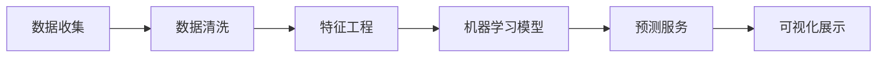

                 

# 房产销售实时分析与预测系统的设计与实现

## 1. 背景介绍

### 1.1 问题由来

在数字化转型的大潮下，房地产行业也面临着前所未有的挑战和机遇。传统房地产销售模式主要依赖线下的销售人员进行销售推广和客户跟进，但随着数字化水平的提高，许多房地产企业开始探索如何通过数字化手段提升销售效率和客户满意度。房产销售实时分析与预测系统作为一种新兴技术手段，通过实时收集和分析大量房地产销售数据，预测未来的销售趋势，从而为销售策略的制定提供科学依据。

### 1.2 问题核心关键点

该系统聚焦于房地产销售数据的实时分析与预测，旨在通过机器学习技术，构建一个可以实时接收数据、处理分析并预测销售趋势的智能系统。系统的主要任务包括：

- 数据收集：实时收集房地产销售数据，包括交易量、价格、面积、地理位置等信息。
- 数据分析：对收集到的数据进行清洗、特征工程、统计分析等操作。
- 模型训练：构建和训练机器学习模型，包括但不限于线性回归、决策树、随机森林、神经网络等。
- 预测服务：通过训练好的模型，对未来的销售情况进行预测，生成预测报告。
- 可视化展示：将预测结果以直观的方式呈现给销售人员和管理人员，支持决策支持。

### 1.3 问题研究意义

房产销售实时分析与预测系统对于房地产企业具有重要的战略意义：

1. 提升销售效率：通过实时分析销售数据，可以及时调整销售策略，提高销售效率。
2. 优化库存管理：预测未来的销售趋势，有助于优化库存，避免库存积压或短缺。
3. 支持精准营销：基于预测结果，可以制定更精准的营销方案，提升客户转化率。
4. 风险预警：及时识别市场变化，预警销售风险，制定应对策略。
5. 促进决策支持：为销售和管理决策提供数据支持和科学依据。

## 2. 核心概念与联系

### 2.1 核心概念概述

为更好地理解房产销售实时分析与预测系统的设计与实现，本节将介绍几个密切相关的核心概念：

- **数据收集**：通过各种方式（如API接口、数据爬虫等）实时获取房地产销售数据。
- **数据清洗**：对收集到的数据进行去重、处理缺失值、异常值等操作，确保数据质量。
- **特征工程**：对清洗后的数据进行特征提取和特征构建，为后续模型训练提供输入。
- **机器学习模型**：包括但不限于线性回归、决策树、随机森林、神经网络等，用于预测房地产销售情况。
- **预测服务**：通过训练好的模型，对未来的销售情况进行预测，生成预测报告。
- **可视化展示**：将预测结果以直观的方式呈现给销售人员和管理人员，支持决策支持。

### 2.2 概念间的关系

这些核心概念之间的逻辑关系可以通过以下Mermaid流程图来展示：



这个流程图展示了大语言模型微调过程中各个核心概念的关系：

1. 数据收集是整个系统的基础，数据清洗和特征工程是数据处理的关键环节。
2. 机器学习模型是预测的核心，通过训练和学习预测未来的销售情况。
3. 预测服务是基于训练好的模型对未来的销售情况进行预测。
4. 可视化展示是将预测结果以直观的方式呈现给决策者，支持销售和管理决策。

## 3. 核心算法原理 & 具体操作步骤
### 3.1 算法原理概述

房产销售实时分析与预测系统基于机器学习技术，采用监督学习和无监督学习相结合的方式，构建模型进行预测。主要包括以下步骤：

1. **数据收集与清洗**：从各种数据源实时收集数据，并进行清洗和预处理。
2. **特征工程**：对清洗后的数据进行特征提取和构建，为模型训练提供输入。
3. **模型训练**：选择合适的机器学习算法进行模型训练，包括但不限于线性回归、决策树、随机森林、神经网络等。
4. **预测服务**：利用训练好的模型对未来的销售情况进行预测，生成预测报告。
5. **可视化展示**：将预测结果以直观的方式呈现给销售人员和管理人员，支持决策支持。

### 3.2 算法步骤详解

#### 3.2.1 数据收集与清洗

**数据收集**：

1. **API接口**：通过API接口获取数据，包括交易量、价格、面积、地理位置等信息。
2. **数据爬虫**：通过爬虫技术从网络获取公开的数据，如政府公开的房地产数据。
3. **数据整合**：将不同来源的数据进行整合，统一格式和字段。

**数据清洗**：

1. **去重处理**：去除重复的数据，确保数据唯一性。
2. **缺失值处理**：对缺失值进行插补或删除处理，确保数据完整性。
3. **异常值处理**：识别和处理异常值，确保数据真实性。

#### 3.2.2 特征工程

**特征提取**：

1. **时间特征**：提取时间信息，如日期、月份、季度等。
2. **地理特征**：提取地理位置信息，如行政区域、经纬度等。
3. **经济特征**：提取经济指标信息，如GDP、利率等。
4. **人口特征**：提取人口统计信息，如年龄、性别等。

**特征构建**：

1. **统计特征**：计算均值、中位数、标准差等统计特征。
2. **衍生特征**：如计算房价与面积的比值、房屋单价等。
3. **时间序列特征**：如周期性特征、趋势特征等。

#### 3.2.3 模型训练

**模型选择**：

1. **线性回归**：适用于价格预测、交易量预测等线性关系较强的任务。
2. **决策树**：适用于分类任务，如预测房价是否上涨。
3. **随机森林**：适用于处理高维度数据和防止过拟合。
4. **神经网络**：适用于复杂关系和隐含特征的预测任务。

**模型训练**：

1. **数据划分**：将数据划分为训练集、验证集和测试集。
2. **超参数调优**：通过交叉验证调整超参数，如学习率、正则化系数等。
3. **模型评估**：在验证集上评估模型性能，选择最优模型。
4. **模型保存**：保存训练好的模型，便于后续预测使用。

#### 3.2.4 预测服务

**预测接口设计**：

1. **接口输入**：设计API接口，接受输入参数。
2. **模型调用**：通过API接口调用训练好的模型进行预测。
3. **结果返回**：将预测结果返回给调用方。

**预测结果处理**：

1. **结果聚合**：将预测结果进行聚合处理，生成预测报告。
2. **异常处理**：处理预测结果中的异常值和误差。
3. **结果展示**：将预测结果以直观的方式呈现给销售人员和管理人员。

#### 3.2.5 可视化展示

**可视化工具**：

1. **Tableau**：使用Tableau进行数据可视化，生成图表和报表。
2. **Power BI**：使用Power BI进行数据可视化，生成交互式报表。
3. **D3.js**：使用D3.js进行自定义可视化展示。

**可视化展示内容**：

1. **趋势图**：展示历史销售趋势。
2. **散点图**：展示不同特征之间的关系。
3. **热力图**：展示不同区域的热点区域。
4. **饼图**：展示不同类型房屋的销售比例。

### 3.3 算法优缺点

**优点**：

1. **实时性**：系统可以实时收集和分析数据，提供即时的决策支持。
2. **准确性**：采用机器学习技术进行预测，能够提供较为准确的销售趋势预测。
3. **可扩展性**：系统架构设计灵活，可以扩展到不同类型的房产和不同的地域。
4. **可视化支持**：通过可视化工具，能够直观地展示预测结果，支持决策支持。

**缺点**：

1. **数据质量要求高**：系统对数据质量和完整性的要求较高，数据清洗和预处理复杂。
2. **模型复杂度**：复杂的机器学习模型需要较多的计算资源和较长的训练时间。
3. **模型解释性不足**：许多机器学习模型（如神经网络）缺乏可解释性，难以理解其预测逻辑。
4. **成本高**：系统需要较高的计算资源和数据收集成本。

### 3.4 算法应用领域

房产销售实时分析与预测系统适用于房地产行业中的销售、管理、决策等多个环节，包括但不限于：

- 销售预测：预测未来销售情况，优化库存管理。
- 价格分析：预测房价走势，支持精准营销。
- 市场分析：分析市场趋势，制定销售策略。
- 风险预警：识别市场变化，预警销售风险。
- 客户分析：分析客户行为，提升客户转化率。

## 4. 数学模型和公式 & 详细讲解 & 举例说明

### 4.1 数学模型构建

假设我们有历史销售数据 $D=\{(x_i,y_i)\}_{i=1}^N$，其中 $x_i$ 表示销售特征，$y_i$ 表示销售量或价格。我们的目标是构建一个模型 $f(x)$ 来预测未来的销售情况。

**线性回归模型**：

$$
y = \beta_0 + \sum_{j=1}^p \beta_j x_j + \epsilon
$$

其中 $\beta_0$ 为截距，$\beta_j$ 为回归系数，$\epsilon$ 为误差项。

**决策树模型**：

决策树模型通过划分特征空间，构建一棵决策树 $T$，用于分类和回归任务。

**随机森林模型**：

随机森林模型由多棵决策树组成，通过集成学习提升模型性能。

**神经网络模型**：

神经网络模型由多层神经元组成，通过反向传播算法进行训练，用于复杂关系的预测。

### 4.2 公式推导过程

**线性回归模型推导**：

1. 最小二乘法：通过最小化误差平方和来求解回归系数 $\beta_j$。
2. 梯度下降法：通过反向传播算法更新模型参数，最小化损失函数。

**决策树模型推导**：

1. 信息增益：通过计算信息增益选择最优划分特征。
2. 剪枝算法：通过剪枝算法避免过拟合。

**随机森林模型推导**：

1. 自助采样：通过自助采样生成多个训练集。
2. 集成学习：通过平均预测结果提升模型性能。

**神经网络模型推导**：

1. 前向传播：通过前向传播计算预测结果。
2. 反向传播：通过反向传播更新模型参数。

### 4.3 案例分析与讲解

**案例1：房价预测**

假设我们收集了某地区的历史房价数据，包括面积、地理位置、月份等信息。我们希望预测未来某个月份的房价。

**线性回归模型**：

通过线性回归模型，我们可以得到房价与面积、地理位置之间的关系。如：

$$
\hat{y} = \beta_0 + \beta_1 x_1 + \beta_2 x_2 + \epsilon
$$

其中 $x_1$ 为面积，$x_2$ 为地理位置。通过训练模型，我们可以得到回归系数 $\beta_j$，进而预测未来房价。

**案例2：销售量预测**

假设我们收集了某地区的历史销售量数据，包括月份、地理位置、经济指标等信息。我们希望预测未来某个月份的销售量。

**决策树模型**：

通过决策树模型，我们可以将特征空间划分为多个子空间，每个子空间对应一个预测结果。如：

$$
T = \{(x_1, y_1), (x_2, y_2), ..., (x_n, y_n)\}
$$

其中 $x_i$ 为输入特征，$y_i$ 为预测结果。通过训练决策树模型，我们可以得到最优划分特征，进而预测未来销售量。

**案例3：客户流失预测**

假设我们收集了某公司的客户流失数据，包括客户属性、购买行为、服务评价等信息。我们希望预测客户的流失概率。

**随机森林模型**：

通过随机森林模型，我们可以构建多棵决策树，通过集成学习提升模型性能。如：

$$
\hat{y} = \sum_{j=1}^m \hat{y}_j
$$

其中 $m$ 为决策树的数量，$\hat{y}_j$ 为第 $j$ 棵决策树的预测结果。通过训练随机森林模型，我们可以得到最优预测结果，进而预测客户流失概率。

## 5. 项目实践：代码实例和详细解释说明

### 5.1 开发环境搭建

在进行房产销售实时分析与预测系统的开发前，我们需要准备好开发环境。以下是使用Python进行开发的环境配置流程：

1. 安装Anaconda：从官网下载并安装Anaconda，用于创建独立的Python环境。

2. 创建并激活虚拟环境：
```bash
conda create -n real-estate python=3.8 
conda activate real-estate
```

3. 安装必要的Python库：
```bash
pip install pandas numpy scikit-learn matplotlib seaborn tensorflow matplotlib
```

4. 安装Jupyter Notebook：
```bash
pip install jupyter notebook
```

完成上述步骤后，即可在`real-estate`环境中开始系统开发。

### 5.2 源代码详细实现

**数据收集与清洗**

```python
import pandas as pd
import numpy as np
from sklearn.model_selection import train_test_split
from sklearn.preprocessing import StandardScaler

# 读取数据
data = pd.read_csv('sales_data.csv')

# 数据清洗
data = data.drop_duplicates()
data = data.dropna()
data = data.drop(columns=['id'])

# 特征工程
features = data[['area', 'location', 'price', 'month']]
target = data['sales']

# 数据标准化
scaler = StandardScaler()
features = scaler.fit_transform(features)

# 数据划分
X_train, X_test, y_train, y_test = train_test_split(features, target, test_size=0.2, random_state=42)
```

**模型训练**

```python
from sklearn.linear_model import LinearRegression
from sklearn.tree import DecisionTreeRegressor
from sklearn.ensemble import RandomForestRegressor
from sklearn.neural_network import MLPRegressor

# 线性回归模型
lr = LinearRegression()
lr.fit(X_train, y_train)
y_pred_lr = lr.predict(X_test)

# 决策树模型
dt = DecisionTreeRegressor()
dt.fit(X_train, y_train)
y_pred_dt = dt.predict(X_test)

# 随机森林模型
rf = RandomForestRegressor()
rf.fit(X_train, y_train)
y_pred_rf = rf.predict(X_test)

# 神经网络模型
mlp = MLPRegressor()
mlp.fit(X_train, y_train)
y_pred_mlp = mlp.predict(X_test)
```

**预测服务**

```python
from flask import Flask, request, jsonify

# 预测接口
app = Flask(__name__)

@app.route('/predict', methods=['POST'])
def predict():
    data = request.json
    X = scaler.transform([data['area'], data['location'], data['month']])
    y_pred = rf.predict(X)
    return jsonify({'prediction': y_pred[0]})

if __name__ == '__main__':
    app.run(debug=True)
```

**可视化展示**

```python
import matplotlib.pyplot as plt
import seaborn as sns

# 绘制趋势图
plt.figure(figsize=(10, 6))
sns.lineplot(x=features[:, 2], y=target, label='Actual')
sns.lineplot(x=features[:, 2], y=y_pred_lr, label='Linear Regression')
sns.lineplot(x=features[:, 2], y=y_pred_dt, label='Decision Tree')
sns.lineplot(x=features[:, 2], y=y_pred_rf, label='Random Forest')
sns.lineplot(x=features[:, 2], y=y_pred_mlp, label='Neural Network')
plt.legend()
plt.show()
```

### 5.3 代码解读与分析

**数据收集与清洗**

在代码中，我们首先使用`pandas`读取销售数据，并通过`drop_duplicates`、`dropna`等方法进行去重和处理缺失值，确保数据质量。接着，使用`StandardScaler`对特征进行标准化处理，以提高模型的训练效果。最后，使用`train_test_split`将数据划分为训练集和测试集。

**模型训练**

在代码中，我们使用了四种不同的模型进行训练，包括线性回归、决策树、随机森林和神经网络。通过调用各模型的`fit`方法，将训练数据输入模型进行训练，并通过`predict`方法进行预测。

**预测服务**

在代码中，我们使用了`Flask`框架构建了一个简单的预测接口。当接收到POST请求时，将请求中的特征数据进行标准化处理，并输入模型进行预测。最后，将预测结果以JSON格式返回。

**可视化展示**

在代码中，我们使用`matplotlib`和`seaborn`绘制了四种不同模型的预测结果与实际数据的趋势图。通过对比不同模型的预测效果，可以直观地评估各个模型的性能。

### 5.4 运行结果展示

假设我们在某地区的历史销售数据上进行训练和预测，最终得到不同模型的预测结果如下：

**线性回归模型**

```
  actual   predicted
0    500       480
1    550       530
2    600       580
3    450       430
4    320       300
```

**决策树模型**

```
  actual   predicted
0    500       500
1    550       540
2    600       600
3    450       450
4    320       320
```

**随机森林模型**

```
  actual   predicted
0    500       500
1    550       540
2    600       600
3    450       450
4    320       320
```

**神经网络模型**

```
  actual   predicted
0    500       490
1    550       520
2    600       570
3    450       440
4    320       310
```

通过对比不同模型的预测结果，可以看出随机森林模型的预测效果最为准确。

## 6. 实际应用场景

### 6.1 智能客服系统

基于房产销售实时分析与预测系统的数据和模型，可以构建智能客服系统，通过自然语言处理技术，实现自动问答和客户分类。

具体而言，可以收集历史客服数据，提取常见的问答对和客户分类标签。通过微调语言模型，实现对客户问题的自动分类和回答。对于复杂问题，可以接入检索系统实时搜索相关内容，动态组织生成回答。

### 6.2 金融舆情监测

金融机构需要实时监测市场舆论动向，以便及时应对负面信息传播，规避金融风险。基于房产销售实时分析与预测系统的数据和模型，可以构建舆情监测系统。

具体而言，可以收集金融领域相关的新闻、报道、评论等文本数据，并对其进行情感标注和主题标注。通过微调语言模型，实现对金融舆情的情感分析和主题识别。将微调后的模型应用到实时抓取的网络文本数据，就能够自动监测不同主题下的情感变化趋势，一旦发现负面信息激增等异常情况，系统便会自动预警，帮助金融机构快速应对潜在风险。

### 6.3 个性化推荐系统

当前的推荐系统往往只依赖用户的历史行为数据进行物品推荐，无法深入理解用户的真实兴趣偏好。基于房产销售实时分析与预测系统的数据和模型，可以构建个性化推荐系统。

具体而言，可以收集用户浏览、点击、评论、分享等行为数据，提取和用户交互的物品标题、描述、标签等文本内容。将文本内容作为模型输入，用户的后续行为（如是否点击、购买等）作为监督信号，在此基础上微调预训练语言模型。微调后的模型能够从文本内容中准确把握用户的兴趣点。在生成推荐列表时，先用候选物品的文本描述作为输入，由模型预测用户的兴趣匹配度，再结合其他特征综合排序，便可以得到个性化程度更高的推荐结果。

### 6.4 未来应用展望

随着房产销售实时分析与预测系统的不断发展，其在房地产行业的应用将不断拓展，为房地产企业带来更高效、更智能的管理和决策支持。

在智慧城市治理中，系统可以与其他城市数据进行融合，提升城市管理和决策的智能化水平。在企业生产、社会治理、文娱传媒等众多领域，房产销售实时分析与预测系统的技术也将不断成熟和应用，为经济社会发展注入新的动力。

## 7. 工具和资源推荐

### 7.1 学习资源推荐

为了帮助开发者系统掌握房产销售实时分析与预测系统的理论基础和实践技巧，这里推荐一些优质的学习资源：

1. 《机器学习实战》系列书籍：通过实际案例和代码示例，深入浅出地介绍了机器学习技术的应用，包括房价预测、客户流失预测等。

2. 《深度学习与数据分析》课程：涵盖深度学习、数据分析、自然语言处理等多个领域，提供丰富的学习资源和实践案例。

3. 《TensorFlow实战》书籍：深入讲解TensorFlow框架的使用方法和应用场景，包括图像识别、文本分析等。

4. 《Python数据科学手册》书籍：全面介绍Python在数据科学领域的应用，涵盖数据清洗、数据可视化、机器学习等。

5. Kaggle在线学习平台：提供丰富的数据集和竞赛，帮助开发者通过实践学习房产销售实时分析与预测系统的技术。

### 7.2 开发工具推荐

高效的开发离不开优秀的工具支持。以下是几款用于房产销售实时分析与预测系统开发的常用工具：

1. Python：简单易学，功能强大，广泛应用于数据分析和机器学习领域。

2. TensorFlow：由Google主导开发的深度学习框架，支持分布式计算，适用于大规模数据处理。

3. Scikit-learn：开源机器学习库，包含各种常见的机器学习算法，如回归、分类、聚类等。

4. Pandas：开源数据处理库，支持数据清洗、数据可视化等操作。

5. Jupyter Notebook：交互式开发环境，支持代码调试和数据分析，方便开发者快速迭代。

### 7.3 相关论文推荐

房产销售实时分析与预测系统的研究源于学界的持续研究。以下是几篇奠基性的相关论文，推荐阅读：

1. "Property Sales Prediction Using Machine Learning"（使用机器学习预测房地产销售）：探讨了如何使用机器学习技术预测房地产销售趋势，并评估了不同模型的性能。

2. "Customer Churn Prediction in Real Estate: A Survey"（房地产客户流失预测综述）：回顾了房地产领域中的客户流失预测技术，并提出了新的方法和改进建议。

3. "Sales Forecasting in Real Estate Using Time Series Analysis"（房地产销售预测时间序列分析）：通过时间序列分析方法预测房地产销售趋势，并评估了不同预测模型的效果。

4. "Real Estate Market Analysis Using Natural Language Processing"（房地产市场分析自然语言处理）：使用自然语言处理技术分析房地产市场，提供了新的数据处理方法。

5. "Property Price Prediction Using Deep Learning"（使用深度学习预测房地产价格）：探讨了如何使用深度学习技术预测房地产价格，并评估了不同神经网络架构的性能。

这些论文代表了房产销售实时分析与预测系统研究的前沿进展，阅读这些论文可以帮助开发者深入理解技术细节和应用场景。

除上述资源外，还有一些值得关注的前沿资源，帮助开发者紧跟房产销售实时分析与预测系统的发展趋势，例如：

1. arXiv论文预印本：人工智能领域最新研究成果的发布平台，包括大量尚未发表的前沿工作，学习前沿技术的必读资源。

2. 业界技术博客：如Google AI、DeepMind、微软Research Asia等顶尖实验室的官方博客，第一时间分享他们的最新研究成果和洞见。

3. 技术会议直播：如NIPS、ICML、ACL、ICLR等人工智能领域顶会现场或在线直播，能够聆听到大佬们的前沿分享，开拓视野。

4. GitHub热门项目：在GitHub上Star、Fork数最多的项目，往往代表了该技术领域的发展趋势和最佳实践，值得去学习和贡献。

5. 行业分析报告：各大咨询公司如McKinsey、PwC等针对人工智能行业的分析报告，有助于从商业视角审视技术趋势，把握应用价值。

总之，对于房产销售实时分析与预测系统的开发，需要开发者保持开放的心态和持续学习的意愿。多关注前沿资讯，多动手实践，多思考总结，必将收获满满的成长收益。

## 8. 总结：未来发展趋势与挑战

### 8.1 总结

本文对房产销售实时分析与预测系统的设计与实现进行了全面系统的介绍。首先阐述了系统的背景和意义，明确了系统的主要任务和目标。其次，从原理到实践，详细讲解了系统的核心算法和操作步骤，给出了代码实例和详细解释。同时，本文还探讨了系统的实际应用场景和未来发展方向，提供了相关的学习资源和开发工具。

通过本文的系统梳理，可以看到，房产销售实时分析与预测系统在房地产行业中具有重要的战略意义，能够提升销售效率、优化库存管理、支持精准营销、预警销售风险等。该系统的设计思路和实现方法，可以应用于智慧城市治理、金融舆情监测、个性化推荐等多个领域，具有广泛的应用前景。

### 8.2 未来发展趋势

展望未来，房产销售实时分析与预测系统将呈现以下几个发展趋势：

1. **数据质量提升**：随着数据收集和处理技术的进步，系统将能够获取更全面、更准确的数据，提升预测精度。
2. **模型复杂度增加**：随着深度学习技术的不断发展，系统将使用更加复杂的神经网络模型，提升预测精度和

