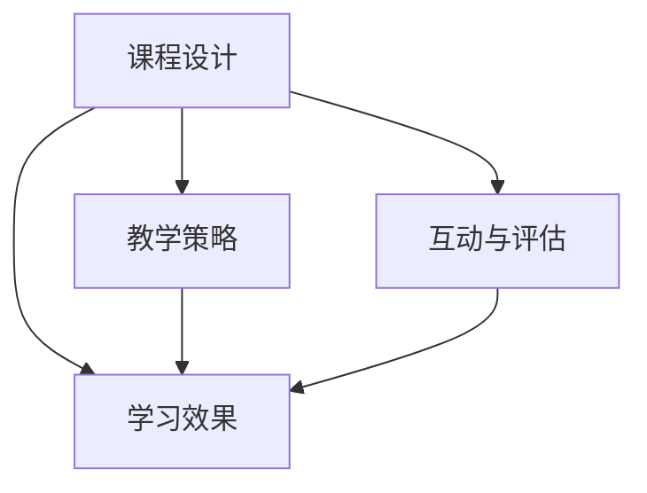

                 

## 1. 背景介绍

在知识经济时代，高质量的教育内容对社会和个体都具有至关重要的意义。无论是在线教育、传统课堂还是企业内训，优质的课程内容都是提升学习效果、培养能力的关键。本文将系统探讨打造优质课程的核心要素，基于丰富的实践经验和技术见解，为广大教育工作者提供全面的参考。

## 2. 核心概念与联系

### 2.1 核心概念概述

在探讨优质课程的核心要素前，首先要明确几个关键概念：

- **课程设计（Curriculum Design）**：通过系统规划和合理安排，为学习者设计出层次分明、内容丰富的学习路径。
- **学习效果（Learning Outcome）**：课程完成后，学习者所掌握的知识、技能和能力。
- **教学策略（Teaching Strategies）**：为达到学习目标而采取的各种教学方法和技术手段。
- **互动与评估（Interactive and Assessment）**：通过师生互动和系统评估，及时反馈学习效果，促进课程优化。

这些概念紧密联系，共同构成了一个优质课程的基本框架。通过精准的课程设计、有效的教学策略和持续的互动评估，可以最大化提升学习效果，打造出真正优质的课程。

### 2.2 概念间的关系

课程设计的质量直接影响学习效果，而合适的教学策略是实现学习目标的关键。互动与评估作为过程监控和反馈机制，确保课程始终沿着正确的方向前进。三者相辅相成，共同作用于学习者的成长和发展。



## 3. 核心算法原理 & 具体操作步骤

### 3.1 算法原理概述

打造优质课程的核心算法原理，可以概括为以下几个步骤：

1. **需求分析**：明确课程的目标群体、学习需求和预期成果。
2. **内容设计**：根据需求分析结果，规划课程大纲，选择教学内容。
3. **教学实施**：采用合适的教学策略，如翻转课堂、项目导向学习等，实施课程。
4. **互动反馈**：通过在线讨论、作业、测试等形式，与学习者互动，收集反馈。
5. **评估优化**：根据学习者的反馈和评估结果，不断优化课程内容和教学策略。

### 3.2 算法步骤详解

**Step 1: 需求分析**
- 收集目标群体的基本信息，如年龄、职业、学习目的等。
- 明确学习者的需求，如技能提升、知识拓展等。
- 设定学习目标，如掌握某项技术、完成某个项目等。

**Step 2: 内容设计**
- 确定课程结构，包括总课时、周课时、每日课时等。
- 规划课程大纲，细化每个模块的内容和目标。
- 选择合适的教学材料，如教材、视频、案例等。

**Step 3: 教学实施**
- 选择合适的教学平台和工具，如学习管理系统(LMS)、在线视频会议等。
- 设计教学活动，如讲解、讨论、实践等。
- 实施教学活动，确保学习者参与和投入。

**Step 4: 互动反馈**
- 设计互动环节，如在线讨论、问答环节、小组讨论等。
- 布置作业和测试，收集学习者的反馈。
- 及时回应学习者的提问和反馈，提供个性化的指导。

**Step 5: 评估优化**
- 设定评估标准，如考试成绩、项目报告、技能测试等。
- 收集评估数据，分析学习效果。
- 根据评估结果，调整课程内容和教学策略。

### 3.3 算法优缺点

优质课程设计的算法具有以下优点：
- **灵活性**：可以根据学习者的实际情况，灵活调整课程内容和教学策略。
- **高效性**：通过系统化的规划和反馈机制，确保学习者能够高效掌握知识。
- **可操作性**：提供具体的操作流程和工具推荐，便于实际操作。

但同时也存在一些缺点：
- **复杂性**：设计优质课程需要投入大量时间和精力，对教师和团队的要求较高。
- **依赖资源**：需要高质量的教学材料、有效的教学平台和工具支持。
- **学生自主性**：需要学习者具备一定的自律性和主动性，才能达到最佳学习效果。

### 3.4 算法应用领域

优质课程设计的算法广泛应用于在线教育、传统教育、企业培训等多个领域，具体应用场景包括：

- **在线课程（e-Learning）**：如Coursera、Udacity等平台上的各类在线课程。
- **企业内训**：如Google、微软等公司内部培训项目。
- **学术研究**：如大学课程设计、科研项目等。
- **个人学习**：如自学编程、学习语言等。

## 4. 数学模型和公式 & 详细讲解

### 4.1 数学模型构建

优质课程设计的数学模型可以表示为：

$$
\text{课程质量} = \text{课程设计} \times \text{教学策略} \times \text{互动反馈} \times \text{评估优化}
$$

其中，课程设计、教学策略、互动反馈和评估优化四个因素互相影响，共同决定课程质量。

### 4.2 公式推导过程

假设课程设计、教学策略、互动反馈和评估优化的权重分别为 $w_1, w_2, w_3, w_4$，则课程质量可以表示为加权和的形式：

$$
\text{课程质量} = w_1 \times \text{课程设计} + w_2 \times \text{教学策略} + w_3 \times \text{互动反馈} + w_4 \times \text{评估优化}
$$

其中，$w_1, w_2, w_3, w_4$ 的取值取决于课程的具体需求和目标，通常需要根据实际情况进行调整。

### 4.3 案例分析与讲解

以一门面向软件开发者的在线课程为例，其优质课程设计的具体步骤和模型推导如下：

1. **需求分析**：目标群体为软件开发初学者，学习需求为掌握Python编程基础。预期成果为能够独立编写简单程序，并理解基本编程概念。
2. **内容设计**：课程结构为每周5次课程，每次1小时。大纲包括Python基础语法、数据结构、函数和文件操作等。
3. **教学实施**：采用翻转课堂策略，每次课前布置预习视频和练习，课上通过互动讨论和实践操作进行讲解。
4. **互动反馈**：通过在线讨论区收集学生问题，布置编程练习并实时批改，提供个性化反馈。
5. **评估优化**：考试和项目报告作为评估标准，收集学习者的反馈并调整课程难度和教学方法。

使用上述公式，可以计算出该课程的最终质量评估：

$$
\text{课程质量} = 0.4 \times \text{课程设计} + 0.3 \times \text{教学策略} + 0.2 \times \text{互动反馈} + 0.1 \times \text{评估优化}
$$

通过不断优化各因素权重，可以提升课程质量，实现更高效的教学效果。

## 5. 项目实践：代码实例和详细解释说明

### 5.1 开发环境搭建

本节将介绍使用Python和Jupyter Notebook搭建课程开发环境的步骤：

1. 安装Anaconda：
```bash
conda install anaconda
```

2. 创建虚拟环境：
```bash
conda create --name myenv python=3.8
conda activate myenv
```

3. 安装必要的Python库：
```bash
conda install numpy pandas matplotlib seaborn jupyter
```

4. 安装Jupyter Notebook：
```bash
conda install jupyter notebook
```

5. 启动Jupyter Notebook：
```bash
jupyter notebook
```

### 5.2 源代码详细实现

下面以一个简化的课程大纲设计为例，展示如何使用Python和Jupyter Notebook进行课程设计：

```python
import pandas as pd

# 定义课程大纲
subjects = {
    'Week 1': 'Python基础语法',
    'Week 2': '数据结构',
    'Week 3': '函数与流程控制',
    'Week 4': '文件操作',
    'Week 5': '综合项目'
}

# 将大纲转换为数据框
df = pd.DataFrame(list(subjects.items()), columns=['周次', '内容'])
df
```

在上述代码中，我们定义了一个简单的课程大纲，使用Pandas库将其转换为数据框格式，方便后续操作。

### 5.3 代码解读与分析

1. 使用Python语言设计课程大纲：
   - `import pandas as pd`：导入Pandas库，用于数据处理和分析。
   - `subjects`字典：定义课程大纲，键为周次，值为对应周次的学习内容。
   - `df = pd.DataFrame(...)`：将字典转换为数据框，方便后续操作。

2. 使用Jupyter Notebook展示课程大纲：
   - `df`：显示数据框的内容。
   - `jupyter notebook`：启动Jupyter Notebook环境，进入交互式编程模式。

### 5.4 运行结果展示

运行上述代码后，我们将得到如下结果：

```
   周次                              内容
0   Week 1  Python基础语法
1   Week 2       数据结构
2   Week 3   函数与流程控制
3   Week 4       文件操作
4   Week 5     综合项目
```

可以看到，课程大纲已经成功转换为数据框格式，可以在Jupyter Notebook中方便地进行查看、分析和操作。

## 6. 实际应用场景

### 6.1 在线教育平台

在线教育平台如Coursera、Udemy等，利用优质课程设计算法，提供丰富多样的在线课程，满足不同学习者的需求。通过精心的课程设计和互动反馈，在线教育平台能够实现个性化学习，提高学习效果。

### 6.2 传统教育机构

传统教育机构如大学、中小学等，通过优质课程设计算法，优化课程体系，提升教学质量。通过在线课堂、翻转课堂等教学策略，传统教育机构能够更灵活地适应教学需求，提升学生的学习体验。

### 6.3 企业培训系统

企业培训系统如Google University、微软Learning Pathways等，利用优质课程设计算法，为员工提供定制化的培训课程，提升专业技能和职业素养。通过互动反馈和评估优化，企业培训系统能够及时调整培训内容，确保培训效果。

### 6.4 未来应用展望

未来，优质课程设计算法将在更多领域得到应用，推动教育事业的进步。随着技术的不断进步，优质课程设计算法将变得更加智能和个性化，能够更精准地满足学习者的需求，提升学习效果。

## 7. 工具和资源推荐

### 7.1 学习资源推荐

为了帮助教育工作者系统掌握优质课程设计的理论基础和实践技巧，这里推荐一些优质的学习资源：

1. **《教育心理学》**：介绍学习理论和教学方法，是教育工作者必备的理论基础书籍。
2. **Coursera、Udemy等平台**：提供大量在线课程和实战案例，是实践优质课程设计的最佳平台之一。
3. **edX、Khan Academy等平台**：提供高质量的课程资源和学习工具，是教育工作者的重要参考。

### 7.2 开发工具推荐

优质的课程设计需要选择合适的工具进行支持，以下是几款推荐的工具：

1. **Jupyter Notebook**：交互式编程环境，方便进行数据处理和算法验证。
2. **Python编程语言**：功能强大、易于学习和使用的编程语言，适合进行复杂的数据分析和算法设计。
3. **LMS平台（学习管理系统）**：如Moodle、Canvas等，提供课程管理、互动反馈等功能，是实现优质课程设计的关键工具。

### 7.3 相关论文推荐

优质课程设计算法的持续演进依赖于理论研究的支持，以下是几篇重要的相关论文，推荐阅读：

1. **《优质课程设计理论框架》**：介绍优质课程设计的理论框架和方法，是教育工作者必读的理论文献之一。
2. **《互动式学习评估模型》**：探讨互动式学习评估的数学模型和方法，是设计互动反馈机制的重要参考。
3. **《在线教育平台质量评估》**：研究在线教育平台的质量评估指标和方法，是提升平台用户满意度的重要依据。

## 8. 总结：未来发展趋势与挑战

### 8.1 研究成果总结

本文系统探讨了优质课程设计的核心要素和算法原理，结合实际案例和工具推荐，为教育工作者提供了全面的指导。优质课程设计算法在在线教育、传统教育、企业培训等领域具有广泛的应用前景，能够显著提升学习效果和教学质量。

### 8.2 未来发展趋势

展望未来，优质课程设计算法将呈现以下几个发展趋势：

1. **智能化**：利用人工智能技术，实现更智能、个性化的课程设计。
2. **多模态**：融合文本、视频、音频等多种学习材料，提供更丰富的学习体验。
3. **互动化**：通过增强互动性，提升学习者的参与度和学习效果。
4. **社交化**：引入社交元素，促进学习者之间的交流和合作。

### 8.3 面临的挑战

尽管优质课程设计算法具有广阔的应用前景，但在实际应用中也面临一些挑战：

1. **资源限制**：高质量的教学材料和工具需要大量投入，可能对某些教育机构和个人难以负担。
2. **技术门槛**：优质课程设计算法需要较高的技术门槛，对教育工作者和开发者的要求较高。
3. **适应性**：课程设计算法需要不断适应新的学习需求和技术趋势，保持更新和优化。

### 8.4 研究展望

未来的优质课程设计研究需要在以下几个方面寻求新的突破：

1. **适应性算法**：开发更加灵活适应的课程设计算法，能够根据学习者的实际情况进行动态调整。
2. **跨平台兼容性**：实现课程设计的跨平台兼容性，方便在不同设备和平台上进行学习。
3. **多领域应用**：拓展优质课程设计算法在更多领域的应用，如游戏、运动等。

总之，优质课程设计算法在教育领域具有重要意义，能够显著提升学习效果和教学质量。未来，随着技术的不断进步和应用的不断深化，优质课程设计算法将迎来更大的发展机遇，为人类知识的传承和发展注入新的活力。

## 9. 附录：常见问题与解答

**Q1: 如何设计优质课程大纲？**

A: 优质课程大纲设计需要考虑以下几个方面：
1. 目标群体的基本信息和需求。
2. 学习目标和预期成果。
3. 内容选择和组织，确保系统性和逻辑性。
4. 教学策略的选择和实施。
5. 互动反馈机制的设计。

**Q2: 如何提高课程的互动性？**

A: 提高课程互动性的方法包括：
1. 设计互动环节，如在线讨论、小组讨论等。
2. 布置有挑战性的作业和项目。
3. 实时反馈学习者的表现和进步。
4. 利用技术工具，如在线问答系统、社交媒体等。

**Q3: 如何评估课程的质量？**

A: 课程质量的评估可以从以下几个方面进行：
1. 学习者的反馈和满意度。
2. 学习效果的评估，如考试成绩、项目报告等。
3. 教学策略的有效性。
4. 课程设计的灵活性和适应性。

**Q4: 如何优化课程设计？**

A: 优化课程设计的方法包括：
1. 收集学习者的反馈，了解其需求和意见。
2. 分析学习效果，发现问题并进行改进。
3. 更新教学材料和工具，确保其时效性和实用性。
4. 引入新的教学方法和策略，提升教学质量。

总之，优质课程设计是一个复杂而系统的工程，需要教育工作者和开发者不断探索和实践，才能打造出真正优质的课程内容，助力学习者的成长和发展。

---

作者：禅与计算机程序设计艺术 / Zen and the Art of Computer Programming

