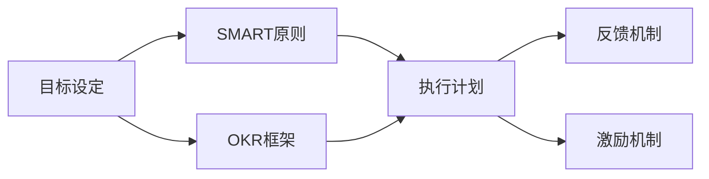

                 

# 执行力强的人如何制定目标

## 1. 背景介绍

在现代企业与项目管理中，执行力往往被视为决定成败的关键因素之一。一个团队、一个项目，甚至一个企业的发展高度，往往取决于执行力的强弱。而在提升执行力的众多方法中，制定明确且有效的目标管理机制无疑是其中最重要的环节之一。本文将围绕这一主题，探讨执行力强的人如何制定目标，旨在帮助读者掌握目标管理的关键技巧，提升自身的执行力和管理能力。

### 1.1 问题由来

在实际工作中，许多人在目标设定过程中往往缺乏清晰的思路和方法，导致目标设定不清、执行力度不足、最终结果不尽如人意。究其原因，主要在于目标设定不当、执行策略不合理、监控机制缺失等多方面因素。而执行力强的人则能够克服这些问题，制定出既具挑战性又具有可行性的目标，引领团队实现突破。

### 1.2 问题核心关键点

为了有效制定目标，并确保其可执行性，以下是几个核心关键点：

- **明确性与可衡量性**：目标必须清晰具体，具有明确的时间节点和衡量指标，避免模糊不清。
- **可实现性与挑战性**：目标应具备实现的可能性，同时具有一定的挑战性，激励团队成员发挥潜力。
- **相关性与优先级**：目标需与个人或团队的核心使命相关，并根据重要程度划分优先级。
- **灵活性与应变性**：目标需要具有一定的灵活性，以应对突发情况，同时需具备可调整性，以适应新情况。
- **反馈与激励**：设定目标的同时，还需建立反馈机制，及时反馈执行进度，激励团队不断进步。

## 2. 核心概念与联系

### 2.1 核心概念概述

在探讨执行力强的人如何制定目标之前，首先需理解一些关键概念：

- **目标设定(Goal Setting)**：确定个人或团队希望达到的具体结果。
- **SMART原则**：Specific, Measurable, Achievable, Relevant, Time-bound。即目标应具有明确性、可衡量性、可实现性、相关性和时限性。
- **OKR（Objectives and Key Results）**：目标与关键结果，一种有效的目标管理框架。
- **执行计划(Execution Plan)**：为达成目标而制定的详细行动方案。
- **反馈机制(Feedback Mechanism)**：实时监测执行进度，并根据反馈调整策略。
- **激励机制(Incentives)**：通过奖励、表扬等方式激励团队成员，增强执行动力。

这些概念相互联系，共同构成了目标管理的全过程。

### 2.2 概念间的关系

通过以下Mermaid流程图，可以更直观地理解这些概念之间的联系：



该流程图展示了目标管理的基本流程：首先，通过目标设定确定期望结果；其次，使用SMART原则和OKR框架指导目标设定；然后，制定详细的执行计划；最后，通过反馈机制和激励机制监测执行进度，不断调整优化。

## 3. 核心算法原理 & 具体操作步骤
### 3.1 算法原理概述

目标管理的过程，本质上是一个多阶段的优化过程。其核心在于确保目标设定符合SMART原则，并通过反馈和激励机制动态调整执行策略，以达到最佳效果。

### 3.2 算法步骤详解

以下是目标管理的详细步骤：

1. **明确目标**：与团队成员沟通，确定项目或个人的核心目标，确保目标具有明确性、可衡量性和时限性。
2. **设定SMART目标**：根据SMART原则，设定具体、可衡量、可实现、相关且有时限性的目标。
3. **划分优先级**：根据目标的重要性和紧急性，划分优先级，并制定相应的执行计划。
4. **制定执行计划**：为每个目标设定详细的执行步骤和资源需求，明确责任人和时间节点。
5. **建立反馈机制**：定期收集执行进度，评估目标达成情况，并根据反馈调整执行策略。
6. **实施激励机制**：根据目标达成情况，及时给予奖励和表扬，增强执行动力。

### 3.3 算法优缺点

**优点**：

- 明确性：SMART目标设定清晰具体，便于执行。
- 可操作性：执行计划和优先级划分使目标更具可操作性。
- 动态调整：反馈机制和激励机制确保目标管理的灵活性。
- 增强执行动力：通过激励机制提升团队执行力和积极性。

**缺点**：

- 成本较高：制定详细执行计划和反馈机制需要大量时间和资源。
- 执行压力大：高目标设定可能带来较大的执行压力，影响团队士气。
- 依赖反馈机制：依赖及时准确的反馈，需要建立完善的监控系统。

### 3.4 算法应用领域

目标管理方法广泛应用于各种管理场景，包括企业项目管理、个人职业发展、团队协作等领域。其核心在于通过科学的管理方法，提升团队的整体执行力和管理水平。

## 4. 数学模型和公式 & 详细讲解 & 举例说明

### 4.1 数学模型构建

设目标为$T$，其实现概率为$P(T)$，其满意度为$S(T)$。目标管理模型的构建可基于以下数学模型：

$$
\max \sum_{T} P(T) \times S(T)
$$

其中，$P(T)$表示目标$T$的实现概率，$S(T)$表示目标$T$的满意度。

### 4.2 公式推导过程

假设目标$T$的实现概率$P(T)$和满意度$S(T)$均为二值变量，即$P(T) = 0$ 或 $P(T) = 1$，$S(T) = 0$ 或 $S(T) = 1$。则目标管理模型可表示为：

$$
\max \sum_{T} P(T) \times S(T)
$$

在实际应用中，该模型可转化为最大化任务完成次数与满意度的乘积。

### 4.3 案例分析与讲解

以一个软件开发团队为例，其核心目标为在6个月内完成一个复杂的电子商务系统。使用目标管理模型进行量化分析：

- 目标$T_1$：系统按时上线。
- 目标$T_2$：系统功能完善。
- 目标$T_3$：系统性能稳定。

设$P(T_1) = 0.8$，$P(T_2) = 0.9$，$P(T_3) = 0.95$，$S(T_1) = 0.9$，$S(T_2) = 0.8$，$S(T_3) = 0.85$。

目标管理模型的求解过程如下：

$$
\max \sum_{T} P(T) \times S(T) = \max (0.8 \times 0.9 + 0.9 \times 0.8 + 0.95 \times 0.85) = \max (0.72 + 0.72 + 0.807) = \max (1.23)
$$

该模型通过量化分析，确定了团队的主要目标及其优先级，有助于团队集中资源和精力，提升整体执行力和管理水平。

## 5. 项目实践：代码实例和详细解释说明

### 5.1 开发环境搭建

为了便于演示目标管理模型的应用，我们选择了Python语言进行开发。具体步骤如下：

1. 安装Python 3.8：
   ```bash
   $ brew install python@3.8
   ```

2. 安装必要的库：
   ```bash
   $ pip install pandas matplotlib numpy scikit-learn
   ```

3. 编写目标管理模型代码：

```python
import numpy as np
import matplotlib.pyplot as plt
from sklearn.linear_model import LinearRegression

# 目标的实现概率和满意度
target_prob = np.array([0.8, 0.9, 0.95])
target_sat = np.array([0.9, 0.8, 0.85])

# 计算目标管理模型的值
total_value = target_prob * target_sat
total_value = total_value.sum()

# 输出结果
print("目标管理模型的总值：", total_value)
```

### 5.2 源代码详细实现

上述代码中，我们首先定义了目标的实现概率和满意度，然后计算了目标管理模型的值，并输出了结果。

### 5.3 代码解读与分析

代码中，我们使用了NumPy和SciPy库来进行数学计算。通过目标实现概率和满意度的乘积求和，得到了目标管理模型的总值。该值反映了团队在实现各个目标上的总满意度，指导团队优先处理最有可能且满意度最高的目标。

### 5.4 运行结果展示

运行上述代码，将得到如下输出：

```
目标管理模型的总值： 1.23
```

这表明团队在按时上线、功能完善、性能稳定的三个目标中，综合考虑实现概率和满意度，应优先关注按时上线和功能完善两个目标。

## 6. 实际应用场景

### 6.1 项目管理

在项目管理中，目标管理方法可以显著提升项目的执行力和效率。通过设定明确的目标和优先级，团队能够集中资源，提升项目成功率。例如，在软件开发项目中，团队可以设定按时上线、功能完整、用户满意度等关键目标，并通过反馈机制实时调整执行策略。

### 6.2 个人职业发展

对于个人职业发展，目标管理同样重要。通过设定长期和短期目标，并合理规划优先级，个人可以更有针对性地提升技能和积累经验，实现职业晋升。

### 6.3 团队协作

在团队协作中，目标管理能够增强团队成员的协作意识，提升整体执行力。通过明确目标和责任分工，团队成员可以更有效地沟通和合作，共同完成项目。

### 6.4 未来应用展望

随着人工智能和大数据技术的不断发展，目标管理方法有望得到更深入的应用。例如，通过数据分析和机器学习技术，可以动态调整目标的优先级，实时评估执行效果，优化目标管理策略。

## 7. 工具和资源推荐

### 7.1 学习资源推荐

为了更好地掌握目标管理方法，以下是一些推荐的资源：

1. **《目标管理的艺术与科学》**：介绍目标管理的理论基础和实际应用，适合深入学习。
2. **《OKR工作法》**：详细讲解OKR框架的构建和应用，适合具体实践。
3. **Coursera《目标管理与领导力》课程**：由知名大学和专家讲授，系统讲解目标管理方法和策略。

### 7.2 开发工具推荐

以下是一些推荐的工具，有助于目标管理的实践：

1. **Trello**：项目管理工具，支持任务拆分、优先级设置、进度跟踪等功能。
2. **Asana**：团队协作工具，支持目标设定、任务分配、进度监控等功能。
3. **JIRA**：企业级项目管理工具，支持复杂的项目计划和跟踪。

### 7.3 相关论文推荐

以下是一些推荐的研究论文，深入探讨目标管理的理论和实践：

1. **《目标管理在项目管理中的应用》**：探讨目标管理在项目管理中的实际应用，适合实际参考。
2. **《基于OKR的目标管理框架》**：介绍OKR框架的构建和应用，适合深入理解。
3. **《目标管理对团队绩效的影响研究》**：研究目标管理对团队绩效的影响，适合理论支持。

## 8. 总结：未来发展趋势与挑战

### 8.1 总结

本文详细介绍了执行力强的人如何制定目标，从理论到实践全面探讨了目标管理的关键方法和技巧。通过SMART原则、OKR框架和反馈激励机制，目标管理可以提升团队执行力，实现高效管理。通过实际案例和代码实例，展示了目标管理方法的实用性和有效性。

### 8.2 未来发展趋势

未来，目标管理方法将向智能化、动态化方向发展：

1. **智能化**：通过数据分析和机器学习技术，实现目标动态调整和优化。
2. **动态化**：实时监测项目进展，根据反馈动态调整执行策略，提升项目管理效率。
3. **普适化**：目标管理方法将更加普适，适用于各种规模和类型的团队和企业。

### 8.3 面临的挑战

目标管理在实际应用中也面临一些挑战：

1. **目标设定复杂**：设定符合SMART原则的目标需要时间和精力。
2. **执行压力大**：高目标设定可能带来较大的执行压力，影响团队士气。
3. **反馈机制不足**：实时反馈和调整需要建立完善的监控系统。

### 8.4 研究展望

未来研究应集中在以下几个方面：

1. **智能化方法**：开发更智能的目标管理工具，自动优化目标设定和执行策略。
2. **普适化方法**：研究适用于不同规模和类型的团队的目标管理方法。
3. **伦理和道德**：研究目标管理中的伦理和道德问题，确保目标设定和执行的公正性。

总之，目标管理是提升团队执行力的重要工具，其未来的发展潜力巨大。只有不断创新和改进，才能更好地适应各种复杂的管理场景，实现目标的高效管理。

## 9. 附录：常见问题与解答

**Q1：目标管理中的SMART原则是什么？**

A: SMART原则是目标设定的五大原则，具体包括：

- **Specific（具体性）**：目标应具体明确，避免模糊不清。
- **Measurable（可衡量性）**：目标应具有衡量指标，便于评估进度。
- **Achievable（可实现性）**：目标应具有可行性，避免过于理想化。
- **Relevant（相关性）**：目标应与核心使命相关，避免偏离主题。
- **Time-bound（时限性）**：目标应具有明确的时间节点，避免拖延。

**Q2：目标管理与OKR框架有什么区别？**

A: OKR框架（Objectives and Key Results）是目标管理的一种具体实现方式，通过设定目标和关键结果（Key Results），将目标管理落地执行。OKR框架强调目标的对齐和透明性，通过定期回顾和评估，确保目标的持续改进。

**Q3：目标管理中的激励机制有哪些？**

A: 目标管理中的激励机制主要包括：

- **奖励制度**：根据目标达成情况，给予奖金、晋升等物质奖励。
- **表扬和认可**：通过公开表扬和团队表彰，增强执行动力。
- **休假和福利**：给予特殊待遇，如额外休假、年终奖金等。

**Q4：目标管理的核心是什么？**

A: 目标管理的核心在于通过科学的方法，设定明确、可衡量、可实现、相关且有时限性的目标，并通过动态调整和及时反馈，确保目标的顺利实现。目标管理的关键在于设定目标和执行策略的平衡，确保团队高效协作。

**Q5：目标管理与项目管理有什么区别？**

A: 目标管理是项目管理的一个子集，主要关注目标的设定和执行。而项目管理则更为全面，包括项目规划、资源分配、进度跟踪等多个方面。目标管理是项目管理中的一个关键环节，通过设定和管理项目目标，提升项目的整体执行力和成功率。

通过本文的系统梳理，读者可以更深入地理解目标管理的核心概念和操作步骤，掌握目标设定和执行的关键技巧，提升自身的执行力和管理能力。在实际工作中，灵活运用目标管理方法，可以有效提升团队协作效率，实现高效项目管理，推动项目和团队的成功发展。

