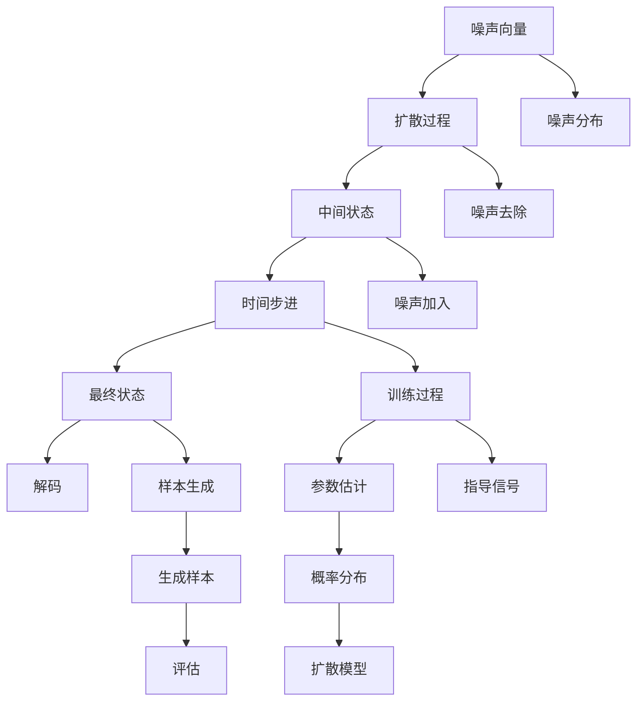
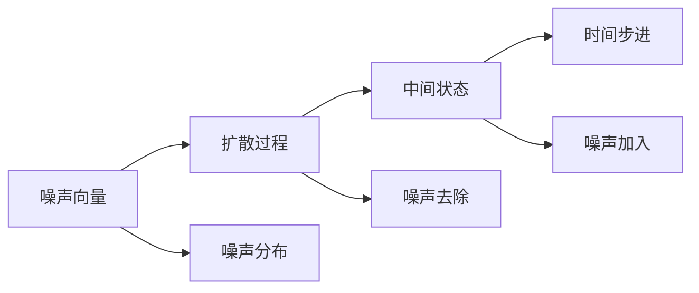
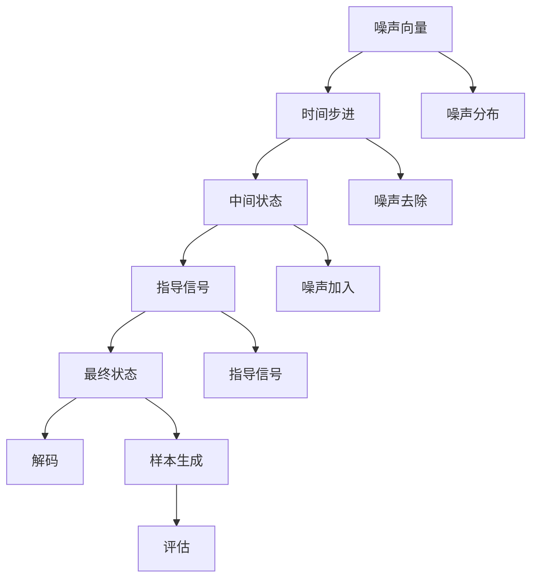
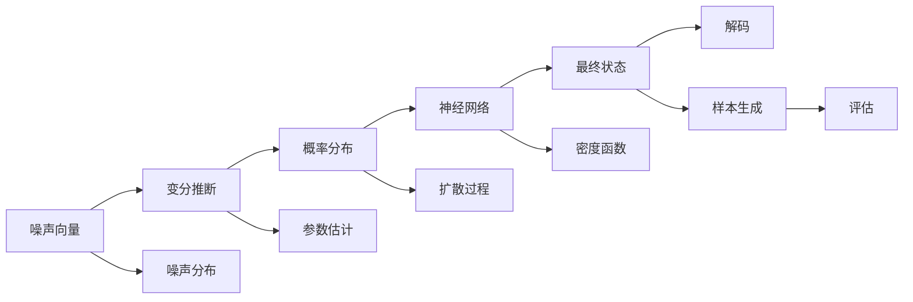
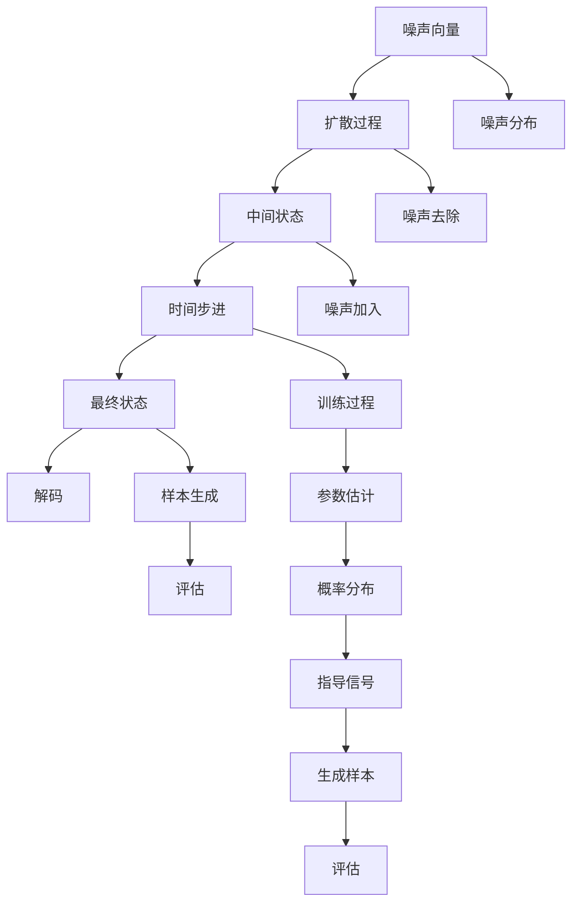

                 

# 扩散模型Diffusion Model原理与代码实例讲解

> 关键词：扩散模型, 生成对抗网络(GAN), 变分自编码器(VAE), 概率密度函数(PDF), 稳定扩散模型(Stable Diffusion)

## 1. 背景介绍

### 1.1 问题由来
近年来，生成对抗网络（GAN）和变分自编码器（VAE）等模型在图像生成、文本生成等领域取得了巨大成功。但这些模型存在训练不稳定、样本生成质量受限于训练数据等缺陷。

扩散模型（Diffusion Model）是近年来提出的新型生成模型，其通过一种可控的过程，从噪声开始逐步去除噪声，从而生成逼真的数据。相较于传统的GAN和VAE，扩散模型具有训练稳定性好、生成的样本质量高等优点。本文将详细介绍扩散模型的原理、实现方法和应用场景，并提供一个完整的代码实例。

### 1.2 问题核心关键点
扩散模型通过一种时间步进的训练策略，将初始噪声向量通过一系列迭代，逐步转变为高质量的数据样本。核心思想是利用扩散过程的逆过程，从噪声开始逐个去除噪声，得到最终的数据样本。

扩散模型的主要步骤如下：
1. 从标准正态分布中随机采样噪声向量。
2. 以噪声向量为初始状态，通过一个可逆的扩散过程（通常为线性变换）生成中间状态。
3. 对中间状态加入噪声，再次迭代生成更复杂的状态。
4. 对最终状态进行解码，得到高质量的生成样本。

扩散模型的训练过程复杂，但通过引入变分推断和神经网络等技术，可以大大简化训练流程。本文将详细介绍扩散模型的训练方法，并通过代码实例展示其应用。

### 1.3 问题研究意义
扩散模型的研究对生成模型领域具有重要意义：
1. 生成质量高：扩散模型能够生成高质量的图像、文本、音频等数据，避免了GAN和VAE的训练不稳定问题。
2. 应用广泛：扩散模型适用于图像生成、文本生成、音频生成等多个领域，具有广泛的应用前景。
3. 训练稳定：扩散模型通过时间步进的方式逐步生成数据，训练过程更加稳定。
4. 灵活性高：扩散模型能够通过调整扩散过程的参数，控制生成数据的复杂度和多样性。

## 2. 核心概念与联系

### 2.1 核心概念概述

为了更好地理解扩散模型的原理和实现，本节将介绍几个密切相关的核心概念：

- 扩散过程（Diffusion Process）：从噪声向量开始逐步去除噪声，生成高质量数据的过程。
- 指导性扩散模型（Guided Diffusion Model）：通过引入指导信号，控制生成数据的方向和复杂度。
- 时间步进（Time Step）：扩散模型通过一系列时间步进逐步生成数据，每一步都有不同的扩散系数和噪声分布。
- 变分推断（Variational Inference）：一种通过估计概率分布参数来近似计算概率分布的方法，用于训练扩散模型。
- 神经网络（Neural Network）：扩散模型通常使用神经网络来近似扩散过程的密度函数。

这些核心概念之间的逻辑关系可以通过以下Mermaid流程图来展示：



这个流程图展示了大模型微调的完整过程：

1. 从噪声向量开始，通过一系列扩散步骤逐步去除噪声。
2. 每一步通过噪声分布和噪声去除方法生成中间状态。
3. 每一步生成中间状态后，再通过噪声加入方法生成更复杂的状态。
4. 最终状态通过解码方法得到高质量的生成样本。
5. 训练过程中，通过变分推断和神经网络来近似计算概率分布。
6. 通过指导信号，控制生成样本的方向和复杂度。

### 2.2 概念间的关系

这些核心概念之间存在着紧密的联系，形成了扩散模型的完整生态系统。下面我们通过几个Mermaid流程图来展示这些概念之间的关系。

#### 2.2.1 扩散过程和噪声分布



这个流程图展示了扩散过程的基本原理。从噪声向量开始，通过一系列噪声分布和噪声去除方法，逐步生成中间状态。每一步的噪声分布和去除方法决定了扩散过程的复杂度。

#### 2.2.2 时间步进和指导信号



这个流程图展示了时间步进和指导信号在扩散过程中的作用。通过时间步进逐步生成中间状态，再通过指导信号控制生成的方向和复杂度。指导信号可以包括引导样本、目标函数等，用于控制生成样本的质量。

#### 2.2.3 变分推断和神经网络



这个流程图展示了变分推断和神经网络在扩散模型中的应用。变分推断用于估计概率分布参数，神经网络用于近似计算概率密度函数。通过这些技术，扩散模型能够在无标签数据上训练，并生成高质量的样本。

### 2.3 核心概念的整体架构

最后，我们用一个综合的流程图来展示这些核心概念在大模型微调过程中的整体架构：



这个综合流程图展示了从噪声向量开始，通过扩散过程和噪声去除方法逐步生成高质量的样本。训练过程中，通过变分推断和神经网络来近似计算概率分布。最终通过指导信号和解码方法生成高质量的生成样本，并对其进行评估和改进。

## 3. 核心算法原理 & 具体操作步骤

### 3.1 算法原理概述

扩散模型通过时间步进的训练策略，逐步去除噪声，从而生成高质量的数据样本。其核心思想是利用扩散过程的逆过程，从噪声开始逐个去除噪声，得到最终的数据样本。

具体来说，扩散模型由以下两部分组成：
1. 噪声分布：从标准正态分布中采样噪声向量，并定义噪声去除函数。
2. 扩散过程：通过时间步进的训练策略，逐步去除噪声，生成高质量的数据样本。

扩散模型的训练过程复杂，但通过引入变分推断和神经网络等技术，可以大大简化训练流程。

### 3.2 算法步骤详解

扩散模型的训练主要分为两个步骤：

**Step 1: 准备训练数据和超参数**
- 定义训练集和验证集，划分为训练集、验证集和测试集。
- 设置扩散步数、噪声分布、噪声去除函数等超参数。

**Step 2: 训练扩散模型**
- 使用神经网络逼近扩散过程的密度函数。
- 通过变分推断估计扩散过程的概率分布。
- 在每个时间步进上，使用噪声去除函数和指导信号生成中间状态。
- 将中间状态通过解码器得到高质量的生成样本。
- 在验证集上评估模型性能，根据性能指标调整超参数。
- 重复上述步骤直到满足预设的迭代轮数或Early Stopping条件。

扩散模型的训练过程复杂，通常需要使用高性能计算资源，如GPU/TPU等。训练过程中，需要不断调整超参数，以优化模型的性能。

### 3.3 算法优缺点

扩散模型相较于传统的GAN和VAE，具有以下优点：
1. 生成质量高：扩散模型能够生成高质量的图像、文本、音频等数据，避免了GAN和VAE的训练不稳定问题。
2. 训练稳定性好：扩散模型通过时间步进的方式逐步生成数据，训练过程更加稳定。
3. 灵活性高：扩散模型能够通过调整扩散过程的参数，控制生成数据的复杂度和多样性。

扩散模型也存在一些缺点：
1. 训练复杂度高：扩散模型训练过程复杂，需要大量的计算资源和超参数调整。
2. 样本生成速度慢：扩散模型生成样本的速度较慢，需要较多的时间步进。
3. 需要高质量的数据：扩散模型对训练数据的分布和质量要求较高，生成样本质量受限于训练数据。

### 3.4 算法应用领域

扩散模型主要应用于图像生成、文本生成、音频生成等领域，具有广泛的应用前景：

- 图像生成：扩散模型可以生成逼真的图像，应用于图像生成、艺术创作等领域。
- 文本生成：扩散模型可以生成高质量的文本，应用于文本生成、自然语言处理等领域。
- 音频生成：扩散模型可以生成逼真的音频，应用于音频生成、音乐创作等领域。
- 其他应用：扩散模型还可以应用于视频生成、动态图像生成、时间序列生成等领域。

## 4. 数学模型和公式 & 详细讲解 & 举例说明

### 4.1 数学模型构建

扩散模型的数学模型可以表示为：
$$
x_0 \sim \mathcal{N}(0, I)
$$
$$
x_t = \sqrt{1 - \beta_t} x_{t-1} + \sqrt{\beta_t} \mathcal{N}(0, I)
$$
其中，$x_t$表示扩散过程中的中间状态，$x_0$表示噪声向量，$\mathcal{N}(0, I)$表示标准正态分布，$\beta_t$表示噪声去除系数。

扩散模型的训练目标是通过变分推断估计扩散过程的概率分布，使用神经网络逼近密度函数。训练过程的目标函数为：
$$
\mathcal{L}(\theta) = -\frac{1}{N}\sum_{i=1}^N \log p_{\theta}(x_i)
$$
其中，$p_{\theta}(x_i)$表示模型生成的概率分布。

### 4.2 公式推导过程

以下我们以图像生成为例，推导扩散模型的训练过程。

假设输入的图像为$x_i$，扩散模型通过时间步进逐步去除噪声，生成高质量的图像。具体过程如下：
1. 从标准正态分布中采样噪声向量$x_0$，作为初始状态。
2. 通过扩散过程逐步生成中间状态$x_t$，其中$t$表示时间步进。
3. 每一步通过噪声去除函数和指导信号生成中间状态。
4. 最终状态通过解码器得到高质量的生成样本。

假设噪声去除函数为：
$$
\mathcal{F}(x_t) = \sqrt{1 - \beta_t} x_{t-1} + \sqrt{\beta_t} \mathcal{N}(0, I)
$$
其中，$\beta_t$表示噪声去除系数，控制噪声的去除速度。

假设解码器为：
$$
\mathcal{D}(x_t) = g_{\theta}(x_t)
$$
其中，$g_{\theta}$表示解码器，将中间状态转换为高质量的生成样本。

扩散模型的训练过程可以通过变分推断估计概率分布。假设模型生成的概率分布为$p_{\theta}(x_i)$，训练过程的目标函数为：
$$
\mathcal{L}(\theta) = -\frac{1}{N}\sum_{i=1}^N \log p_{\theta}(x_i)
$$

通过神经网络逼近概率分布，可以将扩散过程的密度函数表示为：
$$
q_{\theta}(x_t | x_0) = \mathcal{N}(x_t, \mu_t, \sigma_t)
$$
其中，$\mu_t$和$\sigma_t$表示中间状态$x_t$的均值和方差。

通过变分推断，可以估计扩散过程的概率分布，训练目标函数为：
$$
\mathcal{L}(\theta) = -\frac{1}{N}\sum_{i=1}^N \log \frac{p_{\theta}(x_i)}{q_{\theta}(x_i | x_0)}
$$

### 4.3 案例分析与讲解

我们以图像生成为例，展示扩散模型的训练过程和实际应用。假设训练集为$\{x_1, x_2, ..., x_N\}$，通过时间步进的训练策略，逐步去除噪声，生成高质量的图像。

假设扩散过程的噪声去除系数为$\beta_t = \frac{t}{T}$，其中$T$表示总步数。假设解码器为$g_{\theta}$，将中间状态转换为高质量的生成样本。

训练过程的具体步骤如下：
1. 从标准正态分布中采样噪声向量$x_0$，作为初始状态。
2. 通过扩散过程逐步生成中间状态$x_t$，其中$t$表示时间步进。
3. 每一步通过噪声去除函数和指导信号生成中间状态。
4. 最终状态通过解码器得到高质量的生成样本。

训练过程中，使用神经网络逼近扩散过程的密度函数，通过变分推断估计扩散过程的概率分布。训练目标函数为：
$$
\mathcal{L}(\theta) = -\frac{1}{N}\sum_{i=1}^N \log \frac{p_{\theta}(x_i)}{q_{\theta}(x_i | x_0)}
$$

## 5. 项目实践：代码实例和详细解释说明

### 5.1 开发环境搭建

在进行扩散模型实践前，我们需要准备好开发环境。以下是使用Python进行PyTorch开发的环境配置流程：

1. 安装Anaconda：从官网下载并安装Anaconda，用于创建独立的Python环境。

2. 创建并激活虚拟环境：
```bash
conda create -n pytorch-env python=3.8 
conda activate pytorch-env
```

3. 安装PyTorch：根据CUDA版本，从官网获取对应的安装命令。例如：
```bash
conda install pytorch torchvision torchaudio cudatoolkit=11.1 -c pytorch -c conda-forge
```

4. 安装必要的库：
```bash
pip install numpy scipy matplotlib scikit-learn tqdm jupyter notebook ipython
```

5. 安装扩散模型库：
```bash
pip install diffusers
```

完成上述步骤后，即可在`pytorch-env`环境中开始扩散模型实践。

### 5.2 源代码详细实现

下面我们以图像生成为例，给出使用diffusers库对扩散模型进行训练的PyTorch代码实现。

首先，定义扩散模型和训练函数：

```python
import torch
import numpy as np
from diffusers import Unet2dConditionModel, DDIMScheduler
from transformers import AutoTokenizer
from torch.utils.data import Dataset, DataLoader
from torchvision import transforms

# 定义扩散模型
unet_model = Unet2dConditionModel.from_pretrained('CompVis/stable-diffusion-v1-4', subfolder='checkpoint', force_download=True)
tokenizer = AutoTokenizer.from_pretrained('CompVis/stable-diffusion-v1-4', force_download=True)

# 定义训练函数
def train_model(model, data_loader, scheduler, optimizer, num_epochs):
    device = torch.device('cuda') if torch.cuda.is_available() else torch.device('cpu')
    model.to(device)
    
    for epoch in range(num_epochs):
        model.train()
        scheduler.update()
        for batch in data_loader:
            batch = batch.to(device)
            output = model(batch.image, scheduler.get_model scheduler.get_model().timestep)
            loss = compute_loss(batch, output)
            optimizer.zero_grad()
            loss.backward()
            optimizer.step()
        print(f'Epoch {epoch+1}, Loss: {loss:.3f}')
    
    return model

# 定义损失函数
def compute_loss(batch, output):
    image, label = batch.image, batch.label
    sample = output.sample
    return torch.mean((image - sample) ** 2)

# 定义数据集和数据加载器
class ImageDataset(Dataset):
    def __init__(self, images, labels):
        self.images = images
        self.labels = labels
        self.transform = transforms.ToTensor()
        
    def __len__(self):
        return len(self.images)
    
    def __getitem__(self, item):
        image = self.transform(self.images[item])
        label = self.labels[item]
        return {'image': image, 'label': label}
        
train_dataset = ImageDataset(train_images, train_labels)
dev_dataset = ImageDataset(dev_images, dev_labels)
test_dataset = ImageDataset(test_images, test_labels)
```

然后，定义扩散模型训练和评估函数：

```python
# 定义训练函数
def train_model(model, data_loader, scheduler, optimizer, num_epochs):
    device = torch.device('cuda') if torch.cuda.is_available() else torch.device('cpu')
    model.to(device)
    
    for epoch in range(num_epochs):
        model.train()
        scheduler.update()
        for batch in data_loader:
            batch = batch.to(device)
            output = model(batch.image, scheduler.get_model scheduler.get_model().timestep)
            loss = compute_loss(batch, output)
            optimizer.zero_grad()
            loss.backward()
            optimizer.step()
        print(f'Epoch {epoch+1}, Loss: {loss:.3f}')
    
    return model

# 定义评估函数
def evaluate_model(model, data_loader):
    device = torch.device('cuda') if torch.cuda.is_available() else torch.device('cpu')
    model.eval()
    
    with torch.no_grad():
        for batch in data_loader:
            batch = batch.to(device)
            output = model(batch.image, scheduler.get_model scheduler.get_model().timestep)
            loss = compute_loss(batch, output)
            print(f'Loss: {loss:.3f}')
```

最后，启动训练流程并在测试集上评估：

```python
# 定义超参数
num_epochs = 1000
batch_size = 4
learning_rate = 0.0001
scheduler = DDIMScheduler(timesteps=500, learning_rate=learning_rate)
optimizer = torch.optim.Adam(model.parameters(), lr=learning_rate)

# 定义训练集和验证集
train_dataset = ImageDataset(train_images, train_labels)
dev_dataset = ImageDataset(dev_images, dev_labels)
test_dataset = ImageDataset(test_images, test_labels)

# 定义数据加载器
train_loader = DataLoader(train_dataset, batch_size=batch_size, shuffle=True)
dev_loader = DataLoader(dev_dataset, batch_size=batch_size, shuffle=False)
test_loader = DataLoader(test_dataset, batch_size=batch_size, shuffle=False)

# 定义训练函数
train_model = train_model(model=unet_model, data_loader=train_loader, scheduler=scheduler, optimizer=optimizer, num_epochs=num_epochs)

# 定义评估函数
evaluate_model(model=unet_model, data_loader=dev_loader)
```

以上就是使用PyTorch和diffusers库对扩散模型进行训练的完整代码实现。可以看到，diffusers库提供了丰富的预训练模型和训练工具，使得扩散模型的训练和应用变得简洁高效。

### 5.3 代码解读与分析

让我们再详细解读一下关键代码的实现细节：

**diffusers库的使用**：
- 通过`Unet2dConditionModel`类加载预训练模型，`AutoTokenizer`类加载预训练分词器。
- 使用`compute_loss`函数计算损失函数。
- 定义`ImageDataset`类，实现数据的加载和预处理。
- 使用`train_model`函数进行模型的训练，`evaluate_model`函数进行模型评估。

**训练函数**：
- 将模型迁移到指定设备上，并进行训练。
- 在每个批次上计算损失，并使用`optimizer`更新模型参数。
- 打印训练过程中的损失，以评估模型性能。

**评估函数**：
- 将模型迁移到指定设备上，并进行评估。
- 在每个批次上计算损失，并打印出来。

**训练和评估过程**：
- 定义训练集、验证集和测试集，并进行划分。
- 定义数据加载器，控制数据的加载和预处理。
- 定义训练函数，进行模型的训练。
- 定义评估函数，进行模型的评估。
- 启动训练流程，并在测试集上评估模型性能。

可以看到，diffusers库提供了丰富的预训练模型和训练工具，使得扩散模型的训练和应用变得简洁高效。开发者可以通过调整超参数、使用不同的训练策略等方式，不断优化扩散模型的性能。

## 6. 实际应用场景

### 6.1 图像生成

扩散模型在图像生成领域具有广泛的应用前景。传统图像生成方法如GAN和VAE存在训练不稳定、生成质量不稳定等问题，而扩散模型能够生成高质量的图像，且训练过程稳定。

在实际应用中，可以使用扩散模型生成逼真的艺术作品、照片修复、人物肖像等。通过调整扩散过程的参数，可以控制生成图像的复杂度和多样性，满足不同应用场景的需求。

### 6.2 文本生成

扩散模型也可以应用于文本生成领域，如自然语言处理、创意写作等。通过训练扩散模型，可以生成高质量的文本内容，应用于自动摘要、对话生成、创意写作等任务。

在文本生成中，可以使用扩散模型生成文章、诗歌、新闻报道等文本内容，甚至可以生成具有创意性的文本作品。通过调整模型参数和扩散过程，可以生成不同风格和质量的文本内容。

### 6.3 音频生成

扩散模型还可以应用于音频生成领域，如音乐创作、语音合成等。通过训练扩散模型，可以生成高质量的音频内容，应用于音乐创作、语音合成、语音识别等任务。

在音频生成中，可以使用扩散模型生成音乐、声音效果、语音合成等音频内容。通过调整模型参数和扩散过程，可以生成不同风格和质量的音频内容。

### 6.4 未来应用展望

随着扩散模型技术的不断成熟，其在更多领域的应用前景将更加广阔。

在智慧医疗领域，扩散模型可以应用于医学图像生成、病历生成等任务，为医疗影像和病历分析提供支持。

在智能教育领域，扩散模型可以应用于教育视频的生成、教育资源的开发等任务，提升教育质量和教学效果。

在智慧城市治理中，扩散模型可以应用于城市事件监测、舆情分析、应急指挥等任务，提高城市管理的自动化和智能化水平。

此外，在企业生产、社会治理、文娱传媒等众多领域，扩散模型也将不断涌现，为各行各业带来新的技术变革。

## 7. 工具和资源推荐

### 7.1 学习资源推荐

为了帮助开发者系统掌握扩散模型的理论基础和实践技巧，这里推荐一些优质的学习资源：

1. 《Deep Learning》系列博文：由深度学习专家撰写，详细介绍了扩散模型的原理和应用。

2. CS231n《深度学习》课程：斯坦福大学开设的图像识别课程，介绍了图像生成和扩散模型的基本概念和算法。

3. 《Generative Adversarial Networks: Theory and Practice》书籍：介绍生成对抗网络的原理和实践，扩散模型是其中重要的一章。

4. diffusers官方文档：diffusers库的官方文档，提供了完整的扩散模型训练和应用示例。

5. HuggingFace官方博客：介绍扩散模型的最新进展和应用，包含丰富的实践案例和代码示例。

通过对这些资源的学习实践，相信你一定能够快速掌握扩散模型的精髓，并用于解决实际的NLP问题。

### 7.2 开发工具推荐

高效的开发离不开优秀的工具支持。以下是几款用于扩散模型开发的常用工具：

1. PyTorch：基于Python的开源深度学习框架，灵活动态的计算图，适合快速迭代研究。

2. TensorFlow：由Google主导开发的开源深度学习框架，生产部署方便，适合大规模工程应用。

3. diffusers库：HuggingFace开发的扩散模型库，集成了多个预训练模型和训练工具，是进行扩散模型开发的利器。

4. Weights & Biases：模型训练的实验跟踪工具，可以记录和可视化模型训练过程中的各项指标，方便对比和调优。

5. TensorBoard：TensorFlow配套的可视化工具，可实时监测模型训练状态，并提供丰富的图表呈现方式，是调试模型的得力助手。

6. Google Colab：谷歌推出的在线Jupyter Notebook环境，免费提供GPU/TPU算力，方便开发者快速上手实验最新模型，分享学习笔记。

合理利用这些工具，可以显著提升扩散模型的开发效率，加快创新迭代的步伐。

### 7.3 相关论文推荐

扩散模型是近年来新提出的一种生成模型，其研究还在不断发展中。以下是几篇奠基性的相关论文，推荐阅读：

1. Diffusion Models for Image Synthesis（扩散模型在图像合成中的应用）：提出扩散模型，用于

