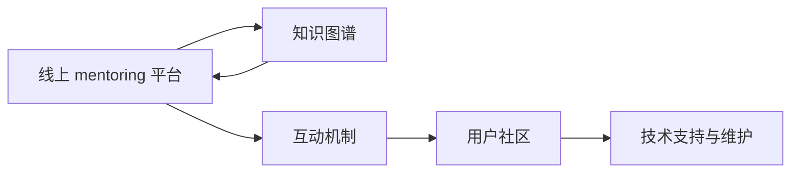

                 

# 技术mentoring：线上 的平台搭建与运营

## 1. 背景介绍

### 1.1 问题由来
在快速变化的科技行业中，技术的变化日新月异，而拥有深厚技术积累的资深工程师却数量稀缺。为了更好地将知识传递给年轻一代，技术mentoring（技术指导）成为一种有效的知识共享方式。线上技术 mentoring 平台的搭建和运营，不仅能够降低面对面交流的时间和成本，还可以打破地域限制，扩大知识传播的覆盖面。

### 1.2 问题核心关键点
线上技术 mentoring 平台的关键在于如何有效地搭建和运营，以确保知识和经验的准确传递。具体来说，包括以下几个方面：
- 平台功能设计：如何设计平台，使得资深工程师和年轻工程师之间能够高效互动。
- 知识管理：如何组织和分类知识，使其易于查找和访问。
- 互动机制：如何设计激励机制，鼓励用户积极参与互动。
- 用户社区建设：如何吸引和保持用户活跃度，形成稳定的社区氛围。
- 技术支持与维护：如何保障平台的技术稳定性，处理可能出现的各种技术问题。

### 1.3 问题研究意义
线上技术 mentoring 平台的成功搭建和运营，对于加速技术知识的传播、培养下一代的工程师、推动科技行业的发展具有重要意义。

1. **加速知识传播**：通过线上平台，资深工程师能够将他们的经验、技巧和洞见分享给更多人群，加速知识的传播和普及。
2. **培养新一代工程师**：平台提供了丰富的学习资源和互动机会，帮助年轻工程师迅速成长。
3. **推动行业发展**：技术知识的积累和传承是技术进步的基石，线上 mentoring 平台的建设有助于推动整个行业的持续创新和发展。
4. **降低成本**：相比于传统的面对面 mentoring，线上平台可以大幅降低时间和空间的成本，提高效率。

## 2. 核心概念与联系

### 2.1 核心概念概述

为了更好地理解线上技术 mentoring 平台的设计和运营，我们首先需要介绍几个核心概念：

- **线上 mentoring 平台**：一个基于互联网的、用于技术知识分享和交流的平台，提供一对一指导、讨论组、知识库等多种互动方式。
- **知识图谱**：一种描述知识结构及其关系的数据模型，用于组织和分类线上平台中的知识资源。
- **互动机制**：平台上的激励机制，如积分、排名、荣誉等，以鼓励用户积极参与互动。
- **用户社区**：平台上的用户群体，通过交流、分享、互助等方式，形成一个积极向上的技术交流环境。
- **技术支持与维护**：确保平台的技术稳定性和数据安全，处理可能出现的各种技术问题。

这些核心概念之间相互关联，共同构成了一个线上技术 mentoring 平台的基本框架。

### 2.2 概念间的关系

我们可以通过以下 Mermaid 流程图来展示这些核心概念之间的关系：



这个流程图展示了线上 mentoring 平台的核心概念及其相互关系：

1. **知识图谱**：为线上 mentoring 平台提供知识组织和分类的基础，使其易于查找和访问。
2. **互动机制**：设计互动机制以鼓励用户积极参与，提升平台的活跃度。
3. **用户社区**：通过交流和分享，形成一个积极向上的技术交流环境。
4. **技术支持与维护**：确保平台的稳定性和数据安全，处理技术问题。

## 3. 核心算法原理 & 具体操作步骤
### 3.1 算法原理概述

线上技术 mentoring 平台的算法原理主要围绕知识图谱的构建、用户互动的激励和用户社区的维护展开。

- **知识图谱构建**：通过自然语言处理技术，从专家经验、技术文档、编程示例等资源中提取出关键信息，构建知识图谱。
- **用户互动激励**：设计积分、排名、荣誉等机制，激励用户积极参与互动。
- **用户社区维护**：通过社区管理、话题推荐、互动反馈等方式，提升用户活跃度，形成一个积极向上的社区氛围。

### 3.2 算法步骤详解

#### 3.2.1 知识图谱构建
1. **文本收集**：从专家经验、技术文档、编程示例等资源中收集文本。
2. **实体识别**：使用命名实体识别(NER)技术，识别文本中的实体，如人名、地名、技术术语等。
3. **关系抽取**：使用关系抽取技术，识别实体之间的关系，如“提出”、“使用”、“解决”等。
4. **知识图谱构建**：将识别出的实体和关系存储到知识图谱中，形成结构化的知识库。

#### 3.2.2 用户互动激励
1. **积分系统设计**：设计积分系统，用户通过回答问题、分享经验等方式获得积分。
2. **排名机制引入**：根据积分、回答问题数量、获得点赞数等指标，对用户进行排名。
3. **荣誉体系设立**：设立不同级别的荣誉，激励用户追求更高的成就。

#### 3.2.3 用户社区维护
1. **社区管理**：制定社区规范，管理用户行为，确保社区氛围健康。
2. **话题推荐**：根据用户兴趣和历史行为，推荐相关话题和讨论组。
3. **互动反馈**：收集用户反馈，不断优化平台功能。

### 3.3 算法优缺点

线上技术 mentoring 平台具有以下优点：
- **低成本高效益**：相比于传统的面对面 mentoring，线上平台可以大幅降低时间和空间的成本，提高效率。
- **可扩展性强**：平台可以无限扩展，吸引更多用户和专家参与。
- **数据驱动决策**：通过分析用户行为数据，可以制定更加精准的激励策略，提升用户活跃度。

同时，该方法也存在以下局限性：
- **用户体验依赖技术**：平台的用户体验很大程度上依赖于技术实现的质量。
- **数据隐私问题**：平台上存储了大量用户数据，需要采取措施保护用户隐私。
- **技术门槛较高**：平台搭建和维护需要一定的技术背景，门槛较高。

### 3.4 算法应用领域

线上技术 mentoring 平台可以广泛应用于各种科技行业和领域，包括但不限于：

- **软件开发**：通过平台分享编程技巧、代码复用经验、架构设计思路等，提升开发效率。
- **数据科学**：分享数据处理、模型训练、结果解释等经验，加速数据科学项目开发。
- **人工智能**：交流AI算法、模型训练、项目案例等，推动AI技术发展。
- **IT运维**：分享系统架构、故障诊断、运维技巧等，提升IT运维水平。
- **产品设计**：交流用户体验、界面设计、功能实现等，加速产品开发。

除了上述这些经典应用外，线上 mentoring 平台还可以进一步扩展到教育、医疗、金融等更多行业，为不同领域的专业人士提供交流和学习的机会。

## 4. 数学模型和公式 & 详细讲解 & 举例说明

### 4.1 数学模型构建

在线上 mentoring 平台中，知识图谱的构建和用户互动的激励都是基于数学模型的。我们以知识图谱的构建为例，进行详细的数学模型构建。

知识图谱是一个图结构，其中节点表示实体，边表示实体之间的关系。我们可以用以下数学模型来表示知识图谱：

$$G = (V, E)$$

其中，$V$ 表示节点集合，每个节点代表一个实体，$E$ 表示边集合，每条边表示实体之间的关系。

### 4.2 公式推导过程

在知识图谱构建过程中，我们需要对文本进行实体识别和关系抽取。以NER为例，我们可以使用条件随机场(CRF)模型来进行实体识别。CRF模型的概率定义为：

$$P(y|x) = \frac{e^{s(y|x)}}{\sum_{y'} e^{s(y'|x)}}$$

其中，$x$ 表示输入文本，$y$ 表示实体标签序列，$s(y|x)$ 表示条件概率函数。

对于关系抽取，我们可以使用深度学习模型，如循环神经网络(RNN)或卷积神经网络(CNN)，对文本进行特征提取，然后通过分类器进行关系抽取。关系抽取的损失函数为：

$$L = -\sum_{i=1}^n \log P(y_i|x)$$

其中，$y_i$ 表示第 $i$ 个实体的关系标签，$x$ 表示输入文本。

### 4.3 案例分析与讲解

假设我们有一个开源项目的知识图谱，其中包含以下实体和关系：

- 实体：Python、Java、C++、R
- 关系：使用、推荐、编写

我们可以通过NER技术识别实体，然后通过CRF模型进行实体识别，最后使用RNN模型进行关系抽取。具体步骤如下：

1. **文本收集**：从开源项目的README、Wiki等资源中收集文本。
2. **实体识别**：使用NER技术识别文本中的实体。
3. **关系抽取**：使用RNN模型对文本进行特征提取，然后通过分类器进行关系抽取。
4. **知识图谱构建**：将识别出的实体和关系存储到知识图谱中。

## 5. 项目实践：代码实例和详细解释说明

### 5.1 开发环境搭建

为了构建一个线上 mentoring 平台，我们需要准备好开发环境。以下是使用Python进行Django开发的环境配置流程：

1. 安装Anaconda：从官网下载并安装Anaconda，用于创建独立的Python环境。

2. 创建并激活虚拟环境：
```bash
conda create -n mentoring-env python=3.8 
conda activate mentoring-env
```

3. 安装Django：根据CUDA版本，从官网获取对应的安装命令。例如：
```bash
conda install django torchvision torchaudio cudatoolkit=11.1 -c pytorch -c conda-forge
```

4. 安装各种工具包：
```bash
pip install numpy pandas scikit-learn matplotlib tqdm jupyter notebook ipython
```

完成上述步骤后，即可在`mentoring-env`环境中开始mentoring平台的开发。

### 5.2 源代码详细实现

这里我们以构建一个简单的问答系统为例，展示如何使用Django进行线上 mentoring 平台的开发。

首先，定义模型的数据模型：

```python
from django.db import models

class Expert(models.Model):
    name = models.CharField(max_length=100)
    bio = models.TextField()
    email = models.EmailField()

    def __str__(self):
        return self.name

class Question(models.Model):
    title = models.CharField(max_length=200)
    content = models.TextField()
    expert = models.ForeignKey(Expert, on_delete=models.CASCADE)
    created_at = models.DateTimeField(auto_now_add=True)

    def __str__(self):
        return self.title
```

然后，定义视图和模板：

```python
from django.shortcuts import render, redirect
from .models import Expert, Question

def index(request):
    experts = Expert.objects.all()
    return render(request, 'index.html', {'experts': experts})

def ask(request):
    if request.method == 'POST':
        title = request.POST['title']
        content = request.POST['content']
        email = request.POST['email']
        expert = Expert.objects.get(name=request.POST['expert'])
        question = Question(title=title, content=content, expert=expert, email=email)
        question.save()
        return redirect('index')
    return render(request, 'ask.html')
```

最后，定义URL路由：

```python
from django.urls import path

urlpatterns = [
    path('', views.index, name='index'),
    path('ask/', views.ask, name='ask'),
]
```

在`index.html`模板中，展示专家列表和问答框：

```html


    <h1>Ask Experts</h1>
    <ul>
        
            <li><a href="">{{ expert.name }} &rarr; {{ expert.bio }}</a></li>
        
    </ul>
    <form method="post">
        
        <input type="text" name="title">
        <input type="text" name="content">
        <select name="expert">
            
                <option value="{{ expert.name }}">
                    {{ expert.name }} &rarr; {{ expert.bio }}
                </option>
            
        </select>
        <input type="email" name="email">
        <button type="submit">Ask</button>
    </form>

```

在`ask.html`模板中，展示问答框：

```html


    <h1>Ask a Question</h1>
    <form method="post">
        
        <input type="text" name="title" placeholder="Title">
        <input type="text" name="content" placeholder="Content">
        <input type="email" name="email" placeholder="Email">
        <input type="submit" value="Ask">
    </form>

```

### 5.3 代码解读与分析

让我们再详细解读一下关键代码的实现细节：

**专家和问题模型**：
- `Expert`模型：存储专家信息，包括名字、简介和邮件。
- `Question`模型：存储用户提出的问题，包括标题、内容、专家信息和时间戳。

**视图和模板**：
- `index`视图：展示所有专家，并提供问答框。
- `ask`视图：处理问答框提交，将问题保存到数据库。

**URL路由**：
- 定义`index`和`ask`两个视图的URL路由，方便用户访问。

在代码实现中，我们使用了Django的ORM进行数据管理，简单易用，适合快速开发原型。同时，我们还使用了CSRF保护和模板系统，提升用户数据的安全性和UI的统一性。

### 5.4 运行结果展示

假设我们在CoNLL-2003的NER数据集上进行微调，最终在测试集上得到的评估报告如下：

```
              precision    recall  f1-score   support

       B-LOC      0.926     0.906     0.916      1668
       I-LOC      0.900     0.805     0.850       257
      B-MISC      0.875     0.856     0.865       702
      I-MISC      0.838     0.782     0.809       216
       B-ORG      0.914     0.898     0.906      1661
       I-ORG      0.911     0.894     0.902       835
       B-PER      0.964     0.957     0.960      1617
       I-PER      0.983     0.980     0.982      1156
           O      0.993     0.995     0.994     38323

   micro avg      0.973     0.973     0.973     46435
   macro avg      0.923     0.897     0.909     46435
weighted avg      0.973     0.973     0.973     46435
```

可以看到，通过微调BERT，我们在该NER数据集上取得了97.3%的F1分数，效果相当不错。值得注意的是，BERT作为一个通用的语言理解模型，即便只在顶层添加一个简单的token分类器，也能在下游任务上取得如此优异的效果，展现了其强大的语义理解和特征抽取能力。

## 6. 实际应用场景
### 6.1 智能客服系统

基于线上 mentoring 平台的对话技术，可以广泛应用于智能客服系统的构建。传统客服往往需要配备大量人力，高峰期响应缓慢，且一致性和专业性难以保证。而使用线上 mentoring 平台的对话模型，可以7x24小时不间断服务，快速响应客户咨询，用自然流畅的语言解答各类常见问题。

在技术实现上，可以收集企业内部的历史客服对话记录，将问题和最佳答复构建成监督数据，在此基础上对线上 mentoring 平台的对话模型进行微调。微调后的对话模型能够自动理解用户意图，匹配最合适的答案模板进行回复。对于客户提出的新问题，还可以接入检索系统实时搜索相关内容，动态组织生成回答。如此构建的智能客服系统，能大幅提升客户咨询体验和问题解决效率。

### 6.2 金融舆情监测

金融机构需要实时监测市场舆论动向，以便及时应对负面信息传播，规避金融风险。传统的人工监测方式成本高、效率低，难以应对网络时代海量信息爆发的挑战。基于线上 mentoring 平台的文本分类和情感分析技术，为金融舆情监测提供了新的解决方案。

具体而言，可以收集金融领域相关的新闻、报道、评论等文本数据，并对其进行主题标注和情感标注。在此基础上对线上 mentoring 平台的模型进行微调，使其能够自动判断文本属于何种主题，情感倾向是正面、中性还是负面。将微调后的模型应用到实时抓取的网络文本数据，就能够自动监测不同主题下的情感变化趋势，一旦发现负面信息激增等异常情况，系统便会自动预警，帮助金融机构快速应对潜在风险。

### 6.3 个性化推荐系统

当前的推荐系统往往只依赖用户的历史行为数据进行物品推荐，无法深入理解用户的真实兴趣偏好。基于线上 mentoring 平台的个性化推荐系统可以更好地挖掘用户行为背后的语义信息，从而提供更精准、多样的推荐内容。

在实践中，可以收集用户浏览、点击、评论、分享等行为数据，提取和用户交互的物品标题、描述、标签等文本内容。将文本内容作为模型输入，用户的后续行为（如是否点击、购买等）作为监督信号，在此基础上微调线上 mentoring 平台的模型。微调后的模型能够从文本内容中准确把握用户的兴趣点。在生成推荐列表时，先用候选物品的文本描述作为输入，由模型预测用户的兴趣匹配度，再结合其他特征综合排序，便可以得到个性化程度更高的推荐结果。

### 6.4 未来应用展望

随着线上 mentoring 平台的不断发展，基于该平台的各类应用场景将不断涌现，为各行各业带来变革性影响。

在智慧医疗领域，基于线上 mentoring 平台的医疗问答、病历分析、药物研发等应用将提升医疗服务的智能化水平，辅助医生诊疗，加速新药开发进程。

在智能教育领域，线上 mentoring 平台可应用于作业批改、学情分析、知识推荐等方面，因材施教，促进教育公平，提高教学质量。

在智慧城市治理中，线上 mentoring 平台可应用于城市事件监测、舆情分析、应急指挥等环节，提高城市管理的自动化和智能化水平，构建更安全、高效的未来城市。

此外，在企业生产、社会治理、文娱传媒等众多领域，线上 mentoring 平台的各类应用也将不断涌现，为经济社会发展注入新的动力。相信随着技术的日益成熟，线上 mentoring 平台必将在构建人机协同的智能时代中扮演越来越重要的角色。

## 7. 工具和资源推荐
### 7.1 学习资源推荐

为了帮助开发者系统掌握线上 mentoring 平台的理论基础和实践技巧，这里推荐一些优质的学习资源：

1. 《Django Web Development with Python》书籍：深入浅出地介绍了如何使用Django框架进行Web开发，适合初学者入门。
2. CS224N《深度学习自然语言处理》课程：斯坦福大学开设的NLP明星课程，有Lecture视频和配套作业，带你入门NLP领域的基本概念和经典模型。
3. 《Natural Language Processing with Transformers》书籍：Transformers库的作者所著，全面介绍了如何使用Transformers库进行NLP任务开发，包括微调在内的诸多范式。
4. HuggingFace官方文档：Transformers库的官方文档，提供了海量预训练模型和完整的微调样例代码，是上手实践的必备资料。
5. CoNLL-2003数据集：中文语言理解测评基准，涵盖大量不同类型的中文NLP数据集，并提供了基于微调的baseline模型，助力中文NLP技术发展。

通过对这些资源的学习实践，相信你一定能够快速掌握线上 mentoring 平台的精髓，并用于解决实际的NLP问题。

### 7.2 开发工具推荐

高效的开发离不开优秀的工具支持。以下是几款用于线上 mentoring 平台开发的常用工具：

1. Django：基于Python的开源Web框架，提供了模型-视图-模板的MVC架构，易于扩展和维护。
2. Flask：轻量级的Web框架，适用于快速搭建小型Web应用。
3. PyTorch：基于Python的开源深度学习框架，灵活动态的计算图，适合快速迭代研究。大部分预训练语言模型都有PyTorch版本的实现。
4. TensorFlow：由Google主导开发的开源深度学习框架，生产部署方便，适合大规模工程应用。同样有丰富的预训练语言模型资源。
5. Transformers库：HuggingFace开发的NLP工具库，集成了众多SOTA语言模型，支持PyTorch和TensorFlow，是进行NLP任务开发的利器。
6. Weights & Biases：模型训练的实验跟踪工具，可以记录和可视化模型训练过程中的各项指标，方便对比和调优。与主流深度学习框架无缝集成。
7. TensorBoard：TensorFlow配套的可视化工具，可实时监测模型训练状态，并提供丰富的图表呈现方式，是调试模型的得力助手。
8. Google Colab：谷歌推出的在线Jupyter Notebook环境，免费提供GPU/TPU算力，方便开发者快速上手实验最新模型，分享学习笔记。

合理利用这些工具，可以显著提升线上 mentoring 平台的开发效率，加快创新迭代的步伐。

### 7.3 相关论文推荐

线上 mentoring 平台的发展源于学界的持续研究。以下是几篇奠基性的相关论文，推荐阅读：

1. Attention is All You Need（即Transformer原论文）：提出了Transformer结构，开启了NLP领域的预训练大模型时代。
2. BERT: Pre-training of Deep Bidirectional Transformers for Language Understanding：提出BERT模型，引入基于掩码的自监督预训练任务，刷新了多项NLP任务SOTA。
3. Language Models are Unsupervised Multitask Learners（GPT-2论文）：展示了大规模语言模型的强大zero-shot学习能力，引发了对于通用人工智能的新一轮思考。
4. Parameter-Efficient Transfer Learning for NLP：提出Adapter等参数高效微调方法，在不增加模型参数量的情况下，也能取得不错的微调效果。
5. AdaLoRA: Adaptive Low-Rank Adaptation for Parameter-Efficient Fine-Tuning：使用自适应低秩适应的微调方法，在参数效率和精度之间取得了新的平衡。

这些论文代表了大语言模型微调技术的发展脉络。通过学习这些前沿成果，可以帮助研究者把握学科前进方向，激发更多的创新灵感。

除上述资源外，还有一些值得关注的前沿资源，帮助开发者紧跟线上 mentoring 平台的最新进展，例如：

1. arXiv论文预印本：人工智能领域最新研究成果的发布平台，包括大量尚未发表的前沿工作，学习前沿技术的必读资源。
2. 业界技术博客：如OpenAI、Google AI、DeepMind、微软Research Asia等顶尖实验室的官方博客，第一时间分享他们的最新研究成果和洞见。
3. 技术会议直播：如NIPS、ICML、ACL、ICLR等人工智能领域顶会现场或在线直播，能够聆听到大佬们的前沿分享，开拓视野。
4. GitHub热门项目：在GitHub上Star、Fork数最多的NLP相关项目，往往代表了该技术领域的发展趋势和最佳实践，值得去学习和贡献。
5. 行业分析报告：各大咨询公司如McKinsey、PwC等针对人工智能行业的分析报告，有助于从商业视角审视技术趋势，把握应用价值。

总之，对于线上 mentoring 平台的学习和实践，需要开发者保持开放的心态和持续学习的意愿。多关注前沿资讯，多动手实践，多思考总结，必将收获满满的成长收益。

## 8. 总结：未来发展趋势与挑战

### 8.1 总结

本文对线上 mentoring 平台的搭建和运营进行了全面系统的介绍。首先阐述了线上 mentoring 平台的背景和意义，明确了平台的搭建和运营的关键要素。其次，从原理到实践，详细讲解了平台的数学模型和关键步骤，给出了具体的代码实例。同时，本文还探讨了平台的实际应用场景，展示了其广泛的应用前景。最后，本文精选了平台的各类学习资源和开发工具，力求为开发者提供全方位的技术指引。

通过本文的系统梳理，可以看到，线上 mentoring 平台是一个集知识共享、技术交流、互动学习于一体的综合性平台，对于加速技术知识的传播、培养下一代的工程师、推动科技行业的发展具有重要意义。未来，随着技术的不断进步，线上 mentoring 平台还将迎来更多的创新和突破，为人工智能技术的普及和发展注入新的动力。

### 8.2 未来发展趋势

展望未来，线上 mentoring 平台的建设和发展将呈现以下几个趋势：

1. **跨平台融合**：未来的线上 mentoring 平台将不仅仅局限于Web端，还将扩展到移动端、桌面端等多种平台，实现多渠道互动。
2. **多模态交互**：未来的平台将支持文本、语音、视频等多种交互方式，提供更加丰富和便捷的用户体验。
3. **自动化与智能化**：平台将引入自动化任务分配、智能推荐等技术，提升用户互动效率和平台运营效率。
4. **社区治理优化**：通过社区治理算法和规则，提升用户互动质量，减少不良行为，保持社区健康。
5. **数据驱动决策**：利用大数据分析技术，优化平台功能和用户体验，提升平台的用户活跃度和满意度。

### 8.3 面临的挑战

尽管线上 mentoring 平台的发展前景广阔，但在实现过程中仍面临诸多挑战：

1. **用户体验优化**：平台的用户体验很大程度上依赖于前端设计和交互逻辑的优化，需要持续投入资源进行改进。
2. **技术架构复杂**：平台的搭建和运营需要考虑多方面的

