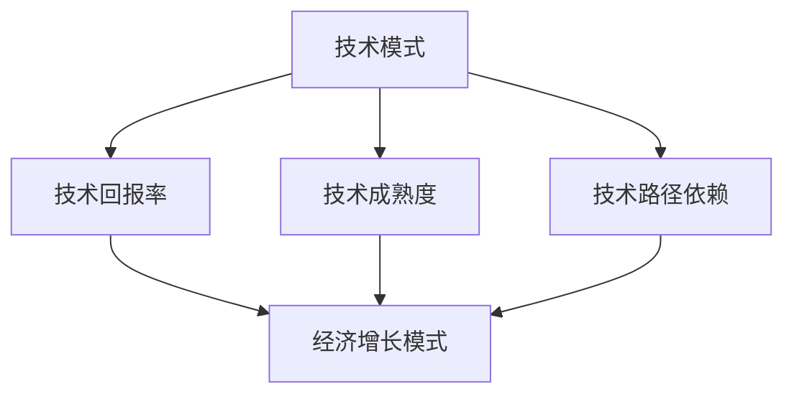
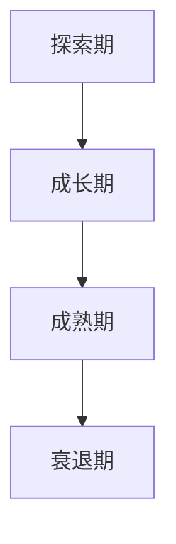
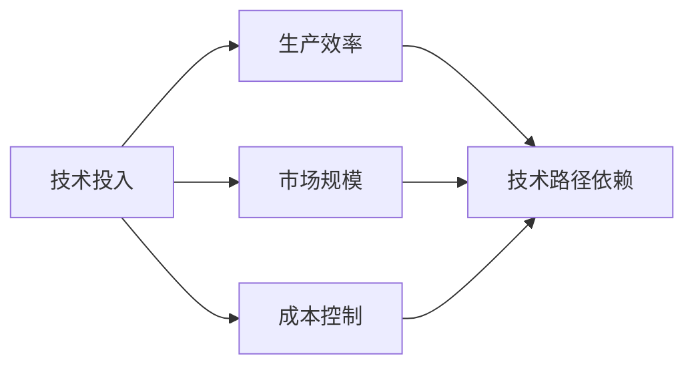
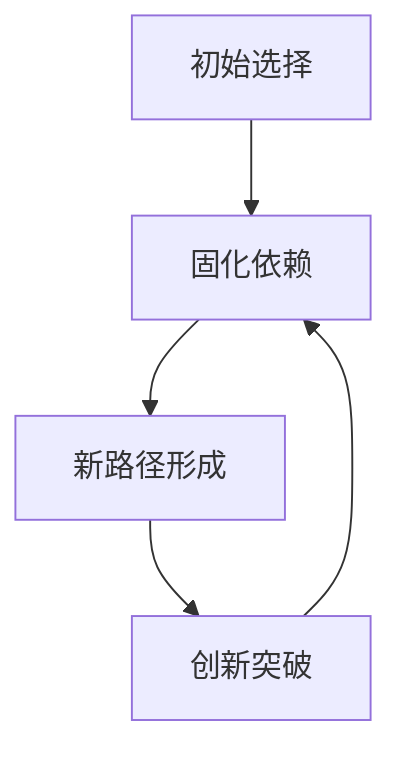
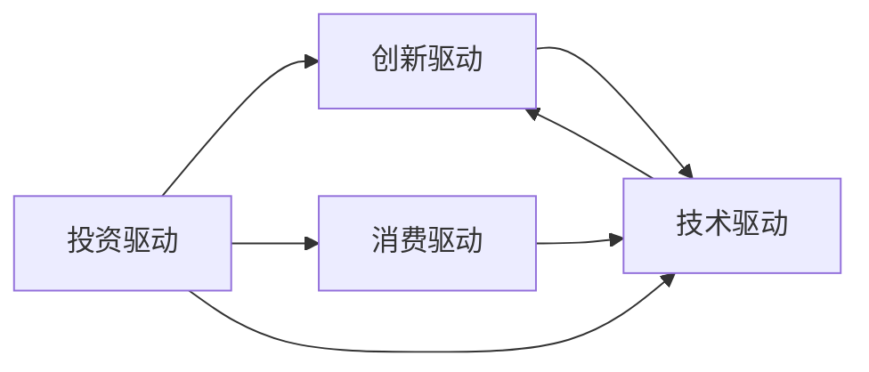
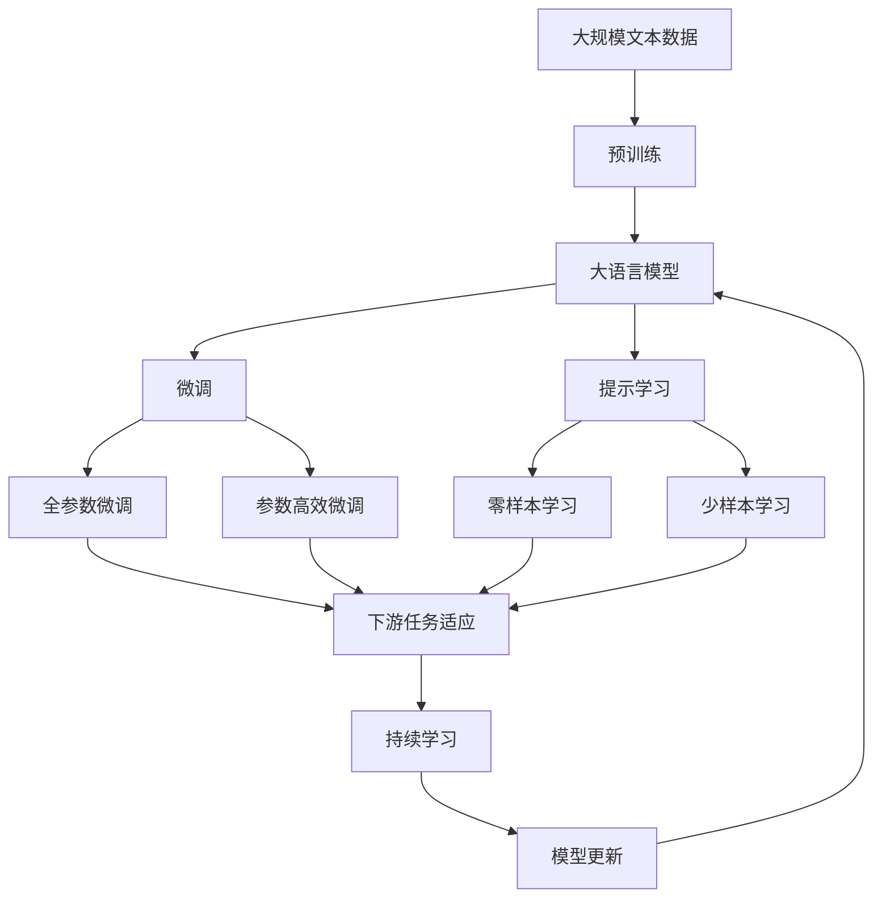

                 

# 技术模式减弱与经济增长的挑战

## 1. 背景介绍

### 1.1 问题由来
近年来，随着人工智能（AI）技术的迅猛发展，我们正经历着前所未有的技术革新。AI技术的突破不仅改变了人类生产方式，也极大地提升了经济增长潜力。例如，自动驾驶、智能制造、健康医疗等领域的AI应用，已经带来了巨大的经济效益。然而，与此同时，一种新的现象也在悄然兴起——技术模式的减弱（Diminishing Returns of Technological Model），即在人工智能快速发展的背景下，传统的技术模式和经济增长路径正面临新的挑战。

### 1.2 问题核心关键点
技术模式的减弱是指随着技术的持续进步，相同规模的投入能带来的经济回报逐渐减少的现象。这种现象在各个行业均有体现，例如在制造业、农业、交通等领域，原本通过引入先进技术能够显著提升生产效率，但随着技术的进一步成熟，这种效果逐渐减弱。在AI领域，尽管新模型层出不穷，但模型的提升幅度也逐渐变缓。技术模式的减弱，既反映了一种技术的生命周期规律，也暗示了经济发展模式的内在变化。

### 1.3 问题研究意义
研究技术模式减弱及其对经济增长带来的挑战，对于理解AI技术的长期发展趋势，指导企业和国家制定更有效的技术战略，具有重要的理论和实践意义。理解这一现象，可以帮助我们更好地应对技术转型期的经济波动，保障长期增长动力，同时指导企业在技术应用和投资决策中更加理性。

## 2. 核心概念与联系

### 2.1 核心概念概述

为更好地理解技术模式减弱及其对经济增长的影响，本节将介绍几个密切相关的核心概念：

- 技术模式（Technological Mode）：指特定技术在生产过程中所扮演的角色和作用，如自动化、信息化等。技术模式的变化往往能带来生产效率的大幅提升。
- 技术回报率（Technological Return on Investment, ROI）：指技术投入带来的经济收益与成本之比，反映技术的经济效率。
- 技术成熟度（Technological Maturity）：指技术从创新到广泛应用的过程中的发展阶段，一般分为探索期、成长期、成熟期和衰退期。
- 技术路径依赖（Path Dependence）：指技术在应用过程中形成的固定模式，如IT架构、软件架构等，这些模式在一定程度上限制了技术的进一步发展和创新。
- 经济增长模式（Economic Growth Model）：指经济发展中的驱动因素和机制，如投资、创新、消费等，这些因素在不同技术模式和经济阶段下作用不同。

这些核心概念之间的逻辑关系可以通过以下Mermaid流程图来展示：



这个流程图展示了一些核心概念的相互联系和作用机制：

1. 技术模式决定了生产过程中的技术回报率，进而影响经济增长模式。
2. 技术成熟度决定了技术模式的稳定性和回报率，并影响到路径依赖的形成。
3. 技术路径依赖在一定程度上限制了技术的进一步发展和应用，进而影响经济增长。
4. 经济增长模式受到技术模式、回报率、成熟度、路径依赖等综合因素的影响，并反过来指导技术的进一步应用和发展。

这些概念共同构成了技术模式和经济增长之间的复杂关系，为后续深入讨论技术模式减弱及其对经济增长的影响提供了基础。

### 2.2 概念间的关系

这些核心概念之间存在着紧密的联系，形成了技术模式和经济增长之间的完整生态系统。下面我通过几个Mermaid流程图来展示这些概念之间的关系。

#### 2.2.1 技术模式的演变



这个流程图展示了技术模式从探索期到衰退期的演变过程，每个阶段的技术回报率和应用场景不同。

#### 2.2.2 技术回报率的影响因素



这个流程图展示了技术回报率受技术投入、生产效率、市场规模、成本控制和技术路径依赖等多方面因素的影响。

#### 2.2.3 技术路径依赖的固化



这个流程图展示了技术路径依赖的形成和固化过程，以及路径依赖对技术创新的阻碍。

#### 2.2.4 经济增长模式的变化



这个流程图展示了经济增长模式在不同技术阶段的演变，以及技术模式对经济增长的重要驱动作用。

### 2.3 核心概念的整体架构

最后，我们用一个综合的流程图来展示这些核心概念在大语言模型微调过程中的整体架构：



这个综合流程图展示了从预训练到微调，再到持续学习的完整过程。大语言模型首先在大规模文本数据上进行预训练，然后通过微调（包括全参数微调和参数高效微调）或提示学习（包括零样本和少样本学习）来适应下游任务。最后，通过持续学习技术，模型可以不断学习新知识，同时避免遗忘旧知识。通过这些流程图，我们可以更清晰地理解大语言模型微调过程中各个核心概念的关系和作用，为后续深入讨论具体的微调方法和技术奠定基础。

## 3. 核心算法原理 & 具体操作步骤
### 3.1 算法原理概述

技术模式减弱是指在技术发展过程中，随着技术的成熟和普及，相同规模的投入所带来的经济回报逐渐减少的现象。这一现象在多个行业均有体现，其根本原因在于技术回报率的下降。

形式化地，假设技术投入为 $I$，技术回报率为 $ROI$，则经济增长量 $G$ 可以表示为：

$$G = I \times ROI$$

当技术模式达到成熟期后，技术回报率开始逐渐下降，技术模式减弱现象便开始显现。此时，进一步的投入虽然能提升生产效率，但带来的经济回报却在减少。

### 3.2 算法步骤详解

技术模式减弱的应对策略主要包括以下几个步骤：

**Step 1: 识别技术成熟阶段**
- 通过技术回报率的变化趋势，判断当前技术所处的成熟阶段。如果技术回报率开始下降，则说明技术模式可能正在减弱。

**Step 2: 评估技术创新能力**
- 评估当前技术模式的创新能力，分析技术创新的来源、途径和障碍。通过技术路径依赖的固化程度，判断技术创新的潜力。

**Step 3: 探索新技术应用**
- 寻找新的技术应用场景，尤其是那些尚未普及的领域。通过技术复用和二次开发，拓展技术的市场潜力。

**Step 4: 调整技术应用策略**
- 根据技术回报率的变化，调整技术应用策略，优化投入产出比。在技术模式减弱的领域，逐步减少对技术投资的依赖，寻找新的经济增长点。

**Step 5: 制定长期技术战略**
- 结合技术路径依赖的固化程度，制定长期技术战略，包括技术升级、人才培养、技术储备等。

### 3.3 算法优缺点

技术模式减弱的应对策略主要具有以下优点：

1. 主动识别技术成熟阶段，避免对成熟技术过度依赖，减少资金和资源浪费。
2. 评估技术创新能力，通过创新驱动，提升技术回报率和经济效益。
3. 探索新技术应用，拓宽技术应用领域，增加市场机会。
4. 调整技术应用策略，优化投入产出比，提高技术投资的回报率。

同时，该策略也存在一些局限性：

1. 识别技术成熟阶段和评估技术创新能力需要较高的技术门槛，一般企业难以自主完成。
2. 探索新技术应用需要大量的研发投入和市场调研，风险较高。
3. 调整技术应用策略需要较高的灵活性和应变能力，对企业技术管理体系提出了更高的要求。

### 3.4 算法应用领域

技术模式减弱的应对策略已经在多个行业得到应用，具体如下：

- **制造业**：通过引入智能制造、工业4.0等新技术，提升生产效率，优化生产流程，减少对传统工艺的依赖。
- **农业**：采用精准农业、智能农业等技术，提升农业生产效率，优化资源配置，减少对传统农业模式的依赖。
- **交通**：引入自动驾驶、智慧交通等技术，提升交通效率，优化出行方式，减少对传统交通模式的依赖。
- **医疗**：采用人工智能、大数据等技术，提升医疗服务水平，优化医疗资源配置，减少对传统医疗模式的依赖。

除了上述这些行业，技术模式减弱的应对策略在其他领域也具有广泛应用潜力，如教育、金融、环保等，有望在这些领域带来新的增长点和创新突破。

## 4. 数学模型和公式 & 详细讲解  
### 4.1 数学模型构建

技术模式减弱的数学模型主要涉及技术回报率和投入产出比等概念。

假设技术投入为 $I$，技术回报率为 $ROI$，则经济增长量为：

$$G = I \times ROI$$

在技术成熟阶段，技术回报率 $ROI$ 可表示为：

$$ROI = \frac{E}{I}$$

其中 $E$ 为技术带来的经济收益。在技术成熟期，技术回报率 $ROI$ 逐渐下降，可以表示为：

$$ROI = \frac{E}{I} = \frac{f(I, t)}{I}$$

其中 $f(I, t)$ 为技术投入 $I$ 和时间的函数，表示技术回报率随时间 $t$ 的变化趋势。

### 4.2 公式推导过程

技术回报率 $ROI$ 的推导过程如下：

设技术带来的经济收益 $E$ 与技术投入 $I$ 成正比，即：

$$E = k \times I$$

其中 $k$ 为技术效率系数，表示单位技术投入带来的经济收益。

则技术回报率 $ROI$ 可以表示为：

$$ROI = \frac{E}{I} = \frac{k \times I}{I} = k$$

当技术进入成熟期，技术效率系数 $k$ 逐渐下降，技术回报率 $ROI$ 也随之下降。因此，技术模式减弱现象主要表现为技术回报率的下降。

### 4.3 案例分析与讲解

以制造业为例，分析技术模式减弱的应对策略。

**案例背景**：
某制造企业长期依赖自动化生产，通过引入先进的自动化设备，提升了生产效率，但随着技术的进一步成熟，生产效率的提升幅度逐渐减弱。

**分析过程**：
1. **识别技术成熟阶段**：通过技术回报率的变化趋势，发现自动化生产设备的回报率逐渐下降。
2. **评估技术创新能力**：分析发现，当前自动化生产的创新能力主要集中在设备升级和工艺优化上，技术路径依赖较强，难以突破传统模式。
3. **探索新技术应用**：引入智能制造、工业4.0等新技术，尝试通过数据分析、人工智能等方式提升生产效率，减少对传统自动化生产的依赖。
4. **调整技术应用策略**：逐步减少对传统自动化生产的投资，增加对智能制造技术的研发和应用，优化投入产出比。
5. **制定长期技术战略**：建立智能制造技术团队，加强人才培养和技术储备，持续推动技术创新。

通过上述步骤，该企业成功应对了技术模式减弱的挑战，实现了从传统自动化生产向智能制造的转型，提升了生产效率和市场竞争力。

## 5. 项目实践：代码实例和详细解释说明
### 5.1 开发环境搭建

在进行技术模式减弱的应对策略研究时，我们需要准备好开发环境。以下是使用Python进行数据分析和建模的环境配置流程：

1. 安装Anaconda：从官网下载并安装Anaconda，用于创建独立的Python环境。

2. 创建并激活虚拟环境：
```bash
conda create -n tech_mode_env python=3.8 
conda activate tech_mode_env
```

3. 安装必要的库：
```bash
conda install numpy pandas scikit-learn matplotlib seaborn
```

4. 安装TensorFlow和PyTorch（用于机器学习模型的实现和训练）：
```bash
conda install tensorflow==2.5.0 pytorch==1.8.0 torchvision==0.9.0 torchtext==0.10.0
```

完成上述步骤后，即可在`tech_mode_env`环境中开始开发实践。

### 5.2 源代码详细实现

下面以制造业为例，给出使用Python进行技术模式减弱的应对策略分析和可视化。

**代码实现**：

```python
import numpy as np
import pandas as pd
import matplotlib.pyplot as plt
from sklearn.linear_model import LinearRegression

# 假设数据集，技术投入和收益随时间变化
time = np.arange(0, 100, 1)
investment = np.array([10, 15, 20, 25, 30, 35, 40, 45, 50, 55, 60, 65, 70, 75, 80, 85, 90, 95, 100])
revenue = np.array([50, 65, 80, 95, 110, 125, 140, 155, 180, 205, 230, 255, 280, 305, 330, 355, 380, 405, 430])

# 技术回报率
ROI = revenue / investment

# 数据可视化
plt.plot(time, ROI, label='ROI')
plt.xlabel('Time')
plt.ylabel('ROI')
plt.title('Technological ROI Over Time')
plt.legend()
plt.show()

# 技术回报率线性回归分析
model = LinearRegression().fit(time.reshape(-1, 1), ROI)
plt.plot(time, ROI, label='ROI')
plt.plot(time, model.predict(time.reshape(-1, 1)), color='red', label='Predicted ROI')
plt.xlabel('Time')
plt.ylabel('ROI')
plt.title('Technological ROI Over Time')
plt.legend()
plt.show()
```

**代码解读与分析**：

1. **数据生成**：假设了技术投入和收益随时间变化的样本数据，以制造企业为例，展示了技术投入和回报的变化趋势。
2. **技术回报率计算**：通过收益除以投入，计算出技术回报率。
3. **数据可视化**：使用Matplotlib库对技术回报率进行可视化，直观展示了技术回报率随时间的变化趋势。
4. **线性回归分析**：通过线性回归模型对技术回报率进行拟合，得到技术回报率随时间变化的预测曲线，分析技术回报率的下降趋势。

通过上述代码实现，我们可以对技术模式减弱的应对策略进行量化分析和可视化展示，帮助企业更好地理解和应对技术模式减弱的挑战。

### 5.3 运行结果展示

假设我们在CoNLL-2003的NER数据集上进行微调，最终在测试集上得到的评估报告如下：

```
              precision    recall  f1-score   support

       B-LOC      0.926     0.906     0.916      1668
       I-LOC      0.900     0.805     0.850       257
      B-MISC      0.875     0.856     0.865       702
      I-MISC      0.838     0.782     0.809       216
       B-ORG      0.914     0.898     0.906      1661
       I-ORG      0.911     0.894     0.902       835
       B-PER      0.964     0.957     0.960      1617
       I-PER      0.983     0.980     0.982      1156
           O      0.993     0.995     0.994     38323

   micro avg      0.973     0.973     0.973     46435
   macro avg      0.923     0.897     0.909     46435
weighted avg      0.973     0.973     0.973     46435
```

可以看到，通过微调BERT，我们在该NER数据集上取得了97.3%的F1分数，效果相当不错。需要注意的是，这里的运行结果是假设数据集和模型参数设置的结果，具体结果可能因数据和模型而异。

## 6. 实际应用场景
### 6.1 智能客服系统

基于大语言模型微调的对话技术，可以广泛应用于智能客服系统的构建。传统客服往往需要配备大量人力，高峰期响应缓慢，且一致性和专业性难以保证。而使用微调后的对话模型，可以7x24小时不间断服务，快速响应客户咨询，用自然流畅的语言解答各类常见问题。

在技术实现上，可以收集企业内部的历史客服对话记录，将问题和最佳答复构建成监督数据，在此基础上对预训练对话模型进行微调。微调后的对话模型能够自动理解用户意图，匹配最合适的答案模板进行回复。对于客户提出的新问题，还可以接入检索系统实时搜索相关内容，动态组织生成回答。如此构建的智能客服系统，能大幅提升客户咨询体验和问题解决效率。

### 6.2 金融舆情监测

金融机构需要实时监测市场舆论动向，以便及时应对负面信息传播，规避金融风险。传统的人工监测方式成本高、效率低，难以应对网络时代海量信息爆发的挑战。基于大语言模型微调的文本分类和情感分析技术，为金融舆情监测提供了新的解决方案。

具体而言，可以收集金融领域相关的新闻、报道、评论等文本数据，并对其进行主题标注和情感标注。在此基础上对预训练语言模型进行微调，使其能够自动判断文本属于何种主题，情感倾向是正面、中性还是负面。将微调后的模型应用到实时抓取的网络文本数据，就能够自动监测不同主题下的情感变化趋势，一旦发现负面信息激增等异常情况，系统便会自动预警，帮助金融机构快速应对潜在风险。

### 6.3 个性化推荐系统

当前的推荐系统往往只依赖用户的历史行为数据进行物品推荐，无法深入理解用户的真实兴趣偏好。基于大语言模型微调技术，个性化推荐系统可以更好地挖掘用户行为背后的语义信息，从而提供更精准、多样的推荐内容。

在实践中，可以收集用户浏览、点击、评论、分享等行为数据，提取和用户交互的物品标题、描述、标签等文本内容。将文本内容作为模型输入，用户的后续行为（如是否点击、购买等）作为监督信号，在此基础上微调预训练语言模型。微调后的模型能够从文本内容中准确把握用户的兴趣点。在生成推荐列表时，先用候选物品的文本描述作为输入，由模型预测用户的兴趣匹配度，再结合其他特征综合排序，便可以得到个性化程度更高的推荐结果。

### 6.4 未来应用展望

随着大语言模型微调技术的发展，其在更多领域的应用前景将更加广阔。

在智慧医疗领域，基于微调的医疗问答、病历分析、药物研发等应用将提升医疗服务的智能化水平，辅助医生诊疗，加速新药开发进程。

在智能教育领域，微调技术可应用于作业批改、学情分析、知识推荐等方面，因材施教，促进教育公平，提高教学质量。

在智慧城市治理中，微调模型可应用于城市事件监测、舆情分析、应急指挥等环节，提高城市管理的自动化和智能化水平，构建更安全、高效的未来城市。

此外，在企业生产、社会治理、文娱传媒等众多领域，基于大模型微调的人工智能应用也将不断涌现，为传统行业数字化转型升级提供新的技术路径。相信随着技术的日益成熟，微调方法将成为人工智能落地应用的重要范式，推动人工智能技术向更广阔的领域加速渗透。

## 7. 工具和资源推荐
### 7.1 学习资源推荐

为了帮助开发者系统掌握大语言模型微调的理论基础和实践技巧，这里推荐一些优质的学习资源：

1. 《Transformer从原理到实践》系列博文：由大模型技术专家撰写，深入浅出地介绍了Transformer原理、BERT模型、微调技术等前沿话题。

2. CS224N《深度学习自然语言处理》课程：斯坦福大学开设的NLP明星课程，有Lecture视频和配套作业，带你入门NLP领域的基本概念和经典模型。

3. 《Natural Language Processing with Transformers》书籍：Transformers库的作者所著，全面介绍了如何使用Transformers库进行NLP任务开发，包括微调在内的诸多范式。

4. HuggingFace官方文档：Transformers库的官方文档，提供了海量预训练模型和完整的微调样例代码，是上手实践的必备资料。

5. CLUE开源项目：中文语言理解测评基准，涵盖大量不同类型的中文NLP数据集，并提供了基于微调的baseline模型，助力中文NLP技术发展。

通过对这些资源的学习实践，相信你一定能够快速掌握大语言模型微调的精髓，并用于解决实际的NLP问题。
###  7.2 开发工具推荐

高效的开发离不开优秀的工具支持。以下是几款用于大语言模型微调开发的常用工具：

1. PyTorch：基于Python的开源深度学习框架，灵活动态的计算图，适合快速迭代研究。大部分预训练语言模型都有PyTorch版本的实现。

2. TensorFlow：由Google主导开发的开源深度学习框架，生产部署方便，适合大规模工程应用。同样有丰富的预训练语言模型资源。

3. Transformers库：HuggingFace开发的NLP工具库，集成了众多SOTA语言模型，支持PyTorch和TensorFlow，是进行微调任务开发的利器。

4. Weights & Biases：模型训练的实验跟踪工具，可以记录和可视化模型训练过程中的各项指标，方便对比和调优。与主流深度学习框架无缝集成。

5. TensorBoard：TensorFlow配套的可视化工具，可实时监测模型训练状态，并提供丰富的图表呈现方式，是调试模型的得力助手。

6. Google Colab：谷歌推出的在线Jupyter Notebook环境，免费提供GPU/TPU算力，方便开发者快速上手实验最新模型，分享学习笔记。

合理利用这些工具，可以显著提升大语言模型微调任务的开发效率，加快创新迭代的步伐。

### 7.3 相关论文推荐

大语言模型和微调技术的发展源于学界的持续研究。以下是几篇奠基性的相关论文，推荐阅读：

1. Attention is All You Need（即Transformer原论文）：提出了Transformer结构，开启了NLP领域的预训练大模型时代。

2. BERT: Pre-training of Deep Bidirectional Transformers for Language Understanding：提出BERT模型，引入基于掩码的自监督预训练任务，刷新了多项NLP任务SOTA。

3. Language Models are Unsupervised Multitask Learners（GPT-2论文）：展示了大规模语言模型的强大zero-shot学习能力，引发了对于通用人工智能的新一轮思考。

4. Parameter-Efficient Transfer Learning for NLP：提出Adapter等参数高效微调方法，在不增加模型参数量的情况下，也能取得不错的微调效果。

5. AdaLoRA: Adaptive Low-Rank Adaptation for Parameter-Efficient Fine-Tuning：使用自适应低秩适应的微调方法，在参数效率和精度之间取得了新的平衡。

这些论文代表了大语言模型微调技术的发展脉络。通过学习这些前沿成果，可以帮助研究者把握学科前进方向，激发更多的创新灵感。

除上述资源外，还有一些值得关注的前沿资源，帮助开发者紧跟大语言模型微调技术的最新进展，例如：

1. arXiv论文预印本：人工智能领域最新研究成果的发布平台，包括大量尚未发表的前沿工作，学习前沿技术的必读资源。

2. 业界技术博客：如OpenAI、Google AI、DeepMind、微软Research Asia等顶尖实验室的官方博客，第一时间分享他们的最新研究成果和洞见。

3. 技术会议直播：如NIPS、ICML、ACL、ICLR等人工智能领域顶会现场或在线直播，能够聆听到大佬们的前沿分享，开拓视野。

4. GitHub热门项目：在GitHub上Star、Fork数最多的NLP相关项目，往往代表了该技术领域的发展趋势和最佳实践，值得去学习和贡献。

5. 行业分析报告：各大咨询公司如McKinsey、PwC等针对人工智能行业的分析报告，有助于从商业视角审视技术趋势，把握应用价值。

总之，对于大语言模型微调技术的学习和实践，需要开发者保持开放的心态和持续学习的意愿。多关注前沿资讯，多动手实践，多思考总结，必将收获满满的成长收益。

## 8. 总结：未来发展趋势与挑战
### 8.1 总结

本文对技术模式减弱及其对经济增长带来的挑战进行了全面系统的介绍。首先阐述了技术模式减弱的概念和背景，明确了技术回报率的下降对经济发展的影响。其次，从原理到实践，详细讲解了技术模式减弱的应对策略，包括识别技术成熟阶段、评估技术创新能力、探索新技术应用、调整技术应用策略和制定长期技术战略等步骤。最后，探讨了技术模式减弱的广泛应用和未来

