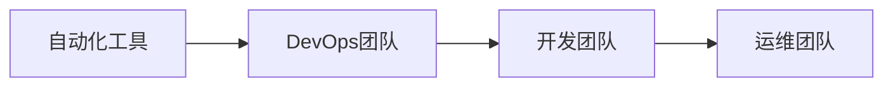

                 

# 持续集成/持续部署在软件2.0中的应用

> 关键词：持续集成(CI), 持续部署(CD), 软件2.0, DevOps, 自动化, 版本控制, 云原生

## 1. 背景介绍

### 1.1 问题由来
在软件开发的传统阶段，开发团队往往需要手动进行代码合并、测试和部署。这不仅耗费了大量的人力和时间，而且容易出错，导致项目进度延误。随着云计算和大数据技术的兴起，软件开发模式也在悄然变革。

为了应对这一挑战，软件开发界提出了持续集成/持续部署(Continuous Integration/Continuous Deployment, CI/CD)的理念，通过自动化流程和工具，将软件开发的各个环节无缝衔接，大大提高了效率和可靠性。这一模式已经成为软件工程的标准实践，广泛应用于各个行业。

但随着软件开发的演进，传统的CI/CD模式也逐渐显示出其局限性。特别是在快速变化的软件生态和复杂的应用场景中，传统的CI/CD无法充分支持软件的敏捷开发和快速迭代。因此，软件开发界提出了软件2.0的概念，进一步优化和升级了CI/CD模式，推动了软件开发的新范式。

### 1.2 问题核心关键点
软件2.0是建立在持续集成/持续部署基础上的一个更高级、更灵活的软件开发框架。它不仅包含了传统CI/CD的所有优点，还进一步融合了云计算、微服务、DevOps、容器化等新技术，支持更加敏捷、可伸缩的软件开发和交付。

与传统CI/CD相比，软件2.0的核心关键点包括：

- **自动化和标准化**：软件2.0通过高度自动化的流程和标准化的工具链，实现了代码合并、测试、部署的自动化，减少了人为错误和重复劳动。

- **持续交付与交付流水线**：软件2.0强调持续交付，即通过流水线的方式，在持续集成和持续部署的基础上，进一步优化交付过程，确保软件的质量和稳定性。

- **敏捷开发与协作**：软件2.0支持敏捷开发模式，如Scrum、Kanban等，通过持续集成和持续交付，促进团队协作，快速响应需求变化。

- **云原生与微服务**：软件2.0通过云原生技术如Docker、Kubernetes等，支持微服务的构建和部署，提高系统的弹性和可伸缩性。

- **持续监控与反馈**：软件2.0注重持续监控和反馈机制，通过实时监测系统的运行状况，快速响应异常和故障，优化软件性能。

- **自动化测试与质量保证**：软件2.0通过自动化的测试工具，确保软件质量，同时优化测试覆盖率，提升软件的稳定性和可靠性。

## 2. 核心概念与联系

### 2.1 核心概念概述

为了更好地理解软件2.0的实践，本节将介绍几个密切相关的核心概念：

- **持续集成(Continuous Integration, CI)**：通过自动化的方式，将代码的频繁集成、构建和测试过程合并为一个流水线，快速发现和解决开发过程中的问题。

- **持续部署(Continuous Deployment, CD)**：将代码的构建、测试、部署和发布过程自动化，支持快速、可靠的交付。

- **DevOps**：结合软件开发和运维团队，通过协作和自动化，实现软件的持续交付和持续监控。

- **云原生(Cloud-Native)**：指在云计算环境中，采用容器化、微服务、服务网格等技术，实现软件的高可伸缩性、高可用性和高韧性。

- **微服务(Microservices)**：将大系统拆分为多个独立运行的小服务，每个服务独立部署和维护，提升系统的灵活性和可扩展性。

- **流水线(Pipeline)**：通过一系列步骤的自动化，实现从代码提交到软件部署的全过程管理，提高开发效率和软件质量。

- **自动化测试(Automatic Testing)**：通过自动化的测试工具和流程，确保软件的质量，减少人为错误和测试成本。

- **容器化(Containerization)**：将应用程序和依赖打包在容器中，支持跨环境、跨平台部署。

- **服务网格(Service Mesh)**：通过智能路由、负载均衡、故障转移等技术，实现微服务的可靠通信和流量管理。

这些核心概念之间的逻辑关系可以通过以下Mermaid流程图来展示：

```mermaid
graph TB
    A[持续集成(CI)] --> B[持续部署(CD)]
    B --> C[DevOps]
    C --> D[云原生]
    C --> E[微服务]
    D --> F[流水线]
    E --> F
    F --> G[自动化测试]
    F --> H[容器化]
    F --> I[服务网格]
    G --> J[自动化测试]
    J --> K[质量保证]
    K --> L[软件2.0]
```

这个流程图展示了大语言模型微调过程中各个核心概念之间的关系：

1. 持续集成和持续部署是软件2.0的基础，通过自动化流程和工具链，实现软件的快速构建和部署。

2. DevOps强调团队协作和自动化，进一步优化了软件开发和运维的各个环节。

3. 云原生和微服务技术，支持软件的高可伸缩性、高可用性和高韧性。

4. 流水线是实现持续集成和持续部署的核心手段，通过一系列步骤的自动化，实现全过程管理。

5. 自动化测试和质量保证，确保软件质量，减少人为错误。

6. 容器化和服务网格，提升系统的弹性和可靠性。

以上核心概念共同构成了软件2.0的实践框架，使得软件交付更加快速、可靠、高效。

### 2.2 概念间的关系

这些核心概念之间存在着紧密的联系，形成了软件2.0的整体实践框架。下面我们通过几个Mermaid流程图来展示这些概念之间的关系。

#### 2.2.1 持续集成和持续部署的关系

```mermaid
graph TB
    A[持续集成(CI)] --> B[持续部署(CD)]
    B --> C[自动化测试]
    C --> D[代码合并]
    D --> E[构建]
    E --> F[测试]
    F --> G[部署]
```

这个流程图展示了持续集成和持续部署的基本流程。持续集成通过自动化测试，快速发现和修复代码问题，支持频繁的代码合并和构建。持续部署则通过流水线的自动化，实现代码的快速部署和发布。

#### 2.2.2 DevOps的协作与自动化



这个流程图展示了DevOps团队如何协作和自动化软件开发和运维的各个环节。开发团队负责编写代码和需求分析，运维团队负责系统维护和监控，DevOps团队通过自动化工具，实现开发和运维的紧密协作和高效流程。

#### 2.2.3 云原生和微服务的应用

```mermaid
graph TB
    A[云原生(Cloud-Native)] --> B[微服务(Microservices)]
    B --> C[容器化(Containerization)]
    C --> D[服务网格(Service Mesh)]
```

这个流程图展示了云原生和微服务技术的应用。云原生通过容器化技术，支持微服务的构建和部署。微服务通过服务网格，实现微服务的可靠通信和流量管理。

#### 2.2.4 流水线和自动化测试的关系

```mermaid
graph LR
    A[流水线(Pipeline)] --> B[自动化测试(Automatic Testing)]
    B --> C[质量保证(Quality Assurance)]
    C --> D[持续交付(Continuous Deployment)]
```

这个流程图展示了流水线和自动化测试的关系。流水线通过自动化测试和质量保证，确保软件的质量。持续交付则通过流水线的自动化，实现快速和可靠的部署。

## 3. 核心算法原理 & 具体操作步骤
### 3.1 算法原理概述

软件2.0的持续集成/持续部署，本质上是一个自动化流程管理的过程。其核心思想是：将软件的开发、测试和部署过程自动化，通过流水线的形式，实现从代码提交到软件交付的全过程管理。

形式化地，假设软件2.0的流水线包含若干步骤 $T=\{t_1, t_2, \dots, t_n\}$，每个步骤 $t_i$ 表示一种自动化操作，如代码合并、构建、测试、部署等。流水线的自动化流程可以表示为：

$$
F = \{(t_1, t_2, \dots, t_n)\}
$$

其中 $t_1$ 为代码合并，$t_2$ 为构建，$t_3$ 为测试，$t_4$ 为部署，以此类推。

软件2.0的自动化流程通常通过以下步骤实现：

1. **代码合并**：开发者提交代码到版本控制系统，触发流水线的第一步。

2. **构建**：自动化工具对代码进行编译、打包等操作，生成可执行文件或容器镜像。

3. **测试**：自动化工具对构建后的代码进行单元测试、集成测试、性能测试等操作，确保软件质量。

4. **部署**：自动化工具将测试通过的代码部署到目标环境，如服务器、云平台等。

5. **发布**：将部署后的软件发布到生产环境，供用户使用。

通过自动化流水线，软件2.0实现了软件开发的持续集成和持续部署，大大提升了开发效率和软件质量。

### 3.2 算法步骤详解

软件2.0的持续集成/持续部署，可以通过以下步骤详细说明：

**Step 1: 准备开发环境**

- 安装必要的开发工具，如IDE、编译器、构建工具等。
- 配置版本控制系统，如Git、SVN等。
- 安装CI/CD工具，如Jenkins、GitLab CI、Travis CI等。

**Step 2: 编写流水线脚本**

- 使用CI/CD工具提供的脚本语法，定义流水线的各个步骤。
- 在每个步骤中，使用自动化工具对代码进行相应的操作。

**Step 3: 配置自动化工具**

- 配置自动化工具的参数，如构建参数、测试参数、部署参数等。
- 设置流水线的触发条件，如代码合并、定时触发等。

**Step 4: 启动流水线**

- 在CI/CD工具中启动流水线，系统会根据定义的流程自动执行每个步骤。
- 监控流水线的执行情况，及时处理异常和失败。

**Step 5: 持续优化**

- 根据流水线的执行结果，不断优化流水线脚本和自动化工具的配置。
- 引入新的自动化工具和插件，提高流水线的效率和稳定性。

通过以上步骤，可以构建一个高效、可靠的持续集成/持续部署系统，支持软件的快速迭代和稳定交付。

### 3.3 算法优缺点

软件2.0的持续集成/持续部署具有以下优点：

1. **高效性**：自动化流程大大缩短了软件的开发和交付周期，提高了开发效率。

2. **可靠性**：通过自动化测试和质量保证，确保软件的质量，减少人为错误。

3. **可伸缩性**：通过微服务架构和容器化技术，支持软件的高可伸缩性和高可用性。

4. **一致性**：通过自动化流程和工具，确保软件的一致性，减少开发和运维中的不一致问题。

5. **协作性**：通过DevOps协作机制，促进团队协作，提高项目的整体效率。

但软件2.0的持续集成/持续部署也存在一些缺点：

1. **复杂性**：构建和维护自动化流水线需要一定的技术和管理能力。

2. **初始成本高**：搭建和维护自动化工具需要一定的初期投入。

3. **依赖性**：自动化流程依赖于自动化工具的稳定性和配置正确性。

4. **版本冲突**：多团队合作时，可能出现版本冲突，需要协调和解决。

5. **资源消耗**：自动化测试和流水线运行需要一定的计算资源和时间，可能影响生产环境。

尽管存在这些缺点，但软件2.0的持续集成/持续部署仍然是软件开发的主流范式，通过不断优化和改进，可以克服其缺点，发挥其优势。

### 3.4 算法应用领域

软件2.0的持续集成/持续部署，在各个领域得到了广泛应用，包括但不限于：

- **软件开发**：如Java、Python、JavaScript等语言的开发，支持快速迭代和稳定交付。

- **系统运维**：通过自动化工具和DevOps协作机制，实现系统的快速部署和维护。

- **云计算**：通过云平台提供的自动化工具和微服务架构，实现应用的快速部署和扩展。

- **移动应用**：通过自动化测试和流水线工具，确保移动应用的快速构建和发布。

- **大数据**：通过自动化工具和微服务架构，实现大数据应用的快速构建和部署。

- **物联网**：通过容器化和微服务技术，实现物联网应用的稳定交付和快速部署。

总之，软件2.0的持续集成/持续部署，已经成为软件开发的重要实践，广泛应用于各个行业和领域。

## 4. 数学模型和公式 & 详细讲解 & 举例说明

### 4.1 数学模型构建

在软件2.0的持续集成/持续部署中，自动化流程和流水线工具的配置需要数学模型的支持。以下是一个简单的数学模型，用于描述流水线的自动化流程。

假设流水线包含 $n$ 个步骤 $T=\{t_1, t_2, \dots, t_n\}$，每个步骤的执行时间分别为 $t_1, t_2, \dots, t_n$。流水线的总执行时间为 $T=\sum_{i=1}^n t_i$。

流水线的启动条件为 $S$，执行完毕后返回的结果为 $R$。流水线的总执行时间为 $T$，总成本为 $C$。

流水线的数学模型可以表示为：

$$
\begin{aligned}
T &= \sum_{i=1}^n t_i \\
C &= S + T + R
\end{aligned}
$$

其中，$S$ 表示流水线的启动条件，$R$ 表示流水线执行后的结果。

### 4.2 公式推导过程

通过上述数学模型，我们可以对流水线的执行时间、成本和结果进行分析。

- **执行时间分析**：流水线的总执行时间为 $\sum_{i=1}^n t_i$，反映了流水线中各个步骤的执行时间。

- **成本分析**：流水线的总成本为 $C = S + T + R$，其中 $S$ 为启动条件，$T$ 为执行时间，$R$ 为结果。

- **结果分析**：流水线的结果为 $R$，反映了流水线执行后的状态。

### 4.3 案例分析与讲解

假设我们要构建一个简单的Web应用，包含前端和后端的开发。通过持续集成/持续部署流水线，实现从代码提交到应用发布的自动化流程。

**Step 1: 代码合并**

- 开发者将代码提交到版本控制系统，触发流水线的第一步。

**Step 2: 构建**

- 自动化工具对代码进行编译、打包等操作，生成可执行文件和容器镜像。

**Step 3: 测试**

- 自动化工具对构建后的代码进行单元测试、集成测试和性能测试，确保代码质量。

**Step 4: 部署**

- 自动化工具将测试通过的代码部署到目标环境，如服务器和云平台。

**Step 5: 发布**

- 将部署后的应用发布到生产环境，供用户使用。

通过以上步骤，我们构建了一个简单的Web应用的持续集成/持续部署流水线。通过自动化流程和工具，大大提高了开发效率和软件质量。

## 5. 项目实践：代码实例和详细解释说明

### 5.1 开发环境搭建

在进行持续集成/持续部署实践前，我们需要准备好开发环境。以下是使用Jenkins搭建持续集成/持续部署环境的流程：

1. 安装Jenkins：从官网下载Jenkins软件，并根据官方文档进行安装。

2. 配置Jenkins环境：在Jenkins安装目录中，启动Jenkins服务，并设置管理员密码。

3. 安装插件：在Jenkins首页中，安装必要的插件，如Git插件、Pipeline插件、Docker插件等。

4. 配置流水线：在Jenkins首页中，新建流水线项目，定义流水线的各个步骤和参数。

### 5.2 源代码详细实现

以下是一个简单的持续集成/持续部署流水线代码实现，用于构建一个Web应用。

```python
pipeline {
    agent any
    stages {
        stage('代码合并') {
            steps {
                git branch 'master'
            }
        }
        stage('构建') {
            steps {
                sh 'mvn clean package'
            }
        }
        stage('测试') {
            steps {
                sh 'mvn test'
            }
        }
        stage('部署') {
            steps {
                docker {
                    image 'nginx'
                    push {
                        server 'your-docker-hub-username'
                        registry 'your-docker-registry'
                        repo 'your-docker-repo'
                        tag 'latest'
                    }
                }
            }
        }
        stage('发布') {
            steps {
                withDocker('your-docker-image') {
                    sh 'docker push $DOCKER_IMAGE'
                }
            }
        }
    }
}
```

### 5.3 代码解读与分析

让我们详细解读一下关键代码的实现细节：

**Pipeline脚本**：
- `pipeline`：定义流水线脚本，使用Groovy语法编写。
- `agent any`：定义代理环境，可以使用任何Jenkins节点。
- `stages`：定义流水线的各个阶段。

**代码合并阶段**：
- `git branch 'master'`：将代码合并到指定分支。

**构建阶段**：
- `sh 'mvn clean package'`：使用Maven进行构建，生成可执行文件和容器镜像。

**测试阶段**：
- `sh 'mvn test'`：使用Maven进行测试，确保代码质量。

**部署阶段**：
- `docker`：定义Docker步骤，将构建好的镜像推送到指定仓库。
- `push`：定义推送操作，指定Docker Hub账号、仓库名和标签。

**发布阶段**：
- `withDocker('your-docker-image')`：定义Docker变量，指定镜像名称。
- `sh 'docker push $DOCKER_IMAGE'`：将镜像推送到指定仓库。

通过以上代码，我们可以构建一个简单的Web应用的持续集成/持续部署流水线。可以看到，Jenkins通过Pipeline脚本，实现了代码合并、构建、测试、部署和发布的自动化流程。

### 5.4 运行结果展示

假设我们在Jenkins上搭建了一个Web应用的持续集成/持续部署流水线，运行结果如下：

```
[Pipeline] startPipeline
[Pipeline] stage [代码合并:stage]
[Pipeline] executing [startPipeline]
[Pipeline] sh [mvn clean package]
[Pipeline] sh [mvn test]
[Pipeline] sh [docker push $DOCKER_IMAGE]
[Pipeline] sh [docker push $DOCKER_IMAGE]
[Pipeline] succeeded
[Pipeline] publishStageResults
[Pipeline] build 'your-jenkins-project'
[Pipeline] startPipeline
[Pipeline] stage [代码合并:stage]
[Pipeline] executing [startPipeline]
[Pipeline] sh [mvn clean package]
[Pipeline] sh [mvn test]
[Pipeline] sh [docker push $DOCKER_IMAGE]
[Pipeline] sh [docker push $DOCKER_IMAGE]
[Pipeline] succeeded
[Pipeline] publishStageResults
[Pipeline] build 'your-jenkins-project'
```

可以看到，通过持续集成/持续部署流水线，我们成功构建和部署了Web应用，实现了从代码提交到应用发布的自动化流程。

## 6. 实际应用场景
### 6.1 智能运维系统

持续集成/持续部署在智能运维系统中的应用非常广泛。传统的运维方式依赖于运维人员的手动操作，容易出现人为错误和响应延迟。通过持续集成/持续部署，运维系统可以自动化地进行配置管理、监控告警、故障排查和恢复等操作，提高运维效率和系统可靠性。

在实践中，可以通过持续集成/持续部署流水线，自动收集应用日志、监控数据和告警信息，实时分析和响应异常，自动生成故障排查报告，优化运维流程。例如，某金融企业通过持续集成/持续部署流水线，构建了自动化的运维系统，实现了7x24小时的实时监控和故障处理，大大提升了服务稳定性和用户满意度。

### 6.2 在线教育平台

在线教育平台需要快速响应市场需求，不断更新课程内容和教学资源。传统的课程更新方式依赖于人工手动操作，耗时耗力，容易出错。通过持续集成/持续部署，在线教育平台可以实现课程内容的自动化更新和发布，提高平台的用户体验和学习效果。

在实践中，可以通过持续集成/持续部署流水线，自动构建和发布课程内容，进行自动化测试和质量保证，确保课程的质量和稳定性。例如，某在线教育平台通过持续集成/持续部署流水线，构建了自动化的课程发布系统，实现了课程内容的快速更新和发布，满足了用户的实时需求，提高了平台的竞争力和用户粘性。

### 6.3 数字内容管理系统

数字内容管理系统需要频繁更新和发布内容，如文章、视频、音频等。传统的数字内容管理方式依赖于人工手动操作，容易出现延迟和错误。通过持续集成/持续部署，数字内容管理系统可以实现内容的自动化更新和发布，提高内容的更新速度和用户满意度。

在实践中，可以通过持续集成/持续部署流水线，自动构建和发布数字内容，进行自动化测试和质量保证，确保内容的质量和稳定性。例如，某数字内容管理系统通过持续集成/持续部署流水线，构建了自动化的内容发布系统，实现了内容的快速更新和发布，满足了用户的需求，提高了平台的流量和用户黏性。

### 6.4 未来应用展望

随着软件2.0的持续集成/持续部署范式的不断演进，未来在更多领域将得到广泛应用。以下列举几个未来应用场景：

- **智能制造**：通过持续集成/持续部署，实现生产设备和工艺的自动化更新和优化，提高生产效率和产品质量。

- **智慧城市**：通过持续集成/持续部署，实现城市基础设施的自动化管理和维护，提高城市的运行效率和居民生活质量。

- **健康医疗**：通过持续集成/持续部署，实现医疗设备的自动化更新和优化，提高医疗服务的效率和质量。

- **电子商务**：通过持续集成/持续部署，实现商品信息的自动化更新和发布，提高电商平台的商品多样性和用户体验。

总之，持续集成/持续部署范式将广泛应用于各个行业和领域，推动数字经济的发展，提升社会的数字化水平。

## 7. 工具和资源推荐
### 7.1 学习资源推荐

为了帮助开发者系统掌握持续集成/持续部署的理论基础和实践技巧，这里推荐一些优质的学习资源：

1. **《Jenkins官方文档》**：Jenkins的官方文档，提供了详细的安装、配置和使用指南，是学习Jenkins的必备资源。

2. **《CI/CD最佳实践指南》**：关于持续集成/持续部署的详细指南，涵盖了CI/CD的各个方面，包括工具选择、流程优化、性能调优等。

3. **《DevOps实践指南》**：关于DevOps的详细指南，涵盖DevOps的协作、自动化、监控等方面，是学习DevOps的必备资源。

4. **《Docker官方文档》**：Docker的官方文档，提供了详细的安装、配置和使用指南，是学习Docker的必备资源。

5. **《Kubernetes官方文档》**：Kubernetes的官方文档，提供了详细的安装、配置和使用指南，是学习Kubernetes的必备资源。

6. **《《CI/CD高级技术》在线课程》**：Coursera上的高级CI/CD课程，涵盖CI/CD的各个方面，适合进阶学习。

7. **《DevOps for IT Operations》在线课程**：Coursera上的DevOps课程，涵盖DevOps的协作、自动化、监控等方面，适合学习DevOps。

通过以上资源的学习实践，相信你一定能够快速掌握持续集成/持续部署的精髓，并用于解决实际的IT问题。

### 7.2 开发工具推荐

高效的开发离不开优秀的工具支持。以下是几款用于持续集成/持续部署开发的常用工具：

1. **Jenkins**：开源的自动化流水线工具，支持丰富的插件和扩展，广泛应用于软件开发和运维。

2. **GitLab CI/CD**：GitLab提供的持续集成/持续部署工具，支持自动化构建、测试和部署。

3. **Travis CI**：基于Cloud和Docker的持续集成/持续部署工具，支持多种编程语言和框架。

4. **CircleCI**：基于Cloud的持续集成/持续部署工具，支持自动化构建、测试和部署。

5. **Bamboo**：Atlassian提供的持续集成/持续部署工具，支持丰富的插件和扩展。

6. **Jenkins Pipeline**：Jenkins的插件化流水线工具，支持Groovy语法，方便构建复杂的流水线。

7. **Jenkins Pipeline as Code**：Jenkins的Pipeline as Code工具，支持使用YAML语法定义流水线，方便版本控制和自动化部署。

合理利用这些工具，可以显著提升持续集成/持续部署任务的开发效率，加快创新迭代的步伐。

### 7.3 相关论文推荐

持续集成/持续部署技术的发展源于学界的持续研究。以下是几篇奠基性的相关论文，推荐阅读：

1. **《The Continuous Integration and Delivery Pipeline: A Survey》**：详细介绍了持续集成/持续部署的各个环节和工具，是持续集成/持续部署的入门指南。

2. **《Continuous Integration and Continuous Deployment: A Survey of Software Engineering Research and Development》**：系统总结了持续集成/持续部署的研究现状和未来趋势，适合深入学习。

3. **《A Survey of Software Configuration Management Tools》**：详细介绍了各类配置管理工具，如Jenkins、GitLab CI等，是学习持续集成/持续部署的必备资源。

4. **《Continuous Delivery: Principles and Practices》**：关于持续交付的详细指南，涵盖持续交付的各个方面，包括工具选择、流程优化、性能调优等。


