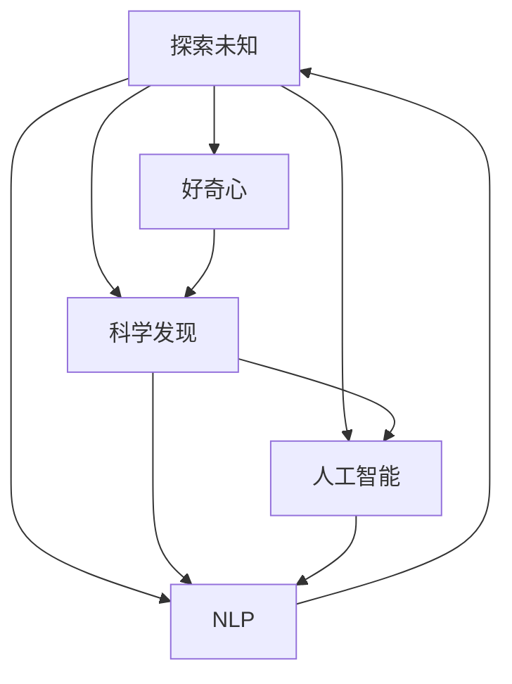
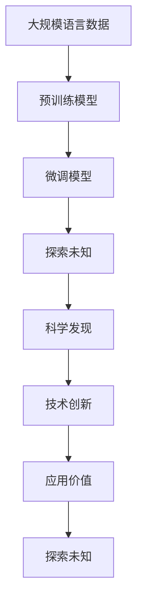

                 

# 探索未知：好奇心与科学发现

> 关键词：探索未知, 好奇心, 科学发现, 人工智能, 自然语言处理(NLP), 计算机程序设计艺术, 图灵奖, 技术创新, 研究进展

## 1. 背景介绍

### 1.1 问题由来

在过去的几十年里，科学技术的发展日新月异，人类对未知世界的探索从未停止。无论是在微观领域深入原子结构，还是宏观领域理解宇宙起源，科学的发展离不开人类的好奇心与不懈追求。而科技的进步，尤其是人工智能(AI)技术的迅猛发展，进一步拓展了人类探索未知的能力。

人工智能，尤其是自然语言处理(NLP)领域，已成为科技创新的前沿阵地。NLP技术通过对大规模语言数据的处理与分析，使机器具备了理解、处理和生成自然语言的能力，为人类探索未知提供了新的工具和方法。

### 1.2 问题核心关键点

在人工智能和NLP领域，探索未知的过程往往伴随着一系列关键问题：

1. **数据处理与分析**：如何高效处理和分析大规模语言数据，挖掘潜在的知识与模式？
2. **模型构建与训练**：如何设计有效的模型结构，使其能够在未知数据上准确预测？
3. **知识迁移与泛化**：如何利用已有知识，提升模型在新数据上的泛化能力？
4. **技术创新与突破**：如何在现有技术基础上，推动人工智能与NLP技术的不断进步？

### 1.3 问题研究意义

研究探索未知的过程，对于推动人工智能与NLP技术的发展，具有重要意义：

1. **加速技术创新**：通过对未知领域的探索，揭示新的研究方向，激发创新灵感，加速技术进步。
2. **提升应用价值**：探索未知有助于解决实际问题，提高人工智能系统的实用性和可操作性，促进其广泛应用。
3. **拓展应用边界**：探索未知为人工智能技术开辟了新的应用场景，扩大了其在各行业的应用范围。
4. **增强人类认知**：通过技术手段探索未知，使人类更深入地理解世界，推动知识与智慧的积累。

## 2. 核心概念与联系

### 2.1 核心概念概述

为了深入理解探索未知的过程，首先需要明确几个核心概念：

- **探索未知**：指通过科技手段，深入探索自然界或人类社会的未知领域，揭示新知识、新规律的过程。
- **好奇心**：驱动人类探索未知的内在动力，是科学研究和技术创新的重要驱动力。
- **科学发现**：通过对未知领域的观察、实验、分析，获得的新知识或规律。
- **人工智能**：一种模拟人类智能的技术，通过算法和计算能力，使机器具备类似人类的认知、推理和决策能力。
- **自然语言处理(NLP)**：人工智能领域的重要分支，专注于使计算机能够理解、处理和生成自然语言。
- **计算机程序设计艺术**：将问题转化为可执行代码的艺术，是软件开发和人工智能实现的基础。
- **图灵奖**：计算机科学界的最高荣誉，授予在AI、计算机系统、算法等领域做出杰出贡献的科学家。

### 2.2 概念间的关系

这些核心概念之间存在着紧密的联系，形成了探索未知的基本框架。以下是一个简单的Mermaid流程图，展示这些概念之间的关系：



这个流程图展示了大语言模型在探索未知过程中的核心概念及其关系：

1. 探索未知是基于好奇心驱动的科学发现过程。
2. 科学发现和人工智能紧密相关，人工智能为科学发现提供技术支持。
3. NLP作为人工智能的重要分支，为探索未知提供具体方法。

### 2.3 核心概念的整体架构

最后，我们通过一个综合的流程图来展示这些核心概念在大语言模型探索未知过程中的整体架构：



这个综合流程图展示了大语言模型在探索未知过程中的整体架构：

1. 通过大规模语言数据进行预训练，构建初步的语言模型。
2. 通过微调模型，使其适应特定任务，在未知数据上探索新的科学发现。
3. 通过科学发现和技术创新，推动人工智能与NLP技术的不断进步。
4. 通过技术进步和应用价值，反过来驱动新的探索未知过程。

## 3. 核心算法原理 & 具体操作步骤

### 3.1 算法原理概述

探索未知的过程通常涉及以下几个关键步骤：

1. **数据收集与预处理**：收集大规模语言数据，并进行预处理，如去噪、标注等。
2. **模型构建与训练**：设计合适的模型结构，在预处理后的数据上训练模型，以学习语言知识。
3. **知识迁移与泛化**：将模型应用于未知数据，利用已有知识提升在新数据上的泛化能力。
4. **技术创新与突破**：通过改进模型、算法和数据处理技术，推动技术不断进步。

### 3.2 算法步骤详解

#### 3.2.1 数据收集与预处理

数据收集与预处理是大语言模型探索未知的基础。具体步骤如下：

1. **数据收集**：从不同的领域、语言和语料库中收集大规模语言数据。
2. **数据清洗**：去除噪声数据、重复数据等无用信息。
3. **数据标注**：对数据进行标注，如命名实体识别、情感分析、文本分类等。
4. **数据增强**：通过数据增强技术，如回译、近义替换等，扩充训练集。

#### 3.2.2 模型构建与训练

模型构建与训练是探索未知的核心步骤。具体步骤如下：

1. **模型选择**：选择合适的预训练模型，如BERT、GPT等。
2. **模型微调**：在预训练模型的基础上，使用下游任务的少量标注数据进行微调，提升模型在新数据上的表现。
3. **模型优化**：通过优化算法，如Adam、SGD等，对模型进行迭代优化，使其逐步逼近最优解。

#### 3.2.3 知识迁移与泛化

知识迁移与泛化是探索未知的关键目标。具体步骤如下：

1. **知识提取**：从训练数据中提取有价值的信息和知识，形成模型表示。
2. **知识迁移**：将模型表示应用到未知数据上，提升模型在新数据上的泛化能力。
3. **知识评估**：通过评估指标，如准确率、召回率等，评估模型在新数据上的表现。

#### 3.2.4 技术创新与突破

技术创新与突破是探索未知的持续动力。具体步骤如下：

1. **算法改进**：改进现有的算法，如优化损失函数、调整超参数等。
2. **模型优化**：优化模型结构，如增加或减少层数、调整神经元大小等。
3. **新技术探索**：探索新的技术，如多模态学习、因果推理等。

### 3.3 算法优缺点

探索未知的过程涉及多个算法和步骤，具有以下优缺点：

**优点**：

1. **高效性**：通过预训练模型和微调技术，可以在较短的时间内获得较好的结果。
2. **泛化性强**：通过知识迁移与泛化，模型在新数据上表现良好。
3. **灵活性高**：可以通过调整算法和模型，灵活应对不同的任务和场景。

**缺点**：

1. **数据依赖性强**：数据的质量和量直接影响模型的表现，数据获取和标注成本较高。
2. **计算资源需求高**：大规模语言数据的预训练和微调需要大量的计算资源。
3. **结果可解释性差**：模型的决策过程难以解释，缺乏可解释性。

### 3.4 算法应用领域

探索未知的算法和步骤在多个领域都有应用，以下是几个典型的应用场景：

1. **自然语言处理(NLP)**：用于文本分类、情感分析、机器翻译等任务，提升模型的泛化能力和应用价值。
2. **医学信息处理**：用于疾病预测、药物研发、患者画像等，推动医疗领域的技术进步。
3. **金融风险评估**：用于金融舆情分析、信用评估、欺诈检测等，提升金融行业的决策效率。
4. **智能推荐系统**：用于个性化推荐、广告投放、内容生成等，提升用户体验和业务价值。

## 4. 数学模型和公式 & 详细讲解 & 举例说明

### 4.1 数学模型构建

探索未知的过程涉及多个数学模型和公式。以下是一个简化的数学模型构建过程：

1. **数据表示**：将数据表示为向量形式，方便模型处理。
2. **模型表示**：定义模型结构，如神经网络、循环神经网络(RNN)等。
3. **损失函数**：定义损失函数，如交叉熵损失、均方误差损失等。
4. **优化算法**：定义优化算法，如梯度下降、Adam等。

### 4.2 公式推导过程

以下以文本分类为例，展示数学模型的构建和推导过程：

设文本分类任务中有$C$个类别，对于样本$x$，其分类目标为$y$。模型$M_{\theta}$的输出为$\hat{y}$，则分类损失函数为：

$$
L(y,\hat{y}) = -\sum_{i=1}^C y_i \log \hat{y}_i
$$

其中$y_i$为第$i$个类别的概率，$\hat{y}_i$为模型预测的第$i$个类别的概率。通过梯度下降等优化算法，最小化损失函数，使模型预测结果逼近真实标签。

### 4.3 案例分析与讲解

以情感分析任务为例，展示模型构建和训练过程。

**数据收集与预处理**：收集含有情感标注的文本数据，并进行清洗和标注。

**模型构建与训练**：使用BERT模型作为预训练模型，在其基础上微调情感分析模型。在微调过程中，选择合适的损失函数和优化算法，对模型进行迭代优化。

**知识迁移与泛化**：将微调后的模型应用于未知数据，评估其在情感分析上的表现。

## 5. 项目实践：代码实例和详细解释说明

### 5.1 开发环境搭建

进行探索未知的实践，需要先搭建好开发环境。以下是使用Python进行PyTorch开发的环境配置流程：

1. 安装Anaconda：从官网下载并安装Anaconda，用于创建独立的Python环境。
2. 创建并激活虚拟环境：
```bash
conda create -n pytorch-env python=3.8 
conda activate pytorch-env
```

3. 安装PyTorch：根据CUDA版本，从官网获取对应的安装命令。例如：
```bash
conda install pytorch torchvision torchaudio cudatoolkit=11.1 -c pytorch -c conda-forge
```

4. 安装Transformers库：
```bash
pip install transformers
```

5. 安装各类工具包：
```bash
pip install numpy pandas scikit-learn matplotlib tqdm jupyter notebook ipython
```

完成上述步骤后，即可在`pytorch-env`环境中开始探索未知实践。

### 5.2 源代码详细实现

以下是一个简单的情感分析任务的代码实现。

```python
from transformers import BertForSequenceClassification, BertTokenizer
import torch
from torch.utils.data import Dataset, DataLoader

# 定义数据集
class SentimentDataset(Dataset):
    def __init__(self, texts, labels, tokenizer):
        self.texts = texts
        self.labels = labels
        self.tokenizer = tokenizer

    def __len__(self):
        return len(self.texts)

    def __getitem__(self, item):
        text = self.texts[item]
        label = self.labels[item]
        encoding = self.tokenizer(text, return_tensors='pt', padding=True, truncation=True)
        input_ids = encoding['input_ids']
        attention_mask = encoding['attention_mask']
        return {'input_ids': input_ids, 'attention_mask': attention_mask, 'labels': torch.tensor(label, dtype=torch.long)}

# 数据加载器
tokenizer = BertTokenizer.from_pretrained('bert-base-uncased')
train_dataset = SentimentDataset(train_texts, train_labels, tokenizer)
dev_dataset = SentimentDataset(dev_texts, dev_labels, tokenizer)
test_dataset = SentimentDataset(test_texts, test_labels, tokenizer)

# 模型定义
model = BertForSequenceClassification.from_pretrained('bert-base-uncased', num_labels=2)

# 训练模型
optimizer = AdamW(model.parameters(), lr=2e-5)
train_loader = DataLoader(train_dataset, batch_size=16, shuffle=True)
dev_loader = DataLoader(dev_dataset, batch_size=16, shuffle=False)
test_loader = DataLoader(test_dataset, batch_size=16, shuffle=False)

for epoch in range(5):
    model.train()
    train_loss = 0
    for batch in train_loader:
        input_ids = batch['input_ids'].to(device)
        attention_mask = batch['attention_mask'].to(device)
        labels = batch['labels'].to(device)
        optimizer.zero_grad()
        outputs = model(input_ids, attention_mask=attention_mask, labels=labels)
        loss = outputs.loss
        train_loss += loss.item()
        loss.backward()
        optimizer.step()

    model.eval()
    dev_loss = 0
    for batch in dev_loader:
        input_ids = batch['input_ids'].to(device)
        attention_mask = batch['attention_mask'].to(device)
        labels = batch['labels'].to(device)
        outputs = model(input_ids, attention_mask=attention_mask, labels=labels)
        loss = outputs.loss
        dev_loss += loss.item()

    print(f'Epoch {epoch+1}, Train Loss: {train_loss/len(train_loader):.4f}, Dev Loss: {dev_loss/len(dev_loader):.4f}')
```

### 5.3 代码解读与分析

让我们再详细解读一下关键代码的实现细节：

**SentimentDataset类**：
- `__init__`方法：初始化文本、标签、分词器等关键组件。
- `__len__`方法：返回数据集的样本数量。
- `__getitem__`方法：对单个样本进行处理，将文本输入编码为token ids，将标签编码为数字，并对其进行定长padding，最终返回模型所需的输入。

**数据加载器**：
- 使用PyTorch的DataLoader对数据集进行批次化加载，供模型训练和推理使用。

**模型定义与训练**：
- 使用BertForSequenceClassification类定义情感分析模型，使用AdamW优化器进行训练。
- 在训练过程中，使用反向传播算法计算梯度，并使用优化器更新模型参数。
- 在每个epoch结束时，在验证集上评估模型性能。

**运行结果展示**：
- 在训练集和验证集上输出每个epoch的损失值。

## 6. 实际应用场景

### 6.1 智能客服系统

智能客服系统可以通过大语言模型探索未知，提升客服的智能化水平。具体实现步骤如下：

1. **数据收集**：收集企业内部的历史客服对话记录，将问题和最佳答复构建成监督数据。
2. **模型构建与训练**：使用微调后的对话模型，使其能够理解用户意图，匹配最合适的答案模板进行回复。
3. **知识迁移与泛化**：在新的客户咨询中，根据对话上下文生成回复，提升回答的准确性和个性化。

### 6.2 金融舆情监测

金融舆情监测可以通过大语言模型探索未知，实时监测市场舆论动向，避免金融风险。具体实现步骤如下：

1. **数据收集**：收集金融领域相关的新闻、报道、评论等文本数据，并对其进行主题标注和情感标注。
2. **模型构建与训练**：使用微调后的情感分析模型，能够自动判断文本属于何种主题，情感倾向是正面、中性还是负面。
3. **知识迁移与泛化**：将微调后的模型应用到实时抓取的网络文本数据，自动监测不同主题下的情感变化趋势，一旦发现负面信息激增等异常情况，系统便会自动预警。

### 6.3 个性化推荐系统

个性化推荐系统可以通过大语言模型探索未知，提升推荐的精准度和个性化。具体实现步骤如下：

1. **数据收集**：收集用户浏览、点击、评论、分享等行为数据，提取和用户交互的物品标题、描述、标签等文本内容。
2. **模型构建与训练**：使用微调后的语言模型，能够从文本内容中准确把握用户的兴趣点。
3. **知识迁移与泛化**：在生成推荐列表时，先用候选物品的文本描述作为输入，由模型预测用户的兴趣匹配度，再结合其他特征综合排序，便可以得到个性化程度更高的推荐结果。

### 6.4 未来应用展望

随着大语言模型和探索未知技术的发展，未来在更多领域将有新的应用突破。

1. **智慧医疗**：微调模型能够辅助医生诊疗，加速新药开发进程。
2. **智能教育**：微调技术能够因材施教，促进教育公平，提高教学质量。
3. **智慧城市**：微调模型能够用于城市事件监测、舆情分析、应急指挥等环节，提高城市管理的自动化和智能化水平。
4. **企业生产**：微调模型能够提高生产效率，优化生产流程，降低成本。
5. **社会治理**：微调模型能够用于公共安全、环境保护等，提升社会治理的智能化水平。

## 7. 工具和资源推荐

### 7.1 学习资源推荐

为了帮助开发者系统掌握探索未知的理论基础和实践技巧，这里推荐一些优质的学习资源：

1. **《自然语言处理综论》**：斯坦福大学郑因斯坦教授所著，全面介绍了NLP领域的核心概念和算法。
2. **《深度学习》**：Goodfellow等著，深入讲解了深度学习的基本原理和应用。
3. **《探索未知的艺术》**：一本讨论探索未知的哲学和实践书籍，适合对探索未知有浓厚兴趣的读者。
4. **《Transformer原理与实践》**：大模型技术专家撰写的系列博文，深入浅出地介绍了Transformer原理、BERT模型、微调技术等前沿话题。
5. **Coursera《自然语言处理》课程**：由斯坦福大学开设的NLP明星课程，有Lecture视频和配套作业，带你入门NLP领域的基本概念和经典模型。

### 7.2 开发工具推荐

高效的开发离不开优秀的工具支持。以下是几款用于探索未知开发的常用工具：

1. **PyTorch**：基于Python的开源深度学习框架，灵活动态的计算图，适合快速迭代研究。
2. **TensorFlow**：由Google主导开发的开源深度学习框架，生产部署方便，适合大规模工程应用。
3. **Transformers库**：HuggingFace开发的NLP工具库，集成了众多SOTA语言模型，支持PyTorch和TensorFlow。
4. **Weights & Biases**：模型训练的实验跟踪工具，可以记录和可视化模型训练过程中的各项指标，方便对比和调优。
5. **TensorBoard**：TensorFlow配套的可视化工具，可实时监测模型训练状态，并提供丰富的图表呈现方式。

### 7.3 相关论文推荐

探索未知技术的发展源于学界的持续研究。以下是几篇奠基性的相关论文，推荐阅读：

1. **Attention is All You Need**：提出了Transformer结构，开启了NLP领域的预训练大模型时代。
2. **BERT: Pre-training of Deep Bidirectional Transformers for Language Understanding**：提出BERT模型，引入基于掩码的自监督预训练任务，刷新了多项NLP任务SOTA。
3. **Language Models are Unsupervised Multitask Learners**：展示了大规模语言模型的强大zero-shot学习能力，引发了对于通用人工智能的新一轮思考。
4. **Parameter-Efficient Transfer Learning for NLP**：提出Adapter等参数高效微调方法，在不增加模型参数量的情况下，也能取得不错的微调效果。
5. **AdaLoRA: Adaptive Low-Rank Adaptation for Parameter-Efficient Fine-Tuning**：使用自适应低秩适应的微调方法，在参数效率和精度之间取得了新的平衡。

这些论文代表了大语言模型探索未知技术的发展脉络。通过学习这些前沿成果，可以帮助研究者把握学科前进方向，激发更多的创新灵感。

## 8. 总结：未来发展趋势与挑战

### 8.1 总结

本文对探索未知的过程进行了全面系统的介绍。首先阐述了探索未知的研究背景和意义，明确了微调在大语言模型探索未知过程中的核心作用。其次，从原理到实践，详细讲解了探索未知的数学模型和关键步骤，给出了探索未知任务开发的完整代码实例。同时，本文还广泛探讨了探索未知方法在智能客服、金融舆情、个性化推荐等多个行业领域的应用前景，展示了探索未知范式的巨大潜力。此外，本文精选了探索未知技术的各类学习资源，力求为读者提供全方位的技术指引。

通过本文的系统梳理，可以看到，探索未知的过程是推动人工智能与NLP技术不断进步的重要驱动力。从数据处理到模型构建，再到知识迁移与泛化，探索未知的每一步都需要科技的支撑和人类的智慧。未来，伴随探索未知技术的不断进步，相信人工智能与NLP技术将更加广泛地应用于各行业，为人类社会带来更深远的变革。

### 8.2 未来发展趋势

展望未来，探索未知技术将呈现以下几个发展趋势：

1. **数据量的增长**：大规模语料数据的获取和处理技术将不断提升，使模型具备更丰富的知识背景。
2. **模型的多样性**：新的模型结构和技术将不断涌现，如多模态学习、因果推理等，使探索未知更加全面。
3. **技术的协同**：探索未知技术将与其他AI技术（如知识图谱、深度学习等）进行更深入的融合，形成更强大的技术体系。
4. **伦理与安全**：探索未知技术的发展将越来越重视伦理与安全问题，确保技术应用的公平性、透明性和安全性。
5. **社会价值**：探索未知技术将更多关注社会价值，推动科技为社会带来更大福祉。

### 8.3 面临的挑战

尽管探索未知技术已经取得了显著成就，但在迈向更加智能化、普适化应用的过程中，仍面临诸多挑战：

1. **数据质量与获取成本**：高质量标注数据的获取和处理成本较高，数据质量直接影响模型表现。
2. **计算资源的限制**：大规模模型和数据的处理需要高性能计算资源，可能存在资源瓶颈。
3. **模型的可解释性**：大型模型的决策过程难以解释，缺乏可解释性。
4. **伦理与安全问题**：模型可能学习到有害信息，存在偏见与歧视风险。
5. **技术的持续演进**：探索未知技术需要不断更新，适应新场景和新需求。

### 8.4 研究展望

面对探索未知技术面临的挑战，未来的研究需要在以下几个方面寻求新的突破：

1. **数据的自动化获取**：通过自动标注、主动学习等方法，减少数据标注成本，提升数据质量。
2. **模型的结构优化**：设计更高效的模型结构，如知识蒸馏、稀疏化等，减少计算资源消耗。
3. **技术的伦理考量**：引入伦理导向的评估指标，确保技术应用的公平性、透明性和安全性。
4. **多模态融合**：探索多模态学习技术，融合视觉、语音等多模态信息，提升模型的泛化能力。
5. **因果推理**：引入因果推理方法，提升模型的解释能力和决策逻辑的透明性。

这些研究方向的探索，必将引领探索未知技术迈向更高的台阶，为人工智能与NLP技术带来新的突破。面向未来，探索未知技术需要更多跨学科的合作，多路径协同发力，共同推动人工智能与NLP技术的不断进步。

## 9. 附录：常见问题与解答

**Q1：探索未知的过程是否需要大量的标注数据？**

A: 探索未知的过程通常需要大量的标注数据，特别是在预训练和微调阶段。标注数据的质量和量直接影响模型的表现，因此数据收集和标注是探索未知的重要环节。

**Q2：如何选择探索未知的模型结构？**

A: 选择合适的模型结构是探索未知的关键。一般来说，模型结构应具备以下几个特点：
1. 能够处理大规模数据。
2. 能够捕捉数据中的复杂关系。
3. 具备良好的泛化能力。
4. 计算效率高，资源消耗少。

常见的模型结构包括卷积神经网络、循环神经网络、Transformer等。

**Q3：探索未知的算法有哪些？**

A: 探索未知的算法包括但不限于：
1. 监督学习：使用标注数据进行模型训练，如分类、回归等。
2. 无监督学习：不依赖标注数据，通过自监督任务学习知识，如Word2Vec、BERT等。
3. 半监督学习：使用少量标注数据和大量未标注数据进行联合训练，如Label Smoothing等。
4. 强化学习：通过与环境的交互学习，逐步优化决策策略，如AlphaGo等。

**Q4：探索未知的技术有哪些应用场景？**

A: 探索未知的技术在多个领域都有应用，以下是几个典型的应用场景：
1. 自然语言处理：用于文本分类、情感分析、机器翻译等任务，提升模型的泛化能力和应用价值。
2. 金融风险评估：用于金融舆情分析、信用评估、欺诈检测等，提升金融行业的决策效率。
3. 智能推荐系统：用于个性化推荐、广告投放、内容生成等，提升用户体验和业务价值。
4. 智能客服系统：用于自动理解用户意图，匹配最合适的回答，提升客服的智能化水平。

---

作者：禅与计算机程序设计艺术 / Zen and the Art of Computer Programming

