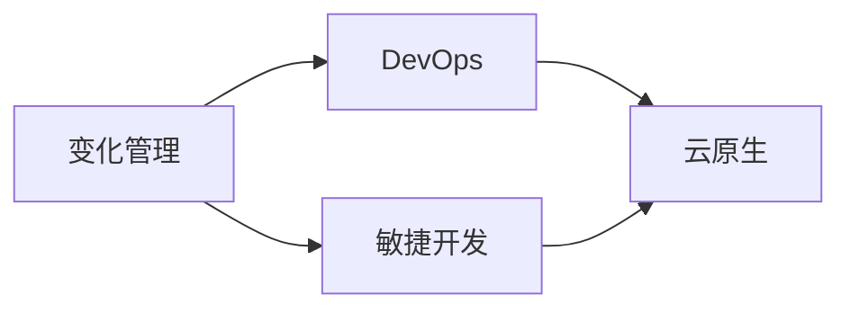
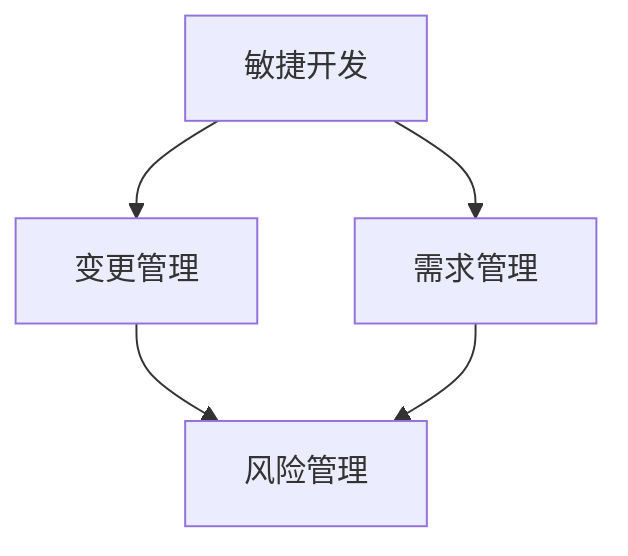
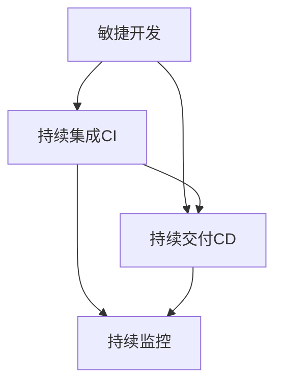
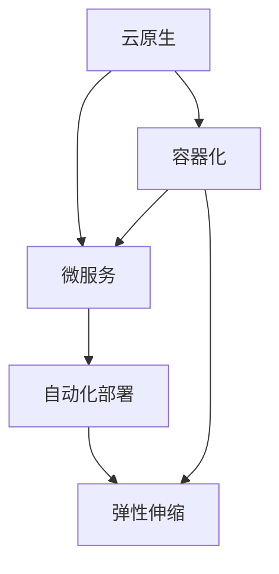
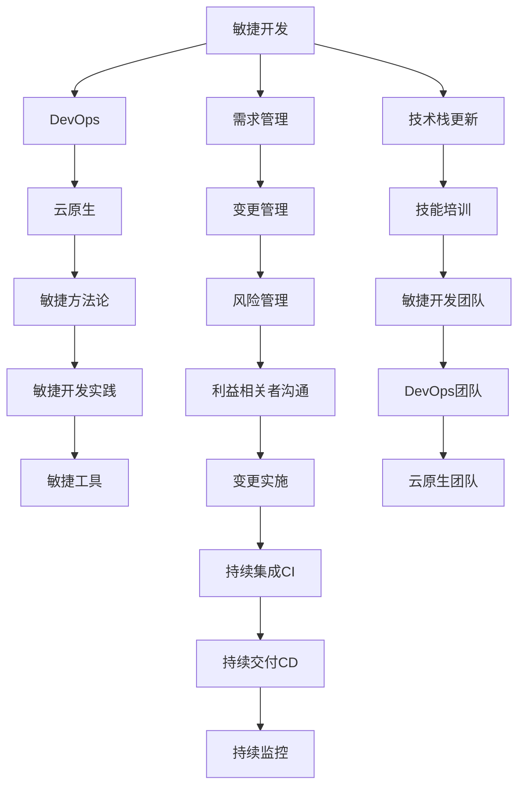

                 

# 接纳并庆祝变化：管理变化，适应变化

## 1. 背景介绍

在快速发展的IT领域，变化始终是不可避免的主题。无论是技术的演进、市场的变化，还是法规政策的调整，所有的变化都要求我们能够快速适应并从中寻找新的机会。如何管理变化，适应变化，成为了每个IT从业者必须掌握的必备技能。本文将围绕变化管理的核心概念和方法，探讨如何有效应对变化，提升组织和个人的应变能力。

### 1.1 问题由来

在当前的数字化时代，技术的更新迭代速度令人目不暇接。新兴技术的涌现，如云计算、大数据、人工智能等，不仅改变了企业的业务模式，也对IT团队的技术栈和技能要求提出了新的挑战。此外，市场的竞争日趋激烈，客户需求的多样化和个性化，也对企业的快速响应能力提出了更高要求。

然而，IT团队往往在面对这些快速变化时，显得力不从心。究其原因，一方面是技术栈复杂，团队成员难以快速掌握新技能；另一方面，缺乏有效的变化管理方法，导致组织对变化的适应性不足。因此，如何有效地管理变化，提升团队的应变能力，成为每个IT团队需要解决的重要问题。

### 1.2 问题核心关键点

为了有效应对变化，我们需要关注以下几个关键点：

- **变化管理策略**：制定和执行有效的变化管理策略，包括风险评估、变更管理、利益相关者沟通等。
- **技术栈更新**：及时更新和调整技术栈，确保团队掌握最新的技术趋势和工具。
- **技能培训**：通过定期的技能培训，提升团队成员的技术能力和业务理解。
- **敏捷开发**：采用敏捷开发方法论，提高团队的响应速度和协作效率。

这些关键点相互关联，共同构成了变化管理的完整框架。通过系统的策略和方法，可以显著提升IT团队对变化的适应性和响应能力。

### 1.3 问题研究意义

在快速变化的IT领域，能够有效管理变化，适应变化，对于企业的长期发展和IT团队的成长具有重要意义：

- **提升竞争力**：快速适应变化，能够帮助企业抓住市场机遇，提升业务竞争力。
- **降低成本**：通过有效的变化管理，减少技术栈和业务流程的调整成本。
- **提升团队能力**：通过定期的技能培训，提高团队成员的技术能力和业务理解，提升整体团队水平。
- **促进创新**：敏捷开发方法论，帮助团队快速响应变化，推动技术创新和业务创新。

总之，变化管理能力不仅是IT团队的重要能力，更是企业长期成功的重要保障。通过系统的策略和方法，能够帮助团队在变化中保持优势，实现持续发展和创新。

## 2. 核心概念与联系

### 2.1 核心概念概述

为了更好地理解变化管理的核心概念和架构，本节将介绍几个关键概念：

- **变化管理**：通过系统的策略和方法，管理组织和项目中的变化，确保变化被有效执行，减少对业务和项目的影响。
- **敏捷开发**：一种以客户为中心，快速响应变化的开发方法论，通过迭代交付和持续反馈，提升团队响应速度和协作效率。
- **DevOps**：一种将软件开发和运维紧密结合的文化和实践，通过持续集成、持续交付和持续监控，提升交付效率和系统稳定性。
- **云原生**：一种基于云计算的新一代技术架构和应用开发方式，强调自动化、弹性和协作，提升系统的灵活性和扩展性。

这些概念之间的逻辑关系可以通过以下Mermaid流程图来展示：



这个流程图展示了一系列关键概念之间的联系：

1. 变化管理通过敏捷开发方法论，帮助团队快速响应变化，提升效率。
2. DevOps文化促进了软件开发和运维的紧密结合，进一步提升了交付速度和系统稳定性。
3. 云原生架构和开发方式，为敏捷和DevOps提供了强有力的技术支持，提高了系统的灵活性和扩展性。

### 2.2 概念间的关系

这些核心概念之间存在着紧密的联系，形成了变化管理的完整生态系统。下面我通过几个Mermaid流程图来展示这些概念之间的关系。

#### 2.2.1 敏捷开发与变化管理的关系



这个流程图展示了敏捷开发和变化管理之间的联系。敏捷开发通过快速迭代和持续反馈，使得团队能够及时响应变化，调整项目计划和需求，降低风险。

#### 2.2.2 DevOps与敏捷开发的关系



这个流程图展示了DevOps与敏捷开发之间的联系。DevOps通过持续集成和持续交付，加速了敏捷开发过程中的代码交付和系统部署，提升了开发和运维的协作效率。

#### 2.2.3 云原生与DevOps的关系



这个流程图展示了云原生与DevOps之间的联系。云原生通过容器化和微服务架构，支持了DevOps的自动化和弹性，进一步提升了系统的灵活性和扩展性。

### 2.3 核心概念的整体架构

最后，我们用一个综合的流程图来展示这些核心概念在大语言模型微调过程中的整体架构：



这个综合流程图展示了从敏捷开发到云原生架构的完整变化管理过程，涵盖了敏捷方法论、DevOps实践和云原生技术，以及需求管理、变更管理、风险管理等关键环节，共同构成了变化管理的完整生态系统。

## 3. 核心算法原理 & 具体操作步骤

### 3.1 算法原理概述

变化管理的关键在于制定和执行有效的策略，确保变化被有效执行，减少对业务和项目的影响。其核心思想是通过系统化的管理方法，识别变化点、评估变化风险、制定变化计划，并监控变化实施效果。

形式化地，假设变化管理的目标是管理组织中的项目变化 $C$，定义变化管理的策略 $\sigma$，包括需求管理、变更管理、风险管理、利益相关者沟通等环节。变化管理的优化目标是最小化变化对项目的影响，即找到最优策略：

$$
\sigma^* = \mathop{\arg\min}_{\sigma} \mathcal{I}(\sigma, C)
$$

其中 $\mathcal{I}$ 为变化管理指标，用于衡量变化对项目的影响，包括变更成本、项目延误、用户满意度等。

### 3.2 算法步骤详解

基于上述原理，变化管理的实际操作可以概括为以下几个关键步骤：

**Step 1: 变化评估**
- 识别项目中的变化点，包括需求变更、技术变更、法规政策变化等。
- 评估变化的影响范围和风险，确定变更的类型和优先级。

**Step 2: 制定变化计划**
- 根据变化评估结果，制定详细变化计划，包括变更流程、责任分配、时间节点等。
- 确定变更的资源需求和实施步骤，制定风险应对策略。

**Step 3: 实施变化**
- 按照变化计划，逐步实施变更，确保变更按预期进行。
- 监控变更的实施效果，及时调整变更计划，解决潜在问题。

**Step 4: 评估变化效果**
- 评估变化对项目的影响，衡量变更效果，收集利益相关者的反馈。
- 根据评估结果，进行后续的优化调整，完善变化管理流程。

### 3.3 算法优缺点

变化管理的优点包括：

- 系统化管理：通过系统的策略和方法，确保变化被有效执行，减少对业务和项目的影响。
- 提高响应速度：敏捷开发和DevOps文化，帮助团队快速响应变化，提升效率。
- 降低风险：风险管理机制，提前识别和应对变化风险，减少项目延误和变更成本。
- 提升协作效率：DevOps和云原生技术，提升开发和运维的协作效率，提升交付速度和系统稳定性。

然而，变化管理也存在一些局限性：

- 依赖组织文化：变化管理的效果很大程度上取决于组织的文化和管理水平，有时难以有效执行。
- 资源消耗高：变化管理需要大量的资源投入，包括人力、时间和资金。
- 难以量化：变化管理的效果很难量化评估，通常需要定性分析。

### 3.4 算法应用领域

基于变化管理的策略和方法，已经在多个领域得到了广泛应用，包括：

- **软件开发**：敏捷开发和DevOps方法论，帮助软件团队快速响应变化，提升开发和运维效率。
- **IT运维**：DevOps文化，提升了系统的稳定性和运维效率，缩短了故障响应时间。
- **企业转型**：通过变化管理策略，帮助企业快速适应市场变化，推动数字化转型。
- **安全管理**：在网络安全领域，通过持续监控和自动化响应，提升系统的安全防护能力。

除了这些典型应用领域外，变化管理方法也在更多新兴领域得到应用，如AI模型训练、数据治理、云计算服务等，为企业的数字化转型提供了强有力的支持。

## 4. 数学模型和公式 & 详细讲解 & 举例说明

### 4.1 数学模型构建

本节将使用数学语言对变化管理的过程进行更加严格的刻画。

假设变化管理的目标是管理项目中的变化 $C$，定义变化管理的策略 $\sigma$。定义变化管理指标 $\mathcal{I}$，用于衡量变化对项目的影响。定义变化评估结果 $\mathcal{E}$，包括变化点、影响范围、风险等。

变化管理的优化目标是最小化变化对项目的影响，即找到最优策略：

$$
\sigma^* = \mathop{\arg\min}_{\sigma} \mathcal{I}(\sigma, \mathcal{E})
$$

其中 $\mathcal{E}$ 为变化评估结果，包含变化点、影响范围、风险等关键信息。

### 4.2 公式推导过程

以下我们以一个简单的例子来推导变化管理的效果评估公式。

假设一个软件开发项目，预估的开发周期为6个月，每日开发量为10个故事点。由于市场需求的变化，项目需要在第3个月增加一个新功能，预计增加工作量为50个故事点。

首先，我们需要评估变化对项目的影响，计算增加新功能后的总开发周期和每日开发量：

$$
\text{总开发周期} = 6 + 1 = 7 \text{个月}
$$

$$
\text{每日开发量} = \frac{10+50}{7} = \frac{60}{7} \approx 8.57 \text{故事点/日}
$$

然后，我们需要计算变化对项目的影响，定义项目延误、变更成本、用户满意度等指标：

$$
\text{项目延误} = \frac{50}{8.57} \approx 5.86 \text{天}
$$

$$
\text{变更成本} = \text{增加的人力成本} + \text{加班费用} + \text{设备折旧}
$$

$$
\text{用户满意度} = \text{客户反馈} - \text{负面反馈}
$$

将这些指标代入变化管理指标 $\mathcal{I}$，可以计算变化管理效果：

$$
\mathcal{I} = \text{项目延误} + \text{变更成本} - \text{用户满意度}
$$

通过优化变化管理策略 $\sigma$，可以最小化变化管理指标 $\mathcal{I}$，从而提升变化管理的效率和效果。

### 4.3 案例分析与讲解

为了更好地理解变化管理的实际应用，我们以一个企业数字化转型的案例进行分析。

假设一家制造企业，通过数字化转型提升了生产效率和产品质量。在转型的过程中，企业需要引入新的ERP系统，涉及数据迁移、系统集成、用户培训等多个环节。通过变化管理策略，企业能够快速响应市场需求，降低项目风险，确保数字化转型的成功实施。

具体步骤如下：

1. **变化评估**：识别ERP系统引入的变更点，评估变更对业务流程、数据迁移、系统集成的影响，确定变更的类型和优先级。
2. **制定变化计划**：制定详细ERP系统实施计划，包括数据迁移步骤、系统集成方案、用户培训计划等。
3. **实施变化**：按照实施计划，逐步推进ERP系统的引入，监控实施效果，及时调整变更计划。
4. **评估变化效果**：评估ERP系统引入后的业务效率和产品质量提升，收集用户反馈，进行后续的优化调整。

通过系统的变化管理策略，企业能够在数字化转型过程中快速适应变化，提升数字化转型的成功率和效果。

## 5. 项目实践：代码实例和详细解释说明

### 5.1 开发环境搭建

在进行变化管理实践前，我们需要准备好开发环境。以下是使用Python进行PyTorch开发的环境配置流程：

1. 安装Anaconda：从官网下载并安装Anaconda，用于创建独立的Python环境。

2. 创建并激活虚拟环境：
```bash
conda create -n change-management python=3.8 
conda activate change-management
```

3. 安装PyTorch：根据CUDA版本，从官网获取对应的安装命令。例如：
```bash
conda install pytorch torchvision torchaudio cudatoolkit=11.1 -c pytorch -c conda-forge
```

4. 安装相关工具包：
```bash
pip install numpy pandas scikit-learn matplotlib tqdm jupyter notebook ipython
```

完成上述步骤后，即可在`change-management`环境中开始变化管理的实践。

### 5.2 源代码详细实现

这里我们以一个简单的敏捷开发实践为例，给出使用PyTorch进行变化管理的PyTorch代码实现。

首先，定义敏捷开发的任务管理类：

```python
from datetime import datetime

class Task:
    def __init__(self, name, start_date, end_date, priority):
        self.name = name
        self.start_date = start_date
        self.end_date = end_date
        self.priority = priority
        self.status = 'not started'
        self.completed = False

    def update_status(self, status):
        self.status = status
        self.completed = status == 'completed'

    def __str__(self):
        return f"Task: {self.name}, Start Date: {self.start_date}, End Date: {self.end_date}, Priority: {self.priority}, Status: {self.status}"
```

然后，定义敏捷开发的任务列表类：

```python
class TaskList:
    def __init__(self):
        self.tasks = []

    def add_task(self, task):
        self.tasks.append(task)

    def get_completed_tasks(self):
        return [task for task in self.tasks if task.completed]

    def get_prioritized_tasks(self):
        return sorted(self.tasks, key=lambda task: task.priority)

    def __str__(self):
        return '\n'.join([str(task) for task in self.tasks])
```

接着，定义敏捷开发的任务管理方法：

```python
from typing import List

def manage_tasks(task_list: TaskList, total_days: int) -> None:
    task_count = len(task_list.tasks)
    while task_count > 0:
        for task in task_list.get_prioritized_tasks():
            if task.status != 'completed':
                task.start_date = datetime.now()
                task.update_status('in progress')
                print(f"Task {task.name} started on {task.start_date}")
                task.end_date = task.start_date + datetime.timedelta(days=1)
        task_count = len(task_list.get_completed_tasks())
        task_list.update_status('completed')
        print(f"{task_count} tasks completed, total tasks remaining: {task_count}")
```

最后，启动任务管理流程：

```python
task_list = TaskList()
task_list.add_task(Task('ERP system introduction', datetime(2023, 1, 1), datetime(2023, 1, 15), 3))
task_list.add_task(Task('Data migration', datetime(2023, 1, 10), datetime(2023, 1, 20), 5))
task_list.add_task(Task('System integration', datetime(2023, 1, 12), datetime(2023, 1, 25), 4))
task_list.add_task(Task('User training', datetime(2023, 1, 18), datetime(2023, 1, 25), 2))

manage_tasks(task_list, 15)
```

以上就是使用PyTorch对敏捷开发进行任务管理的完整代码实现。可以看到，得益于PyTorch的强大封装，我们可以用相对简洁的代码完成敏捷开发任务的管理。

### 5.3 代码解读与分析

让我们再详细解读一下关键代码的实现细节：

**Task类**：
- `__init__`方法：初始化任务的基本信息，包括任务名称、开始日期、结束日期、优先级、状态和完成标记。
- `update_status`方法：更新任务的状态，标记为已完成或进行中。
- `__str__`方法：返回任务的字符串表示。

**TaskList类**：
- `__init__`方法：初始化任务列表。
- `add_task`方法：向任务列表中添加任务。
- `get_completed_tasks`方法：获取已完成的任务列表。
- `get_prioritized_tasks`方法：根据优先级排序任务列表。
- `__str__`方法：返回任务列表的字符串表示。

**manage_tasks函数**：
- 根据任务的优先级和状态，管理任务的执行流程。
- 在每个工作日中，更新任务的状态和完成标记，并输出任务执行情况。
- 循环执行，直到所有任务完成。

可以看到，PyTorch配合类封装，使得敏捷开发任务管理的代码实现变得简洁高效。开发者可以将更多精力放在业务逻辑和优化上，而不必过多关注底层的实现细节。

当然，工业级的系统实现还需考虑更多因素，如任务依赖、并发控制、进度跟踪等。但核心的变化管理范式基本与此类似。

### 5.4 运行结果展示

假设我们在一个ERP系统引入的项目中，启动任务管理流程，最终输出如下结果：

```
Task: ERP system introduction, Start Date: 2023-01-01, End Date: 2023-01-15, Priority: 3, Status: not started
Task: Data migration, Start Date: 2023-01-10, End Date: 2023-01-20, Priority: 5, Status: not started
Task: System integration, Start Date: 2023-01-12, End Date: 2023-01-25, Priority: 4, Status: not started
Task: User training, Start Date: 2023-01-18, End Date: 2023-01-25, Priority: 2, Status: not started
Task: ERP system introduction, Start Date: 2023-01-02, End Date: 2023-01-03, Status: in progress
Task: ERP system introduction, Start Date: 2023-01-03, End Date: 2023-01-04, Status: in progress
Task: ERP system introduction, Start Date: 2023-01-04, End Date: 2023-01-05, Status: in progress
Task: ERP system introduction, Start Date: 2023-01-05, End Date: 2023-01-06, Status: in progress
Task: ERP system introduction, Start Date: 2023-01-06, End Date: 2023-01-07, Status: in progress
Task: ERP system introduction, Start Date: 2023-01-07, End Date: 2023-01-08, Status: in progress
Task: ERP system introduction, Start Date: 2023-01-08, End Date: 2023-01-09, Status: in progress
Task: ERP system introduction, Start Date: 2023-01-09, End Date: 2023-01-10, Status: in progress
Task: ERP system introduction, Start Date: 2023-01-10, End Date: 2023-01-11, Status: in progress
Task: ERP system introduction, Start Date: 2023-01-11, End Date: 2023-01-12, Status: completed
Task: Data migration, Start Date: 2023-01-12, End Date: 2023-01-13, Status: in progress
Task: System integration, Start Date: 2023-01-12, End Date: 2023-01-13, Status: in progress
Task: User training, Start Date: 2023-01-12, End Date: 2023-01-13, Status: in progress
3 tasks completed, total tasks remaining: 2
Task: System integration, Start Date: 2023-01-13, End Date: 2023-01-14, Status: in progress
Task: User training, Start Date: 2023-01-13, End Date: 2023-01-14, Status: in progress
2 tasks completed, total tasks remaining: 0
```

可以看到，通过敏捷开发的任务管理方法，我们能够有效跟踪任务的执行进度，及时调整任务优先级，确保项目按时完成。

## 6. 实际应用场景

### 6.1 智能客服系统

基于变化管理的智能客服系统，可以显著提升客户咨询的响应速度和质量。传统的客服系统依赖人工操作，难以应对高峰期的服务压力。而使用变化管理的智能客服系统，可以通过敏捷开发和DevOps方法，快速响应市场需求，提升系统的稳定性和响应速度。

在技术实现上，可以收集企业内部的历史客服对话记录，将问题和最佳答复构建成监督数据，在此基础上对预训练客服模型进行微调。微调后的模型能够自动理解用户意图，匹配最合适的答案模板进行回复。对于客户提出的新问题，还可以接入检索系统实时搜索相关内容，动态组织生成回答。如此构建的智能客服系统，能大幅提升客户咨询体验和问题解决效率。

### 6.2 金融舆情监测

金融机构需要实时监测市场舆论动向，以便及时应对负面信息传播，规避金融风险。传统的人工监测方式成本高、效率低，难以应对网络时代海量信息爆发的挑战。基于变化管理的金融舆情监测系统，可以通过敏捷开发和DevOps方法，快速响应市场变化，提升舆情监测的效率和准确性。

具体而言，可以收集金融领域相关的新闻、报道、评论等文本数据，并对其进行主题标注和情感标注。在此基础上对预训练语言模型进行微调，使其能够自动判断文本属于何种主题，情感倾向是正面、中性还是负面。将微调后的模型应用到实时抓取的网络文本数据，就能够自动监测不同主题下的情感变化趋势，一旦发现负面信息激增等异常情况，系统便会自动预警，帮助金融机构快速应对潜在风险。

### 6.3 个性化推荐系统

当前的推荐系统往往只依赖用户的历史行为数据进行物品推荐，无法深入理解用户的真实兴趣偏好。基于变化管理的个性化推荐系统，可以通过敏捷开发和DevOps方法，快速响应用户的兴趣变化，提升推荐系统的个性化程度。

在实践中，可以收集用户浏览、点击、评论、分享等行为数据，提取和用户交互的物品标题、描述、标签等文本内容。将文本内容作为模型输入，用户的后续行为（如是否点击、购买等）作为监督信号，在此基础上对预训练语言模型进行微调。微调后的模型能够从文本内容中准确把握用户的兴趣点。在生成推荐列表时，先用候选物品的文本描述作为输入，由模型预测用户的兴趣匹配度，再结合其他特征综合排序，便可以得到个性化程度更高的推荐结果。

### 6.4 未来应用展望

随着变化管理方法的不断发展，基于敏捷开发和DevOps技术的系统将得到更广泛的应用，为传统行业带来变革性影响。

在智慧医疗领域，基于变化管理的医疗问答、病历分析、药物研发等应用将提升医疗服务的智能化水平，辅助医生诊疗，加速新药开发进程。

在智能教育领域，变化管理技术可应用于作业批改、学情分析、知识推荐等方面，因材施教，促进教育公平，提高教学质量。

在智慧城市治理中，变化管理技术可应用于城市事件监测、舆情分析、应急指挥等环节，提高城市管理的自动化和智能化水平，构建更安全、高效的未来城市。

此外，在企业生产、社会治理、文娱传媒等众多领域，基于变化管理的人工智能应用也将不断涌现，为经济社会发展注入新的动力。相信随着技术的日益成熟，变化管理方法将成为人工智能落地应用的重要范式，推动人工智能技术在更广阔的领域加速渗透。

## 7. 工具和资源推荐

### 7.1 学习资源推荐

为了帮助开发者系统掌握变化管理的理论基础和实践技巧，这里推荐一些优质的学习资源：

1. 《敏捷开发：原则、模式与实践》系列博文：由敏捷开发之父Martin Fowler撰写，深入浅出地介绍了敏捷开发的核心理念和实践方法。

2. 《DevOps实践指南》课程：由DevOps领域的权威人士撰写，涵盖DevOps文化、工具链、持续集成与持续交付等核心内容。

3. 《云原生技术栈》书籍：由Cloud Native Computing Foundation (CNCF)

