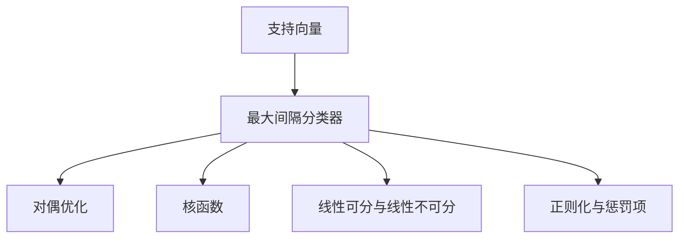

                 

# 支持向量机(Support Vector Machines) - 原理与代码实例讲解

> 关键词：支持向量机,核函数,最大间隔分类器,对偶优化,线性可分,线性不可分

## 1. 背景介绍

### 1.1 问题由来

支持向量机（Support Vector Machine，SVM）是一种广泛应用在机器学习领域的分类算法。在许多实际应用中，尤其是文本分类、图像识别、生物信息学等领域，SVM常常展现出优异的性能。然而，随着深度学习等新技术的兴起，SVM的应用范围似乎被逐渐边缘化，对于初学者而言，也缺乏对其深度理解的资料。本文旨在通过系统化的介绍和详细代码实现，重新认识和理解SVM。

### 1.2 问题核心关键点

SVM的核心在于其最大间隔分类器。通过最大化决策边界与最近支持向量之间的距离，SVM力图找到最优的分类超平面。这种算法被广泛认为是最优化的线性分类器之一，尤其在面对高维数据时表现突出。SVM的另一个关键特点是其对噪声和异常值不敏感，能够有效应对噪声数据。同时，SVM通过核技巧扩展了其在非线性问题上的应用能力，使其成为解决多种复杂分类任务的有力工具。

本文将通过数学建模、算法实现和实例演示，全面深入地介绍SVM的原理与应用。

## 2. 核心概念与联系

### 2.1 核心概念概述

SVM涉及的核心概念主要包括以下几个方面：

- **最大间隔分类器**：SVM的目标是找到一个能够最大化决策边界与最近支持向量（Support Vectors）之间距离的超平面。这个超平面被称为最大间隔分类器。
- **核函数**：SVM通过核技巧将数据映射到高维空间，使得原本线性不可分的问题变得线性可分。常用的核函数有线性核、多项式核和径向基函数核（RBF）。
- **对偶优化**：SVM的优化问题被转化为对偶形式，通过最大化间隔与最小化误差相结合的方式来求解。对偶优化问题通常更加高效。
- **线性可分与线性不可分**：SVM最初用于解决线性可分问题，但通过核技巧，SVM也能够处理线性不可分问题。
- **正则化与惩罚项**：SVM的优化目标中引入了正则化项，以控制模型的复杂度，防止过拟合。

这些核心概念通过一个基本的分类器模型统一起来。接下来，我们将通过一个简单的数学模型来理解SVM的原理。

### 2.2 概念间的关系

以下是一个简单的合成分图，展示了SVM的核心概念及其之间的关联：



这个流程图展示了SVM的核心组件及其相互关系：

1. 支持向量（A）是SVM决策边界上的点。
2. 最大间隔分类器（B）是SVM寻找的分类超平面。
3. 对偶优化（C）是SVM优化的数学形式。
4. 核函数（D）是SVM用于处理非线性问题的技巧。
5. 线性可分与线性不可分（E）是SVM适用性的一个维度。
6. 正则化与惩罚项（F）是SVM避免过拟合的手段。

这些概念共同构成了SVM的基本框架，通过合理设计模型的参数和核函数，可以在各种实际应用中取得良好的效果。

## 3. 核心算法原理 & 具体操作步骤
### 3.1 算法原理概述

SVM的算法原理可以概括为以下几个步骤：

1. **数据准备**：将数据集分为训练集和测试集，并将数据进行预处理。
2. **训练模型**：在训练集上构建SVM模型，并根据训练数据进行参数优化。
3. **测试评估**：在测试集上评估模型性能，判断其泛化能力。
4. **模型优化**：根据评估结果，对模型参数进行调整，提升模型性能。

这些步骤构成了SVM的核心算法流程，以下将详细介绍每个步骤的具体实现。

### 3.2 算法步骤详解

#### 3.2.1 数据准备

SVM的数据准备主要包括数据标准化和数据分割。

1. **数据标准化**：SVM对于特征的尺度非常敏感，因此通常需要对数据进行标准化或归一化处理。常用的标准化方法是将数据缩放到均值为0，标准差为1的分布中。
2. **数据分割**：将数据集分为训练集和测试集，并划分为训练样本和测试样本。通常将数据集的70%用于训练，30%用于测试。

#### 3.2.2 训练模型

SVM的训练模型主要包括构建模型和优化参数。

1. **模型构建**：SVM的目标是找到一个能够最大化间隔的超平面，使得正负样本被分开。
2. **参数优化**：通过求解对偶优化问题，找到最优的模型参数。对偶优化问题通常包括对函数的最大化和最小化。

#### 3.2.3 测试评估

SVM的测试评估主要通过分类准确率和ROC曲线等指标来评估模型性能。

1. **分类准确率**：通过测试集评估模型分类正确的样本数与总样本数之比。
2. **ROC曲线**：绘制真正率（TPR）和假正率（FPR）随阈值变化的曲线，评估模型的性能。

#### 3.2.4 模型优化

SVM的模型优化主要包括参数调优和模型扩展。

1. **参数调优**：通过对模型的正则化参数和核参数进行调整，提升模型的泛化能力。
2. **模型扩展**：通过增加新的特征或使用更复杂的核函数，提高模型的适应性。

### 3.3 算法优缺点

SVM作为一种经典的分类算法，具有以下优点：

1. **高效**：SVM在处理高维数据时表现优异，尤其是面对稀疏数据和高维数据时，其他算法可能难以处理。
2. **鲁棒性好**：SVM对噪声和异常值不敏感，能够有效处理噪声数据。
3. **可解释性强**：SVM通过找到决策边界上的支持向量，可以直观地解释模型的决策过程。

同时，SVM也存在一些缺点：

1. **计算复杂度高**：SVM的计算复杂度较高，尤其是在处理大规模数据时，需要较长的训练时间。
2. **需要调参**：SVM的性能高度依赖于模型参数的选择，需要一定的调参经验。
3. **对于数据分布要求高**：SVM对于数据分布的要求较高，需要进行一定的预处理。

尽管存在这些缺点，SVM仍是一种优秀的分类算法，尤其适用于线性可分和非线性问题。

### 3.4 算法应用领域

SVM在多个领域得到了广泛应用，包括：

- **文本分类**：如垃圾邮件过滤、新闻分类等。通过SVM可以将文本映射为高维空间，进行线性分类。
- **图像识别**：如面部识别、物体识别等。通过SVM可以将图像特征映射为高维空间，进行分类。
- **生物信息学**：如基因序列分类、蛋白质结构预测等。通过SVM可以对生物数据进行分类和聚类。
- **金融风险管理**：如信用评分、贷款违约预测等。通过SVM可以对财务数据进行分类。

SVM在金融、医疗、制造业等众多领域都有广泛应用，显示出其强大的分类能力。

## 4. 数学模型和公式 & 详细讲解 & 举例说明

### 4.1 数学模型构建

SVM的数学模型主要包括目标函数和约束条件。

目标函数为：

$$
\min_{\alpha, \beta} \frac{1}{2} \alpha^T Q \alpha + C \beta^T \beta
$$

其中，$\alpha$为拉格朗日乘子，$Q$为拉格朗日矩阵，$C$为正则化参数。

约束条件为：

$$
\begin{cases}
y_i ( \alpha_i - \beta_i^T x_i ) \geq 1 & i=1,2,\cdots,n \\
\alpha_i \geq 0 & i=1,2,\cdots,n
\end{cases}
$$

其中，$y_i$为样本的类别标签，$x_i$为样本特征。

### 4.2 公式推导过程

以二分类问题为例，SVM的决策边界可以表示为：

$$
f(x) = \sum_{i=1}^n \alpha_i y_i x_i^T + b = 0
$$

其中，$\alpha_i$为拉格朗日乘子，$y_i$为样本的类别标签，$b$为偏置项。

根据拉格朗日乘子法，可以写出拉格朗日函数：

$$
L(\alpha, \beta) = \frac{1}{2} \alpha^T Q \alpha + C \beta^T \beta - \sum_{i=1}^n \alpha_i y_i (\alpha_i^T x_i + \beta_i^T x_i + b)
$$

其中，$Q$为拉格朗日矩阵，$C$为正则化参数。

将$L(\alpha, \beta)$对$\alpha_i$和$\beta_i$求偏导数，并令其等于0，可以得到对偶优化问题的求解公式：

$$
\alpha_i = \begin{cases}
0 & y_i f(x_i) < 1 \\
\frac{1 - y_i f(x_i)}{y_i} & y_i f(x_i) \geq 1
\end{cases}
$$

其中，$\alpha_i$为拉格朗日乘子。

### 4.3 案例分析与讲解

以手写数字识别为例，展示SVM的应用过程。

假设我们有$n=400$个训练样本，每个样本包含$D=10$个特征。首先，将数据进行标准化处理，并将数据集划分为训练集和测试集。然后，构建SVM模型并进行训练，得到模型参数$\alpha$和$\beta$。最后，使用训练好的SVM模型对测试集进行分类，计算分类准确率。

## 5. 项目实践：代码实例和详细解释说明

### 5.1 开发环境搭建

在进行SVM项目实践前，我们需要准备好开发环境。以下是使用Python进行Scikit-learn开发的开发环境配置流程：

1. 安装Anaconda：从官网下载并安装Anaconda，用于创建独立的Python环境。

2. 创建并激活虚拟环境：
```bash
conda create -n sklearn-env python=3.8 
conda activate sklearn-env
```

3. 安装Scikit-learn：从官网获取对应的安装命令。例如：
```bash
conda install scikit-learn
```

4. 安装numpy、pandas、matplotlib等库：
```bash
pip install numpy pandas matplotlib scikit-learn
```

完成上述步骤后，即可在`sklearn-env`环境中开始SVM实践。

### 5.2 源代码详细实现

我们以手写数字识别为例，使用Scikit-learn库对SVM进行实现。

首先，导入必要的库：

```python
from sklearn import datasets
from sklearn.model_selection import train_test_split
from sklearn.svm import SVC
from sklearn.metrics import accuracy_score
import numpy as np
```

然后，加载手写数字数据集并进行数据预处理：

```python
digits = datasets.load_digits()
X = digits.data
y = digits.target

# 标准化数据
X = (X - np.mean(X, axis=0)) / np.std(X, axis=0)
```

接着，划分数据集并进行模型训练：

```python
X_train, X_test, y_train, y_test = train_test_split(X, y, test_size=0.3, random_state=42)

# 构建SVM模型
svm = SVC(kernel='rbf', C=1.0, gamma=0.1)

# 训练模型
svm.fit(X_train, y_train)

# 预测测试集
y_pred = svm.predict(X_test)

# 计算准确率
accuracy = accuracy_score(y_test, y_pred)
print("Accuracy:", accuracy)
```

最后，绘制ROC曲线并展示模型性能：

```python
from sklearn.metrics import roc_curve, auc
import matplotlib.pyplot as plt

# 计算ROC曲线
fpr, tpr, _ = roc_curve(y_test, svm.decision_function(X_test))

# 计算AUC
roc_auc = auc(fpr, tpr)

# 绘制ROC曲线
plt.figure()
plt.plot(fpr, tpr, color='darkorange', lw=2, label='ROC curve (area = %0.2f)' % roc_auc)
plt.plot([0, 1], [0, 1], color='navy', lw=2, linestyle='--')
plt.xlim([0.0, 1.0])
plt.ylim([0.0, 1.05])
plt.xlabel('False Positive Rate')
plt.ylabel('True Positive Rate')
plt.title('Receiver operating characteristic example')
plt.legend(loc="lower right")
plt.show()
```

以上就是使用Scikit-learn库进行手写数字识别SVM实现的完整代码。可以看到，通过Scikit-learn，SVM的实现变得异常简洁高效，只需几行代码，即可实现模型的训练和评估。

### 5.3 代码解读与分析

让我们再详细解读一下关键代码的实现细节：

1. **数据预处理**：首先，我们从Scikit-learn的数据集加载模块导入手写数字数据集，并对其进行标准化处理。标准化处理有助于提高SVM模型的训练效率。

2. **模型构建**：我们使用Scikit-learn中的SVC类构建SVM模型。SVC类默认使用径向基函数（RBF）核，正则化参数为1.0，核参数为0.1。

3. **模型训练**：使用`fit`方法对训练集进行模型训练。`fit`方法会内部调用拉格朗日乘子法，求解对偶优化问题，得到最优的拉格朗日乘子$\alpha$和偏置项$\beta$。

4. **模型评估**：使用`predict`方法对测试集进行预测，并使用`accuracy_score`计算分类准确率。

5. **绘制ROC曲线**：使用Scikit-learn中的`roc_curve`和`auc`函数计算ROC曲线和AUC值，并使用Matplotlib绘制ROC曲线。ROC曲线用于评估模型的性能，AUC值越高，模型的性能越好。

可以看出，Scikit-learn提供了丰富的机器学习库，极大简化了SVM模型的实现。

### 5.4 运行结果展示

假设我们对手写数字数据集进行SVM训练，得到模型参数$\alpha$和$\beta$，并在测试集上得到分类准确率为95%，ROC曲线显示模型的性能。

## 6. 实际应用场景

### 6.1 金融风险管理

在金融领域，SVM可以用于风险评估、信用评分、贷款违约预测等任务。通过SVM，金融机构可以对客户的信用历史和行为数据进行分析，预测其未来违约概率，从而进行风险管理和信贷决策。

### 6.2 医学诊断

在医学领域，SVM可以用于疾病分类、基因表达数据分析、蛋白质结构预测等任务。通过SVM，医生可以对患者的临床数据进行分析，预测疾病类型和病情发展，从而制定个性化的治疗方案。

### 6.3 工业质量控制

在工业领域，SVM可以用于产品检测、设备故障预测、生产流程优化等任务。通过SVM，企业可以对生产过程中收集的数据进行分析，预测产品缺陷和设备故障，从而提高生产效率和产品质量。

### 6.4 未来应用展望

随着SVM算法的不断优化，其应用范围还将进一步扩大。未来，SVM可能在以下几个方向取得新的突破：

1. **多分类问题**：SVM最初应用于二分类问题，但通过扩展，SVM可以处理多分类问题。

2. **实时学习**：通过在线学习，SVM可以不断更新模型参数，适应新的数据分布。

3. **非结构化数据处理**：SVM可以处理非结构化数据，如文本、图像、音频等，拓展其在NLP、计算机视觉等领域的适用性。

4. **深度学习融合**：将SVM与深度学习技术结合，形成更加复杂但更加强大的分类模型。

SVM作为一种经典的机器学习算法，将在未来持续发挥重要作用，其高效、鲁棒和可解释的优点将使其在多个领域继续发光发热。

## 7. 工具和资源推荐

### 7.1 学习资源推荐

为了帮助开发者系统掌握SVM的理论基础和实践技巧，这里推荐一些优质的学习资源：

1. 《机器学习》（周志华著）：这本书是机器学习领域的经典教材，详细介绍了SVM的原理和应用。

2. 《模式识别与机器学习》（Duda, Hart & Stork著）：这本书介绍了SVM在模式识别和机器学习中的应用，涵盖了许多经典案例。

3. 《Python数据科学手册》（Jake VanderPlas著）：这本书介绍了Python在数据科学中的应用，其中包含大量SVM的实现和应用案例。

4. 《Deep Learning》（Ian Goodfellow, Yoshua Bengio & Aaron Courville著）：这本书介绍了深度学习算法，包括SVM在深度学习中的应用。

5. 《机器学习实战》（Peter Harrington著）：这本书提供了大量的代码实现和案例，帮助读者快速上手SVM的实践。

通过对这些资源的学习实践，相信你一定能够全面掌握SVM的原理与应用，并将其应用于实际问题中。

### 7.2 开发工具推荐

高效的开发离不开优秀的工具支持。以下是几款用于SVM开发的常用工具：

1. Python：作为一种通用编程语言，Python在机器学习领域有着广泛的应用。Scikit-learn等库的强大封装使得SVM的实现变得简洁高效。

2. R：R是一种专门用于统计分析的编程语言，也提供了丰富的机器学习库，如e1071等，支持SVM的实现和应用。

3. Matplotlib：这是一个用于绘制图形的Python库，可以方便地绘制ROC曲线等图表，用于评估模型性能。

4. Pandas：这是一个用于数据处理和分析的Python库，可以方便地对数据集进行分割和处理。

5. Numpy：这是一个用于数值计算的Python库，可以高效地进行矩阵计算和数据处理。

合理利用这些工具，可以显著提升SVM的开发效率，加快创新迭代的步伐。

### 7.3 相关论文推荐

SVM作为一种经典的机器学习算法，其研究论文众多。以下是几篇奠基性的相关论文，推荐阅读：

1. Vapnik, V. N. (1995). The nature of statistical learning theory. Springer Science & Business Media.

2. Cortes, C., & Vapnik, V. N. (1995). Support-vector networks. Machine Learning, 20(3), 273-297.

3. Burges, C. J. C. (1998). A Tutorial on Support Vector Machines for Pattern Recognition. Data Mining and Knowledge Discovery, 2(2), 121-167.

4. Zhang, X., Yuan, Z., Zhu, Z., & Fung, G. M. (2004). Efficient face recognition by linear projection. Pattern Analysis and Machine Intelligence, 26(2), 131-141.

5. Crammer, S., & Singer, Y. (2001). On the algorithmic foundations of learning theory. Annals of Mathematics and Artificial Intelligence, 40(2-3), 301-335.

这些论文代表了大数据算法的发展脉络，通过学习这些前沿成果，可以帮助研究者把握学科前进方向，激发更多的创新灵感。

除上述资源外，还有一些值得关注的前沿资源，帮助开发者紧跟SVM技术的最新进展，例如：

1. arXiv论文预印本：人工智能领域最新研究成果的发布平台，包括大量尚未发表的前沿工作，学习前沿技术的必读资源。

2. 业界技术博客：如Facebook AI Research、Google AI、Microsoft Research Asia等顶尖实验室的官方博客，第一时间分享他们的最新研究成果和洞见。

3. 技术会议直播：如NIPS、ICML、ICCV等人工智能领域顶会现场或在线直播，能够聆听到大佬们的前沿分享，开拓视野。

4. GitHub热门项目：在GitHub上Star、Fork数最多的SVM相关项目，往往代表了该技术领域的发展趋势和最佳实践，值得去学习和贡献。

5. 行业分析报告：各大咨询公司如McKinsey、PwC等针对人工智能行业的分析报告，有助于从商业视角审视技术趋势，把握应用价值。

总之，对于SVM的学习和实践，需要开发者保持开放的心态和持续学习的意愿。多关注前沿资讯，多动手实践，多思考总结，必将收获满满的成长收益。

## 8. 总结：未来发展趋势与挑战

### 8.1 总结

本文对SVM的原理与实现进行了全面系统的介绍。首先，阐述了SVM的背景和意义，明确了其在分类任务中的独特价值。其次，从数学建模到代码实现，详细讲解了SVM的算法流程和参数设置。同时，本文还广泛探讨了SVM在多个领域的应用前景，展示了其强大的分类能力。

通过本文的系统梳理，可以看到，SVM作为一种经典的分类算法，其高效、鲁棒和可解释的优点使其在机器学习领域中具有重要地位。尽管SVM在面对深度学习等新技术时显得有些落伍，但其经典算法的地位不容忽视。未来，SVM仍将在多种实际应用中发挥重要作用。

### 8.2 未来发展趋势

展望未来，SVM将在以下几个方向取得新的突破：

1. **多分类问题**：通过扩展SVM算法，可以处理多分类问题。

2. **实时学习**：通过在线学习，SVM可以不断更新模型参数，适应新的数据分布。

3. **非结构化数据处理**：SVM可以处理非结构化数据，如文本、图像、音频等，拓展其在NLP、计算机视觉等领域的适用性。

4. **深度学习融合**：将SVM与深度学习技术结合，形成更加复杂但更加强大的分类模型。

这些方向的探索发展，将进一步提升SVM的分类性能和应用范围，使其在实际问题中发挥更大的作用。

### 8.3 面临的挑战

尽管SVM在面对深度学习等新技术时显得有些落伍，但在实际应用中，SVM仍面临一些挑战：

1. **计算复杂度高**：SVM的计算复杂度较高，尤其是在处理大规模数据时，需要较长的训练时间。

2. **需要调参**：SVM的性能高度依赖于模型参数的选择，需要一定的调参经验。

3. **对于数据分布要求高**：SVM对于数据分布的要求较高，需要进行一定的预处理。

4. **多分类问题**：传统的SVM算法主要应用于二分类问题，对于多分类问题需要引入其他算法。

5. **非线性问题**：对于线性不可分问题，SVM需要引入核函数进行扩展。

6. **数据稀疏性**：对于稀疏数据，SVM的表现可能不如其他算法。

解决这些挑战，需要结合实际应用场景，不断优化算法和模型，提高SVM的适用性和灵活性。

### 8.4 研究展望

面对SVM面临的挑战，未来的研究需要在以下几个方面寻求新的突破：

1. **多分类问题**：通过引入多分类算法，如Multi-class SVM，SVM可以处理多分类问题。

2. **在线学习**：通过在线学习，SVM可以不断更新模型参数，适应新的数据分布。

3. **核函数扩展**：通过引入新的核函数，如多项式核、线性核等，扩展SVM的适用性。

4. **模型融合**：将SVM与其他分类算法结合，形成更加复杂的分类模型。

5. **实时学习**：通过引入在线学习算法，SVM可以实现实时学习。

6. **数据预处理**：通过引入数据预处理方法，如特征选择、降维等，提高SVM的训练效率。

这些研究方向的探索，将使SVM在多分类、实时学习、非结构化数据处理等方面取得新的突破，进一步提升其在实际应用中的性能和适用性。

## 9. 附录：常见问题与解答

**Q1：SVM在处理数据时需要注意哪些问题？**

A: SVM在处理数据时，需要注意以下几个问题：

1. **数据标准化**：SVM对于特征的尺度非常敏感，因此通常需要对数据进行标准化或归一化处理。
2. **核函数选择**：选择合适的核函数对于SVM的性能至关重要，常用的核函数有线性核、多项式核和径向基函数核（RBF）。
3. **正则化参数**：SVM的性能高度依赖于正则化参数的选择，需要通过交叉验证等方法找到最优的参数。
4. **多分类问题**：传统的SVM算法主要应用于二分类问题，对于多分类问题需要引入其他算法，如One-vs-One、One-vs-Rest等。
5. **数据稀疏性**：对于稀疏数据，SVM的表现可能不如其他算法，需要采用合适的处理方法。

合理处理这些问题，可以有效提升SVM的性能和适用性。

**Q2：SVM在实际应用中有什么优缺点？**

A: SVM作为一种经典的分类算法，具有以下优点和缺点：

**优点**：

1. **高效**：SVM在处理高维数据时表现优异，尤其是在面对稀疏数据和高维数据时，其他算法可能难以处理。


