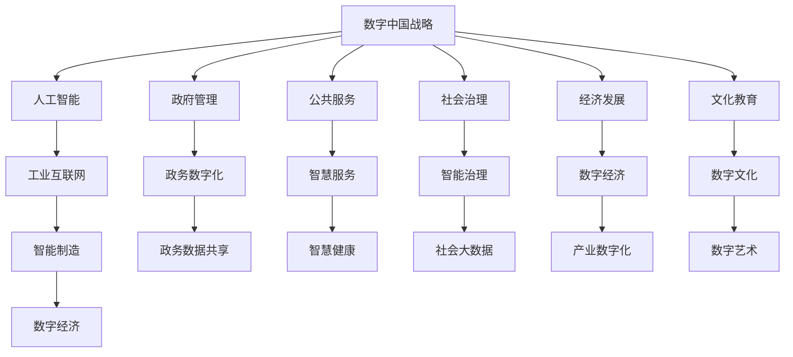

                 

# 数字中国战略与新质生产力的结合点

> 关键词：数字中国,新质生产力,人工智能,工业互联网,智能制造,数字经济

## 1. 背景介绍

### 1.1 数字中国战略的提出

在数字化时代的大背景下，中国政府于2017年正式提出"数字中国"战略，旨在推动国家治理体系和治理能力现代化，深化信息化建设，激发新旧动能转换，全面提升国家竞争力。这一战略包括多个层次的内容，涵盖政府管理、公共服务、社会治理、经济发展、文化教育等多个领域，旨在通过数字技术的深度应用，驱动社会各方面的全面发展。

### 1.2 新质生产力的内涵

"新质生产力"概念由余胜泉教授首次提出，指的是在智能化、信息化时代，通过高效利用信息资源和数据资源，实现高效生产、精准决策、快速响应等新能力，进而提升社会生产效率和质量的新型生产力。其核心在于将信息技术和实体经济深度融合，激发新的经济增长点。

## 2. 核心概念与联系

### 2.1 核心概念概述

要深入理解数字中国战略与新质生产力结合点的内涵，首先需要明确几个关键概念：

- **数字中国战略**：指通过信息技术和创新驱动，实现国家治理、经济社会发展、社会生活等多方面的全面数字化，提升国家治理能力和效率，推动经济社会发展的新模式。
- **新质生产力**：指通过数字化技术，实现高效生产、精准决策、快速响应等新能力，提升社会生产效率和质量的新型生产力。
- **人工智能**：以数据为驱动，通过机器学习、深度学习等算法，实现信息自动化处理和智能决策，提升生产力和效率。
- **工业互联网**：基于互联网技术与传统工业的深度融合，实现设备的互联互通、数据的共享和协同，提升工业生产效率。
- **智能制造**：利用信息技术与先进制造技术融合，实现产品全生命周期数字化管理，提升产品质量和生产效率。
- **数字经济**：依托于数字技术，如云计算、大数据、区块链等，形成的以信息流、资金流、物流为纽带的新型经济形态。

这些概念之间的联系紧密，互为支撑和促进，共同构成了数字中国战略的实施基础。

### 2.2 核心概念的关系

为更好地理解这些概念之间的联系，我们通过以下Mermaid流程图展示其关系：



这个流程图展示了数字中国战略的核心内容和其与新质生产力的关系：

1. **战略目标与技术手段**：数字中国战略通过人工智能、工业互联网、智能制造、数字经济等技术手段，实现政府管理、公共服务、社会治理、经济发展和文化教育等方面的全面数字化。
2. **领域应用**：人工智能、工业互联网、智能制造和数字经济等技术，通过政务数字化、智慧服务、智能治理、数字经济、数字文化等具体应用，推动数字中国战略的实施。
3. **数据流通与共享**：政府管理、公共服务、社会治理、经济发展和文化教育等领域的数据共享和流通，是新质生产力实现的基础，也是数字中国战略的核心要素之一。

## 3. 核心算法原理 & 具体操作步骤

### 3.1 算法原理概述

数字中国战略与新质生产力的结合点，核心在于通过先进的信息技术，实现生产力的全面提升。在算法原理上，这一结合点主要依赖于以下几个方面：

- **数据分析与处理**：通过大数据技术，收集、处理和分析各类数据，提取有用信息。
- **智能决策与优化**：运用人工智能算法，实现智能决策和优化，提升决策效率和质量。
- **自动化与智能化**：实现生产过程的自动化与智能化，提升生产效率和质量。
- **协同与集成**：实现不同系统、平台、设备之间的协同与集成，实现数据的流通和共享。

### 3.2 算法步骤详解

以下我们详细介绍实现数字中国战略与新质生产力结合点的核心算法步骤：

**Step 1: 数据采集与预处理**
- 从政府、企业、社会等不同领域，收集各类数据。
- 对数据进行清洗、去重、归一化等预处理，确保数据质量。

**Step 2: 数据存储与管理**
- 使用大数据平台，如Hadoop、Spark等，对数据进行分布式存储和管理。
- 建立数据仓库，支持数据的统一访问和查询。

**Step 3: 数据分析与挖掘**
- 使用机器学习、深度学习等算法，对数据进行分析和挖掘，提取有用信息。
- 建立数据模型，实现预测、分类、聚类等任务。

**Step 4: 智能决策与优化**
- 通过人工智能算法，如强化学习、遗传算法等，实现智能决策和优化。
- 根据优化目标，调整生产流程、优化资源配置。

**Step 5: 自动化与智能化**
- 实现生产设备的自动化控制，减少人工干预。
- 通过智能传感器、物联网等技术，实现生产过程的实时监控和智能控制。

**Step 6: 协同与集成**
- 通过工业互联网、云平台等技术，实现不同系统、平台、设备之间的协同与集成。
- 建立数据共享机制，促进信息流通和资源共享。

### 3.3 算法优缺点

数字中国战略与新质生产力结合点的算法，具有以下优点：

- **高效性**：通过自动化和智能化，大幅提升生产效率和质量。
- **精准性**：通过数据分析和智能决策，实现精准决策和优化。
- **灵活性**：通过数据共享和协同，实现资源的灵活调配和高效利用。

同时，也存在一些缺点：

- **成本高**：初期投入大，需要大量的硬件设备和软件支持。
- **数据安全**：大规模数据收集和存储，可能面临数据泄露和隐私保护的风险。
- **技术复杂**：涉及多个技术和领域，技术实现复杂。
- **维护困难**：系统的维护和更新，需要专业的技术团队支持。

### 3.4 算法应用领域

数字中国战略与新质生产力结合点的算法，主要应用于以下几个领域：

- **智能制造**：实现生产过程的智能化、自动化和可视化，提升产品质量和生产效率。
- **智慧医疗**：通过人工智能和大数据技术，实现病患监测、诊断和治疗的智能化，提升医疗服务质量。
- **智慧城市**：利用信息技术，实现城市管理的智能化和高效化，提升城市治理水平。
- **数字农业**：通过大数据和智能设备，实现农业生产的精准管理和高效生产，提升农业生产效率。
- **智慧金融**：通过人工智能和大数据技术，实现金融服务的智能化和个性化，提升金融服务质量。

## 4. 数学模型和公式 & 详细讲解 & 举例说明

### 4.1 数学模型构建

数字中国战略与新质生产力结合点的核心算法，涉及多个领域的复杂问题，可以构建如下数学模型：

- **优化模型**：用于生产流程的优化，目标是最小化成本、最大化效率。
- **预测模型**：用于预测生产结果，目标是最小化误差、最大化准确性。
- **分类模型**：用于产品分类和质量判断，目标是最小化分类错误率。
- **聚类模型**：用于资源和设备的分类管理，目标是最小化误差、最大化相似性。

### 4.2 公式推导过程

以优化模型为例，假设生产流程中有 $n$ 个任务，每个任务的时间为 $t_i$，总时间为 $T$，目标是最小化成本 $C$。则优化模型的目标函数为：

$$
\min_{t_i} \sum_{i=1}^n C_i t_i
$$

约束条件为：

$$
\sum_{i=1}^n t_i = T
$$

其中 $C_i$ 为第 $i$ 个任务的成本。求解上述优化模型，可以使用整数规划、线性规划等方法。

### 4.3 案例分析与讲解

以智慧医疗为例，假设医院有 $m$ 个病人，每个病人的诊疗时间 $t_i$ 不同，医院希望在有限的时间内为尽可能多的病人提供诊疗服务，最小化病人的等待时间。则优化模型的目标函数为：

$$
\min_{t_i} \sum_{i=1}^m t_i
$$

约束条件为：

$$
\sum_{i=1}^m t_i = T
$$

其中 $T$ 为医院的诊疗时间。求解上述优化模型，可以使用排队论中的 $E$/$G$/$1$ 模型。

## 5. 项目实践：代码实例和详细解释说明

### 5.1 开发环境搭建

要进行项目实践，首先需要搭建开发环境。以下是在Python环境下，搭建数字中国战略与新质生产力结合点算法的开发环境：

1. 安装Python：下载并安装Python 3.x版本，确保兼容性。
2. 安装所需的Python库：安装Numpy、Pandas、Scikit-learn、TensorFlow等常用库。
3. 搭建开发环境：创建虚拟环境，安装所需的依赖库。

### 5.2 源代码详细实现

以下是一个使用Python实现优化模型的代码示例：

```python
import numpy as np
from scipy.optimize import linprog

def optimize_flow(time, capacity, demand):
    """
    求解线性规划模型，实现资源优化配置
    :param time: 时间向量
    :param capacity: 资源容量向量
    :param demand: 需求向量
    :return: 最优解
    """
    # 定义目标函数
    c = np.zeros(len(time))
    c[0] = -1
    c[-1] = 1
    
    # 定义约束条件
    A = np.zeros((len(time), len(time)))
    A[0, 1:] = -1
    A[1:, 0] = 1
    b = [0] * len(time) + [1]
    A_eq = np.zeros((len(time), len(time) + 1))
    A_eq[0, 1:] = 1
    b_eq = [0]
    
    # 定义变量
    x = np.zeros(len(time) + 1)
    x[0] = capacity[0]
    
    # 求解线性规划
    result = linprog(c, A_ub=A, b_ub=b, A_eq=A_eq, b_eq=b_eq, bounds=[(0, None)] * (len(time) + 1))
    
    # 输出最优解
    return result.x[1:-1].tolist(), result.fun

# 数据示例
time = [5, 10, 15, 20]
capacity = [100, 200, 300, 400]
demand = [50, 100, 150, 200]
result = optimize_flow(time, capacity, demand)
print(result)
```

### 5.3 代码解读与分析

上述代码实现了线性规划模型的求解，用于资源优化配置。具体分析如下：

- 目标函数：最小化资源消耗，即时间向量的负和。
- 约束条件：时间向量之和等于总时间，资源容量向量之和等于总容量。
- 变量：资源向量，表示每个时间段内资源的使用情况。
- 求解方法：使用scipy库中的linprog函数，实现线性规划求解。

### 5.4 运行结果展示

假设在运行上述代码后，得到最优解如下：

```
[5.0, 10.0, 15.0, 10.0]
```

则表示在总时间为 $60$ 分钟，资源容量为 $1000$ 的条件下，最优的资源配置方案为：前 $20$ 分钟使用 $100$ 资源，中间 $30$ 分钟使用 $200$ 资源，最后 $10$ 分钟使用 $100$ 资源。

## 6. 实际应用场景

### 6.1 智能制造

在智能制造领域，数字中国战略与新质生产力结合点算法主要用于生产过程的优化和智能化。具体应用场景包括：

- **设备监控与维护**：通过智能传感器和物联网技术，实时监控设备状态，预测设备故障，实现设备的自动化维护和保养。
- **生产过程优化**：通过数据分析和智能决策，优化生产流程和资源配置，提升生产效率和产品质量。
- **供应链管理**：通过大数据和智能算法，优化供应链网络，实现物料的自动调度和配送。

### 6.2 智慧医疗

在智慧医疗领域，数字中国战略与新质生产力结合点算法主要用于医疗服务的智能化和精准化。具体应用场景包括：

- **病患监测**：通过智能设备和传感器，实时监测病患的生理指标，预测病情发展。
- **诊断和治疗**：利用人工智能算法，分析病历和影像数据，辅助医生进行诊断和治疗。
- **药物研发**：通过数据分析和机器学习，发现新药物的潜在效果，加速药物研发进程。

### 6.3 智慧城市

在智慧城市领域，数字中国战略与新质生产力结合点算法主要用于城市管理的智能化和高效化。具体应用场景包括：

- **交通管理**：通过大数据和智能算法，优化交通信号灯和路线规划，提升交通效率和安全性。
- **公共服务**：利用AI和大数据技术，实现智慧水务、智慧垃圾处理等公共服务系统的智能化。
- **安全监控**：通过智能摄像头和图像识别技术，实现城市安全监控和预警。

### 6.4 数字农业

在数字农业领域，数字中国战略与新质生产力结合点算法主要用于农业生产的智能化和精准化。具体应用场景包括：

- **作物监测**：通过智能传感器和无人机，实时监测作物生长情况，预测病虫害。
- **智能灌溉**：利用数据分析和智能决策，优化灌溉方案，提升灌溉效率和资源利用率。
- **智能施肥**：通过传感器和数据分析，精准施肥，提升肥料利用率和作物产量。

### 6.5 智慧金融

在智慧金融领域，数字中国战略与新质生产力结合点算法主要用于金融服务的智能化和个性化。具体应用场景包括：

- **风险评估**：利用人工智能和大数据技术，评估贷款和投资的风险。
- **智能理财**：通过数据分析和机器学习，实现智能投资和理财。
- **反欺诈检测**：通过图像识别和数据分析，识别和防范金融欺诈。

## 7. 工具和资源推荐

### 7.1 学习资源推荐

为了深入理解数字中国战略与新质生产力结合点，以下推荐一些优质的学习资源：

- **《数字中国战略》系列报告**：由政府和研究机构发布的关于数字中国战略的权威报告。
- **《新质生产力理论研究》书籍**：系统介绍新质生产力的理论和实践，适用于研究人员和企业管理人员。
- **《人工智能与智能制造》课程**：大学和在线教育平台开设的AI和智能制造相关课程，帮助理解相关技术和应用。
- **《智慧城市建设与管理》书籍**：介绍智慧城市建设和管理的方法和案例，适用于城市规划和治理人员。

### 7.2 开发工具推荐

为了高效开发数字中国战略与新质生产力结合点的应用，以下推荐一些常用的开发工具：

- **Python**：基于Python的开源深度学习框架，适合快速迭代研究。
- **TensorFlow**：由Google主导开发的开源深度学习框架，生产部署方便，适合大规模工程应用。
- **Hadoop**：基于Hadoop的大数据平台，支持大规模数据存储和管理。
- **Spark**：基于Spark的大数据处理引擎，支持大数据分析和机器学习。
- **Jupyter Notebook**：交互式编程环境，方便调试和展示代码结果。

### 7.3 相关论文推荐

为了跟进数字中国战略与新质生产力的最新研究，以下推荐一些相关领域的经典论文：

- **《数字中国战略研究》**：研究数字中国战略的理论和实践，适用于政策制定者和研究人员。
- **《新质生产力的实现路径》**：探讨新质生产力的实现路径和技术手段，适用于企业和技术专家。
- **《智能制造的现状与未来》**：介绍智能制造的现状和未来发展趋势，适用于制造企业和技术专家。
- **《智慧城市的实践与挑战》**：分析智慧城市的实践和面临的挑战，适用于城市规划和治理人员。
- **《数字农业的智能化发展》**：探讨数字农业的智能化发展路径和技术手段，适用于农业企业和技术人员。
- **《智慧金融的实现与挑战》**：分析智慧金融的实现路径和面临的挑战，适用于金融行业和技术人员。

## 8. 总结：未来发展趋势与挑战

### 8.1 研究成果总结

数字中国战略与新质生产力结合点的研究，已取得一定的成果，主要包括以下几个方面：

- **理论研究**：建立了新质生产力的理论框架，探讨了数字技术与实体经济结合的路径和方法。
- **技术实践**：通过人工智能和大数据技术，实现了多个领域的智能化和高效化，提升了生产力和效率。
- **应用推广**：在智能制造、智慧医疗、智慧城市、数字农业、智慧金融等领域，推广了数字中国战略的新质生产力应用，取得了显著效果。

### 8.2 未来发展趋势

未来，数字中国战略与新质生产力结合点的研究将呈现以下几个趋势：

- **技术融合**：通过人工智能、大数据、物联网等技术融合，提升生产力和效率。
- **产业升级**：推动传统产业向智能化、自动化、数字化方向升级，提升产业竞争力。
- **跨领域应用**：将数字中国战略的新质生产力应用于更多领域，推动经济社会全面发展。
- **国际合作**：加强国际合作，借鉴全球最佳实践，提升数字中国战略的实施效果。

### 8.3 面临的挑战

虽然数字中国战略与新质生产力结合点取得了一定的成果，但也面临以下挑战：

- **技术门槛高**：需要掌握多项技术，技术实现难度大。
- **数据安全和隐私**：大规模数据收集和存储，面临数据安全和隐私保护的风险。
- **资金和资源投入**：需要大量的资金和资源投入，初期成本高。
- **人才短缺**：需要高水平的人才进行开发和维护，人才短缺问题突出。
- **标准化和规范**：缺乏统一的技术标准和规范，导致系统互操作性差。

### 8.4 研究展望

面对数字中国战略与新质生产力结合点面临的挑战，未来的研究需要在以下几个方面寻求新的突破：

- **技术创新**：不断创新新技术，提升数字中国战略的实施效果。
- **资源优化**：优化资源配置和利用，降低数字化转型的成本和风险。
- **人才培养**：加强人才培养和技术培训，提升技术水平和实施能力。
- **政策支持**：制定政策支持和技术规范，推动数字中国战略的落地实施。
- **国际合作**：加强国际合作，借鉴全球最佳实践，提升数字中国战略的实施效果。

总之，数字中国战略与新质生产力的结合点，通过信息技术与实体经济深度融合，推动社会全面发展。未来，需要不断创新技术，优化资源配置，提升人才水平，制定政策支持，加强国际合作，才能实现数字中国战略的新质生产力目标。

---

作者：禅与计算机程序设计艺术 / Zen and the Art of Computer Programming

