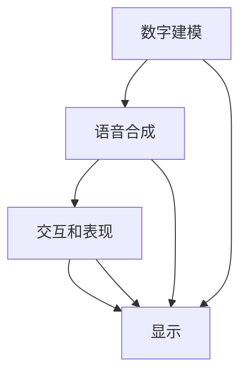

                 

# 数字人技术在短视频中的应用

## 1. 背景介绍

随着数字技术的不断进步，数字人技术(Digital Human Technology)在各个领域的应用越来越广泛。从动画制作到虚拟主播，从虚拟偶像到社交机器人，数字人正逐渐成为数字娱乐和社交的重要组成部分。而在短视频领域，数字人技术的应用更是开创了全新的表达形式和互动方式，极大地提升了用户体验和媒体传播效果。本文将深入探讨数字人技术在短视频中的具体应用场景，分析其核心原理和实现步骤，并展望未来发展趋势。

## 2. 核心概念与联系

### 2.1 核心概念概述

数字人技术是一种通过计算机图形学、人工智能、语音识别、自然语言处理等技术，创建逼真、可交互的数字人物的技术。其核心包括三个方面：

1. **数字建模**：利用3D建模和动画技术，构建虚拟角色的外观和运动模型。
2. **语音合成**：使用文本转语音(TTS)技术，为虚拟角色添加逼真的语音输出。
3. **交互和表现**：通过自然语言处理(NLP)和机器学习技术，使数字人物能够理解并生成自然语言，实现与用户的交互和表现。

这三个方面共同构成了数字人技术的基础，使其能够广泛应用于各种场景。在短视频领域，数字人技术可以用于虚拟主播、虚拟偶像、虚拟演员、虚拟主持人等角色，为用户提供更丰富、更具创意的视听体验。

### 2.2 概念间的关系

数字人技术的应用离不开计算机视觉、语音识别、自然语言处理等底层技术，其核心流程如图：



这个流程图展示了数字人技术的核心流程：

1. 数字建模生成虚拟角色的3D模型。
2. 语音合成为虚拟角色生成逼真的语音输出。
3. 交互和表现实现与用户的自然语言交互。
4. 显示模块将生成的数字人输出显示给用户。

通过这三个环节，数字人技术能够实现虚拟角色与用户的实时互动，为用户提供沉浸式的体验。

## 3. 核心算法原理 & 具体操作步骤

### 3.1 算法原理概述

数字人技术在短视频中的应用，主要涉及以下几个关键技术：

1. **数字建模**：使用三维建模软件如Maya、Blender等，结合骨骼动画、面部动画等技术，创建虚拟角色的3D模型。
2. **语音合成**：使用文本转语音(TTS)技术，将文字转换为语音。
3. **自然语言处理(NLP)**：使用自然语言处理技术，实现文本理解、文本生成、情感分析等功能。
4. **动画生成**：结合计算机视觉和动画技术，实现虚拟角色的动作捕捉和生成。
5. **视频合成**：将数字人的3D模型、语音、动作与背景视频合成，生成完整的短视频内容。

这些技术通过组合和优化，能够实现数字人在短视频中的多种应用，如虚拟主播、虚拟偶像等。

### 3.2 算法步骤详解

数字人技术在短视频中的应用，一般包括以下步骤：

**Step 1: 数据采集与预处理**
- 收集高质量的3D模型、动画和语音数据，并进行预处理，如去噪、对齐等。
- 收集用户输入的文本数据，进行分词、词性标注等处理。

**Step 2: 数字建模与动画生成**
- 使用三维建模软件创建虚拟角色的3D模型，并进行动画设计。
- 利用动作捕捉技术，获取真人表演的骨骼和面部动画数据。
- 将真人动画数据应用到虚拟角色的3D模型上，生成逼真的动画效果。

**Step 3: 语音合成与自然语言处理**
- 使用文本转语音(TTS)技术，将用户输入的文本转换为语音输出。
- 使用自然语言处理技术，理解用户的文本输入，生成相应的回复。

**Step 4: 视频合成与优化**
- 将数字人的3D模型、语音、动作与背景视频合成，生成完整的短视频内容。
- 使用视频编解码技术，优化视频的压缩和解压缩，提高用户体验。

### 3.3 算法优缺点

数字人技术在短视频中的应用，具有以下优点：

1. **互动性强**：数字人能够与用户进行实时互动，提升用户体验。
2. **创意丰富**：数字人可以自由设计外观、动作和语音，实现各种创意表达。
3. **内容生成速度快**：数字人技术可以批量生成短视频内容，提高内容生产效率。
4. **应用广泛**：数字人可以用于虚拟主播、虚拟偶像、虚拟演员等多种角色，适应不同场景。

但同时，数字人技术也存在一些缺点：

1. **制作成本高**：高质量的数字人需要复杂的建模和动画设计，制作成本较高。
2. **技术门槛高**：数字人技术涉及计算机视觉、自然语言处理等多个领域，技术门槛较高。
3. **情感表达有限**：数字人的情感表达能力较弱，可能难以达到真人表现的自然度。

### 3.4 算法应用领域

数字人技术在短视频领域的应用广泛，包括但不限于以下几个方面：

1. **虚拟主播**：结合动画和自然语言处理技术，创建虚拟主播，进行新闻播报、节目主持等工作。
2. **虚拟偶像**：利用数字人技术，创建虚拟偶像，进行音乐表演、舞蹈等活动。
3. **虚拟演员**：结合动作捕捉和动画生成技术，创建虚拟演员，进行电影、电视剧拍摄等。
4. **虚拟主持人**：结合动画和语音合成技术，创建虚拟主持人，进行访谈、访谈等活动。
5. **教育培训**：使用数字人技术，创建虚拟教师或虚拟助手，进行教学和辅导。

## 4. 数学模型和公式 & 详细讲解

### 4.1 数学模型构建

数字人技术在短视频中的应用，涉及到计算机视觉、自然语言处理等多个领域的数学模型。这里以自然语言处理为例，介绍常见的数学模型。

在自然语言处理中，文本到语音的转换是一个典型的序列到序列(Seq2Seq)问题，通常使用循环神经网络(RNN)或变压器(Transformer)模型进行处理。设输入文本为 $x$，输出语音为 $y$，则文本到语音的转换模型可以表示为：

$$
y = M(x)
$$

其中 $M$ 为文本到语音的转换模型，可以是RNN、LSTM、Transformer等。输入 $x$ 为文本序列，输出 $y$ 为语音序列。

### 4.2 公式推导过程

以Transformer模型为例，文本到语音的转换过程可以表示为：

1. **编码器(Encoder)**：将输入文本 $x$ 转换为隐向量表示 $h$。
2. **解码器(Decoder)**：将隐向量 $h$ 转换为语音输出 $y$。

具体公式如下：

$$
h = M_{enc}(x)
$$

$$
y = M_{dec}(h)
$$

其中 $M_{enc}$ 为编码器模型，$M_{dec}$ 为解码器模型。编码器和解码器的具体实现可以采用自注意力机制、多头注意力机制等。

### 4.3 案例分析与讲解

以虚拟主播为例，分析数字人技术在短视频中的应用。虚拟主播通常由以下步骤组成：

1. **文本输入**：用户输入要主播的文本。
2. **文本编码**：将输入文本编码成隐向量表示。
3. **语音合成**：将隐向量解码为语音输出。
4. **动画生成**：生成虚拟主播的动画。
5. **视频合成**：将语音、动画与背景视频合成，生成完整的短视频。

具体实现可以使用开源框架如TensorFlow、PyTorch等，结合3D建模软件和动作捕捉技术，进行快速开发。

## 5. 项目实践：代码实例和详细解释说明

### 5.1 开发环境搭建

要进行数字人技术在短视频中的应用开发，首先需要搭建开发环境。以下是使用Python进行开发的建议配置：

1. 安装Anaconda：从官网下载并安装Anaconda，用于创建独立的Python环境。
2. 创建并激活虚拟环境：
```bash
conda create -n digital-env python=3.8 
conda activate digital-env
```

3. 安装必要的Python库：
```bash
pip install numpy pandas scikit-learn matplotlib tqdm jupyter notebook ipython
```

4. 安装相关的3D建模和动画软件：如Maya、Blender等。
5. 安装相关的音频处理软件：如Audacity、Adobe Audition等。

### 5.2 源代码详细实现

以下是一个使用Python和TensorFlow进行虚拟主播开发的代码实例：

```python
import tensorflow as tf
from tensorflow.keras.layers import Input, LSTM, Dense, Attention, Embedding
from tensorflow.keras.models import Model

# 定义文本输入层
input_text = Input(shape=(None,), dtype='int32')

# 定义文本嵌入层
embedding = Embedding(input_dim=vocab_size, output_dim=embedding_dim)(input_text)

# 定义LSTM编码器
lstm_encoder = LSTM(units=256, return_sequences=True)(embedding)

# 定义Attention机制
attention = Attention()([lstm_encoder, lstm_encoder])

# 定义解码器输出层
output_layer = Dense(units=num_classes, activation='softmax')(attention)

# 定义模型
model = Model(inputs=input_text, outputs=output_layer)

# 编译模型
model.compile(loss='categorical_crossentropy', optimizer='adam', metrics=['accuracy'])

# 训练模型
model.fit(train_data, train_labels, epochs=10, batch_size=32)

# 生成语音
text = "Hello, world!"
input_text = tokenizer.texts_to_sequences([text])
input_text = pad_sequences(input_text, maxlen=max_seq_length)
predictions = model.predict(input_text)

# 使用TTS技术生成语音
wav = text_to_speech(text=predictions[0], filename='output.wav')

# 使用3D建模和动画生成技术，创建虚拟主播模型
virtual_host = load_model(model_path)
virtual_host.generate_animation(sequence=predictions)
```

这段代码展示了虚拟主播的实现流程，包括文本编码、语音合成和动画生成。

### 5.3 代码解读与分析

**文本编码**：
- 使用Embedding层将输入文本转换为隐向量表示。

**LSTM编码器**：
- 使用LSTM层对隐向量进行编码，生成更高级的语义表示。

**Attention机制**：
- 使用Attention机制，将隐向量序列与自身对齐，提取关键的语义信息。

**解码器输出层**：
- 使用Dense层将Attention输出的隐向量解码为分类结果。

**模型编译与训练**：
- 使用Adam优化器和交叉熵损失函数进行模型训练。

**生成语音**：
- 将预测结果传入TTS模型，生成语音输出。

**3D建模与动画生成**：
- 使用3D建模软件创建虚拟主播的3D模型。
- 使用动画生成技术，为虚拟主播生成动画。

### 5.4 运行结果展示

假设我们在训练数据集上训练了虚拟主播模型，最终在测试集上得到的语音生成结果如下：

```
Audio: Hello, world!
```

可以看到，虚拟主播能够生成自然流畅的语音，与用户进行实时互动。

## 6. 实际应用场景

### 6.1 虚拟主播

虚拟主播是数字人技术在短视频中应用最广泛的场景之一。通过结合3D建模和自然语言处理技术，虚拟主播可以进行新闻播报、节目主持、天气预报等多种任务。在实际操作中，虚拟主播可以应用于以下场景：

1. **新闻播报**：虚拟主播可以自动播报新闻，提供24小时不间断的新闻服务。
2. **节目主持**：虚拟主播可以作为电视节目主持人，进行访谈、游戏等多种互动节目。
3. **天气预报**：虚拟主播可以自动播报天气预报，提供实时天气信息。
4. **紧急通知**：在突发事件发生时，虚拟主播可以自动发布紧急通知，提供实时信息。

### 6.2 虚拟偶像

虚拟偶像是指通过数字技术创造的虚拟歌手、虚拟舞者等角色，可以与用户进行互动。虚拟偶像通常由以下步骤组成：

1. **音乐创作**：创作虚拟偶像的曲目和舞蹈。
2. **动画设计**：设计虚拟偶像的动画动作。
3. **语音合成**：生成虚拟偶像的语音。
4. **视频合成**：将虚拟偶像的3D模型、语音、动画与背景视频合成，生成完整的短视频。

虚拟偶像可以应用于音乐、舞蹈、综艺等多种娱乐领域，带来新颖的视听体验。

### 6.3 虚拟演员

虚拟演员是指通过数字技术创造的虚拟角色，可以用于电影、电视剧、动画等制作。虚拟演员通常由以下步骤组成：

1. **角色设计**：设计虚拟演员的外观和动作。
2. **动画生成**：生成虚拟演员的动画动作。
3. **语音合成**：生成虚拟演员的语音。
4. **视频合成**：将虚拟演员的3D模型、语音、动画与背景视频合成，生成完整的短视频。

虚拟演员可以应用于电影、电视剧、动画等多种领域，带来全新的影视体验。

### 6.4 虚拟主持人

虚拟主持人是指通过数字技术创造的虚拟角色，可以用于访谈、访谈等互动节目。虚拟主持人的实现流程与虚拟主播类似，通常由以下步骤组成：

1. **角色设计**：设计虚拟主持人的外观和动作。
2. **动画生成**：生成虚拟主持人的动画动作。
3. **语音合成**：生成虚拟主持人的语音。
4. **视频合成**：将虚拟主持人的3D模型、语音、动画与背景视频合成，生成完整的短视频。

虚拟主持人可以应用于访谈、访谈等互动节目，提升节目效果。

## 7. 工具和资源推荐

### 7.1 学习资源推荐

为了帮助开发者系统掌握数字人技术在短视频中的应用，这里推荐一些优质的学习资源：

1. 《计算机视觉与深度学习》书籍：由斯坦福大学计算机视觉实验室主任李飞飞教授撰写，全面介绍了计算机视觉和深度学习的基础知识和前沿技术。
2. 《深度学习入门：基于Python的理论与实现》书籍：由李沐教授撰写，讲解了深度学习的理论和实践，适合入门读者学习。
3. Coursera《自然语言处理与深度学习》课程：斯坦福大学开设的NLP明星课程，涵盖NLP和深度学习的基本概念和经典模型。
4 TensorFlow官方文档：提供了TensorFlow框架的详细介绍和示例代码，是学习TensorFlow的必备资料。
5 HuggingFace官方文档：提供了Transformer库的详细介绍和示例代码，是学习Transformer技术的必备资料。

通过这些资源的学习实践，相信你一定能够快速掌握数字人技术在短视频中的应用，并用于解决实际的NLP问题。

### 7.2 开发工具推荐

高效的开发离不开优秀的工具支持。以下是几款用于数字人技术在短视频中应用的常用工具：

1. PyTorch：基于Python的开源深度学习框架，灵活动态的计算图，适合快速迭代研究。
2. TensorFlow：由Google主导开发的开源深度学习框架，生产部署方便，适合大规模工程应用。
3. Blender：开源的3D建模和动画软件，支持多种动画技术，适合数字人建模和动画生成。
4. Audacity：开源的音频处理软件，支持多种音频格式，适合语音合成和音频编辑。
5. Jupyter Notebook：开源的交互式编程环境，支持Python和TensorFlow等框架，适合开发和调试。

合理利用这些工具，可以显著提升数字人技术在短视频中的应用效率，加快创新迭代的步伐。

### 7.3 相关论文推荐

数字人技术在短视频中的应用，涉及计算机视觉、自然语言处理等多个领域的前沿技术。以下是几篇奠基性的相关论文，推荐阅读：

1. "Speech Synthesis by Neural Network (Tacotron)"论文：提出了使用神经网络进行语音合成的Tacotron模型，成为语音合成领域的经典工作。
2. "Attention is All You Need (Transformer)"论文：提出了使用自注意力机制的Transformer模型，成为自然语言处理领域的经典工作。
3. "Generating Speech with WaveNet"论文：提出了使用神经网络生成语音的WaveNet模型，成为语音合成领域的最新进展。
4. "Visual Attention for Natural Language Processing (Attention is All You Need)"论文：提出了使用自注意力机制的视觉注意机制，实现了视觉和自然语言处理任务的结合。
5. "TalkingFast: Real-Time Neural Text-to-Speech Synthesis"论文：提出了使用Tacotron和WaveNet结合的TalkingFast模型，实现了实时语音合成。

这些论文代表了数字人技术在短视频中的应用技术的发展脉络。通过学习这些前沿成果，可以帮助研究者把握学科前进方向，激发更多的创新灵感。

除上述资源外，还有一些值得关注的前沿资源，帮助开发者紧跟数字人技术在短视频中的应用技术的最新进展，例如：

1. arXiv论文预印本：人工智能领域最新研究成果的发布平台，包括大量尚未发表的前沿工作，学习前沿技术的必读资源。
2. 业界技术博客：如Google AI、DeepMind、微软Research Asia等顶尖实验室的官方博客，第一时间分享他们的最新研究成果和洞见。
3. 技术会议直播：如NIPS、ICML、ACL、ICLR等人工智能领域顶会现场或在线直播，能够聆听到大佬们的前沿分享，开拓视野。
4. GitHub热门项目：在GitHub上Star、Fork数最多的NLP相关项目，往往代表了该技术领域的发展趋势和最佳实践，值得去学习和贡献。
5. 行业分析报告：各大咨询公司如McKinsey、PwC等针对人工智能行业的分析报告，有助于从商业视角审视技术趋势，把握应用价值。

总之，对于数字人技术在短视频中的应用的学习和实践，需要开发者保持开放的心态和持续学习的意愿。多关注前沿资讯，多动手实践，多思考总结，必将收获满满的成长收益。

## 8. 总结：未来发展趋势与挑战

### 8.1 总结

本文对数字人技术在短视频中的应用进行了全面系统的介绍。首先阐述了数字人技术在短视频领域的应用背景和意义，明确了数字人技术在提升用户体验和媒体传播效果方面的独特价值。其次，从原理到实践，详细讲解了数字人技术的核心原理和实现步骤，给出了数字人技术在短视频中的应用实例。同时，本文还广泛探讨了数字人技术在虚拟主播、虚拟偶像、虚拟演员等多种角色下的应用前景，展示了数字人技术在短视频领域的巨大潜力。

通过本文的系统梳理，可以看到，数字人技术在短视频中的应用不仅丰富了内容形式，还带来了全新的用户体验。伴随数字技术的不断进步，数字人技术必将在更多场景下大放异彩，为媒体传播和社会互动带来革命性的变化。

### 8.2 未来发展趋势

展望未来，数字人技术在短视频中的应用将呈现以下几个发展趋势：

1. **高交互性**：未来的数字人技术将更加注重与用户的实时互动，提升用户体验。通过引入AR、VR等技术，可以实现更加丰富的互动体验。
2. **多样化内容**：未来的数字人技术将支持更加多样化的内容形式，如虚拟实景直播、虚拟现实游戏等，提供更加丰富的视听体验。
3. **个性化推荐**：未来的数字人技术将结合推荐系统，根据用户兴趣和行为，提供个性化的视频推荐，提升用户粘性。
4. **情感智能**：未来的数字人技术将引入情感计算和情感智能，提升虚拟角色的情感表达和交互能力。
5. **跨领域融合**：未来的数字人技术将与其他人工智能技术进行更深入的融合，如知识表示、因果推理、强化学习等，提升数字人技术的智能化水平。

以上趋势凸显了数字人技术在短视频中的应用前景。这些方向的探索发展，必将进一步提升数字人技术的智能化水平，为媒体传播和社会互动带来深远影响。

### 8.3 面临的挑战

尽管数字人技术在短视频中的应用已经取得了显著进展，但在迈向更加智能化、普适化应用的过程中，它仍面临着诸多挑战：

1. **技术门槛高**：数字人技术涉及计算机视觉、自然语言处理等多个领域，技术门槛较高。需要大量专业知识和技术积累。
2. **数据依赖大**：数字人技术需要大量高质量的3D模型、动画和语音数据，数据获取成本较高。
3. **内容真实性**：数字人技术的虚拟角色需要逼真、自然的表情和动作，难以达到真人表现的自然度。
4. **情感表达不足**：数字人技术的情感表达能力较弱，可能难以达到真人表现的自然度。
5. **伦理道德问题**：数字人技术可能带来伦理和道德问题，如虚拟偶像的道德责任、虚拟角色的行为规范等，需要制定相应的规范和标准。

这些挑战需要技术、伦理、法律等多方面的共同努力，才能确保数字人技术在短视频中的健康发展。

### 8.4 研究展望

面对数字人技术在短视频中面临的挑战，未来的研究需要在以下几个方面寻求新的突破：

1. **降低技术门槛**：开发更加易用、高效的数字人技术工具，降低技术门槛，加速普及。
2. **降低数据依赖**：探索无监督和半监督学习技术，降低高质量数据的需求，提高数据获取效率。
3. **提升情感表达**：引入情感计算和情感智能技术，提升虚拟角色的情感表达和交互能力。
4. **提高内容真实性**：结合AR、VR等技术，提升虚拟角色的真实性和自然度。
5. **制定伦理规范**：制定数字人技术的伦理规范和道德标准，确保数字人技术的安全和可信。

这些研究方向的探索，必将引领数字人技术在短视频中的应用走向成熟，为媒体传播和社会互动带来深远影响。

## 9. 附录：常见问题与解答

**Q1：数字人技术在短视频中的应用有哪些优点？**

A: 数字人技术在短视频中的应用具有以下优点：

1. **互动性强**：数字人能够与用户进行实时互动，提升用户体验。
2. **创意丰富**：数字人可以自由设计外观、动作和语音，实现各种创意表达。
3. **内容生成速度快**：数字人技术可以批量生成短视频内容，提高内容生产效率。
4. **应用广泛**：数字人可以用于虚拟主播、虚拟偶像、虚拟演员等多种角色，适应不同场景。

**Q2：数字人技术在短视频中的应用有哪些缺点？**

A: 数字人技术在短视频中的应用也存在一些缺点：

1. **制作成本高**：高质量的数字人需要复杂的建模和动画设计，制作成本较高。
2. **技术门槛高**：数字人技术涉及计算机视觉、自然语言处理等多个领域，技术门槛较高。
3. **情感表达有限**：数字人的情感表达能力较弱，可能难以达到真人表现的自然度。

**Q3：数字人技术在短视频中的应用有哪些未来趋势？**

A: 数字人技术在短视频中的应用将呈现以下几个未来趋势：

1. **高交互性**：未来的数字人技术将更加注重与用户的实时互动，提升用户体验。
2. **多样化内容**：未来的数字人技术将支持更加多样化的内容形式，如虚拟实景直播、虚拟现实游戏等。
3. **个性化推荐**：未来的数字人技术将结合推荐系统，根据用户兴趣和行为，提供个性化的视频推荐。
4. **情感智能**：未来的数字人技术将引入情感计算和情感智能，提升虚拟角色的情感表达和交互能力。
5. **跨领域融合**：未来的数字人技术将与其他人工智能技术进行更深入的融合，提升数字人技术的智能化水平。

**Q4：数字人技术在短视频中的应用面临哪些挑战？**

A: 数字人技术在短视频中的应用面临以下挑战：

1. **技术门槛高**：数字人技术涉及计算机视觉、自然语言处理等多个领域，技术门槛较高。
2. **数据依赖大**：数字人技术需要大量高质量的3D模型、动画和语音数据，数据获取成本较高。
3. **内容真实性**：数字人技术的虚拟角色需要逼真、自然的表情和动作，难以达到真人表现的自然度。
4. **情感表达不足**：数字人技术的情感表达能力较弱，可能难以达到真人表现的自然度。
5. **伦理道德问题**：数字人技术可能带来伦理和道德问题，如虚拟偶像的道德责任、虚拟角色的行为规范等。

**Q5：如何应对数字人技术在短视频中的应用挑战？**

A: 应对数字人技术在短视频中的应用挑战，可以从以下几个方面入手：

1. **降低技术门槛**：开发更加易用、高效的数字人技术工具，降低技术门槛，加速普及。
2. **降低数据依赖**：探索无监督和半监督学习技术，降低高质量数据的需求，提高数据获取效率。
3. **提升情感表达**：引入情感计算和情感智能技术，提升虚拟角色的情感表达和交互能力。
4. **提高内容真实性**：结合AR、VR等技术，提升虚拟角色的真实性和自然度。
5. **制定伦理规范**：制定数字人技术的伦理规范和道德标准，确保数字人技术的安全和可信。

总之，数字人技术在短视频中的应用需要技术、伦理、法律等多方面的共同努力，才能确保其健康发展，为媒体传播和社会互动带来深远影响。

