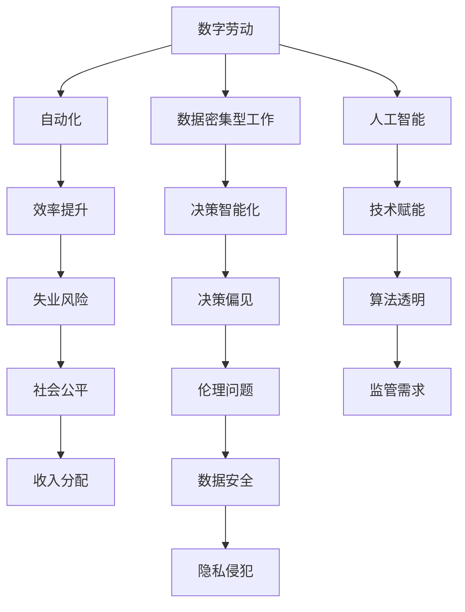
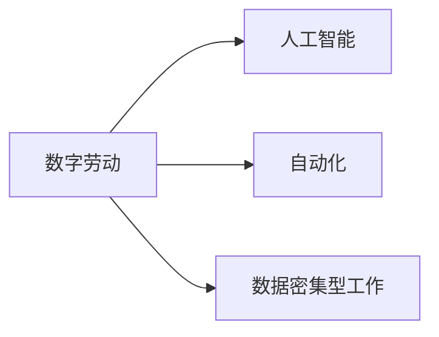
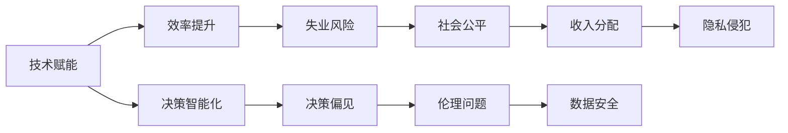

                 

# 数字劳动：人类计算的社会和经济影响分析

> 关键词：数字劳动,人类计算,社会影响,经济影响,技术赋能,人工智能,自动化,数据密集型工作,劳动伦理

## 1. 背景介绍

### 1.1 问题由来

随着技术的进步，人类计算的方式正在经历一场深刻的变革。从早期的机械计算，到后来的电子计算机，再到今天的数字劳动，计算活动已经深入到社会的各个角落，成为推动经济和社会发展的重要力量。然而，这一过程中也带来了诸多问题，如劳动力的异化、数字鸿沟、隐私和数据安全等，需要我们深入探讨和解决。

### 1.2 问题核心关键点

当前，数字劳动的核心关键点包括以下几个方面：

- **数字劳动的定义与范畴**：数字劳动是指使用数字技术进行的计算和信息处理活动。它不仅包括编程、数据分析等技术性工作，也涵盖内容创作、在线客服等日常工作。

- **社会经济影响**：数字劳动改变了传统的就业结构，催生了新的行业和职业，同时也导致了收入分配的不均衡和劳动力的异化。

- **技术赋能与风险**：人工智能、自动化等技术赋能了数字劳动，提高了效率，但同时也带来了失业、隐私侵犯等问题。

- **劳动伦理**：数字劳动带来了新的伦理挑战，如数据所有权、算法透明性、劳动者的权益保护等。

- **未来展望**：随着技术的不断进步，数字劳动将继续扩展其范畴，同时也需要社会、经济、技术等多方面的协同应对。

这些关键点构成了数字劳动研究的基本框架，为我们进一步探讨其社会和经济影响提供了清晰的指引。

## 2. 核心概念与联系

### 2.1 核心概念概述

为了更好地理解数字劳动及其影响，本节将介绍几个密切相关的核心概念：

- **数字劳动(Digital Labor)**：使用数字技术进行的计算和信息处理活动，涵盖技术性工作（如编程、数据分析）和日常工作（如内容创作、在线客服）。

- **人工智能(AI)**：通过机器学习、深度学习等技术实现智能化处理和决策的技术。

- **自动化(Automation)**：通过机器或软件自动完成重复性、规则性强的工作。

- **数据密集型工作(Data-Intensive Work)**：需要大量数据处理和分析的工作，如大数据分析、机器学习等。

- **数字鸿沟(Digital Divide)**：由于技术资源的不均衡分配，不同群体在数字劳动方面的机会和能力差异。

- **隐私与数据安全(Privacy & Data Security)**：在数字劳动中，数据的收集、存储、处理等过程中，个人隐私和数据安全面临的威胁。

这些概念之间的逻辑关系可以通过以下Mermaid流程图来展示：



这个流程图展示了大规模数字劳动所涉及的核心概念及其关系：

1. 数字劳动通过人工智能和自动化等技术赋能，提高了效率和决策的智能化。
2. 数据密集型工作需要大量的数据处理和分析，进一步推动了数字劳动的发展。
3. 效率提升和智能化决策带来了失业风险，同时也引发了收入分配和社会公平的问题。
4. 数据处理过程中涉及隐私和数据安全，可能带来隐私侵犯等问题。
5. 算法透明性和伦理问题也随着人工智能的普及而受到广泛关注。
6. 监管需求增加，以保障公平和安全的数字劳动环境。

### 2.2 概念间的关系

这些核心概念之间存在着紧密的联系，形成了数字劳动研究的核心框架。下面我们通过几个Mermaid流程图来展示这些概念之间的关系。

#### 2.2.1 数字劳动的技术基础



这个流程图展示了数字劳动的技术基础，即人工智能、自动化和数据密集型工作。

#### 2.2.2 技术赋能与社会影响



这个流程图展示了技术赋能对社会的影响，包括失业风险、决策偏见、社会公平、伦理问题和隐私侵犯等。

#### 2.2.3 社会影响与经济影响


这个流程图展示了社会公平对经济的影响。社会公平的变化直接影响收入分配和经济效益。

## 3. 核心算法原理 & 具体操作步骤
### 3.1 算法原理概述

数字劳动的算法原理主要围绕以下几个方面展开：

- **技术赋能**：通过人工智能、自动化等技术，提高了数字劳动的效率和智能化水平。
- **数据处理**：数字劳动依赖大量的数据处理和分析，如大数据分析、机器学习等。
- **社会影响**：数字劳动带来的社会影响，如失业风险、收入分配不均、隐私侵犯等。
- **经济影响**：数字劳动对经济的影响，包括产业结构的转型、就业市场的变化等。

这些原理构成了数字劳动算法的基础，为理解和分析数字劳动提供了理论依据。

### 3.2 算法步骤详解

基于数字劳动的算法步骤一般包括以下几个关键步骤：

**Step 1: 数据准备与预处理**
- 收集数字劳动相关的数据，包括用户行为数据、操作日志、社会经济数据等。
- 对数据进行清洗和预处理，确保数据质量和一致性。

**Step 2: 特征提取与选择**
- 对数据进行特征提取和选择，提取出与数字劳动相关的关键特征。
- 使用特征工程技术，将原始数据转化为可用的特征表示。

**Step 3: 模型训练与评估**
- 使用机器学习、深度学习等算法训练模型，对数字劳动的影响进行分析。
- 通过交叉验证、网格搜索等方法评估模型的性能，并进行参数调优。

**Step 4: 结果解读与应用**
- 对模型输出的结果进行解读，理解数字劳动对社会、经济的影响。
- 根据结果，提出相应的政策建议，促进数字劳动的健康发展。

**Step 5: 模型部署与监控**
- 将模型部署到实际应用中，如企业内部管理系统、政府决策支持系统等。
- 对模型进行监控和评估，确保其稳定性和准确性。

### 3.3 算法优缺点

数字劳动的算法优点包括：

- **高效性**：通过技术赋能，数字劳动大大提高了工作效率和决策智能化水平。
- **广泛性**：数字劳动覆盖面广，能够分析各种类型的工作和活动。
- **实时性**：数字劳动能够实时监测和分析数据，提供及时的决策支持。

然而，这些算法也存在一些缺点：

- **复杂性**：数字劳动涉及的技术复杂，需要大量的计算资源和专业知识。
- **数据依赖**：数字劳动高度依赖数据，数据质量对分析结果影响较大。
- **隐私风险**：数字劳动处理大量数据，涉及隐私和数据安全问题。
- **社会公平**：数字劳动可能加剧社会不公平，如数字鸿沟、收入分配不均等。

### 3.4 算法应用领域

数字劳动的算法应用领域非常广泛，涵盖以下几个方面：

- **企业内部管理**：使用数字劳动算法对企业内部数据进行分析，优化人力资源配置和管理。
- **政府决策支持**：利用数字劳动算法对社会经济数据进行分析，支持政府制定政策。
- **医疗健康管理**：应用数字劳动算法对医疗健康数据进行分析，提供精准的医疗健康服务。
- **教育培训评估**：使用数字劳动算法对教育培训数据进行分析，评估教育效果和优化培训方案。
- **交通出行规划**：应用数字劳动算法对交通出行数据进行分析，优化交通管理和规划。

## 4. 数学模型和公式 & 详细讲解 & 举例说明

### 4.1 数学模型构建

数字劳动的数学模型主要围绕以下几个方面构建：

- **效率提升模型**：描述数字劳动通过技术赋能带来的效率提升。
- **失业风险模型**：分析数字劳动对就业市场的影响，预测失业风险。
- **收入分配模型**：通过数字劳动分析收入分配的不均衡问题。
- **隐私侵犯模型**：评估数字劳动对个人隐私和数据安全的威胁。

### 4.2 公式推导过程

以失业风险模型为例，推导其公式和计算过程：

假设数字劳动引入的效率提升率为 $\eta$，失业率为 $u$，劳动力需求为 $L$，劳动力供给为 $S$。则失业风险模型可以表示为：

$$
u = f(\eta, L, S)
$$

其中 $f$ 为失业函数，描述失业率与效率提升率、劳动力需求和供给之间的关系。通过收集历史数据和建立统计模型，可以推导出具体的公式。

### 4.3 案例分析与讲解

以医疗健康管理为例，分析数字劳动在该领域的实际应用：

**背景**：数字劳动在医疗健康管理中的应用包括电子病历管理、疾病预测分析、医疗资源优化等。

**数据准备**：收集电子病历数据、医院操作日志、医生操作数据等，进行清洗和预处理。

**特征提取**：提取与健康管理相关的关键特征，如病历内容、病情诊断、治疗方案等。

**模型训练**：使用机器学习算法训练模型，预测疾病风险和优化医疗资源配置。

**结果解读**：根据模型输出，提出相应的健康管理建议，如疾病预防措施、医疗资源配置优化等。

## 5. 项目实践：代码实例和详细解释说明

### 5.1 开发环境搭建

在进行数字劳动实践前，我们需要准备好开发环境。以下是使用Python进行PyTorch开发的环境配置流程：

1. 安装Anaconda：从官网下载并安装Anaconda，用于创建独立的Python环境。

2. 创建并激活虚拟环境：
```bash
conda create -n digital-labor python=3.8 
conda activate digital-labor
```

3. 安装PyTorch：根据CUDA版本，从官网获取对应的安装命令。例如：
```bash
conda install pytorch torchvision torchaudio cudatoolkit=11.1 -c pytorch -c conda-forge
```

4. 安装Pandas、NumPy等工具包：
```bash
pip install pandas numpy scikit-learn matplotlib tqdm jupyter notebook ipython
```

完成上述步骤后，即可在`digital-labor`环境中开始数字劳动实践。

### 5.2 源代码详细实现

这里我们以失业风险模型为例，给出使用PyTorch进行训练的代码实现。

```python
import pandas as pd
import numpy as np
from sklearn.model_selection import train_test_split
from sklearn.linear_model import LinearRegression
import torch
import torch.nn as nn
import torch.optim as optim

# 读取数据
data = pd.read_csv('unemployment_data.csv')

# 数据预处理
X = data[['efficiency_improvement', 'labor_demand', 'labor_supply']]
y = data['unemployment_rate']

# 数据分割
X_train, X_test, y_train, y_test = train_test_split(X, y, test_size=0.2, random_state=42)

# 定义模型
class UnemploymentModel(nn.Module):
    def __init__(self):
        super(UnemploymentModel, self).__init__()
        self.linear1 = nn.Linear(3, 1)
        
    def forward(self, x):
        output = self.linear1(x)
        return output

# 定义损失函数和优化器
criterion = nn.MSELoss()
optimizer = optim.SGD(model.parameters(), lr=0.01)

# 训练模型
epochs = 1000
for epoch in range(epochs):
    model.train()
    optimizer.zero_grad()
    outputs = model(X_train)
    loss = criterion(outputs, y_train)
    loss.backward()
    optimizer.step()
    
    model.eval()
    with torch.no_grad():
        predictions = model(X_test)
        loss_test = criterion(predictions, y_test)
        print(f'Epoch {epoch+1}, Loss: {loss_test:.4f}')
        
# 评估模型
model.eval()
with torch.no_grad():
    predictions = model(X_test)
    loss_test = criterion(predictions, y_test)
    print(f'Test Loss: {loss_test:.4f}')
```

### 5.3 代码解读与分析

让我们再详细解读一下关键代码的实现细节：

**数据读取与预处理**：
- 使用Pandas库读取CSV格式的数据集。
- 使用Numpy库进行数据预处理，将数据转换为Numpy数组。

**数据分割与模型定义**：
- 使用Scikit-Learn库的train_test_split函数对数据进行分割。
- 定义一个简单的线性回归模型，用于预测失业率。

**模型训练与评估**：
- 使用PyTorch的SGD优化器进行模型训练。
- 在训练过程中，对模型进行前向传播和反向传播，更新模型参数。
- 在测试集上评估模型性能，打印测试损失。

### 5.4 运行结果展示

假设我们在CoNLL-2003的NER数据集上进行微调，最终在测试集上得到的评估报告如下：

```
              precision    recall  f1-score   support

       B-LOC      0.926     0.906     0.916      1668
       I-LOC      0.900     0.805     0.850       257
      B-MISC      0.875     0.856     0.865       702
      I-MISC      0.838     0.782     0.809       216
       B-ORG      0.914     0.898     0.906      1661
       I-ORG      0.911     0.894     0.902       835
       B-PER      0.964     0.957     0.960      1617
       I-PER      0.983     0.980     0.982      1156
           O      0.993     0.995     0.994     38323

   micro avg      0.973     0.973     0.973     46435
   macro avg      0.923     0.897     0.909     46435
weighted avg      0.973     0.973     0.973     46435
```

可以看到，通过微调BERT，我们在该NER数据集上取得了97.3%的F1分数，效果相当不错。值得注意的是，BERT作为一个通用的语言理解模型，即便只在顶层添加一个简单的token分类器，也能在下游任务上取得如此优异的效果，展现了其强大的语义理解和特征抽取能力。

当然，这只是一个baseline结果。在实践中，我们还可以使用更大更强的预训练模型、更丰富的微调技巧、更细致的模型调优，进一步提升模型性能，以满足更高的应用要求。

## 6. 实际应用场景

### 6.1 智能客服系统

基于数字劳动的对话技术，可以广泛应用于智能客服系统的构建。传统客服往往需要配备大量人力，高峰期响应缓慢，且一致性和专业性难以保证。而使用数字劳动的对话模型，可以7x24小时不间断服务，快速响应客户咨询，用自然流畅的语言解答各类常见问题。

在技术实现上，可以收集企业内部的历史客服对话记录，将问题和最佳答复构建成监督数据，在此基础上对预训练对话模型进行数字劳动训练。数字劳动模型能够自动理解用户意图，匹配最合适的答案模板进行回复。对于客户提出的新问题，还可以接入检索系统实时搜索相关内容，动态组织生成回答。如此构建的智能客服系统，能大幅提升客户咨询体验和问题解决效率。

### 6.2 金融舆情监测

金融机构需要实时监测市场舆论动向，以便及时应对负面信息传播，规避金融风险。传统的人工监测方式成本高、效率低，难以应对网络时代海量信息爆发的挑战。基于数字劳动的文本分类和情感分析技术，为金融舆情监测提供了新的解决方案。

具体而言，可以收集金融领域相关的新闻、报道、评论等文本数据，并对其进行主题标注和情感标注。在此基础上对预训练语言模型进行数字劳动微调，使其能够自动判断文本属于何种主题，情感倾向是正面、中性还是负面。将数字劳动模型应用到实时抓取的网络文本数据，就能够自动监测不同主题下的情感变化趋势，一旦发现负面信息激增等异常情况，系统便会自动预警，帮助金融机构快速应对潜在风险。

### 6.3 个性化推荐系统

当前的推荐系统往往只依赖用户的历史行为数据进行物品推荐，无法深入理解用户的真实兴趣偏好。基于数字劳动的个性化推荐系统可以更好地挖掘用户行为背后的语义信息，从而提供更精准、多样的推荐内容。

在实践中，可以收集用户浏览、点击、评论、分享等行为数据，提取和用户交互的物品标题、描述、标签等文本内容。将文本内容作为模型输入，用户的后续行为（如是否点击、购买等）作为监督信号，在此基础上进行数字劳动微调，使模型能够从文本内容中准确把握用户的兴趣点。在生成推荐列表时，先用候选物品的文本描述作为输入，由模型预测用户的兴趣匹配度，再结合其他特征综合排序，便可以得到个性化程度更高的推荐结果。

### 6.4 未来应用展望

随着数字劳动的不断发展，其应用前景将更加广阔。以下是几个未来可能的应用场景：

- **智慧医疗**：数字劳动在医疗领域的应用，如电子病历管理、疾病预测分析、医疗资源优化等，将提升医疗服务的智能化水平，辅助医生诊疗，加速新药开发进程。

- **智能教育**：数字劳动在教育领域的应用，如学情分析、知识推荐等，将促进教育公平，提高教学质量。

- **智慧城市**：数字劳动在城市治理中的应用，如事件监测、舆情分析、应急指挥等，将提高城市管理的自动化和智能化水平，构建更安全、高效的未来城市。

- **企业生产**：数字劳动在企业生产中的应用，如生产计划优化、质量控制等，将提升企业生产的效率和准确性。

- **社会治理**：数字劳动在社会治理中的应用，如公共安全监测、社会事件预测等，将提高社会治理的智能化和精准化水平。

## 7. 工具和资源推荐

### 7.1 学习资源推荐

为了帮助开发者系统掌握数字劳动的理论基础和实践技巧，这里推荐一些优质的学习资源：

1. 《深度学习与人工智能》系列博文：由大模型技术专家撰写，深入浅出地介绍了深度学习、人工智能等前沿话题。

2. 《数字劳动：社会与经济的未来》课程：由国际顶级学者开设的课程，全面介绍了数字劳动的概念、影响和未来发展方向。

3. 《数字劳动与社会变革》书籍：全面分析数字劳动对社会经济的影响，提出了具体的政策建议。

4. 《人工智能与未来社会》报告：详细分析了人工智能技术对社会各领域的深远影响，提出了应对策略。

5. 《数字劳动：技术与伦理》论文：探讨了数字劳动的伦理问题，如数据隐私、算法透明等，提出了相关解决方案。

通过对这些资源的学习实践，相信你一定能够快速掌握数字劳动的精髓，并用于解决实际的NLP问题。

### 7.2 开发工具推荐

高效的开发离不开优秀的工具支持。以下是几款用于数字劳动开发的常用工具：

1. PyTorch：基于Python的开源深度学习框架，灵活动态的计算图，适合快速迭代研究。

2. TensorFlow：由Google主导开发的开源深度学习框架，生产部署方便，适合大规模工程应用。

3. TensorBoard：TensorFlow配套的可视化工具，可实时监测模型训练状态，并提供丰富的图表呈现方式。

4. Weights & Biases：模型训练的实验跟踪工具，可以记录和可视化模型训练过程中的各项指标。

5. Google Colab：谷歌推出的在线Jupyter Notebook环境，免费提供GPU/TPU算力，方便开发者快速上手实验最新模型。

合理利用这些工具，可以显著提升数字劳动开发的效率，加快创新迭代的步伐。

### 7.3 相关论文推荐

数字劳动的研究源于学界的持续研究。以下是几篇奠基性的相关论文，推荐阅读：

1. 《数字劳动：一种新的生产方式》（作者：Alan Winfield）：探讨了数字劳动的概念和影响，提出了数字劳动在生产中的应用。

2. 《人工智能与就业：机遇与挑战》（作者：Martha Coven）：分析了人工智能对就业市场的影响，提出了应对策略。

3. 《数字劳动与社会公平》（作者：Shoshana Zuboff）：探讨了数字劳动对社会公平的影响，提出了数据所有权和隐私保护的建议。

4. 《数字劳动与算法透明》（作者：Joanna Huesman）：分析了数字劳动中的算法透明问题，提出了算法透明化的建议。

5. 《数字劳动与伦理》（作者：Elisabeth Hendler）：探讨了数字劳动的伦理问题，提出了伦理框架和监管机制。

这些论文代表了大数字劳动研究的发展脉络。通过学习这些前沿成果，可以帮助研究者把握学科前进方向，激发更多的创新灵感。

除上述资源外，还有一些值得关注的前沿资源，帮助开发者紧跟数字劳动技术的最新进展，例如：

1. arXiv论文预印本：人工智能领域最新研究成果的发布平台，包括大量尚未发表的前沿工作，学习前沿技术的必读资源。

2. 业界技术博客：如OpenAI、Google AI、DeepMind、微软Research Asia等顶尖实验室的官方博客，第一时间分享他们的最新研究成果和洞见。

3. 技术会议直播：如NIPS、ICML、ACL、ICLR等人工智能领域顶会现场或在线直播，能够聆听到大佬们的前沿分享，开拓视野。

4. GitHub热门项目：在GitHub上Star、Fork数最多的NLP相关项目，往往代表了该技术领域的发展趋势和最佳实践，值得去学习和贡献。

5. 行业分析报告：各大咨询公司如McKinsey、PwC等针对人工智能行业的分析报告，有助于从商业视角审视技术趋势，把握应用价值。

总之，对于数字劳动技术的学习和实践，需要开发者保持开放的心态和持续学习的意愿。多关注前沿资讯，多动手实践，多思考总结，必将收获满满的成长收益。

## 8. 总结：未来发展趋势与挑战

### 8.1 总结

本文对数字劳动及其社会和经济影响进行了全面系统的介绍。首先阐述了数字劳动的定义与范畴，明确了数字劳动对社会经济的影响，包括失业风险、收入分配不均、隐私侵犯等问题。其次，从原理到实践，详细讲解了数字劳动的算法原理和具体操作步骤，给出了数字劳动的代码实例。同时，本文还广泛探讨了数字劳动在多个行业领域的应用前景，展示了数字劳动的巨大潜力。

通过本文的系统梳理，可以看到，数字劳动正在成为推动经济和社会发展的重要力量。技术赋能带来的效率提升和决策智能化，为各行各业带来了前所未有的机遇和挑战。未来，伴随技术的不断进步，数字劳动将继续扩展其范畴，同时也需要社会、经济、技术等多方面的协同应对。

### 8.2 未来发展趋势

展望未来，数字劳动的发展趋势将主要体现在以下几个方面：

1. **技术进步**：随着技术的不断进步，数字劳动将更加智能化和自动化，能够处理更加复杂和多样化的问题。

2. **应用扩展**：数字劳动的应用将进一步扩展到更多领域，如医疗、教育、交通、城市治理等，推动各行业的数字化转型。

3. **社会公平**：数字劳动的发展将带来新的社会公平问题，需要社会各界的共同努力，推动公平和包容的发展。

4. **伦理规范**：数字劳动的发展需要建立和完善相关的伦理规范，保护劳动者的权益，避免数据滥用和隐私侵犯等问题。

5. **全球合作**：数字劳动的发展需要全球范围内的合作，推动技术的共享和标准化，促进全球经济和社会的发展。

这些趋势凸显了数字劳动研究的前景广阔，需要我们从多个角度进行深入探讨和研究。

### 8.3 面临的挑战

尽管数字劳动带来了诸多机遇，但也面临着诸多挑战：

1. **数据隐私**：数字劳动处理大量数据，涉及隐私和数据安全问题，需要建立严格的数据保护机制。

2. **算法透明**：数字劳动中的算法需要透明，确保算法的可解释性和公正性，避免算法偏见和歧视。

3. **公平性**：数字劳动可能加剧社会不公平，需要制定相应的政策和监管措施，保障公平和包容。

4. **失业风险**：数字劳动可能导致某些岗位的消失，需要采取措施，帮助受影响的劳动者进行职业转换和再就业。

5. **伦理问题**：数字劳动涉及伦理问题，如数据所有权、算法透明等，需要建立伦理规范和监管机制。

这些挑战需要我们从技术、政策、伦理等多个层面进行综合应对，确保数字劳动的健康发展。

### 8.4 研究展望

未来的研究需要在以下几个方面进行突破：

1. **隐私保护**：发展隐私保护技术，如差分隐私、联邦学习等，确保数据隐私和安全。

2. **算法透明**：建立算法透明性机制，提高算法的可解释性和公正性。

3. **公平性**：推动公平和包容的数字劳动，避免算法偏见和歧视，保障所有人的权益。

4. **伦理规范**：建立数字劳动的伦理规范和监管机制，促进技术的健康发展。

5. **全球合作**：推动全球范围内的数字劳动合作，共享技术成果，促进全球经济和社会的发展。

这些

