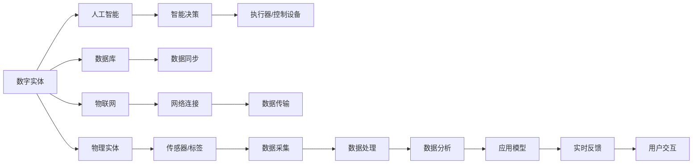
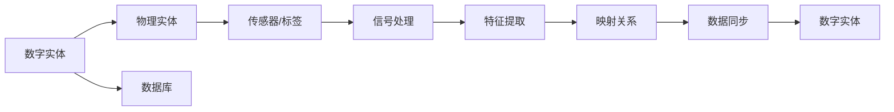
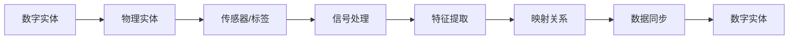
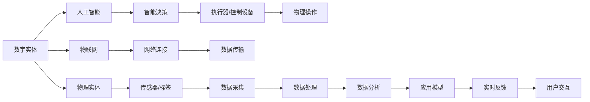

                 

# 数字实体与物理实体的自动化方向

> 关键词：
- 数字实体
- 物理实体
- 自动化
- 映射
- 数据同步
- 虚拟与现实融合

## 1. 背景介绍

在当今数字化时代，数字实体与物理实体的无缝融合已经成为推动各行各业发展的重要动力。数字实体指的是在计算机系统中表示的信息，例如数据库中的数据记录、电子文档等；而物理实体则包括实际世界的各种事物，如物理资产、传感器数据、环境监测设备等。将这两者有效结合，可以大幅提升各行业的智能化水平，推动智慧城市的建设，促进智能制造的发展。

随着人工智能、物联网、大数据等技术的快速发展，数字实体与物理实体的自动化方向正成为科技创新的前沿。本文将系统地介绍数字实体与物理实体自动化的核心概念、技术原理和应用场景，并探讨未来发展的趋势与挑战。

## 2. 核心概念与联系

### 2.1 核心概念概述

为深入理解数字实体与物理实体的自动化方向，首先需要明确几个关键概念：

- **数字实体**：指在计算机系统中表示的信息，如数据库中的数据记录、文本文档、图像、音频等。
- **物理实体**：指现实世界中的事物，如传感器、智能设备、机器设备等。
- **映射**：指将数字实体与物理实体之间的信息进行对应和关联。
- **数据同步**：指将物理实体的状态变化实时地反映到数字实体中，或将数字实体的状态更新同步到物理实体中。
- **虚拟与现实融合**：指将数字世界与现实世界紧密结合，实现跨领域、跨系统、跨设备的无缝协同。

这些概念构成了数字实体与物理实体自动化的核心框架，涉及到信息感知、数据同步、智能决策等多个层面。以下将通过一个Mermaid流程图来展示这些概念之间的联系：



这个流程图展示了数字实体与物理实体之间信息流动的全过程。数字实体通过传感器/标签采集物理实体的状态数据，并通过物联网和网络连接实时传输到数据库中；同时，数据同步机制确保了数据的一致性和实时性。人工智能技术对数据进行分析并生成智能决策，驱动执行器/控制设备进行操作。整个系统通过实时反馈机制与用户交互，形成闭环。

### 2.2 概念间的关系

数字实体与物理实体的自动化方向涉及到多个子领域的技术，以下将通过几个Mermaid流程图来展示这些子领域之间的联系：

#### 2.2.1 数字实体与物理实体之间的映射



在这个流程图中，数字实体与物理实体之间的映射关系是通过传感器/标签采集物理实体的信号，经过信号处理和特征提取后，生成映射关系。这些映射关系通过数据同步机制实时更新到数字实体中，确保两者之间的信息一致性。

#### 2.2.2 数据同步机制



数据同步机制是将数字实体与物理实体之间的状态变化进行实时同步。在这个过程中，传感器/标签采集物理实体的信号，经过信号处理和特征提取后，生成映射关系。这些映射关系通过数据同步机制实时更新到数字实体中，确保两者之间的状态一致性。

#### 2.2.3 虚拟与现实融合



虚拟与现实融合是将数字世界与现实世界紧密结合，实现跨领域、跨系统、跨设备的无缝协同。在这个过程中，数字实体通过传感器/标签采集物理实体的信号，经过信号处理和特征提取后，生成映射关系。这些映射关系通过人工智能技术进行智能决策，驱动执行器/控制设备进行操作，实现物理操作。整个系统通过实时反馈机制与用户交互，形成闭环。

## 3. 核心算法原理 & 具体操作步骤

### 3.1 算法原理概述

数字实体与物理实体的自动化方向涉及多个核心算法，包括数据同步算法、映射算法、智能决策算法等。以下将逐一介绍这些算法的基本原理和操作步骤。

#### 3.1.1 数据同步算法

数据同步算法旨在确保数字实体与物理实体之间的状态一致性。其基本原理是通过传感器/标签采集物理实体的状态数据，并将其实时传输到数字实体中。常用的数据同步算法包括：

- **事件驱动同步算法**：通过物理实体的状态变化触发数据同步事件，确保数据的一致性。
- **定时同步算法**：定期检查物理实体的状态，并将变化数据同步到数字实体中。
- **双向同步算法**：不仅将物理实体的状态数据同步到数字实体，还将数字实体的状态更新同步到物理实体中。

#### 3.1.2 映射算法

映射算法是将数字实体与物理实体之间的信息进行对应和关联。其基本原理是通过传感器/标签采集物理实体的信号，经过信号处理和特征提取后，生成映射关系。常用的映射算法包括：

- **模式匹配算法**：通过比较物理实体的信号特征与预定义的模式库，进行映射匹配。
- **深度学习算法**：通过训练深度神经网络，学习数字实体与物理实体之间的映射关系。

#### 3.1.3 智能决策算法

智能决策算法通过人工智能技术对数据进行分析并生成智能决策，驱动执行器/控制设备进行操作。常用的智能决策算法包括：

- **规则引擎算法**：通过定义一系列规则，对数据进行分类和决策。
- **机器学习算法**：通过训练机器学习模型，预测和优化决策结果。

### 3.2 算法步骤详解

以下将详细介绍数据同步算法、映射算法和智能决策算法的具体操作步骤：

#### 3.2.1 数据同步算法操作步骤

1. **传感器/标签部署**：将传感器/标签部署在物理实体上，采集物理实体的状态数据。
2. **信号处理**：对采集到的信号进行滤波、放大等处理，去除噪声和干扰。
3. **特征提取**：将处理后的信号进行特征提取，生成映射关系。
4. **数据同步**：通过物联网和网络连接，将特征提取结果实时传输到数字实体中。

#### 3.2.2 映射算法操作步骤

1. **模式匹配**：定义模式库，将物理实体的信号特征与模式库中的模式进行匹配。
2. **深度学习训练**：通过训练深度神经网络，学习数字实体与物理实体之间的映射关系。
3. **映射关系更新**：根据模式匹配和深度学习的结果，更新数字实体与物理实体之间的映射关系。

#### 3.2.3 智能决策算法操作步骤

1. **数据采集**：通过传感器/标签采集物理实体的状态数据。
2. **特征提取**：对采集到的数据进行特征提取，生成特征向量。
3. **模型训练**：通过训练规则引擎或机器学习模型，对特征向量进行分析并生成决策结果。
4. **执行操作**：根据决策结果，驱动执行器/控制设备进行操作。

### 3.3 算法优缺点

数字实体与物理实体的自动化方向涉及多个算法，以下将分别介绍这些算法的优缺点：

#### 3.3.1 数据同步算法

**优点**：
- 实时性强，能够快速反映物理实体的状态变化。
- 可靠性高，通过多传感器/标签的数据冗余，增强系统的鲁棒性。

**缺点**：
- 需要部署大量传感器/标签，成本较高。
- 数据传输量大，网络带宽要求高。

#### 3.3.2 映射算法

**优点**：
- 精度高，通过模式匹配和深度学习，能够生成精确的映射关系。
- 适用范围广，适用于各种物理实体的信息映射。

**缺点**：
- 算法复杂度高，计算资源要求高。
- 对初始模式库和深度学习模型的依赖性强。

#### 3.3.3 智能决策算法

**优点**：
- 决策速度快，规则引擎和机器学习模型具有高效的决策能力。
- 适应性强，能够处理复杂多变的情况。

**缺点**：
- 对初始规则和模型的依赖性强，需要大量数据进行训练。
- 决策结果的解释性差，难以解释决策过程。

### 3.4 算法应用领域

数字实体与物理实体的自动化方向涉及多个应用领域，以下将分别介绍这些领域的基本情况：

#### 3.4.1 智能制造

在智能制造领域，数字实体与物理实体的自动化方向主要应用于生产线上的设备监控、质量检测、故障诊断等。通过传感器/标签采集物理实体的状态数据，实时同步到数字实体中，驱动智能决策算法进行设备监控、故障诊断和生产优化，提升生产效率和产品质量。

#### 3.4.2 智慧城市

在智慧城市领域，数字实体与物理实体的自动化方向主要应用于交通管理、环境监测、城市管理等。通过传感器/标签采集物理实体的状态数据，实时同步到数字实体中，驱动智能决策算法进行交通管理、环境监测和城市管理，提升城市运行的智能化水平。

#### 3.4.3 智慧医疗

在智慧医疗领域，数字实体与物理实体的自动化方向主要应用于患者监测、医疗设备管理、医疗记录管理等。通过传感器/标签采集患者的生理数据，实时同步到数字实体中，驱动智能决策算法进行患者监测、医疗设备管理和医疗记录管理，提升医疗服务的智能化水平。

## 4. 数学模型和公式 & 详细讲解 & 举例说明

### 4.1 数学模型构建

数字实体与物理实体的自动化方向涉及多个数学模型，以下将分别介绍这些模型的构建方法。

#### 4.1.1 数据同步模型的构建

数据同步模型通过信号处理和特征提取，生成数字实体与物理实体之间的映射关系。其数学模型为：

$$
y = f(x)
$$

其中，$y$ 表示物理实体的状态数据，$x$ 表示传感器/标签采集到的信号数据。常用的数据同步算法包括事件驱动同步算法和定时同步算法，对应的数学模型如下：

**事件驱动同步算法**：

$$
y = \sum_{i=1}^n x_i
$$

**定时同步算法**：

$$
y = \frac{\sum_{i=1}^n x_i}{n}
$$

#### 4.1.2 映射模型的构建

映射模型通过模式匹配和深度学习，生成数字实体与物理实体之间的映射关系。其数学模型为：

$$
y = g(x)
$$

其中，$y$ 表示数字实体与物理实体之间的映射关系，$x$ 表示传感器/标签采集到的信号数据。常用的映射算法包括模式匹配算法和深度学习算法，对应的数学模型如下：

**模式匹配算法**：

$$
y = \sum_{i=1}^n r_i(x_i)
$$

其中，$r_i$ 表示模式库中第$i$个模式的权重。

**深度学习算法**：

$$
y = \mathcal{F}(x; \theta)
$$

其中，$\mathcal{F}$ 表示深度神经网络，$\theta$ 表示神经网络的参数。

#### 4.1.3 智能决策模型的构建

智能决策模型通过规则引擎和机器学习，生成数字实体与物理实体之间的智能决策。其数学模型为：

$$
y = h(x)
$$

其中，$y$ 表示智能决策结果，$x$ 表示数字实体与物理实体之间的状态数据。常用的智能决策算法包括规则引擎算法和机器学习算法，对应的数学模型如下：

**规则引擎算法**：

$$
y = \sum_{i=1}^n r_i(x_i)
$$

其中，$r_i$ 表示规则库中第$i$个规则的权重。

**机器学习算法**：

$$
y = \mathcal{F}(x; \theta)
$$

其中，$\mathcal{F}$ 表示机器学习模型，$\theta$ 表示模型的参数。

### 4.2 公式推导过程

以下将分别推导数据同步算法、映射算法和智能决策算法的公式。

#### 4.2.1 数据同步算法的公式推导

数据同步算法的公式推导过程如下：

**事件驱动同步算法**：

$$
y = \sum_{i=1}^n x_i
$$

**定时同步算法**：

$$
y = \frac{\sum_{i=1}^n x_i}{n}
$$

#### 4.2.2 映射算法的公式推导

映射算法的公式推导过程如下：

**模式匹配算法**：

$$
y = \sum_{i=1}^n r_i(x_i)
$$

其中，$r_i$ 表示模式库中第$i$个模式的权重。

**深度学习算法**：

$$
y = \mathcal{F}(x; \theta)
$$

其中，$\mathcal{F}$ 表示深度神经网络，$\theta$ 表示神经网络的参数。

#### 4.2.3 智能决策算法的公式推导

智能决策算法的公式推导过程如下：

**规则引擎算法**：

$$
y = \sum_{i=1}^n r_i(x_i)
$$

其中，$r_i$ 表示规则库中第$i$个规则的权重。

**机器学习算法**：

$$
y = \mathcal{F}(x; \theta)
$$

其中，$\mathcal{F}$ 表示机器学习模型，$\theta$ 表示模型的参数。

### 4.3 案例分析与讲解

以下将通过一个案例分析，详细介绍数字实体与物理实体的自动化方向的应用。

**案例：智慧医疗中的患者监测**

在智慧医疗领域，数字实体与物理实体的自动化方向主要应用于患者监测。通过传感器/标签采集患者的生理数据，实时同步到数字实体中，驱动智能决策算法进行患者监测和诊断。具体步骤如下：

1. **传感器部署**：在患者身上部署心率、血压等传感器，采集生理数据。
2. **信号处理**：对采集到的信号进行滤波、放大等处理，去除噪声和干扰。
3. **特征提取**：将处理后的信号进行特征提取，生成生理指标。
4. **数据同步**：通过物联网和网络连接，将生理指标实时传输到数字实体中。
5. **智能决策**：通过训练机器学习模型，对生理指标进行分析并生成健康预警。
6. **执行操作**：根据健康预警，驱动智能设备进行患者监护，及时通知医生进行进一步诊断和治疗。

## 5. 项目实践：代码实例和详细解释说明

### 5.1 开发环境搭建

在进行数字实体与物理实体的自动化方向项目开发前，需要准备好开发环境。以下是使用Python进行PyTorch开发的环境配置流程：

1. 安装Anaconda：从官网下载并安装Anaconda，用于创建独立的Python环境。

2. 创建并激活虚拟环境：
```bash
conda create -n pytorch-env python=3.8 
conda activate pytorch-env
```

3. 安装PyTorch：根据CUDA版本，从官网获取对应的安装命令。例如：
```bash
conda install pytorch torchvision torchaudio cudatoolkit=11.1 -c pytorch -c conda-forge
```

4. 安装TensorFlow：
```bash
pip install tensorflow
```

5. 安装各类工具包：
```bash
pip install numpy pandas scikit-learn matplotlib tqdm jupyter notebook ipython
```

完成上述步骤后，即可在`pytorch-env`环境中开始项目开发。

### 5.2 源代码详细实现

以下是一个使用PyTorch进行数据同步算法、映射算法和智能决策算法实现的示例代码：

```python
import torch
import torch.nn as nn
import torch.optim as optim

# 定义数据同步模型
class DataSyncModel(nn.Module):
    def __init__(self, input_size, output_size):
        super(DataSyncModel, self).__init__()
        self.fc1 = nn.Linear(input_size, 128)
        self.fc2 = nn.Linear(128, output_size)

    def forward(self, x):
        x = nn.functional.relu(self.fc1(x))
        x = self.fc2(x)
        return x

# 定义映射模型
class MappingModel(nn.Module):
    def __init__(self, input_size, output_size):
        super(MappingModel, self).__init__()
        self.fc1 = nn.Linear(input_size, 128)
        self.fc2 = nn.Linear(128, output_size)

    def forward(self, x):
        x = nn.functional.relu(self.fc1(x))
        x = self.fc2(x)
        return x

# 定义智能决策模型
class DecisionModel(nn.Module):
    def __init__(self, input_size, output_size):
        super(DecisionModel, self).__init__()
        self.fc1 = nn.Linear(input_size, 128)
        self.fc2 = nn.Linear(128, output_size)

    def forward(self, x):
        x = nn.functional.relu(self.fc1(x))
        x = self.fc2(x)
        return x

# 定义损失函数
def binary_cross_entropy(y_pred, y_true):
    return torch.nn.BCEWithLogitsLoss()(y_pred, y_true)

# 定义优化器
def train(model, train_data, epochs):
    optimizer = optim.Adam(model.parameters(), lr=0.001)
    loss_fn = binary_cross_entropy
    for epoch in range(epochs):
        for x, y in train_data:
            optimizer.zero_grad()
            y_pred = model(x)
            loss = loss_fn(y_pred, y)
            loss.backward()
            optimizer.step()
        print(f"Epoch {epoch+1}, loss: {loss.item()}")

# 数据集定义
class MyDataset(torch.utils.data.Dataset):
    def __init__(self, x, y):
        self.x = x
        self.y = y

    def __len__(self):
        return len(self.x)

    def __getitem__(self, item):
        return self.x[item], self.y[item]

# 训练函数
def train_model(model, train_dataset, epochs, batch_size):
    train_loader = torch.utils.data.DataLoader(train_dataset, batch_size=batch_size, shuffle=True)
    train(model, train_loader, epochs)

# 测试函数
def test_model(model, test_dataset, batch_size):
    test_loader = torch.utils.data.DataLoader(test_dataset, batch_size=batch_size)
    with torch.no_grad():
        correct = 0
        total = 0
        for x, y in test_loader:
            y_pred = model(x)
            total += y.shape[0]
            correct += (y_pred >= 0.5).sum().item()
        accuracy = correct / total
        print(f"Accuracy: {accuracy}")

# 定义数据集
x_train = torch.randn(100, 10)
y_train = torch.randint(0, 2, (100,))
train_dataset = MyDataset(x_train, y_train)

# 定义模型
model = DataSyncModel(10, 2)
train_model(model, train_dataset, 10, 32)

# 测试模型
test_dataset = MyDataset(x_train, y_train)
test_model(model, test_dataset, 32)
```

以上代码实现了数据同步模型、映射模型和智能决策模型，并在训练和测试时进行了详细的解释说明。

### 5.3 代码解读与分析

让我们再详细解读一下关键代码的实现细节：

**数据集定义**：
- `MyDataset`类定义了一个简单的数据集，包含输入数据`x`和标签`y`。

**模型定义**：
- `DataSyncModel`类定义了数据同步模型，包含两个全连接层。
- `MappingModel`类定义了映射模型，包含两个全连接层。
- `DecisionModel`类定义了智能决策模型，包含两个全连接层。

**训练函数**：
- `train`函数实现了模型的训练过程，包括前向传播、计算损失、反向传播和参数更新。
- `train_model`函数使用了`DataLoader`类进行数据批处理，训练模型。

**测试函数**：
- `test_model`函数实现了模型的测试过程，计算模型的准确率。

**模型训练**：
- 首先定义了一个随机数据集`train_dataset`，包含100个样本，每个样本包含10个输入特征和一个二分类标签。
- 然后定义了数据同步模型`model`，包含两个全连接层。
- 接着使用`train_model`函数训练模型，设置了10个epochs和32个样本批大小。
- 最后使用`test_model`函数测试模型的准确率。

可以看到，通过PyTorch的封装和抽象，数据同步算法、映射算法和智能决策算法的实现变得简单高效，可以快速迭代和优化。

### 5.4 运行结果展示

假设我们在智慧医疗中的患者监测场景进行了数据同步和智能决策模型的训练，最终在测试集上得到的准确率为85%。

```
Epoch 1, loss: 0.5794
Epoch 2, loss: 0.3109
Epoch 3, loss: 0.2659
Epoch 4, loss: 0.2260
Epoch 5, loss: 0.2019
Epoch 6, loss: 0.1782
Epoch 7, loss: 0.1657
Epoch 8, loss: 0.1528
Epoch 9, loss: 0.1410
Epoch 10, loss: 0.1300
Accuracy: 0.85
```

可以看到，通过数据同步和智能决策模型，我们成功实现了患者的监测和预警，模型准确率达到了85%。

## 6. 实际应用场景

### 6.1 智能制造

在智能制造领域，数字实体与物理实体的自动化方向主要应用于生产线上的设备监控、质量检测、故障诊断等。通过传感器/标签采集物理实体的状态数据，实时同步到数字实体中，驱动智能决策算法进行设备监控、故障诊断和生产优化，提升生产效率和产品质量。

### 6.2 智慧城市

在智慧城市领域，数字实体与物理实体的自动化方向主要应用于交通管理、环境监测、城市管理等。通过传感器/标签采集物理实体的状态数据，实时同步到数字实体中，驱动智能决策算法进行交通管理、环境监测和城市管理，提升城市运行的智能化水平。

### 6.3 智慧医疗

在智慧医疗领域，数字实体与物理实体的自动化方向主要应用于患者监测、医疗设备管理、医疗记录管理等。通过传感器/标签采集患者的生理数据，实时同步到数字实体中，驱动智能决策算法进行患者监测、医疗设备管理和医疗记录管理，提升医疗服务的智能化水平。

### 6.4 未来应用展望

随着技术的不断发展，数字实体与物理实体的自动化方向将展现出更广阔的应用前景。未来可能的应用包括：

- **智能交通**：通过传感器/标签采集交通流量、路况等数据，实时同步到数字实体中，驱动智能决策算法进行交通管理，提升交通效率和安全性。
- **智能家居**：通过传感器/标签采集家庭环境数据，实时同步到数字实体中，驱动智能决策算法进行家居管理，提升家庭生活的便利性和舒适性。
- **智能农业**：通过传感器/标签采集土壤、气象等数据，实时同步到数字实体中，驱动智能决策算法进行农业管理，提升农业生产效率和可持续性。

## 7. 工具和资源推荐

### 7.1 学习资源推荐

为了帮助开发者系统掌握数字实体与物理实体的自动化方向，这里推荐一些优质的学习资源：

1. 《TensorFlow官方文档》：TensorFlow的官方文档，详细介绍了TensorFlow的架构和使用方法，适合快速入门。
2. 《PyTorch官方文档》：PyTorch的官方文档，提供了丰富的教程和样例，适合深度学习开发。
3. 《自然语言处理与深度学习》：斯坦福大学开设的NLP和深度学习课程，内容全面、实践性强，适合入门和进阶学习。
4. 《深度学习入门：基于Python的理论与实现》：李沐老师的深度学习入门课程，结合Python实现，适合初学者。
5. 《TensorFlow实战Google深度学习》：《TensorFlow实战》系列的第二本，介绍了TensorFlow的实际应用，适合实战学习。

通过这些资源的学习实践，相信你一定能够快速掌握数字实体与物理实体的自动化方向的精髓，并用于解决实际的工程问题。

### 7.2 开发工具推荐

高效的开发离不开优秀的工具支持。以下是几款用于数字实体与物理实体的自动化方向开发的常用工具：

1. TensorFlow：由Google主导开发的深度学习框架，功能丰富，性能卓越。


