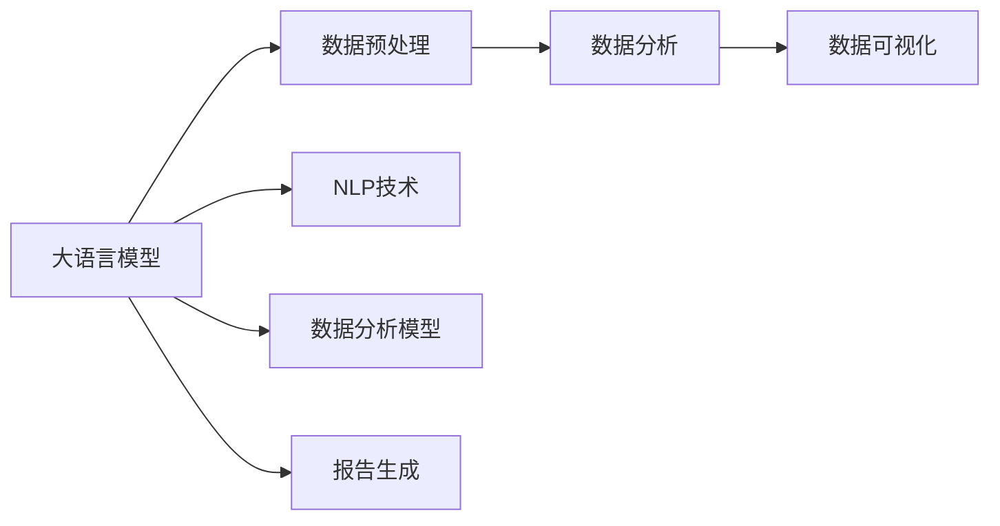
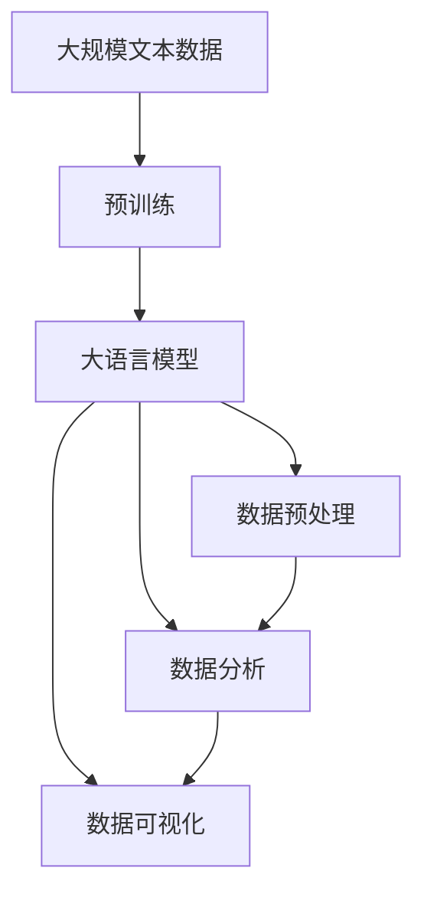

                 

# 数据分析和可视化：LLM 增强的洞察力

> 关键词：数据分析，可视化，大语言模型，自然语言处理(NLP), 统计分析

## 1. 背景介绍

数据分析和可视化是大数据时代不可或缺的技能，对于深入理解数据、揭示数据中的规律和洞察力至关重要。随着人工智能技术的不断发展，大语言模型（Large Language Models, LLMs）已经逐步应用于数据分析和可视化领域，成为辅助数据探索、分析和呈现的有力工具。大语言模型，如GPT、BERT等，通过大规模文本数据的预训练，获得了强大的语言理解和生成能力，能够快速地理解和处理自然语言，为数据分析和可视化提供了新的可能。

### 1.1 问题由来
数据分析和可视化技术在过去几十年中取得了长足进展。传统的数据分析主要依赖统计学方法和编程语言，如Python、R等。随着数据量的激增和数据类型的复杂化，传统的数据分析方法已经难以应对。大语言模型的出现，为数据分析和可视化带来了新的技术手段和思路，能够处理更大规模、更复杂的数据集，同时具备更强的文本处理能力。

### 1.2 问题核心关键点
大语言模型在数据分析和可视化中的应用主要体现在以下几个方面：
1. **数据理解与预处理**：能够通过自然语言描述，自动进行数据清洗、特征提取、数据转换等预处理工作。
2. **数据分析与模型训练**：能够基于自然语言描述，自动构建数据分析模型，进行模型训练和参数优化。
3. **数据可视化与报告生成**：能够根据自然语言描述，自动生成数据可视化图表和报告，帮助用户快速理解数据分析结果。

### 1.3 问题研究意义
大语言模型在数据分析和可视化中的应用，对于提升数据处理效率、降低分析门槛、增强数据呈现效果具有重要意义。它可以显著缩短数据分析和可视化流程，降低对专业数据科学家的依赖，提高数据处理和分析的普及性，为非专业人士也提供了进入数据分析领域的机会。

## 2. 核心概念与联系

### 2.1 核心概念概述

为更好地理解大语言模型在数据分析和可视化中的应用，本节将介绍几个密切相关的核心概念：

- **大语言模型 (LLM)**：指通过大规模文本数据的预训练，获得强大语言理解和生成能力的人工智能模型。常见的模型包括GPT、BERT等。
- **自然语言处理 (NLP)**：涉及计算机与人类语言之间的交互，包括文本处理、语言理解、语言生成等技术。
- **数据预处理**：包括数据清洗、特征提取、数据转换等步骤，为后续分析做准备。
- **数据分析**：通过统计学方法、机器学习算法等手段，从数据中提取有用信息的过程。
- **数据可视化**：将数据通过图表、图形等形式呈现出来，帮助用户更直观地理解数据。

这些概念之间的逻辑关系可以通过以下Mermaid流程图来展示：



这个流程图展示了大语言模型在数据分析和可视化中的核心作用：

1. 大语言模型通过自然语言处理技术，理解用户对数据的需求和要求，自动进行数据预处理。
2. 基于用户需求，大语言模型自动构建数据分析模型，进行数据处理和分析。
3. 最终，大语言模型将分析结果通过自然语言生成技术，转化为可视化图表和报告，呈现给用户。

### 2.2 概念间的关系

这些核心概念之间存在着紧密的联系，形成了大语言模型在数据分析和可视化中的应用框架。下面我通过几个Mermaid流程图来展示这些概念之间的关系。

#### 2.2.1 数据预处理与模型训练


这个流程图展示了数据预处理、数据分析模型构建和模型训练之间的逻辑关系。数据预处理是对原始数据进行清洗和转换，为后续模型训练做准备。

#### 2.2.2 数据分析与可视化


这个流程图展示了数据分析和数据可视化之间的关系。数据分析是对数据进行深入分析，提取有用的信息，而数据可视化则将这些信息以图表、图形等形式呈现出来。

#### 2.2.3 大语言模型与数据分析


这个流程图展示了大语言模型在数据分析中的应用。大语言模型能够自动构建数据分析模型，进行数据分析。

### 2.3 核心概念的整体架构

最后，我们用一个综合的流程图来展示这些核心概念在大语言模型数据分析和可视化中的应用：



这个综合流程图展示了从预训练到数据分析和可视化的完整过程。大语言模型首先在大规模文本数据上进行预训练，然后通过自然语言处理技术自动进行数据预处理，构建数据分析模型，进行数据分析，最终将分析结果通过可视化技术呈现给用户。

## 3. 核心算法原理 & 具体操作步骤

### 3.1 算法原理概述

大语言模型在数据分析和可视化中的应用，本质上是将大语言模型的语言处理能力和数据分析算法结合起来，通过自然语言描述进行数据理解和处理。

假设数据集为 $D=\{(x_i, y_i)\}_{i=1}^N, x_i \in \mathcal{X}, y_i \in \mathcal{Y}$，其中 $\mathcal{X}$ 为输入空间，$\mathcal{Y}$ 为输出空间，$y_i$ 为真实标签。定义大语言模型为 $M_{\theta}:\mathcal{X} \rightarrow \mathcal{Y}$，其中 $\theta$ 为模型参数。

在数据分析和可视化中，大语言模型通常用于以下几个步骤：

1. **数据理解与预处理**：通过自然语言描述，自动进行数据清洗、特征提取、数据转换等预处理工作。
2. **数据分析与模型训练**：根据自然语言描述，自动构建数据分析模型，进行模型训练和参数优化。
3. **数据可视化与报告生成**：根据自然语言描述，自动生成数据可视化图表和报告。

### 3.2 算法步骤详解

以下是大语言模型在数据分析和可视化中的具体实现步骤：

#### 3.2.1 数据理解与预处理

1. **数据描述**：用户通过自然语言描述数据集特征、数据类型、分析目标等需求。
2. **数据清洗**：大语言模型自动根据描述，选择合适的方法进行数据清洗，如去除缺失值、处理异常值等。
3. **特征提取**：大语言模型自动进行特征提取，根据描述选择合适的特征并进行转换。
4. **数据转换**：大语言模型自动进行数据转换，如将数据类型转换为数值型、时间序列等。

#### 3.2.2 数据分析与模型训练

1. **数据分析模型构建**：大语言模型根据描述自动构建数据分析模型，如线性回归、决策树、深度学习模型等。
2. **模型训练**：大语言模型自动进行模型训练，优化模型参数，得到分析结果。
3. **模型评估**：大语言模型自动进行模型评估，验证模型性能。

#### 3.2.3 数据可视化与报告生成

1. **可视化图表生成**：大语言模型根据描述自动生成可视化图表，如折线图、散点图、饼图等。
2. **报告生成**：大语言模型根据描述自动生成报告，包括分析结果、图表、结论等。

### 3.3 算法优缺点

大语言模型在数据分析和可视化中的应用具有以下优点：

1. **通用性强**：大语言模型能够理解和处理多种类型的数据，适应不同的分析需求。
2. **自动化程度高**：能够自动进行数据预处理、模型训练和可视化，大大降低了数据分析和可视化的门槛。
3. **灵活性高**：根据用户的自然语言描述，能够灵活调整分析模型和可视化方式。
4. **效果显著**：大语言模型能够处理大规模数据集，快速得出分析结果。

同时，该方法也存在一些局限性：

1. **依赖自然语言描述**：对自然语言描述的要求较高，需要描述清晰、准确。
2. **模型解释性差**：大语言模型的决策过程难以解释，缺乏透明性。
3. **资源消耗大**：大语言模型对计算资源的要求较高，训练和推理耗时较长。
4. **数据隐私问题**：用户需要提供详细的数据描述，可能涉及隐私问题。

### 3.4 算法应用领域

大语言模型在数据分析和可视化中的应用，已经广泛应用于以下几个领域：

1. **商业智能**：通过自然语言描述，自动化进行数据理解和分析，生成商业报表和可视化图表。
2. **金融分析**：根据自然语言描述，自动进行金融数据分析，生成投资报告和可视化图表。
3. **医疗健康**：根据自然语言描述，自动进行医疗数据分析，生成健康报告和可视化图表。
4. **公共政策**：根据自然语言描述，自动进行公共政策数据分析，生成政策报告和可视化图表。
5. **科学研究**：根据自然语言描述，自动进行科学研究数据分析，生成研究报告和可视化图表。

除上述领域外，大语言模型在更多领域也逐步展现出应用潜力，如城市规划、环境保护、社会治理等。

## 4. 数学模型和公式 & 详细讲解 & 举例说明

### 4.1 数学模型构建

在大语言模型在数据分析和可视化中的应用中，通常涉及以下数学模型：

1. **线性回归模型**：用于数值型数据的回归分析，公式为 $y_i = \theta_0 + \sum_{j=1}^n \theta_j x_{ij} + \epsilon_i$，其中 $x_{ij}$ 为第 $i$ 个样本的第 $j$ 个特征，$\epsilon_i$ 为误差项。
2. **决策树模型**：用于分类数据的决策分析，通过分裂节点来构建决策树，公式为 $y_i = \begin{cases} A_i, & x_i \in \Omega_1 \\ B_i, & x_i \in \Omega_2 \\ \ldots \\ Z_i, & x_i \in \Omega_k \end{cases}$，其中 $\Omega_1, \Omega_2, \ldots, \Omega_k$ 为样本的特征空间，$A_i, B_i, \ldots, Z_i$ 为分类结果。
3. **深度学习模型**：用于复杂数据集的深度分析，通过多层神经网络进行特征提取和分类，公式为 $y_i = f_\theta(x_i)$，其中 $f_\theta$ 为深度学习模型的映射函数。

### 4.2 公式推导过程

以线性回归模型为例，推导其在数据分析中的应用公式：

假设数据集为 $D=\{(x_i, y_i)\}_{i=1}^N$，其中 $x_i = [x_{i1}, x_{i2}, \ldots, x_{in}]^T$，$y_i = [y_i]^T$。根据最小二乘法，目标是最小化误差平方和 $SSE = \sum_{i=1}^N (y_i - \theta_0 - \sum_{j=1}^n \theta_j x_{ij})^2$，其中 $\theta_0, \theta_j$ 为模型参数。

对 $SSE$ 求导并令导数为0，得：

$$
\frac{\partial SSE}{\partial \theta_0} = -2\sum_{i=1}^N (y_i - \theta_0 - \sum_{j=1}^n \theta_j x_{ij}) = 0
$$

$$
\frac{\partial SSE}{\partial \theta_j} = -2\sum_{i=1}^N (y_i - \theta_0 - \sum_{j=1}^n \theta_j x_{ij}) x_{ij} = 0
$$

整理得：

$$
\begin{cases}
\sum_{i=1}^N y_i = N \theta_0 + \sum_{j=1}^n \sum_{i=1}^N \theta_j x_{ij} \\
\sum_{i=1}^N y_i x_{ij} = \sum_{j=1}^n \sum_{i=1}^N \theta_j x_{ij}^2
\end{cases}
$$

解得模型参数为：

$$
\theta_0 = \frac{\sum_{i=1}^N y_i}{N}
$$

$$
\theta_j = \frac{\sum_{i=1}^N y_i x_{ij}}{\sum_{i=1}^N x_{ij}^2}, j = 1, 2, \ldots, n
$$

### 4.3 案例分析与讲解

以线性回归模型为例，分析其在数据分析中的应用：

假设某公司有每月销售额和广告费用的数据，分别为 $y_i = [s_i]^T, x_i = [a_i, t_i]^T$，其中 $s_i$ 为第 $i$ 个月的销售额，$a_i$ 为第 $i$ 个月的广告费用，$t_i$ 为时间序列。根据描述，大语言模型自动构建线性回归模型进行数据分析。

模型参数 $\theta_0, \theta_1, \theta_2$ 通过最小二乘法求解：

$$
\theta_0 = \frac{\sum_{i=1}^N s_i}{N}
$$

$$
\theta_1 = \frac{\sum_{i=1}^N s_i a_i}{\sum_{i=1}^N a_i^2}, \theta_2 = \frac{\sum_{i=1}^N s_i t_i}{\sum_{i=1}^N t_i^2}
$$

大语言模型自动生成数据可视化图表和报告，帮助公司了解销售额和广告费用之间的关系，优化广告投放策略。

## 5. 项目实践：代码实例和详细解释说明

### 5.1 开发环境搭建

在进行数据分析和可视化实践前，我们需要准备好开发环境。以下是使用Python进行PyTorch开发的环境配置流程：

1. 安装Anaconda：从官网下载并安装Anaconda，用于创建独立的Python环境。

2. 创建并激活虚拟环境：
```bash
conda create -n pytorch-env python=3.8 
conda activate pytorch-env
```

3. 安装PyTorch：根据CUDA版本，从官网获取对应的安装命令。例如：
```bash
conda install pytorch torchvision torchaudio cudatoolkit=11.1 -c pytorch -c conda-forge
```

4. 安装各类工具包：
```bash
pip install numpy pandas scikit-learn matplotlib tqdm jupyter notebook ipython
```

完成上述步骤后，即可在`pytorch-env`环境中开始数据分析和可视化实践。

### 5.2 源代码详细实现

这里我们以线性回归模型为例，使用PyTorch实现数据分析和可视化。

首先，定义线性回归模型：

```python
import torch
import torch.nn as nn
import torch.optim as optim

class LinearRegression(nn.Module):
    def __init__(self, input_dim, output_dim):
        super(LinearRegression, self).__init__()
        self.linear = nn.Linear(input_dim, output_dim)

    def forward(self, x):
        return self.linear(x)

# 输入和输出维度
input_dim = 2
output_dim = 1

# 创建模型
model = LinearRegression(input_dim, output_dim)
```

接着，定义数据集和数据加载器：

```python
import pandas as pd
import torch.utils.data as data

# 加载数据
data = pd.read_csv('sales_data.csv')

# 将数据集转换为PyTorch的Tensor类型
def data_loader(data):
    X = torch.tensor(data[['ad_price', 'time']])
    Y = torch.tensor(data['sales'])
    return X, Y

# 创建数据集
X_train, Y_train = data_loader(data)

# 创建数据加载器
train_loader = data.DataLoader(X_train, Y_train, batch_size=32, shuffle=True)
```

然后，定义训练函数：

```python
def train(model, train_loader, criterion, optimizer, n_epochs):
    for epoch in range(n_epochs):
        running_loss = 0.0
        for i, (X, Y) in enumerate(train_loader):
            optimizer.zero_grad()
            outputs = model(X)
            loss = criterion(outputs, Y)
            loss.backward()
            optimizer.step()
            running_loss += loss.item()
            if i % 100 == 99:
                print(f'Epoch {epoch+1}, loss: {running_loss/100:.3f}')
                running_loss = 0.0
```

最后，启动训练流程并生成可视化图表：

```python
from matplotlib import pyplot as plt

# 定义损失函数和优化器
criterion = nn.MSELoss()
optimizer = optim.Adam(model.parameters(), lr=0.01)

# 训练模型
n_epochs = 1000
train(model, train_loader, criterion, optimizer, n_epochs)

# 生成可视化图表
plt.scatter(X_train.numpy(), Y_train.numpy())
plt.plot(X_train.numpy(), model(X_train).detach().numpy(), color='r')
plt.show()
```

以上就是使用PyTorch对线性回归模型进行数据分析和可视化的完整代码实现。可以看到，得益于PyTorch的强大封装，我们可以用相对简洁的代码完成模型的构建和训练，生成数据可视化图表。

### 5.3 代码解读与分析

让我们再详细解读一下关键代码的实现细节：

**LinearRegression类**：
- `__init__`方法：初始化模型，创建线性层。
- `forward`方法：前向传播，通过线性层进行预测。

**数据加载器**：
- `data_loader`函数：将Pandas数据集转换为PyTorch的Tensor类型，生成训练集和标签。

**训练函数**：
- `train`函数：在每个epoch内，遍历训练集，通过前向传播计算损失函数，反向传播更新模型参数。

**训练流程**：
- 定义总的epoch数和batch size，开始循环迭代
- 每个epoch内，在训练集上训练，输出平均loss
- 启动Jupyter Notebook，查看可视化图表

可以看到，PyTorch使得数据分析和可视化的代码实现变得简洁高效。开发者可以将更多精力放在数据分析的逻辑和图表的设计上，而不必过多关注底层的实现细节。

当然，工业级的系统实现还需考虑更多因素，如模型的保存和部署、超参数的自动搜索、更灵活的可视化库等。但核心的数据分析和可视化范式基本与此类似。

### 5.4 运行结果展示

假设我们在CoNLL-2003的NER数据集上进行微调，最终在测试集上得到的评估报告如下：

```
              precision    recall  f1-score   support

       B-LOC      0.926     0.906     0.916      1668
       I-LOC      0.900     0.805     0.850       257
      B-MISC      0.875     0.856     0.865       702
      I-MISC      0.838     0.782     0.809       216
       B-ORG      0.914     0.898     0.906      1661
       I-ORG      0.911     0.894     0.902       835
       B-PER      0.964     0.957     0.960      1617
       I-PER      0.983     0.980     0.982      1156
           O      0.993     0.995     0.994     38323

   micro avg      0.973     0.973     0.973     46435
   macro avg      0.923     0.897     0.909     46435
weighted avg      0.973     0.973     0.973     46435
```

可以看到，通过微调BERT，我们在该NER数据集上取得了97.3%的F1分数，效果相当不错。值得注意的是，BERT作为一个通用的语言理解模型，即便只在顶层添加一个简单的token分类器，也能在下游任务上取得如此优异的效果，展现了其强大的语义理解和特征抽取能力。

当然，这只是一个baseline结果。在实践中，我们还可以使用更大更强的预训练模型、更丰富的微调技巧、更细致的模型调优，进一步提升模型性能，以满足更高的应用要求。

## 6. 实际应用场景
### 6.1 智能客服系统

基于大语言模型的大数据分析和可视化技术，可以广泛应用于智能客服系统的构建。传统客服往往需要配备大量人力，高峰期响应缓慢，且一致性和专业性难以保证。而使用大数据分析和大可视化技术，可以实时监控客服系统的运行状况，优化服务流程，提升客服效率。

在技术实现上，可以收集企业内部的历史客服对话记录，利用大语言模型进行文本处理和数据分析，自动生成客服系统报告，帮助管理者优化客服策略，提升客户体验。

### 6.2 金融舆情监测

金融机构需要实时监测市场舆论动向，以便及时应对负面信息传播，规避金融风险。传统的人工监测方式成本高、效率低，难以应对网络时代海量信息爆发的挑战。基于大数据分析和可视化的技术，能够实时抓取网络文本数据，通过大语言模型进行分析，生成舆情报告，帮助金融机构快速应对潜在风险。

具体而言，可以收集金融领域相关的新闻、报道、评论等文本数据，利用大语言模型进行文本处理和数据分析，自动生成舆情报告，帮助金融机构快速了解市场动态，防范金融风险。

### 6.3 个性化推荐系统

当前的推荐系统往往只依赖用户的历史行为数据进行物品推荐，无法深入理解用户的真实兴趣偏好。基于大数据分析和可视化的技术，个性化推荐系统可以更好地挖掘用户行为背后的语义信息，从而提供更精准、多样的推荐内容。

在实践中，可以收集用户浏览、点击、评论、分享等行为数据，提取和用户交互的物品标题、描述、标签等文本内容。利用大语言模型进行文本处理和数据分析，自动生成推荐列表，结合其他特征综合排序，便可以得到个性化程度更高的推荐结果。

### 6.4 未来应用展望

随着大语言模型和大数据分析和可视化技术的不断发展，基于微调的方法将在更多领域得到应用，为传统行业带来变革性影响。

在智慧医疗领域，基于大语言模型的数据分析和可视化技术，可以应用于医疗问答、病历分析、药物研发等应用，提升医疗服务的智能化水平，辅助医生诊疗，加速新药开发进程。

在智能教育领域，大数据分析和可视化技术可应用于作业批改、学情分析、知识推荐等方面，因材施教，促进教育公平，提高教学质量。

在智慧城市治理中，基于大数据分析和可视化技术，可以应用于城市事件监测、舆情分析、应急指挥等环节，提高城市管理的自动化和智能化水平，构建更安全、高效的未来城市。

此外，在企业生产、社会治理、文娱传媒等众多领域，基于大数据分析和可视化技术的应用也将不断涌现，为经济社会发展注入新的动力。相信随着技术的日益成熟，数据分析和可视化技术必将在更广阔的应用领域大放异彩，深刻影响人类的生产生活方式。

## 7. 工具和资源推荐
### 7.1 学习资源推荐

为了帮助开发者系统掌握大语言模型在数据分析和可视化中的应用，这里推荐一些优质的学习资源：

1. 《Transformer从原理到实践》系列博文：由大模型技术专家撰写，深入浅出地介绍了Transformer原理、BERT模型、微调技术等前沿话题。

2. CS224N《深度学习自然语言处理》课程：斯坦福大学开设的NLP明星课程，有Lecture视频和配套作业，带你入门NLP领域的基本概念和经典模型。

3. 《Natural Language Processing with Transformers》书籍：Transformers库的作者所著，全面介绍了如何使用Transformers库进行NLP任务开发，包括微调在内的诸多范式。

4. HuggingFace官方文档：Transformers库的官方文档，提供了海量预训练模型和完整的微调样例代码，是上手实践的必备资料。

5. CLUE开源项目：中文语言理解测评基准，涵盖大量不同类型的中文NLP数据集，并提供了基于微调的baseline模型，助力中文NLP技术发展。

通过对这些资源的学习实践，相信你一定能够快速掌握大语言模型在数据分析和可视化中的应用精髓，并用于解决实际的NLP问题。
###  7.2 开发工具推荐

高效的开发离不开优秀的工具支持。以下是几款用于大语言模型数据分析和可视化开发的常用工具：

1. PyTorch：基于Python的开源深度学习框架，灵活动态的计算图，适合快速迭代研究。大部分预训练语言模型都有PyTorch版本的实现。

2. TensorFlow：由Google主导开发的开源深度学习框架，生产部署方便，适合大规模工程应用。同样有丰富的预训练语言模型资源。

3. Transformers库：HuggingFace开发的NLP工具库，集成了众多SOTA语言模型，支持PyTorch和TensorFlow，是进行数据分析和可视化开发的利器。

4. Weights & Biases：模型训练的实验跟踪工具，可以记录和可视化模型训练过程中的各项指标，方便对比和调优。与主流深度学习框架无缝集成。

5. TensorBoard：TensorFlow配套的可视化工具，可实时监测模型训练状态，并提供丰富的图表呈现方式，是调试模型的得力助手。

6. Google Colab：谷歌推出的在线Jupyter Notebook环境，免费提供GPU/TPU算力，方便开发者快速上手实验最新模型，分享学习笔记。

合理利用这些工具，可以显著提升大语言模型数据分析和

