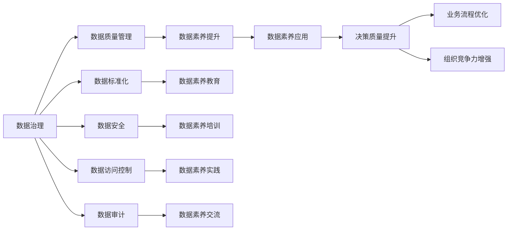

                 

# 数据治理与数据素养：软件2.0时代的管理新课题

> 关键词：数据治理,数据素养,软件2.0时代,大数据管理,智能决策支持系统,数据治理框架,数据治理工具

## 1. 背景介绍

### 1.1 问题由来

在21世纪初期，随着信息技术的高速发展，数据已经成为各个行业的核心资产。无论是金融、医疗、制造，还是零售、电商，数据都在驱动业务增长、改善决策质量、优化运营效率等方面发挥着重要作用。然而，数据的价值也取决于其质量、完整性和可用性。在数据量不断增长、数据源日益多元化的今天，如何有效治理数据、提高数据素养，已经成为各行各业面临的新挑战。

数据治理（Data Governance）和数据素养（Data Literacy）是两个紧密相关的概念，它们共同构成了数据管理的基石。数据治理旨在制定和实施数据管理规范，确保数据的质量、一致性和安全性；数据素养则强调个人和组织的数据理解能力，提升数据使用效率和决策水平。在软件2.0时代，数据治理与数据素养正变得越来越重要，它们不仅是技术实现的基础，更是战略成功的关键。

### 1.2 问题核心关键点

数据治理和数据素养的核心在于：

- **数据的规范化和标准化**：定义统一的数据模型、命名规范、数据类型，确保数据的一致性和互操作性。
- **数据质量管理**：识别和修复数据中的错误、重复、缺失等问题，提高数据的质量和可靠性。
- **数据安全与隐私保护**：确保数据的安全性和隐私性，防止数据泄露和滥用。
- **数据治理工具和平台**：提供高效的数据管理和治理工具，支持数据的采集、存储、分析和治理。
- **数据素养提升**：通过培训、教育、交流等方式提升个人和组织的数据素养，使其能够更有效地使用和分析数据。

在软件2.0时代，数据治理和数据素养的要求更高、需求更广。人工智能、大数据、云计算等新兴技术的普及，使得数据治理和数据素养的挑战更加复杂，但也带来了更多的机遇。本文将详细探讨这些关键点，并提供具体的解决方案和实践指南。

## 2. 核心概念与联系

### 2.1 核心概念概述

数据治理（Data Governance）和数据素养（Data Literacy）是大数据时代的两大支柱。

- **数据治理**：是指制定和实施一系列政策和流程，以确保数据的质量、一致性和安全。数据治理包括数据质量管理、元数据管理、数据访问控制、数据安全审计等内容。数据治理的目的是为了确保数据能够在整个组织中高效、准确地流动和使用。

- **数据素养**：指的是个人或组织对数据的理解和使用能力。数据素养不仅包括数据分析和数据可视化技能，还涉及数据认知、数据伦理、数据安全等方面。数据素养的提升有助于提高决策质量、优化业务流程、增强组织竞争力。

这两个概念虽然侧重点不同，但相辅相成。数据治理提供了数据管理的规范和工具，数据素养则保证了数据管理的执行和应用。

### 2.2 概念间的关系

数据治理和数据素养之间的关系可以通过以下Mermaid流程图来展示：



这个流程图展示了数据治理和数据素养之间的相互关系：

1. 数据治理通过制定和实施数据质量管理、数据标准化、数据安全、数据访问控制、数据审计等政策，确保数据的高质量和可用性。
2. 数据素养通过教育、培训、实践和交流等手段，提升个人和组织对数据的理解和使用能力。
3. 数据治理提供了规范和工具，而数据素养保证了这些规范和工具的有效执行和应用。
4. 数据素养的提升有助于提高决策质量、优化业务流程、增强组织竞争力。

这些概念共同构成了大数据管理的完整生态系统，为组织的数字化转型和智能决策支持提供了有力支撑。

## 3. 核心算法原理 & 具体操作步骤

### 3.1 算法原理概述

数据治理和数据素养的核心算法原理在于：通过制定和执行数据管理规范，确保数据的质量和一致性；通过教育培训，提升个人和组织的数据素养。

具体来说，数据治理包括以下几个关键步骤：

1. **数据质量管理**：使用数据质量度量标准和评估方法，定期检测和修复数据中的问题。
2. **数据标准化**：制定统一的数据命名规范、数据类型规范，确保数据的互操作性。
3. **数据安全管理**：定义数据访问权限和数据安全策略，保护数据的机密性、完整性和可用性。
4. **数据审计**：定期对数据治理过程进行审计，确保数据治理政策的有效执行。

数据素养的提升则包括：

1. **数据理解**：通过培训和学习，使个人和组织理解数据的来源、结构和用途。
2. **数据分析技能**：掌握数据分析工具和方法，能够进行有效的数据挖掘和分析。
3. **数据伦理**：了解数据使用中的道德和法律问题，确保数据使用的合法性和合规性。
4. **数据可视化**：学会使用数据可视化工具，将数据转化为直观的图表和报告，支持决策分析。

### 3.2 算法步骤详解

#### 3.2.1 数据治理的步骤

1. **数据质量管理**：
   - 制定数据质量标准：定义数据质量的度量指标，如准确性、完整性、一致性、时效性等。
   - 实施数据质量评估：使用工具对数据进行定期评估，识别数据问题。
   - 修复数据问题：根据评估结果，制定修复计划，修复数据中的错误、重复、缺失等问题。

2. **数据标准化**：
   - 制定数据命名规范：定义数据模型的命名规则，如表名、字段名、数据类型等。
   - 实施数据标准化：对现有的数据进行标准化，确保数据的规范性和一致性。
   - 更新数据模型：根据业务需求，不断更新和优化数据模型。

3. **数据安全管理**：
   - 定义数据访问权限：根据角色和职责，设定不同的数据访问权限。
   - 实施数据安全策略：使用加密、访问控制、审计等技术，保护数据安全。
   - 数据安全审计：定期对数据访问和使用进行审计，确保数据安全策略的有效执行。

4. **数据审计**：
   - 制定审计计划：定期对数据治理过程进行审计，包括数据质量、标准化、安全等方面。
   - 执行审计工作：使用审计工具对数据治理过程进行监控和评估。
   - 改进治理策略：根据审计结果，调整和优化数据治理策略。

#### 3.2.2 数据素养的提升步骤

1. **数据理解**：
   - 提供培训和教育：组织数据管理专家对员工进行培训，使其理解数据的来源、结构和用途。
   - 提供学习资源：提供丰富的学习材料和工具，如在线课程、文档、博客等，帮助员工自我学习。
   - 提供互动平台：建立内部社区，促进员工之间的交流和分享。

2. **数据分析技能**：
   - 提供数据分析工具：提供如SQL、Excel、Python、R等数据分析工具，支持员工进行数据分析。
   - 提供数据分析培训：组织专门的培训课程，提升员工的数据分析技能。
   - 提供数据分析案例：提供数据分析的实际案例，帮助员工学习应用技巧。

3. **数据伦理**：
   - 提供数据伦理培训：通过培训课程和讲座，提升员工对数据使用的道德和法律意识。
   - 制定数据伦理政策：制定明确的数据伦理政策，确保数据使用的合法性和合规性。
   - 建立伦理监督机制：建立数据使用的监督和举报机制，确保数据使用的合规性。

4. **数据可视化**：
   - 提供数据可视化工具：提供如Tableau、Power BI、D3.js等数据可视化工具，支持员工进行数据可视化。
   - 提供可视化培训：组织专门的培训课程，提升员工的数据可视化技能。
   - 提供可视化案例：提供数据可视化的实际案例，帮助员工学习应用技巧。

### 3.3 算法优缺点

数据治理和数据素养的主要优点在于：

- **提升数据质量**：通过规范化的数据管理，确保数据的高质量和一致性，避免数据中的错误和偏差。
- **提升决策质量**：通过数据素养培训，提升员工的数据理解能力和分析能力，支持更科学、更准确的决策。
- **增强组织竞争力**：通过数据治理和数据素养，提升组织的运营效率和市场响应速度，增强竞争力。

其主要缺点在于：

- **实施复杂**：数据治理和数据素养的实施需要投入大量资源，包括人力、时间和资金。
- **难以量化**：数据治理和数据素养的效果难以直接量化，需要结合业务指标进行评估。
- **技术依赖**：数据治理和数据素养依赖于先进的技术工具和平台，对技术要求较高。

### 3.4 算法应用领域

数据治理和数据素养的应用领域非常广泛，涵盖以下几方面：

1. **金融行业**：金融行业需要处理大量的交易数据、客户数据和风险数据，数据治理和数据素养有助于提升风险管理、客户服务、合规监控等方面的能力。
2. **医疗行业**：医疗行业需要处理大量的患者数据、医疗记录和研究数据，数据治理和数据素养有助于提升医疗服务质量、诊断准确性、患者隐私保护等方面的能力。
3. **零售行业**：零售行业需要处理大量的销售数据、客户数据和库存数据，数据治理和数据素养有助于提升销售分析、库存管理、客户体验等方面的能力。
4. **制造业**：制造业需要处理大量的生产数据、供应链数据和质量数据，数据治理和数据素养有助于提升生产效率、供应链管理、质量控制等方面的能力。
5. **政府部门**：政府部门需要处理大量的公共数据、法律法规数据和社会数据，数据治理和数据素养有助于提升政府决策、公共服务、社会治理等方面的能力。

## 4. 数学模型和公式 & 详细讲解

### 4.1 数学模型构建

数据治理和数据素养的数学模型主要涉及数据质量评估、数据标准化、数据安全审计等方面。以下以数据质量管理为例，构建一个简单的数学模型。

假设有一组数据 $D=\{d_1, d_2, ..., d_n\}$，其中 $d_i$ 表示第 $i$ 条数据，包括属性 $A_1, A_2, ..., A_m$。数据质量评估的目标是计算每条数据的质量得分 $Q(d_i)$，其计算公式为：

$$
Q(d_i) = \frac{\sum_{j=1}^m Q_A(A_j(d_i))}{m}
$$

其中 $Q_A(A_j(d_i))$ 表示属性 $A_j$ 的质量得分，可以基于不同的质量度量指标进行计算。

### 4.2 公式推导过程

数据质量得分的计算公式如下：

$$
Q_A(A_j(d_i)) = \begin{cases}
0 & \text{if } A_j(d_i) = \text{null} \\
1 & \text{if } A_j(d_i) \text{ meets quality criteria } \\
-1 & \text{if } A_j(d_i) \text{ does not meet quality criteria }
\end{cases}
$$

其中，质量指标的评判标准可以是准确性、完整性、一致性等，具体标准需要根据实际情况进行定义。

### 4.3 案例分析与讲解

假设有一组客户数据 $D=\{d_1, d_2, ..., d_n\}$，其中 $d_i$ 表示第 $i$ 个客户，包括属性 $A_1, A_2, ..., A_m$。客户数据的质量评估可以按照以下步骤进行：

1. 定义质量指标：假设客户数据的准确性、完整性、一致性分别为 $Q_A^1, Q_A^2, Q_A^3$，其评分标准如下：

   - 准确性：$Q_A^1 = 1$ 表示数据准确无误，$Q_A^1 = 0$ 表示数据存在错误。
   - 完整性：$Q_A^2 = 1$ 表示数据完整无缺，$Q_A^2 = 0$ 表示数据缺失。
   - 一致性：$Q_A^3 = 1$ 表示数据前后一致，$Q_A^3 = 0$ 表示数据前后不一致。

2. 计算属性得分：根据客户数据的具体情况，计算每个属性的质量得分。例如，对于属性 $A_1$，如果客户姓名准确无误，则 $Q_A^1 = 1$；如果客户地址不完整，则 $Q_A^2 = 0$。

3. 计算总质量得分：将每个属性的质量得分加权平均，计算客户数据的总质量得分。例如，假设每个属性的权重分别为 $w_1, w_2, w_3$，则客户数据 $d_i$ 的总质量得分为：

$$
Q(d_i) = w_1 \cdot Q_A^1 + w_2 \cdot Q_A^2 + w_3 \cdot Q_A^3
$$

## 5. 项目实践：代码实例和详细解释说明

### 5.1 开发环境搭建

为了进行数据治理和数据素养的实践，首先需要搭建一个开发环境。以下是在Python中进行数据治理和数据素养实践的开发环境搭建流程：

1. **安装Python**：
   - 安装最新版本的Python，如Python 3.x。
   - 配置Python的虚拟环境，如`virtualenv`或`conda`。

2. **安装数据治理和数据素养工具**：
   - 安装数据治理工具，如Apache NiFi、Informatica、Talend等。
   - 安装数据素养培训平台，如Tableau、Power BI、DataCamp等。
   - 安装数据分析和可视化工具，如NumPy、Pandas、Matplotlib、Seaborn等。

3. **配置开发环境**：
   - 设置环境变量，包括Python路径、数据库连接信息等。
   - 安装必要的依赖包，如Pip、conda等。

### 5.2 源代码详细实现

以下是一个简单的数据质量评估函数示例，用于计算客户数据的总质量得分：

```python
import numpy as np

def calculate_quality_score(data):
    """
    计算客户数据的总质量得分
    :param data: 客户数据列表，每个元素为一个字典，包含各个属性的值
    :return: 客户数据的总质量得分
    """
    quality_scores = []
    for d in data:
        score = 0
        for attr, value in d.items():
            # 根据属性类型计算质量得分
            if value == None:
                score -= 1
            elif value == "":
                score -= 1
            elif not isinstance(value, str):
                score -= 1
            # 根据质量指标计算属性得分
            if attr == "name" and len(value) > 0:
                score += 1
            if attr == "address" and len(value) > 0:
                score += 1
            if attr == "phone" and len(value) > 0:
                score += 1
            quality_scores.append(score)
    return np.mean(quality_scores)

# 示例数据
data = [
    {"name": "张三", "age": 30, "address": "北京市", "phone": "138xxxxxxx"},
    {"name": "", "age": None, "address": None, "phone": "139xxxxxxx"},
    {"name": "李四", "age": 25, "address": "上海市", "phone": ""},
    {"name": "王五", "age": 35, "address": "广州市", "phone": "137xxxxxxx"}
]

# 计算客户数据的总质量得分
quality_score = calculate_quality_score(data)
print("客户数据的总质量得分为：", quality_score)
```

### 5.3 代码解读与分析

上述代码实现了计算客户数据总质量得分的函数。代码中，首先定义了一个`calculate_quality_score`函数，用于计算客户数据的总质量得分。函数接受一个包含客户数据的列表，每个客户数据为一个字典，字典的键为属性名，值为属性值。

在函数内部，首先初始化一个空列表`quality_scores`，用于存储每个客户数据的质量得分。然后，遍历每个客户数据，计算其总质量得分。计算过程中，对每个属性进行质量得分计算，然后对所有属性的得分加权平均，得到客户数据的总质量得分。最后，返回总质量得分。

示例数据中，第一个客户数据的质量得分为3，第二个客户数据的质量得分为0，第三个客户数据的质量得分为2，第四个客户数据的质量得分为2。最终，客户数据的总质量得分为2.25。

## 6. 实际应用场景

### 6.1 智能决策支持系统

数据治理和数据素养在智能决策支持系统中扮演着重要角色。智能决策支持系统依赖于大量的数据输入，数据治理和数据素养的提升可以确保数据的质量和可用性，从而提高系统的决策支持能力。

例如，在金融行业，智能决策支持系统可以通过数据分析和预测模型，帮助银行和金融机构进行风险评估、信用评分、投资组合管理等方面的决策。数据治理和数据素养有助于确保数据的准确性和一致性，提升系统的决策质量。

### 6.2 数据驱动的业务流程优化

数据治理和数据素养在业务流程优化中也发挥着重要作用。通过数据分析和可视化工具，组织可以实时监控业务流程的关键指标，识别流程中的瓶颈和问题，从而进行优化。

例如，在制造业中，数据治理和数据素养可以帮助企业进行生产调度和库存管理。通过实时监控生产线的数据，企业可以及时发现设备故障、生产延误等问题，采取措施进行优化。

### 6.3 个性化推荐系统

数据治理和数据素养在个性化推荐系统中同样重要。推荐系统依赖于大量的用户数据和物品数据，数据治理和数据素养可以确保数据的完整性和质量，提升推荐系统的精度和效果。

例如，在电商行业中，推荐系统可以通过数据分析和模型训练，为用户推荐个性化的商品和服务。数据治理和数据素养有助于确保用户数据的准确性和一致性，提升推荐系统的推荐效果。

### 6.4 未来应用展望

随着技术的不断进步，数据治理和数据素养的应用将更加广泛和深入。以下是一些未来应用展望：

1. **智能城市治理**：数据治理和数据素养可以为智能城市治理提供支持。通过实时监控城市数据，智能城市可以及时发现和解决问题，提升城市管理的智能化水平。
2. **个性化健康管理**：数据治理和数据素养可以为个性化健康管理提供支持。通过分析用户的健康数据，智能健康管理系统可以提供个性化的健康建议和诊疗方案。
3. **智能供应链管理**：数据治理和数据素养可以为智能供应链管理提供支持。通过分析供应链数据，企业可以优化供应链流程，提升供应链的效率和响应速度。
4. **智能能源管理**：数据治理和数据素养可以为智能能源管理提供支持。通过实时监控能源数据，智能能源管理系统可以优化能源使用，提升能源效率和环保水平。

## 7. 工具和资源推荐

### 7.1 学习资源推荐

为了帮助开发者系统掌握数据治理和数据素养的技术基础和实践技巧，以下是一些优质的学习资源：

1. **《数据治理：原理、实践与挑战》（Data Governance: Principles, Practices, and Challenges）**：这是一本系统介绍数据治理的书籍，详细讲解了数据治理的理论基础、实践方法、工具和挑战。

2. **《数据素养：为21世纪做好准备》（Data Literacy: Preparing for the 21st Century）**：这是一本介绍数据素养的书籍，强调个人和组织对数据的理解和使用能力。

3. **《数据治理实践指南》（Data Governance Best Practices）**：这是一份由Gartner发布的指南，详细介绍了数据治理的最佳实践，帮助组织进行有效的数据治理。

4. **《数据治理工具选型与部署指南》（Data Governance Tool Selection and Deployment Guide）**：这是一份由Forrester发布的指南，帮助组织选择合适的数据治理工具，并进行部署和优化。

5. **《数据素养培训课程》（Data Literacy Training Courses）**：这是一系列由知名培训机构提供的在线课程，帮助个人和组织提升数据素养。

### 7.2 开发工具推荐

以下是一些常用的数据治理和数据素养开发工具：

1. **Apache NiFi**：这是一个开源的数据集成工具，支持数据的收集、转换、存储和治理。

2. **Informatica**：这是一款企业级的数据治理工具，提供丰富的数据治理功能，支持数据质量管理、数据标准化、数据安全等方面。

3. **Talend**：这是一款开源的数据集成和数据治理工具，支持数据的ETL、数据质量管理、数据安全等方面。

4. **Tableau**：这是一款数据可视化工具，支持数据的交互式分析和可视化展示，帮助组织进行数据理解和决策。

5. **Power BI**：这是一款微软推出的商业智能工具，支持数据的实时分析、数据可视化和数据治理，广泛应用于企业的数据分析和决策。

### 7.3 相关论文推荐

数据治理和数据素养的研究非常活跃，以下是一些重要的相关论文：

1. **《数据治理：概念、挑战和实践》（Data Governance: Concepts, Challenges, and Practices）**：这是一篇综述论文，系统介绍了数据治理的概念、挑战和实践方法。

2. **《数据素养：现状、挑战与未来》（Data Literacy: Current Status, Challenges, and Future Directions）**：这是一篇综述论文，系统介绍了数据素养的现状、挑战和未来发展方向。

3. **《数据治理工具的选择和部署》（Choosing and Deploying Data Governance Tools）**：这是一篇由Forrester发布的报告，介绍了数据治理工具的选择和部署方法。

4. **《数据治理和数据素养的最佳实践》（Best Practices for Data Governance and Data Literacy）**：这是一篇由Gartner发布的报告，介绍了数据治理和数据素养的最佳实践。

5. **《数据素养培训的实施和效果评估》（Implementation and Effectiveness Evaluation of Data Literacy Training）**：这是一篇由IEEE发表的论文，介绍了数据素养培训的实施和效果评估方法。

这些论文和报告涵盖了数据治理和数据素养的各个方面，为研究者和开发者提供了丰富的参考和指导。

## 8. 总结：未来发展趋势与挑战

### 8.1 研究成果总结

本文系统介绍了数据治理和数据素养的核心概念、关键步骤、应用领域和工具推荐。通过深入讲解数据治理和数据素养的数学模型和公式，提供了实际项目中数据质量评估和数据可视化实现的代码示例，展示了数据治理和数据素养的强大功能和应用前景。

数据治理和数据素养是大数据时代的重要课题，它们不仅提升了数据的价值，也提高了组织的决策能力和竞争力。通过本文的学习，读者可以系统掌握数据治理和数据素养的理论基础和实践技巧，为实现数据驱动的智能决策和业务流程优化提供有力支持。

### 8.2 未来发展趋势

数据治理和数据素养的未来发展趋势主要包括以下几个方面：

1. **自动化数据治理**：随着自动化技术的进步，数据治理的自动化程度将不断提高。通过智能化的数据治理工具，可以实现数据的自动化采集、清洗、标准化和治理。
2. **智能化数据素养培训**：通过智能化的数据素养培训平台，可以提供个性化的培训方案和评估方法，提升员工的数据素养水平。
3. **跨领域的数据治理**：随着数据治理标准的国际化，跨领域的数据治理将成为一个重要的研究方向，提升全球数据治理的协同性和一致性。
4. **多模态数据治理**：随着多模态数据的应用，数据治理将更加复杂。如何对文本、图像、语音等不同类型的数据进行统一治理和管理，将是未来的重要研究方向。
5. **数据治理与人工智能的融合**：数据治理将与人工智能技术进一步融合，利用机器学习、自然语言处理等技术提升数据治理的效果和效率。

### 8.3 面临的挑战

尽管数据治理和数据素养的研究和实践取得了一定进展，但仍面临一些挑战：

1. **数据治理的复杂性**：数据治理涉及数据模型的设计、数据的采集、数据的清洗、数据的存储等多个环节，流程复杂，需要跨部门协作。
2. **数据隐私和安全**：数据治理需要关注数据隐私和安全问题，确保数据使用的合法性和合规性。
3. **数据素养的提升难度**：数据素养的提升需要大量的培训和实践，尤其是在传统行业和组织中，数据素养的提升难度较大。
4. **数据治理的执行难度**：数据治理的执行需要大量的人力和资源投入，如何高效地实施数据治理策略，提高治理效果，是一个重要挑战。
5. **数据治理的效果评估**：数据治理的效果难以直接量化，需要通过业务指标、用户体验等间接指标进行评估。

### 8.4 研究展望

未来的研究需要从以下几个方面进行探索：

1. **自动化数据治理工具的开发**：开发更智能、更高效的数据治理工具，实现数据的自动化采集、清洗、标准化和治理。
2. **数据治理标准和规范的制定**：制定统一的数据治理标准和规范，确保数据治理的一致性和互操作性。
3. **跨领域的数据治理模型**：研究跨领域的数据治理模型，提升全球数据治理的协同性和一致性。
4. **数据素养评估和激励机制**：研究数据素养的评估方法和激励机制，提升员工的数据素养水平。
5. **数据治理与人工智能的深度融合**：研究数据治理与人工智能的深度融合方法，提升数据治理的效果和效率。

通过不断探索和创新，数据治理和数据素养的研究必将取得更大的突破，为数据驱动的智能决策和业务流程优化提供更强大的技术支持。

## 9. 附录：常见问题与解答

**Q

