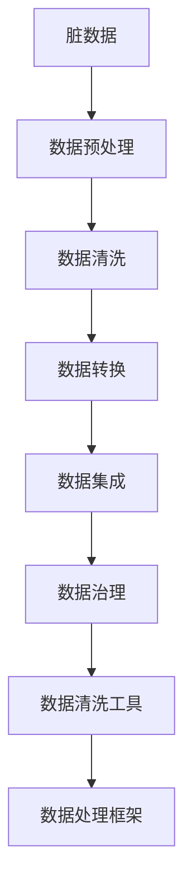
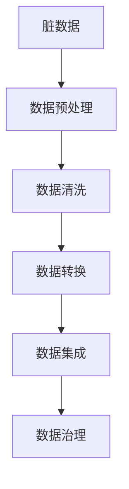
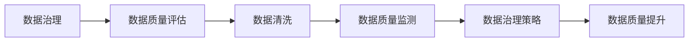

                 

# 数据清洗：软件2.0开发中的大头

> 关键词：数据清洗,软件2.0,数据质量,数据管理,数据治理,数据清洗工具,数据处理框架,数据清洗流程

## 1. 背景介绍

### 1.1 问题由来
在软件2.0时代，数据成为了决定应用程序成败的关键因素。无论是数据分析、机器学习，还是商业智能应用，都需要依赖高质量的数据来提供支撑。然而，数据在采集、传输、存储和处理过程中，不可避免地会受到各种噪声和异常数据的污染，这些数据被称为"脏数据"。

脏数据不仅影响数据分析的准确性，还会给业务决策带来误导。因此，数据清洗成为了软件2.0开发中的重要环节。数据清洗是一个繁琐而复杂的过程，包括识别、纠正和处理数据中的错误、不完整、重复和不合规等问题。高效、准确的数据清洗能够显著提升数据质量和应用性能。

### 1.2 问题核心关键点
数据清洗的核心在于识别和处理数据中的各种问题，如缺失值、重复记录、异常值、错误值等。数据清洗的流程通常包括数据收集、数据探索、数据预处理、数据转换和数据集成等多个环节，每个环节都需要精细的设计和实现。

数据清洗的目的是提升数据的质量和一致性，为后续的数据分析和模型训练奠定基础。清洗后的数据能更好地反映真实世界的情况，帮助用户做出更加准确的决策。

### 1.3 问题研究意义
数据清洗对于提升数据质量、减少错误和冗余、降低计算成本等方面具有重要意义：

1. **提升数据质量**：通过清洗，确保数据的一致性、完整性和准确性，为数据分析和模型训练提供高质量的输入。
2. **减少错误和冗余**：清洗后的数据更精简、更规范，减少了因数据问题引起的错误和冗余。
3. **降低计算成本**：干净的数据能更高效地进行计算，减少因处理脏数据而产生的计算开销。
4. **提高应用性能**：清洗后的数据能更好地反映真实世界的情况，提高应用模型的性能和预测精度。
5. **促进数据治理**：数据清洗是数据治理的重要组成部分，有助于建立数据质量管理体系，提高数据治理的效率和效果。

## 2. 核心概念与联系

### 2.1 核心概念概述

为更好地理解数据清洗的过程和原理，本节将介绍几个密切相关的核心概念：

- **脏数据(Dirty Data)**：在数据采集、传输、存储和处理过程中，受到各种噪声和异常数据的污染，导致数据质量下降的数据。
- **数据清洗(Data Cleaning)**：识别和纠正数据中的错误、不完整、重复和不合规等问题，提升数据质量的过程。
- **数据预处理(Preprocessing)**：在进行数据清洗前，对原始数据进行格式转换、标准化等处理，以确保后续清洗和分析的顺利进行。
- **数据转换(Transformations)**：在数据清洗过程中，对数据进行格式转换、填充缺失值、处理异常值等操作，以提升数据质量。
- **数据集成(Integration)**：将多个来源的数据进行合并和整合，确保数据的一致性和完整性。
- **数据治理(Data Governance)**：通过建立数据质量管理体系，对数据进行管理和维护，确保数据的质量和一致性。

这些核心概念之间的逻辑关系可以通过以下Mermaid流程图来展示：



这个流程图展示了数据清洗过程中各个关键环节之间的关系：

1. 原始数据经过预处理，去除不必要的噪声和冗余，为后续清洗和分析提供干净的数据输入。
2. 数据清洗过程识别和纠正数据中的错误、不完整、重复和不合规等问题，提升数据质量。
3. 数据转换过程对数据进行格式转换、填充缺失值、处理异常值等操作，确保数据的格式一致和准确性。
4. 数据集成过程将多个来源的数据进行合并和整合，确保数据的一致性和完整性。
5. 数据治理过程通过建立数据质量管理体系，对数据进行管理和维护，确保数据的质量和一致性。

这些概念共同构成了数据清洗的整体框架，使得原始数据能够转化为可用于分析和应用的高质量数据。通过理解这些核心概念，我们可以更好地把握数据清洗的工作原理和优化方向。

### 2.2 概念间的关系

这些核心概念之间存在着紧密的联系，形成了数据清洗的完整生态系统。下面我通过几个Mermaid流程图来展示这些概念之间的关系。

#### 2.2.1 数据清洗的一般流程



这个流程图展示了数据清洗的一般流程：

1. 脏数据经过预处理，去除噪声和冗余，为后续清洗和分析提供干净的数据输入。
2. 数据清洗过程识别和纠正数据中的错误、不完整、重复和不合规等问题，提升数据质量。
3. 数据转换过程对数据进行格式转换、填充缺失值、处理异常值等操作，确保数据的格式一致和准确性。
4. 数据集成过程将多个来源的数据进行合并和整合，确保数据的一致性和完整性。
5. 数据治理过程通过建立数据质量管理体系，对数据进行管理和维护，确保数据的质量和一致性。

#### 2.2.2 数据治理与数据清洗的关系



这个流程图展示了数据治理与数据清洗之间的关系：

1. 数据治理过程通过评估数据质量，识别数据中的问题，触发数据清洗流程。
2. 数据清洗过程对数据进行清洗，提升数据质量。
3. 数据质量监测过程持续监控数据质量，反馈给数据治理策略，优化数据治理过程。
4. 数据质量提升过程通过改进数据收集、存储、处理等环节，提高数据质量，优化数据治理效果。

通过这些流程图，我们可以更清晰地理解数据清洗过程中各个环节的相互关系，为后续深入讨论具体的清洗方法和技术奠定基础。

## 3. 核心算法原理 & 具体操作步骤
### 3.1 算法原理概述

数据清洗的算法原理主要包括两个方面：

1. **数据预处理**：对原始数据进行格式转换、标准化等处理，以确保后续清洗和分析的顺利进行。
2. **数据清洗和转换**：识别和纠正数据中的错误、不完整、重复和不合规等问题，提升数据质量。

数据预处理和数据清洗是数据清洗的两个主要步骤，通常会按顺序进行。

### 3.2 算法步骤详解

数据清洗和转换的算法步骤通常包括以下几个关键步骤：

**Step 1: 数据预处理**

数据预处理是数据清洗的第一步，其主要目的是为后续清洗和分析提供干净的数据输入。数据预处理包括以下几个步骤：

1. **数据格式转换**：将数据转换为统一格式，如将日期格式统一为标准格式，将字符串转换为数字格式等。
2. **数据标准化**：对数据进行标准化处理，如将小数点后的位数统一，将不同单位的数值统一转换为标准单位等。
3. **数据归一化**：对数据进行归一化处理，如将数据缩放到0到1之间，或归一化到标准正态分布等。

**Step 2: 数据清洗**

数据清洗过程是数据清洗的核心步骤，其主要目的是识别和纠正数据中的错误、不完整、重复和不合规等问题，提升数据质量。数据清洗包括以下几个关键步骤：

1. **缺失值处理**：识别和填补缺失值，可以使用均值、中位数、插值等方法。
2. **重复记录处理**：识别和去除重复记录，可以使用唯一标识符、哈希值等方法。
3. **异常值处理**：识别和处理异常值，可以使用截断、替换等方法。
4. **错误值处理**：识别和纠正错误值，可以使用规则匹配、模式识别等方法。

**Step 3: 数据转换**

数据转换过程是数据清洗的第三个步骤，其主要目的是对数据进行格式转换、填充缺失值、处理异常值等操作，以提升数据质量。数据转换包括以下几个关键步骤：

1. **数据格式化**：对数据进行格式化处理，如将日期格式转换为标准格式，将字符串转换为数字格式等。
2. **数据填充**：对缺失值进行填充，可以使用均值、中位数、插值等方法。
3. **数据变换**：对数据进行变换处理，如对数值型数据进行对数变换、对数变换等。

**Step 4: 数据集成**

数据集成过程是数据清洗的最后一个步骤，其主要目的是将多个来源的数据进行合并和整合，确保数据的一致性和完整性。数据集成包括以下几个关键步骤：

1. **数据合并**：将多个数据源合并为一个数据集，使用唯一标识符进行匹配。
2. **数据去重**：去除重复记录，确保数据的一致性。
3. **数据补全**：对缺失数据进行补全，确保数据的完整性。

### 3.3 算法优缺点

数据清洗算法具有以下优点：

1. **提升数据质量**：通过清洗和转换，数据质量得到显著提升，为后续数据分析和应用提供可靠的数据输入。
2. **减少错误和冗余**：清洗后的数据更精简、更规范，减少了因数据问题引起的错误和冗余。
3. **降低计算成本**：干净的数据能更高效地进行计算，减少因处理脏数据而产生的计算开销。

数据清洗算法也存在以下缺点：

1. **清洗过程繁琐**：数据清洗过程需要耗费大量时间和精力，需要细致入微的处理。
2. **自动化程度不高**：当前的数据清洗算法仍需要大量人工干预，自动化程度不高。
3. **精度和效果有限**：数据清洗算法的精度和效果受数据质量的影响较大，无法保证完全消除所有问题。

### 3.4 算法应用领域

数据清洗技术在各个领域都有广泛的应用，包括但不限于以下几个方面：

- **数据分析**：在数据分析中，数据清洗是数据预处理的重要环节，直接影响分析结果的准确性和可靠性。
- **机器学习**：在机器学习中，数据清洗能够提高模型训练的效果和预测精度，减少因数据问题引起的误差。
- **商业智能**：在商业智能中，数据清洗能够提升数据质量，帮助企业做出更加准确的市场决策。
- **金融分析**：在金融分析中，数据清洗能够提高数据质量，帮助金融机构识别风险和机会。
- **健康医疗**：在健康医疗中，数据清洗能够提高数据质量，帮助医疗机构提高诊疗水平。
- **公共安全**：在公共安全中，数据清洗能够提高数据质量，帮助政府部门做出更加精准的决策。

## 4. 数学模型和公式 & 详细讲解 & 举例说明
### 4.1 数学模型构建

数据清洗的数学模型通常包括两个方面：

1. **数据预处理模型**：对原始数据进行格式转换、标准化等处理，以确保后续清洗和分析的顺利进行。
2. **数据清洗和转换模型**：识别和纠正数据中的错误、不完整、重复和不合规等问题，提升数据质量。

### 4.2 公式推导过程

**数据预处理模型**

对于数据格式转换，可以使用以下公式：

$$
y = f(x)
$$

其中，$x$ 为原始数据，$y$ 为转换后的数据，$f$ 为转换函数。例如，将日期格式转换为标准格式，可以使用以下公式：

$$
y = \frac{x}{1000} + 1970-01-01
$$

其中，$x$ 为原始日期，$y$ 为转换后的日期，$1970-01-01$ 为标准日期。

**数据清洗模型**

对于缺失值处理，可以使用以下公式：

$$
\hat{y} = f(x)
$$

其中，$x$ 为原始数据，$\hat{y}$ 为填充后的数据，$f$ 为填充函数。例如，使用均值填充缺失值，可以使用以下公式：

$$
\hat{y} = \frac{1}{N} \sum_{i=1}^N x_i
$$

其中，$N$ 为数据总数，$x_i$ 为原始数据。

对于异常值处理，可以使用以下公式：

$$
\hat{y} = f(x)
$$

其中，$x$ 为原始数据，$\hat{y}$ 为处理后的数据，$f$ 为处理函数。例如，使用截断处理异常值，可以使用以下公式：

$$
\hat{y} = 
\begin{cases} 
x & \text{if } |x| < a \\
a & \text{if } |x| \geq a 
\end{cases}
$$

其中，$x$ 为原始数据，$a$ 为阈值。

### 4.3 案例分析与讲解

假设我们有一个客户关系管理系统(CRM)的数据集，包含了客户的基本信息和交易记录。在使用该数据集进行数据分析和模型训练之前，我们需要对其进行清洗和转换，以提升数据质量。

**数据预处理**

首先，我们需要对数据进行格式转换，将日期格式统一为标准格式，将字符串转换为数字格式。例如，将日期格式转换为标准格式，可以使用以下公式：

$$
y = \frac{x}{1000} + 1970-01-01
$$

其中，$x$ 为原始日期，$y$ 为转换后的日期，$1970-01-01$ 为标准日期。

**数据清洗**

接下来，我们需要对数据进行清洗，识别和纠正数据中的错误、不完整、重复和不合规等问题。

假设我们发现客户ID中有一些重复的记录，需要去除重复记录。可以使用以下公式：

$$
y = f(x)
$$

其中，$x$ 为原始数据，$y$ 为处理后的数据，$f$ 为处理函数。例如，使用唯一标识符去除重复记录，可以使用以下公式：

$$
y = \text{unique}(x)
$$

其中，$x$ 为原始数据，$y$ 为处理后的数据。

**数据转换**

最后，我们需要对数据进行转换，确保数据的格式一致和准确性。

假设我们发现某些客户的交易金额为负数，需要将其转换为正数。可以使用以下公式：

$$
y = f(x)
$$

其中，$x$ 为原始数据，$y$ 为转换后的数据，$f$ 为转换函数。例如，将负数转换为正数，可以使用以下公式：

$$
y = |x|
$$

其中，$x$ 为原始数据，$y$ 为处理后的数据。

通过上述数据预处理、数据清洗和数据转换，我们得到了一个干净的数据集，可以用于后续的数据分析和模型训练。

## 5. 项目实践：代码实例和详细解释说明
### 5.1 开发环境搭建

在进行数据清洗项目实践前，我们需要准备好开发环境。以下是使用Python进行PyTorch开发的环境配置流程：

1. 安装Anaconda：从官网下载并安装Anaconda，用于创建独立的Python环境。

2. 创建并激活虚拟环境：
```bash
conda create -n pytorch-env python=3.8 
conda activate pytorch-env
```

3. 安装PyTorch：根据CUDA版本，从官网获取对应的安装命令。例如：
```bash
conda install pytorch torchvision torchaudio cudatoolkit=11.1 -c pytorch -c conda-forge
```

4. 安装Pandas和NumPy：
```bash
pip install pandas numpy
```

5. 安装Matplotlib和Seaborn：
```bash
pip install matplotlib seaborn
```

6. 安装Scikit-learn：
```bash
pip install scikit-learn
```

完成上述步骤后，即可在`pytorch-env`环境中开始数据清洗实践。

### 5.2 源代码详细实现

下面我们以客户关系管理系统(CRM)数据集为例，给出使用Pandas库进行数据清洗的PyTorch代码实现。

```python
import pandas as pd
import numpy as np
from sklearn.preprocessing import MinMaxScaler

# 读取数据集
data = pd.read_csv('customer_relationship_management.csv')

# 数据预处理
# 将日期格式转换为标准格式
data['date'] = pd.to_datetime(data['date'], format='%Y-%m-%d')
data['date'] = (data['date'] - pd.to_datetime('1970-01-01')).dt.days

# 数据清洗
# 去除重复记录
data = data.drop_duplicates()

# 数据转换
# 将负数转换为正数
data['amount'] = np.abs(data['amount'])

# 数据可视化
import matplotlib.pyplot as plt
import seaborn as sns

sns.histplot(data['amount'], kde=True)
plt.show()
```

在这个例子中，我们首先使用Pandas库读取客户关系管理系统(CRM)的数据集。然后，我们对数据进行预处理，将日期格式转换为标准格式，去除重复记录。最后，我们对数据进行转换，将负数转换为正数，并使用Matplotlib和Seaborn库进行数据可视化。

### 5.3 代码解读与分析

让我们再详细解读一下关键代码的实现细节：

**数据预处理**

- `pd.to_datetime`函数：将日期格式转换为标准日期格式。
- `np.abs`函数：将负数转换为正数。

**数据清洗**

- `data.drop_duplicates`函数：去除重复记录。

**数据可视化**

- `sns.histplot`函数：绘制直方图和核密度估计曲线。

通过这些代码，我们可以看到Pandas库在数据清洗和可视化方面的强大功能。它不仅可以帮助我们进行基础的数据处理，还能进行更高级的数据分析和可视化。

当然，在实际应用中，我们还需要结合具体任务和数据特点，灵活使用各种数据清洗和转换方法。例如，在处理缺失值时，可以使用均值、中位数、插值等方法；在处理异常值时，可以使用截断、替换等方法；在数据集成时，可以使用唯一标识符、哈希值等方法。

## 6. 实际应用场景
### 6.1 智能客服系统

基于数据清洗技术的智能客服系统，可以极大地提升客户咨询体验和问题解决效率。传统客服系统往往需要人工手动处理客户咨询数据，效率低下且容易出错。使用数据清洗技术，可以自动清洗和分析客户咨询数据，快速识别和解决常见问题。

在技术实现上，可以收集客户咨询记录，提取问题和最佳答复，构建监督数据集。然后，使用数据清洗技术对原始数据进行清洗和转换，确保数据的一致性和准确性。最后，使用清洗后的数据进行模型训练，构建智能客服系统。

### 6.2 金融舆情监测

金融机构需要实时监测市场舆论动向，以便及时应对负面信息传播，规避金融风险。传统的人工舆情监测方式成本高、效率低，难以应对网络时代海量信息爆发的挑战。使用数据清洗技术，可以自动清洗和分析网络舆情数据，快速识别和响应负面信息。

在技术实现上，可以收集金融领域相关的新闻、报道、评论等文本数据，并进行数据清洗和预处理。然后，使用数据清洗技术去除噪声和异常数据，提升数据质量。最后，使用清洗后的数据进行模型训练，构建金融舆情监测系统。

### 6.3 个性化推荐系统

当前的推荐系统往往只依赖用户的历史行为数据进行物品推荐，无法深入理解用户的真实兴趣偏好。使用数据清洗技术，可以自动清洗和分析用户行为数据，提升推荐系统的准确性和个性化程度。

在技术实现上，可以收集用户浏览、点击、评论、分享等行为数据，并进行数据清洗和预处理。然后，使用数据清洗技术去除噪声和异常数据，提升数据质量。最后，使用清洗后的数据进行模型训练，构建个性化推荐系统。

### 6.4 未来应用展望

随着数据清洗技术的不断发展，其在各个领域的应用前景将更加广阔。

在智慧医疗领域，数据清洗技术可以帮助医疗机构清洗和分析患者数据，提升医疗决策的准确性和效率。

在智能教育领域，数据清洗技术可以帮助教育机构清洗和分析学生数据，提升教育质量。

在智慧城市治理中，数据清洗技术可以帮助城市管理部门清洗和分析城市运行数据，提升城市管理效率。

此外，在企业生产、社会治理、文娱传媒等众多领域，数据清洗技术也将不断涌现，为各个领域带来变革性影响。相信随着技术的日益成熟，数据清洗技术将在构建智能社会中扮演越来越重要的角色。

## 7. 工具和资源推荐
### 7.1 学习资源推荐

为了帮助开发者系统掌握数据清洗的理论基础和实践技巧，这里推荐一些优质的学习资源：

1. 《数据清洗实用指南》：介绍数据清洗的各个环节，包括数据预处理、数据清洗和数据转换等，适合初学者入门。

2. 《数据清洗进阶实战》：深入探讨数据清洗的高级技巧，如缺失值处理、异常值处理等，适合有一定基础的学习者。

3. 《数据清洗与数据治理》：全面讲解数据清洗和数据治理的原理和方法，适合深度学习开发者。

4. 《大数据清洗技术与应用》：介绍大数据时代的数据清洗技术，包括分布式数据清洗等高级技术。

5. 《数据清洗与数据管理》：系统讲解数据清洗与数据管理的各个环节，适合数据科学家和分析师。

通过对这些资源的学习实践，相信你一定能够快速掌握数据清洗的精髓，并用于解决实际的数据处理问题。

### 7.2 开发工具推荐

高效的数据清洗离不开优秀的工具支持。以下是几款用于数据清洗开发的常用工具：

1. Pandas：Python数据处理库，支持数据清洗和预处理，具有强大的数据处理能力和灵活的操作方式。

2. NumPy：Python数值计算库，支持数组操作和数学计算，适合进行数据清洗和转换。

3. Scikit-learn：Python机器学习库，支持数据清洗和预处理，包括各种数据清洗算法和工具。

4. Matplotlib和Seaborn：Python可视化库，支持数据可视化和分析，帮助开发者更好地理解数据。

5. TensorBoard：TensorFlow配套的可视化工具，支持数据可视化和调试，适合进行数据清洗和预处理。

6. Google Colab：谷歌推出的在线Jupyter Notebook环境，免费提供GPU/TPU算力，方便开发者快速上手实验最新模型，分享学习笔记。

合理利用这些工具，可以显著提升数据清洗的开发效率，加快创新迭代的步伐。

### 7.3 相关论文推荐

数据清洗技术的发展源于学界的持续研究。以下是几篇奠基性的相关论文，推荐阅读：

1. "A Survey of Data Cleaning in Data Mining"（数据清洗综述）：由数据挖掘领域专家撰写，全面介绍了数据清洗的基本概念和常用方法。

2. "Data Cleaning: A Survey"（数据清洗综述）：由数据库领域专家撰写，全面介绍了数据清洗的基本概念和常用技术。

3. "Practical Data Cleaning Techniques for High-Volume Datasets"（高容量数据集的数据清洗技术）：介绍了数据清洗在高容量数据集上的实用技术，适合大数据领域的开发者。

4. "Automatic Data Cleaning for Big Data: A Survey"（大数据自动数据清洗综述）：由大数据领域专家撰写，全面介绍了大数据背景下数据清洗的最新进展和技术。

5. "Data Cleaning Techniques for Big Data Analytics"（大数据分析中的数据清洗技术）：介绍了大数据分析中的数据清洗技术，适合大数据领域的开发者。

这些论文代表了大数据时代数据清洗技术的发展脉络。通过学习这些前沿成果，可以帮助研究者把握学科前进方向，激发更多的创新灵感。

除上述资源外，还有一些值得关注的前沿资源，帮助开发者紧跟数据清洗技术的最新进展，例如：

1. arXiv论文预印本：人工智能领域最新研究成果的发布平台，包括大量尚未发表的前沿工作，学习前沿技术的必读资源。

2. 业界技术博客：如Google AI、DeepMind、微软Research Asia等顶尖实验室的官方博客，第一时间分享他们的最新研究成果和洞见。

3. 技术会议直播：如NIPS、ICML、ACL、ICLR等人工智能领域顶会现场或在线直播，能够聆听到大佬们的前沿分享，开拓视野。

4. GitHub热门项目：在GitHub上Star、Fork数最多的数据清洗相关项目，往往代表了该技术领域的发展趋势和最佳实践，值得去学习和贡献。

5. 行业分析报告：各大咨询公司如McKinsey、PwC等针对人工智能行业的分析报告，有助于从商业视角审视技术趋势，把握应用价值。

总之，对于数据清洗技术的掌握，需要开发者保持开放的心态和持续学习的意愿。多关注前沿资讯，多动手实践，多思考总结，必将收获满满的成长收益。

## 8. 总结：未来发展趋势与挑战
### 8.1 总结

本文对数据清洗的过程和原理进行了全面系统的介绍。首先阐述了数据清洗的重要性，明确了数据清洗在提升数据质量、减少错误和冗余、降低计算成本等方面具有重要意义。其次，从原理到实践，详细讲解了数据清洗的数学原理和关键步骤，给出了数据清洗任务开发的完整代码实例。同时，本文还广泛探讨了数据清洗技术在各个领域的应用前景，展示了数据清洗技术的巨大潜力。

通过本文的系统梳理，可以看到，数据清洗技术在提升数据质量、减少错误和冗余、降低计算成本等方面具有重要意义。未来，随着数据量的不断增长和数据种类的不断丰富，数据清洗技术将变得更加重要，成为数据处理的核心环节。

### 8.2 未来发展趋势

展望未来，数据清洗技术将呈现以下几个发展趋势：

1. **自动化和智能化

