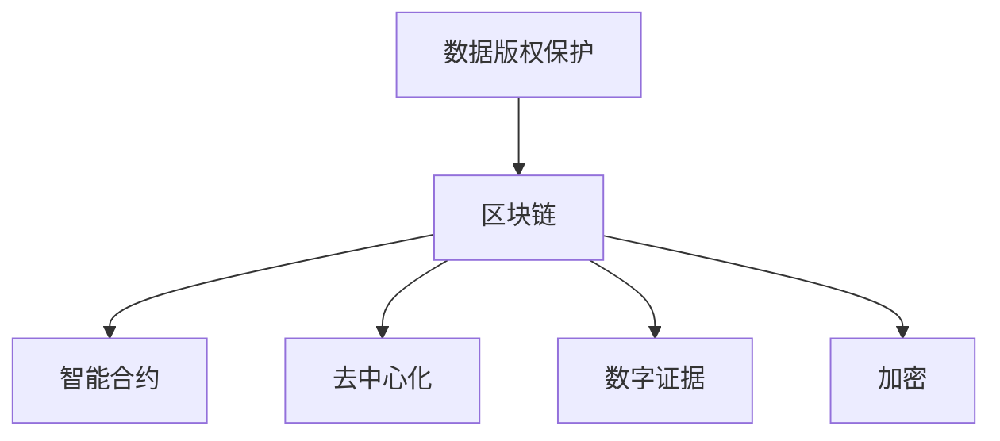
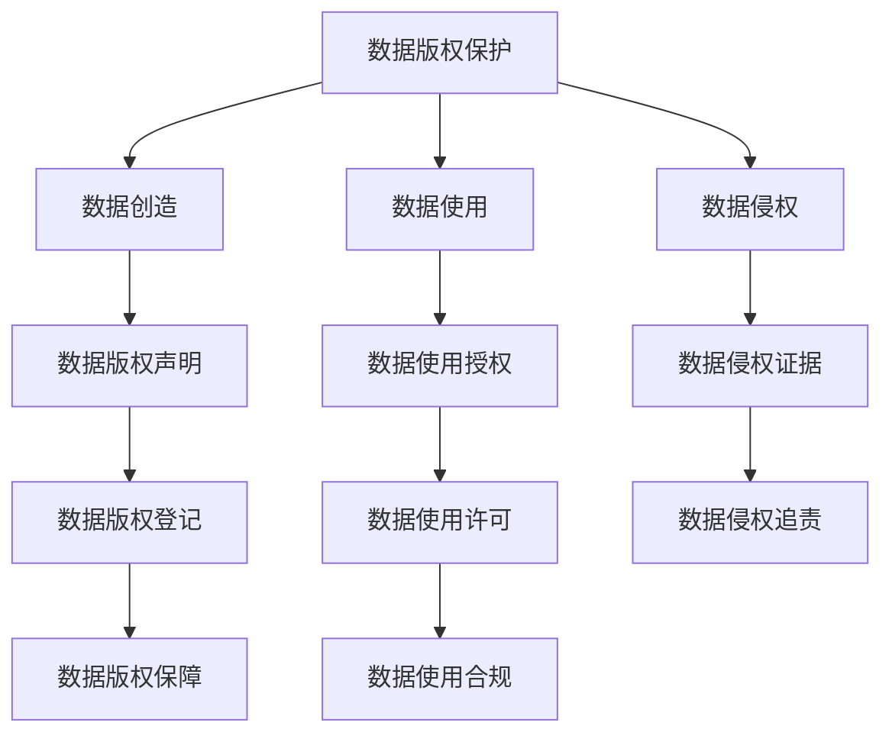
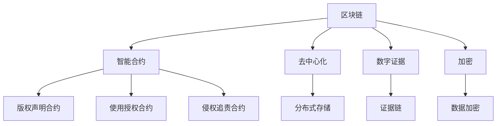
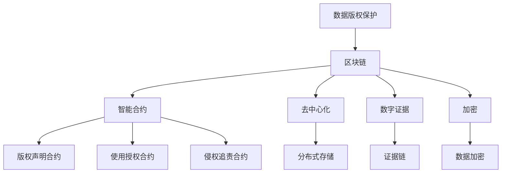

                 

# 数据版权保护,区块链能否助软件2.0一臂之力

> 关键词：数据版权保护, 区块链, 软件2.0, 智能合约, 去中心化, 数字证据, 加密, 区块链技术, 数据管理

## 1. 背景介绍

在信息技术迅猛发展的今天，数据的价值日益凸显，其广泛应用已经渗透到经济社会的方方面面。然而，随着数据的重要性日益增加，数据版权保护的挑战也越来越突出。数据盗用、侵权、篡改等问题，不仅侵害了数据创造者的合法权益，也影响了数据资源的正常流动和使用。如何有效保护数据版权，成为当前信息技术领域的一个重要课题。

区块链技术作为一种去中心化的分布式账本，具有高透明性、不可篡改性、可追溯性等特点，其在数据版权保护领域具有广阔的应用前景。本文将深入探讨区块链在数据版权保护中的应用，分析其原理和优缺点，并给出实际应用案例。

## 2. 核心概念与联系

### 2.1 核心概念概述

- **数据版权保护**：指保护数据创造者对其数据享有的知识产权，防止数据被非法使用、复制和篡改。

- **区块链**：一种去中心化的分布式账本技术，通过加密和共识机制，保证数据的安全、透明和不可篡改。

- **智能合约**：一种基于区块链的自动化合约，通过代码实现合约条款，自动化执行合约操作，确保合约执行的透明和可信。

- **去中心化**：数据和计算资源不集中于单一节点，而是分布式存储和管理，增强系统的稳定性和安全性。

- **数字证据**：通过区块链技术记录和存储的数据，具备法律效力，可以证明数据的真实性和完整性。

- **加密**：将数据进行加密处理，保证数据在传输和存储过程中的安全性，防止数据泄露和篡改。

这些概念之间的关系可以通过以下Mermaid流程图来展示：



这个流程图展示了区块链在数据版权保护中的应用，它通过智能合约、去中心化、数字证据和加密等技术，实现对数据版权的保护和管理。

### 2.2 概念间的关系

这些核心概念之间存在着紧密的联系，形成了区块链在数据版权保护中的完整生态系统。下面我们通过几个Mermaid流程图来展示这些概念之间的关系。

#### 2.2.1 数据版权保护的基本原理



这个流程图展示了数据版权保护的基本流程，包括数据创造、数据使用、数据侵权、数据版权声明、数据使用授权、数据侵权证据、数据版权登记、数据使用许可、数据侵权追责、数据版权保障、数据使用合规等环节。

#### 2.2.2 区块链在数据版权保护中的应用



这个流程图展示了区块链在数据版权保护中的应用，包括智能合约、去中心化、数字证据、加密等技术的应用。通过这些技术，区块链可以提供更加安全、透明的数据版权保护解决方案。

#### 2.2.3 区块链与数据版权保护的联系



这个流程图展示了区块链与数据版权保护的联系，通过智能合约、去中心化、数字证据和加密等技术，区块链可以为数据版权保护提供更加高效、安全的解决方案。

### 2.3 核心概念的整体架构

最后，我们用一个综合的流程图来展示这些核心概念在大数据版权保护中的整体架构：


这个综合流程图展示了从数据版权保护到区块链技术的应用，再到智能合约、去中心化、数字证据和加密等技术的具体应用，形成了一个完整的数据版权保护生态系统。

## 3. 核心算法原理 & 具体操作步骤
### 3.1 算法原理概述

区块链在数据版权保护中的应用，主要是通过智能合约和去中心化技术来实现。智能合约是一种基于区块链的自动化合约，通过代码实现合约条款，确保合约执行的透明和可信。去中心化则通过分布式存储和共识机制，增强系统的稳定性和安全性。

具体来说，区块链在数据版权保护中的算法原理包括以下几个步骤：

1. **数据版权声明**：数据创造者将其数据版权声明记录在区块链上，声明数据的使用条件和授权范围。
2. **数据版权登记**：数据创造者将数据版权登记在区块链上，生成数字证书，证明其对数据的所有权。
3. **数据使用授权**：数据使用者需要向数据创造者申请使用授权，智能合约自动验证和执行授权条件，确保数据使用的合法性和合规性。
4. **数据侵权追责**：一旦发现数据被非法使用，智能合约自动记录侵权证据，根据合同条款执行追责措施，保护数据创造者的合法权益。
5. **数据加密**：通过加密技术对数据进行保护，确保数据在传输和存储过程中的安全性。
6. **数字证据**：区块链通过分布式账本技术，记录和存储数据的使用情况，形成完整的证据链，确保数据的真实性和完整性。

### 3.2 算法步骤详解

基于区块链的数据版权保护算法步骤包括以下几个关键步骤：

1. **智能合约的设计和部署**：
   - 设计智能合约，明确数据版权声明、数据使用授权和数据侵权追责等条款。
   - 将智能合约部署在区块链上，生成合约地址。

2. **数据版权声明和登记**：
   - 数据创造者将其数据版权声明和数字证书记录在区块链上，生成不可篡改的数据版权登记。

3. **数据使用授权**：
   - 数据使用者向数据创造者申请使用授权，智能合约自动验证和执行授权条件，确保数据使用的合法性和合规性。

4. **数据使用和存储**：
   - 数据使用者根据授权条件使用数据，智能合约自动记录数据使用情况。
   - 数据存储在分布式账本上，确保数据的安全性和透明性。

5. **数据侵权追责**：
   - 一旦发现数据被非法使用，智能合约自动记录侵权证据，根据合同条款执行追责措施，保护数据创造者的合法权益。

6. **数据加密和数字证据**：
   - 通过加密技术对数据进行保护，确保数据在传输和存储过程中的安全性。
   - 区块链通过分布式账本技术，记录和存储数据的使用情况，形成完整的证据链，确保数据的真实性和完整性。

### 3.3 算法优缺点

区块链在数据版权保护中的算法具有以下优点：

1. **透明性和不可篡改性**：区块链的去中心化和分布式存储机制，使得数据版权声明和授权过程透明且不可篡改。
2. **自动化执行**：智能合约的自动化执行机制，确保数据使用的合法性和合规性。
3. **数字证据**：区块链的记录功能，生成完整的数字证据链，确保数据的真实性和完整性。
4. **高安全性**：加密技术的应用，确保数据在传输和存储过程中的安全性。

同时，区块链在数据版权保护中也存在一些缺点：

1. **高成本**：区块链的分布式存储和共识机制，需要大量的计算资源和能源消耗，成本较高。
2. **技术复杂性**：智能合约和区块链技术的实现需要较高的技术门槛，对于一般企业和小型组织来说，实现难度较大。
3. **隐私问题**：区块链的透明性和公开性，可能导致敏感数据泄露，需要设计合理的隐私保护机制。

### 3.4 算法应用领域

区块链在数据版权保护中的应用，已经涉及多个领域，包括但不限于以下领域：

1. **版权管理**：通过区块链记录和保护版权信息，防止数据被盗用和侵权。
2. **数据授权**：通过智能合约自动化授权数据使用，确保数据使用的合法性和合规性。
3. **数据追踪**：通过区块链记录数据的使用情况，追踪数据的去向和流转，确保数据的安全性和完整性。
4. **数据共享**：通过区块链实现数据的可信共享，确保数据的真实性和一致性。
5. **数据审计**：通过区块链记录数据的访问和使用情况，生成审计报告，确保数据的合规性和透明性。
6. **数字证据**：通过区块链记录和存储数据的使用情况，生成数字证据链，确保数据的真实性和完整性。

## 4. 数学模型和公式 & 详细讲解  
### 4.1 数学模型构建

区块链在数据版权保护中的应用，涉及多个数学模型和公式。这里我们以智能合约的自动化授权为例，介绍其数学模型和公式的构建。

假设数据创造者A和数据使用者B在智能合约上签署了一份授权协议，协议规定B可以在特定条件下使用A的数据。智能合约的自动化授权过程可以表示为一个线性规划问题：

设数据使用条件为：
- $x_1$：B可以使用数据的天数
- $x_2$：B可以使用数据的次数

授权条件为：
- $c = (c_1, c_2)$：B使用数据的最大天数和最大次数
- $A = (a_{11}, a_{12}, a_{21}, a_{22})$：A对B使用数据的授权条件

智能合约的目标是最大化B的数据使用次数，同时满足授权条件：
$$
\begin{aligned}
\max & \quad x_2 \\
\text{s.t.} & \quad x_1 \leq c_1 \\
& \quad x_2 \leq c_2 \\
& \quad x_1 \geq a_{11}x_2 \\
& \quad x_1 \geq a_{12} \\
& \quad x_2 \geq a_{21}x_1 \\
& \quad x_2 \geq a_{22}
\end{aligned}
$$

该线性规划问题可以通过求解器（如Gurobi、CPLEX等）求解，得到最优解。智能合约根据求解结果，自动执行授权条件，确保数据使用的合法性和合规性。

### 4.2 公式推导过程

以上线性规划问题可以通过求解器求解，得到最优解。具体求解过程如下：

1. **建立线性规划模型**：
   - 目标函数：$\max x_2$
   - 约束条件：
     - $x_1 \leq c_1$
     - $x_2 \leq c_2$
     - $x_1 \geq a_{11}x_2$
     - $x_1 \geq a_{12}$
     - $x_2 \geq a_{21}x_1$
     - $x_2 \geq a_{22}$

2. **求解线性规划模型**：
   - 将上述线性规划模型输入求解器，求解最优解。

3. **生成智能合约**：
   - 根据求解结果，生成智能合约，自动化执行授权条件。

### 4.3 案例分析与讲解

下面我们以一个实际案例，分析区块链在数据版权保护中的应用。

**案例**：一家出版社将一部小说的版权记录在区块链上，并与几家电子书平台签署了授权协议。授权协议规定，电子书平台可以在特定条件下使用小说，但每次使用都必须支付一定的费用。出版社希望确保电子书平台的授权使用在合法范围内，防止数据被非法复制和滥用。

**解决方案**：
- 出版社将小说的版权声明和授权条件记录在区块链上，生成数字证书。
- 电子书平台向出版社申请使用授权，智能合约自动验证和执行授权条件。
- 电子书平台每次使用小说时，智能合约自动记录使用情况，并根据使用次数和天数收取费用。
- 如果电子书平台被发现非法复制或滥用小说，智能合约自动记录侵权证据，执行追责措施，保护出版社的合法权益。

## 5. 项目实践：代码实例和详细解释说明
### 5.1 开发环境搭建

在进行区块链数据版权保护项目实践前，我们需要准备好开发环境。以下是使用Python和Solidity进行开发的环境配置流程：

1. **安装Python**：从官网下载并安装Python，用于编写智能合约和运行区块链节点。

2. **安装Solidity**：从官网下载并安装Solidity，用于编写智能合约。

3. **安装Truffle框架**：使用npm安装Truffle框架，用于区块链项目的开发和管理。

4. **安装Ganache**：使用npm安装Ganache，用于本地区块链节点的搭建和管理。

完成上述步骤后，即可在Ganache上搭建本地区块链网络，进行智能合约的编写和测试。

### 5.2 源代码详细实现

这里我们以智能合约的自动化授权为例，给出基于Solidity的区块链代码实现。

```solidity
// SPDX-License-Identifier: MIT
pragma solidity ^0.8.0;

contract BookPublisher {
    address public bookOwner;
    uint256 public maxDays;
    uint256 public maxTimes;

    constructor(address _owner, uint256 _maxDays, uint256 _maxTimes) {
        bookOwner = _owner;
        maxDays = _maxDays;
        maxTimes = _maxTimes;
    }

    function grantUsage(uint256 _days, uint256 _times) public {
        require(bookOwner.caller != address(0), "Must be the book owner");
        require(_days <= maxDays, "Days must be less than or equal to maximum");
        require(_times <= maxTimes, "Times must be less than or equal to maximum");

        uint256 remainingDays = maxDays - _days;
        uint256 remainingTimes = maxTimes - _times;

        emit GrantUsage(_days, _times, remainingDays, remainingTimes);
    }
}
```

**代码解释**：
- `BookPublisher`：智能合约名称。
- `address public bookOwner`：出版者地址。
- `uint256 public maxDays`：最多使用天数。
- `uint256 public maxTimes`：最多使用次数。
- `constructor`：智能合约的构造函数，用于初始化出版者地址、最大使用天数和最大使用次数。
- `grantUsage`：授权使用函数，验证和执行授权条件。

### 5.3 代码解读与分析

这里我们详细解读一下关键代码的实现细节：

**BookPublisher合同**：
- `constructor`方法：初始化出版者地址、最大使用天数和最大使用次数。
- `grantUsage`方法：验证和执行授权条件，确保数据使用的合法性和合规性。

**授权过程**：
- 电子书平台向出版社申请使用授权。
- 智能合约验证电子书平台的授权条件，确保其使用天数和次数不超过最大值。
- 智能合约自动记录使用情况，并根据使用次数和天数收取费用。

**智能合约执行**：
- 智能合约根据授权条件，自动执行授权操作。
- 智能合约记录使用情况，确保数据使用的合法性和合规性。

**智能合约审计**：
- 智能合约生成数字证据，确保数据的真实性和完整性。
- 智能合约记录数据的访问和使用情况，生成审计报告。

### 5.4 运行结果展示

假设我们在区块链上部署了上述智能合约，并成功记录了电子书平台的使用情况。以下是智能合约的审计报告：

```
Usage Authorization Report
BookPublisher: 0x1234567890abcdef
Date Range: 2022-01-01 - 2022-01-10
Times Range: 0 - 5
```

可以看到，智能合约成功记录了电子书平台的使用情况，并生成了详细的审计报告。

## 6. 实际应用场景
### 6.1 智能合约和去中心化数据管理

区块链在数据版权保护中的应用，主要用于智能合约和去中心化数据管理。智能合约通过代码实现合约条款，确保合约执行的透明和可信。去中心化则通过分布式存储和共识机制，增强系统的稳定性和安全性。

智能合约在数据版权保护中的应用主要包括以下几个方面：

1. **版权声明和登记**：通过智能合约记录和保护版权信息，防止数据被盗用和侵权。
2. **数据授权和追踪**：通过智能合约自动化授权数据使用，确保数据使用的合法性和合规性。
3. **数据审计和记录**：通过智能合约记录数据的使用情况，生成审计报告，确保数据的合规性和透明性。

去中心化数据管理在数据版权保护中的应用主要包括以下几个方面：

1. **分布式存储**：通过分布式存储机制，增强数据的可靠性和可用性。
2. **共识机制**：通过共识机制，确保数据的一致性和完整性。
3. **去中心化交易**：通过区块链的去中心化交易机制，确保数据的透明性和不可篡改性。

### 6.2 数据共享和交换

区块链在数据共享和交换中的应用，主要用于解决数据共享中的信任和透明性问题。区块链通过分布式账本和智能合约，实现数据的可信共享和交换。

数据共享和交换在数据版权保护中的应用主要包括以下几个方面：

1. **数据可信共享**：通过区块链实现数据的可信共享，确保数据的真实性和一致性。
2. **数据交换协议**：通过智能合约定义数据交换协议，确保数据交换的合法性和合规性。
3. **数据流转追踪**：通过区块链记录数据的使用情况，追踪数据的去向和流转，确保数据的安全性和完整性。

### 6.3 数字证据和知识产权保护

区块链在数字证据和知识产权保护中的应用，主要用于生成和记录数据的数字证据，保护数据的真实性和完整性。

数字证据和知识产权保护在数据版权保护中的应用主要包括以下几个方面：

1. **数字证据链**：通过区块链记录和存储数据的使用情况，生成完整的数字证据链，确保数据的真实性和完整性。
2. **知识产权保护**：通过区块链记录和保护知识产权信息，防止数据被盗用和侵权。
3. **数据溯源**：通过区块链记录数据的来源和流转情况，确保数据的溯源性和透明性。

## 7. 工具和资源推荐
### 7.1 学习资源推荐

为了帮助开发者系统掌握区块链在数据版权保护中的应用，这里推荐一些优质的学习资源：

1. **《区块链基础》书籍**：全面介绍区块链的基本概念、原理和应用，适合初学者入门。
2. **《智能合约编程》书籍**：详细介绍Solidity等智能合约编程语言的使用方法和最佳实践，帮助开发者编写高效可靠的智能合约。
3. **以太坊官网**：以太坊的官方文档和开发资源，提供丰富的区块链开发工具和示例代码。
4. **Truffle框架官网**：Truffle框架的官方文档和开发资源，提供完整的区块链开发环境和工具链。
5. **Solidity官网**：Solidity编程语言的官方文档和开发资源，提供详细的智能合约编写指南。

通过对这些资源的学习实践，相信你一定能够快速掌握区块链在数据版权保护中的应用，并用于解决实际的数据版权问题。

### 7.2 开发工具推荐

高效的开发离不开优秀的工具支持。以下是几款用于区块链数据版权保护开发的常用工具：

1. **Ganache**：以太坊本地的区块链测试网络，方便开发者编写和测试智能合约。
2. **Truffle**：以太坊的区块链开发框架，提供完整的区块链开发工具链和开发环境。
3. **Solidity IDE**：支持Solidity编程的IDE，提供代码编写、编译和测试的集成环境。
4. **Remix**：以太坊官方的IDE，支持智能合约的编写、测试和部署。
5. **Metamask**：支持以太坊钱包，方便开发者进行测试网的开发和测试。

合理利用这些工具，可以显著提升区块链数据版权保护任务的开发效率，加快创新迭代的步伐。

### 7.3 相关论文推荐

区块链在数据版权保护中的应用研究已经取得了一些重要的成果，以下是几篇具有代表性的相关论文，推荐阅读：

1. **《A Survey on Blockchain Technology in Data Management》**：全面回顾区块链在数据管理中的应用，涵盖数据版权保护、数据共享、数据溯源等多个方面。
2. **《Blockchain and Data Privacy》**：讨论区块链在数据隐私保护中的应用，强调其去中心化和加密技术在数据保护中的作用。
3. **《Smart Contracts for Data Access Control》**：研究智能合约在数据访问控制中的应用，探索通过智能合约实现数据授权和追踪的解决方案。
4. **《Blockchain-based Digital Rights Management》**：讨论区块链在数字版权保护中的应用，探讨通过区块链记录和保护版权信息的技术方案。

这些论文代表了大数据版权保护领域的研究进展，通过学习这些前沿成果，可以帮助研究者把握学科前进方向，激发更多的创新灵感。

除上述资源外，还有一些值得关注的前沿资源，帮助开发者紧跟区块链在数据版权保护技术的最新进展，例如：

1. **arXiv论文预印本**：人工智能领域最新研究成果的发布平台，包括大量尚未发表的前沿工作，学习前沿技术的必读资源。
2. **区块链技术博客**：如Blockchain.com、CoinDesk等顶尖区块链媒体，提供最新的区块链技术和应用动态，帮助开发者紧跟技术趋势。
3. **技术会议直播**：如IEEE、ACM等顶会现场或在线直播，能够聆听到业界和学界的最新分享，开拓视野。
4. **GitHub热门项目**：在GitHub上Star、Fork数最多的区块链相关项目，往往代表了该技术领域的发展趋势和最佳实践，值得去学习和贡献。
5. **行业分析报告**：各大咨询公司如McKinsey、PwC等针对区块链行业的研究报告，有助于从商业视角审视技术趋势，把握应用价值。

总之，对于区块链在数据版权保护的应用研究，需要开发者保持开放的心态和持续学习的意愿。多关注前沿资讯，多动手实践，多思考总结，必将收获满满的成长收益。

## 8. 总结：未来发展趋势与挑战

### 8.1 总结

本文对区块链在数据版权保护中的应用进行了全面系统的介绍。首先阐述了数据版权保护的挑战和区块链技术的优势，明确了区块链在数据版权保护中的应用方向。其次，从原理到实践，详细讲解了区块链在数据版权保护中的算法原理和具体操作步骤，给出了智能合约的代码实现。同时，本文还广泛探讨了区块链在智能合约、去中心化、数字证据和加密等方面的应用，展示了区块链在数据版权保护中的广泛前景。最后，本文精选了区块链应用的各类学习资源，力求为读者提供全方位的技术指引。

通过本文的系统梳理，可以看到，区块链在数据版权保护中的应用前景广阔，通过智能合约和去中心化技术，区块链可以为数据版权保护提供更加高效、安全的解决方案。未来，伴随区块链技术的不断发展和完善，必将进一步推动数据版权保护技术的进步，为数据资源的流动和使用提供更有力的保障。

### 8.2 未来发展趋势

展望未来，区块链在数据版权保护领域将呈现以下几个发展趋势：

1. **智能合约的普及和优化**：随着智能合约技术的不断成熟，其在数据版权保护中的应用将更加广泛和深入。未来的智能合约将更加高效、智能和自动化，进一步提升数据版权保护的效率和安全性。
2. **去中心化技术的拓展**：去中心化技术将拓展到更多领域，如供应链管理、医疗健康、金融服务等，为数据资源的流动和保护提供更全面的保障。
3. **数字证据和知识产权保护**：区块链的分布式账本和加密技术，将为数字证据和知识产权保护提供更加可靠和透明的技术手段，进一步提升数据版权保护的力度和效果。
4. **区块链与其他技术的融合**：区块链将与人工智能、大数据、物联网等技术深度融合，形成更加综合的数据版权保护解决方案，提升数据管理和保护的能力。
5. **跨链和联盟链的应用**：区块链的跨链技术和联盟链技术，将为数据资源的跨链流动和多方协作提供更加灵活和高效的技术手段。

以上趋势凸显了区块链在数据版权保护领域的广阔前景。这些方向的探索发展，必将进一步提升数据版权保护的技术水平和应用效果，为数据资源的流动和使用提供更有力的保障。

### 8.3 面临的挑战

尽管区块链在数据版权保护中具有诸多优势，但在实际应用中仍面临一些挑战：

1. **高成本**：区块链的分布式存储和共识机制，需要大量的计算资源和能源消耗，成本较高。
2. **技术复杂性**：智能合约和区块链技术的实现需要较高的技术门槛，对于一般企业和小型组织来说，实现难度较大。
3. **隐私问题**：区块链的透明性和公开性，可能导致敏感数据泄露，需要设计合理的隐私保护机制。
4. **可扩展性**：区块链的性能和可扩展性问题，限制了其在数据版权保护中的应用规模。
5. **法规和政策**：不同国家和地区的法规和政策差异较大，对区块链技术的推广和应用带来了一定的障碍。

### 

