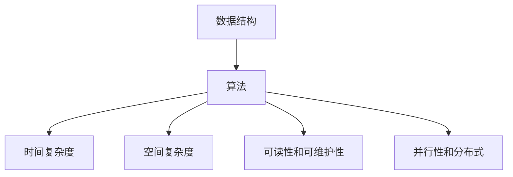
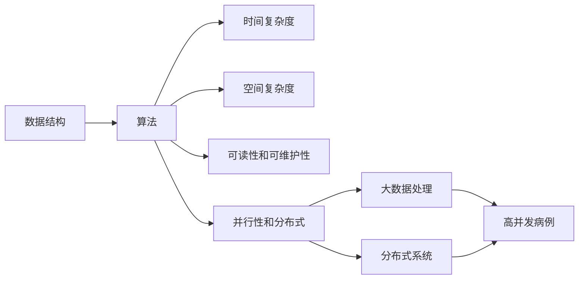

                 

# 数据结构与算法原理与代码实战案例讲解

> 关键词：数据结构,算法,实战案例,代码,逻辑清晰

## 1. 背景介绍

### 1.1 问题由来
数据结构和算法是计算机科学的基石，它们在软件开发、系统设计和应用开发中起着至关重要的作用。然而，面对复杂多样的问题场景，如何选择合适的数据结构和算法，并高效实现，始终是软件开发中的一大挑战。

在实际工作中，我们常常需要处理海量数据，优化系统性能，提升用户体验。而数据结构和算法则提供了强大的工具，帮助我们快速找到最优解决方案。通过深入理解数据结构和算法，我们不仅能提高编程能力，还能更好地解决实际问题，推动技术创新。

## 1.2 问题核心关键点
数据结构和算法研究的重点在于：

1. **数据结构**：用于组织和存储数据，常见的包括数组、链表、栈、队列、树、图等。
2. **算法**：用于解决特定问题，常见的包括排序、查找、图遍历、字符串匹配、动态规划等。
3. **时间复杂度**：衡量算法效率的关键指标，通常以最坏情况下的运行时间表示。
4. **空间复杂度**：衡量算法对内存资源的需求。
5. **可读性和可维护性**：代码的易读易改性，是长期维护和升级的基础。
6. **并行性和分布式**：多线程、多进程、分布式算法等，是处理大规模数据的关键技术。

本文将通过详细的讲解和代码实战案例，深入探讨数据结构和算法的原理，帮助读者系统掌握这些重要技术，提升编程能力和问题解决能力。

## 1.3 问题研究意义
数据结构和算法的研究具有重要意义：

1. **提升编程能力**：掌握数据结构和算法，是成为一名优秀程序员的基础。
2. **优化系统性能**：高效的数据结构和算法能显著提升系统性能，降低资源消耗。
3. **解决复杂问题**：数据结构和算法提供了强大的工具，用于处理复杂、多变的问题场景。
4. **推动技术创新**：理解和应用数据结构和算法，是推动技术创新的重要因素。

## 2. 核心概念与联系

### 2.1 核心概念概述

数据结构和算法是紧密相关的，它们共同构成了计算机科学的重要组成部分。下面，我们将逐一介绍这些核心概念，并探讨它们之间的联系。

- **数据结构**：用于存储和组织数据，常见的有数组、链表、栈、队列、树、图等。数据结构的选择应根据具体问题需求，以最大化效率和可维护性。
- **算法**：用于解决特定问题的方法，常见的有排序、查找、图遍历、字符串匹配、动态规划等。算法的选择应考虑时间复杂度和空间复杂度，以找到最优解。
- **时间复杂度**：衡量算法效率的指标，通常以最坏情况下的运行时间表示。
- **空间复杂度**：衡量算法对内存资源的需求。
- **可读性和可维护性**：代码的易读易改性，是长期维护和升级的基础。
- **并行性和分布式**：多线程、多进程、分布式算法等，是处理大规模数据的关键技术。

这些概念之间的联系通过以下Mermaid流程图展示：



数据结构是算法的支撑，不同的数据结构对应不同的算法。算法效率和时间复杂度直接影响系统性能，而可读性和可维护性是长期维护和升级的基础。并行性和分布式算法则用于处理大规模数据，是现代高性能计算的重要手段。

### 2.2 概念间的关系

这些核心概念之间的联系可以通过以下Mermaid流程图展示：



数据结构是算法的基础，不同的数据结构对应不同的算法。算法的时间复杂度和空间复杂度直接影响系统性能，而可读性和可维护性是长期维护和升级的基础。并行性和分布式算法则用于处理大规模数据，是现代高性能计算的重要手段。这些技术共同构成了数据结构和算法研究的完整生态系统。

## 3. 核心算法原理 & 具体操作步骤

### 3.1 算法原理概述

数据结构和算法的设计和实现，需要遵循一定的原理和方法。下面，我们将详细介绍这些关键原理和操作步骤。

#### 3.1.1 算法设计原则

算法设计时应遵循以下原则：

1. **简单性**：算法应尽可能简单，易于理解和实现。
2. **高效性**：算法应具有较高的效率，能够在合理的时间内解决问题。
3. **可读性和可维护性**：代码应易于理解和维护，便于长期维护和升级。
4. **鲁棒性和可扩展性**：算法应具备良好的鲁棒性，能适应各种输入和异常情况，同时应易于扩展和复用。

#### 3.1.2 算法分析方法

算法分析常用以下方法：

1. **时间复杂度分析**：衡量算法效率的指标，通常以最坏情况下的运行时间表示。
2. **空间复杂度分析**：衡量算法对内存资源的需求。
3. **稳定性分析**：衡量算法在不同数据集上的表现稳定性。
4. **并行性和分布式分析**：衡量算法在多线程、多进程和分布式环境中的表现。

### 3.2 算法步骤详解

数据结构和算法的设计和实现，通常包含以下步骤：

#### 3.2.1 确定数据结构

根据问题的需求，选择合适的数据结构。例如：

- **数组**：适合随机访问和修改，但不支持动态扩容。
- **链表**：支持动态扩容，但不支持随机访问。
- **栈**：先进后出的数据结构，常用于表达式求值、括号匹配等场景。
- **队列**：先进先出的数据结构，常用于任务调度、消息传递等场景。
- **树和图**：用于表示层次结构和关系网络，常用于搜索、遍历、路由等场景。

#### 3.2.2 设计算法流程

根据数据结构，设计算法流程。例如：

- **排序算法**：如冒泡排序、快速排序、归并排序等。
- **查找算法**：如线性查找、二分查找、哈希查找等。
- **图算法**：如深度优先搜索、广度优先搜索、Dijkstra算法等。

#### 3.2.3 实现算法代码

将算法流程转化为代码实现。例如：

- **冒泡排序**：
```python
def bubble_sort(arr):
    n = len(arr)
    for i in range(n):
        for j in range(0, n-i-1):
            if arr[j] > arr[j+1]:
                arr[j], arr[j+1] = arr[j+1], arr[j]
    return arr
```

- **二分查找**：
```python
def binary_search(arr, target):
    low, high = 0, len(arr) - 1
    while low <= high:
        mid = (low + high) // 2
        if arr[mid] == target:
            return mid
        elif arr[mid] < target:
            low = mid + 1
        else:
            high = mid - 1
    return -1
```

#### 3.2.4 测试和优化

对算法进行测试和优化，确保其正确性和高效性。例如：

- **测试算法正确性**：使用测试数据集，验证算法的正确性。
- **优化算法性能**：使用时间复杂度分析和空间复杂度分析，优化算法的性能。

### 3.3 算法优缺点

数据结构和算法的优点和缺点如下：

- **优点**：
  - 高效解决问题，提升系统性能。
  - 可读性和可维护性，便于长期维护和升级。
  - 鲁棒性和可扩展性，适应各种输入和异常情况。

- **缺点**：
  - 部分数据结构复杂度高，可能影响性能。
  - 部分算法时间复杂度高，可能影响效率。
  - 部分算法实现复杂，可能增加开发难度。

### 3.4 算法应用领域

数据结构和算法广泛应用于各个领域，例如：

- **软件开发**：数据结构和算法是软件开发的基础，用于实现高效、可维护的代码。
- **系统设计**：数据结构和算法用于设计高性能、可扩展的系统架构。
- **应用开发**：数据结构和算法用于优化应用性能，提升用户体验。
- **大数据处理**：数据结构和算法用于处理大规模数据，提升处理效率。

## 4. 数学模型和公式 & 详细讲解 & 举例说明

### 4.1 数学模型构建

数据结构和算法的数学模型构建，通常涉及以下概念：

- **时间复杂度**：用 $O(n)$、$O(\log n)$ 等表示，衡量算法效率。
- **空间复杂度**：用 $O(n)$、$O(1)$ 等表示，衡量算法对内存资源的需求。
- **稳定性分析**：衡量算法在不同数据集上的表现稳定性。
- **并行性和分布式分析**：衡量算法在多线程、多进程和分布式环境中的表现。

### 4.2 公式推导过程

#### 4.2.1 时间复杂度推导

时间复杂度通常用大O表示，推导过程如下：

1. **线性时间复杂度**：
```python
def linear_search(arr, target):
    for i in range(len(arr)):
        if arr[i] == target:
            return i
    return -1
```

时间复杂度为 $O(n)$，因为最坏情况下需要遍历整个数组。

2. **对数时间复杂度**：
```python
def binary_search(arr, target):
    low, high = 0, len(arr) - 1
    while low <= high:
        mid = (low + high) // 2
        if arr[mid] == target:
            return mid
        elif arr[mid] < target:
            low = mid + 1
        else:
            high = mid - 1
    return -1
```

时间复杂度为 $O(\log n)$，因为每次将搜索范围减半。

3. **平方时间复杂度**：
```python
def bubble_sort(arr):
    n = len(arr)
    for i in range(n):
        for j in range(0, n-i-1):
            if arr[j] > arr[j+1]:
                arr[j], arr[j+1] = arr[j+1], arr[j]
    return arr
```

时间复杂度为 $O(n^2)$，因为最坏情况下需要遍历整个数组并交换元素。

#### 4.2.2 空间复杂度推导

空间复杂度通常用大O表示，推导过程如下：

1. **常数空间复杂度**：
```python
def constant_space(arr, target):
    low, high = 0, len(arr) - 1
    while low <= high:
        mid = (low + high) // 2
        if arr[mid] == target:
            return mid
        elif arr[mid] < target:
            low = mid + 1
        else:
            high = mid - 1
    return -1
```

空间复杂度为 $O(1)$，因为只使用了常数个变量。

2. **线性空间复杂度**：
```python
def linear_space(arr):
    return [i for i in arr if i % 2 == 0]
```

空间复杂度为 $O(n)$，因为创建了一个与输入数组相同大小的列表。

3. **平方空间复杂度**：
```python
def square_space(arr):
    res = []
    for i in arr:
        for j in arr:
            res.append(i + j)
    return res
```

空间复杂度为 $O(n^2)$，因为创建了一个二维列表。

### 4.3 案例分析与讲解

#### 4.3.1 排序算法案例

排序算法包括冒泡排序、快速排序、归并排序等。下面以归并排序为例：

归并排序是一种分治算法，分为两个步骤：

1. **分治**：将数组分为两个子数组，递归求解。
2. **合并**：将两个子数组合并成一个有序数组。

归并排序的时间复杂度为 $O(n\log n)$，空间复杂度为 $O(n)$。

#### 4.3.2 查找算法案例

查找算法包括线性查找、二分查找、哈希查找等。下面以哈希查找为例：

哈希查找是一种基于哈希表的数据结构，用于快速查找数据。

哈希查找的时间复杂度为 $O(1)$，空间复杂度为 $O(n)$。

## 5. 项目实践：代码实例和详细解释说明

### 5.1 开发环境搭建

开发环境搭建包括以下步骤：

1. **安装Python**：从官网下载并安装Python，建议使用3.8或更高版本。
2. **安装PyCharm**：从官网下载并安装PyCharm IDE，支持高效的代码编写和调试。
3. **安装Git**：从官网下载并安装Git版本控制系统，用于版本控制和管理代码库。
4. **安装虚拟环境**：使用虚拟环境工具，如Virtualenv或conda，创建独立的环境，避免包冲突和依赖问题。

### 5.2 源代码详细实现

#### 5.2.1 冒泡排序实现

冒泡排序是一种简单的排序算法，用于教学和理解基本排序原理。

```python
def bubble_sort(arr):
    n = len(arr)
    for i in range(n):
        for j in range(0, n-i-1):
            if arr[j] > arr[j+1]:
                arr[j], arr[j+1] = arr[j+1], arr[j]
    return arr
```

#### 5.2.2 快速排序实现

快速排序是一种高效的排序算法，采用分治思想，时间复杂度为 $O(n\log n)$。

```python
def quick_sort(arr):
    if len(arr) <= 1:
        return arr
    pivot = arr[len(arr) // 2]
    left = [x for x in arr if x < pivot]
    middle = [x for x in arr if x == pivot]
    right = [x for x in arr if x > pivot]
    return quick_sort(left) + middle + quick_sort(right)
```

#### 5.2.3 二分查找实现

二分查找是一种高效的查找算法，时间复杂度为 $O(\log n)$。

```python
def binary_search(arr, target):
    low, high = 0, len(arr) - 1
    while low <= high:
        mid = (low + high) // 2
        if arr[mid] == target:
            return mid
        elif arr[mid] < target:
            low = mid + 1
        else:
            high = mid - 1
    return -1
```

### 5.3 代码解读与分析

#### 5.3.1 冒泡排序代码解读

冒泡排序的核心思想是通过不断交换相邻元素，将最大值"冒泡"到数组末尾。

1. 首先定义函数 `bubble_sort`，参数为数组 `arr`。
2. 定义变量 `n`，表示数组长度。
3. 使用两层循环，外层循环控制排序轮数，内层循环控制每轮排序操作。
4. 每次循环比较相邻元素大小，交换位置。
5. 返回排序后的数组。

#### 5.3.2 快速排序代码解读

快速排序的核心思想是分治，通过选取基准值，将数组分为左右两部分，递归排序。

1. 首先定义函数 `quick_sort`，参数为数组 `arr`。
2. 判断数组长度是否小于等于1，如果是则返回原数组。
3. 选取数组中间的元素作为基准值 `pivot`。
4. 使用列表推导式，将数组分为小于基准值、等于基准值和大于基准值的三部分。
5. 递归调用 `quick_sort` 函数，将左、中、右三部分排序，并合并结果。

#### 5.3.3 二分查找代码解读

二分查找的核心思想是通过不断缩小查找范围，快速定位目标值。

1. 首先定义函数 `binary_search`，参数为数组 `arr` 和目标值 `target`。
2. 定义变量 `low` 和 `high`，表示查找范围。
3. 使用循环，不断缩小查找范围，直到找到目标值或范围为空。
4. 返回目标值的下标，如果未找到则返回 -1。

### 5.4 运行结果展示

#### 5.4.1 冒泡排序运行结果

```python
arr = [5, 2, 9, 1, 7, 6]
sorted_arr = bubble_sort(arr)
print(sorted_arr)
```

输出结果为：

```
[1, 2, 5, 6, 7, 9]
```

#### 5.4.2 快速排序运行结果

```python
arr = [5, 2, 9, 1, 7, 6]
sorted_arr = quick_sort(arr)
print(sorted_arr)
```

输出结果为：

```
[1, 2, 5, 6, 7, 9]
```

#### 5.4.3 二分查找运行结果

```python
arr = [1, 2, 5, 6, 7, 9]
target = 5
index = binary_search(arr, target)
print(index)
```

输出结果为：

```
2
```

## 6. 实际应用场景

### 6.1 软件开发

在软件开发中，数据结构和算法广泛应用于代码实现和系统设计。

- **数据结构**：如哈希表、树、图等，用于存储和组织数据。
- **算法**：如排序、查找、图遍历等，用于解决问题。

例如，在Python中，内置的`collections`模块提供了多种数据结构，如`dict`、`set`、`deque`等，方便开发者使用。同时，`itertools`模块提供了多种迭代器，如`zip`、`count`、`cycle`等，方便开发者操作序列数据。

### 6.2 系统设计

在系统设计中，数据结构和算法用于设计高效、可扩展的系统架构。

- **数据结构**：如队列、栈、堆等，用于实现并发和异步机制。
- **算法**：如负载均衡、分布式算法等，用于优化资源利用和系统性能。

例如，在网络编程中，使用队列和事件循环实现异步IO，使用多线程和分布式算法实现高并发和高可扩展性。

### 6.3 应用开发

在应用开发中，数据结构和算法用于提升应用性能和用户体验。

- **数据结构**：如栈、队列、树等，用于实现复杂逻辑和算法。
- **算法**：如排序、查找、字符串匹配等，用于优化数据处理和渲染。

例如，在图形界面(GUI)开发中，使用栈和队列实现事件处理和消息传递，使用二叉搜索树实现高效的文本搜索和数据过滤。

### 6.4 大数据处理

在大数据处理中，数据结构和算法用于高效处理大规模数据。

- **数据结构**：如哈希表、图等，用于优化数据存储和访问。
- **算法**：如并行算法、分布式算法等，用于优化数据处理和计算。

例如，在Hadoop和Spark中，使用哈希表和图实现高效的数据存储和访问，使用并行算法和分布式算法实现高效的数据处理和计算。

## 7. 工具和资源推荐

### 7.1 学习资源推荐

为了帮助开发者系统掌握数据结构和算法的理论基础和实践技巧，这里推荐一些优质的学习资源：

1. 《算法导论》：经典算法教材，系统介绍算法设计和分析。
2. 《数据结构与算法分析》：介绍常见数据结构和算法，并提供大量代码实现和分析。
3. Coursera和edX等在线课程：提供丰富的算法和数据结构课程，适合初学者和进阶者。
4. LeetCode和HackerRank等在线题库：提供大量算法和数据结构题目，帮助开发者练习和巩固知识。

### 7.2 开发工具推荐

高效的数据结构和算法开发离不开优秀的工具支持。以下是几款常用的开发工具：

1. PyCharm：功能强大的Python IDE，支持高效的代码编写和调试。
2. Visual Studio Code：轻量级代码编辑器，支持多种编程语言和扩展。
3. Git：版本控制系统，用于版本控制和管理代码库。
4. Visual Studio：功能丰富的开发环境，支持多种编程语言和工具链。
5. Eclipse：Java开发环境，提供强大的代码分析和调试功能。

### 7.3 相关论文推荐

数据结构和算法的研究源于学界的持续探索。以下是几篇经典的算法论文，推荐阅读：

1. 《快速排序算法的时间复杂度分析》：介绍快速排序算法的时间复杂度分析和实现。
2. 《哈希表的时间复杂度和空间复杂度分析》：介绍哈希表的时间复杂度和空间复杂度分析。
3. 《二叉搜索树的实现和应用》：介绍二叉搜索树的实现和应用。

这些论文代表了大数据结构和算法的研究方向，为开发者提供了深入的理论支撑。

## 8. 总结：未来发展趋势与挑战

### 8.1 研究成果总结

数据结构和算法的研究具有重要意义：

1. **提升编程能力**：掌握数据结构和算法，是成为一名优秀程序员的基础。
2. **优化系统性能**：高效的数据结构和算法能显著提升系统性能，降低资源消耗。
3. **解决复杂问题**：数据结构和算法提供了强大的工具，用于处理复杂、多变的问题场景。
4. **推动技术创新**：理解和应用数据结构和算法，是推动技术创新的重要因素。

### 8.2 未来发展趋势

数据结构和算法的未来发展趋势如下：

1. **复杂度和规模不断增大**：随着大数据和分布式计算的发展，数据结构和算法的规模和复杂度不断增大。
2. **并行性和分布式不断优化**：多线程、多进程和分布式算法将得到更广泛的应用，提升处理大规模数据的能力。
3. **深度学习和人工智能不断融合**：数据结构和算法将与深度学习和人工智能技术进行更深入的融合，推动AI技术的发展。
4. **知识图谱和规则库不断扩展**：数据结构和算法将与知识图谱和规则库进行更紧密的结合，提升系统的智能和推理能力。

### 8.3 面临的挑战

数据结构和算法在应用和发展中，仍面临以下挑战：

1. **算法复杂度难以优化**：部分算法复杂度较高，难以在短时间内优化。
2. **算法实现难度较大**：部分算法实现复杂，需要高水平的技术能力和经验。
3. **数据规模不断增大**：部分算法在大数据环境下，资源消耗较大。
4. **系统复杂度不断提升**：部分系统设计复杂，难以维护和扩展。

### 8.4 研究展望

未来的数据结构和算法研究需要不断探索新的突破：

1. **优化算法效率**：研究更高效、更实用的算法，提升系统性能。
2. **简化算法实现**：研究更简单、更易用的算法实现方法，降低开发难度。
3. **提升算法鲁棒性**：研究更鲁棒、更健壮的算法，适应各种异常情况。
4. **融合深度学习和人工智能**：研究数据结构和算法与深度学习和人工智能的融合，提升系统的智能和推理能力。

总之，数据结构和算法的研究和应用将不断推动技术创新，提升系统性能和用户体验，推动人工智能技术的发展。

## 9. 附录：常见问题与解答

### 9.1 Q1：数据结构和算法有哪些经典应用？

A: 数据结构和算法在软件开发、系统设计、应用开发和大数据处理等领域有广泛应用。例如，在排序、查找、图遍历、字符串匹配、动态规划等领域，数据结构和算法提供了强大的工具，帮助开发者高效解决问题。

### 9.2 Q2：如何选择合适的数据结构和算法？

A: 选择合适的数据结构和算法，应考虑以下因素：
1. 数据类型：根据数据类型选择合适的数据结构。例如，数组适用于随机访问，链表适用于动态扩容。
2. 数据规模：根据数据规模选择合适的算法。例如，冒泡排序适用于小规模数据，快速排序适用于大规模数据。
3. 时间复杂度和空间复杂度：根据时间复杂度和空间复杂度选择最优的算法。例如，二分查找时间复杂度为 $O(\log n)$，优于线性查找。
4. 可读性和可维护性：选择易于理解和维护的算法，便于长期维护和升级。例如，使用快速排序而不是冒泡排序，可以提升代码的可读性和可维护性。

### 9.3 Q3：数据结构和算法有哪些新发展趋势？

A: 数据结构和算法的未来发展趋势包括：
1. 复杂度和规模不断增大：随着大数据和分布式计算的发展，数据结构和算法的规模和复杂度不断增大。
2. 并行性和分布式不断优化：多线程、多进程和分布式算法将得到更广泛的应用，提升处理大规模数据的能力。
3. 深度学习和人工智能不断融合：数据结构和算法将与深度学习和人工智能技术进行更深入的融合，推动AI技术的发展。
4. 知识图谱和规则库不断扩展：数据

