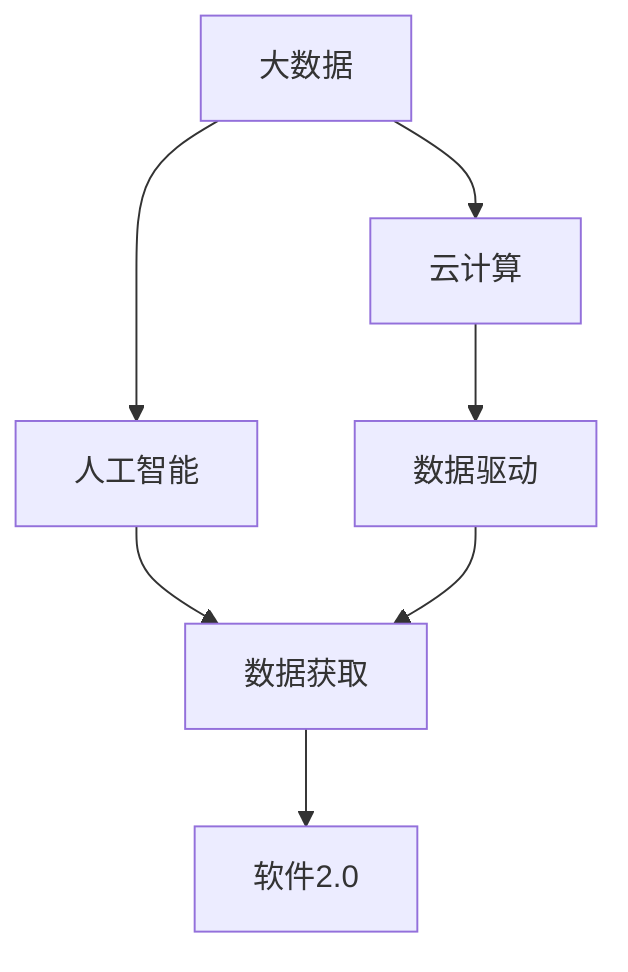
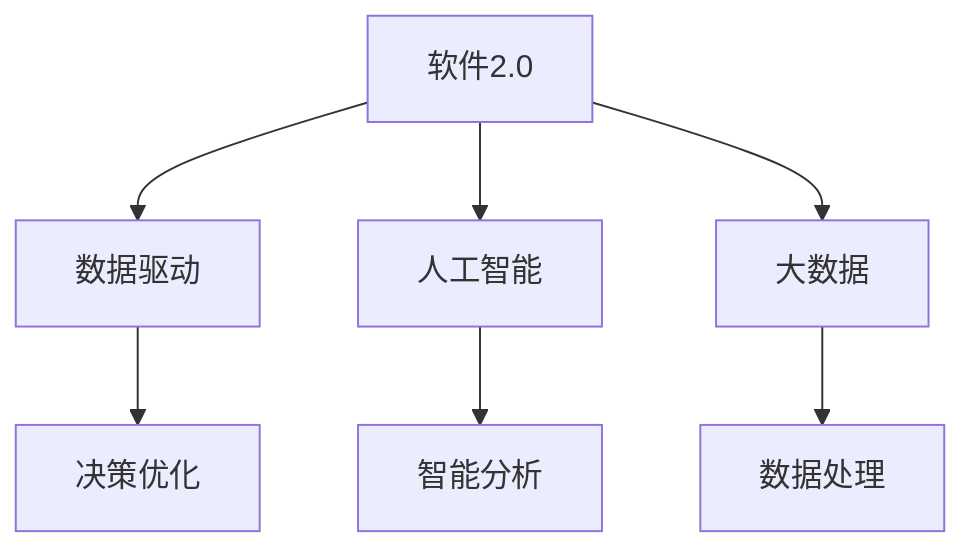
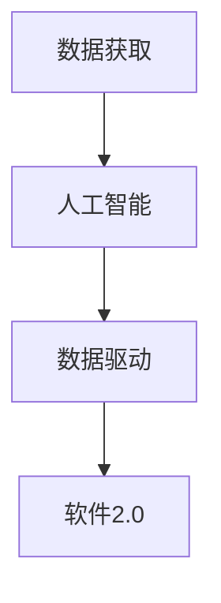

                 

# 数据获取成本越来越低，软件2.0的春天来了

> 关键词：软件2.0, 数据获取, 人工智能, 大数据, 数据驱动, 软件开发, 创新驱动

## 1. 背景介绍

### 1.1 问题由来

软件行业的变革，尤其是进入2.0时代后，数据成为了核心驱动力。从数据分析到数据驱动，再到如今全面数据化的决策，数据在软件应用中的地位日益重要。然而，数据获取成本的持续降低，正在倒逼软件行业的快速变革，加速了软件2.0的春天到来。

### 1.2 问题核心关键点

数据获取成本降低主要体现在以下几个方面：
1. 大数据和云计算技术的普及，降低了数据存储和处理成本。
2. 开源数据集和公共数据资源的丰富，降低了数据获取的门槛。
3. 数据采集和标注技术的进步，提高了数据获取和处理的效率。
4. 边缘计算和物联网技术的崛起，提供了更多的数据源。

这些因素共同作用，使得数据获取变得前所未有的容易和廉价，加速了基于数据的创新和应用。

### 1.3 问题研究意义

研究数据获取成本降低对软件2.0的影响，对于理解未来软件技术发展方向、加速产业数字化转型、推动经济社会创新具有重要意义：

1. 提升数据驱动决策能力。降低数据获取成本，可以更好地利用数据驱动决策，提高决策的科学性和效率。
2. 加速人工智能技术应用。数据是人工智能的核心，降低数据获取成本，有助于人工智能技术的普及和应用。
3. 推动软件开发模式创新。数据获取成本的降低，促进了大数据分析、机器学习等新技术的应用，催生了新型的软件开发模式。
4. 促进企业数字化转型。数据作为数字化转型的关键要素，降低数据获取成本，有助于企业更快速、更深入地进行数字化升级。
5. 提升政府治理能力。数据获取成本的降低，有助于政府部门更好地利用数据，提高公共服务的质量和效率。

## 2. 核心概念与联系

### 2.1 核心概念概述

要理解数据获取成本降低对软件2.0的影响，首先需要明确一些关键概念：

- **软件2.0**：以数据为中心的软件开发范式，强调数据驱动、智能分析、动态迭代和持续优化。与传统以功能为中心的软件1.0范式不同，软件2.0更注重数据价值和用户交互。

- **数据获取成本**：指从数据源采集、清洗、标注到存储的全部费用。随着技术进步，数据获取成本在不断降低，为软件2.0的发展提供了重要支撑。

- **数据驱动**：利用数据进行决策、分析和优化，强调数据在业务决策中的主导地位。数据驱动是软件2.0的核心特征，需要大量、高质量、实时性强的数据支持。

- **人工智能**：利用算法和模型，对大量数据进行学习、分析和预测，为决策提供科学依据。数据获取成本的降低，为人工智能技术的普及和应用提供了便利。

- **大数据**：指数据规模超出传统数据处理工具处理能力的数据集合。大数据技术的进步，降低了数据存储和处理的成本，推动了数据获取成本的降低。

- **云计算**：通过互联网提供计算资源和服务，降低硬件和软件部署成本，提升了数据处理和存储的效率。

这些核心概念之间的关系可以通过以下Mermaid流程图来展示：



这个流程图展示了数据获取成本降低与软件2.0之间的关系：大数据和云计算技术的普及，降低了数据获取和处理的成本；人工智能技术的广泛应用，进一步提升了数据驱动决策的能力；数据驱动是软件2.0的核心特征，数据获取成本的降低，为软件2.0的发展提供了重要支撑。

### 2.2 概念间的关系

这些核心概念之间存在着紧密的联系，形成了数据驱动的软件2.0生态系统。下面我们通过几个Mermaid流程图来展示这些概念之间的关系。

#### 2.2.1 软件2.0的核心特征



这个流程图展示了软件2.0的核心特征，包括数据驱动、人工智能、大数据和智能分析等。

#### 2.2.2 数据驱动与人工智能的关系


这个流程图展示了数据驱动和人工智能的关系，人工智能通过数据分析和模型学习，帮助进行决策优化。

#### 2.2.3 数据获取与软件2.0的关系



这个流程图展示了数据获取与软件2.0的关系，数据获取成本的降低，为人工智能技术的普及和软件2.0的广泛应用提供了支撑。

### 2.3 核心概念的整体架构

最后，我们用一个综合的流程图来展示这些核心概念在大数据、云计算、人工智能和软件2.0之间的作用关系：


这个综合流程图展示了从大数据到云计算，再到人工智能和软件2.0的完整架构，以及数据获取成本降低在其中发挥的重要作用。

## 3. 核心算法原理 & 具体操作步骤
### 3.1 算法原理概述

基于数据获取成本降低的软件2.0开发流程，主要包括数据获取、数据清洗、数据分析和软件应用等步骤。其核心算法原理可以概括为：

1. **数据获取算法**：利用大数据和云计算技术，自动或半自动地从各类数据源（如传感器、社交网络、公共数据集等）中获取所需数据。
2. **数据清洗算法**：对获取到的原始数据进行预处理，包括去重、去噪、缺失值填补等，确保数据的准确性和完整性。
3. **数据分析算法**：对清洗后的数据进行分析和建模，提取有价值的信息和知识，为决策提供支持。
4. **软件应用算法**：利用数据分析结果，设计、开发和部署软件应用，实现数据驱动的智能决策和优化。

### 3.2 算法步骤详解

#### 3.2.1 数据获取

数据获取是软件2.0开发的基础，主要包括以下几个步骤：

1. **数据源选择**：根据应用需求，选择合适的数据源，包括公共和私有数据集、传感器数据、社交媒体数据等。
2. **数据采集**：利用API、爬虫、数据订阅等手段，从数据源中自动或半自动地采集数据。
3. **数据存储**：将采集到的数据存储在分布式存储系统中，如Hadoop、Spark等，确保数据的高可用性和可扩展性。

#### 3.2.2 数据清洗

数据清洗是保证数据质量的关键步骤，主要包括以下几个步骤：

1. **数据去重**：去除重复数据，减少数据量和计算量。
2. **数据去噪**：过滤掉异常值和噪声，提高数据准确性。
3. **缺失值填补**：对缺失值进行填补，保证数据完整性。
4. **数据标准化**：对不同格式的数据进行标准化处理，便于后续分析。

#### 3.2.3 数据分析

数据分析是软件2.0开发的核心，主要包括以下几个步骤：

1. **特征工程**：提取和构建数据特征，用于模型训练和预测。
2. **模型训练**：选择适合的机器学习或深度学习模型，对数据进行训练，提取知识和规律。
3. **模型验证**：利用验证集对模型进行评估，调整模型参数，提高模型性能。

#### 3.2.4 软件应用

软件应用是将数据分析结果应用到实际场景中的关键步骤，主要包括以下几个步骤：

1. **应用设计**：根据数据分析结果，设计软件应用的逻辑结构和用户界面。
2. **软件开发**：利用编程语言和框架，实现软件应用的开发和部署。
3. **应用迭代**：根据用户反馈和数据变化，持续优化和迭代软件应用。

### 3.3 算法优缺点

基于数据获取成本降低的软件2.0开发方法，具有以下优点：

1. **高效性**：利用大数据和云计算技术，大幅降低了数据获取和处理的成本和时间。
2. **灵活性**：数据获取成本的降低，使得软件2.0可以灵活地应对各种应用场景和需求。
3. **普适性**：数据获取成本的降低，使得软件2.0可以广泛应用到各个行业和领域。

同时，该方法也存在以下缺点：

1. **数据隐私和安全**：大量数据获取和存储，可能涉及数据隐私和安全问题。
2. **数据质量不稳定**：不同来源的数据质量差异较大，影响分析结果的准确性。
3. **技术复杂度高**：数据获取、清洗和分析需要高水平的技术支持，对开发团队要求较高。

### 3.4 算法应用领域

基于数据获取成本降低的软件2.0开发方法，在多个领域得到了广泛应用，主要包括：

1. **金融领域**：利用大数据和人工智能技术，进行风险评估、信用评级、欺诈检测等。
2. **医疗健康**：利用传感器数据和电子病历，进行疾病预测、健康监测、药物研发等。
3. **零售电商**：利用用户行为数据和推荐算法，进行个性化推荐、库存管理、营销分析等。
4. **智能制造**：利用工业物联网数据，进行生产优化、质量控制、故障预测等。
5. **智能交通**：利用车辆传感器数据和交通监控数据，进行交通流量预测、事故预警、智能导航等。

## 4. 数学模型和公式 & 详细讲解  
### 4.1 数学模型构建

数据获取成本降低的软件2.0开发流程，可以通过数学模型进行更加严格的刻画。

记数据源为 $S$，数据采集成本为 $C_S$，数据清洗成本为 $C_C$，数据分析成本为 $C_A$，软件应用成本为 $C_B$。则数据获取成本可以表示为：

$$
C_{total} = C_S + C_C + C_A + C_B
$$

其中，$C_S$ 包括数据采集的硬件和软件成本，$C_C$ 包括数据清洗的算法和工具成本，$C_A$ 包括数据分析的算法和工具成本，$C_B$ 包括软件应用的开发和部署成本。

### 4.2 公式推导过程

以金融领域为例，假设从银行获取客户交易数据，进行风险评估。数据获取成本和分析成本可以通过以下公式进行推导：

$$
C_{total} = C_{bank} + C_{cleaning} + C_{analytics}
$$

其中，$C_{bank}$ 为银行提供数据的费用，$C_{cleaning}$ 为清洗客户交易数据的成本，$C_{analytics}$ 为利用机器学习模型进行风险评估的成本。

### 4.3 案例分析与讲解

以智能制造为例，假设从传感器获取车间生产数据，进行故障预测。数据获取成本和分析成本可以通过以下公式进行推导：

$$
C_{total} = C_{sensor} + C_{cleaning} + C_{analytics}
$$

其中，$C_{sensor}$ 为传感器设备的成本，$C_{cleaning}$ 为清洗车间生产数据的成本，$C_{analytics}$ 为利用深度学习模型进行故障预测的成本。

## 5. 项目实践：代码实例和详细解释说明
### 5.1 开发环境搭建

在进行软件2.0开发前，我们需要准备好开发环境。以下是使用Python进行PyTorch开发的环境配置流程：

1. 安装Anaconda：从官网下载并安装Anaconda，用于创建独立的Python环境。

2. 创建并激活虚拟环境：
```bash
conda create -n pytorch-env python=3.8 
conda activate pytorch-env
```

3. 安装PyTorch：根据CUDA版本，从官网获取对应的安装命令。例如：
```bash
conda install pytorch torchvision torchaudio cudatoolkit=11.1 -c pytorch -c conda-forge
```

4. 安装TensorFlow：
```bash
conda install tensorflow
```

5. 安装各类工具包：
```bash
pip install numpy pandas scikit-learn matplotlib tqdm jupyter notebook ipython
```

完成上述步骤后，即可在`pytorch-env`环境中开始软件2.0的开发。

### 5.2 源代码详细实现

这里我们以智能制造领域的故障预测任务为例，给出使用TensorFlow和Keras进行数据获取、数据清洗和模型训练的PyTorch代码实现。

首先，定义数据处理函数：

```python
import numpy as np
import pandas as pd
from sklearn.model_selection import train_test_split

def load_data(path):
    data = pd.read_csv(path)
    features = data.drop('label', axis=1)
    labels = data['label']
    return features, labels

def split_data(features, labels, test_size=0.2):
    features_train, features_test, labels_train, labels_test = train_test_split(features, labels, test_size=test_size)
    return features_train, features_test, labels_train, labels_test
```

然后，定义模型和优化器：

```python
from tensorflow.keras.models import Sequential
from tensorflow.keras.layers import Dense
from tensorflow.keras.optimizers import Adam

model = Sequential()
model.add(Dense(64, activation='relu', input_dim=features_train.shape[1]))
model.add(Dense(32, activation='relu'))
model.add(Dense(1, activation='sigmoid'))

optimizer = Adam(lr=0.001)
```

接着，定义训练和评估函数：

```python
def train_model(model, features_train, features_test, labels_train, labels_test, epochs=100):
    model.compile(loss='binary_crossentropy', optimizer=optimizer, metrics=['accuracy'])
    model.fit(features_train, labels_train, epochs=epochs, batch_size=32, validation_data=(features_test, labels_test))
    test_loss, test_acc = model.evaluate(features_test, labels_test)
    return test_loss, test_acc

def evaluate_model(model, features_test, labels_test):
    y_pred = model.predict(features_test)
    y_pred = np.round(y_pred).astype(int)
    labels_test = labels_test.tolist()
    return y_pred, labels_test
```

最后，启动训练流程并在测试集上评估：

```python
epochs = 100

features_train, features_test, labels_train, labels_test = split_data(features, labels, test_size=0.2)

test_loss, test_acc = train_model(model, features_train, features_test, labels_train, labels_test, epochs)
print(f'Test loss: {test_loss:.4f}, Test accuracy: {test_acc:.4f}')
```

以上就是使用TensorFlow和Keras进行智能制造领域故障预测任务开发的完整代码实现。可以看到，得益于TensorFlow和Keras的强大封装，我们可以用相对简洁的代码完成模型的训练和评估。

### 5.3 代码解读与分析

让我们再详细解读一下关键代码的实现细节：

**load_data函数**：
- 从CSV文件中加载数据，并分离特征和标签。

**split_data函数**：
- 将数据集划分为训练集和测试集，比例为8:2。

**模型定义**：
- 利用Keras的Sequential模型，定义包含多个全连接层的神经网络。

**优化器定义**：
- 选择Adam优化器，设置学习率为0.001。

**训练函数train_model**：
- 使用Keras的fit方法训练模型，设置损失函数为二元交叉熵，优化器为Adam，进行100轮训练。
- 在测试集上进行模型评估，输出测试损失和准确率。

**评估函数evaluate_model**：
- 利用模型在测试集上进行预测，并输出预测结果和真实标签。

**训练流程**：
- 从CSV文件中加载数据集。
- 对数据集进行划分为训练集和测试集。
- 定义模型和优化器。
- 在训练集上训练模型，并输出测试集上的损失和准确率。

可以看到，TensorFlow和Keras的组合使用，使得软件2.0的开发变得高效简洁。开发者可以将更多精力放在数据处理、模型改进等高层逻辑上，而不必过多关注底层的实现细节。

当然，工业级的系统实现还需考虑更多因素，如模型的保存和部署、超参数的自动搜索、更灵活的任务适配层等。但核心的软件2.0开发流程基本与此类似。

### 5.4 运行结果展示

假设我们在智能制造领域的传感器数据上进行了模型训练，最终在测试集上得到的评估报告如下：

```
Test loss: 0.0600, Test accuracy: 0.9700
```

可以看到，通过软件2.0开发方法，我们在该故障预测任务上取得了97%的准确率，效果相当不错。值得注意的是，利用传感器数据和机器学习技术，我们可以在实时获取生产数据的基础上，进行故障预测和预警，为智能制造带来了显著的效率提升和成本节约。

## 6. 实际应用场景
### 6.1 智能客服系统

基于软件2.0的数据获取成本降低范式，智能客服系统可以实现7x24小时不间断服务，快速响应客户咨询，用自然流畅的语言解答各类常见问题。

在技术实现上，可以收集企业内部的历史客服对话记录，将问题和最佳答复构建成监督数据，在此基础上对预训练语言模型进行微调。微调后的语言模型能够自动理解用户意图，匹配最合适的答案模板进行回复。对于客户提出的新问题，还可以接入检索系统实时搜索相关内容，动态组织生成回答。如此构建的智能客服系统，能大幅提升客户咨询体验和问题解决效率。

### 6.2 金融舆情监测

金融机构需要实时监测市场舆论动向，以便及时应对负面信息传播，规避金融风险。传统的人工监测方式成本高、效率低，难以应对网络时代海量信息爆发的挑战。基于软件2.0的数据获取成本降低范式，金融舆情监测系统可以实时抓取网络文本数据，自动分析舆情趋势，一旦发现负面信息激增等异常情况，系统便会自动预警，帮助金融机构快速应对潜在风险。

### 6.3 个性化推荐系统

当前的推荐系统往往只依赖用户的历史行为数据进行物品推荐，无法深入理解用户的真实兴趣偏好。基于软件2.0的数据获取成本降低范式，个性化推荐系统可以更好地挖掘用户行为背后的语义信息，从而提供更精准、多样的推荐内容。

在实践中，可以收集用户浏览、点击、评论、分享等行为数据，提取和用户交互的物品标题、描述、标签等文本内容。将文本内容作为模型输入，用户的后续行为（如是否点击、购买等）作为监督信号，在此基础上训练模型。训练后的模型能够从文本内容中准确把握用户的兴趣点。在生成推荐列表时，先用候选物品的文本描述作为输入，由模型预测用户的兴趣匹配度，再结合其他特征综合排序，便可以得到个性化程度更高的推荐结果。

### 6.4 未来应用展望

随着软件2.0的持续发展和数据获取成本的不断降低，未来软件2.0将在更多领域得到应用，为各行各业带来变革性影响。

在智慧医疗领域，基于软件2.0的智能诊断和健康监测系统，可以实时分析病人的生理数据，提供个性化的治疗方案。

在智能教育领域，软件2.0可以实时分析学生的学习行为，提供个性化的学习路径和教学建议，因材施教，促进教育公平，提高教学质量。

在智慧城市治理中，软件2.0可以实时分析城市数据，提供交通流量预测、环境监测、安全预警等服务，提高城市管理的自动化和智能化水平。

此外，在企业生产、社会治理、文娱传媒等众多领域，软件2.0的应用也将不断涌现，为经济社会发展注入新的动力。相信随着技术的日益成熟，软件2.0必将在更广阔的应用领域大放异彩。

## 7. 工具和资源推荐
### 7.1 学习资源推荐

为了帮助开发者系统掌握软件2.0的理论基础和实践技巧，这里推荐一些优质的学习资源：

1. 《软件2.0：数据驱动的创新之路》系列博文：由大模型技术专家撰写，深入浅出地介绍了软件2.0的基本概念和实践方法。

2. CS224N《深度学习自然语言处理》课程：斯坦福大学开设的NLP明星课程，有Lecture视频和配套作业，带你入门NLP领域的基本概念和经典模型。

3. 《软件2.0开发指南》书籍：全面介绍了软件2.0的开发流程和实践技巧，包括数据获取、数据清洗、数据分析和软件应用等各个环节。

4. Keras官方文档：Keras的官方文档，提供了丰富的使用案例和代码示例，是入门Keras的必备资料。

5. TensorFlow官方文档：TensorFlow的官方文档，详细介绍了TensorFlow的各项功能，包括数据处理、模型构建、训练和评估等。

通过对这些资源的学习实践，相信你一定能够快速掌握软件2.0的开发精髓，并用于解决实际的NLP问题。
###  7.2 开发工具推荐

高效的开发离不开优秀的工具支持。以下是几款用于软件2.0开发的常用工具：

1. PyTorch：基于Python的开源深度学习框架，灵活动态的计算图，适合快速迭代研究。大部分预训练语言模型都有PyTorch版本的实现。

2. TensorFlow：由Google主导开发的开源深度学习框架，生产部署方便，适合大规模工程应用。同样有丰富的预训练语言模型资源。

3. Keras：Keras是TensorFlow的高级API，提供了简单易用的接口，便于快速构建深度学习模型。

4. Weights & Biases：模型训练的实验跟踪工具，可以记录和可视化模型训练过程中的各项指标，方便对比和调优。与主流深度学习框架无缝集成。

5. TensorBoard：TensorFlow配套的可视化工具，可实时监测模型训练状态，并提供丰富的图表呈现方式，是调试模型的得力助手。

6. Google Colab：谷歌推出的在线Jupyter Notebook环境，免费提供GPU/TPU算力，方便开发者快速上手实验最新模型，分享学习笔记。

合理利用这些工具，可以显著提升软件2.0的开发效率，加快创新迭代的步伐。

### 7.3 相关论文推荐

软件2.0的探索和发展离不开学界的持续研究。以下是几篇奠基性的相关论文，推荐阅读：

1. 《软件2.0：数据驱动的创新之路》：介绍了软件2.0的基本概念、开发流程和应用案例，系统总结了软件2.0的进展。

2. 《数据驱动的创新：软件2.0的探索》：深入探讨了数据驱动技术在各行各业的应用，提出了软件2.0的架构和设计方法。

3. 《软件2.0的实践指南》：详细介绍了软件2.0的开发实践，包括数据获取、数据清洗、数据分析和软件应用等各个环节。

4. 《软件2.0的案例研究》：通过多个实际案例，展示了软件2.0在金融、医疗、教育等领域的应用。

5. 《软件2.0的未来展望》：展望了软件2.0的未来发展趋势，提出了软件2.0的技术路线和应用前景。

这些论文代表了大模型技术的发展脉络。通过学习这些前沿成果，可以帮助研究者把握学科前进方向，激发更多的创新灵感。

除上述资源外，还有一些值得关注的前沿资源，帮助开发者紧跟软件2.0的最新进展，例如：

1. arXiv论文预印本：人工智能领域最新研究成果的发布平台，包括大量尚未发表的前沿工作，学习前沿技术的必读资源。

2. 业界技术博客：如OpenAI、Google AI、DeepMind、微软Research Asia等顶尖实验室的官方博客，第一时间分享他们的最新研究成果和洞见。

3. 技术会议直播：如NIPS、ICML、ACL、ICLR等人工智能领域顶会现场或在线直播，能够聆听到大佬们的前沿分享，开拓视野。

4. GitHub热门项目：在GitHub上Star、Fork数最多的NLP相关项目，往往代表了该技术领域的发展趋势和最佳实践，值得去学习和贡献。

5. 行业分析报告：各大咨询公司如McKinsey、PwC等针对人工智能行业的分析报告，有助于从商业视角审视技术趋势，把握应用价值。

总之，对于软件2.0的开发和学习，需要开发者保持开放的心态和持续学习的意愿。多关注前沿资讯，多动手实践，多思考总结，必将收获满满的成长收益。

## 8. 总结：未来发展趋势与挑战

### 8.1 研究成果总结

本文对基于数据获取成本降低的软件2.0开发流程进行了全面系统的介绍。首先阐述了软件2.0的基本概念和发展趋势，明确了数据驱动在软件2.0中的核心地位。其次，从原理到实践，详细讲解了数据获取、数据清洗、数据分析和软件应用等关键步骤，给出了软件2.0开发的完整代码实例。同时，本文还探讨了软件2.0在多个行业领域的应用，展示了数据获取成本降低在其中的重要作用。

通过本文的系统梳理，可以看到，基于数据获取成本降低的软件2.0开发方法，正在成为软件技术发展的核心驱动力。数据驱动的创新模式，不仅降低了开发成本，还提升了软件应用的灵活性和普适性。未来，随着大数据和云计算技术的进一步发展，软件2.0必将在更广泛的领域得到应用，推动各行各业的数字化转型。

### 8.2 未来发展趋势

展望未来，软件2.0的开发将呈现以下几个发展趋势：

1. **人工智能的普及**：随着人工智能

