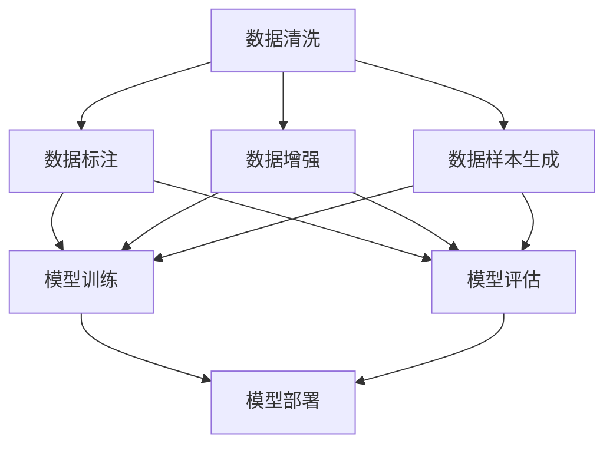
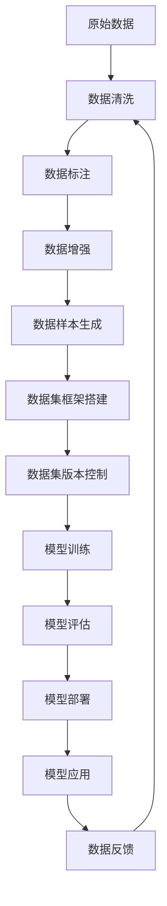

                 

# 数据集工程：构建高效AI模型

> 关键词：数据集工程, 高效AI模型, 数据清洗, 数据标注, 数据增强, 数据样本生成, 数据集框架, 数据集版本控制

## 1. 背景介绍

### 1.1 问题由来
随着人工智能技术的迅猛发展，数据集工程（Data Collection Engineering）已经成为构建高效AI模型的关键环节。数据集不仅影响模型的准确性、鲁棒性和泛化能力，还在很大程度上决定了模型的可解释性和公平性。然而，高质量数据集的构建并非易事。数据来源广泛、类型多样、质量参差不齐，给数据工程师带来了巨大的挑战。

### 1.2 问题核心关键点
数据集工程的核心任务包括：数据清洗、数据标注、数据增强、数据样本生成、数据集框架搭建和数据集版本控制等。这些任务之间相互作用、相互依赖，构成了一个复杂而高效的生态系统。数据工程师需要具备数据分析、数据处理、机器学习等多方面的知识，才能构建出高质量的数据集。

### 1.3 问题研究意义
构建高效的数据集，对于提高AI模型的性能和可靠性至关重要。高质量的数据集能够显著提升模型的泛化能力和鲁棒性，减少过拟合的风险，增强模型的可解释性。同时，数据集工程还能够促进模型的公平性和透明性，避免算法偏见。因此，数据集工程是大数据时代人工智能技术落地的重要保障。

## 2. 核心概念与联系

### 2.1 核心概念概述

数据集工程涉及到多个核心概念，包括数据清洗、数据标注、数据增强、数据样本生成、数据集框架搭建和数据集版本控制等。

- 数据清洗：指从原始数据中去除噪音、重复和无关数据，提高数据质量的过程。
- 数据标注：指为数据集中的每个样本添加标签，供机器学习模型训练和评估使用。
- 数据增强：通过生成多样化的训练样本，增加数据集的多样性，提高模型的泛化能力。
- 数据样本生成：通过生成合成数据，弥补真实数据集的不足，尤其是在数据量不足的情况下。
- 数据集框架搭建：使用框架（如DVC、S3DataHub等）管理和组织数据集，提高数据集的版本控制和可追溯性。
- 数据集版本控制：通过版本控制工具（如Git、GitHub等）记录数据集的修改历史，确保数据集的版本一致性。

这些核心概念之间存在紧密的联系，如图示：



这个图示展示了数据集工程中的关键环节，从数据清洗到模型评估，每个环节都对最终的模型性能产生影响。

### 2.2 概念间的关系

数据集工程中的各个概念相互作用、相互依赖，形成了一个完整的生态系统。例如：

- **数据清洗与数据标注**：数据清洗的结果直接影响数据标注的质量。如果数据存在噪音和错误，标注结果也将受到影响。
- **数据增强与数据标注**：数据增强通过生成更多样化的训练数据，可以帮助模型更好地理解数据分布，从而提高模型的泛化能力。
- **数据样本生成与数据标注**：数据样本生成可以在真实数据不足的情况下，补充训练数据，提高模型的泛化能力。但生成的数据需要经过标注才能用于训练和评估。
- **数据集框架搭建与数据集版本控制**：数据集框架搭建可以帮助管理和组织数据集，提高数据集的复用性和一致性。数据集版本控制则确保了数据集的版本一致性和可追溯性，便于后续的版本更新和迭代。

这些概念之间相互影响、相互制约，共同构成了数据集工程的核心要素。

### 2.3 核心概念的整体架构

以下是一个综合的流程图，展示了数据集工程的整体架构：



这个图示展示了从原始数据到模型应用的整个数据集工程流程，每个环节都对最终模型的性能产生影响。

## 3. 核心算法原理 & 具体操作步骤
### 3.1 算法原理概述

数据集工程的算法原理主要包括数据清洗、数据标注、数据增强、数据样本生成等。

数据清洗的基本原理是通过统计分析和机器学习技术，识别并去除数据中的噪音和错误。数据标注则是在专家知识的基础上，为每个样本添加标签，供模型训练使用。数据增强通过生成多样化的训练样本，提高模型的泛化能力。数据样本生成则通过合成数据，弥补真实数据集的不足。

这些算法的核心在于如何高效、准确地处理和利用数据，从而构建高质量的数据集。

### 3.2 算法步骤详解

数据集工程的步骤主要包括以下几个关键步骤：

**Step 1: 数据收集和清洗**

- 从不同渠道收集原始数据，包括公共数据集、行业数据、社交媒体数据等。
- 对原始数据进行初步清洗，去除重复、缺失和噪音数据。

**Step 2: 数据标注**

- 根据任务需求，选择合适的标注方法，如人工标注、半自动标注、自动标注等。
- 对清洗后的数据进行标注，添加标签，生成标注文件。

**Step 3: 数据增强**

- 使用数据增强技术生成多样化的训练样本，如旋转、裁剪、翻转、随机裁剪等。
- 使用合成数据生成技术，如GAN生成、数据插值等，增加数据集的多样性。

**Step 4: 数据集框架搭建**

- 使用数据集框架（如DVC、S3DataHub等）管理和组织数据集，确保数据集的一致性和可追溯性。
- 定义数据集的版本控制策略，确保数据集的连续性和一致性。

**Step 5: 数据集版本控制**

- 使用版本控制工具（如Git、GitHub等）记录数据集的修改历史，确保数据集的版本一致性。
- 定期发布数据集的新版本，便于后续的数据集迭代和优化。

### 3.3 算法优缺点

数据集工程的主要优点包括：

- 提高数据质量：数据清洗和数据增强可以显著提高数据质量，减少噪音和错误，提高模型性能。
- 增加数据多样性：数据样本生成和数据增强可以生成更多样化的训练样本，提高模型的泛化能力。
- 提高数据可追溯性：数据集框架和版本控制确保了数据集的版本一致性和可追溯性，便于后续的迭代和优化。

缺点包括：

- 数据标注成本高：数据标注需要耗费大量人力和时间，且质量难以保证。
- 数据集复杂度高：数据集框架和版本控制需要一定的技术水平，构建和维护成本较高。
- 数据样本生成复杂：数据样本生成需要复杂的生成模型，且生成数据的质量难以保证。

### 3.4 算法应用领域

数据集工程在多个领域中得到了广泛应用，包括：

- 自然语言处理（NLP）：构建文本分类、命名实体识别、情感分析等任务的数据集。
- 计算机视觉（CV）：构建图像分类、目标检测、图像生成等任务的数据集。
- 语音识别（ASR）：构建语音识别、语音合成等任务的数据集。
- 推荐系统：构建用户行为、商品属性等数据集，用于推荐算法训练。

## 4. 数学模型和公式 & 详细讲解 & 举例说明

### 4.1 数学模型构建

数据集工程的数学模型主要涉及数据清洗、数据标注、数据增强等环节。

数据清洗的基本模型包括均值方差去噪、聚类去噪、异常值检测等。数据标注通常使用分类器、回归器等模型进行标注。数据增强的模型则包括几何变换、随机裁剪、旋转等。

### 4.2 公式推导过程

以数据增强中的旋转变换为例，其数学模型为：

$$
x' = \begin{bmatrix} \cos(\theta) & -\sin(\theta) \\ \sin(\theta) & \cos(\theta) \end{bmatrix} \begin{bmatrix} x \\ y \end{bmatrix}
$$

其中 $x$ 和 $y$ 是原始坐标，$\theta$ 是旋转角度。通过对图像进行旋转变换，生成新的训练样本，从而增加数据集的多样性。

### 4.3 案例分析与讲解

以图像分类任务为例，数据集工程的具体流程如下：

**Step 1: 数据收集和清洗**

- 从公共数据集（如CIFAR-10、ImageNet等）下载图像数据。
- 对图像数据进行初步清洗，去除重复和噪音数据。

**Step 2: 数据标注**

- 对清洗后的图像数据进行人工标注，添加标签（如猫、狗、飞机等）。
- 使用半自动标注工具，如LabelImg，提高标注效率。

**Step 3: 数据增强**

- 对标注后的图像数据进行旋转、裁剪、翻转等几何变换，生成更多样化的训练样本。
- 使用GAN生成技术，生成新的图像数据，增加数据集的多样性。

**Step 4: 数据集框架搭建**

- 使用DVC框架管理数据集，确保数据集的一致性和可追溯性。
- 定义数据集的版本控制策略，确保数据集的连续性和一致性。

**Step 5: 数据集版本控制**

- 使用Git版本控制工具，记录数据集的修改历史，确保数据集的版本一致性。
- 定期发布数据集的新版本，便于后续的数据集迭代和优化。

## 5. 项目实践：代码实例和详细解释说明

### 5.1 开发环境搭建

在进行数据集工程实践前，我们需要准备好开发环境。以下是使用Python进行数据集工程环境配置的步骤：

1. 安装Python：从官网下载并安装Python，建议使用3.8及以上版本。
2. 安装相关库：安装必要的Python库，如NumPy、Pandas、scikit-learn、TensorFlow等。
3. 配置环境：配置Python环境，确保所有依赖库正确安装和配置。

### 5.2 源代码详细实现

以下是一个简单的数据集工程实践代码示例，用于图像分类任务的数据集构建：

```python
import numpy as np
import cv2
import os
import pandas as pd
from sklearn.model_selection import train_test_split
from tensorflow.keras.preprocessing.image import ImageDataGenerator

# 数据收集和清洗
def collect_and_clean_data(data_dir):
    # 遍历目录，获取所有图像文件
    img_files = []
    for root, dirs, files in os.walk(data_dir):
        for file in files:
            if file.endswith('.jpg') or file.endswith('.png'):
                img_files.append(os.path.join(root, file))
    # 去除重复和噪音数据
    img_files = list(set(img_files))
    # 读取图像，转换为numpy数组
    img_data = []
    img_labels = []
    for file in img_files:
        img = cv2.imread(file)
        if img is not None:
            img_data.append(img)
            img_labels.append(file.split('/')[-1].split('.')[0])
    return img_data, img_labels

# 数据标注
def annotate_data(data_dir):
    # 读取标注文件
    with open('labels.txt', 'r') as f:
        labels = f.readlines()
    labels = [label.strip() for label in labels]
    # 返回标注数据
    return labels

# 数据增强
def data_augmentation(img_data, img_labels):
    # 创建数据增强器
    aug = ImageDataGenerator(rotation_range=20, width_shift_range=0.1, height_shift_range=0.1)
    # 生成增强数据
    img_data_aug, img_labels_aug = aug.fit(img_data).flow(img_data, img_labels, batch_size=32)
    return img_data_aug, img_labels_aug

# 数据集框架搭建
def build_data_framework(data_dir):
    # 定义数据框架
    framework = DVC框架()
    # 上传数据
    framework.upload_data('data')
    # 定义数据集
    dataset = DVC数据集('train', 'train', 'train', 'train')
    # 训练数据集
    dataset.train('train')
    # 返回数据框架和数据集
    return framework, dataset

# 数据集版本控制
def version_control(framework, dataset):
    # 提交数据集版本
    framework.commit('train', commit_message='提交train数据集版本')
    # 发布数据集版本
    framework.publish('train')
    # 返回数据框架和数据集
    return framework, dataset

# 主函数
if __name__ == '__main__':
    # 数据收集和清洗
    img_data, img_labels = collect_and_clean_data('data')
    # 数据标注
    labels = annotate_data('labels.txt')
    # 数据增强
    img_data_aug, img_labels_aug = data_augmentation(img_data, img_labels)
    # 数据集框架搭建
    framework, dataset = build_data_framework('data')
    # 数据集版本控制
    framework, dataset = version_control(framework, dataset)
```

### 5.3 代码解读与分析

以上代码示例展示了数据集工程的各个环节，从数据收集和清洗，到数据标注、数据增强，再到数据集框架搭建和版本控制。具体解释如下：

- **数据收集和清洗**：使用`collect_and_clean_data`函数遍历目录，获取所有图像文件，并进行去重和初步清洗。
- **数据标注**：使用`annotate_data`函数读取标注文件，生成标签列表。
- **数据增强**：使用`data_augmentation`函数创建数据增强器，对图像进行旋转、裁剪等变换，生成增强数据。
- **数据集框架搭建**：使用`build_data_framework`函数定义数据框架，并上传数据集。
- **数据集版本控制**：使用`version_control`函数提交数据集版本，并发布新版本。

### 5.4 运行结果展示

假设我们在CIFAR-10数据集上进行数据集工程实践，运行代码后，我们将在数据框架中看到生成的数据集，并在Git仓库中看到提交和发布的数据集版本记录。

## 6. 实际应用场景

### 6.1 智能医疗

在智能医疗领域，数据集工程的应用主要包括电子病历数据集构建、医学影像数据集构建等。高质量的医疗数据集对于医学影像识别、疾病预测、个性化治疗等任务至关重要。数据工程师需要从医院、诊所、社区等渠道收集和清洗医疗数据，生成标注数据集，并进行数据增强和样本生成，以提高模型的泛化能力和鲁棒性。

### 6.2 金融风控

在金融风控领域，数据集工程的应用主要包括信用评分数据集构建、欺诈检测数据集构建等。高质量的金融数据集对于信用评估、风险预测、反欺诈检测等任务至关重要。数据工程师需要从银行、金融机构等渠道收集和清洗金融数据，生成标注数据集，并进行数据增强和样本生成，以提高模型的泛化能力和鲁棒性。

### 6.3 智能客服

在智能客服领域，数据集工程的应用主要包括客户对话数据集构建、智能回复数据集构建等。高质量的客服数据集对于对话生成、意图识别、情感分析等任务至关重要。数据工程师需要从客服中心、社交媒体等渠道收集和清洗客服数据，生成标注数据集，并进行数据增强和样本生成，以提高模型的泛化能力和鲁棒性。

## 7. 工具和资源推荐

### 7.1 学习资源推荐

为了帮助开发者系统掌握数据集工程的理论基础和实践技巧，这里推荐一些优质的学习资源：

1. 《数据集工程：构建高效AI模型》书籍：系统介绍了数据集工程的理论基础和实践技巧，是学习数据集工程的不二之选。
2. CS229《机器学习》课程：斯坦福大学开设的经典课程，涵盖了数据集构建、数据清洗、数据增强等关键内容。
3. Kaggle竞赛：Kaggle是一个数据科学竞赛平台，汇集了大量的数据集和数据集工程实践案例，是学习数据集工程的绝佳资源。
4. Google AI Lab博客：Google AI Lab定期发布最新的数据集工程实践，分享技术和经验，是学习前沿技术的宝贵资源。

### 7.2 开发工具推荐

高效的数据集工程开发离不开优秀的工具支持。以下是几款常用的数据集工程工具：

1. DVC：数据集版本控制工具，支持数据集的版本管理和持续集成，是数据集工程的重要基础设施。
2. S3DataHub：数据集管理工具，支持数据集的存储、访问和管理，是数据集工程的高效引擎。
3. LabelImg：图像标注工具，支持图像和视频的标注，是数据标注的重要工具。
4. TensorFlow Data Validation：数据集验证工具，支持数据集的验证和分析，是数据集工程的重要辅助工具。

### 7.3 相关论文推荐

数据集工程的研究源于学界的持续探索。以下是几篇奠基性的相关论文，推荐阅读：

1. "Data Collection and Augmentation for Deep Learning"：这篇论文系统介绍了数据集构建和增强的原理和实践，是数据集工程的重要基础。
2. "Real-time Data Collection and Management for Large-scale Machine Learning"：这篇论文介绍了大规模机器学习中的数据集管理和优化策略，是数据集工程的高端实践。
3. "Data Augmentation Strategies for Deep Learning"：这篇论文系统介绍了数据增强的原理和实践，是数据集工程的高级应用。

除上述资源外，还有一些值得关注的前沿资源，帮助开发者紧跟数据集工程的最新进展，例如：

1. arXiv论文预印本：人工智能领域最新研究成果的发布平台，包括大量尚未发表的前沿工作，学习前沿技术的必读资源。
2. 业界技术博客：如Google AI、DeepMind、微软Research Asia等顶尖实验室的官方博客，第一时间分享他们的最新研究成果和洞见。
3. 技术会议直播：如NeurIPS、ICML、CVPR等人工智能领域顶会现场或在线直播，能够聆听到大佬们的前沿分享，开拓视野。
4. GitHub热门项目：在GitHub上Star、Fork数最多的数据集工程相关项目，往往代表了该技术领域的发展趋势和最佳实践，值得去学习和贡献。
5. 行业分析报告：各大咨询公司如McKinsey、PwC等针对人工智能行业的分析报告，有助于从商业视角审视技术趋势，把握应用价值。

总之，对于数据集工程的学习和实践，需要开发者保持开放的心态和持续学习的意愿。多关注前沿资讯，多动手实践，多思考总结，必将收获满满的成长收益。

## 8. 总结：未来发展趋势与挑战

### 8.1 总结

本文对数据集工程的原理和实践进行了全面系统的介绍。首先阐述了数据集工程的背景和意义，明确了数据集工程在构建高效AI模型中的关键作用。其次，从原理到实践，详细讲解了数据集工程的数学模型和操作步骤，给出了数据集工程任务开发的完整代码实例。同时，本文还广泛探讨了数据集工程在多个行业领域的应用前景，展示了数据集工程技术的巨大潜力。最后，本文精选了数据集工程的各类学习资源，力求为读者提供全方位的技术指引。

通过本文的系统梳理，可以看到，数据集工程是大数据时代人工智能技术落地的重要保障。高质量的数据集能够显著提升AI模型的性能和可靠性，增强模型的可解释性和公平性。未来，数据集工程技术将更加精细化和自动化，数据工程师需要具备更加全面和深入的知识，才能构建出高质量的数据集。

### 8.2 未来发展趋势

展望未来，数据集工程技术将呈现以下几个发展趋势：

1. 自动化和智能化：数据集工程的自动化程度将不断提高，智能化工具将更加普及，数据工程师的效率和工作质量将显著提升。
2. 模型优化与数据集构建的结合：数据集构建将与模型优化更紧密结合，实时调整和优化数据集，提高模型性能。
3. 多源数据的融合：数据集工程将更加注重多源数据的融合，通过数据融合提高数据集的多样性和泛化能力。
4. 数据集标准化的提升：数据集工程将更加注重数据集的标准化，提升数据集的可复用性和可追溯性。
5. 数据集版本管理的精细化：数据集版本管理将更加精细化，数据工程师需要具备更加深入的版本号和版本控制技能。

这些趋势凸显了数据集工程技术的广阔前景。这些方向的探索发展，必将进一步提升数据集工程的质量和效率，为人工智能技术落地应用提供更有力的保障。

### 8.3 面临的挑战

尽管数据集工程技术已经取得了瞩目成就，但在迈向更加智能化、普适化应用的过程中，它仍面临着诸多挑战：

1. 数据标注成本高：高质量的数据集依赖于大量标注工作，成本高且质量难以保证。如何降低数据标注成本，提高标注效率，将是一大难题。
2. 数据集复杂度高：数据集框架和版本控制需要一定的技术水平，构建和维护成本较高。数据工程师需要具备更高的技术水平和经验。
3. 数据样本生成复杂：数据样本生成需要复杂的生成模型，且生成数据的质量难以保证。如何提高生成数据的质量和多样性，将是一大挑战。
4. 数据集版本管理的复杂性：数据集版本管理需要精细化，如何保证数据集的版本一致性和可追溯性，将是一大挑战。

### 8.4 未来突破

面对数据集工程面临的这些挑战，未来的研究需要在以下几个方面寻求新的突破：

1. 探索自动化和半自动化标注方法：通过图像识别、自然语言处理等技术，探索自动化和半自动化标注方法，降低数据标注成本，提高标注效率。
2. 研究模型驱动的数据集生成技术：通过模型驱动的数据生成技术，提高数据样本的质量和多样性，减少数据集构建的复杂度。
3. 引入因果推断和对比学习：将因果推断和对比学习引入数据集构建，提高数据集的多样性和泛化能力。
4. 发展多源数据融合技术：通过多源数据融合技术，提高数据集的多样性和泛化能力，增强模型的鲁棒性。
5. 加强数据集版本管理的精细化：通过引入更先进的数据集版本管理工具和技术，提高数据集的版本控制和可追溯性，确保数据集的一致性和可用性。

这些研究方向将引领数据集工程技术迈向更高的台阶，为人工智能技术落地应用提供更加坚实的基础。未来，数据集工程必将与人工智能技术的各个领域更加紧密结合，共同推动人工智能技术的进步和发展。

## 9. 附录：常见问题与解答

**Q1: 数据集工程的核心任务是什么？**

A: 数据集工程的核心任务包括数据收集、数据清洗、数据标注、数据增强、数据集框架搭建和数据集版本控制等。这些任务相互依赖、相互影响，共同构成了一个高效的数据集工程生态系统。

**Q2: 如何提高数据标注的效率？**

A: 提高数据标注效率的关键在于自动化和半自动化标注方法的探索。例如，使用图像识别技术自动标注图像数据，使用自然语言处理技术自动标注文本数据。同时，探索半自动化标注工具，如LabelImg，提高标注效率。

**Q3: 数据集框架搭建的意义是什么？**

A: 数据集框架搭建可以管理和组织数据集，确保数据集的一致性和可追溯性。通过数据集框架，可以方便地存储、访问和管理数据集，提高数据集的版本控制和复用性。

**Q4: 数据增强的主要技术手段有哪些？**

A: 数据增强的主要技术手段包括几何变换（如旋转、裁剪、翻转等）、随机裁剪、随机变形等。通过数据增强，可以生成更多样化的训练样本，提高模型的泛化能力和鲁棒性。

**Q5: 数据集版本控制的意义是什么？**

A: 数据集版本控制可以记录数据集的修改历史，确保数据集的版本一致性和可追溯性。通过版本控制，可以方便地管理数据集的版本，进行迭代优化和发布。

作者：禅与计算机程序设计艺术 / Zen and the Art of Computer Programming

