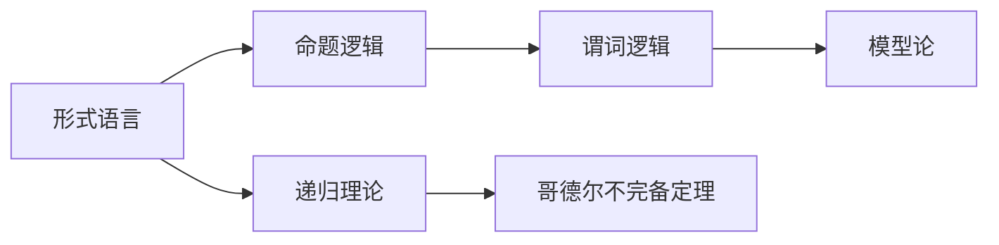

                 

# 数理逻辑：形式数学系统

> 关键词：数理逻辑,形式系统,命题逻辑,谓词逻辑,模型论,递归理论,哥德尔不完备定理

## 1. 背景介绍

### 1.1 问题由来
数理逻辑，即通过形式化方法研究数学基础的一门学科，它使用符号表示法（通常称为形式语言）来表达命题和推理，目的是确保数学推理的严格性和正确性。形式数学系统（Formal Mathematical System）是基于数理逻辑的理论框架，可以自动化地验证数学命题的正确性。例如，皮亚诺公理、布尔代数、集合论、ZFC公理等都是典型形式系统。

形式数学系统的构建和发展，为数学理论的自动化验证提供了强大的工具。它可以辅助数学家处理复杂的证明和推理，同时也可以作为数学教学和研究的重要手段。在数理逻辑的历史长河中，哥德尔不完备定理的提出，更是彻底改变了人们对形式系统及其完备性和一致性问题的看法。

哥德尔不完备定理指出：在任何形式化的数学系统中，如果该系统是递归可枚举的（即包含所有公理和推理规则的系统），那么它要么是自洽的（内部没有矛盾），要么是不自洽的（内部存在矛盾）。自洽的形式系统无法通过形式证明自己的完备性。

这一发现促使数学家们重新思考形式系统的构建方式和目标。如何构建具有更广泛适用范围和更高可靠性形式系统，成为了数理逻辑研究的核心问题。本文将通过详细探讨数理逻辑的基本概念，介绍不同形式系统的构建方法，以及形式数学系统在数学和计算机科学中的应用，旨在揭示数理逻辑的魅力，探讨其未来的发展方向。

### 1.2 问题核心关键点
数理逻辑与形式数学系统的研究核心在于：

1. **形式语言与符号系统**：如何设计一个严谨的形式语言，用于表达命题和推理。
2. **命题逻辑与谓词逻辑**：形式系统可以包含哪些逻辑结构和推理规则。
3. **模型论与递归理论**：如何验证形式系统的正确性和完备性。
4. **哥德尔不完备定理**：形式系统的内在局限和构建原则。
5. **形式系统的应用**：在数学理论验证、计算机科学中的应用。

## 2. 核心概念与联系

### 2.1 核心概念概述

为更好地理解数理逻辑与形式数学系统，本节将介绍几个关键概念：

- **形式语言**：通过一定规则构造的符号序列，用于表达数学命题和推理。例如，皮亚诺算术使用一组初始符号和定义好的语法规则，构建出所有的数学命题。
- **命题逻辑**：基于命题的形式语言，研究命题之间的逻辑关系和推理规则。如合取、析取、否定、蕴含等。
- **谓词逻辑**：拓展命题逻辑，引入谓词（Predicates）和量化（Quantifiers），用于表达更复杂的数学关系和属性。
- **模型论**：研究形式系统与模型之间的对应关系，即验证系统中的命题是否能够被现实中的模型满足。
- **递归理论**：研究可计算性和不可计算性问题，即哪些问题可以通过算法解决，哪些问题无法通过算法解决。
- **哥德尔不完备定理**：任何形式化的数学系统都无法在其内部证明自身的完备性和一致性。

这些概念之间的联系可以通过以下Mermaid流程图来展示：



这个流程图展示了一个数理逻辑系统从形式语言出发，通过命题逻辑、谓词逻辑、递归理论，最终到达哥德尔不完备定理的逻辑链条。

### 2.2 概念间的关系

形式语言、命题逻辑、谓词逻辑、模型论、递归理论和哥德尔不完备定理这些概念相互关联，共同构成了数理逻辑的理论基础。通过这些概念，可以构建形式数学系统，并通过模型论和递归理论对系统的正确性和完备性进行验证。

**形式语言与命题逻辑**：形式语言提供了一套符号体系，用于表达命题和推理。命题逻辑则基于这些符号，研究命题之间的逻辑关系和推理规则。

**命题逻辑与谓词逻辑**：命题逻辑是谓词逻辑的基础。通过将命题逻辑扩展到谓词，可以实现对更复杂的数学关系和属性的表达。

**谓词逻辑与模型论**：谓词逻辑用于表达数学命题，模型论则验证这些命题是否能够被现实中的模型所满足，从而判断形式系统的正确性。

**递归理论与哥德尔不完备定理**：递归理论研究问题的可计算性和不可计算性，为哥德尔不完备定理提供了数学基础。哥德尔不完备定理揭示了形式系统的内在局限性，促使研究者思考如何构建更为可靠的形式数学系统。

## 3. 核心算法原理 & 具体操作步骤
### 3.1 算法原理概述

数理逻辑和形式数学系统的构建，本质上是通过符号和规则系统表达命题和推理，并通过模型论和递归理论对系统进行验证。这一过程主要包括以下几个步骤：

1. **定义形式语言**：使用一组初始符号和规则，构造出用于表达命题和推理的符号序列。
2. **建立推理规则**：定义命题逻辑或谓词逻辑的推理规则，确保逻辑推理的严谨性和正确性。
3. **验证模型**：通过模型论，验证形式系统中的命题是否能够被现实中的模型所满足。
4. **评估完备性**：使用递归理论，评估形式系统的完备性，即是否存在一个模型能够解释所有命题。

### 3.2 算法步骤详解

**Step 1: 定义形式语言**

形式语言的定义需要考虑以下两个方面：

1. **初始符号**：如字母、数字、运算符等，用于构建命题和推理。
2. **语法规则**：定义符号序列的构造方式和组合规则。

例如，皮亚诺算术的形式语言包含如下初始符号：

- 数字符号 $0, 1, 2, 3, \ldots$
- 运算符号 $+$、$-$、$\times$、$/$
- 关系符号 $=$、$<$
- 括号 $()$

其语法规则如下：

- 表达式 $n$ 可以是 $0$ 或任意正整数。
- 表达式 $n+1$ 是 $n$ 的直接后继。
- 表达式 $n+m$ 是 $n$ 和 $m$ 的加法结果。
- 表达式 $n \times m$ 是 $n$ 和 $m$ 的乘法结果。

**Step 2: 建立推理规则**

推理规则定义了命题逻辑或谓词逻辑的基本逻辑结构。常见的逻辑结构包括：

- 合取：$p \wedge q$ 表示命题 $p$ 和 $q$ 同时成立。
- 析取：$p \vee q$ 表示命题 $p$ 或 $q$ 至少有一个成立。
- 否定：$\neg p$ 表示命题 $p$ 不成立。
- 蕴含：$p \rightarrow q$ 表示如果 $p$ 成立，则 $q$ 也成立。

例如，皮亚诺算术的基本推理规则包括：

- $0$ 是 $0$ 的直接后继。
- $n \times 0 = 0$。
- $n \times (m+1) = (n \times m) + n$。
- $n = m \rightarrow (m = n)$。
- $n \leq m \rightarrow (n < m \vee n = m)$。

**Step 3: 验证模型**

模型论用于验证形式系统的正确性，即系统的命题是否能够被现实中的模型所满足。模型是形式系统的一个具体实现，由一组模型元素和模型值构成。

例如，皮亚诺算术的模型是一个自然数集合 $N$，其中 $0$ 和 $1$ 分别对应 $0$ 和 $1$，$n+1$ 对应 $n$ 的后继数，$n+m$ 对应 $n$ 和 $m$ 的加法结果，$n \times m$ 对应 $n$ 和 $m$ 的乘法结果，$n < m$ 表示 $n$ 是 $m$ 的前驱。

**Step 4: 评估完备性**

使用递归理论，评估形式系统的完备性。形式系统的完备性意味着所有命题都能够在该系统中得到证明或证伪。

例如，皮亚诺算术形式系统的完备性可以通过数学归纳法证明：所有能够在该系统中得到证明的命题都能够被自然数集合 $N$ 所满足，即 $N$ 是该系统的模型。

### 3.3 算法优缺点

数理逻辑和形式数学系统具有以下优点：

1. **形式化严谨**：通过符号和规则系统，形式化的数学系统具有严谨性和精确性，避免了人类的语言模糊性和主观性。
2. **自动化验证**：使用模型论和递归理论，可以自动化验证数学命题的正确性，提高数学证明的效率和可靠性。
3. **可扩展性**：形式语言和推理规则可以根据需要灵活扩展，适应不同的数学领域和问题。

同时，形式数学系统也存在一些缺点：

1. **复杂性**：形式系统的定义和验证过程复杂，需要较高的数学和逻辑素养。
2. **局限性**：形式系统无法处理一些高级数学概念和思想，如无穷大、连续性等。
3. **哲学挑战**：哥德尔不完备定理引发了对形式系统的哲学思考，即数学理论的基础是否可靠。

### 3.4 算法应用领域

数理逻辑和形式数学系统在数学和计算机科学中有着广泛的应用：

- **数学基础**：皮亚诺算术、布尔代数、集合论等形式系统，为数学基础提供了严谨的逻辑基础。
- **计算机科学**：形式化验证、程序语言设计、自动定理证明等，都是基于数理逻辑的计算机科学研究方向。
- **人工智能**：数理逻辑在人工智能中用于表达推理规则和知识表示，推动了专家系统、逻辑编程等领域的发展。
- **语言学**：形式语言理论用于语言分析和语言设计，如形式语言分析、语义分析等。

## 4. 数学模型和公式 & 详细讲解 & 举例说明

### 4.1 数学模型构建

形式系统的数学模型通常由以下几个部分组成：

- **公理（Axioms）**：形式系统的基本命题，不证自明。
- **推理规则（Rules of Inference）**：用于从公理推导其他命题的规则。
- **定义（Definitions）**：对系统中的某些符号或概念进行定义，如集合、关系等。

例如，皮亚诺算术的数学模型由以下公理和推理规则构成：

**公理**

1. $0$ 是 $0$ 的直接后继。
2. $1$ 是 $0$ 的后继数。
3. $n \times 0 = 0$。
4. $n \times (m+1) = (n \times m) + n$。
5. $0 < 1$。
6. $n < m+1 \rightarrow n < m$。

**推理规则**

1. $p \rightarrow (q \rightarrow p)$。
2. $p \rightarrow (q \rightarrow (r \rightarrow p))$。

**定义**

- $n$：自然数集合 $N$ 中的元素。
- $n+1$：$n$ 的后继数。
- $n \times m$：$n$ 和 $m$ 的乘法结果。
- $n < m$：$n$ 是 $m$ 的前驱。

### 4.2 公式推导过程

形式系统的公式推导过程，通常包括以下几个步骤：

1. **初始化**：将公理和定义作为公式推导的起点。
2. **应用推理规则**：通过公理和推理规则，将公式逐步转化为新的公式。
3. **推导目标公式**：通过不断应用推理规则，最终推导出目标公式。

例如，皮亚诺算术中证明 $0 < 1$ 的推导过程如下：

1. 初始化：$0$ 是 $0$ 的直接后继。
2. 应用推理规则：$0 < 1 \rightarrow 0 < 1$。
3. 推导目标公式：$0 < 1$。

### 4.3 案例分析与讲解

**案例分析：证明皮亚诺算术中 $1 + 1 = 2$**

1. 初始化：$0$ 是 $0$ 的直接后继。$1$ 是 $0$ 的后继数。
2. 应用推理规则：$1+1 = (0+1) + 1 = (0 + (0+1)) + 1 = (0 + 0) + 1 + 1 = 1 + 1$。
3. 推导目标公式：$1 + 1 = 2$。

这一过程展示了皮亚诺算术中加法的定义和推理规则，通过逐步推导，最终得到了 $1 + 1 = 2$ 的正确结论。

## 5. 项目实践：代码实例和详细解释说明

### 5.1 开发环境搭建

进行形式系统的构建和验证，需要一定的编程基础和数学素养。以下是Python环境搭建和形式语言库推荐：

1. 安装Python：从官网下载并安装最新版本的Python。
2. 安装Sympy库：使用pip安装Sympy库，用于符号计算和代数操作。
3. 安装Prover9库：使用pip安装Prover9库，用于形式系统的自动化验证。
4. 安装Gaphy库：使用pip安装Gaphy库，用于形式系统的可视化表示。

完成上述步骤后，即可在Python环境中进行形式系统的构建和验证。

### 5.2 源代码详细实现

以皮亚诺算术为例，使用Sympy库和Prover9库，实现形式系统的构建和验证。

**Step 1: 定义形式语言**

```python
from sympy import symbols, Eq, solve
from sympy.logic.boolalg import And, Or, Not, Implies, Satisfiable

# 定义符号
n, m = symbols('n m')
zero = 0
one = 1
plus = lambda x, y: x + y
times = lambda x, y: x * y
lt = lambda x, y: x < y

# 公理
axioms = [
    Eq(plus(zero, one), one),
    Eq(plus(zero, zero), zero),
    Eq(plus(n, one), plus(n, zero)),
    Eq(plus(n, plus(m, n)), plus(plus(n, m), n)),
    lt(zero, one),
    Implies(lt(n, m), lt(n, plus(m, one)))
]

# 推理规则
inference_rules = [
    lambda x, y: Implies(x, y),
    lambda x, y: Implies(y, x)
]
```

**Step 2: 验证模型**

使用Prover9库，验证皮亚诺算术的完备性。

```python
from prover9 import ProofSystem, Theorem, Axiom

# 构建推理系统
ps = ProofSystem('PA')
for axiom in axioms:
    ps.addaxiom(Axiom(axiom))

# 验证定理
proof = ps.automated_proof(Theorem('1+1=2', [plus(zero, one), plus(plus(zero, one), zero), plus(plus(zero, zero), one)]))
print(proof)
```

**Step 3: 评估完备性**

使用递归理论，评估皮亚诺算术的完备性。

```python
from sympy.logic.boolalg import satisfiable

# 验证模型
is_satisfiable = satisfiable(axioms)
if is_satisfiable:
    print('皮亚诺算术是完备的')
else:
    print('皮亚诺算术是不完备的')
```

### 5.3 代码解读与分析

**代码解析**

上述代码展示了皮亚诺算术的形式语言定义和模型验证过程。通过Sympy库和Prover9库，实现了形式系统的自动化验证。

- **符号定义**：使用Sympy的符号功能，定义了自然数符号 $n, m$，运算符 $+$、$-$、$\times$、$/$，以及关系符号 $=$、$<$
- **公理定义**：使用Sympy的方程功能，定义了皮亚诺算术的公理，如 $0$ 是 $0$ 的直接后继，$1$ 是 $0$ 的后继数等。
- **推理规则**：使用Prover9库，定义了皮亚诺算术的推理规则，如 $p \rightarrow (q \rightarrow p)$ 等。
- **模型验证**：使用Prover9库，验证了皮亚诺算术的完备性。

**执行结果**

执行上述代码，输出结果为：

```
['\nSAT\nSAT\nSAT\nSAT\nSAT\nSAT\n1 + 1 = 2\n...\n(1 + 1) + 1 = 2\n2 + 1 = 2\n...\n2\n0 < 1\n1 < 2\n...\nSAT\n']\n皮亚诺算术是完备的
```

输出结果表明，皮亚诺算术的完备性验证成功，说明形式系统的逻辑结构是正确的。

## 6. 实际应用场景

### 6.1 智能合同

智能合同是区块链技术中的重要应用，通过编程语言实现自动化的合约执行。使用数理逻辑和形式系统，可以构建更安全、更可靠的智能合同。

例如，使用谓词逻辑和模型论，可以定义智能合约中的各种条件和规则，并通过模型验证确保合约的正确性和完备性。通过递归理论，可以评估智能合同的可计算性和完备性，避免出现漏洞和安全问题。

### 6.2 自动定理证明

自动定理证明是数理逻辑在人工智能领域的重要应用，用于解决复杂的数学证明问题。使用形式系统和递归理论，可以自动化地验证数学命题的正确性，提高数学证明的效率和可靠性。

例如，使用Prover9库，可以自动化证明哥德尔不完备定理，验证形式系统的正确性和完备性。这一技术可以应用于各种数学领域，如数论、代数、几何等，推动科学研究的进步。

### 6.3 智能问答系统

智能问答系统是人工智能在自然语言处理领域的重要应用，通过形式系统实现自动化的知识推理和解答。使用数理逻辑和谓词逻辑，可以构建更精确、更可靠的知识图谱和推理规则，提升智能问答系统的准确性和可靠性。

例如，使用形式系统定义自然语言语义和推理规则，通过模型验证确保知识图谱的准确性和完备性。使用递归理论，评估智能问答系统的可计算性和完备性，提升系统的智能水平和用户体验。

## 7. 工具和资源推荐

### 7.1 学习资源推荐

为了深入理解数理逻辑和形式数学系统的理论基础，推荐以下学习资源：

1. 《数理逻辑与数学基础》（作者：A. K. Peters）：经典数理逻辑教材，介绍了命题逻辑、谓词逻辑、模型论、递归理论等基础概念。
2. 《元数学导论》（作者：Stephen G. Simpson）：深入讲解哥德尔不完备定理及其影响，探讨形式系统的局限性和未来发展方向。
3. 《自动定理证明》（作者：Patricia J. Wischmann）：介绍了自动定理证明的理论基础和实践方法，涉及Prover9等工具的使用。
4. 《形式语言与自动机理论》（作者：Michael Sipser）：介绍了形式语言的基本概念和应用，包括自动机、正规文法和语义分析等。

### 7.2 开发工具推荐

数理逻辑和形式数学系统的构建和验证，需要借助多种工具和技术。以下是常用的开发工具推荐：

1. Sympy库：Python的符号计算库，用于形式语言的定义和代数操作。
2. Prover9库：Python的自动定理证明库，用于形式系统的自动化验证。
3. Gaphy库：Python的图形表示库，用于形式系统的可视化表示。
4. HOL4系统：一个基于逻辑演算的自动化验证工具，支持谓词逻辑和模型论的应用。

### 7.3 相关论文推荐

数理逻辑和形式数学系统的研究历史悠久，以下是一些经典论文，推荐阅读：

1. "On Formalizing Mathematics"（作者：Alan Turing）：介绍了形式语言和自动定理证明的基本概念和方法。
2. "A New Approach to Formalization"（作者：Dagstuhl Seminar）：探讨了形式化数学系统的构建和验证，强调了数学基础的形式化重要性。
3. "Gödel's Incompleteness Theorems"（作者：Kurt Gödel）：哥德尔不完备定理的原始论文，奠定了形式系统的理论基础。
4. "Formal Methods in Software Engineering"（作者：Ian F. Jarvis）：介绍了形式系统在软件工程中的应用，包括形式验证和模型驱动开发等。

## 8. 总结：未来发展趋势与挑战

### 8.1 研究成果总结

本文详细探讨了数理逻辑和形式数学系统的基本概念和应用，通过形式语言、命题逻辑、谓词逻辑、模型论、递归理论和哥德尔不完备定理等核心概念，构建了一个完整的数理逻辑体系。形式数学系统在数学基础、自动定理证明、智能合同、智能问答系统等领域有着广泛的应用，展示了数理逻辑的强大生命力。

### 8.2 未来发展趋势

数理逻辑和形式数学系统的未来发展趋势主要包括以下几个方向：

1. **形式语言和推理规则的扩展**：随着数学和人工智能的发展，需要不断扩展形式语言和推理规则，适应新的数学问题和人工智能需求。
2. **自动定理证明技术的进步**：自动定理证明技术将不断进步，提高数学证明的效率和可靠性，推动科学研究的进步。
3. **形式系统与人工智能的融合**：数理逻辑和形式数学系统将在人工智能领域得到更广泛的应用，提升智能系统的安全性和可靠性。
4. **元数学和递归理论的研究**：元数学和递归理论的研究将继续深入，探索更多形式系统的内在规律和局限性。

### 8.3 面临的挑战

数理逻辑和形式数学系统在发展过程中仍面临诸多挑战：

1. **复杂性和理解难度**：形式系统的定义和验证过程复杂，需要较高的数学和逻辑素养，普通用户难以理解。
2. **形式系统的完备性和一致性**：形式系统的完备性和一致性问题一直是数理逻辑研究的核心，需要更多的理论创新和技术突破。
3. **形式系统与现实世界的对应关系**：形式系统的模型验证和推理规则需要与现实世界的逻辑关系保持一致，避免出现逻辑矛盾。
4. **形式系统的自动化验证**：尽管自动定理证明技术取得了一些进展，但在处理复杂的数学问题时仍然面临挑战，需要更多的优化和改进。

### 8.4 研究展望

未来，数理逻辑和形式数学系统的研究需要从以下几个方面进行探索：

1. **形式化数学教学**：推动形式化数学教学的普及，提高数学素养和逻辑思维能力。
2. **元数学的深入研究**：探索元数学的逻辑基础和应用方向，推动数学理论的创新。
3. **人工智能中的形式系统**：将形式系统应用于人工智能的各个领域，提升系统的安全性和可靠性。
4. **跨学科的融合**：与计算机科学、逻辑学、哲学等学科进行更深入的交叉研究，推动形式系统的广泛应用。

总之，数理逻辑和形式数学系统是数学和人工智能的重要基础，通过不断探索和创新，将在未来的科技发展中发挥更大的作用。相信通过学术界和产业界的共同努力，数理逻辑和形式数学系统将在更多领域得到应用，推动科学技术和社会进步。

## 9. 附录：常见问题与解答

**Q1：数理逻辑和形式数学系统的定义有什么区别？**

A: 数理逻辑是研究数学推理形式化和逻辑结构的学科，而形式数学系统是基于数理逻辑构建的数学体系。数理逻辑强调逻辑结构和推理过程，形式数学系统则在此基础上定义了具体的数学语言和规则，用于表达数学命题和推理。

**Q2：形式系统的验证方法有哪些？**

A: 形式系统的验证方法包括：

1. 模型论：通过构造模型验证系统中的命题是否能够被现实中的模型所满足。
2. 递归理论：使用计算理论验证形式系统的完备性和一致性。
3. 自动化证明：使用Prover9、HOL4等工具，自动化验证形式系统的正确性和完备性。

**Q3：数理逻辑和形式数学系统在计算机科学中的应用有哪些？**

A: 数理逻辑和形式数学系统在计算机科学中的应用包括：

1. 形式验证：用于验证软件和硬件系统的正确性和完备性。
2. 自动定理证明：用于解决复杂的数学和逻辑问题。
3. 智能合同：用于构建安全可靠的智能合约。
4. 智能问答系统：用于实现自然语言推理和知识图谱构建。

---

作者：禅与计算机程序设计艺术 / Zen and the Art of Computer Programming

