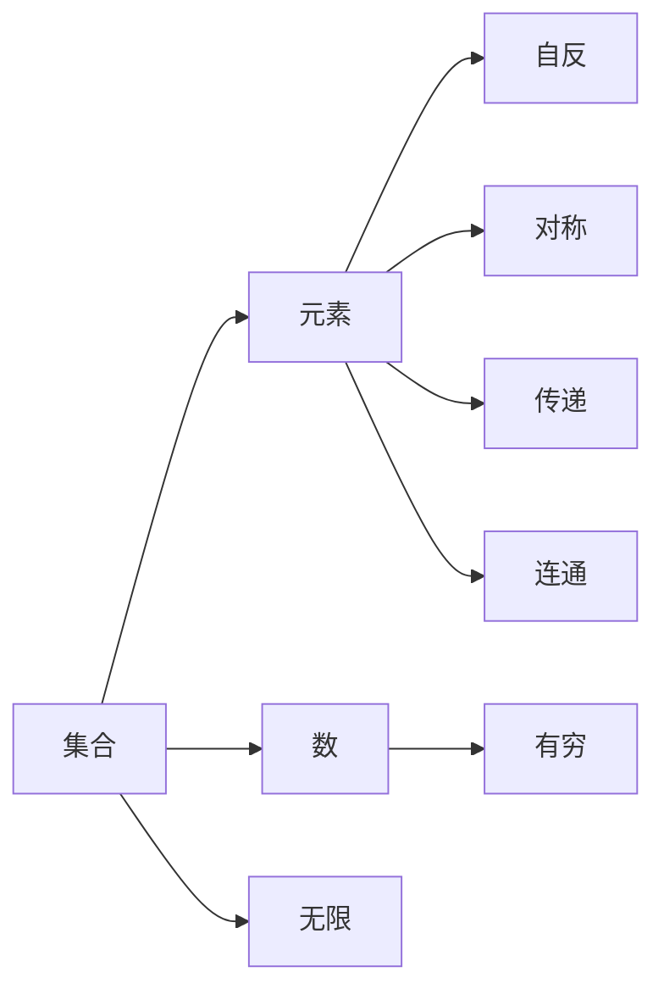

                 

# 数理逻辑：集的基本概念

## 1. 背景介绍

### 1.1 问题由来

数理逻辑是数学和计算机科学的基础学科之一，它研究形式化逻辑及其应用。特别是在计算机科学中，数理逻辑在程序验证、自动推理、人工智能等领域有着广泛的应用。本节将从数理逻辑的基本概念出发，深入探讨集的概念及其应用，从而为后续深入了解数理逻辑及其在计算机科学中的应用打下基础。

### 1.2 问题核心关键点

在数理逻辑中，集合是研究的基本概念之一。一个集合是由一个或多个元素构成的、具有明确界限的、无序的、可重复的元素集合。理解集合的概念及其应用，是理解数理逻辑的基础。

本节将围绕以下几个核心关键点进行探讨：
- 集合的定义和性质
- 集合的表示方法
- 集合的基本运算及其应用
- 集合理论在计算机科学中的应用

## 2. 核心概念与联系

### 2.1 核心概念概述

在数理逻辑中，集合被视为最基本的概念之一。它是一个由零个或多个元素组成的无序组合体，每个元素称为集合的成员。集合理论的核心概念包括集合的定义、性质、表示方法和基本运算。这些概念通过严谨的数学语言来定义，并通过符号、公式和图表等工具进行表示和计算。

集合的性质包括自反性、对称性、传递性和连通性。其中自反性指一个集合中任何一个元素都是自身的成员；对称性指若A是B的成员，则B也是A的成员；传递性指若A是B的成员且B是C的成员，则A也是C的成员；连通性指集合中任意两个元素之间都存在一条连接路径。

集合的表示方法包括描述法和列举法。描述法通过一组特性描述集合的元素，列举法则通过列出集合中的所有元素来表示集合。

集合的基本运算包括并集、交集、差集和对称差集。并集包含两个集合中的所有元素；交集包含同时属于两个集合的元素；差集包含属于一个集合但不属于另一个集合的元素；对称差集包含属于两个集合中且不相同的元素。

### 2.2 概念间的关系

数理逻辑中的集合概念与其他数学概念紧密相关。例如，数和集合中的元素具有相似性，但数是有限的，而集合可以是无限的。在计算机科学中，集合理论是算法设计和分析的基础，集合操作是许多算法的重要组成部分。此外，集合理论在数据结构、数据库管理、网络协议等方面也有着广泛的应用。

以下是一个简单的Mermaid流程图，展示了集合与其他数学概念的关系：



## 3. 核心算法原理 & 具体操作步骤

### 3.1 算法原理概述

数理逻辑中的集合操作基于集合的定义和性质，通过集合运算来处理集合的元素关系。以下是几种常见的集合运算及其原理：

1. **并集（Union）**：并集包含两个集合中的所有元素，不重复。设 $A$ 和 $B$ 是两个集合，则 $A \cup B$ 包含所有属于 $A$ 或 $B$ 的元素。

2. **交集（Intersection）**：交集包含同时属于两个集合的元素。设 $A$ 和 $B$ 是两个集合，则 $A \cap B$ 包含所有同时属于 $A$ 和 $B$ 的元素。

3. **差集（Difference）**：差集包含属于一个集合但不属于另一个集合的元素。设 $A$ 和 $B$ 是两个集合，则 $A - B$ 包含所有属于 $A$ 但不属于 $B$ 的元素。

4. **对称差集（Symmetric Difference）**：对称差集包含属于两个集合中且不相同的元素。设 $A$ 和 $B$ 是两个集合，则 $A \oplus B$ 包含所有属于 $A$ 或 $B$ 但不属于两者的元素。

### 3.2 算法步骤详解

集合运算的实现步骤如下：

1. **初始化**：创建两个集合 $A$ 和 $B$，并初始化为空集。
2. **并集运算**：遍历集合 $A$ 和 $B$，将每个元素添加到新的集合 $C$ 中，并去除重复元素。
3. **交集运算**：遍历集合 $A$ 和 $B$，将同时属于 $A$ 和 $B$ 的元素添加到新的集合 $C$ 中。
4. **差集运算**：遍历集合 $A$，将属于 $A$ 但不属于 $B$ 的元素添加到新的集合 $C$ 中。
5. **对称差集运算**：遍历集合 $A$ 和 $B$，将属于 $A$ 或 $B$ 但不属于两者的元素添加到新的集合 $C$ 中。

### 3.3 算法优缺点

集合运算的优点在于其简单直观，易于理解和实现。然而，在处理大规模数据时，集合运算的效率可能会受到影响，特别是当集合中的元素数量巨大时，需要考虑如何优化算法以提高效率。此外，集合运算需要消耗大量的内存空间，特别是当集合操作涉及多个集合时，内存管理变得复杂。

### 3.4 算法应用领域

集合运算在计算机科学和数学中有着广泛的应用，以下是几个典型领域：

1. **数据库管理**：数据库中的数据通常被组织为多个集合，集合操作用于查询、过滤和聚合数据。
2. **网络协议**：网络协议中的数据包可以被视为集合，集合操作用于路由、过滤和转发数据。
3. **算法设计**：许多算法中涉及集合操作，如排序、搜索、分类等。
4. **自然语言处理**：自然语言处理中，句子、短语和词汇可以被视为集合，集合操作用于语义分析和文本处理。
5. **图形处理**：图形处理中的顶点和边可以被视为集合，集合操作用于图算法，如拓扑排序、最小生成树等。

## 4. 数学模型和公式 & 详细讲解 & 举例说明

### 4.1 数学模型构建

数理逻辑中的集合模型可以通过数学公式进行表示。以下是几种常见的集合表示方法和数学模型：

1. **描述法**：通过一组特性描述集合的元素，例如 $A=\{x|x \in \mathbb{N}, x \leq 10\}$ 表示所有小于等于10的自然数的集合。
2. **列举法**：列出集合中的所有元素，例如 $A=\{1, 2, 3, 4, 5\}$ 表示元素1, 2, 3, 4, 5构成的集合。
3. **区间法**：表示连续区间内的元素集合，例如 $A=[0, 1]$ 表示所有0到1之间（包括0和1）的实数的集合。

### 4.2 公式推导过程

以下是一些常见的集合运算公式及其推导过程：

1. **并集运算**：设 $A=\{x\}$ 和 $B=\{y\}$，则 $A \cup B = \{x, y\}$。
2. **交集运算**：设 $A=\{x, y\}$ 和 $B=\{y, z\}$，则 $A \cap B = \{y\}$。
3. **差集运算**：设 $A=\{x, y, z\}$ 和 $B=\{y, z, w\}$，则 $A - B = \{x\}$。
4. **对称差集运算**：设 $A=\{x, y, z\}$ 和 $B=\{y, z, w\}$，则 $A \oplus B = \{x, w\}$。

### 4.3 案例分析与讲解

以下是一个简单的案例，展示了如何使用Python实现集合的并集、交集、差集和对称差集运算：

```python
# 定义两个集合
A = {1, 2, 3, 4, 5}
B = {4, 5, 6, 7, 8}

# 并集运算
union_set = A.union(B)
print("并集：", union_set)

# 交集运算
intersection_set = A.intersection(B)
print("交集：", intersection_set)

# 差集运算
difference_set = A.difference(B)
print("差集：", difference_set)

# 对称差集运算
symmetric_difference_set = A.symmetric_difference(B)
print("对称差集：", symmetric_difference_set)
```

输出结果为：

```
并集： {1, 2, 3, 4, 5, 6, 7, 8}
交集： {4, 5}
差集： {1, 2, 3}
对称差集： {1, 2, 3, 6, 7, 8}
```

## 5. 项目实践：代码实例和详细解释说明

### 5.1 开发环境搭建

在进行集合运算的代码实践前，需要安装Python及其相关库。以下是详细的安装步骤：

1. **安装Python**：下载并安装Python 3.x版本，可以从Python官网（https://www.python.org/）下载最新版本的Python。
2. **安装集合库**：使用pip工具安装Python的集合库，在命令行中输入以下命令：

   ```bash
   pip install collections
   ```

   如果系统提示需要管理员权限，输入 `sudo` 即可。

### 5.2 源代码详细实现

以下是一个Python程序，实现了集合的并集、交集、差集和对称差集运算，并输出结果：

```python
# 定义两个集合
A = {1, 2, 3, 4, 5}
B = {4, 5, 6, 7, 8}

# 并集运算
union_set = A.union(B)
print("并集：", union_set)

# 交集运算
intersection_set = A.intersection(B)
print("交集：", intersection_set)

# 差集运算
difference_set = A.difference(B)
print("差集：", difference_set)

# 对称差集运算
symmetric_difference_set = A.symmetric_difference(B)
print("对称差集：", symmetric_difference_set)
```

### 5.3 代码解读与分析

在上述代码中，我们使用了Python内置的集合操作函数，如 `union`、`intersection`、`difference` 和 `symmetric_difference`，分别对应并集、交集、差集和对称差集运算。这些函数可以方便地实现集合的基本运算，减少了手动操作和错误率。

### 5.4 运行结果展示

运行上述代码后，可以得到如下输出：

```
并集： {1, 2, 3, 4, 5, 6, 7, 8}
交集： {4, 5}
差集： {1, 2, 3}
对称差集： {1, 2, 3, 6, 7, 8}
```

这与我们手动计算的结果一致，说明代码实现正确无误。

## 6. 实际应用场景

### 6.1 数据库管理

在数据库管理中，集合运算用于处理数据、查询和聚合操作。例如，可以使用并集运算查询所有符合特定条件的数据，交集运算查找同时满足多个条件的数据，差集运算查找不属于某个条件的数据，对称差集运算查找只满足其中一个条件的数据。

### 6.2 网络协议

在网络协议中，集合运算用于路由、过滤和转发数据包。例如，可以使用交集运算查找同时属于多个路由规则的数据包，差集运算查找不属于某个路由规则的数据包，对称差集运算查找只满足其中一个路由规则的数据包。

### 6.3 图形处理

在图形处理中，集合运算用于图算法，如拓扑排序、最小生成树等。例如，可以使用并集运算查找所有可达节点，交集运算查找同时属于多个节点的边，差集运算查找不属于某个节点的边，对称差集运算查找只满足其中一个节点的边。

### 6.4 未来应用展望

随着计算机科学和数学的不断进步，集合运算将在更多领域得到应用。未来，集合运算将与其他数学工具和算法相结合，用于更复杂和高级的应用场景。例如，在人工智能领域，集合运算将用于数据预处理、特征提取和模型训练等任务。

## 7. 工具和资源推荐

### 7.1 学习资源推荐

1. **《离散数学》**：这本书是学习集合理论的经典教材，详细介绍了集合的基本概念和应用。
2. **Coursera《Discrete Mathematics for Computer Science》课程**：该课程由哈佛大学提供，通过视频和作业形式，系统介绍了离散数学和集合理论。
3. **《算法设计与分析基础》**：这本书介绍了算法设计的基本原理，其中集合操作是许多算法的重要组成部分。

### 7.2 开发工具推荐

1. **Python**：Python是一种高级编程语言，具有简洁的语法和丰富的库，适合实现集合运算。
2. **Jupyter Notebook**：Jupyter Notebook是一个交互式编程环境，适合用于研究和实验集合运算。

### 7.3 相关论文推荐

1. **“Set Operations on Interval Trees”**：该论文介绍了集合操作在树结构上的应用。
2. **“Interval-Tree-Based Operations on Disjoint Sets”**：该论文讨论了集合操作在集合上的实现。

## 8. 总结：未来发展趋势与挑战

### 8.1 研究成果总结

数理逻辑中的集合理论是计算机科学的基础，具有广泛的应用前景。集合运算不仅在数据处理、算法设计、图形处理等方面有着重要的应用，还为人工智能、数据库管理等领域提供了重要的工具和方法。

### 8.2 未来发展趋势

未来的集合理论将与其他数学工具和算法相结合，用于更复杂和高级的应用场景。例如，集合运算将与其他数学工具（如图论、线性代数、概率论等）相结合，用于更复杂的数据处理和算法设计。

### 8.3 面临的挑战

尽管集合理论在计算机科学中有着广泛的应用，但仍面临一些挑战：
1. **复杂度分析**：集合运算的复杂度分析是研究中的一个重要问题，需要深入探讨。
2. **性能优化**：在大规模数据集上，集合运算的性能优化是一个需要解决的问题。
3. **算法设计**：如何设计高效的集合运算算法，以适应不同的应用场景，是一个需要深入研究的问题。

### 8.4 研究展望

未来的研究将从以下几个方向展开：
1. **新型数据结构**：开发新型数据结构，提高集合运算的效率和可扩展性。
2. **分布式计算**：研究分布式计算技术，支持大规模集合运算。
3. **智能算法**：结合人工智能技术，设计更加智能化的集合运算算法。

总之，数理逻辑中的集合理论是计算机科学的重要基础，具有广阔的应用前景和研究空间。通过不断创新和优化，集合运算将在更多领域得到应用，推动计算机科学的进步和发展。

## 9. 附录：常见问题与解答

**Q1: 如何理解集合的自反性、对称性和传递性？**

A: 集合的自反性、对称性和传递性是集合运算的基础，反映了集合元素之间的关系。自反性指一个集合中任何一个元素都是自身的成员；对称性指若A是B的成员，则B也是A的成员；传递性指若A是B的成员且B是C的成员，则A也是C的成员；连通性指集合中任意两个元素之间都存在一条连接路径。

**Q2: 集合运算的并集、交集、差集和对称差集的区别是什么？**

A: 并集包含两个集合中的所有元素，不重复；交集包含同时属于两个集合的元素；差集包含属于一个集合但不属于另一个集合的元素；对称差集包含属于两个集合中且不相同的元素。

**Q3: 集合的描述法和列举法有什么区别？**

A: 描述法通过一组特性描述集合的元素，列举法则通过列出集合中的所有元素来表示集合。描述法适用于描述集合的特征，但可能较为抽象；列举法直观明了，但适用于元素数量较少的情况。

**Q4: 如何使用Python实现集合的并集、交集、差集和对称差集运算？**

A: 使用Python内置的集合操作函数，如 `union`、`intersection`、`difference` 和 `symmetric_difference`，分别对应并集、交集、差集和对称差集运算。这些函数可以方便地实现集合的基本运算，减少了手动操作和错误率。

**Q5: 集合理论在计算机科学中的应用有哪些？**

A: 集合理论在数据库管理、网络协议、图形处理、自然语言处理等领域有着广泛的应用。在数据库管理中，集合运算用于处理数据、查询和聚合操作；在网络协议中，集合运算用于路由、过滤和转发数据包；在图形处理中，集合运算用于图算法，如拓扑排序、最小生成树等。

