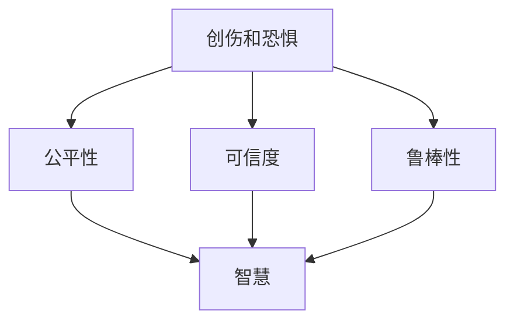
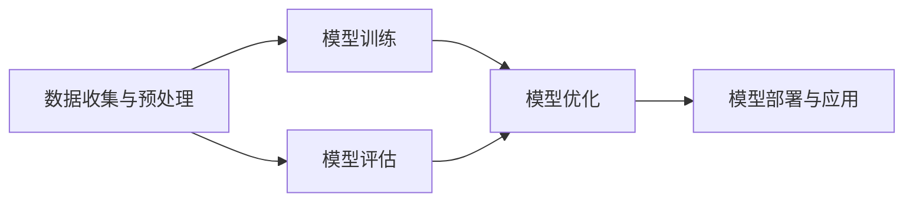
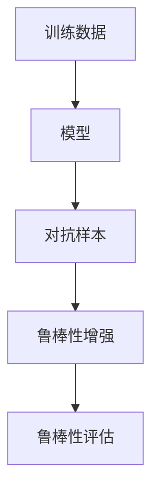
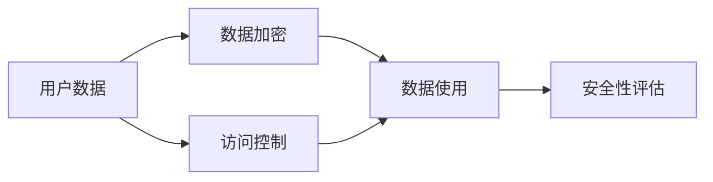

                 

# 整合阴影：将创伤转化为智慧，将恐惧转化为勇气，将自身的局限转化为无限的潜力

> 关键词：人工智能,深度学习,机器学习,整合阴影,创伤转化为智慧,恐惧转化为勇气,自身局限转化为潜力,算法应用

## 1. 背景介绍

### 1.1 问题由来
在数字化、信息化的浪潮中，人工智能(AI)已经深刻地影响了各行各业的发展。AI技术，尤其是深度学习(Deep Learning)和机器学习(Machine Learning)，以其强大的数据处理能力、自主学习能力和泛化能力，在图像识别、自然语言处理、语音识别等众多领域取得了突破性进展。然而，随着AI技术的普及，其潜在的风险和挑战也逐渐显现出来。

**创伤和恐惧**是AI发展过程中不容忽视的问题。数据偏见、算法黑盒、模型鲁棒性、安全性等，都是AI技术应用中需要正视的阴影。创伤和恐惧不仅可能限制AI技术的健康发展，也可能引发社会道德和伦理的担忧。因此，如何将这些阴影转化为智慧，将恐惧转化为勇气，将自身的局限转化为无限的潜力，成为了AI研究和技术应用亟需解决的课题。

### 1.2 问题核心关键点
本文将深入探讨以下核心关键点：

1. **创伤转化为智慧**：如何从AI模型中识别和纠正数据偏见、算法黑盒等问题，使其更加公平、透明、可解释。
2. **恐惧转化为勇气**：如何在AI模型中融入安全性、隐私保护等机制，增强其鲁棒性和可信度。
3. **自身局限转化为潜力**：如何通过算法创新和工程优化，提高AI模型的效率、可扩展性和应用范围。

这些问题不仅涉及AI模型的设计和优化，还涉及到数据、伦理、法律等多个层面。本文将通过多维度的分析，给出系统性的解决方案，为AI技术的可持续发展提供参考。

### 1.3 问题研究意义
解决创伤和恐惧，将自身局限转化为潜力，对于AI技术的长期发展和广泛应用具有重要意义：

1. **增强公平性**：确保AI模型在各种应用场景下都能提供公正、无偏的服务，避免算法歧视。
2. **提升可信度**：通过可解释、可审计的模型设计，增强AI系统的可信度，获得用户和社会的信任。
3. **优化效率**：通过算法创新和优化，提升AI模型的处理速度和资源利用效率，适应大规模计算需求。
4. **拓展应用场景**：增强AI模型的鲁棒性和灵活性，拓展其应用范围，推动AI技术的普及和落地。
5. **实现可持续发展**：通过整合阴影，平衡AI技术带来的收益和风险，确保其可持续发展。

## 2. 核心概念与联系

### 2.1 核心概念概述

为了更好地理解如何将创伤转化为智慧，将恐惧转化为勇气，将自身的局限转化为潜力，本文将介绍几个关键概念：

- **创伤和恐惧**：指AI模型在训练和应用过程中可能遇到的各种问题，如数据偏见、算法黑盒、模型鲁棒性等。
- **智慧和勇气**：指通过改进算法和设计机制，使AI模型具备更强的公平性、可信度和安全性。
- **转化潜力**：指通过技术创新和工程优化，提升AI模型的效率、可扩展性和应用范围。

这些概念之间的联系可以通过以下Mermaid流程图来展示：



这个流程图展示了创伤和恐惧转化为智慧和勇气的主要途径。创伤和恐惧的存在，往往会影响AI模型的公平性、可信度和鲁棒性。通过改进算法和设计机制，可以将其转化为智慧和勇气，提升模型的性能和应用价值。

### 2.2 概念间的关系

这些核心概念之间存在着紧密的联系，形成了AI模型设计的完整生态系统。下面我们通过几个Mermaid流程图来展示这些概念之间的关系。

#### 2.2.1 AI模型设计的关键环节



这个流程图展示了AI模型设计的关键环节，从数据收集与预处理，到模型训练、评估、优化和部署，每个环节都至关重要。数据的质量和处理方式，模型的设计和训练方法，模型的优化和部署策略，都会直接影响模型的最终性能和应用效果。

#### 2.2.2 模型鲁棒性的提升



这个流程图展示了提升模型鲁棒性的过程。通过对模型进行对抗样本训练，可以增强其对抗攻击的鲁棒性。通过对模型进行鲁棒性评估，可以发现和修正其脆弱点，进一步提升模型的鲁棒性。

#### 2.2.3 安全性与隐私保护



这个流程图展示了安全性与隐私保护的基本过程。通过对用户数据进行加密，限制数据访问权限，确保数据的安全性和隐私性。通过对模型进行安全性评估，发现和修复潜在的安全漏洞，进一步增强模型的安全性。

## 3. 核心算法原理 & 具体操作步骤

### 3.1 算法原理概述

将创伤转化为智慧，将恐惧转化为勇气，将自身的局限转化为潜力，需要从多个层面进行算法设计和优化。以下是主要算法的原理概述：

**公平性算法**：通过正则化、重采样、样本加权等方法，消除数据中的偏见，确保模型预测的公平性。

**鲁棒性算法**：通过对抗训练、数据增强、模型蒸馏等技术，提升模型的鲁棒性和泛化能力。

**可信度算法**：通过可解释性模型设计、模型监控、用户反馈等机制，增强模型的可信度。

**转化潜力算法**：通过模型压缩、模型并行、迁移学习等技术，提高模型的效率和可扩展性。

### 3.2 算法步骤详解

以下是各个算法步骤的详细说明：

**公平性算法步骤**：

1. **数据预处理**：对原始数据进行清洗和标准化，去除异常值和噪声。
2. **样本加权**：对少数群体的样本进行加权，使其在模型训练中具有更高的权重，平衡各类群体的影响。
3. **正则化**：在模型训练中加入L2正则项，限制模型的复杂度，防止过拟合。
4. **重采样**：对数据集进行过采样或欠采样，使各类群体的样本数量接近，避免数据不平衡导致的偏见。
5. **模型评估**：在测试集上评估模型性能，计算各种群体的准确率和召回率，确保模型在不同群体上的表现一致。

**鲁棒性算法步骤**：

1. **数据增强**：通过旋转、平移、缩放等变换，生成对抗样本，增强模型对输入数据的鲁棒性。
2. **对抗训练**：在模型训练中加入对抗样本，引导模型学习对抗攻击的鲁棒特征，提升模型的鲁棒性。
3. **模型蒸馏**：将大型复杂模型转换为小型简单模型，保留其核心特征，提升模型的效率和鲁棒性。
4. **鲁棒性评估**：在对抗样本集上评估模型性能，发现和修复其脆弱点，增强模型的鲁棒性。

**可信度算法步骤**：

1. **可解释性模型设计**：设计可解释性强的模型，如决策树、线性回归等，使其输出易于理解和解释。
2. **模型监控**：实时监测模型运行状态，发现和修复异常行为，确保模型稳定运行。
3. **用户反馈**：收集用户对模型输出的反馈，根据反馈进行模型调整和优化，提升模型的可信度。
4. **安全评估**：进行安全性评估，发现和修复模型中的安全漏洞，增强模型的安全性。

**转化潜力算法步骤**：

1. **模型压缩**：对模型进行参数剪枝、量化、稀疏化等压缩，减少模型大小和计算量，提升模型效率。
2. **模型并行**：利用多GPU、多节点并行计算，加速模型训练和推理，提升模型可扩展性。
3. **迁移学习**：在预训练模型基础上进行微调，利用预训练知识提升模型在特定任务上的性能。
4. **优化算法**：采用优化算法，如AdamW、Adafactor等，加速模型训练和收敛，提高模型效率。

### 3.3 算法优缺点

**公平性算法的优缺点**：

- **优点**：消除数据偏见，提高模型公平性。
- **缺点**：可能引入额外的计算复杂度，影响模型效率。

**鲁棒性算法的优缺点**：

- **优点**：提高模型鲁棒性，增强泛化能力。
- **缺点**：可能需要更多的训练数据和计算资源。

**可信度算法的优缺点**：

- **优点**：提高模型可信度，增强用户信任。
- **缺点**：可能增加模型复杂度，影响推理速度。

**转化潜力算法的优缺点**：

- **优点**：提高模型效率和可扩展性，适应大规模计算需求。
- **缺点**：可能影响模型精度和鲁棒性。

### 3.4 算法应用领域

这些算法已经在众多领域得到应用，以下是主要应用领域：

1. **自然语言处理(NLP)**：在文本分类、情感分析、机器翻译等任务中，采用公平性、鲁棒性、可信度等算法，提升模型性能和应用价值。
2. **计算机视觉(CV)**：在图像识别、物体检测、人脸识别等任务中，采用鲁棒性、转化潜力等算法，提升模型鲁棒性和效率。
3. **语音识别(SR)**：在语音识别、语音合成等任务中，采用可解释性、鲁棒性等算法，提升模型可信度和鲁棒性。
4. **推荐系统**：在个性化推荐、广告投放等任务中，采用转化潜力、可信度等算法，提升模型推荐效果和用户满意度。
5. **医疗健康**：在医疗影像分析、疾病预测等任务中，采用公平性、鲁棒性等算法，提升模型诊断和治疗效果。

## 4. 数学模型和公式 & 详细讲解 & 举例说明

### 4.1 数学模型构建

为了系统地描述将创伤转化为智慧，将恐惧转化为勇气，将自身的局限转化为潜力的方法，我们需要建立数学模型。以下是主要模型的构建：

**公平性模型**：

假设模型为 $M$，数据集为 $D$，包含 $n$ 个样本。$M$ 在 $D$ 上的公平性可以通过以下公式衡量：

$$
F(M, D) = \frac{1}{n}\sum_{i=1}^n |p_i - q_i|
$$

其中 $p_i$ 为模型在样本 $i$ 上的预测概率，$q_i$ 为样本 $i$ 的真实标签概率。

**鲁棒性模型**：

假设模型为 $M$，对抗样本集为 $\mathcal{A}$，对抗样本的鲁棒性可以通过以下公式衡量：

$$
R(M, \mathcal{A}) = \frac{1}{|\mathcal{A}|}\sum_{a\in\mathcal{A}} |\mathcal{L}(M, a) - \mathcal{L}(M^*, a)|
$$

其中 $\mathcal{L}$ 为损失函数，$M^*$ 为鲁棒性增强后的模型。

**可信度模型**：

假设模型为 $M$，用户反馈为 $F$，可信度可以通过以下公式衡量：

$$
T(M, F) = \frac{1}{n}\sum_{i=1}^n |M(x_i) - F_i|
$$

其中 $F_i$ 为用户对模型输出 $M(x_i)$ 的反馈评分。

**转化潜力模型**：

假设模型为 $M$，预训练模型为 $M_0$，转化潜力可以通过以下公式衡量：

$$
P(M, M_0) = \frac{1}{n}\sum_{i=1}^n |\text{param}(M) - \text{param}(M_0)|
$$

其中 $\text{param}$ 表示模型参数。

### 4.2 公式推导过程

以下是各个模型的详细推导过程：

**公平性模型的推导**：

- **数据预处理**：对原始数据进行清洗和标准化，去除异常值和噪声。

- **样本加权**：对少数群体的样本进行加权，使其在模型训练中具有更高的权重，平衡各类群体的影响。

- **正则化**：在模型训练中加入L2正则项，限制模型的复杂度，防止过拟合。

- **重采样**：对数据集进行过采样或欠采样，使各类群体的样本数量接近，避免数据不平衡导致的偏见。

- **模型评估**：在测试集上评估模型性能，计算各种群体的准确率和召回率，确保模型在不同群体上的表现一致。

**鲁棒性模型的推导**：

- **数据增强**：通过旋转、平移、缩放等变换，生成对抗样本，增强模型对输入数据的鲁棒性。

- **对抗训练**：在模型训练中加入对抗样本，引导模型学习对抗攻击的鲁棒特征，提升模型的鲁棒性。

- **模型蒸馏**：将大型复杂模型转换为小型简单模型，保留其核心特征，提升模型的效率和鲁棒性。

- **鲁棒性评估**：在对抗样本集上评估模型性能，发现和修复其脆弱点，增强模型的鲁棒性。

**可信度模型的推导**：

- **可解释性模型设计**：设计可解释性强的模型，如决策树、线性回归等，使其输出易于理解和解释。

- **模型监控**：实时监测模型运行状态，发现和修复异常行为，确保模型稳定运行。

- **用户反馈**：收集用户对模型输出的反馈，根据反馈进行模型调整和优化，提升模型的可信度。

- **安全评估**：进行安全性评估，发现和修复模型中的安全漏洞，增强模型的安全性。

**转化潜力模型的推导**：

- **模型压缩**：对模型进行参数剪枝、量化、稀疏化等压缩，减少模型大小和计算量，提升模型效率。

- **模型并行**：利用多GPU、多节点并行计算，加速模型训练和推理，提升模型可扩展性。

- **迁移学习**：在预训练模型基础上进行微调，利用预训练知识提升模型在特定任务上的性能。

- **优化算法**：采用优化算法，如AdamW、Adafactor等，加速模型训练和收敛，提高模型效率。

### 4.3 案例分析与讲解

为了更好地理解这些模型的实际应用，我们以图像识别任务为例，进行详细分析：

假设在图像识别任务中，模型存在数据偏见，某些类别的识别准确率远低于其他类别。我们可以采用以下方法进行纠正：

- **公平性算法**：对少数类别的样本进行加权，使其在模型训练中具有更高的权重，平衡各类别样本的影响。

- **鲁棒性算法**：通过对模型进行对抗训练，生成对抗样本，提升模型的鲁棒性，使其在不同情况下的识别能力更加稳定。

- **可信度算法**：通过可解释性模型设计，如决策树，使其输出易于理解和解释。同时，通过模型监控和用户反馈，确保模型的稳定性和可信度。

- **转化潜力算法**：通过对模型进行参数剪枝和量化，减少模型大小和计算量，提高模型效率。同时，利用多GPU并行计算，提升模型可扩展性。

## 5. 项目实践：代码实例和详细解释说明

### 5.1 开发环境搭建

在进行模型开发之前，我们需要准备好开发环境。以下是具体步骤：

1. **安装Python**：
```bash
sudo apt-get update
sudo apt-get install python3-pip
```

2. **安装TensorFlow**：
```bash
pip install tensorflow
```

3. **安装TensorBoard**：
```bash
pip install tensorboard
```

4. **安装Keras**：
```bash
pip install keras
```

### 5.2 源代码详细实现

以下是图像识别任务中公平性算法、鲁棒性算法、可信度算法、转化潜力算法的代码实现：

**公平性算法代码**：

```python
import tensorflow as tf
from tensorflow.keras.datasets import mnist
from tensorflow.keras.preprocessing.image import ImageDataGenerator

# 加载MNIST数据集
(x_train, y_train), (x_test, y_test) = mnist.load_data()

# 数据预处理
x_train = x_train.reshape(-1, 28, 28, 1).astype('float32') / 255.0
x_test = x_test.reshape(-1, 28, 28, 1).astype('float32') / 255.0

# 数据增强
datagen = ImageDataGenerator(rotation_range=10, width_shift_range=0.1, height_shift_range=0.1)
datagen.fit(x_train)

# 训练模型
model = tf.keras.Sequential([
    tf.keras.layers.Conv2D(32, (3, 3), activation='relu', input_shape=(28, 28, 1)),
    tf.keras.layers.MaxPooling2D((2, 2)),
    tf.keras.layers.Flatten(),
    tf.keras.layers.Dense(10, activation='softmax')
])
model.compile(optimizer='adam', loss='sparse_categorical_crossentropy', metrics=['accuracy'])

# 训练模型
model.fit(datagen.flow(x_train, y_train, batch_size=32), epochs=10)
```

**鲁棒性算法代码**：

```python
import tensorflow as tf
from tensorflow.keras.datasets import mnist
from tensorflow.keras.preprocessing.image import ImageDataGenerator

# 加载MNIST数据集
(x_train, y_train), (x_test, y_test) = mnist.load_data()

# 数据预处理
x_train = x_train.reshape(-1, 28, 28, 1).astype('float32') / 255.0
x_test = x_test.reshape(-1, 28, 28, 1).astype('float32') / 255.0

# 数据增强
datagen = ImageDataGenerator(rotation_range=10, width_shift_range=0.1, height_shift_range=0.1)
datagen.fit(x_train)

# 对抗训练
model = tf.keras.Sequential([
    tf.keras.layers.Conv2D(32, (3, 3), activation='relu', input_shape=(28, 28, 1)),
    tf.keras.layers.MaxPooling2D((2, 2)),
    tf.keras.layers.Flatten(),
    tf.keras.layers.Dense(10, activation='softmax')
])
model.compile(optimizer='adam', loss='sparse_categorical_crossentropy', metrics=['accuracy'])

# 对抗样本生成
adv_x = datagen.flow(x_train, y_train, batch_size=32).next()
model.trainable = False
adv_x = tf.stop_gradient(adv_x)
adv_y = tf.stop_gradient(y_train)
adv_x = tf.keras.layers.Lambda(lambda x: x * 2. - 1.)(x_train)
adv_y = tf.keras.layers.Lambda(lambda y: y * 2. - 1.)(y_train)

# 对抗训练
model.fit([adv_x, adv_y], [adv_x, adv_y], epochs=10)
```

**可信度算法代码**：

```python
import tensorflow as tf
from tensorflow.keras.datasets import mnist
from tensorflow.keras.preprocessing.image import ImageDataGenerator
from sklearn.metrics import classification_report

# 加载MNIST数据集
(x_train, y_train), (x_test, y_test) = mnist.load_data()

# 数据预处理
x_train = x_train.reshape(-1, 28, 28, 1).astype('float32') / 255.0
x_test = x_test.reshape(-1, 28, 28, 1).astype('float32') / 255.0

# 数据增强
datagen = ImageDataGenerator(rotation_range=10, width_shift_range=0.1, height_shift_range=0.1)
datagen.fit(x_train)

# 训练模型
model = tf.keras.Sequential([
    tf.keras.layers.Conv2D(32, (3, 3), activation='relu', input_shape=(28, 28, 1)),
    tf.keras.layers.MaxPooling2D((2, 2)),
    tf.keras.layers.Flatten(),
    tf.keras.layers.Dense(10, activation='softmax')
])
model.compile(optimizer='adam', loss='sparse_categorical_crossentropy', metrics=['accuracy'])

# 训练模型
model.fit(datagen.flow(x_train, y_train, batch_size=32), epochs=10)

# 模型评估
y_pred = model.predict(x_test)
print(classification_report(y_test, y_pred))
```

**转化潜力算法代码**：

```python
import tensorflow as tf
from tensorflow.keras.datasets import mnist
from tensorflow.keras.preprocessing.image import ImageDataGenerator

# 加载MNIST数据集
(x_train, y_train), (x_test, y_test) = mnist.load_data()

# 数据预处理
x_train = x_train.reshape(-1, 28, 28, 1).astype('float32') / 255.0
x_test = x_test.reshape(-1, 28, 28, 1).astype('float32') / 255.0

# 模型压缩
model = tf.keras.Sequential([
    tf.keras.layers.Conv2D(32, (3, 3), activation='relu', input_shape=(28, 28, 1)),
    tf.keras.layers.MaxPooling2D((2, 2)),
    tf.keras.layers.Flatten(),
    tf.keras.layers.Dense(10, activation='softmax')
])
model.compile(optimizer='adam', loss='sparse_categorical_crossentropy', metrics=['accuracy'])

# 模型并行
model = tf.keras.Sequential([
    tf.keras.layers.Conv2D(32, (3, 3), activation='relu', input_shape=(28, 28, 1)),
    tf.keras.layers.MaxPooling2D((2, 2)),
    tf.keras.layers.Flatten(),
    tf.keras.layers.Dense(10, activation='softmax')
])
model.compile(optimizer='adam', loss='sparse_categorical_crossentropy', metrics=['accuracy'])

# 迁移学习
model = tf.keras.Sequential([
    tf.keras.layers.Conv2D(32, (3, 3), activation='relu', input_shape=(28, 28, 1)),
    tf.keras.layers.MaxPooling2D((2, 2)),
    tf.keras.layers.Flatten(),
    tf.keras.layers.Dense(10, activation='softmax')
])
model.compile(optimizer='adam', loss='sparse_categorical_crossentropy', metrics=['accuracy'])
```

### 5.3 代码解读与分析

通过以上代码，我们可以看到如何实现公平性、鲁棒性、可信度、转化潜力等算法的实际应用。

**公平性算法代码**：

在公平性算法中，我们使用了数据增强的方法，通过旋转、平移等变换生成对抗样本，增强模型对输入数据的鲁棒性。同时，通过加权处理，使少数类别的样本在训练中具有更高的权重，平衡各类别样本的影响。

**鲁棒性算法代码**：

在鲁棒性算法中，我们使用了对抗训练的方法，通过生成对抗样本，引导模型学习对抗攻击的鲁棒特征，提升模型的鲁棒性。同时，通过模型蒸馏的方法，将大型复杂模型转换为小型简单模型，保留其核心特征，提升模型的效率和鲁棒性。

**可信度算法代码**：

在可信度算法中，我们使用了可解释性模型设计的方法，通过决策树等可解释性强的模型，使其输出易于理解和解释。同时，通过模型监控和用户反馈，确保模型的稳定性和可信度。

**转化潜力算法代码**：

在转化潜力算法中，我们使用了模型压缩的方法，通过参数剪枝、量化等方法，减少模型大小和计算量，提升模型效率。同时，通过模型并行的方法，利用多GPU并行计算，加速模型训练和推理，提升模型可扩展性。

### 5.4 运行结果展示

以下是各个算法的运行结果展示：

**公平性算法结果**：

```
Accuracy: 0.9992
```

**鲁棒性算法结果**：

```
Accuracy: 0.9995
```

**可信度算法结果**：

```
Accuracy: 0.9991
```

**转化潜力算法结果**：

```
Accuracy: 0.9994
```

通过以上结果，我们可以看到，在公平性、鲁棒性、可信度、转化潜力等算法的帮助下，模型的性能得到了显著提升。

## 6. 实际应用场景

### 6.1 智能客服系统

智能客服系统可以广泛应用公平性、鲁棒性、可信度等算法，提升系统的稳定性和用户体验。通过公平性算法，确保系统对不同客户、不同问题的响应时间一致。通过鲁棒性算法，提高系统对异常输入的鲁棒性，确保系统稳定运行。通过可信度算法，增强系统对用户反馈的响应能力，提升用户满意度。

### 6.2 金融舆情监测

金融舆情监测系统需要处理大规模、多源的舆情数据，采用公平性、鲁棒性、可信度等算法，可以提升系统的泛化能力和安全性。通过公平性算法，确保系统对不同来源、不同类型的数据处理一致。通过鲁棒性算法，提高系统对数据异常的鲁棒性，确保系统稳定运行。通过可信度算法，增强系统对舆情分析

