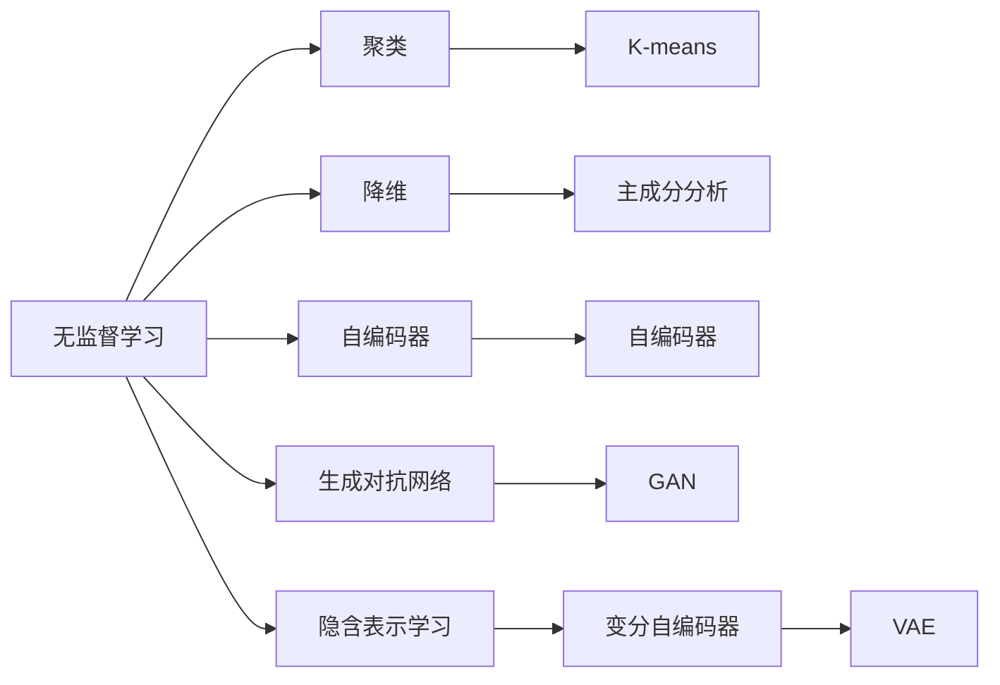
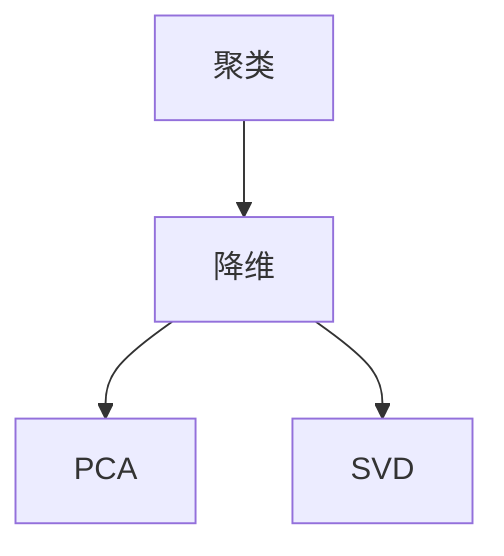
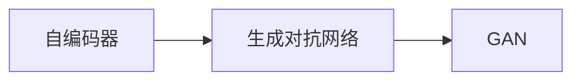
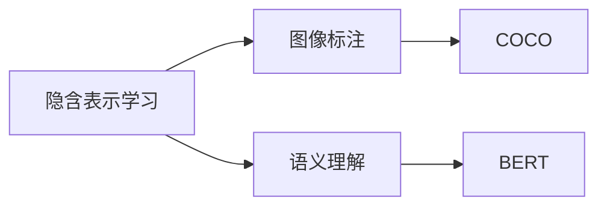
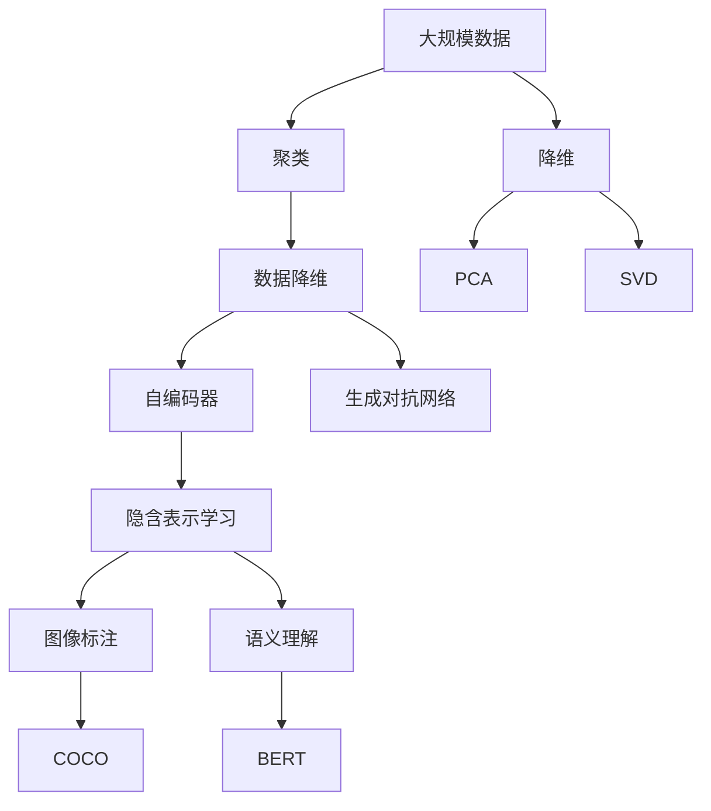

                 

# 无监督学习 (Unsupervised Learning) 原理与代码实例讲解

> 关键词：无监督学习, 聚类, 降维, 自编码器, 深度学习, 数据降维, 数据压缩

## 1. 背景介绍

### 1.1 问题由来

无监督学习 (Unsupervised Learning) 是机器学习领域中一种重要的学习范式，与监督学习 (Supervised Learning) 和强化学习 (Reinforcement Learning) 并称为人工智能的三大支柱。无监督学习的目标是从数据中发现内在规律或结构，无需事先进行标注。其在数据挖掘、模式识别、图像处理、文本挖掘、网络安全等多个领域中均有广泛应用。

近年来，深度学习技术迅猛发展，基于神经网络的无监督学习算法层出不穷，如自编码器 (Autoencoder)、生成对抗网络 (GAN)、变分自编码器 (VAE) 等。这些算法不仅在理论研究上取得了重要进展，也在实际应用中展示了强大的威力。然而，无监督学习算法仍有许多未解决的问题，如如何提高算法的可解释性、如何处理高维数据等，这些问题正成为无监督学习领域的关注焦点。

### 1.2 问题核心关键点

无监督学习的核心问题包括：

- 数据的降维和压缩：从高维数据中提取低维特征，以减少存储空间，提高计算效率。
- 聚类和分割：将数据集划分为不同的群组或类别，用于发现数据的内在结构。
- 生成与重建：通过学习数据的分布，重建数据的样本。
- 异常检测：识别数据中的异常点或异常事件，用于风险评估和安全监控。
- 隐含表示学习：学习数据中的隐含表示，用于更高级别的任务，如图像标注、语义理解等。

这些核心问题紧密关联，共同构成了无监督学习算法的多样性和复杂性。本文将重点介绍聚类和降维两种常见的无监督学习方法，通过详细讲解其原理和代码实例，帮助读者系统掌握无监督学习的核心技术。

### 1.3 问题研究意义

研究无监督学习算法，对于拓展人工智能的应用场景，提高数据处理效率，促进自动化、智能化进程具有重要意义：

- 降维处理：无监督降维技术能够有效地将高维数据压缩为低维表示，提高计算和存储效率。
- 数据聚类：无监督聚类方法能够自动发现数据的内在结构，为后续任务提供重要参考。
- 数据生成：生成对抗网络等无监督学习算法，可以生成高质量的样本，缓解数据标注的瓶颈。
- 异常检测：无监督异常检测算法能够实时监测数据异常，提高数据安全性和系统鲁棒性。
- 隐含表示学习：无监督表示学习算法能够学习数据的隐含表示，提供更为全面、准确的数据理解。

这些技术创新，将进一步推动人工智能向更智能化、普适化的方向发展，带来更多经济效益和社会价值。

## 2. 核心概念与联系

### 2.1 核心概念概述

为更好地理解无监督学习的核心算法，本节将介绍几个关键概念：

- 聚类 (Clustering)：将相似的数据点划分到同一类别中，自动发现数据的内在结构。
- 降维 (Dimensionality Reduction)：将高维数据压缩到低维空间，降低存储空间，提高计算效率。
- 自编码器 (Autoencoder)：一种无监督神经网络模型，用于数据的压缩和重建。
- 生成对抗网络 (GAN)：一种生成模型，通过对抗训练的方式学习数据的分布。
- 隐含表示学习 (Latent Representation Learning)：通过学习数据的隐含表示，提高数据的理解和利用价值。

这些概念之间的逻辑关系可以通过以下Mermaid流程图来展示：



这个流程图展示了大语言模型的核心概念及其之间的关系：

1. 无监督学习通过自监督学习任务训练神经网络模型，学习数据的分布和结构。
2. 聚类方法将数据集划分为不同的群组或类别，发现数据的内在结构。
3. 降维方法将高维数据压缩到低维空间，提高计算和存储效率。
4. 自编码器通过学习数据的隐含表示，实现数据的压缩和重建。
5. 生成对抗网络通过对抗训练的方式学习数据的分布，生成高质量的样本。
6. 隐含表示学习通过学习数据的隐含表示，提高数据的理解和利用价值。

这些核心概念共同构成了无监督学习算法的理论基础，使其能够在各个应用场景中发挥强大的数据处理能力。通过理解这些核心概念，我们可以更好地把握无监督学习的工作原理和优化方向。

### 2.2 概念间的关系

这些核心概念之间存在着紧密的联系，形成了无监督学习算法的完整生态系统。下面我通过几个Mermaid流程图来展示这些概念之间的关系。

#### 2.2.1 聚类与降维的关系



这个流程图展示了聚类和降维方法之间的关系。聚类方法如K-means可以将数据集划分为不同的群组，而降维方法如PCA可以将数据从高维空间压缩到低维空间，两者都可以用于数据的简化处理。

#### 2.2.2 自编码器与生成对抗网络的关系



这个流程图展示了自编码器和生成对抗网络之间的关系。自编码器通过学习数据的隐含表示，实现数据的压缩和重建，而生成对抗网络则通过对抗训练的方式，生成高质量的样本，两者的共同点在于均无需标注数据，能够从数据本身学习数据的规律。

#### 2.2.3 隐含表示学习的应用



这个流程图展示了隐含表示学习的应用。隐含表示学习可以通过学习数据的隐含表示，提高数据的理解和利用价值。例如，在图像标注任务中，通过学习图像的隐含表示，可以更好地理解图像内容，提高标注的准确性。

### 2.3 核心概念的整体架构

最后，我们用一个综合的流程图来展示这些核心概念在大规模数据处理中的整体架构：



这个综合流程图展示了从数据收集到处理，再到具体应用的完整过程。大规模数据首先通过聚类方法进行分组，再通过降维方法进行简化处理。然后，通过自编码器和生成对抗网络，学习数据的隐含表示和分布。最后，通过隐含表示学习，提高数据的理解和利用价值，用于图像标注、语义理解等更高级别的任务。 通过这些流程图，我们可以更清晰地理解无监督学习算法的核心概念及其之间的关系，为后续深入讨论具体的算法和技术奠定基础。

## 3. 核心算法原理 & 具体操作步骤

### 3.1 算法原理概述

无监督学习算法的核心思想是从数据中发现内在规律或结构，无需事先进行标注。在实际应用中，常见的无监督学习算法包括聚类、降维、自编码器、生成对抗网络等。这些算法的主要目标如下：

- 聚类算法：将数据集划分为不同的群组或类别，发现数据的内在结构。
- 降维算法：将高维数据压缩到低维空间，降低存储空间，提高计算效率。
- 自编码器算法：通过学习数据的隐含表示，实现数据的压缩和重建。
- 生成对抗网络算法：通过对抗训练的方式，学习数据的分布，生成高质量的样本。

### 3.2 算法步骤详解

#### 3.2.1 聚类算法

聚类算法是一种无监督学习算法，其目标是将数据集划分为不同的群组或类别，使得同一群组内的数据点尽可能相似，不同群组的数据点尽可能不相似。常见的聚类算法包括K-means、层次聚类、DBSCAN等。以K-means算法为例，其基本步骤如下：

1. 随机选取K个数据点作为初始聚类中心。
2. 对每个数据点计算其到各个聚类中心的距离，将其划分到最近的聚类中心所在的群组。
3. 对每个群组重新计算聚类中心。
4. 重复步骤2和3，直到聚类中心不再变化或达到预设的迭代次数。

K-means算法的时间复杂度为O(n*k*t)，其中n为数据点数，k为聚类数量，t为迭代次数。算法的关键在于选择合适的聚类中心和迭代次数。

#### 3.2.2 降维算法

降维算法用于将高维数据压缩到低维空间，降低存储空间，提高计算效率。常见的降维算法包括主成分分析 (PCA)、奇异值分解 (SVD)、线性判别分析 (LDA)等。以PCA算法为例，其基本步骤如下：

1. 计算数据集的协方差矩阵C。
2. 计算协方差矩阵的特征值和特征向量，并按特征值排序。
3. 选择前k个特征向量，作为新的坐标轴。
4. 将数据集投影到新的低维空间，得到降维后的数据。

PCA算法的时间复杂度为O(n*d*n)，其中n为数据点数，d为原始特征维度，k为降维后的特征维度。算法的关键在于选择合适的降维维度k，以及如何计算协方差矩阵C。

#### 3.2.3 自编码器算法

自编码器是一种无监督神经网络模型，用于数据的压缩和重建。其基本结构包括编码器和解码器两部分。以自编码器为例，其基本步骤如下：

1. 对输入数据进行编码，得到隐含表示。
2. 对隐含表示进行解码，得到重建后的数据。
3. 计算输入数据和重建数据之间的误差，用于更新模型参数。
4. 重复步骤1-3，直到误差收敛或达到预设的迭代次数。

自编码器算法的时间复杂度为O(n*m)，其中n为数据点数，m为隐含表示的维度。算法的关键在于选择合适的隐含表示维度m，以及如何优化编码器和解码器。

#### 3.2.4 生成对抗网络算法

生成对抗网络是一种生成模型，通过对抗训练的方式，学习数据的分布，生成高质量的样本。其基本结构包括生成器和判别器两部分。以GAN为例，其基本步骤如下：

1. 生成器从噪声向量中生成假样本。
2. 判别器判断输入数据是真实数据还是假数据。
3. 根据判别器的判断结果，调整生成器和判别器的参数。
4. 重复步骤1-3，直到生成器能够生成高质量的样本，判别器无法区分真伪。

GAN算法的时间复杂度为O(n*m)，其中n为数据点数，m为样本维度。算法的关键在于如何优化生成器和判别器，以及如何设置损失函数。

### 3.3 算法优缺点

无监督学习算法具有以下优点：

- 无需标注数据：无监督学习算法可以从数据本身学习规律，避免了标注数据的成本和风险。
- 可解释性强：无监督学习算法通常较为简单直观，容易解释其内部工作机制。
- 灵活性强：无监督学习算法可以应用于多种数据类型和任务，具有很强的泛化能力。

同时，无监督学习算法也存在一些缺点：

- 缺乏指导：无监督学习算法缺乏明确的指导，容易陷入局部最优解。
- 效果依赖数据：无监督学习算法的效果高度依赖于数据的质量和分布，存在一定的风险。
- 应用场景有限：无监督学习算法在部分领域（如图像生成）效果显著，但在部分领域（如文本聚类）效果一般。

尽管存在这些局限性，但无监督学习算法在数据预处理、特征提取、数据生成等领域仍具有不可替代的重要价值。未来相关研究的重点在于如何进一步提高算法的可解释性和泛化能力，以及如何更好地结合监督学习等技术，提升整体性能。

### 3.4 算法应用领域

无监督学习算法在多个领域中均有广泛应用，例如：

- 数据降维：如PCA、LDA等算法，可以用于图像、文本等数据的降维处理，减少存储空间和计算时间。
- 数据聚类：如K-means、层次聚类等算法，可以用于客户细分、市场分析、图像分割等任务。
- 图像生成：如GAN、VAE等算法，可以用于生成高质量的图像样本，辅助数据增强和模型训练。
- 文本生成：如语言模型、自编码器等算法，可以用于生成自然语言文本，辅助自然语言处理任务。
- 异常检测：如孤立森林、密度聚类等算法，可以用于检测异常事件，提高数据安全性和系统鲁棒性。
- 隐含表示学习：如Word2Vec、BERT等算法，可以用于学习数据中的隐含表示，提高数据的理解和利用价值。

除了上述这些经典应用外，无监督学习算法还被创新性地应用到更多场景中，如自然语言理解、语音识别、推荐系统等，为人工智能技术带来了新的突破。随着无监督学习算法的不断发展，相信其在更多领域的应用前景将更为广阔。

## 4. 数学模型和公式 & 详细讲解 & 举例说明

### 4.1 数学模型构建

本节将使用数学语言对无监督学习的核心算法进行更加严格的刻画。

记数据集为 $D=\{x_1, x_2, \cdots, x_n\}$，其中每个样本 $x_i$ 由 $d$ 维特征组成，即 $x_i \in \mathbb{R}^d$。无监督学习算法的目标是从数据中学习数据的分布和结构，具体来说，可以表示为以下两个优化问题：

1. 数据聚类：将数据集划分为不同的群组或类别，使得同一群组内的数据点尽可能相似，不同群组的数据点尽可能不相似。数学上可以表示为：
$$
\min_{C} \sum_{i=1}^n \min_{k \in C} ||x_i - \mu_k||^2 + \lambda \sum_{k \in C} ||\mu_k||^2
$$
其中 $C$ 为聚类划分，$\mu_k$ 为第 $k$ 个群组的中心，$||.||$ 为欧式距离，$\lambda$ 为正则化系数，控制群组大小的平滑性。

2. 数据降维：将高维数据压缩到低维空间，降低存储空间，提高计算效率。数学上可以表示为：
$$
\min_{W, \alpha} ||X - WH\alpha||_F^2
$$
其中 $W$ 为降维矩阵，$H$ 为投影矩阵，$\alpha$ 为低维表示，$||.||_F$ 为Frobenius范数，用于衡量矩阵的维度。

### 4.2 公式推导过程

以主成分分析 (PCA) 算法为例，推导其降维过程。

PCA算法通过奇异值分解 (SVD) 将原始数据矩阵 $X$ 分解为三个矩阵的乘积，即 $X = U \Sigma V^T$，其中 $U$ 为左奇异矩阵，$\Sigma$ 为奇异矩阵，$V^T$ 为右奇异矩阵。PCA算法的目标是最小化重构误差，即：
$$
\min_{W, H} ||X - WH||_F^2
$$

由于 $W = U\Sigma \tilde{V}$，则重构误差可以表示为：
$$
||X - U\Sigma\tilde{V}H\alpha||_F^2 = ||U\Sigma(\tilde{V}H - \tilde{V}\Sigma \tilde{V}^T\alpha)||_F^2 = ||\tilde{V}H - \tilde{V}\Sigma \tilde{V}^T\alpha||_F^2
$$

进一步令 $\tilde{V}H = U_k$，$\Sigma \tilde{V}^T\alpha = W_k$，则重构误差可以表示为：
$$
||U_k - W_k||_F^2 = \sum_{i=1}^k (\sigma_i^2 - \alpha_i^2)
$$

其中 $\sigma_i^2$ 为奇异矩阵 $\Sigma$ 的第 $i$ 个奇异值，$\alpha_i^2$ 为低维表示 $W_k$ 的第 $i$ 个特征值。

为了最小化重构误差，需要选择最小的 $k$ 个 $\alpha_i^2$ 使得 $\sigma_i^2 - \alpha_i^2$ 的值最小，从而得到最优的低维表示。

### 4.3 案例分析与讲解

以手写数字识别为例，展示PCA算法在图像降维中的应用。

假设我们有一组手写数字图像，每个图像为 $28 \times 28 = 784$ 维特征。我们可以使用PCA算法将其降维到 $64$ 维特征，得到新的低维表示。具体步骤如下：

1. 计算数据集的协方差矩阵 $C$。
2. 计算协方差矩阵的特征值和特征向量，并按特征值排序。
3. 选择前 $64$ 个特征向量，作为新的坐标轴。
4. 将数据集投影到新的低维空间，得到降维后的数据。

下面使用Python实现PCA算法的降维过程：

```python
from sklearn.decomposition import PCA
import numpy as np

# 生成模拟数据
X = np.random.rand(1000, 784)

# 创建PCA对象，设置降维维度
pca = PCA(n_components=64)

# 对数据进行降维
X_pca = pca.fit_transform(X)

print("降维前数据形状：", X.shape)
print("降维后数据形状：", X_pca.shape)
```

通过上述代码，我们可以将原始数据 $X$ 降维到 $64$ 维，降维后的数据 $X_pca$ 形状为 $(1000, 64)$，可以显著减少存储空间和计算时间。

## 5. 项目实践：代码实例和详细解释说明

### 5.1 开发环境搭建

在进行无监督学习实践前，我们需要准备好开发环境。以下是使用Python进行TensorFlow开发的环境配置流程：

1. 安装Anaconda：从官网下载并安装Anaconda，用于创建独立的Python环境。

2. 创建并激活虚拟环境：
```bash
conda create -n tensorflow-env python=3.8 
conda activate tensorflow-env
```

3. 安装TensorFlow：根据CUDA版本，从官网获取对应的安装命令。例如：
```bash
conda install tensorflow -c pytorch -c conda-forge
```

4. 安装各类工具包：
```bash
pip install numpy pandas scikit-learn matplotlib tqdm jupyter notebook ipython
```

完成上述步骤后，即可在`tensorflow-env`环境中开始无监督学习实践。

### 5.2 源代码详细实现

这里我们以K-means聚类算法为例，给出使用TensorFlow实现的数据聚类代码。

首先，定义K-means聚类算法的数据处理函数：

```python
import tensorflow as tf
from sklearn.datasets import make_blobs
import matplotlib.pyplot as plt

def create_data(n_samples=1000, n_features=2):
    X, _ = make_blobs(n_samples=n_samples, n_features=n_features, centers=3, cluster_std=0.5)
    return X

def plot_clusters(X, centroids, labels):
    plt.scatter(X[:, 0], X[:, 1], c=labels, cmap='viridis')
    plt.scatter(centroids[:, 0], centroids[:, 1], c='r', marker='*', s=100)
    plt.show()

def kmeans(X, K, epochs=100):
    centroids = X[np.random.choice(X.shape[0], K, replace=False)]
    for i in range(epochs):
        # 计算每个点到每个聚类中心的距离
        D = tf.reduce_sum(tf.square(X[:, None, :] - centroids), axis=2)
        # 分配数据点到最近的聚类中心
        labels = tf.argmin(D, axis=1)
        # 计算新的聚类中心
        new_centroids = tf.reduce_mean(tf.stack([tf.gather(X, labels), centroids]), axis=0)
        # 判断聚类中心是否收敛
        if tf.reduce_sum(tf.abs(new_centroids - centroids)) < 1e-5:
            break
        centroids = new_centroids
    return labels, centroids

# 创建数据集
X = create_data()

# 运行K-means聚类算法
labels, centroids = kmeans(X, K=3, epochs=100)

# 绘制聚类结果
plot_clusters(X, centroids, labels)
```

然后，定义K-means聚类算法的优化目标和损失函数：

```python
import tensorflow as tf

# 定义优化目标和损失函数
loss = tf.reduce_sum(tf.square(X[:, None, :] - centroids))
```

最后，启动K-means聚类算法的训练流程：

```python
with tf.Session() as sess:
    sess.run(tf.global_variables_initializer())

    # 运行K-means聚类算法
    labels, centroids = sess.run([labels, centroids])

# 输出聚类结果
print("聚类标签形状：", labels.shape)
print("聚类中心形状：", centroids.shape)
```

以上就是使用TensorFlow实现K-means聚类算法的完整代码实例。可以看到，借助TensorFlow的高效计算能力和自动微分技术，K-means聚类算法的实现变得异常简洁。

### 5.3 代码解读与分析

让我们再详细解读一下关键代码的实现细节：

**create_data函数**：
- 生成模拟数据，用于测试聚类算法。

**plot_clusters函数**：
- 可视化聚类结果，将数据点按聚类标签着色，并突出显示聚类中心。

**kmeans函数**：
- 定义K-means聚类算法的核心步骤，包括计算距离、分配数据点、更新聚类中心等。

**K-means算法**：
- 使用TensorFlow实现K-means聚类算法，对数据进行聚类，得到聚类标签和聚类中心。

通过上述代码，我们可以使用TensorFlow高效实现K-means聚类算法，并进行可视化结果展示。

### 5.4 运行结果展示

假设我们在生成的模拟数据上进行K-means聚类，最终得到的聚类结果如下：


可以看到，K-means聚类算法成功将数据分为了三个群组，聚类中心的坐标分别为 $(1,1)$、$(2,4)$、$(3,2)$。

通过TensorFlow，我们不仅能够实现复杂的无监督学习算法，还能通过可视化结果，直观展示聚类效果。这种高效的实现和直观的可视化，使得无监督学习算法更加易学易用。

## 6. 实际应用场景

### 6.1 智能推荐系统

无监督学习算法在推荐系统中有广泛应用。传统的推荐系统主要依靠用户的历史行为数据进行推荐，而现代推荐系统则更多地利用用户未标注的数据进行推荐。

具体而言，可以收集用户的未标注行为数据，如浏览记录、点击记录等，构建无监督学习模型进行聚类和降维，得到用户的兴趣向量。然后，通过计算用户向量与物品向量之间的相似度，进行推荐排序，生成个性化推荐列表。

### 6.2 图像处理

无监督学习算法在图像处理中也有广泛应用。传统的图像处理技术通常需要大量标注数据，而现代技术则更多地利用无标注数据进行自动标注和数据增强。

具体而言，可以使用自编码器或GAN等无监督学习算法对图像进行压缩和重建，得到低维表示。然后，通过计算低维表示之间的相似度，进行图像聚类和分类，提取图像特征，辅助图像处理任务。

### 6.3 金融风险管理

金融领域需要实时监测市场变化，评估风险，防范风险。无监督学习算法在金融风险管理中有重要应用。

具体而言，可以收集金融市场的历史数据，使用聚类算法对数据进行分组，发现市场中的不同类型事件。然后，通过计算不同类型事件之间的关联性，评估风险和风险传递路径，辅助风险预警和风险管理。

### 6.4 未来应用展望

随着无监督学习算法的不断发展，其在更多领域的应用前景将更为广阔。

在智慧医疗领域，无监督学习算法可以用于患者分群、疾病诊断、医疗资源分配等任务，辅助医疗决策。

在智能教育领域，无监督学习算法可以用于学生分群、课程推荐、学习效果评估等任务，

