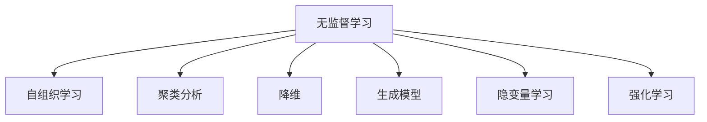
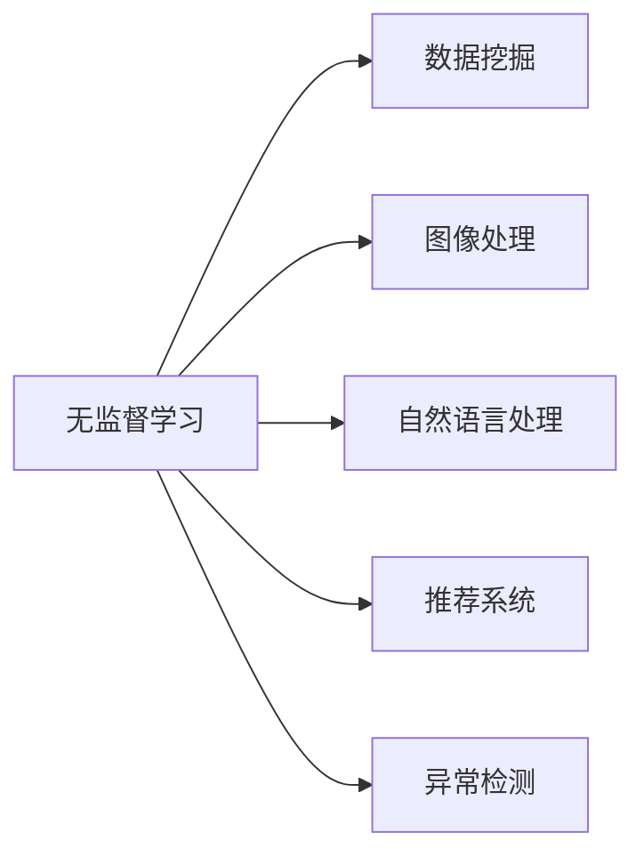
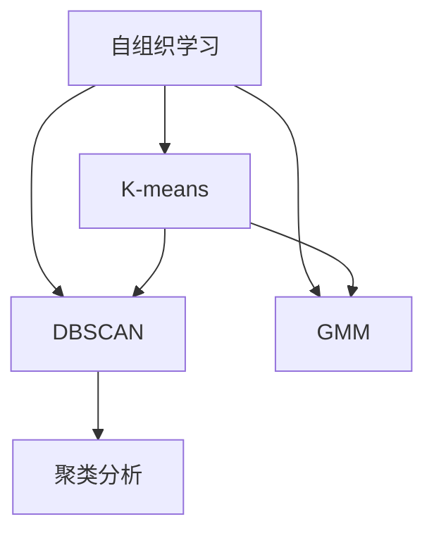
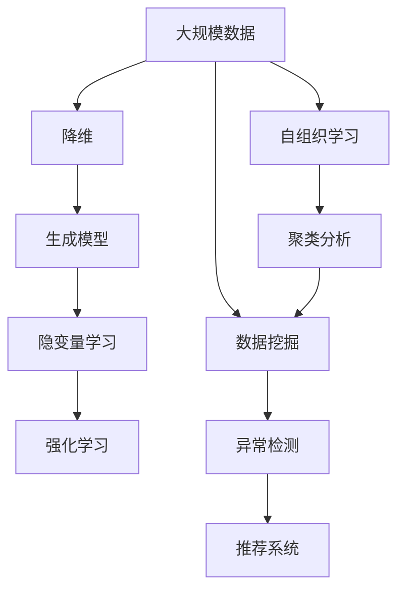

                 

# 无监督学习(Unsupervised Learning) - 原理与代码实例讲解

> 关键词：无监督学习, 自组织学习, 聚类分析, 降维, 生成模型, 强化学习, 隐变量学习, 隐变量建模

## 1. 背景介绍

### 1.1 问题由来
无监督学习(Unsupervised Learning)是机器学习领域中的一个重要分支，与有监督学习(Supervised Learning)和强化学习(Reinforcement Learning)不同，无监督学习不依赖于标注数据，而是试图从数据的内在结构和模式中学习知识。这种学习方式在数据标注成本高、标注数据稀缺的情况下尤为适用。

近年来，随着深度学习技术的快速发展，无监督学习方法在数据挖掘、图像处理、自然语言处理等领域取得了显著进展。典型的方法包括自组织学习(Self-organizing Learning)、聚类分析(Cluster Analysis)、降维(Dimensionality Reduction)、生成模型(Generative Models)、隐变量学习(Latent Variable Learning)等。

无监督学习方法利用数据集中的固有结构，自动识别出数据模式和特征，发现潜在的关系和规律。这些方法在无标注或标注数据不足的情况下，具有独特的优势。

### 1.2 问题核心关键点
无监督学习的核心在于从数据中自动学习模式和结构，而不需要标注数据。常用的方法包括：

- **聚类分析**：将数据划分成多个组或簇，每个簇内的数据具有相似的特征，不同簇之间的数据差异较大。
- **降维**：将高维数据映射到低维空间，保留数据的主要特征和结构，减少计算复杂度。
- **生成模型**：建立数据的概率模型，从模型参数中学习数据的分布特征。
- **隐变量学习**：寻找数据中的隐含变量，用于更好的建模和表示数据。
- **自组织学习**：通过数据自身的调整和优化，形成一种自我学习和优化的机制。

这些方法通过不同的视角和手段，从数据中提取知识，为后续的有监督学习任务提供更好的数据准备和特征表示。

### 1.3 问题研究意义
无监督学习在数据标注成本高、数据量大、数据分布复杂等场景中，具有无可比拟的优势。它能够发现数据中的内在结构和模式，自动推断出数据的潜在特征，为后续的数据分析和挖掘提供更准确、更高效的方法。无监督学习在数据预处理、特征提取、异常检测等任务中，具有重要的应用价值。

在数据隐私保护、数据挖掘、图像识别、自然语言处理等领域，无监督学习发挥了重要的作用。随着数据量的不断增加和计算能力的提升，无监督学习的应用场景和效果将更加广泛和深入。

## 2. 核心概念与联系

### 2.1 核心概念概述

为更好地理解无监督学习的原理和应用，本节将介绍几个核心概念：

- **自组织学习(Self-organizing Learning)**：指通过数据自身的调整和优化，形成一种自我学习和优化的机制。典型的自组织学习算法包括K-means、DBSCAN、GMM等。

- **聚类分析(Cluster Analysis)**：将数据划分成多个组或簇，每个簇内的数据具有相似的特征，不同簇之间的数据差异较大。聚类分析通常用于数据分组、市场细分、用户行为分析等任务。

- **降维(Dimensionality Reduction)**：将高维数据映射到低维空间，保留数据的主要特征和结构，减少计算复杂度。常用的降维方法包括PCA、LDA、t-SNE等。

- **生成模型(Generative Models)**：建立数据的概率模型，从模型参数中学习数据的分布特征。常见的生成模型包括Gaussian Mixture Model、Variational Autoencoder等。

- **隐变量学习(Latent Variable Learning)**：寻找数据中的隐含变量，用于更好的建模和表示数据。隐变量学习通常用于数据生成、特征提取等任务。

- **强化学习(Reinforcement Learning)**：通过与环境的交互，学习最优策略，以最大化某个指标。强化学习在机器人控制、游戏智能、推荐系统等领域有广泛应用。

这些核心概念之间的逻辑关系可以通过以下Mermaid流程图来展示：



这个流程图展示了几大无监督学习方法的概览：

1. 无监督学习包括自组织学习、聚类分析、降维、生成模型、隐变量学习和强化学习等。
2. 自组织学习通过数据自身的调整和优化，形成一种自我学习和优化的机制。
3. 聚类分析将数据划分成多个组或簇，每个簇内的数据具有相似的特征，不同簇之间的数据差异较大。
4. 降维将高维数据映射到低维空间，保留数据的主要特征和结构，减少计算复杂度。
5. 生成模型建立数据的概率模型，从模型参数中学习数据的分布特征。
6. 隐变量学习寻找数据中的隐含变量，用于更好的建模和表示数据。
7. 强化学习通过与环境的交互，学习最优策略，以最大化某个指标。

### 2.2 概念间的关系

这些核心概念之间存在着紧密的联系，形成了无监督学习的完整生态系统。下面我们通过几个Mermaid流程图来展示这些概念之间的关系。

#### 2.2.1 无监督学习的应用领域



这个流程图展示了无监督学习在多个领域的应用：

1. 无监督学习在数据挖掘、图像处理、自然语言处理、推荐系统和异常检测等领域都有重要应用。
2. 数据挖掘通过聚类分析、降维等方法，发现数据中的模式和结构。
3. 图像处理利用生成模型、自组织学习等方法，提取图像特征。
4. 自然语言处理通过隐变量学习、生成模型等方法，发现语言结构和特征。
5. 推荐系统通过聚类分析、降维等方法，发现用户和物品的相似性。
6. 异常检测通过自组织学习、生成模型等方法，识别数据中的异常点。

#### 2.2.2 自组织学习和聚类分析的联系



这个流程图展示了自组织学习和聚类分析的联系：

1. 自组织学习包括K-means、DBSCAN、GMM等方法。
2. K-means、DBSCAN、GMM等方法都属于聚类分析的一种。
3. K-means通过迭代更新聚类中心，实现数据的分组和聚类。
4. DBSCAN通过密度估计，发现数据中的自然簇群。
5. GMM通过概率模型，实现数据的多模态建模和聚类。
6. 聚类分析将数据划分成多个组或簇，每个簇内的数据具有相似的特征，不同簇之间的数据差异较大。

### 2.3 核心概念的整体架构

最后，我们用一个综合的流程图来展示这些核心概念在大规模无监督学习过程中的整体架构：



这个综合流程图展示了从大规模数据到无监督学习模型的完整过程：

1. 大规模数据首先经过降维，减少数据的维度，保留主要特征。
2. 降维后的数据通过生成模型建立概率模型，学习数据的分布特征。
3. 生成模型提取隐含变量，进行更好的建模和表示。
4. 隐变量学习发现数据中的隐含变量，用于后续任务。
5. 数据集通过自组织学习形成一种自我学习和优化的机制。
6. 自组织学习通过聚类分析将数据划分成多个组或簇。
7. 聚类分析用于数据挖掘和异常检测。
8. 聚类分析的结果还可以用于推荐系统，发现用户和物品的相似性。

通过这些流程图，我们可以更清晰地理解无监督学习的核心概念及其关系，为后续深入讨论具体的无监督学习方法和技术奠定基础。

## 3. 核心算法原理 & 具体操作步骤
### 3.1 算法原理概述

无监督学习的核心在于从数据中自动学习模式和结构，而不需要标注数据。常用的方法包括自组织学习、聚类分析、降维、生成模型、隐变量学习等。

- **自组织学习**：通过数据自身的调整和优化，形成一种自我学习和优化的机制。自组织学习的目标是通过数据的分布和特征，自动推断出数据的模式和结构。

- **聚类分析**：将数据划分成多个组或簇，每个簇内的数据具有相似的特征，不同簇之间的数据差异较大。聚类分析的目标是发现数据的内在结构和模式，自动划分数据集。

- **降维**：将高维数据映射到低维空间，保留数据的主要特征和结构，减少计算复杂度。降维的目标是保留数据的主要信息，减少数据的维度。

- **生成模型**：建立数据的概率模型，从模型参数中学习数据的分布特征。生成模型的目标是学习数据的分布，从而进行更好的建模和预测。

- **隐变量学习**：寻找数据中的隐含变量，用于更好的建模和表示数据。隐变量学习的目标是发现数据中的隐含信息，用于后续的任务。

### 3.2 算法步骤详解

无监督学习的算法步骤一般包括以下几个关键步骤：

**Step 1: 准备数据集**
- 收集大规模无标注数据集，划分为训练集和测试集。
- 对数据集进行预处理，包括去噪、归一化等操作。

**Step 2: 选择算法**
- 根据数据集的特点和任务需求，选择合适的无监督学习算法。
- 对于结构化数据，可以使用聚类分析、生成模型等方法。
- 对于非结构化数据，可以使用自组织学习、降维等方法。

**Step 3: 设置算法参数**
- 选择合适的算法参数，如聚类中心数量、迭代次数、降维维度等。
- 设定正则化技术，防止过拟合。

**Step 4: 执行算法**
- 对数据集进行算法处理，得到聚类结果、降维结果等。
- 根据处理结果，分析数据集的结构和特征。

**Step 5: 评估算法效果**
- 在测试集上评估算法效果，对比处理前后的差异。
- 对处理结果进行可视化，展示数据的聚类效果、降维结果等。

**Step 6: 应用模型**
- 将处理结果应用于实际任务，如数据分组、特征提取等。
- 不断迭代优化算法参数，提升模型效果。

以上是无监督学习的常见流程。在实际应用中，还需要针对具体数据和任务的特点，对算法步骤进行优化设计，如改进算法性能、引入更多正则化技术、搜索最优的算法参数组合等，以进一步提升模型性能。

### 3.3 算法优缺点

无监督学习具有以下优点：
1. 无需标注数据。无监督学习不需要标注数据，减少了数据标注的复杂性和成本。
2. 数据利用率高。无监督学习能够充分利用大规模数据，发现数据的内在结构和模式。
3. 可解释性强。无监督学习模型通常具有较好的可解释性，便于理解和解释。
4. 可扩展性强。无监督学习适用于各种数据类型和任务，具有较好的泛化能力。

同时，无监督学习也存在以下缺点：
1. 数据分布假设。无监督学习通常需要假设数据的分布情况，如果数据分布与假设不符，效果可能较差。
2. 算法复杂度高。一些无监督学习算法（如生成模型、降维）计算复杂度较高，需要较长的计算时间。
3. 难以解释结果。无监督学习模型通常难以解释结果，对于复杂的任务可能需要结合其他方法进行解释。
4. 结果质量受数据质量影响。无监督学习的结果质量高度依赖于数据的质量和分布，数据质量差时效果可能不佳。

尽管存在这些局限性，无监督学习仍然是数据挖掘、特征提取、模式识别等领域的重要方法。未来相关研究的重点在于如何进一步降低无监督学习的计算复杂度，提高算法的鲁棒性和可解释性，同时兼顾算法的可扩展性和泛化能力。

### 3.4 算法应用领域

无监督学习在数据挖掘、图像处理、自然语言处理、推荐系统和异常检测等领域有广泛应用，具体如下：

- **数据挖掘**：利用聚类分析、降维等方法，发现数据集中的模式和结构。
- **图像处理**：通过生成模型、自组织学习等方法，提取图像的特征和模式。
- **自然语言处理**：利用隐变量学习、生成模型等方法，发现语言结构和特征。
- **推荐系统**：通过聚类分析、降维等方法，发现用户和物品的相似性，进行推荐。
- **异常检测**：通过自组织学习、生成模型等方法，识别数据中的异常点。

除了上述这些应用，无监督学习还广泛应用于市场细分、用户行为分析、社交网络分析、生物信息学等领域。随着数据量的不断增加和计算能力的提升，无监督学习的应用场景和效果将更加广泛和深入。

## 4. 数学模型和公式 & 详细讲解  
### 4.1 数学模型构建

本节将使用数学语言对无监督学习的主要算法进行更加严格的刻画。

- **聚类分析**：假设数据集为 $\mathcal{X}=\{x_i\}_{i=1}^N$，其中每个样本 $x_i$ 为一个高维向量。聚类分析的目标是将数据划分为 $K$ 个簇，每个簇内的样本 $x_i$ 具有相似的特征，不同簇之间的样本 $x_i$ 差异较大。常用的聚类算法包括K-means、DBSCAN、GMM等。

- **降维**：假设数据集为 $\mathcal{X}=\{x_i\}_{i=1}^N$，其中每个样本 $x_i$ 为一个高维向量。降维的目标是将高维数据映射到低维空间，保留数据的主要特征和结构。常用的降维方法包括PCA、LDA、t-SNE等。

- **生成模型**：假设数据集为 $\mathcal{X}=\{x_i\}_{i=1}^N$，其中每个样本 $x_i$ 为一个向量。生成模型的目标是通过建立数据的概率模型，从模型参数中学习数据的分布特征。常用的生成模型包括Gaussian Mixture Model、Variational Autoencoder等。

- **隐变量学习**：假设数据集为 $\mathcal{X}=\{x_i\}_{i=1}^N$，其中每个样本 $x_i$ 为一个向量。隐变量学习的目标是通过寻找数据中的隐含变量，用于更好的建模和表示数据。常用的隐变量学习方法包括稀疏编码、隐马尔可夫模型等。

### 4.2 公式推导过程

以下是几个核心算法的数学公式推导过程：

**K-means聚类算法**：

K-means算法是一种基于距离度量的聚类算法，其目标是将数据划分为 $K$ 个簇，每个簇内的样本 $x_i$ 具有相似的特征，不同簇之间的样本 $x_i$ 差异较大。

假设数据集为 $\mathcal{X}=\{x_i\}_{i=1}^N$，其中每个样本 $x_i$ 为一个高维向量。设 $C_k=\{x_i\}_{i=1}^K$，表示 $K$ 个簇的聚类中心。

K-means算法的目标函数为：

$$
\mathcal{L} = \frac{1}{2}\sum_{k=1}^K \sum_{x_i \in C_k} ||x_i - \mu_k||^2
$$

其中 $\mu_k$ 为簇 $k$ 的聚类中心，$||.||$ 表示欧几里得距离。

K-means算法的迭代步骤为：

1. 随机初始化 $K$ 个聚类中心 $C_k$。
2. 对于每个样本 $x_i$，计算其到每个聚类中心的距离，选择最近的聚类中心，将其划分到对应的簇中。
3. 对于每个簇 $C_k$，计算簇内所有样本的均值，更新聚类中心。
4. 重复步骤2和3，直到聚类中心不再变化或达到预设的迭代次数。

**PCA降维算法**：

PCA（Principal Component Analysis）算法是一种基于线性变换的降维算法，其目标是将高维数据映射到低维空间，保留数据的主要特征和结构。

假设数据集为 $\mathcal{X}=\{x_i\}_{i=1}^N$，其中每个样本 $x_i$ 为一个高维向量。设 $Y \in \mathbb{R}^{N \times d}$ 为数据矩阵，$\mu$ 为样本均值向量，$\Sigma$ 为样本协方差矩阵。

PCA算法的目标函数为：

$$
\mathcal{L} = ||Y - \mu - \Sigma X||^2
$$

其中 $X \in \mathbb{R}^{d \times N}$ 为降维后的样本矩阵，$||.||$ 表示矩阵的Frobenius范数。

PCA算法的步骤为：

1. 计算样本均值向量 $\mu$ 和样本协方差矩阵 $\Sigma$。
2. 计算特征值和特征向量，选择前 $d$ 个特征向量构成矩阵 $V$。
3. 计算降维后的样本矩阵 $X = V^T Y$。

**Gaussian Mixture Model生成模型**：

Gaussian Mixture Model（GMM）是一种基于概率模型的生成模型，其目标是通过建立数据的概率模型，从模型参数中学习数据的分布特征。

假设数据集为 $\mathcal{X}=\{x_i\}_{i=1}^N$，其中每个样本 $x_i$ 为一个向量。设 $\mathcal{N}(x|\mu,\Sigma)$ 为高斯分布，$\pi_k$ 为第 $k$ 个成分的概率分布权重。

GMM的目标函数为：

$$
\mathcal{L} = \sum_{x_i \in \mathcal{X}} \sum_{k=1}^K \pi_k \mathcal{N}(x_i|\mu_k,\Sigma_k)
$$

其中 $\mu_k$ 和 $\Sigma_k$ 为第 $k$ 个成分的均值和协方差矩阵。

GMM的期望最大化算法（EM）步骤为：

1. 初始化聚类中心 $\mu_k$ 和协方差矩阵 $\Sigma_k$，以及成分权重 $\pi_k$。
2. 对于每个样本 $x_i$，计算其属于每个成分的概率 $p_k(x_i)$。
3. 根据概率 $p_k(x_i)$ 计算每个成分的期望 $E_k$ 和样本均值 $X_k$。
4. 更新聚类中心 $\mu_k$ 和协方差矩阵 $\Sigma_k$，以及成分权重 $\pi_k$。
5. 重复步骤2和3，直到收敛或达到预设的迭代次数。

### 4.3 案例分析与讲解

**K-means聚类算法案例**：

假设有一个包含1000个样本的数据集，每个样本为一个5维向量。我们需要将其划分为3个簇，每个簇内的样本具有相似的特征，不同簇之间的样本差异较大。

1. 随机初始化3个聚类中心 $C_k$。
2. 对于每个样本 $x_i$，计算其到每个聚类中心的距离，选择最近的聚类中心，将其划分到对应的簇中。
3. 对于每个簇 $C_k$，计算簇内所有样本的均值，更新聚类中心。
4. 重复步骤2和3，直到聚类中心不再变化或达到预设的迭代次数。

**PCA降维算法案例**：

假设有一个包含1000个样本的数据集，每个样本为一个100维向量。我们需要将其映射到10维空间，保留数据的主要特征和结构。

1. 计算样本均值向量 $\mu$ 和样本协方差矩阵 $\Sigma$。
2. 计算特征值和特征向量，选择前10个特征向量构成矩阵 $V$。
3. 计算降维后的样本矩阵 $X = V^T Y$。

**Gaussian Mixture Model生成模型案例**：

假设有一个包含1000个样本的数据集，每个样本为一个5维向量。我们需要将其建模为3个高斯分布。

1. 初始化聚类中心 $\mu_k$ 和协方差矩阵 $\Sigma_k$，以及成分权重 $\pi_k$。
2. 对于每个样本 $x_i$，计算其属于每个成分的概率 $p_k(x_i)$。
3. 根据概率 $p_k(x_i)$ 计算每个成分的期望 $E_k$ 和样本均值 $X_k$。
4. 更新聚类中心 $\mu_k$ 和协方差矩阵 $\Sigma_k$，以及成分权重 $\pi_k$。
5. 重复步骤2和3，直到收敛或达到预设的迭代次数。

## 5. 项目实践：代码实例和详细解释说明
### 5.1 开发环境搭建

在进行无监督学习实践前，我们需要准备好开发环境。以下是使用Python进行PyTorch开发的环境配置流程：

1. 安装Anaconda：从官网下载并安装Anaconda，用于创建独立的Python环境。

2. 创建并激活虚拟环境：
```bash
conda create -n pytorch-env python=3.8 
conda activate pytorch-env
```

3. 安装PyTorch：根据CUDA版本，从官网获取对应的安装命令。例如：
```bash
conda install pytorch torchvision torchaudio cudatoolkit=11.1 -c pytorch -c conda-forge
```

4. 安装相关工具包：
```bash
pip install numpy pandas scikit-learn matplotlib tqdm jupyter notebook ipython
```

完成上述步骤后，即可在`pytorch-env`环境中开始无监督学习实践。

### 5.2 源代码详细实现

下面我们以K-means聚类算法为例，给出使用PyTorch库实现无监督学习的PyTorch代码实现。

首先，定义K-means算法函数：

```python
import torch
from torch import nn
from torch.nn import init
from sklearn.decomposition import PCA
from sklearn.metrics import pairwise_distances

def kmeans(data, k):
    # 初始化聚类中心
    centers = torch.randn(k, data.size(1)).cuda()
    
    # 迭代更新聚类中心
    for i in range(100):
        # 计算每个样本到每个聚类中心的距离
        distances = pairwise_distances(data, centers)
        labels = torch.argmin(distances, dim=1)
        
        # 更新聚类中心
        for j in range(k):
            group = data[labels == j]
            if group.numel() > 0:
                centers[j] = group.mean(dim=0)
    
    # 返回聚类结果
    return centers, labels
```

然后，定义PCA降维函数：

```python
def pca(data, k):
    # 计算样本均值和协方差矩阵
    mean = data.mean(dim=0)
    diff = data - mean
    corr = torch.matmul(diff.t(), diff) / diff.size(0)
    
    # 计算特征值和特征向量
    eigenvalues, eigenvectors = torch.eig(corr)
    idx = eigenvalues.argsort(descending=True)[:k]
    
    # 计算降维后的样本矩阵
    X = torch.matmul(eigenvectors[:, idx].t(), data.t()).t()
    
    # 返回降维结果
    return X
```

最后，定义Gaussian Mixture Model生成模型函数：

```python
from torch.distributions import MultivariateNormal

def gmm(data, k):
    # 初始化聚类中心和协方差矩阵
    centers = torch.randn(k, data.size(1)).cuda()
    sigmas = torch.zeros_like(centers)
    
    # 迭代更新聚类中心和协方差矩阵
    for i in range(100):
        # 计算每个样本到每个聚类中心的概率
        prob = torch.zeros_like(data)
        for j in range(k):
            dist = torch.norm(data - centers[j], dim=1)
            prob += torch.exp(-0.5 * torch.pow(dist / sigmas[j], 2) / 2)
        
        # 计算成分权重
        weights = prob / prob.sum(dim=0)
        
        # 更新聚类中心和协方差矩阵
        for j in range(k):
            group = data[prob.argmax(dim=1) == j]
            if group.numel() > 0:
                centers[j] = group.mean(dim=0)
                sigmas[j] = group.std(dim=0)
    
    # 返回生成模型结果
    return centers, sigmas, weights
```


