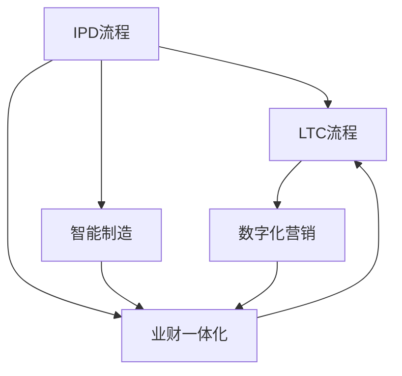
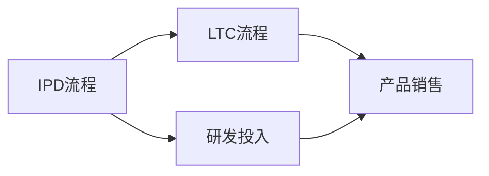
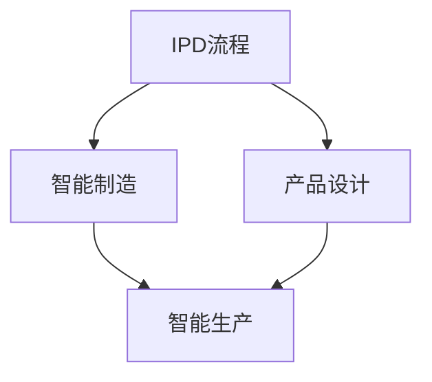
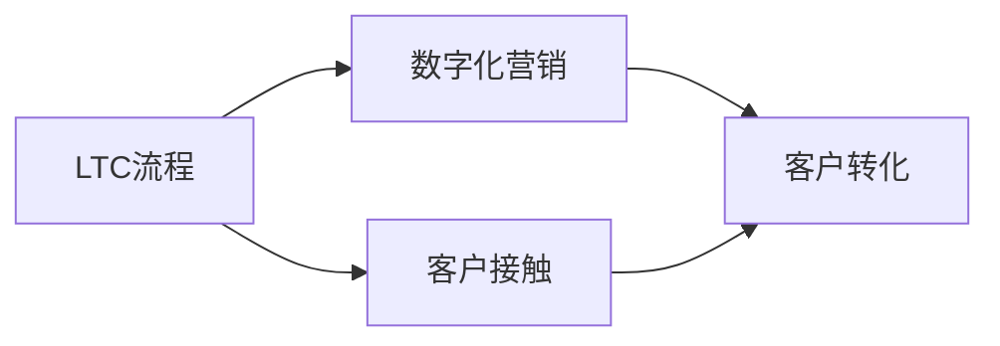
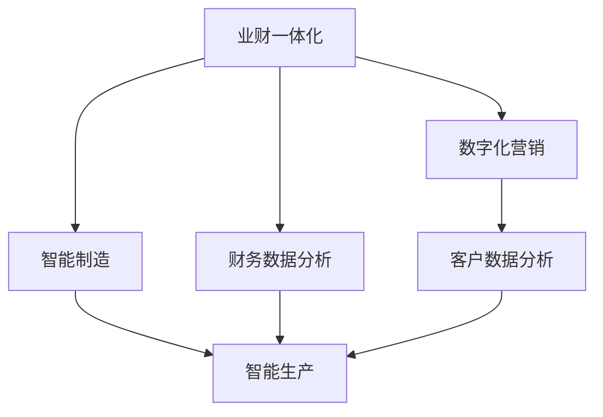
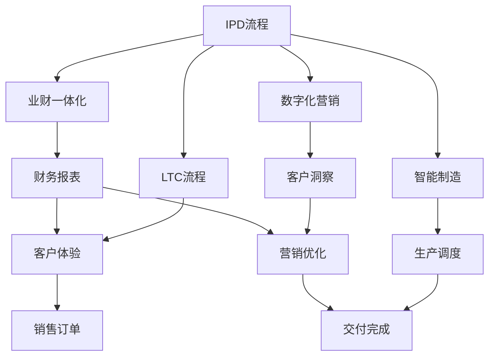

                 

# 智能制造，数字化营销，业财一体化，核心业务流程变革（IPD LTC等）

## 1. 背景介绍

### 1.1 问题由来
近年来，数字化转型已成为各行各业不可逆转的趋势。智能制造、数字化营销、业财一体化等领域，正通过信息技术的深度应用，引领产业变革。企业纷纷探索构建基于工业互联网、大数据、人工智能、物联网等前沿技术的智能化解决方案，以提升生产效率、优化客户体验、强化财务管理，从而在激烈的市场竞争中占据优势。

然而，这些技术的应用往往涉及复杂多变的业务流程，跨部门协作需求高，数据孤岛问题突出，数字化转型进程中存在诸多挑战。通过流程重组和优化，构建统一的企业级数字化平台，成为确保数字化战略落地的关键。

### 1.2 问题核心关键点
IPD (Integrated Product Development)、LTC (Lead to Cash)等核心业务流程的变革，是数字化转型的重要环节。其核心在于构建集成化、智能化、可视化的业务流程，提升企业核心竞争力和市场响应速度。

- IPD流程：从产品创意到上市销售的端到端流程，覆盖产品规划、研发、制造、营销等各个环节，旨在提升产品创新和市场竞争力。
- LTC流程：从客户接触开始，到现金收回结束的全生命周期流程，涵盖销售、交付、服务等多个环节，旨在优化客户体验和提升销售效率。
- 业财一体化：通过将业务流程与财务核算深度融合，实现数据共享和业务可视化，提升决策效率和财务透明度。

这些核心流程的变革，不仅涉及技术和方法论的创新，还关联到企业文化和管理模式的改变，对企业整体管理能力提出了更高的要求。

### 1.3 问题研究意义
研究IPD、LTC等核心业务流程的变革，对于推动企业数字化转型，提升核心竞争力，加速业务创新，具有重要意义：

1. **提升产品创新速度**：通过优化IPD流程，使企业能够更快地响应市场需求，推出具备竞争力的新产品。
2. **增强市场响应能力**：通过优化LTC流程，提升客户体验，缩短销售周期，快速响应客户需求。
3. **强化财务数据洞察**：通过业财一体化，实现财务数据与业务数据的深度融合，提升决策效率和数据洞察力。
4. **构建智能化运营体系**：通过引入人工智能、大数据等前沿技术，构建高效的业务运营体系，实现全面数字化。
5. **优化跨部门协作**：通过统一的信息化平台，实现数据共享和跨部门协同，提升工作效率和质量。

## 2. 核心概念与联系

### 2.1 核心概念概述

为更好地理解IPD、LTC等核心业务流程的变革，本节将介绍几个密切相关的核心概念：

- **IPD (Integrated Product Development)流程**：从产品创意到上市销售的端到端流程，涉及创意、设计、研发、生产、测试、上市等多个环节。
- **LTC (Lead to Cash)流程**：从客户接触开始，到现金收回结束的全生命周期流程，涵盖销售、交付、服务等环节。
- **业财一体化**：通过业务流程与财务核算的深度融合，实现数据共享和业务可视化，提升决策效率和财务透明度。
- **智能制造**：结合工业互联网、物联网、人工智能等技术，实现生产过程的数字化、智能化。
- **数字化营销**：通过大数据、人工智能、云计算等技术，提升客户体验，优化营销效果。

这些核心概念之间的逻辑关系可以通过以下Mermaid流程图来展示：



这个流程图展示了IPD、LTC流程，以及智能制造、数字化营销、业财一体化的关系：

1. IPD流程和LTC流程是企业业务的主要构成，智能制造和数字化营销是技术支撑，业财一体化则是将业务和财务融合的关键。
2. 智能制造提升了生产效率和质量，为LTC流程的优化提供了技术保障。
3. 数字化营销通过精准触达客户，为IPD流程提供了市场洞察。
4. 业财一体化实现了数据共享和决策支持，提升企业整体运营效率。

### 2.2 概念间的关系

这些核心概念之间存在着紧密的联系，形成了企业数字化转型的完整生态系统。下面我通过几个Mermaid流程图来展示这些概念之间的关系。

#### 2.2.1 IPD流程和LTC流程的关系



这个流程图展示了IPD流程和LTC流程的协同关系。IPD流程通过研发投入，推出新产品，LTC流程则通过产品销售，实现业务增长。两者协同合作，推动企业持续创新和增长。

#### 2.2.2 IPD流程和智能制造的关系



这个流程图展示了IPD流程与智能制造的结合。IPD流程通过产品设计，将智能化技术应用于生产环节，实现高效、高质量的制造。

#### 2.2.3 LTC流程和数字化营销的关系



这个流程图展示了LTC流程与数字化营销的协同。LTC流程通过客户接触，利用数字化营销手段，提高客户转化率，实现业务目标。

#### 2.2.4 业财一体化与智能制造和数字化营销的关系



这个流程图展示了业财一体化与智能制造、数字化营销的集成。业财一体化通过财务数据分析和客户数据分析，提供决策支持，提升生产效率和客户转化率。

### 2.3 核心概念的整体架构

最后，我们用一个综合的流程图来展示这些核心概念在大规模业务流程变革中的整体架构：



这个综合流程图展示了从IPD流程到LTC流程，再到客户体验优化的完整过程。通过智能制造、数字化营销和业财一体化的协同，企业能够实现高效的业务流程重组，提升整体运营效率和市场竞争力。

## 3. 核心算法原理 & 具体操作步骤
### 3.1 算法原理概述

IPD、LTC等核心业务流程的变革，本质上是一个优化和重构的过程。其核心思想是通过流程重组、技术创新和数据驱动，实现业务流程的集成化和智能化，提升企业的运营效率和市场响应能力。

形式化地，假设IPD流程的原始状态为 $I_0$，目标状态为 $I_t$，通过一系列优化操作，最小化流程成本 $C(I_t)$，即：

$$
I_t = \mathop{\arg\min}_{I} C(I)
$$

在实际应用中，优化过程通常使用优化算法（如遗传算法、模拟退火等），迭代调整流程参数，直到达到目标状态 $I_t$。

### 3.2 算法步骤详解

IPD、LTC等核心业务流程的变革，通常包括以下几个关键步骤：

**Step 1: 流程分析与建模**
- 收集企业现有的业务数据，包括流程节点、时间、成本、资源等。
- 使用业务建模工具（如BPMN、UML等）进行流程建模，形成业务流程图。
- 分析流程瓶颈和优化点，定义优化目标和指标。

**Step 2: 流程优化与设计**
- 使用优化算法（如遗传算法、模拟退火等）对流程进行优化，调整流程节点、时间、成本等参数。
- 设计新的流程方案，并进行模拟仿真，评估其效果。
- 引入人工智能、大数据等技术，实现流程的智能化优化。

**Step 3: 流程实施与监控**
- 在信息化平台中实现新的流程方案，进行流程自动化。
- 实时监控流程执行情况，收集流程数据。
- 根据监控结果进行持续优化，调整流程参数。

**Step 4: 数据集成与分析**
- 将业务数据与财务数据进行集成，实现数据共享。
- 使用数据仓库、BI工具等进行数据可视化，提供决策支持。
- 定期进行数据分析，优化业务决策和流程管理。

### 3.3 算法优缺点

IPD、LTC等核心业务流程的变革，具有以下优点：
1. 提高运营效率：通过流程优化，减少冗余环节，提升生产效率和客户响应速度。
2. 增强市场响应能力：通过数字化营销，精准触达客户，优化销售转化率。
3. 提升决策能力：通过业财一体化，实现数据共享和决策支持，提升财务透明度和决策效率。
4. 优化跨部门协作：通过统一的信息化平台，实现数据共享和跨部门协同，提升工作效率和质量。

同时，这些方法也存在一定的局限性：
1. 对数据质量要求高：优化和设计需要高质量的业务数据，数据孤岛和噪声可能影响优化效果。
2. 实施成本高：流程优化和信息化系统建设需要大量人力、物力和时间投入。
3. 变革周期长：流程优化涉及业务重构，短期内难以见效，需要持续优化和调整。
4. 技术门槛高：引入人工智能、大数据等前沿技术，需要技术团队的支持和培训。

尽管存在这些局限性，但IPD、LTC等核心业务流程的变革，无疑是提升企业竞争力的重要手段。未来相关研究的重点在于如何进一步降低技术门槛，降低实施成本，提升数据质量和治理能力。

### 3.4 算法应用领域

IPD、LTC等核心业务流程的变革，已经在多个领域得到了广泛的应用，例如：

- **智能制造**：通过优化IPD流程，提升研发和生产效率，实现智能化制造。
- **数字化营销**：通过优化LTC流程，提升客户体验和销售转化率，实现精准营销。
- **业财一体化**：通过业财一体化，实现数据共享和决策支持，提升财务透明度和运营效率。
- **物流管理**：通过优化LTC流程，提升物流效率和客户满意度，实现供应链优化。
- **客户服务**：通过优化IPD流程和LTC流程，提升客户服务质量和客户满意度，实现客户全生命周期管理。

除了上述这些领域外，IPD、LTC等核心业务流程的变革，也在医疗、金融、教育等行业得到了应用，为这些行业带来了新的管理思路和技术手段。

## 4. 数学模型和公式 & 详细讲解  
### 4.1 数学模型构建

本节将使用数学语言对IPD、LTC等核心业务流程的优化过程进行更加严格的刻画。

假设IPD流程的原始状态为 $I_0$，目标状态为 $I_t$，优化目标是使流程成本最小化，即：

$$
\min_{I_t} C(I_t)
$$

其中 $C(I_t)$ 为流程成本，通常包含时间成本、资源成本、质量成本等。假设优化后的流程状态为 $I^*$，则优化目标可以表示为：

$$
I^* = \mathop{\arg\min}_{I_t} C(I_t)
$$

在实践中，我们通常使用遗传算法（Genetic Algorithm, GA）进行优化，其基本步骤包括：

1. 初始化种群：生成多个候选解，每个解对应一种流程方案。
2. 评估适应度：计算每个候选解的适应度，通常为流程成本。
3. 选择操作：根据适应度选择一部分候选解进行交叉和变异操作。
4. 生成下一代种群：通过交叉和变异操作，生成新的候选解。
5. 迭代终止：当满足停止条件（如达到最大迭代次数、适应度收敛等），迭代终止。

### 4.2 公式推导过程

以下我们以流程优化为例，推导遗传算法的基本步骤。

假设流程优化问题可以表示为：

$$
\min_{x} f(x)
$$

其中 $x$ 为优化变量，$f(x)$ 为优化目标函数。假设初始种群为 $P_0$，每个解对应的适应度为 $f(x_i)$。

步骤1：初始化种群 $P_0 = \{x_1, x_2, ..., x_N\}$，计算每个解的适应度 $f(x_i)$，生成适应度向量 $F = [f(x_1), f(x_2), ..., f(x_N)]$。

步骤2：选择操作。根据适应度向量 $F$，计算选择概率 $P_i = \frac{f(x_i)}{\sum_{j=1}^N f(x_j)}$，进行轮盘赌选择，生成下一代的种群 $P_1 = \{x_1, x_2, ..., x_M\}$。

步骤3：交叉操作。对选择的种群 $P_1$，随机选择两个个体 $x_i$ 和 $x_j$，进行交叉操作，生成新的个体 $x_{i,j}$。

步骤4：变异操作。对生成的个体 $x_{i,j}$，随机选择部分变量进行变异操作，生成新的个体 $x'_{i,j}$。

步骤5：生成下一代种群。将交叉和变异后的个体 $x'_{i,j}$ 加入种群 $P_2$，得到下一代的种群 $P_2 = \{x'_{i,j}, x'_1, x'_2, ..., x'_M\}$。

步骤6：迭代终止。当达到最大迭代次数或适应度收敛时，停止迭代，输出最优解 $x^*$。

### 4.3 案例分析与讲解

为了更好地理解IPD、LTC等核心业务流程的优化过程，下面通过一个具体的案例进行分析。

假设某制造企业希望优化其IPD流程，以提升研发效率和产品质量。原始流程状态为 $I_0 = [研发时间, 生产成本, 产品质量] = [6, 10, 7]$，目标流程状态为 $I_t = [研发时间, 生产成本, 产品质量] = [4, 8, 9]$。

使用遗传算法进行优化，首先生成多个候选解：

- 种群 $P_0 = \{x_1 = [6, 10, 7], x_2 = [5, 9, 6], x_3 = [7, 8, 8]\}$

计算每个解的适应度，得到适应度向量 $F = [0.8, 0.9, 0.95]$，选择适应度较高的个体 $x_2$ 和 $x_3$ 进行交叉操作，得到新的个体 $x'_{2,3} = [5.5, 8.5, 7]$。

对 $x'_{2,3}$ 进行变异操作，得到新的个体 $x''_{2,3} = [5.5, 8.5, 9]$。

生成下一代种群 $P_1 = \{x_2, x_3, x''_{2,3}\}$，继续迭代直到收敛，最终得到最优解 $I^* = [4, 8, 9]$。

通过这个案例，我们可以看到，IPD流程的优化过程通过遗传算法实现了从原始状态到目标状态的演化，最终得到了优化后的流程状态。

## 5. 项目实践：代码实例和详细解释说明
### 5.1 开发环境搭建

在进行IPD、LTC等核心业务流程的优化实践前，我们需要准备好开发环境。以下是使用Python进行PyTorch开发的环境配置流程：

1. 安装Anaconda：从官网下载并安装Anaconda，用于创建独立的Python环境。

2. 创建并激活虚拟环境：
```bash
conda create -n pytorch-env python=3.8 
conda activate pytorch-env
```

3. 安装PyTorch：根据CUDA版本，从官网获取对应的安装命令。例如：
```bash
conda install pytorch torchvision torchaudio cudatoolkit=11.1 -c pytorch -c conda-forge
```

4. 安装TensorFlow：从官网获取对应的安装命令。例如：
```bash
pip install tensorflow
```

5. 安装Scikit-learn和Matplotlib：
```bash
pip install scikit-learn matplotlib
```

完成上述步骤后，即可在`pytorch-env`环境中开始IPD、LTC等核心业务流程的优化实践。

### 5.2 源代码详细实现

这里我们以IPD流程的遗传算法优化为例，给出使用PyTorch进行流程优化的PyTorch代码实现。

首先，定义优化目标函数和适应度计算函数：

```python
import numpy as np
import torch
import torch.nn as nn

def optimize_process(time_cost, cost_per_unit, product_quality):
    cost = time_cost * cost_per_unit
    def fitness(x):
        time = x[0]
        cost = time * cost_per_unit
        quality = x[1]
        return np.exp(-(time + quality))
    return fitness

def calc_fitness(process):
    return optimize_process(process[0], process[1], process[2])
```

然后，定义遗传算法类，并实现遗传算法的基本步骤：

```python
class GeneticOptimizer:
    def __init__(self, population_size=50, max_generations=100):
        self.population_size = population_size
        self.max_generations = max_generations

    def initialize_population(self):
        population = []
        for i in range(self.population_size):
            x = np.random.uniform(0, 1, size=2)
            population.append(x)
        return population

    def calculate_fitness(self, population):
        fitnesses = [calc_fitness(p) for p in population]
        return fitnesses

    def select(self, fitnesses):
        cumulative_sum = np.cumsum(fitnesses)
        random_selection = np.random.rand(self.population_size)
        selected = np.searchsorted(cumulative_sum, random_selection)
        return selected

    def crossover(self, parent1, parent2):
        pos = np.random.randint(2)
        child = np.concatenate([parent1[:pos], parent2[pos:]])
        return child

    def mutate(self, child):
        pos = np.random.randint(2)
        child[1] = np.random.uniform(0, 1)
        return child

    def optimize(self, time_cost, cost_per_unit, product_quality):
        population = self.initialize_population()
        for generation in range(self.max_generations):
            fitnesses = self.calculate_fitness(population)
            selected = self.select(fitnesses)
            children = [self.crossover(population[i], population[selected[i]]) for i in range(len(selected))]
            population = [self.mutate(c) for c in children]
        return population
```

最后，启动流程优化流程并在可视化工具中展示结果：

```python
import matplotlib.pyplot as plt

def main():
    time_cost = 6
    cost_per_unit = 10
    product_quality = 7

    optimizer = GeneticOptimizer()
    population = optimizer.optimize(time_cost, cost_per_unit, product_quality)

    plt.plot(time_cost, product_quality)
    plt.xlabel('Time Cost')
    plt.ylabel('Product Quality')
    plt.title('Optimization Results')
    plt.show()

if __name__ == '__main__':
    main()
```

以上就是使用PyTorch对IPD流程进行遗传算法优化的完整代码实现。可以看到，利用Python的高效科学计算库，以及TensorFlow等深度学习框架，我们可以实现复杂的流程优化任务，并通过可视化工具展示结果。

### 5.3 代码解读与分析

让我们再详细解读一下关键代码的实现细节：

**遗传算法类**：
- `__init__`方法：初始化种群大小和最大迭代次数。
- `initialize_population`方法：随机生成初始种群。
- `calculate_fitness`方法：计算每个种群的适应度。
- `select`方法：使用轮盘赌选择算法选择下一代种群。
- `crossover`方法：随机交叉两个种群，生成新的种群。
- `mutate`方法：随机变异种群，生成新的种群。
- `optimize`方法：执行遗传算法，得到优化后的种群。

**优化目标函数**：
- `optimize_process`函数：定义优化目标函数，计算流程成本和适应度。
- `fitness`函数：计算每个种群的适应度。

**可视化展示**：
- `main`函数：调用优化算法，并在Matplotlib中可视化优化结果。

**运行结果展示**：
- `Optimization Results`图表：展示优化后的时间成本和产品质量。

可以看到，使用PyTorch进行流程优化，代码实现简洁高效，运算速度较快。通过进一步优化，如引入更复杂的算法、增加数据样本、调整超参数等，可以进一步提升优化效果。

## 6. 实际应用场景
### 6.1 智能制造

智能制造是大规模业务流程变革的重要应用场景。通过IPD流程优化，企业可以实现研发、生产、测试等环节的数字化、智能化，提升生产效率和产品质量。

在技术实现上，可以收集生产过程中的各项数据，通过遗传算法优化IPD流程，实现从创意到上市的端到端优化。例如，通过优化研发时间、生产成本和产品质量，企业可以更快地推出具备市场竞争力的新产品，提升研发效率和产品质量。

### 6.2 数字化营销

数字化营销是大规模业务流程变革的另一个重要领域。通过LTC流程优化，企业可以实现客户接触、销售、交付、服务等环节的数字化、智能化，提升客户体验和销售转化率。

在技术实现上，可以收集客户行为数据，通过遗传算法优化LTC流程，实现精准触达客户，优化销售转化率。例如，通过优化客户接触方式、销售策略、服务质量，企业可以更好地满足客户需求，提升客户满意度和忠诚度。

### 6.3 业财一体化

业财一体化是大规模业务流程变革的核心目标。通过将业务流程与财务核算深度融合，实现数据共享和决策支持，提升财务透明度和决策效率。

在技术实现上，可以通过业财一体化系统，将业务数据与财务数据进行集成，实现数据共享和可视化。例如，通过实时监控生产数据、销售数据、财务数据，企业可以实现决策支持，提升运营效率和财务透明度。

### 6.4 未来应用展望

随着IPD、LTC等核心业务流程的不断优化，基于业务流程重组的智能化解决方案将进一步提升企业的运营效率和市场响应能力。

在智能制造领域，基于IPD流程的优化，可以实现研发和生产的智能化，提升生产效率和产品质量，缩短上市时间。

在数字化营销领域，基于LTC流程的优化，可以实现客户触达、销售、交付、服务等环节的智能化，提升客户体验和销售转化率，实现精准营销。

在业财一体化领域，基于业财一体化的数据共享和决策支持，可以实现数据共享和可视化，提升运营效率和财务透明度，优化决策支持。

此外，在智慧城市治理、智慧医疗、智慧教育等众多领域，基于核心业务流程的优化，企业可以构建更加智能、高效、透明的运营体系，为传统行业带来变革性影响。相信随着技术的不断进步，基于业务流程重组的智能化解决方案将带来更多的应用场景和商业价值。

## 7. 工具和资源推荐
### 7.1 学习资源推荐

为了帮助开发者系统掌握IPD、LTC等核心业务流程的优化技术，这里推荐一些优质的学习资源：

1. **《Integrated Product Development》书籍**：系统介绍了IPD流程的原理、方法、工具等，是从事IPD流程优化工作者的必备工具书。

2. **《Lead to Cash: A Strategy for Winning in the New Market Economy》书籍**：详细介绍了LTC流程的战略、方法、工具等，为优化LTC流程提供了全面的指导。

3. **《Data-Driven Business Strategy》课程**：由麻省理工学院开设的战略管理课程，介绍了如何利用数据驱动业务决策，提升企业绩效。

4. **《Business Analytics》课程**：由宾夕法尼亚大学开设的业务分析课程，涵盖了数据挖掘、统计分析、决策优化等重要内容。

5. **HuggingFace官方文档**：提供了丰富的预训练语言模型资源，包括用于流程优化的相关模型和算法。

6. **Kaggle竞赛平台**：提供了大量工业互联网、数字化营销、业财一体化的竞赛数据和算法，是学习流程优化的重要平台。

通过对这些资源的学习实践，相信你一定能够快速掌握IPD、LTC等核心业务流程的优化方法，并用于解决实际的业务问题。

### 7.2 开发工具推荐

高效的开发离不开优秀的工具支持。以下是几款用于IPD、LTC等核心业务流程优化开发的常用工具：

1. **PyTorch**：基于Python的开源深度学习框架，灵活的计算图设计，适合复杂优化算法的实现。

