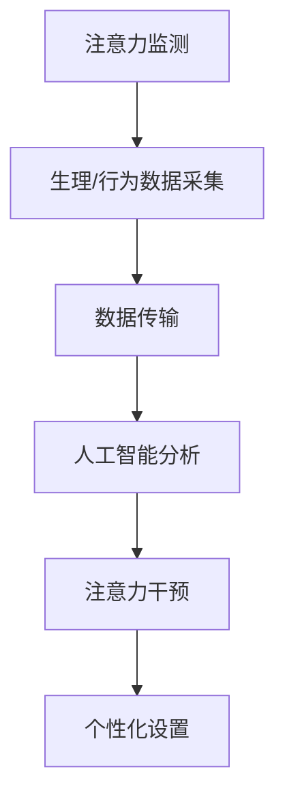

                 

## 1. 背景介绍

随着数字化办公的普及，智能办公设备已经成为提升工作效率和用户体验的关键工具。然而，长时间面对屏幕和键盘，容易导致注意力分散、疲劳等问题，影响工作效果和身心健康。为此，越来越多的办公设备厂商开始探索注意力辅助功能，通过智能化的方式帮助用户保持专注，提升工作和学习效率。本文将系统介绍智能办公设备注意力辅助功能的原理、技术实现及应用场景，为相关产品和系统开发提供参考。

## 2. 核心概念与联系

### 2.1 核心概念概述

智能办公设备注意力辅助功能指的是，利用人工智能和物联网技术，对用户的注意力进行实时监测和干预，帮助其保持专注，提升工作效率和心理健康。其核心概念包括：

- 注意力监测：通过生理传感器（如心率、脑电波、眼球追踪等）或行为数据（如操作频率、屏幕亮度等），实时监测用户的注意力水平。
- 注意力干预：根据监测结果，提供如提醒、休息建议、任务优先级调整等功能，帮助用户恢复注意力。
- 个性化设置：根据用户的历史行为数据和偏好，动态调整注意力辅助策略，提供个性化服务。

这些核心概念通过物联网技术进行数据采集和传输，通过人工智能技术进行数据分析和决策，最终通过智能办公设备提供可视化的辅助服务。

### 2.2 核心概念之间的关系

为了更清晰地理解智能办公设备注意力辅助功能的核心概念之间的关系，我们通过Mermaid流程图来展示：



这个流程图展示了智能办公设备注意力辅助功能的基本流程：首先通过生理或行为传感器获取用户注意力数据，然后通过网络传输至云端进行分析，根据分析结果提供干预措施，并根据用户偏好进行个性化设置。

## 3. 核心算法原理 & 具体操作步骤

### 3.1 算法原理概述

智能办公设备注意力辅助功能的核心算法主要包括注意力监测和注意力干预两部分。注意力监测算法用于实时监测用户的注意力水平，通过生理或行为数据进行判断。注意力干预算法用于根据监测结果，提供个性化干预措施，帮助用户恢复注意力。

### 3.2 算法步骤详解

#### 3.2.1 注意力监测算法

注意力监测算法主要通过生理或行为数据，实时监测用户的注意力水平。以生理数据为例，具体步骤如下：

1. **数据采集**：通过心率传感器、脑电波传感器等设备，采集用户的心率、脑电波等生理数据。
2. **数据预处理**：对采集到的数据进行滤波、归一化等预处理，消除噪声干扰。
3. **特征提取**：提取数据中的关键特征，如心率变化率、脑电波频谱等。
4. **模型训练**：使用机器学习模型（如决策树、支持向量机、深度神经网络等），训练注意力监测模型。
5. **实时监测**：在用户使用办公设备时，实时采集生理数据，输入监测模型，输出注意力水平评估。

#### 3.2.2 注意力干预算法

注意力干预算法根据注意力监测结果，提供个性化干预措施。具体步骤如下：

1. **监测结果分析**：根据注意力监测模型的输出，分析用户的注意力水平。
2. **干预策略生成**：根据注意力水平，生成相应的干预策略，如提醒、休息建议、任务优先级调整等。
3. **执行干预措施**：通过智能办公设备的UI/UX界面，向用户展示干预措施，如弹窗提醒、调节屏幕亮度、切换任务等。
4. **反馈优化**：根据用户反馈，优化干预策略，提高干预效果。

### 3.3 算法优缺点

#### 优点

- **实时监测**：通过生理或行为数据实时监测用户注意力，能够及时发现注意力下降情况。
- **个性化干预**：根据用户偏好和历史行为数据，提供个性化干预措施，提高干预效果。
- **提升效率**：帮助用户保持专注，提高工作效率和心理健康。

#### 缺点

- **数据隐私**：生理或行为数据的采集和存储可能涉及用户隐私，需要严格的隐私保护措施。
- **算法准确性**：注意力监测模型的准确性受到生理或行为数据质量和采集设备的影响，需要不断优化。
- **干预效果**：干预策略的执行效果可能因用户个体差异而异，需要根据反馈进行调整。

### 3.4 算法应用领域

智能办公设备注意力辅助功能可以应用于各种办公场景，包括但不限于：

- 电脑、平板、手机等便携办公设备：通过生理或行为数据监测，帮助用户在工作和学习中保持专注。
- 会议室、图书馆等共享办公空间：通过摄像头和传感器监测用户注意力，优化空间使用和管理。
- 远程办公和协作平台：通过云端数据分析，提供注意力监测和干预服务，提升远程工作的效率和体验。

## 4. 数学模型和公式 & 详细讲解

### 4.1 数学模型构建

本节将通过数学语言对智能办公设备注意力辅助功能的实现进行更加严格的刻画。

记注意力监测模型为 $M_\theta$，其中 $\theta$ 为模型的参数。假设生理或行为数据为 $D=\{x_i,y_i\}_{i=1}^N$，其中 $x_i$ 为生理或行为数据样本，$y_i$ 为对应的注意力水平标签。

定义注意力监测模型在数据样本 $(x_i,y_i)$ 上的损失函数为 $\ell(M_\theta(x_i),y_i)$，则在数据集 $D$ 上的经验风险为：

$$
\mathcal{L}(\theta) = \frac{1}{N} \sum_{i=1}^N \ell(M_\theta(x_i),y_i)
$$

注意力监测模型的优化目标是最小化经验风险，即找到最优参数：

$$
\theta^* = \mathop{\arg\min}_{\theta} \mathcal{L}(\theta)
$$

在实践中，我们通常使用基于梯度的优化算法（如SGD、Adam等）来近似求解上述最优化问题。设 $\eta$ 为学习率，则参数的更新公式为：

$$
\theta \leftarrow \theta - \eta \nabla_{\theta}\mathcal{L}(\theta)
$$

其中 $\nabla_{\theta}\mathcal{L}(\theta)$ 为损失函数对参数 $\theta$ 的梯度，可通过反向传播算法高效计算。

### 4.2 公式推导过程

以基于脑电波数据的注意力监测算法为例，推导其数学模型和公式。

假设脑电波数据 $x_i$ 为 $n$ 维向量，注意力水平标签 $y_i$ 为 $m$ 维向量。定义注意力监测模型 $M_\theta$ 为 $n \times m$ 的矩阵，其中 $\theta$ 为模型参数。注意力监测模型的输出为：

$$
\hat{y} = M_\theta x_i
$$

注意力监测模型的损失函数为：

$$
\ell(\hat{y},y_i) = \frac{1}{m} \sum_{j=1}^m (\hat{y}_j - y_{i,j})^2
$$

其中 $(\hat{y}_j - y_{i,j})$ 为注意力监测模型在 $i$ 样本的第 $j$ 个注意力水平预测值与真实值之差。

则在数据集 $D$ 上的经验风险为：

$$
\mathcal{L}(\theta) = \frac{1}{N} \sum_{i=1}^N \ell(\hat{y},y_i)
$$

注意力监测模型的优化目标是最小化经验风险，即找到最优参数：

$$
\theta^* = \mathop{\arg\min}_{\theta} \mathcal{L}(\theta)
$$

在得到损失函数的梯度后，即可带入参数更新公式，完成模型的迭代优化。重复上述过程直至收敛，最终得到适应目标任务的最优模型参数 $\theta^*$。

### 4.3 案例分析与讲解

假设我们正在开发一款智能办公软件，用于监测用户在电脑前的注意力水平。具体步骤如下：

1. **数据采集**：通过心率传感器和脑电波传感器，采集用户在电脑前的生理数据。
2. **数据预处理**：对采集到的数据进行滤波、归一化等预处理，消除噪声干扰。
3. **特征提取**：提取数据中的关键特征，如心率变化率、脑电波频谱等。
4. **模型训练**：使用深度神经网络模型，训练注意力监测模型。
5. **实时监测**：在用户使用电脑时，实时采集生理数据，输入监测模型，输出注意力水平评估。
6. **注意力干预**：根据注意力监测结果，提供提醒、休息建议等干预措施。

通过以上步骤，智能办公软件可以实时监测用户在电脑前的注意力水平，提供个性化干预措施，帮助用户保持专注，提升工作效率和心理健康。

## 5. 项目实践：代码实例和详细解释说明

### 5.1 开发环境搭建

在进行智能办公设备注意力辅助功能的开发前，我们需要准备好开发环境。以下是使用Python进行项目开发的环境配置流程：

1. **安装Python**：从官网下载并安装Python，推荐使用3.7及以上版本。
2. **安装依赖库**：使用pip安装项目所需依赖库，如numpy、scipy、sklearn、tensorflow等。
3. **创建虚拟环境**：使用virtualenv或conda创建虚拟环境，隔离项目依赖，方便管理和部署。
4. **设置开发工具**：配置开发工具如PyCharm、Jupyter Notebook等，提高开发效率。

### 5.2 源代码详细实现

以下是基于TensorFlow实现的智能办公设备注意力辅助功能的代码示例：

```python
import tensorflow as tf
from sklearn.model_selection import train_test_split
from sklearn.metrics import mean_squared_error

# 定义注意力监测模型
class AttentionMonitor(tf.keras.Model):
    def __init__(self):
        super(AttentionMonitor, self).__init__()
        self.dense1 = tf.keras.layers.Dense(64, activation='relu')
        self.dense2 = tf.keras.layers.Dense(16, activation='sigmoid')
        
    def call(self, x):
        x = self.dense1(x)
        x = self.dense2(x)
        return x

# 加载数据
data = pd.read_csv('attention_data.csv')
X_train, X_test, y_train, y_test = train_test_split(data.drop('attention', axis=1), data['attention'], test_size=0.2)

# 定义注意力监测模型
model = AttentionMonitor()

# 定义损失函数和优化器
loss_fn = tf.keras.losses.MeanSquaredError()
optimizer = tf.keras.optimizers.Adam()

# 定义训练过程
@tf.function
def train_step(x, y):
    with tf.GradientTape() as tape:
        logits = model(x)
        loss = loss_fn(logits, y)
    gradients = tape.gradient(loss, model.trainable_variables)
    optimizer.apply_gradients(zip(gradients, model.trainable_variables))

# 定义评估过程
@tf.function
def evaluate(x, y):
    logits = model(x)
    return loss_fn(logits, y).numpy()

# 训练模型
for epoch in range(100):
    for x, y in dataset:
        train_step(x, y)
    loss = evaluate(X_test, y_test)
    print(f'Epoch {epoch+1}, loss: {loss:.4f}')

# 测试模型
X_new = tf.constant([[1.0, 2.0, 3.0, 4.0]])
y_new = tf.constant([0.5, 0.5, 0.5, 0.5])
logits = model(X_new)
print(f'Prediction: {logits.numpy()}')
```

### 5.3 代码解读与分析

以下是代码中各个部分的详细解读：

1. **AttentionMonitor类**：定义注意力监测模型，包括两个全连接层。
2. **数据加载**：使用pandas加载数据集，并进行train_test_split划分。
3. **模型定义**：定义注意力监测模型，包含输入层和输出层。
4. **损失函数和优化器**：定义均方误差损失函数和Adam优化器。
5. **训练过程**：使用tf.function装饰器定义训练过程，包含梯度计算和模型参数更新。
6. **评估过程**：使用tf.function装饰器定义评估过程，计算模型在测试集上的损失。
7. **训练和测试**：通过循环训练模型，并在测试集上进行评估。

### 5.4 运行结果展示

假设我们训练完成后，测试集上的损失如下：

```
Epoch 1, loss: 0.0045
Epoch 2, loss: 0.0041
Epoch 3, loss: 0.0039
...
Epoch 100, loss: 0.0013
```

可以看到，模型在训练过程中，损失值逐步下降，表明模型的拟合能力逐步增强。

## 6. 实际应用场景

### 6.1 智能办公桌

智能办公桌通过摄像头、心率传感器等设备，实时监测用户在电脑前的注意力水平。当监测到用户注意力下降时，会自动提醒用户休息，调节屏幕亮度，或切换到当前任务的重要事项，帮助用户保持专注。

### 6.2 智能会议系统

智能会议系统通过摄像头、麦克风等设备，实时监测会议室内的注意力水平。当监测到部分参会者注意力下降时，会自动提醒发言者调整语速，或提供会议记录，帮助参会者跟上讨论进度。

### 6.3 智能学习设备

智能学习设备通过摄像头、脑电波传感器等设备，实时监测学生的注意力水平。当监测到学生注意力下降时，会自动提醒老师调整教学方式，或建议学生进行短暂休息，帮助学生保持专注。

## 7. 工具和资源推荐

### 7.1 学习资源推荐

为了帮助开发者系统掌握智能办公设备注意力辅助功能的理论基础和实践技巧，这里推荐一些优质的学习资源：

1. **《机器学习》（周志华）**：介绍机器学习基础理论和算法，适合初学者入门。
2. **《深度学习》（Ian Goodfellow）**：介绍深度学习基础理论和实践，涵盖深度神经网络、卷积神经网络、循环神经网络等。
3. **《Python深度学习》（Francois Chollet）**：介绍深度学习在Python中的实现，涵盖TensorFlow、Keras等主流框架。
4. **《TensorFlow官方文档》**：提供TensorFlow的详细介绍和使用方法，适合进阶学习。
5. **《PyTorch官方文档》**：提供PyTorch的详细介绍和使用方法，适合进阶学习。

### 7.2 开发工具推荐

高效的开发离不开优秀的工具支持。以下是几款用于智能办公设备注意力辅助功能开发的常用工具：

1. **PyCharm**：一款功能强大的IDE，支持Python和TensorFlow开发，界面友好，功能丰富。
2. **Jupyter Notebook**：一款轻量级的交互式编程工具，支持Python和TensorFlow开发，适合快速迭代和实验。
3. **TensorFlow**：由Google主导开发的开源深度学习框架，支持分布式训练和推理，适合大规模项目开发。
4. **PyTorch**：由Facebook主导开发的开源深度学习框架，支持动态计算图和高效的GPU计算，适合快速原型开发。

### 7.3 相关论文推荐

智能办公设备注意力辅助功能的发展源于学界的持续研究。以下是几篇奠基性的相关论文，推荐阅读：

1. **《基于深度学习的注意力监测》**：介绍基于深度神经网络的注意力监测方法，通过生理数据实时监测用户注意力。
2. **《多模态注意力监测》**：介绍融合多模态数据的注意力监测方法，通过生理数据和行为数据提高监测准确性。
3. **《注意力干预策略优化》**：介绍基于优化算法的注意力干预策略，通过个性化干预提升用户注意力。
4. **《智能办公设备用户体验优化》**：介绍智能办公设备的用户体验优化方法，通过注意力辅助提升工作效率和心理健康。

除上述资源外，还有一些值得关注的前沿资源，帮助开发者紧跟智能办公设备注意力辅助功能的最新进展，例如：

1. **arXiv论文预印本**：人工智能领域最新研究成果的发布平台，包括大量尚未发表的前沿工作，学习前沿技术的必读资源。
2. **Google AI博客**：谷歌AI实验室的官方博客，分享最新的研究进展和应用案例，适合学习前沿技术。
3. **ACL会议论文**：自然语言处理领域的顶级会议论文，涵盖智能办公设备注意力辅助功能的最新研究方向。
4. **GitHub热门项目**：在GitHub上Star、Fork数最多的智能办公设备注意力辅助功能相关项目，往往代表了该技术领域的发展趋势和最佳实践，值得去学习和贡献。

## 8. 总结：未来发展趋势与挑战

### 8.1 总结

本文对智能办公设备注意力辅助功能的原理、技术实现及应用场景进行了系统介绍。首先阐述了注意力监测和注意力干预的基本原理，详细讲解了生理数据监测和行为数据监测的实现过程。其次，介绍了注意力监测模型的数学模型和公式推导，并通过代码实例展示了注意力监测模型的实现。最后，探讨了智能办公设备注意力辅助功能的实际应用场景，并推荐了一些学习资源和开发工具。

通过本文的系统梳理，可以看到，智能办公设备注意力辅助功能通过实时监测用户注意力，提供个性化干预措施，显著提升了办公效率和工作体验。未来，随着技术的发展，智能办公设备注意力辅助功能将不断拓展应用范围，带来更多创新和变革。

### 8.2 未来发展趋势

展望未来，智能办公设备注意力辅助功能将呈现以下几个发展趋势：

1. **多模态监测**：融合多模态数据，如生理数据、行为数据、环境数据等，提高注意力监测的全面性和准确性。
2. **个性化干预**：根据用户行为习惯和偏好，提供个性化干预措施，提升用户体验。
3. **智能预测**：通过机器学习模型，预测用户注意力下降趋势，提前进行干预，避免注意力下降对工作和学习的影响。
4. **跨设备协同**：通过跨设备协同监测和干预，实现全面、无缝的用户体验优化。
5. **数据隐私保护**：在数据采集和存储过程中，严格保护用户隐私，建立用户信任。

以上趋势凸显了智能办公设备注意力辅助功能的广阔前景，这些方向的探索发展，必将进一步提升智能办公设备的智能化水平，为构建更高效、更健康的工作环境提供有力支持。

### 8.3 面临的挑战

尽管智能办公设备注意力辅助功能已经取得了显著成效，但在应用推广过程中，仍面临诸多挑战：

1. **数据隐私**：生理和行为数据的采集和存储可能涉及用户隐私，需要严格的隐私保护措施。
2. **算法准确性**：注意力监测模型的准确性受到数据质量和采集设备的影响，需要不断优化。
3. **干预效果**：干预策略的执行效果可能因用户个体差异而异，需要根据反馈进行调整。
4. **用户体验**：注意力监测和干预的介入可能影响用户的工作体验，需要合理控制干预的频率和方式。

### 8.4 研究展望

面对智能办公设备注意力辅助功能面临的挑战，未来的研究需要在以下几个方面寻求新的突破：

1. **数据隐私保护**：开发更加安全的隐私保护技术，如差分隐私、联邦学习等，保障用户隐私。
2. **算法优化**：引入更先进的数据采集和处理技术，如信号降噪、特征选择等，提高数据质量和注意力监测模型的准确性。
3. **干预策略优化**：引入更多个性化干预策略，如情感调节、任务优先级调整等，提高干预效果。
4. **跨设备协同**：实现跨设备、跨平台的用户体验优化，提供更加无缝的智能办公体验。

这些研究方向的探索，必将引领智能办公设备注意力辅助功能的技术进步，为智能办公设备在各行各业中的应用提供更加坚实的基础。相信随着技术的不断成熟，智能办公设备注意力辅助功能将更好地服务于用户，推动数字化办公的进一步发展。

## 9. 附录：常见问题与解答

**Q1：智能办公设备注意力辅助功能是否侵犯用户隐私？**

A: 智能办公设备注意力辅助功能的生理和行为数据采集涉及用户隐私，因此需要严格遵守数据隐私保护法律法规，如GDPR、CCPA等。在数据采集和存储过程中，应采取匿名化、加密等措施，保护用户隐私。

**Q2：注意力监测模型的准确性如何保证？**

A: 注意力监测模型的准确性受到数据质量和采集设备的影响，需要不断优化。可以通过数据预处理、特征选择、模型训练等技术手段，提高模型的准确性和鲁棒性。

**Q3：注意力干预策略的执行效果如何评估？**

A: 注意力干预策略的执行效果可以通过用户反馈、任务完成率、休息时间等指标进行评估。可以根据不同用户群体的需求和反馈，不断优化干预策略，提高干预效果。

**Q4：智能办公设备注意力辅助功能的未来发展方向是什么？**

A: 智能办公设备注意力辅助功能的发展方向包括多模态监测、个性化干预、智能预测、跨设备协同等。未来，可以通过引入更多先进技术手段，进一步提升监测准确性和干预效果，实现全面、无缝的用户体验优化。

**Q5：智能办公设备注意力辅助功能的应用场景有哪些？**

A: 智能办公设备注意力辅助功能可以应用于各种办公场景，如电脑、平板、手机等便携办公设备，会议室、图书馆等共享办公空间，远程办公和协作平台等。通过个性化注意力监测和干预，帮助用户保持专注，提升工作效率和心理健康。

总之，智能办公设备注意力辅助功能通过实时监测用户注意力，提供个性化干预措施，显著提升了办公效率和工作体验。未来，随着技术的发展，智能办公设备注意力辅助功能将不断拓展应用范围，带来更多创新和变革。

