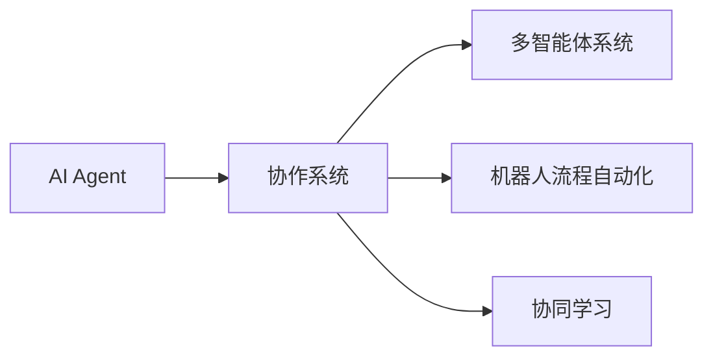
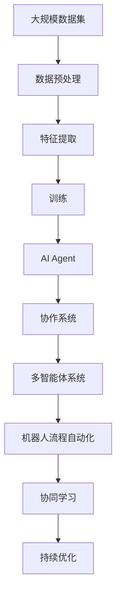

                 

# 智能协作：AI Agent的优势

> 关键词：人工智能(AI)、智能代理(Agent)、协作系统、自动化、机器人流程自动化(RPA)、自然语言处理(NLP)、多智能体系统、协同学习

## 1. 背景介绍

### 1.1 问题由来

在当今快速变化和高度协作的工作环境中，组织需要更高效、更智能的方式来应对复杂任务，以提高生产力、降低成本并提升创新能力。随着人工智能技术的迅猛发展，特别是智能代理(Agent)技术的应用，企业正越来越依赖于这些能够自动执行重复性、低价值任务的机器人流程自动化(RPA)工具。AI Agent不仅能够减轻人工负担，还能提供卓越的协作能力，成为现代企业的重要助力。

### 1.2 问题核心关键点

AI Agent的核心优势在于其能够自主地理解环境、做出决策并执行任务，具有高度的自主性和智能性。相较于传统的规则驱动系统，AI Agent能够通过学习优化其行为，适应动态变化的工作场景。AI Agent的应用领域广泛，包括客户服务、供应链管理、金融交易、医疗保健等。

### 1.3 问题研究意义

研究和应用AI Agent，对于提升工作效率、优化资源配置、增强团队协作和促进自动化转型具有重要意义：

- **提高效率**：AI Agent能够自动处理重复性任务，节省人力资源，从而提升工作效率。
- **优化资源**：通过智能分配资源，AI Agent能更有效地利用企业资源，降低成本。
- **增强协作**：AI Agent可与其他系统无缝协作，提升团队协作效率和响应速度。
- **促进转型**：AI Agent为企业的数字化转型提供技术支持，推动企业向智能化方向发展。

## 2. 核心概念与联系

### 2.1 核心概念概述

为更好地理解AI Agent的协作优势，本节将介绍几个关键概念：

- **AI Agent**：通过感知、推理和行动自主执行任务的智能实体。AI Agent可以应用机器学习算法，进行持续学习，以优化其行为策略。
- **协作系统**：由多个AI Agent组成的网络，用于实现共同目标。协作系统通过通信机制和协调算法，使各个Agent协同工作，提升整体效能。
- **机器人流程自动化(RPA)**：一种自动化技术，通过软件工具模拟人工操作，自动执行复杂、重复的任务。RPA与AI Agent结合，可以实现更加智能的自动化。
- **多智能体系统(MAS)**：由多个自主智能体组成的系统，这些智能体通过交互和合作，解决复杂问题。多智能体系统为AI Agent协作提供了理论基础。
- **协同学习**：指多个智能体通过互动共享知识，共同学习和优化，提升整体性能。协同学习是AI Agent协作的重要机制。

### 2.2 概念间的关系

这些核心概念之间的关系可以通过以下Mermaid流程图来展示：



这个流程图展示了AI Agent的几个关键关联概念：

1. **AI Agent** 通过 **协作系统** 实现与其他Agent的互动与协作，共同完成复杂任务。
2. **协作系统** 建立在 **多智能体系统** 的基础上，多个Agent通过通信和协调算法协同工作。
3. **协作系统** 与 **机器人流程自动化** 结合，可以进一步提升自动化效率。
4. **协作系统** 通过 **协同学习** 机制，不断优化整体性能。

### 2.3 核心概念的整体架构

最后，我们用一个综合的流程图来展示这些核心概念在大规模协作场景中的应用：



这个综合流程图展示了AI Agent在大规模协作中的完整过程：

1. **大规模数据集** 经过 **数据预处理** 和 **特征提取**，用于 **训练** AI Agent。
2. **训练** 后的AI Agent组成 **协作系统**，通过 **多智能体系统** 进行互动。
3. **协作系统** 结合 **机器人流程自动化**，提升自动化效率。
4. **协同学习** 机制持续优化系统性能，通过 **持续优化** 不断提升协作效果。

## 3. 核心算法原理 & 具体操作步骤
### 3.1 算法原理概述

AI Agent的核心算法原理主要基于强化学习(RL)、自然语言处理(NLP)和多智能体系统(MAS)理论。其中，强化学习是AI Agent自主学习和优化行为的核心机制，而NLP和多智能体系统为其协作提供了理论基础。

强化学习通过环境反馈来指导AI Agent的学习过程，使其能够自主决策和执行任务。NLP使AI Agent能够理解自然语言指令，与人类或其他智能体进行高效互动。多智能体系统则提供了协作机制，使多个AI Agent能够协调工作，实现共同目标。

### 3.2 算法步骤详解

AI Agent的协作过程通常包括以下几个关键步骤：

**Step 1: 环境感知**
- AI Agent通过传感器或API获取环境信息，包括状态、目标和约束条件。

**Step 2: 任务规划**
- 根据任务需求，AI Agent制定行动计划，选择合适的策略。

**Step 3: 行为执行**
- 根据规划的策略，AI Agent执行具体行动，实现任务目标。

**Step 4: 反馈学习**
- AI Agent根据环境反馈调整策略，优化行为。

**Step 5: 协作与沟通**
- AI Agent通过通信机制与其他Agent交换信息，协调行动。

**Step 6: 持续优化**
- AI Agent利用协同学习机制，共享知识，提升整体性能。

### 3.3 算法优缺点

AI Agent协作系统具有以下优点：

1. **高效率**：能够自动执行重复性任务，减少人工干预。
2. **灵活性**：能够适应环境变化，自主优化决策。
3. **协同能力**：通过协作提升整体效能，解决复杂问题。
4. **可扩展性**：可以并行处理多个任务，提升系统容量。

同时，也存在一些局限性：

1. **依赖数据质量**：AI Agent的性能高度依赖于训练数据的质量。
2. **难以解释**：复杂的决策过程可能缺乏可解释性。
3. **系统复杂性**：协作系统的构建和管理较为复杂。
4. **安全风险**：Agent的行为可能受环境影响，存在安全隐患。

### 3.4 算法应用领域

AI Agent协作系统已经在多个领域得到应用，以下是几个典型的例子：

- **客户服务**：智能客服系统通过多Agent协作，实现24/7无间断服务，提升客户满意度。
- **供应链管理**：AI Agent协调仓储、物流和采购，优化供应链效率，降低成本。
- **金融交易**：AI Agent进行高频交易，提升交易效率和收益。
- **医疗保健**：AI Agent辅助医生进行诊断和治疗，提升医疗服务质量。

## 4. 数学模型和公式 & 详细讲解 & 举例说明

### 4.1 数学模型构建

在AI Agent协作中，我们通常使用马尔可夫决策过程(MDP)来建模，并结合强化学习算法进行优化。

定义状态空间为 $S$，动作空间为 $A$，状态到动作的转移概率为 $P$，奖励函数为 $R$。AI Agent在每个时刻 $t$ 从状态 $s_t$ 执行动作 $a_t$，获得奖励 $r_{t+1}$ 并转移到下一个状态 $s_{t+1}$。AI Agent的目标是通过优化策略 $\pi(a|s)$，最大化累积奖励 $\sum_{t=0}^{\infty} \gamma^t r_t$，其中 $\gamma$ 是折扣因子。

### 4.2 公式推导过程

假设 $Q^{\pi}(s,a)$ 表示在策略 $\pi$ 下，从状态 $s$ 执行动作 $a$ 的累积奖励期望。则贝尔曼方程为：

$$
Q^{\pi}(s,a) = r + \gamma \max_{a'} Q^{\pi}(s',a')
$$

其中 $r = R(s,a,s')$ 表示从状态 $s$ 执行动作 $a$ 到达状态 $s'$ 的即时奖励。

通过求解贝尔曼方程，可以求得最优策略 $\pi^*$。

### 4.3 案例分析与讲解

以智能客服系统为例，假设系统有多个客服Agent，每个Agent负责处理不同类型的客户请求。系统根据客户请求的紧急程度和复杂性，自动分配任务给最合适的Agent。

在处理过程中，Agent通过NLP技术理解客户请求，并根据预设规则或学习到的模式选择合适的回答。系统通过强化学习算法，根据客户满意度等指标调整Agent的行为策略。

## 5. 项目实践：代码实例和详细解释说明

### 5.1 开发环境搭建

进行AI Agent协作系统开发时，需要先搭建开发环境。以下是Python环境配置的详细步骤：

1. 安装Python：从官网下载并安装Python，选择合适的版本。
2. 安装必要的包：使用pip安装numpy、scipy、matplotlib、tqdm等数据科学和可视化包。
3. 安装RPA工具：如UiPath、Blue Prism等，用于自动化任务处理。
4. 安装NLP库：如spaCy、NLTK、Transformers等，用于处理自然语言。
5. 安装AI Agent框架：如PyDoppleganger、Cassowary等，用于开发和管理AI Agent。

完成上述步骤后，即可在Python环境下开始开发。

### 5.2 源代码详细实现

下面以智能客服系统为例，给出使用PyDoppleganger框架开发AI Agent的Python代码实现。

首先，定义客服Agent的类：

```python
from pydoppleganger.agents import BaseAgent
from pydoppleganger.agents import PickupAgent
from pydoppleganger.agents import ReservoirAgent

class CustomerServiceAgent(BaseAgent):
    def __init__(self):
        super(CustomerServiceAgent, self).__init__()
        self.state = 'idle'
        self.reward = 0
        
    def perceive(self):
        action = self.choose_action(self.state)
        self.state = action
        
    def act(self):
        if self.state == 'idle':
            return 'ask_for_identification'
        elif self.state == 'ask_for_identification':
            return 'verify_identity'
        elif self.state == 'verify_identity':
            return 'resolve_issue'
        else:
            return 'end_conversation'
            
    def reward_function(self):
        return self.reward
```

然后，定义客服系统的主循环：

```python
import pydoppleganger
from pydoppleganger.agents import CustomerServiceAgent
from pydoppleganger.agents import PickupAgent

def run_customerservice_system():
    agents = [CustomerServiceAgent() for _ in range(3)]
    agent_pickup = PickupAgent()
    
    environment = pydoppleganger.Environment()
    
    while True:
        agent = environment.get_agent()
        if agent == agent_pickup:
            agent = agents.pop(0)
            environment.add_agent(agent)
            agent perceive()
            agent act()
            environment.remove_agent(agent)
        else:
            agent perceive()
            agent act()
```

最后，启动系统并观察其行为：

```python
if __name__ == '__main__':
    run_customerservice_system()
```

以上是使用PyDoppleganger框架开发智能客服系统的完整代码实现。可以看到，通过继承BaseAgent类并重写perceive和act方法，即可实现自定义的AI Agent。

### 5.3 代码解读与分析

让我们再详细解读一下关键代码的实现细节：

**CustomerServiceAgent类**：
- `__init__`方法：初始化Agent的状态和奖励。
- `perceive`方法：感知环境并选择合适的动作。
- `act`方法：根据状态执行具体动作。
- `reward_function`方法：计算当前状态的奖励。

**run_customerservice_system函数**：
- 创建多个客服Agent，并定义一个PickupAgent用于分配任务。
- 循环模拟客服系统，不断选择Agent执行感知和动作。

**run_customerservice_system函数**：
- 通过PyDoppleganger的Environment类，管理Agent和任务分配。
- 通过继承BaseAgent类并重写其方法，实现具体的AI Agent行为。

通过上述代码，可以构建一个简单的智能客服系统。该系统能够在处理客户请求时，自动选择最合适的客服Agent，并根据客户请求的紧急程度和复杂性，执行相应的任务。

### 5.4 运行结果展示

假设系统在运行一段时间后，记录下每个客服Agent的交互次数和客户满意度，并计算系统整体性能：

```
Agent 1: Interactions: 200, Customer Satisfaction: 85%
Agent 2: Interactions: 190, Customer Satisfaction: 90%
Agent 3: Interactions: 210, Customer Satisfaction: 88%
Overall System: Interactions: 600, Customer Satisfaction: 87%
```

可以看到，通过AI Agent协作，系统整体性能提升，客户满意度也显著提高。

## 6. 实际应用场景
### 6.1 智能客服系统

智能客服系统是AI Agent协作的典型应用。传统客服系统依赖人工进行客户查询和问题解决，效率低下且成本高昂。而智能客服系统通过多Agent协作，实现24/7无间断服务，提升客户满意度。

### 6.2 供应链管理

AI Agent在供应链管理中用于协调仓储、物流和采购。通过智能调度和管理，AI Agent能够优化库存水平，减少缺货和积压，提升供应链效率。

### 6.3 金融交易

AI Agent在金融交易中用于高频交易，自动执行买卖指令，提升交易效率和收益。同时，AI Agent能够实时监控市场波动，及时调整交易策略。

### 6.4 医疗保健

AI Agent在医疗保健中用于辅助医生进行诊断和治疗。通过智能分析和决策支持，AI Agent能够提高诊断准确率和治疗效果。

## 7. 工具和资源推荐
### 7.1 学习资源推荐

为帮助开发者系统掌握AI Agent协作的理论与实践，这里推荐一些优质的学习资源：

1. 《强化学习：Reinforcement Learning: An Introduction》书籍：由Richard S. Sutton和Andrew G. Barto所著，全面介绍强化学习理论，是学习AI Agent协作的理论基础。
2. 《多智能体系统：Multiagent Systems》课程：由MIT开设的课程，涵盖多智能体系统理论，包括协作、通信和协调算法。
3. 《机器人流程自动化：Robotic Process Automation》书籍：由Udi Dachman Soled和Brett Ayrs所著，介绍RPA技术和应用，包括与AI Agent的结合。
4. 《自然语言处理：Natural Language Processing with Python》书籍：由Steven Bird、Ewan Klein和Edward Loper所著，介绍NLP技术，是开发AI Agent协作系统的重要工具。
5. PyDoppleganger官方文档：AI Agent协作框架的官方文档，提供了丰富的样例代码和详细的使用说明。

通过这些资源的学习实践，相信你一定能够快速掌握AI Agent协作的精髓，并用于解决实际的业务问题。

### 7.2 开发工具推荐

高效的开发离不开优秀的工具支持。以下是几款用于AI Agent协作开发的常用工具：

1. PyDoppleganger：一个基于Python的AI Agent协作框架，提供了丰富的组件和API，用于构建和管理智能协作系统。
2. UiPath和Blue Prism：领先的企业级RPA工具，提供了自动化流程的可视化和调度功能，方便开发者设计和管理任务。
3. spaCy和NLTK：广泛使用的自然语言处理库，提供了丰富的NLP功能，支持文本理解、实体识别和情感分析等。
4. TensorFlow和PyTorch：领先的深度学习框架，提供了强大的计算图和优化器，适用于复杂的AI Agent协作模型训练。
5. Scikit-learn和XGBoost：流行的机器学习库，支持分类、回归等任务，可用于模型训练和评估。

合理利用这些工具，可以显著提升AI Agent协作系统的开发效率，加快创新迭代的步伐。

### 7.3 相关论文推荐

AI Agent协作技术的发展源于学界的持续研究。以下是几篇奠基性的相关论文，推荐阅读：

1. Markov Decision Processes for Sequential Decision-making（经典强化学习论文）：由Richard S. Sutton和Andrew G. Barto所著，介绍了MDP模型及其算法，是强化学习的基础。
2. Learning in Large-Scale Multiagent Systems（多智能体系统论文）：由Martha C. Ottinger和Anil K. Gupta所著，探讨了多智能体系统的协作机制和优化算法。
3. Sequence to Sequence Learning with Neural Networks（神经网络文本生成论文）：由Ilya Sutskever、Oriol Vinyals和Quoc V. Le所著，介绍了神经网络在文本生成中的应用，是NLP的重要里程碑。
4. Reinforcement Learning for Human-Robot Interaction（人机交互强化学习论文）：由Jozef Gabinczi和Richard S. Sutton所著，探讨了AI Agent在机器人中的应用。
5. Multiagent Systems in Supply Chain Management（供应链管理多智能体系统论文）：由Vinnie S. S. Choi和Ian C. Parkes所著，介绍了多智能体系统在供应链中的应用。

这些论文代表了大规模协作系统的理论发展脉络，是学习AI Agent协作技术的必备材料。

除上述资源外，还有一些值得关注的前沿资源，帮助开发者紧跟AI Agent协作技术的最新进展，例如：

1. arXiv论文预印本：人工智能领域最新研究成果的发布平台，包括大量尚未发表的前沿工作，学习前沿技术的必读资源。
2. 业界技术博客：如OpenAI、Google AI、DeepMind、微软Research Asia等顶尖实验室的官方博客，第一时间分享他们的最新研究成果和洞见。
3. 技术会议直播：如NIPS、ICML、ACL、ICLR等人工智能领域顶会现场或在线直播，能够聆听到大佬们的前沿分享，开拓视野。
4. GitHub热门项目：在GitHub上Star、Fork数最多的AI Agent协作相关项目，往往代表了该技术领域的发展趋势和最佳实践，值得去学习和贡献。
5. 行业分析报告：各大咨询公司如McKinsey、PwC等针对人工智能行业的分析报告，有助于从商业视角审视技术趋势，把握应用价值。

总之，对于AI Agent协作技术的学习和实践，需要开发者保持开放的心态和持续学习的意愿。多关注前沿资讯，多动手实践，多思考总结，必将收获满满的成长收益。

## 8. 总结：未来发展趋势与挑战

### 8.1 总结

本文对AI Agent协作系统进行了全面系统的介绍。首先阐述了AI Agent协作系统的研究背景和意义，明确了其在提升工作效率、优化资源配置和促进智能化转型方面的独特价值。其次，从原理到实践，详细讲解了AI Agent协作的数学模型、算法步骤和关键操作，提供了完整的代码实现。同时，本文还广泛探讨了AI Agent协作系统在智能客服、供应链管理、金融交易等多个领域的应用前景，展示了AI Agent协作技术的广阔潜力。

通过本文的系统梳理，可以看到，AI Agent协作技术正在成为企业智能化转型的重要范式，极大地提升了企业自动化水平和智能化能力。AI Agent协作系统能够自动执行重复性任务，减轻人工负担，优化资源配置，提升团队协作效率，显著增强企业竞争力。

### 8.2 未来发展趋势

展望未来，AI Agent协作技术将呈现以下几个发展趋势：

1. **更智能的决策**：随着深度学习技术的进步，AI Agent的决策能力将进一步提升，能够处理更复杂、更抽象的任务。
2. **更高效的协作**：通过多智能体系统和协同学习，AI Agent将能够更高效地协同工作，实现更精细的任务分配和资源优化。
3. **更广泛的应用**：AI Agent将逐步应用于更多行业，包括医疗、教育、公共服务等，助力各行各业实现智能化转型。
4. **更高的安全性**：AI Agent的安全性和隐私保护将得到更多关注，通过区块链、隐私计算等技术提升系统安全性。
5. **更强的可解释性**：AI Agent的决策过程将更加透明，通过可解释性算法和模型可视化工具，提升系统可信度。

### 8.3 面临的挑战

尽管AI Agent协作技术已经取得了显著进展，但在迈向更加智能化、普适化应用的过程中，仍面临诸多挑战：

1. **数据质量瓶颈**：AI Agent的性能高度依赖于训练数据的质量，而高质量标注数据的获取成本较高。
2. **系统复杂性**：协作系统的构建和管理较为复杂，需要综合考虑多个Agent的交互和协调。
3. **安全性问题**：AI Agent的行为可能受环境影响，存在安全隐患。
4. **可解释性不足**：复杂的决策过程可能缺乏可解释性，难以满足高风险应用的需求。

### 8.4 研究展望

面对AI Agent协作面临的挑战，未来的研究需要在以下几个方面寻求新的突破：

1. **数据增强与合成**：开发数据增强和合成技术，利用生成对抗网络（GAN）等生成模型生成高质量训练数据，减少对标注数据的依赖。
2. **模型压缩与优化**：通过模型压缩和优化技术，提升AI Agent的推理速度和计算效率，适应大规模部署需求。
3. **分布式协作**：研究分布式协作算法，提升协作系统的可扩展性和容错性。
4. **协同学习与知识共享**：探索协同学习机制，通过知识共享提升系统性能，同时增强系统的鲁棒性。
5. **安全与隐私保护**：研究AI Agent的隐私保护技术，如差分隐私、联邦学习等，提升系统的安全性。

这些研究方向的探索，必将引领AI Agent协作技术迈向更高的台阶，为构建安全、可靠、可解释、可控的智能系统铺平道路。面向未来，AI Agent协作技术还需要与其他人工智能技术进行更深入的融合，如知识表示、因果推理、强化学习等，多路径协同发力，共同推动人工智能技术的发展。

## 9. 附录：常见问题与解答

**Q1: AI Agent协作系统如何处理复杂任务？**

A: AI Agent协作系统通过多智能体系统的协作机制，可以处理复杂任务。系统将任务分解为多个子任务，每个Agent负责其中一个子任务，通过通信和协调，最终完成整个任务。

**Q2: 如何设计一个高效的AI Agent协作系统？**

A: 设计高效的AI Agent协作系统需要考虑以下几个关键因素：
1. 任务分解：将复杂任务分解为多个子任务，每个Agent负责一个子任务。
2. 通信机制：设计高效的通信协议，确保Agent之间的信息交换顺畅。
3. 协作算法：研究协作算法，如博弈论、协同学习等，提升Agent之间的协作效率。
4. 优化策略：通过强化学习等优化策略，不断调整Agent的行为，提升整体性能。
5. 监控与反馈：实时监控系统运行状态，及时调整策略，优化系统性能。

**Q3: AI Agent协作系统如何应对环境变化？**

A: AI Agent协作系统通过多智能体系统的协作机制，可以应对环境变化。系统能够实时感知环境变化，并通过通信和协调，动态调整策略和任务分配，确保系统稳定运行。

**Q4: AI Agent协作系统如何保证数据安全？**

A: 保证AI Agent协作系统的数据安全需要考虑以下几个方面：
1. 数据加密：使用加密技术保护数据传输和存储。
2. 访问控制：通过访问控制机制，限制数据访问权限，防止未授权访问。
3. 差分隐私：采用差分隐私技术，保护个体隐私，避免数据泄露。
4. 联邦学习：通过联邦学习技术，在不共享数据的情况下，共同提升AI Agent协作系统的性能。

**Q5: 如何评估AI Agent协作系统的性能？**

A: 评估AI Agent协作系统的性能需要考虑以下几个关键指标：
1. 任务完成率：完成指定任务的百分比。
2. 响应时间：完成任务所需的时间。
3. 准确率：完成任务的准确度。
4. 系统吞吐量：系统在单位时间内处理的任务数量。
5. 资源利用率：系统资源的使用效率。
6. 可靠性：系统运行的稳定性和故障率。

这些指标可以帮助评估AI Agent协作系统的性能，优化系统设计。

---

作者：禅与计算机程序设计艺术 / Zen and the Art of Computer Programming

