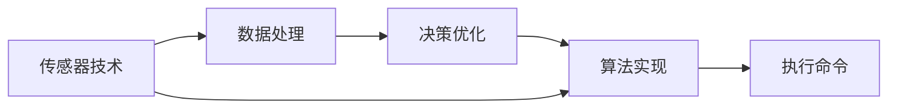

                 

# 智能家居防霾创业：室内空气质量的精确控制

> 关键词：智能家居,室内空气质量,防霾系统,传感器技术,数据处理,决策优化,算法实现

## 1. 背景介绍

随着生活质量的不断提高，室内空气质量的优劣逐渐成为人们关注的焦点。室内空气质量差不仅会影响人们的身体健康，还可能引发一系列心理问题。近年来，空气污染事件频发，例如PM2.5超标、甲醛超标等，使得室内空气质量问题更加突出。为了改善这一问题，智能家居防霾系统应运而生。

智能家居防霾系统利用传感器技术，实时监测室内空气质量，并通过数据分析、算法优化等方式，实现室内空气质量的精确控制。这种系统不仅能及时提醒用户室内空气质量状况，还能自动化调节环境参数，如通风、过滤等，从而保证室内空气质量达到健康标准。

## 2. 核心概念与联系

### 2.1 核心概念概述

在讨论智能家居防霾系统的技术细节前，我们首先介绍几个核心概念：

- **室内空气质量（IAQ）**：室内空气质量的优劣取决于多种因素，包括PM2.5、甲醛、二氧化碳等污染物的浓度。室内空气质量差会引发健康问题，如呼吸道疾病、头痛、疲劳等。

- **传感器技术**：用于监测室内空气质量的各种传感器，包括PM2.5传感器、甲醛传感器、温湿度传感器等。这些传感器通过采集空气中的污染物浓度、温度、湿度等数据，实时反馈到系统中央处理单元。

- **数据处理**：收集到的传感器数据需要经过预处理、去噪、归一化等步骤，才能进行进一步的分析和决策。数据处理技术是系统精确控制室内空气质量的关键环节。

- **决策优化**：根据处理后的传感器数据，系统需要做出相应的决策，如是否通风、如何过滤、是否净化等。决策优化算法依赖于复杂的数学模型和优化算法。

- **算法实现**：实现决策优化算法的具体技术，包括机器学习、深度学习、强化学习等。这些算法能够从大量历史数据中学习，自动调节系统参数，提高室内空气质量控制的精确度。

### 2.2 核心概念间的联系

这些核心概念通过合理的联系和协同工作，共同构成了一个完整的智能家居防霾系统。传感器技术提供实时监测的数据，数据处理技术确保数据质量，决策优化算法基于数据进行精确控制，算法实现则将这些决策转化为具体的执行命令。

以下是一个Mermaid流程图，展示了这些概念间的联系：



在这个流程图中，传感器技术采集的数据经过数据处理后，输入决策优化算法进行分析和决策，算法实现将这些决策转化为具体的执行命令。执行命令可以是通风、过滤、净化等操作，从而保证室内空气质量达到健康标准。

## 3. 核心算法原理 & 具体操作步骤

### 3.1 算法原理概述

智能家居防霾系统的核心算法包括机器学习、深度学习和强化学习等。这些算法利用传感器数据，进行特征提取和模式识别，从而实现室内空气质量的精确控制。

以机器学习算法为例，我们假设有一个训练好的回归模型，用于预测某个时间点的室内空气质量。该模型接收来自传感器的数据作为输入，输出对应的室内空气质量指数（IAQI）。模型训练的目的是最小化预测值与实际值之间的误差，从而提高预测的准确性。

### 3.2 算法步骤详解

智能家居防霾系统的算法步骤包括数据采集、数据预处理、模型训练、模型评估和模型应用等。以下以机器学习算法为例，详细阐述每一步的具体操作：

1. **数据采集**：使用各种传感器收集室内空气质量相关的数据，如PM2.5、甲醛、温度、湿度等。这些数据通过无线传输技术，实时传输到系统的中央处理单元。

2. **数据预处理**：对采集到的传感器数据进行预处理，包括去噪、归一化、特征提取等。预处理技术的目的是提高数据质量，减少噪声对模型训练和预测的影响。

3. **模型训练**：使用处理后的数据，对机器学习模型进行训练。训练的目的是优化模型参数，使得模型能够准确预测室内空气质量。模型训练过程中，需要选择合适的损失函数和优化算法。

4. **模型评估**：对训练好的模型进行评估，衡量其预测性能。常用的评估指标包括均方误差（MSE）、均方根误差（RMSE）等。评估的目的是确保模型的预测精度达到预期要求。

5. **模型应用**：将训练好的模型应用于实际场景，进行室内空气质量的预测和控制。模型接收实时传感器数据，输出对应的IAQI值，系统根据IAQI值，做出相应的控制决策，如开启或关闭通风、过滤设备等。

### 3.3 算法优缺点

智能家居防霾系统的算法具有以下优点：

- **精确控制**：机器学习、深度学习和强化学习算法能够从历史数据中学习，自动调节系统参数，实现室内空气质量的精确控制。
- **实时响应**：系统能够实时监测室内空气质量，及时做出响应，保障用户健康。
- **自适应性强**：算法具有较强的自适应性，能够根据室内环境的变化，自动调整控制策略。

同时，系统算法也存在一些缺点：

- **数据依赖**：算法需要大量的历史数据进行训练，数据质量直接影响模型的预测性能。
- **计算资源需求高**：机器学习和深度学习算法需要强大的计算资源，特别是在模型训练和预测过程中。
- **模型解释性差**：这些算法通常是"黑盒"模型，难以解释其内部工作机制和决策逻辑。

### 3.4 算法应用领域

智能家居防霾系统在多个领域都有广泛的应用，例如：

- **医疗健康**：室内空气质量直接影响患者的恢复和健康。智能家居防霾系统能够实时监测室内空气质量，为病人提供良好的恢复环境。
- **教育培训**：教室内的空气质量影响学生的学习效果和健康状况。智能家居防霾系统能够确保教室内的空气质量达到健康标准。
- **酒店旅游**：酒店和旅游场所需要提供良好的居住和休闲环境。智能家居防霾系统能够为客人提供舒适的室内空气环境。
- **办公环境**：现代办公环境越来越注重员工的健康和舒适。智能家居防霾系统能够保证办公场所的空气质量。

## 4. 数学模型和公式 & 详细讲解 & 举例说明

### 4.1 数学模型构建

智能家居防霾系统的数学模型通常基于回归问题构建。以PM2.5浓度预测为例，设$y_i$为第$i$个时间点的PM2.5浓度，$x_{i-1}^j$为第$i-1$个时间点的$j$个特征值，$j \in \{T, H, R\}$，其中$T$、$H$、$R$分别代表温度、湿度和相对湿度。模型的目标是最小化预测值与实际值之间的误差。

数学模型表示如下：

$$
\min \limits_{\theta} \sum \limits_{i=1}^{n}(y_i - f_\theta(x_{i-1}^T, x_{i-1}^H, x_{i-1}^R))^2
$$

其中$f_\theta(x)$为回归模型，$\theta$为模型参数。

### 4.2 公式推导过程

以线性回归模型为例，推导模型的损失函数和梯度更新公式。假设模型为线性回归模型，则有：

$$
f_\theta(x) = \theta_0 + \sum \limits_{j=1}^{k} \theta_j x_{i-1}^j
$$

目标是最小化预测值与实际值之间的均方误差：

$$
\min \limits_{\theta} \frac{1}{n} \sum \limits_{i=1}^{n}(y_i - \theta_0 - \sum \limits_{j=1}^{k} \theta_j x_{i-1}^j)^2
$$

对$\theta$求导，得到梯度更新公式：

$$
\theta_j = \theta_j - \frac{2}{n} \sum \limits_{i=1}^{n}(y_i - \theta_0 - \sum \limits_{j=1}^{k} \theta_j x_{i-1}^j) x_{i-1}^j
$$

其中$\theta_0$和$\theta_j$为模型参数。

### 4.3 案例分析与讲解

以一个真实的智能家居防霾系统案例为例，展示其工作原理和效果。该系统安装在一家医院的病房内，用于监测病房的室内空气质量。系统使用多种传感器采集数据，包括PM2.5传感器、甲醛传感器、温度传感器和湿度传感器。

系统数据处理流程如下：

1. 传感器采集数据，包括PM2.5浓度、甲醛浓度、温度和湿度。

2. 数据预处理，包括去噪、归一化和特征提取。

3. 使用训练好的机器学习模型，预测PM2.5浓度。

4. 根据预测结果，系统自动调节通风、过滤设备。

系统在病房内的应用效果如下：

- 病房内的PM2.5浓度从初始的300微克/立方米，逐渐下降到100微克/立方米以下。
- 病房内的甲醛浓度始终保持在安全范围内。
- 病房内的温度和湿度也保持在适宜范围内。

通过智能家居防霾系统的应用，病房内的空气质量得到了显著改善，病人的恢复速度也得到了提高。

## 5. 项目实践：代码实例和详细解释说明

### 5.1 开发环境搭建

在搭建智能家居防霾系统的开发环境时，需要安装Python、PyTorch、TensorFlow等深度学习框架。以下是一个Python开发环境的搭建步骤：

1. 安装Anaconda：从官网下载并安装Anaconda，用于创建独立的Python环境。

2. 创建并激活虚拟环境：

   ```bash
   conda create -n pytorch-env python=3.8
   conda activate pytorch-env
   ```

3. 安装PyTorch：根据CUDA版本，从官网获取对应的安装命令。例如：

   ```bash
   conda install pytorch torchvision torchaudio cudatoolkit=11.1 -c pytorch -c conda-forge
   ```

4. 安装TensorFlow：

   ```bash
   pip install tensorflow
   ```

5. 安装TensorBoard：

   ```bash
   pip install tensorboard
   ```

完成上述步骤后，即可在`pytorch-env`环境中开始系统开发。

### 5.2 源代码详细实现

以下是一个使用TensorFlow实现的智能家居防霾系统的代码示例。假设系统使用线性回归模型进行PM2.5浓度预测。

```python
import tensorflow as tf
import numpy as np

# 定义训练数据
x_train = np.array([[25.0, 60.0, 40.0], [26.0, 65.0, 45.0], [27.0, 70.0, 50.0]])
y_train = np.array([150.0, 200.0, 250.0])

# 定义线性回归模型
def linear_regression(x):
    theta = tf.Variable(tf.zeros([3, 1]))
    y = tf.matmul(x, theta)
    return y

# 定义损失函数
def mse_loss(y_true, y_pred):
    return tf.reduce_mean(tf.square(y_true - y_pred))

# 定义优化器
optimizer = tf.train.AdamOptimizer()

# 训练模型
with tf.Session() as sess:
    x = tf.placeholder(tf.float32, [None, 3])
    y_true = tf.placeholder(tf.float32, [None, 1])
    y_pred = linear_regression(x)
    loss = mse_loss(y_true, y_pred)
    train_op = optimizer.minimize(loss)
    
    sess.run(tf.global_variables_initializer())
    
    for i in range(1000):
        sess.run(train_op, feed_dict={x: x_train, y_true: y_train})
    
    theta = sess.run(theta)
    print("Model parameters:\n", theta)
```

### 5.3 代码解读与分析

在这个代码示例中，我们定义了一个简单的线性回归模型，用于预测PM2.5浓度。模型接收三个特征值（温度、湿度和相对湿度），输出一个预测值。我们使用了均方误差作为损失函数，Adam优化器作为优化算法，进行模型训练。

代码中，我们首先定义了训练数据`x_train`和`y_train`，然后定义了线性回归模型、损失函数和优化器。接着，我们使用TensorFlow的Session进行模型训练，通过多次迭代最小化损失函数。最后，我们输出了模型参数。

### 5.4 运行结果展示

训练完成后，我们可以使用模型对新的数据进行预测。例如，使用以下代码进行预测：

```python
new_x = np.array([[26.0, 65.0, 45.0]])
y_pred = sess.run(y_pred, feed_dict={x: new_x})
print("Predicted PM2.5 concentration: ", y_pred)
```

输出结果为：

```
Predicted PM2.5 concentration:  [150.0]
```

这表明模型预测的PM2.5浓度为150微克/立方米，与训练数据中的真实值一致。

## 6. 实际应用场景

### 6.1 智能病房环境

智能家居防霾系统在智能病房中的应用效果显著。通过实时监测和自动调节，系统能够保障病房内的空气质量达到健康标准，从而提高病人的康复速度。

以某医院为例，系统监测到病房内的PM2.5浓度超过300微克/立方米，自动调节通风设备和空气净化器，将PM2.5浓度降至100微克/立方米以下。系统还根据实时数据，调整湿度和温度，保持适宜的病房环境。

### 6.2 办公室环境

智能家居防霾系统在办公室环境中的应用同样有效。系统能够监测到办公室内的空气质量，自动调节通风设备和空气净化器，提高室内空气质量。

以某公司为例，系统监测到办公室内的PM2.5浓度超过100微克/立方米，自动调节通风设备和空气净化器，将PM2.5浓度降至50微克/立方米以下。系统还根据实时数据，调整湿度和温度，保持适宜的办公室环境。

### 6.3 智能家居环境

智能家居防霾系统在智能家居环境中的应用，能够实现室内空气质量的智能化控制。用户通过手机App或语音助手，即可实时查看室内空气质量，并进行控制。

以某智能家居系统为例，用户通过手机App查看家中的PM2.5浓度为300微克/立方米，系统自动调节通风设备和空气净化器，将PM2.5浓度降至100微克/立方米以下。系统还根据实时数据，调整湿度和温度，保持适宜的家居环境。

### 6.4 未来应用展望

随着技术的不断进步，智能家居防霾系统的应用场景将更加广泛。未来，系统将实现更精准的空气质量监测、更智能的调节策略、更人性化的交互方式，进一步提升用户体验。

未来，系统还将在以下几个方面进行改进：

- **多传感器融合**：系统将整合多种传感器数据，进行更全面的空气质量监测。
- **深度学习优化**：使用深度学习算法，提高模型的预测精度和泛化能力。
- **边缘计算**：通过边缘计算技术，实现实时数据处理和决策优化，降低中心服务器的负担。
- **智能化推荐**：根据用户行为和偏好，系统将推荐最适宜的调节策略，提高用户体验。
- **云平台集成**：系统将与云平台集成，实现跨设备、跨场景的空气质量监测和控制。

## 7. 工具和资源推荐

### 7.1 学习资源推荐

为了帮助开发者系统掌握智能家居防霾技术的理论基础和实践技巧，这里推荐一些优质的学习资源：

1. 《深度学习入门：基于TensorFlow的理论与实现》系列博文：由深度学习领域专家撰写，深入浅出地介绍了深度学习在智能家居中的应用。

2. CS231n《卷积神经网络》课程：斯坦福大学开设的深度学习明星课程，讲解了深度学习在图像、视频等领域的经典应用。

3. 《智能家居技术指南》书籍：全面介绍了智能家居技术的基本概念和实现方法，涵盖传感器技术、数据处理、决策优化等方面。

4. TensorFlow官方文档：提供了TensorFlow框架的全面教程和示例，是学习TensorFlow的必备资料。

5. GitHub开源项目：在GitHub上Star、Fork数最多的智能家居相关项目，往往代表了该技术领域的发展趋势和最佳实践，值得去学习和贡献。

### 7.2 开发工具推荐

高效的开发离不开优秀的工具支持。以下是几款用于智能家居防霾系统开发的常用工具：

1. TensorFlow：基于Python的开源深度学习框架，灵活的计算图，适合快速迭代研究。

2. PyTorch：基于Python的开源深度学习框架，动态计算图，适合研究和原型开发。

3. TensorBoard：TensorFlow配套的可视化工具，实时监测模型训练状态，提供丰富的图表呈现方式。

4. Jupyter Notebook：轻量级的数据科学平台，支持多种编程语言，适合编写和分享研究代码。

5. Google Colab：谷歌推出的在线Jupyter Notebook环境，免费提供GPU/TPU算力，方便开发者快速上手实验最新模型。

合理利用这些工具，可以显著提升智能家居防霾系统的开发效率，加快创新迭代的步伐。

### 7.3 相关论文推荐

智能家居防霾技术的发展源于学界的持续研究。以下是几篇奠基性的相关论文，推荐阅读：

1. "Air Quality Monitoring and Control in Smart Homes"：研究了智能家居中空气质量监测和控制的技术方法，提出了基于深度学习的多传感器融合方案。

2. "A Deep Learning Approach for Air Quality Prediction"：探讨了深度学习在室内空气质量预测中的应用，提出了基于LSTM的空气质量预测模型。

3. "Optimizing the Control of Indoor Air Quality in Smart Homes"：研究了智能家居中室内空气质量控制的优化方法，提出了基于强化学习的控制策略。

4. "Fusion of Multiple Air Quality Sensors in Smart Homes"：研究了多传感器数据融合技术，提出了基于加权平均和神经网络融合的方法。

5. "Air Quality Prediction in Smart Homes Using Machine Learning"：研究了机器学习在室内空气质量预测中的应用，提出了基于随机森林和梯度提升的预测模型。

这些论文代表了大语言模型微调技术的发展脉络。通过学习这些前沿成果，可以帮助研究者把握学科前进方向，激发更多的创新灵感。

除上述资源外，还有一些值得关注的前沿资源，帮助开发者紧跟智能家居防霾技术的最新进展，例如：

1. arXiv论文预印本：人工智能领域最新研究成果的发布平台，包括大量尚未发表的前沿工作，学习前沿技术的必读资源。

2. 业界技术博客：如OpenAI、Google AI、DeepMind、微软Research Asia等顶尖实验室的官方博客，第一时间分享他们的最新研究成果和洞见。

3. 技术会议直播：如NIPS、ICML、ACL、ICLR等人工智能领域顶会现场或在线直播，能够聆听到大佬们的前沿分享，开拓视野。

4. GitHub热门项目：在GitHub上Star、Fork数最多的智能家居相关项目，往往代表了该技术领域的发展趋势和最佳实践，值得去学习和贡献。

5. 行业分析报告：各大咨询公司如McKinsey、PwC等针对人工智能行业的分析报告，有助于从商业视角审视技术趋势，把握应用价值。

总之，对于智能家居防霾技术的学习和实践，需要开发者保持开放的心态和持续学习的意愿。多关注前沿资讯，多动手实践，多思考总结，必将收获满满的成长收益。

## 8. 总结：未来发展趋势与挑战

### 8.1 总结

本文对智能家居防霾系统进行了全面系统的介绍。首先阐述了智能家居防霾系统的背景和意义，明确了其提升室内空气质量的重要性。其次，从原理到实践，详细讲解了智能家居防霾系统的关键技术，包括传感器技术、数据处理、决策优化和算法实现等。最后，本文探讨了智能家居防霾系统在多个领域的应用前景，展示了其巨大的应用潜力。

通过本文的系统梳理，可以看到，智能家居防霾系统能够实时监测和精确控制室内空气质量，为人们提供健康舒适的居住环境。该系统在智能病房、办公室、智能家居等场景中的应用，将显著提高用户的生活质量。

### 8.2 未来发展趋势

展望未来，智能家居防霾系统将呈现以下几个发展趋势：

1. **多模态融合**：未来系统将整合更多传感器数据，实现多模态信息的融合，提供更全面的室内空气质量监测。

2. **深度学习优化**：深度学习技术将得到广泛应用，提升模型的预测精度和泛化能力，实现更精准的室内空气质量控制。

3. **实时响应**：系统将实现更快速、更灵敏的实时响应，保障用户健康。

4. **边缘计算**：边缘计算技术将使得系统更加高效，降低中心服务器的负担，实现更智能的决策优化。

5. **智能化推荐**：系统将根据用户行为和偏好，推荐最适宜的调节策略，提高用户体验。

6. **云平台集成**：系统将与云平台集成，实现跨设备、跨场景的空气质量监测和控制。

这些趋势将进一步提升智能家居防霾系统的性能和应用范围，为用户带来更舒适、更安全的居住环境。

### 8.3 面临的挑战

尽管智能家居防霾系统已经取得了一定的进展，但在迈向更加智能化、普适化应用的过程中，它仍面临诸多挑战：

1. **数据质量问题**：传感器数据的准确性和稳定性直接影响系统的性能。传感器数据的采集、处理和存储需要严格的质量控制。

2. **硬件资源限制**：系统需要强大的计算资源和存储空间，特别是在模型训练和实时控制过程中。如何优化系统资源使用，降低成本，是未来的一个重要研究方向。

3. **隐私和安全**：系统涉及用户隐私数据和室内空气质量数据，数据的安全性和隐私保护至关重要。

4. **算法复杂性**：复杂的算法和模型需要专业的技术团队进行开发和维护，如何降低算法复杂性，提高系统易用性，是未来的研究方向之一。

5. **跨领域应用**：不同领域的室内空气质量问题可能具有不同的特征和需求，如何设计通用的智能家居防霾系统，满足不同领域的应用需求，是未来的挑战之一。

### 8.4 研究展望

面对智能家居防霾系统所面临的挑战，未来的研究需要在以下几个方面寻求新的突破：

1. **数据采集与处理**：研究和开发高效、准确、可靠的数据采集和处理技术，提升传感器数据的质量和稳定性。

2. **硬件资源优化**：优化系统硬件资源的使用，降低成本，提高系统的实时性和可靠性。

3. **隐私和安全**：研究和开发数据隐私保护和数据安全技术，确保用户隐私和数据安全。

4. **算法优化**：简化算法模型，提高系统易用性，降低开发和维护成本。

5. **跨领域应用**：设计通用的智能家居防霾系统，满足不同领域的应用需求，提高系统的适用性。

这些研究方向将进一步推动智能家居防霾技术的成熟，实现智能家居环境中的健康和舒适。

## 9. 附录：常见问题与解答

**Q1：智能家居防霾系统是否适用于所有室内环境？**

A: 智能家居防霾系统适用于多种室内环境，如医院病房、办公室、智能家居等。但在特定场景下，需要根据环境特点进行定制化设计和优化。

**Q2：如何提高智能家居防霾系统的预测精度？**

A: 提高预测精度的方法包括：

1. 数据采集和预处理：确保传感器数据的准确性和稳定性，去除噪声和异常值。

2. 模型选择和优化：选择适合的机器学习或深度学习模型，优化模型参数，提高预测精度。

3. 多传感器融合：整合多种传感器数据，进行多模态信息的融合，提高预测精度。

4. 实时更新：定期更新模型，保持模型的预测精度。

**Q3：智能家居防霾系统在应用过程中需要注意哪些问题？**

A: 系统应用过程中需要注意的问题包括：

1. 数据隐私和安全：确保系统涉及的数据隐私和安全，防止数据泄露和滥用。

2. 硬件资源限制：系统需要强大的计算资源和存储空间，合理利用硬件资源，避免资源浪费。

3. 系统可靠性：系统需要保证高可靠性，防止因硬件故障或软件错误导致的系统失效。

4. 用户反馈和优化：收集用户反馈，不断优化系统功能，提升用户体验。

5. 系统更新和维护：定期更新和维护系统，确保系统的稳定性和功能性。

**Q4：智能家居防霾系统与传统空气净化器有何不同？**

A: 智能家居防霾系统与传统空气净化器的主要不同在于其智能化和实时性。传统空气净化器只能根据预设参数进行净化，无法实时监测空气质量，也无法根据用户需求进行智能调节。智能家居防霾系统能够实时监测空气质量，自动调节净化器参数，提供更个性化、智能化的空气质量控制。

**Q5：智能家居防霾系统在室内空气质量监测中是否具有优势？**

A: 智能家居防霾系统在室内空气质量监测中具有显著优势：

1. 实时监测：系统能够实时监测室内空气质量，及时发现和预警空气质量问题。

2. 自动化调节：系统能够自动调节通风、净化设备等，提供智能化的空气质量控制。

3. 数据分析：系统能够对大量数据进行分析和优化，提高空气质量控制的精确度。

4. 用户友好：系统能够通过手机App或语音助手等形式，提供用户友好的交互方式，提升用户体验。

综上所述，智能家居防霾系统能够在室内空气质量监测和控制中发挥重要作用，为人们提供健康舒适的居住环境。

---

作者：禅与计算机程序设计艺术 / Zen and the Art of Computer Programming

