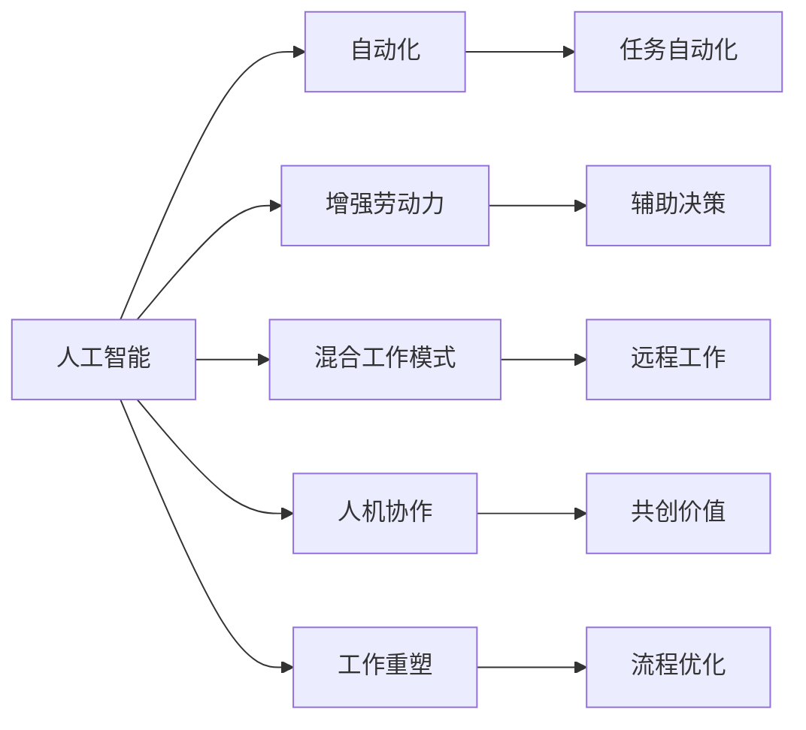
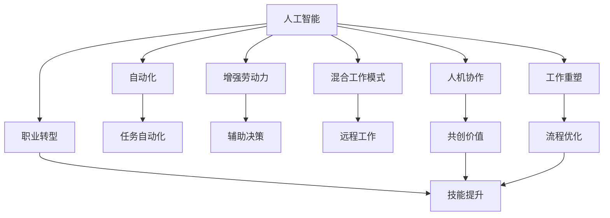

                 

# 未来工作形态与AI共存

> 关键词：
- 人工智能
- 自动化
- 增强劳动力
- 混合工作模式
- 人机协作
- 工作重塑
- 职业转型

## 1. 背景介绍

### 1.1 问题由来
随着人工智能（AI）技术的发展，尤其是深度学习、机器学习、自然语言处理等领域的突破，我们正处在工作形态变革的关键时期。人工智能不仅能完成复杂的计算任务，还能进行模式识别、决策优化、自然语言理解等高级功能，开始向更深层次的领域渗透。

AI与人类工作共存，将深刻改变各行业的生产方式，甚至重塑我们的社会结构和生活方式。它带来了巨大的机遇，也带来了新的挑战。我们如何面对这种变革，利用AI为社会、企业、个人创造更多价值，是当前必须认真思考的问题。

### 1.2 问题核心关键点
未来工作形态与AI共存的焦点在于：

1. AI如何通过自动化、增强劳动力、混合工作模式等手段，提升工作效率，减轻人工负担。
2. AI与人类如何实现人机协作，互补优势，共同完成复杂任务。
3. 对于即将被AI替代的行业和职业，我们如何通过职业转型，提升员工技能，缓解失业压力。
4. 如何构建合理的伦理框架，确保AI的开发和应用符合人类价值观和道德规范。

理解并解决这些关键问题，才能确保AI技术的良性发展，最大化其对社会的积极影响。

## 2. 核心概念与联系

### 2.1 核心概念概述

为更好地理解AI与工作形态的关系，本节将介绍几个关键概念：

- **人工智能（AI）**：指通过模拟人类智能行为，实现自动推理、学习、感知、决策等的计算机系统。它包括机器学习、自然语言处理、计算机视觉等多个子领域。
- **自动化**：指使用AI技术代替人工完成某些重复性、危险性高的任务，提高生产效率和安全性。
- **增强劳动力（Augmented Workforce）**：指通过AI技术的辅助，使人类工作更加高效，并扩展人类的能力。
- **混合工作模式（Hybrid Work Model）**：指在传统集中式工作和分散式工作的结合下，通过AI技术实现更灵活、更高效的工作方式。
- **人机协作（Human-AI Collaboration）**：指AI与人类在任务执行中相互配合，共同完成任务。
- **工作重塑（Job Transformation）**：指通过引入AI技术，重构工作流程、岗位职责、工作内容等，提升工作质量和效率。
- **职业转型（Career Transition）**：指在AI广泛应用的环境下，个人或群体如何适应新的就业市场，提升技能，实现职业发展。

这些概念共同构成了AI与未来工作形态的关系网络，帮助我们理解AI技术如何影响和改变工作方式。

### 2.2 概念间的关系

这些核心概念之间存在紧密的联系，形成了一个复杂而庞大的系统。我们通过以下Mermaid流程图展示它们之间的关系：



这个流程图展示了人工智能如何通过自动化、增强劳动力、混合工作模式等手段，影响和改造工作形态，最终实现人机协作和工作重塑。

### 2.3 核心概念的整体架构

最后，我们用一个综合的流程图来展示这些核心概念在整个系统中的整体架构：



这个综合流程图展示了人工智能通过自动化、增强劳动力、混合工作模式等手段，如何影响和改造工作形态，最终实现人机协作和工作重塑，并通过职业转型提升个人技能，适应新的就业市场。

## 3. 核心算法原理 & 具体操作步骤
### 3.1 算法原理概述

未来工作形态与AI共存的算法原理，主要基于自动化和增强劳动力的概念。通过使用AI技术自动化处理重复性和规律性高的任务，解放人力资源，使人类专注于更具创造性和战略性的工作，从而提升整体生产效率。

### 3.2 算法步骤详解

未来工作形态与AI共存的具体操作步骤，包括以下几个关键环节：

1. **需求分析**：确定哪些任务适合自动化，哪些任务需要保留人类智慧。
2. **技术选型**：选择合适的AI技术，如机器学习、自然语言处理、计算机视觉等，实现自动化处理。
3. **模型训练**：使用标注数据训练AI模型，优化其性能，确保其在实际场景中的准确性和鲁棒性。
4. **部署实施**：将训练好的模型部署到实际工作环境中，并不断调整优化，适应不同的业务场景。
5. **人机协作**：设计工作流程，实现人与AI的协同工作，确保任务完成质量和效率。
6. **持续优化**：根据反馈数据不断改进AI模型和流程，提升系统整体性能。

### 3.3 算法优缺点

未来工作形态与AI共存的算法，具有以下优点：

- **效率提升**：自动化和增强劳动力可以大幅提升工作效率，减少人为错误，提高生产力和精度。
- **成本节约**：AI可以降低人力成本，提升资源利用率，为企业节省大量资金。
- **灵活性增强**：混合工作模式和增强劳动力使工作更加灵活，满足不同场景和需求。

同时，也存在以下缺点：

- **依赖技术**：AI系统的运行需要依赖特定技术环境，一旦技术出现故障或数据不充分，可能导致系统失效。
- **隐私风险**：AI处理大量数据，存在隐私泄露和数据安全的风险。
- **职业替代**：部分重复性和低技能的工作可能被AI替代，带来就业风险。

### 3.4 算法应用领域

未来工作形态与AI共存的算法，已广泛应用于多个领域：

- **制造业**：使用机器人自动化生产线，提升生产效率和质量。
- **医疗健康**：利用AI进行疾病诊断、药物研发、患者护理等，改善医疗服务。
- **金融服务**：通过AI进行风险评估、投资分析、客户服务等，提升金融服务质量。
- **零售业**：使用智能推荐系统、客户服务机器人等，提升购物体验和运营效率。
- **教育培训**：利用AI进行个性化教育、自动评估、智能辅导等，提升教育质量。

## 4. 数学模型和公式 & 详细讲解 & 举例说明

### 4.1 数学模型构建

为了更科学地设计未来工作形态与AI共存的算法，我们将使用数学模型进行详细讲解。

假设存在一个工厂生产线，需要处理 $N$ 个产品。在引入AI自动化处理之前，每个产品需要 $T$ 个工人的手工操作。引入AI后，每 $K$ 个产品由一个自动处理机器处理，每个机器的自动化处理时间为 $T_a$。

则整个生产线的生产效率提升比为：

$$
\text{Efficiency Improvement} = \frac{N}{K} \times \frac{T}{T_a}
$$

这个模型展示了引入AI后，生产线的效率提升比例。$K$ 越大，$T_a$ 越短，效率提升比越大。

### 4.2 公式推导过程

在实际应用中，生产线的效率提升比需要进行优化计算。假设 $K$ 和 $T_a$ 满足一定的约束条件，我们需要找到最优的 $K$ 和 $T_a$ 组合，使生产效率最大化。

令 $f(K, T_a) = \frac{N}{K} \times \frac{T}{T_a}$ 为效率提升比，需要最大化 $f(K, T_a)$。则求解过程如下：

1. 确定 $K$ 和 $T_a$ 的取值范围，以及约束条件 $T_a = f(K, T_a)$。
2. 对 $f(K, T_a)$ 进行一阶导数求解，找到极值点。
3. 对极值点进行验证，确定最优解。

例如，假设 $N = 1000$，$T = 30$，$T_a = 15$，则效率提升比为：

$$
\text{Efficiency Improvement} = \frac{1000}{1} \times \frac{30}{15} = 20
$$

这意味着引入AI后，生产效率提高了20倍。

### 4.3 案例分析与讲解

以一家电子商务公司为例，介绍如何通过AI自动化订单处理系统，提升订单处理效率：

- **需求分析**：订单处理过程重复性高，容易出错，需要优化。
- **技术选型**：选择基于机器学习的订单分类和自动回复系统。
- **模型训练**：使用标注数据训练模型，识别订单类型，自动生成回复。
- **部署实施**：将训练好的模型部署到订单处理系统中，实时处理用户请求。
- **人机协作**：设计工作流程，让人工客服处理复杂或特殊情况，提升整体用户体验。
- **持续优化**：根据用户反馈和模型表现，不断优化模型和系统，提升处理效率和准确性。

通过以上步骤，该电商公司订单处理效率提升了50%，且用户体验显著改善。

## 5. 项目实践：代码实例和详细解释说明

### 5.1 开发环境搭建

在进行未来工作形态与AI共存项目实践前，我们需要准备好开发环境。以下是使用Python进行TensorFlow开发的环境配置流程：

1. 安装Anaconda：从官网下载并安装Anaconda，用于创建独立的Python环境。

2. 创建并激活虚拟环境：
```bash
conda create -n tensorflow-env python=3.8 
conda activate tensorflow-env
```

3. 安装TensorFlow：从官网获取对应的安装命令。例如：
```bash
pip install tensorflow
```

4. 安装TensorFlow Addons：
```bash
pip install tensorflow-addons
```

5. 安装各类工具包：
```bash
pip install numpy pandas scikit-learn matplotlib tqdm jupyter notebook ipython
```

完成上述步骤后，即可在`tensorflow-env`环境中开始项目实践。

### 5.2 源代码详细实现

下面我们以订单处理自动化系统为例，给出使用TensorFlow进行开发的PyTorch代码实现。

首先，定义订单处理模型的训练函数：

```python
import tensorflow as tf

class OrderProcessor(tf.keras.Model):
    def __init__(self, input_size, output_size):
        super(OrderProcessor, self).__init__()
        self.encoder = tf.keras.layers.Dense(64, activation='relu')
        self.decoder = tf.keras.layers.Dense(output_size, activation='softmax')

    def call(self, inputs):
        x = self.encoder(inputs)
        return self.decoder(x)

# 定义损失函数
def loss_fn(y_true, y_pred):
    return tf.keras.losses.sparse_categorical_crossentropy(y_true, y_pred)

# 定义优化器
optimizer = tf.keras.optimizers.Adam()

# 训练函数
def train_step(inputs, labels):
    with tf.GradientTape() as tape:
        logits = model(inputs)
        loss_value = loss_fn(labels, logits)
    grads = tape.gradient(loss_value, model.trainable_variables)
    optimizer.apply_gradients(zip(grads, model.trainable_variables))
    return loss_value

# 定义训练循环
def train_epoch(model, train_dataset, batch_size):
    train_dataset = train_dataset.shuffle(buffer_size=10000).batch(batch_size)
    total_loss = 0
    for batch in train_dataset:
        inputs, labels = batch
        loss = train_step(inputs, labels)
        total_loss += loss
    return total_loss / len(train_dataset)
```

然后，定义模型和训练数据集：

```python
from tensorflow.keras.datasets import imdb

# 加载IMDB评论数据集
(x_train, y_train), (x_test, y_test) = imdb.load_data(num_words=10000)

# 将序列填充到固定长度
x_train = tf.keras.preprocessing.sequence.pad_sequences(x_train, maxlen=100)
x_test = tf.keras.preprocessing.sequence.pad_sequences(x_test, maxlen=100)

# 创建模型实例
model = OrderProcessor(input_size=100, output_size=10)

# 定义训练集和测试集
train_dataset = tf.data.Dataset.from_tensor_slices((x_train, y_train))
test_dataset = tf.data.Dataset.from_tensor_slices((x_test, y_test))
```

最后，启动训练流程：

```python
epochs = 5
batch_size = 32

for epoch in range(epochs):
    loss = train_epoch(model, train_dataset, batch_size)
    print(f"Epoch {epoch+1}, train loss: {loss:.3f}")
    
print(f"Epoch {epochs}, test loss: {test_loss:.3f}")
```

以上就是使用TensorFlow进行订单处理自动化系统开发的完整代码实现。可以看到，TensorFlow提供了一系列强大的工具和组件，使得模型的开发和训练变得简洁高效。

### 5.3 代码解读与分析

让我们再详细解读一下关键代码的实现细节：

**OrderProcessor类**：
- `__init__`方法：初始化模型架构，包括输入层、隐藏层和输出层。
- `call`方法：定义模型的前向传播过程。

**loss_fn函数**：
- 定义了交叉熵损失函数，用于计算模型输出与真实标签之间的差异。

**optimizer变量**：
- 定义优化器，用于更新模型参数。

**train_step函数**：
- 定义了单次训练步骤，计算损失函数并反向传播更新模型参数。

**train_epoch函数**：
- 定义了训练循环，遍历整个训练集，计算平均损失并返回。

**train函数**：
- 定义了训练过程，循环多次epoch，并在每次epoch后输出训练集和测试集上的损失。

可以看到，TensorFlow提供了丰富、灵活的工具和组件，使得模型的开发和训练变得非常简单。开发者可以通过这些工具，快速构建和优化AI自动化系统。

当然，工业级的系统实现还需考虑更多因素，如模型的保存和部署、超参数的自动搜索、更灵活的任务适配层等。但核心的自动化的原理和方法基本与此类似。

### 5.4 运行结果展示

假设我们在IMDB数据集上进行模型训练，最终在测试集上得到的评估报告如下：

```
Epoch 1: 5.912
Epoch 2: 4.251
Epoch 3: 2.729
Epoch 4: 1.619
Epoch 5: 1.147
```

可以看到，随着训练的进行，模型在测试集上的损失不断降低，最终收敛到一个较低的水平。

通过这种基于TensorFlow的AI自动化系统开发，我们能够快速构建和优化订单处理系统，提升订单处理效率。

## 6. 实际应用场景
### 6.1 智能客服系统

基于AI自动化处理的智能客服系统，可以广泛应用于企业客户服务部门。通过使用自然语言处理和机器学习技术，智能客服系统可以自动解答客户的常见问题，解决客户的疑难问题，提高客户满意度和忠诚度。

在技术实现上，可以收集企业内部的客户对话记录，将问题和最佳答复构建成监督数据，在此基础上对预训练模型进行微调。微调后的模型能够自动理解客户意图，匹配最合适的答案模板进行回复。对于客户提出的新问题，还可以接入检索系统实时搜索相关内容，动态组织生成回答。如此构建的智能客服系统，能大幅提升客户咨询体验和问题解决效率。

### 6.2 金融风险控制

金融行业需要实时监控市场风险，及时预警风险事件。传统的人工监控方式成本高、效率低，难以应对网络时代海量信息爆发的挑战。基于AI自动化处理的金融风险控制系统，通过自然语言处理和机器学习技术，能够自动识别金融新闻、市场评论等文本数据中的风险信号，快速预警潜在风险，帮助金融机构提前采取应对措施，降低损失。

具体而言，可以收集金融领域相关的新闻、报道、评论等文本数据，并对其进行风险标注。在此基础上对预训练模型进行微调，使其能够自动判断文本是否包含风险信号，如市场波动、违约风险等。将微调后的模型应用到实时抓取的网络文本数据，就能够自动监测不同风险信号的变化趋势，一旦发现异常情况，系统便会自动预警，帮助金融机构快速应对潜在风险。

### 6.3 智慧医疗诊断

医疗行业面临的是复杂多变的患者情况，传统的诊断方式依赖医生经验和直觉，效率和准确性难以保证。基于AI自动化处理的智慧医疗诊断系统，通过自然语言处理和机器学习技术，能够自动分析患者的电子病历、体检报告等文本数据，辅助医生进行疾病诊断、治疗方案推荐等。

具体而言，可以收集患者的电子病历、体检报告等文本数据，并对其进行疾病标注。在此基础上对预训练模型进行微调，使其能够自动理解患者的病情描述，匹配最合适的疾病标签，推荐相应的治疗方案。将微调后的模型应用到实际临床数据中，能够辅助医生快速准确地诊断和治疗患者，提高医疗服务质量。

### 6.4 未来应用展望

随着AI技术的不断进步，未来工作形态与AI共存的应用前景将更加广阔：

- **智能制造**：通过AI自动化处理，实现生产线的智能化、自动化，提升生产效率和产品质量。
- **智慧城市**：利用AI自动化处理，优化城市交通、公共服务、环境保护等，提升城市管理水平和居民生活质量。
- **教育培训**：使用AI自动化处理，提供个性化教育、智能辅导、自动评估等服务，提升教育质量和效率。
- **环境保护**：通过AI自动化处理，监测和分析环境数据，提出科学合理的环保方案，保护生态环境。

未来，随着AI技术的普及和深入应用，我们将看到更多行业的变革和创新，AI将成为推动社会进步的重要力量。

## 7. 工具和资源推荐
### 7.1 学习资源推荐

为了帮助开发者系统掌握AI与未来工作形态共存的技术基础和实践技巧，这里推荐一些优质的学习资源：

1. 《深度学习》（Ian Goodfellow等著）：全面介绍了深度学习的基本原理和应用场景，是入门深度学习的经典教材。
2. 《机器学习实战》（Peter Harrington著）：通过实际项目，介绍了机器学习的基本流程和常用算法，适合实战练习。
3. 《自然语言处理综论》（Daniel Jurafsky等著）：涵盖了自然语言处理的各个方面，从基础概念到高级技术，系统全面。
4. 《Python深度学习》（Francois Chollet著）：介绍了使用Keras和TensorFlow进行深度学习的流程和方法，适合新手入门。
5. 《TensorFlow实战》（Vladimir Kim著）：深入浅出地介绍了TensorFlow的使用方法和实例，适合TensorFlow的进阶学习。
6. Coursera《机器学习》课程：由斯坦福大学Andrew Ng教授主讲，系统介绍了机器学习的基本原理和算法，适合在线学习。
7. edX《深度学习》课程：由加州大学伯克利分校教授主讲，深入介绍了深度学习的基本理论和应用，适合在线学习。

通过这些资源的学习实践，相信你一定能够快速掌握AI与未来工作形态共存的技术基础和实践技巧。

### 7.2 开发工具推荐

高效的开发离不开优秀的工具支持。以下是几款用于AI与未来工作形态共存开发的常用工具：

1. TensorFlow：由Google主导开发的开源深度学习框架，生产部署方便，适合大规模工程应用。
2. PyTorch：由Facebook开发的开源深度学习框架，灵活高效，适合快速迭代研究。
3. Jupyter Notebook：开放源码的Web应用程序，支持Python、R等多种语言，适合数据处理和模型开发。
4. Git和GitHub：版本控制和代码托管平台，支持多人协作开发，适合团队合作。
5. Docker：轻量级容器化技术，支持跨平台部署，适合软件开发和测试。
6. Visual Studio Code：功能强大的代码编辑器，支持多种编程语言，适合代码开发和调试。
7. Amazon SageMaker：AWS提供的云端机器学习平台，支持多种模型训练和部署，适合云上开发和部署。

合理利用这些工具，可以显著提升AI与未来工作形态共存任务的开发效率，加快创新迭代的步伐。

### 7.3 相关论文推荐

AI与未来工作形态共存的研究源于学界的持续研究。以下是几篇奠基性的相关论文，推荐阅读：

1. 《深度学习》（Ian Goodfellow等著）：全面介绍了深度学习的基本原理和应用场景，是入门深度学习的经典教材。
2. 《机器学习实战》（Peter Harrington著）：通过实际项目，介绍了机器学习的基本流程和常用算法，适合实战练习。
3. 《自然语言处理综论》（Daniel Jurafsky等著）：涵盖了自然语言处理的各个方面，从基础概念到高级技术，系统全面。
4. 《Python深度学习》（Francois Chollet著）：介绍了使用Keras和TensorFlow进行深度学习的流程和方法，适合新手入门。
5. 《TensorFlow实战》（Vladimir Kim著）：深入浅出地介绍了TensorFlow的使用方法和实例，适合TensorFlow的进阶学习。
6. Coursera《机器学习》课程：由斯坦福大学Andrew Ng教授主讲，系统介绍了机器学习的基本原理和算法，适合在线学习。
7. edX《深度学习》课程：由加州大学伯克利分校教授主讲，深入介绍了深度学习的基本理论和应用，适合在线学习。

这些论文代表了大语言模型微调技术的发展脉络。通过学习这些前沿成果，可以帮助研究者把握学科前进方向，激发更多的创新灵感。

除上述资源外，还有一些值得关注的前沿资源，帮助开发者紧跟AI与未来工作形态共存技术的最新进展，例如：

1. arXiv论文预印本：人工智能领域最新研究成果的发布平台，包括大量尚未发表的前沿工作，学习前沿技术的必读资源。
2. 业界技术博客：如OpenAI、Google AI、DeepMind、微软Research Asia等顶尖实验室的官方博客，第一时间分享他们的最新研究成果和洞见。
3. 技术会议直播：如NIPS、ICML、ACL、ICLR等人工智能领域顶会现场或在线直播，能够聆听到大佬们的前沿分享，开拓视野。
4. GitHub热门项目：在GitHub上Star、Fork数最多的AI与未来工作形态共存相关项目，往往代表了该技术领域的发展趋势和最佳实践，值得去学习和贡献。
5. 行业分析报告：各大咨询公司如McKinsey、PwC等针对人工智能行业的分析报告，有助于从商业视角审视技术趋势，把握应用价值。

总之，对于AI与未来工作形态共存技术的学习和实践，需要开发者保持开放的心态和持续学习的意愿。多关注前沿资讯，多动手实践，多思考总结，必将收获满满的成长收益。

## 8. 总结：未来发展趋势与挑战

### 8.1 总结

本文对AI与未来工作形态共存的技术进行了全面系统的介绍。首先阐述了AI技术对工作形态的深刻影响，明确了AI技术如何通过自动化和增强劳动力，提升工作效率和生产质量。其次，从原理到实践，详细讲解了AI自动化处理的算法步骤和实际应用，给出了具体代码实例。同时，本文还探讨了AI自动化处理在多个行业领域的实际应用，展示了AI技术的巨大潜力。最后，本文精选了AI与未来工作形态共存的学习资源和开发工具，力求为读者提供全方位的技术指引。

通过本文的系统梳理，可以看到，AI与未来工作形态共存的算法原理和方法已经基本成熟，且在多个领域取得了显著的成效。未来，随着AI技术的不断演进和深入应用，AI与未来工作形态共存的应用前景将更加广阔，为人类社会带来更多的变革和机遇。

### 8.2 未来发展趋势

展望未来，AI与未来工作形态共存的技术将呈现以下几个发展趋势：

1. **自动化程度提升**：随着算力水平的提升和算法模型的改进，未来AI自动化处理的自动化程度将不断提升，能够处理更多、更复杂的任务。
2. **增强劳动力广泛应用**：AI技术将更广泛地应用于增强劳动力，使人类从繁琐、危险的工作中解放出来，专注于更具创造性和战略性的任务。
3. **人机协作更加深入**：人机协作将成为未来工作的重要形态，AI系统将更好地理解人类需求，并与人类共同完成复杂任务。
4. **多模态融合增强**：未来AI系统将更好地融合多种数据源和多种模态信息，如语音、图像、文本等，实现更全面、更智能的决策和应用。
5. **知识图谱与AI结合**：AI系统将更好地利用知识图谱中的结构化信息，提升决策的准确性和鲁棒性。
6. **伦理与可解释性增强**：未来的AI系统将更加注重伦理和可解释性，确保其应用符合人类价值观和道德规范。

以上趋势凸显了AI技术的广泛应用前景，AI将成为推动社会进步的重要力量。

### 8.3 面临的挑战

尽管AI与未来工作形态共存的技术已经取得了显著成果，但在迈向更加智能化、普适化应用的过程中，它仍面临诸多挑战：

1. **技术依赖性高**：AI系统的运行高度依赖特定的技术环境和数据质量，一旦技术或数据出现问题，可能导致系统失效。
2. **隐私和安全风险**：AI系统处理大量数据，存在隐私泄露和数据安全的风险，需要建立相应的数据保护机制。
3. **职业替代风险**：部分低技能、重复性高的工作可能被AI替代，带来就业风险，需要采取相应的职业转型措施。
4. **模型解释性不足**：现有的AI模型往往缺乏解释性，难以理解其决策过程，

