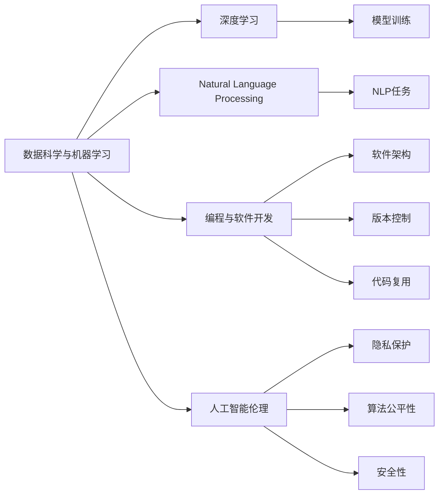
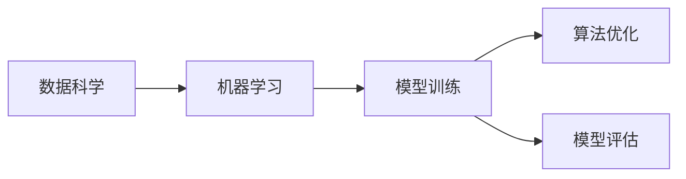
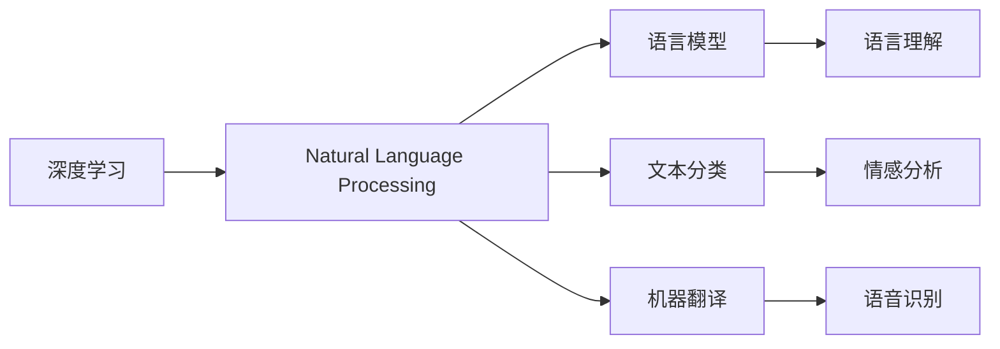
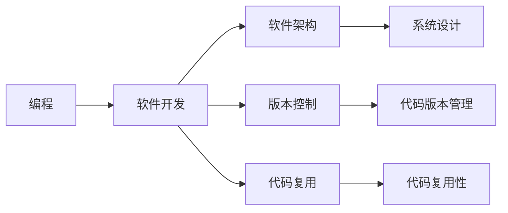
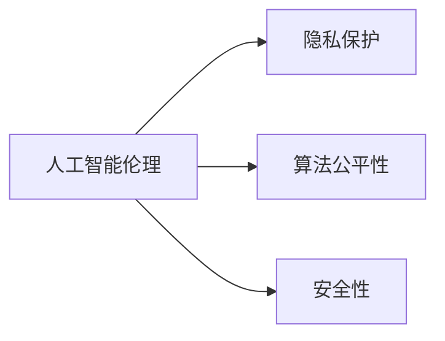
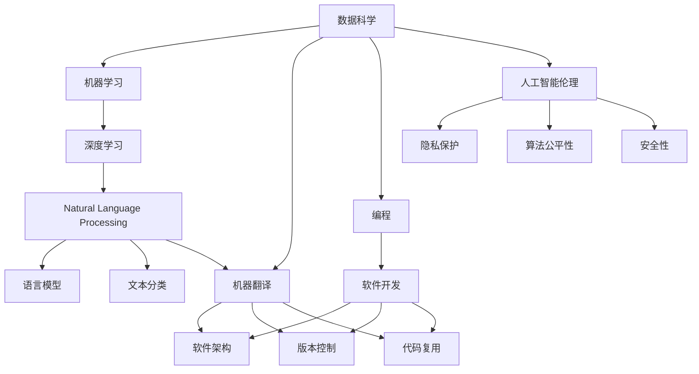

                 

# 未来工作：技能需求与培养

> 关键词：未来工作、技能需求、技能培养、人工智能、数据科学、深度学习、机器学习、自然语言处理、编程技能、软件开发、人工智能伦理

## 1. 背景介绍

随着科技的迅猛发展，特别是人工智能(AI)的普及，未来的工作岗位和技能需求正在发生深刻变化。AI不仅在科技领域产生深远影响，也在各行各业不断渗透。从医疗到教育，从金融到制造，AI技术正在改变人们的生活和工作方式。

### 1.1 问题由来

AI技术的迅猛发展给未来的工作市场带来了巨大的变化。一方面，AI替代了许多传统重复性工作，降低了人力成本，提高了生产效率。另一方面，AI技术本身也需要大量的专业人才进行开发、维护和优化，从而创造了新的就业机会。

在这样的背景下，如何培养符合未来工作需求的人才，成为了一个亟待解决的问题。本文将从技能需求、培养方法及实际应用三个方面进行深入探讨。

### 1.2 问题核心关键点

未来的工作技能需求主要包括以下几个方面：

1. **数据科学与机器学习**：数据是AI技术的基础，数据分析和机器学习技能将越来越重要。
2. **深度学习与自然语言处理**：深度学习技术已经成为AI的核心技术，而自然语言处理则是AI应用的重要方向。
3. **编程与软件开发**：AI技术的开发需要强大的编程能力，特别是在软件架构、版本控制、代码复用等方面。
4. **人工智能伦理**：随着AI技术的应用范围不断扩大，如何处理AI伦理问题，如隐私保护、算法公平性等，将成为未来工作的关键需求。

## 2. 核心概念与联系

### 2.1 核心概念概述

为更好地理解未来工作所需的技能需求和培养方法，本节将介绍几个核心概念及其相互关系。

- **数据科学与机器学习**：数据科学是指利用数据和技术解决问题，而机器学习则是其中的核心技术，通过算法从数据中提取规律。
- **深度学习与自然语言处理**：深度学习是机器学习的一种，通过多层次的神经网络模型，可以从大量数据中学习复杂的特征表示。自然语言处理(NLP)则是指让计算机理解、处理和生成自然语言的技术。
- **编程与软件开发**：编程是实现算法和模型的关键技能，而软件开发则是构建可靠、可扩展、可维护系统的必备技能。
- **人工智能伦理**：人工智能伦理涉及AI技术在社会中的应用，如隐私保护、算法公平性、安全性等。

这些核心概念之间的逻辑关系可以通过以下Mermaid流程图来展示：



这个流程图展示了未来工作所需技能的各个方面及其相互关系：

1. 数据科学与机器学习是基础，深度学习是其核心技术。
2. 自然语言处理是AI技术的重要方向。
3. 编程与软件开发是实现AI算法的关键技能。
4. 人工智能伦理是AI技术应用的重要考量。

这些核心概念共同构成了未来工作的技能需求框架，为人才培养提供了明确的方向。

### 2.2 概念间的关系

这些核心概念之间存在着紧密的联系，形成了一个完整的技能需求体系。下面通过几个Mermaid流程图来展示这些概念之间的关系。

#### 2.2.1 数据科学与机器学习的关系



这个流程图展示了数据科学与机器学习的相互关系：数据科学通过收集、处理数据，为机器学习提供数据基础；机器学习通过算法优化和模型训练，从数据中提取规律。

#### 2.2.2 深度学习与自然语言处理的关系



这个流程图展示了深度学习与自然语言处理的相互关系：深度学习通过构建复杂的网络结构，实现自然语言处理的各项任务，如语言模型、文本分类、机器翻译等。

#### 2.2.3 编程与软件开发的关系



这个流程图展示了编程与软件开发的相互关系：编程是软件开发的基础，而软件开发则包括软件架构设计、版本控制、代码复用等具体技能。

#### 2.2.4 人工智能伦理的关系



这个流程图展示了人工智能伦理的各个方面：隐私保护、算法公平性和安全性是人工智能伦理的重要组成部分，涉及AI技术在实际应用中的道德和法律问题。

### 2.3 核心概念的整体架构

最后，我们用一个综合的流程图来展示这些核心概念在实际应用中的整体架构：



这个综合流程图展示了从数据科学到人工智能伦理的整体技能需求体系，为未来工作的技能培养提供了全面的指导。

## 3. 核心算法原理 & 具体操作步骤
### 3.1 算法原理概述

未来工作的技能需求涉及多个领域的核心算法，包括数据科学、机器学习、深度学习、自然语言处理、编程与软件开发、人工智能伦理等。这些算法的原理和操作方法各不相同，但都遵循以下几个基本步骤：

1. **数据预处理**：包括数据清洗、特征提取、数据标准化等，是数据科学和机器学习的基础。
2. **模型训练与评估**：通过算法和模型从数据中学习规律，并进行性能评估。
3. **深度学习与神经网络**：利用深度学习构建复杂的神经网络结构，实现对数据的高效处理。
4. **自然语言处理**：通过NLP技术，让计算机理解和处理自然语言。
5. **编程与软件开发**：通过编程技能，实现算法和模型的开发，构建软件系统。
6. **人工智能伦理**：通过伦理和法律框架，规范AI技术的应用，确保其公平性、安全性和隐私保护。

### 3.2 算法步骤详解

**Step 1: 数据预处理**
数据预处理是所有算法的第一步，其目的是将原始数据转换为算法可以处理的格式。具体步骤包括：
- 数据清洗：去除噪声、缺失值等。
- 特征提取：从数据中提取有意义的特征。
- 数据标准化：将数据转换为标准格式，以便于算法处理。

**Step 2: 模型训练与评估**
模型训练是算法的核心步骤，其目的是通过数据训练模型，使其能够预测新数据的输出。具体步骤包括：
- 数据划分：将数据划分为训练集、验证集和测试集。
- 模型选择：选择适合的算法和模型。
- 模型训练：通过数据训练模型，优化模型参数。
- 模型评估：通过测试集评估模型性能，调整模型参数。

**Step 3: 深度学习与神经网络**
深度学习是通过构建多层神经网络模型，从数据中学习特征表示。具体步骤包括：
- 设计神经网络结构：选择网络层数、激活函数等。
- 初始化权重：对神经网络进行初始化，使其能够处理数据。
- 前向传播：将输入数据传递通过网络，计算输出。
- 反向传播：通过输出误差反向调整权重，优化模型。

**Step 4: 自然语言处理**
自然语言处理是让计算机理解和处理自然语言的技术。具体步骤包括：
- 分词：将文本分割成单词或词组。
- 词向量化：将单词转换为向量表示。
- 语言模型：通过语言模型计算单词概率。
- 文本分类：将文本分类到预定义的类别中。

**Step 5: 编程与软件开发**
编程与软件开发是将算法和模型应用于实际系统中的关键步骤。具体步骤包括：
- 设计软件架构：选择适合的编程语言和技术栈。
- 版本控制：使用版本控制系统管理代码变更。
- 代码复用：通过代码复用提高开发效率。
- 软件部署：将软件系统部署到生产环境。

**Step 6: 人工智能伦理**
人工智能伦理是规范AI技术应用的重要方面。具体步骤包括：
- 隐私保护：保护用户数据隐私，防止数据泄露。
- 算法公平性：确保算法公平性，防止算法偏见。
- 安全性：确保AI系统的安全性，防止攻击和滥用。

### 3.3 算法优缺点

未来工作的技能需求涉及多个领域的核心算法，这些算法具有以下优缺点：

**优点：**
- **数据科学**：能够从数据中提取有价值的规律，为其他领域提供基础。
- **机器学习**：具有强大的预测能力，能够处理复杂的数据关系。
- **深度学习**：能够学习高层次的特征表示，适用于大规模数据集。
- **自然语言处理**：能够实现人机交互，提高人机交互的智能化水平。
- **编程与软件开发**：能够实现算法的具体应用，构建高效的软件系统。
- **人工智能伦理**：能够规范AI技术的应用，确保其公平性和安全性。

**缺点：**
- **数据科学**：对数据质量要求高，数据清洗和特征提取难度大。
- **机器学习**：需要大量的标注数据，难以处理小样本数据。
- **深度学习**：模型复杂度高，训练时间长，计算资源需求大。
- **自然语言处理**：处理自然语言复杂，依赖高质量的语料库。
- **编程与软件开发**：需要较强的编程能力和技术栈选择。
- **人工智能伦理**：处理复杂，涉及法律和道德问题。

### 3.4 算法应用领域

未来工作的技能需求涉及多个领域，包括但不限于：

- **数据科学与机器学习**：在金融、医疗、教育、交通等领域广泛应用。
- **深度学习与自然语言处理**：在语音识别、图像处理、自然语言理解等领域应用。
- **编程与软件开发**：在软件开发、游戏开发、应用开发等领域应用。
- **人工智能伦理**：在AI技术应用、隐私保护、算法公平性等领域应用。

## 4. 数学模型和公式 & 详细讲解 & 举例说明

### 4.1 数学模型构建

未来工作的技能需求涉及多个领域的数学模型，包括数据科学、机器学习、深度学习、自然语言处理、编程与软件开发、人工智能伦理等。这些模型通过数学公式进行描述，具有以下特点：

- **数据科学**：使用统计学方法进行数据建模，如回归分析、聚类分析等。
- **机器学习**：使用优化算法进行模型训练，如梯度下降算法、随机森林算法等。
- **深度学习**：使用神经网络模型进行特征学习，如卷积神经网络、循环神经网络等。
- **自然语言处理**：使用语言模型进行文本处理，如词向量模型、神经语言模型等。
- **编程与软件开发**：使用算法和数据结构进行问题求解，如搜索算法、排序算法等。
- **人工智能伦理**：使用法律和道德框架进行规范，如隐私保护法律、算法公平性标准等。

### 4.2 公式推导过程

以深度学习中的卷积神经网络为例，其基本公式如下：

$$
h^{[l]} = g(\mathbf{W}^{[l]} \mathbf{h}^{[l-1]} + \mathbf{b}^{[l]})
$$

其中，$h^{[l]}$ 表示第$l$层的输出，$g$ 表示激活函数，$\mathbf{W}^{[l]}$ 表示第$l$层的权重矩阵，$\mathbf{b}^{[l]}$ 表示第$l$层的偏置向量，$\mathbf{h}^{[l-1]}$ 表示第$l-1$层的输出。

卷积神经网络通过卷积层、池化层等组成的网络结构，从输入数据中提取特征，最终输出预测结果。具体推导过程如下：

1. **卷积层**：通过卷积操作提取局部特征，公式如下：

$$
\mathbf{z}^{[l]} = \mathbf{W}^{[l]}\mathbf{x}^{[l-1]} + \mathbf{b}^{[l]}
$$

其中，$\mathbf{x}^{[l-1]}$ 表示第$l-1$层的输入，$\mathbf{z}^{[l]}$ 表示卷积层的输出。

2. **激活层**：通过激活函数将卷积层的输出映射到非线性空间，公式如下：

$$
\mathbf{h}^{[l]} = g(\mathbf{z}^{[l]})
$$

其中，$g$ 表示激活函数，$\mathbf{z}^{[l]}$ 表示卷积层的输出。

3. **池化层**：通过池化操作对卷积层的输出进行下采样，公式如下：

$$
\mathbf{p}^{[l]} = \max(\mathbf{z}^{[l]})
$$

其中，$\mathbf{p}^{[l]}$ 表示池化层的输出。

4. **全连接层**：通过全连接层将卷积层的输出转换为最终的预测结果，公式如下：

$$
\mathbf{y} = \mathbf{W}^{[last]}\mathbf{h}^{[last-1]} + \mathbf{b}^{[last]}
$$

其中，$\mathbf{y}$ 表示最终的预测结果，$\mathbf{W}^{[last]}$ 表示最后一层的权重矩阵，$\mathbf{h}^{[last-1]}$ 表示最后一层的输出。

### 4.3 案例分析与讲解

以自然语言处理中的词向量模型为例，其基本公式如下：

$$
\mathbf{v} = \mathbf{U}\mathbf{c}
$$

其中，$\mathbf{v}$ 表示单词的向量表示，$\mathbf{U}$ 表示词向量矩阵，$\mathbf{c}$ 表示单词的计数向量。

词向量模型通过将单词映射到低维向量空间，捕捉单词之间的语义关系。具体推导过程如下：

1. **词频统计**：对语料库中的单词进行统计，得到每个单词的计数向量。

2. **矩阵分解**：通过矩阵分解算法，将计数向量转换为词向量矩阵。

3. **词向量计算**：将每个单词的计数向量乘以词向量矩阵，得到单词的向量表示。

通过词向量模型，计算机能够理解单词之间的语义关系，从而实现自然语言处理任务，如文本分类、情感分析、机器翻译等。

## 5. 项目实践：代码实例和详细解释说明

### 5.1 开发环境搭建

为了进行实际的数据科学和机器学习项目开发，需要搭建开发环境。以下是具体的步骤：

1. 安装Python：确保Python版本为3.6或以上。
2. 安装NumPy、Pandas等常用库：

```python
pip install numpy pandas scikit-learn
```

3. 安装机器学习库：

```python
pip install scikit-learn
```

4. 安装深度学习库：

```python
pip install tensorflow keras
```

5. 安装自然语言处理库：

```python
pip install nltk
```

完成以上步骤后，即可在Python环境中进行数据科学和机器学习项目开发。

### 5.2 源代码详细实现

以深度学习中的卷积神经网络为例，其代码实现如下：

```python
import tensorflow as tf
from tensorflow.keras import layers

# 定义卷积神经网络模型
model = tf.keras.Sequential([
    layers.Conv2D(32, (3, 3), activation='relu', input_shape=(28, 28, 1)),
    layers.MaxPooling2D((2, 2)),
    layers.Flatten(),
    layers.Dense(10, activation='softmax')
])

# 编译模型
model.compile(optimizer='adam', loss='categorical_crossentropy', metrics=['accuracy'])

# 训练模型
model.fit(train_images, train_labels, epochs=10, validation_data=(test_images, test_labels))
```

以上代码实现了简单的卷积神经网络模型，包括卷积层、池化层和全连接层。在训练时，使用Adam优化器和交叉熵损失函数进行模型优化。

### 5.3 代码解读与分析

在上述代码中，首先定义了一个包含三个层的卷积神经网络模型。第一层为卷积层，通过32个3x3的卷积核进行卷积操作，激活函数为ReLU。第二层为池化层，通过2x2的池化窗口进行下采样，减少特征数量。第三层为全连接层，将池化层的输出转换为最终的预测结果，激活函数为Softmax。

在模型编译时，使用Adam优化器和交叉熵损失函数进行模型优化。在训练时，将训练集数据和标签传递给模型，通过epochs和validation_data参数进行模型训练和验证，最终输出训练结果。

### 5.4 运行结果展示

假设我们使用的是MNIST手写数字数据集，运行上述代码，将输出模型的训练结果，包括损失函数和准确率等指标。

## 6. 实际应用场景

未来工作的技能需求涉及多个领域，包括数据科学与机器学习、深度学习与自然语言处理、编程与软件开发、人工智能伦理等。这些技能需求在实际应用场景中得到了广泛的应用。

### 6.1 金融行业

在金融行业，数据科学与机器学习被广泛应用，用于风险评估、信用评分、股票预测等任务。深度学习与自然语言处理用于情感分析、舆情监测等任务。编程与软件开发用于构建金融信息系统、量化交易系统等。人工智能伦理用于规范数据隐私保护、算法公平性等。

### 6.2 医疗行业

在医疗行业，数据科学与机器学习用于疾病预测、诊断支持、个性化治疗等任务。深度学习与自然语言处理用于医学文本分析、病历处理等任务。编程与软件开发用于构建医疗信息系统、健康监测系统等。人工智能伦理用于规范数据隐私保护、算法公平性等。

### 6.3 教育行业

在教育行业，数据科学与机器学习用于学生评估、个性化推荐等任务。深度学习与自然语言处理用于自然语言生成、智能辅导等任务。编程与软件开发用于构建在线教育平台、智能教学系统等。人工智能伦理用于规范数据隐私保护、算法公平性等。

### 6.4 未来应用展望

随着科技的不断进步，未来工作的技能需求将进一步扩大。以下是未来应用展望：

1. **人工智能伦理**：随着AI技术的应用范围不断扩大，如何处理AI伦理问题，如隐私保护、算法公平性、安全性等，将成为未来工作的关键需求。
2. **多模态数据处理**：未来的工作将更多地涉及多模态数据处理，如语音、图像、视频等。这些数据的整合和处理需要更高级的数据科学与机器学习技术。
3. **自动化与智能化**：未来的工作将更多地依赖自动化和智能化系统，如自动化流程、智能化客服等。这需要更多的编程与软件开发技能。
4. **跨学科融合**：未来的工作将更多地涉及跨学科融合，如AI与医疗、教育、金融等领域的结合。这需要更多的跨学科知识和技术。

总之，未来的工作将更加智能化、自动化、跨学科化，技能需求也将更加多样化。只有不断学习和掌握新的技能，才能在未来的工作市场中保持竞争力。

## 7. 工具和资源推荐

### 7.1 学习资源推荐

为了帮助开发者系统掌握未来工作的技能需求和培养方法，这里推荐一些优质的学习资源：

1. **在线课程**：Coursera、edX等平台提供了大量优秀的课程，涵盖数据科学、机器学习、深度学习、自然语言处理、编程与软件开发等领域。
2. **书籍**：《深度学习》（Ian Goodfellow）、《Python数据科学手册》（Jake VanderPlas）、《自然语言处理综论》（Daniel Jurafsky、James H. Martin）等经典书籍，帮助深入理解相关领域的理论和技术。
3. **博客与社区**：GitHub、Stack Overflow等社区，汇聚了大量开发者分享的学习资源和实践经验，提供丰富的交流和学习机会。
4. **开源项目**：Kaggle等平台，提供大量开源数据集和代码，帮助开发者实践和提升技能。

通过对这些学习资源的利用，相信你能够快速掌握未来工作的技能需求和培养方法，为未来的职业发展做好准备。

### 7.2 开发工具推荐

高效的工具是提高开发效率的重要保障。以下是几款用于未来工作技能开发的工具：

1. **Jupyter Notebook**：免费的开源Jupyter Notebook，支持Python、R等语言，适合进行数据分析、模型训练等任务。
2. **TensorFlow**：由Google开发的深度学习框架，支持CPU、GPU等计算资源，适合进行大规模模型训练和部署。
3. **PyTorch**：由Facebook开发的深度学习框架，支持动态计算图，适合进行实验和研究。
4. **Scikit-learn**：Python数据科学库，提供多种机器学习算法和数据处理工具，适合进行数据挖掘和特征工程。
5. **Keras**：基于TensorFlow和Theano的高层次深度学习库，适合进行快速原型开发和模型训练。

通过使用这些工具，可以显著提高开发效率，加速模型训练和应用部署。

### 7.3 相关论文推荐

未来工作的技能需求涉及多个领域的核心算法和技术，以下是几篇奠基性的相关论文，推荐阅读：

1. **《深度学习》（Ian Goodfellow、Yoshua Bengio、Aaron Courville）**：深度学习领域的经典教材，全面介绍了深度学习的基本理论和实践。
2. **《Python数据科学手册》（Jake VanderPlas）**：Python数据科学领域的经典书籍，涵盖数据分析、数据可视化、机器学习等技术。
3. **《自然语言处理综论》（Daniel Jurafsky、James H. Martin）**：自然语言处理领域的经典教材，系统介绍了自然语言处理的基本理论和应用。
4. **《机器学习实战》（Peter Harrington）**：机器学习领域的入门书籍，通过实践项目介绍了机器学习的基本算法和应用。
5. **《编程珠玑》（Jon Bentley）**：编程领域的经典书籍，介绍了多种编程技术和算法。

这些论文代表了大语言模型微调技术的发展脉络。通过学习这些前沿成果，可以帮助研究者把握学科前进方向，激发更多的创新灵感。

除以上资源外，还有一些值得关注的前沿资源，帮助开发者紧跟未来工作的技能需求和技术进展，例如：

1. **arXiv论文预印本**：人工智能领域最新研究成果的发布平台，包括大量尚未发表的前沿工作，学习前沿技术的必读资源。
2. **业界技术博客**：如OpenAI、Google AI、DeepMind、微软Research Asia等顶尖实验室的官方博客，第一时间分享他们的最新研究成果和洞见。
3. **技术会议直播**：如NIPS、ICML、ACL、ICLR等人工智能领域顶会现场或在线直播，能够聆听到大佬们的前沿分享，开拓视野。
4. **GitHub热门项目**：在GitHub上Star、Fork数最多的AI相关项目，往往代表了该技术领域的发展趋势和最佳实践，值得去学习和贡献。
5. **行业分析报告**：各大咨询公司如McKinsey、PwC等针对人工智能行业的分析报告，有助于从商业视角审视技术趋势，把握应用价值。

总之，对于未来工作的技能需求和培养，需要开发者保持开放的心态和持续学习的意愿。多关注前沿资讯，多动手实践，多思考总结，必将收获满满的成长收益。

## 8. 总结：未来发展趋势与挑战

### 8.1 研究成果总结

本文对未来工作的技能需求进行了全面系统的介绍，从数据科学、机器学习、深度学习、自然语言处理、编程与软件开发、人工智能伦理等多个角度进行了详细讲解。通过系统梳理，帮助读者了解未来工作的技能需求和培养方法，为未来的职业发展做好准备。

### 8.2 未来发展趋势

未来工作的技能需求将继续发展，呈现以下趋势：

1. **数据科学与机器学习**：数据科学与机器学习将继续发挥重要作用，数据挖掘和预测建模将成为核心技能。
2. **深度学习与自然语言处理**：深度学习与自然语言处理将继续快速发展，成为AI技术的重要应用方向。
3. **编程与软件开发**：编程与软件开发将继续成为基础技能，支持AI算法的开发和应用。
4. **人工智能伦理**：人工智能伦理将成为重要课题，规范AI技术的应用，保障其公平性和安全性。

### 8.3 面临的挑战

尽管未来工作的技能需求不断发展，但仍然面临诸多挑战：

1. **数据质量问题**：数据质量差、数据分布不均等问题，可能导致模型性能不佳。
2. **算法复杂性**：

