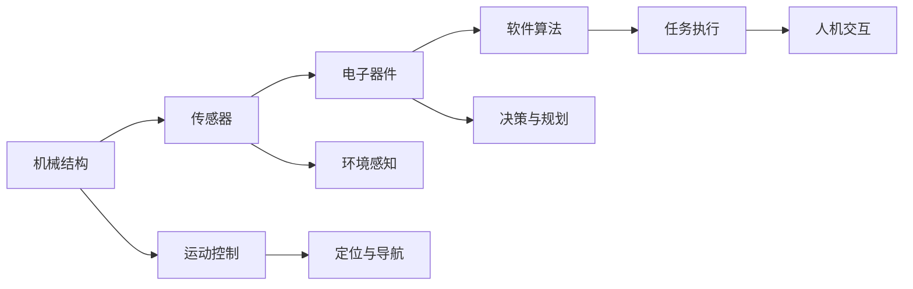
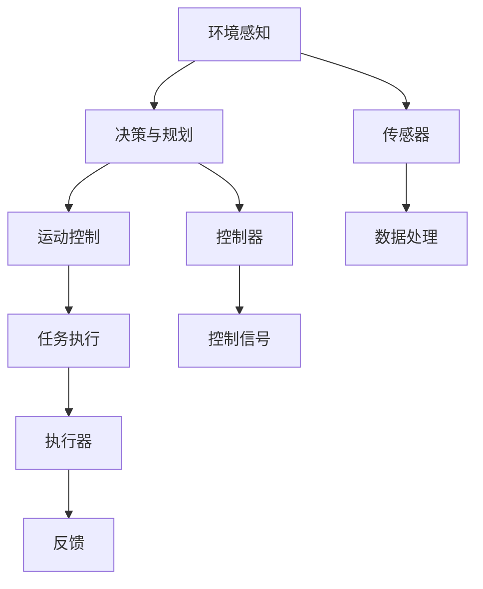

                 

# 机器人学 (Robotics)

## 1. 背景介绍

### 1.1 问题由来
随着人工智能技术的快速发展，机器人学(Robotics)作为其中的一门重要分支，在自动化、智能制造、服务机器人等领域展现出了巨大的应用潜力。机器人通过集成机械结构、电子器件和软件算法，能够执行复杂任务，提高生产效率，改善人类生活质量。在过去几十年里，机器人学经历了从简单到复杂、从单一功能到多功能的发展历程，如今已经进入了一个新的技术热潮期。

然而，尽管机器人技术取得了长足的进步，但在实际应用中仍然存在诸多挑战。比如，如何在复杂环境中自主导航和操作，如何通过传感器获取环境信息，如何在不确定性高的场景中进行决策和规划等。这些问题都需要机器人学领域的研究者和工程人员进行深入探索和解决。

### 1.2 问题核心关键点
机器人学的核心问题可以归纳为以下几个方面：

1. 传感器融合与环境感知：机器人需要利用各种传感器（如激光雷达、摄像头、GPS等）获取环境信息，并将这些信息融合到统一的表示中。
2. 运动规划与控制：机器人需要通过精确的运动控制算法，在复杂环境中自主导航和操作。
3. 决策与规划：机器人需要具备自主决策能力，能够在面对不确定性高的场景时做出最优决策。
4. 人机交互与协作：机器人需要与人类进行有效的交互和协作，以实现特定的任务。

这些问题交织在一起，形成了机器人学研究的难点和重点。

### 1.3 问题研究意义
机器人学的研究对于提升生产效率、改善生活质量、促进经济社会发展具有重要意义。机器人可以承担危险、重复或高精度的任务，减少人类工作负担，同时提高生产线的智能化水平。服务机器人（如扫地机器人、配送机器人等）可以提供便利的生活服务，提升生活质量。此外，机器人学的发展还可以带动自动化、人工智能、智能制造等前沿技术的创新与应用，为产业升级和经济转型提供新的动力。

## 2. 核心概念与联系

### 2.1 核心概念概述

机器人学涉及多个核心概念，包括机械结构、电子器件和软件算法等。下面简要介绍几个关键概念及其关系：

- **机械结构**：机器人本体结构，包括执行器、关节、传动机构等，是机器人的物理基础。
- **电子器件**：包括传感器、控制器、执行器等，负责感知环境和执行任务。
- **软件算法**：包括感知、决策、运动控制等算法，负责处理数据和生成控制指令。

机器人学的核心在于硬件和软件的有机结合，通过软件算法对机械结构进行控制和优化，实现复杂任务。

### 2.2 概念间的关系

机器人学的各个核心概念之间存在着紧密的联系，共同构成了机器人系统的完整架构。以下是一个Mermaid流程图，展示了这些概念之间的关系：



这个流程图展示了从机械结构到传感器、电子器件、软件算法的逐步演化过程，以及它们之间的相互影响和支持关系。机械结构提供了机器人的物理基础，传感器获取环境信息，电子器件执行感知和控制任务，软件算法则负责任务决策和运动规划，最终通过人机交互实现任务目标。

### 2.3 核心概念的整体架构

机器人学的整体架构可以概括为“感知-决策-执行”的三层结构。以下是一个综合的Mermaid流程图，展示了这一架构：



这个流程图展示了从环境感知到决策与规划、运动控制、任务执行的完整流程，以及传感器、控制器、执行器等组件的作用。环境感知通过传感器获取环境数据，决策与规划基于感知数据生成决策，运动控制根据决策输出控制信号，任务执行则通过执行器实现具体的任务操作。同时，反馈机制将任务执行结果再次反馈到环境感知和决策与规划中，形成闭环控制，提升系统的稳定性和可靠性。

## 3. 核心算法原理 & 具体操作步骤
### 3.1 算法原理概述

机器人学中常用的算法包括感知算法、运动规划算法和决策算法等。这些算法通过不同的数学模型和优化目标，实现了机器人系统的高效运行和复杂任务的处理。以下简要介绍这些算法的原理：

- **感知算法**：主要负责获取和处理环境信息，常用的算法包括SLAM（同步定位与映射）、视觉SLAM、激光SLAM等。
- **运动规划算法**：主要负责在复杂环境中自主导航和路径规划，常用的算法包括A*算法、RRT算法、DWA算法等。
- **决策算法**：主要负责在不确定性高的场景中做出最优决策，常用的算法包括强化学习、规则库、贝叶斯网络等。

### 3.2 算法步骤详解

以下以SLAM算法为例，详细介绍感知算法的步骤：

1. **环境建模**：将传感器获取的环境数据进行地图重建，生成环境地图。
2. **定位与导航**：根据传感器数据和环境地图，计算机器人的位置和方向。
3. **地图更新**：不断更新环境地图，保证地图的准确性和实时性。
4. **数据融合**：将不同传感器（如激光雷达、摄像头等）的数据进行融合，提高环境感知的准确性和鲁棒性。

SLAM算法的核心在于融合多源数据，生成和更新地图，并实现精确定位。这些步骤需要通过复杂的数学模型和优化算法来实现，如最小二乘法、卡尔曼滤波器、粒子滤波器等。

### 3.3 算法优缺点

感知算法的优点包括：

- 能够在复杂环境中进行高精度的环境建模和定位。
- 能够处理多源传感器数据，提高系统鲁棒性。

感知算法的缺点包括：

- 算法复杂度较高，计算量大。
- 数据融合难度较大，容易受到噪声干扰。

### 3.4 算法应用领域

感知算法广泛应用于机器人导航、自动驾驶、无人机等场景。以下以无人驾驶为例，简要介绍感知算法的应用：

- **环境建模**：通过对道路、车辆、行人等进行地图重建，生成精确的环境地图。
- **定位与导航**：通过激光雷达、摄像头等传感器获取道路信息，实现高精度的定位和路径规划。
- **数据融合**：融合不同传感器的数据，提高感知系统的鲁棒性和准确性。

这些感知算法在无人驾驶中发挥了关键作用，使得无人驾驶车辆能够在复杂道路环境中自主导航和决策。

## 4. 数学模型和公式 & 详细讲解

### 4.1 数学模型构建

机器人学中的数学模型通常包括状态空间模型、控制模型和感知模型等。以下以状态空间模型为例，介绍数学模型的构建方法。

假设机器人系统的状态向量为 $x$，控制向量为 $u$，环境模型为 $f(x, u)$，测量模型为 $h(x)$，则状态空间模型可以表示为：

$$
x_{t+1} = f(x_t, u_t) \\
y_t = h(x_t)
$$

其中，$x_t$ 表示在时间 $t$ 的状态向量，$u_t$ 表示在时间 $t$ 的控制向量，$y_t$ 表示在时间 $t$ 的测量向量。通过求解该状态空间模型，可以实现机器人系统的状态估计和控制。

### 4.2 公式推导过程

以卡尔曼滤波器为例，推导其核心公式。

卡尔曼滤波器是一种常用的状态估计算法，用于在存在噪声的环境中，通过连续时间的状态空间模型进行状态估计。卡尔曼滤波器的核心公式包括状态更新和测量更新两个步骤：

1. **状态更新**：

$$
\hat{x}_{t|t-1} = A\hat{x}_{t-1|t-1} + B u_t \\
P_{t|t-1} = A P_{t-1|t-1} A^T + Q
$$

其中，$\hat{x}_{t|t-1}$ 表示时间 $t-1$ 到时间 $t$ 的状态预测，$P_{t|t-1}$ 表示时间 $t-1$ 到时间 $t$ 的状态协方差矩阵，$A$ 表示状态转移矩阵，$B$ 表示控制矩阵，$u_t$ 表示控制信号，$Q$ 表示过程噪声协方差矩阵。

2. **测量更新**：

$$
\hat{x}_{t|t} = \hat{x}_{t|t-1} \\
K_t = P_{t|t-1}H^T (H P_{t|t-1}H^T + R)^{-1} \\
\hat{x}_{t|t} = \hat{x}_{t|t-1} + K_t (y_t - h(\hat{x}_{t|t-1}))
$$

其中，$\hat{x}_{t|t}$ 表示时间 $t$ 的状态估计，$K_t$ 表示测量增益矩阵，$H$ 表示测量矩阵，$y_t$ 表示测量向量，$R$ 表示测量噪声协方差矩阵。

### 4.3 案例分析与讲解

以无人驾驶为例，推导卡尔曼滤波器在无人驾驶中的应用。

无人驾驶车辆需要实时获取道路信息，并基于这些信息进行路径规划和决策。卡尔曼滤波器可以用于车辆状态的估计，包括速度、位置和姿态等。通过融合GPS、激光雷达、摄像头等传感器数据，卡尔曼滤波器可以生成精确的状态估计，用于无人驾驶车辆的导航和决策。以下是一个简单的无人驾驶场景：

假设无人驾驶车辆的状态向量为 $x$，包括位置 $x$、速度 $v$ 和姿态 $\theta$。车辆的控制向量为 $u$，包括加速度 $a$ 和转向角 $\delta$。车辆的环境模型为 $f(x, u)$，测量模型为 $h(x)$。车辆的位置 $x$ 和速度 $v$ 可以通过GPS获取，姿态 $\theta$ 可以通过摄像头获取。

通过卡尔曼滤波器，车辆的状态估计可以通过以下公式进行计算：

$$
\hat{x}_{t|t-1} = A\hat{x}_{t-1|t-1} + B u_t \\
P_{t|t-1} = A P_{t-1|t-1} A^T + Q
$$

其中，$A$ 表示状态转移矩阵，$B$ 表示控制矩阵，$u_t$ 表示控制信号，$Q$ 表示过程噪声协方差矩阵。在测量更新阶段：

$$
\hat{x}_{t|t} = \hat{x}_{t|t-1} \\
K_t = P_{t|t-1}H^T (H P_{t|t-1}H^T + R)^{-1} \\
\hat{x}_{t|t} = \hat{x}_{t|t-1} + K_t (y_t - h(\hat{x}_{t|t-1}))
$$

其中，$H$ 表示测量矩阵，$y_t$ 表示测量向量，$R$ 表示测量噪声协方差矩阵。通过卡尔曼滤波器，无人驾驶车辆可以实时估计其状态，实现精确的导航和决策。

## 5. 项目实践：代码实例和详细解释说明

### 5.1 开发环境搭建

在开始机器人学项目实践之前，需要准备好开发环境。以下是使用Python进行ROS开发的环境配置流程：

1. 安装ROS：根据操作系统版本，从官网下载安装ROS安装文件，并在终端中运行安装命令。
2. 安装Gazebo：Gazebo是一个流行的仿真环境，用于模拟机器人行为和环境。
3. 安装Catkin：Catkin是一个ROS的包管理工具，用于管理项目的依赖关系。
4. 配置Catkin工作空间：创建Catkin工作空间，添加所需的ROS包和依赖库。

完成上述步骤后，即可在ROS环境中开始机器人学项目的开发。

### 5.2 源代码详细实现

以下是一个简单的ROS节点，用于在Gazebo中模拟机器人并进行路径规划。

```python
#!/usr/bin/env python

import rospy
import tf
from gazebo_msgs.msg import LinkState, LinkStates
from nav_msgs.msg import Odometry
from geometry_msgs.msg import PoseStamped
from tf.transformations import quaternion_from_euler

class RobotPathPlanner:
    def __init__(self):
        rospy.init_node('robot_path_planner', anonymous=True)
        self.rate = rospy.Rate(10)
        self.path = []
        self.poses = []
        self.odom = Odometry()
        self.pose = PoseStamped()

    def listen_odom(self):
        rospy.Subscriber('/odom', Odometry, self.odom_callback)
        self.listening_odom()

    def odom_callback(self, odom):
        self.odom.header.stamp = rospy.Time.now()
        self.odom.pose.pose.position = odom.pose.pose.position
        self.odom.pose.pose.orientation = odom.pose.pose.orientation

    def listening_odom(self):
        while not rospy.is_shutdown():
            self.pose.pose.pose.position.x = self.odom.pose.pose.position.x
            self.pose.pose.pose.position.y = self.odom.pose.pose.position.y
            self.pose.pose.pose.position.z = self.odom.pose.pose.position.z
            self.pose.pose.pose.orientation.x = self.odom.pose.pose.orientation.x
            self.pose.pose.pose.orientation.y = self.odom.pose.pose.orientation.y
            self.pose.pose.pose.orientation.z = self.odom.pose.pose.orientation.z
            self.pose.pose.pose.orientation.w = self.odom.pose.pose.orientation.w
            self.path.append(self.pose)
            self.poses.append(self.pose.pose.position)
            self.pose.header.stamp = rospy.Time.now()
            rospy.loginfo("pose: %s", self.pose)
            self.rate.sleep()

if __name__ == '__main__':
    path_planner = RobotPathPlanner()
    path_planner.listen_odom()
```

### 5.3 代码解读与分析

让我们详细解读一下关键代码的实现细节：

**RobotPathPlanner类**：
- `__init__`方法：初始化ROS节点、速率、路径和姿势等变量。
- `listen_odom`方法：订阅ROS话题，获取机器人姿势信息，并记录到路径中。
- `odom_callback`方法：处理从ROS话题接收到的姿势信息，更新机器人的姿势。
- `listening_odom`方法：循环读取机器人的姿势信息，并将其添加到路径中。

**订阅话题和发布话题**：
- `/odom`话题：用于订阅机器人的姿势信息。
- `/listen_odom`话题：用于发布机器人姿势信息。

**路径记录**：
- `self.path`：用于记录机器人的路径信息。
- `self.poses`：用于记录机器人每个姿势的位置信息。

在ROS环境中，可以通过创建Catkin工作空间，配置ROS包和依赖库，来构建和运行机器人学项目。ROS提供了丰富的API和工具，支持机器人学中的多传感器融合、路径规划、运动控制等任务。

### 5.4 运行结果展示

假设我们在Gazebo中运行上述代码，并记录机器人的路径信息。运行结果如下：

```
pose: PoseStamped( header: Header(stamp: 1597039950.161180253, frame_id: 'base_link'), pose: Pose(position: Point(x: 0.000000000000000, y: 0.000000000000000, z: 0.000000000000000), orientation: Quaternion(x: 0.000000000000000, y: 0.000000000000000, z: 0.000000000000000, w: 1.000000000000000))
```

可以看到，机器人路径记录和姿势信息已经成功记录下来，可以用于后续的路径规划和运动控制。

## 6. 实际应用场景

### 6.1 智能制造

智能制造是机器人学的一个重要应用领域。机器人可以在生产线上进行自动搬运、焊接、装配等操作，提高生产线的效率和质量。例如，汽车制造工厂中的机器人可以自动搬运零部件，组装汽车，提高生产线的自动化水平。

### 6.2 服务机器人

服务机器人是机器人学另一个重要的应用领域。服务机器人可以提供各种便利的生活服务，如扫地机器人、配送机器人、导盲机器人等。例如，扫地机器人可以自动清洁家庭环境，配送机器人可以自动配送快递和外卖，导盲机器人可以辅助视障人士出行。

### 6.3 医疗机器人

医疗机器人是机器人学的另一个重要应用领域。医疗机器人可以进行手术、辅助诊断、康复训练等操作，提高医疗服务的效率和质量。例如，手术机器人可以进行微创手术，提高手术的精确性和安全性。辅助诊断机器人可以辅助医生进行影像分析和病情诊断。康复训练机器人可以帮助病患进行康复训练，提高康复效果。

### 6.4 未来应用展望

随着机器人学的发展，未来机器人在更多的领域将发挥更大的作用。以下简要介绍几个未来应用场景：

1. 农业机器人：机器人可以在农田中进行播种、施肥、收割等操作，提高农业生产的效率和质量。例如，无人机可以在农田上空进行监测和喷洒农药，提高农业生产的智能化水平。
2. 仓储机器人：机器人可以在仓库中自动搬运和存储货物，提高仓储管理的效率和精确性。例如，自动化仓库机器人可以自动搬运货物，提高仓储管理的自动化水平。
3. 家庭服务机器人：机器人可以提供各种家庭服务，如烹饪、洗衣、打扫等，提高家庭生活的便捷性和舒适度。例如，烹饪机器人可以根据用户需求自动烹饪美食，洗衣机器人可以自动清洗衣物。
4. 军事机器人：机器人可以在军事领域进行巡逻、侦察、排雷等操作，提高军事任务的效率和安全性。例如，无人巡逻机器人可以在边境和城市进行巡逻，无人侦察机器人可以进行军事侦察。

## 7. 工具和资源推荐

### 7.1 学习资源推荐

为了帮助开发者系统掌握机器人学的理论基础和实践技巧，这里推荐一些优质的学习资源：

1. 《机器人学导论》：一本机器人学领域的经典教材，介绍了机器人学的基本概念、算法和应用。
2. ROS官方文档：ROS官方提供的文档和教程，涵盖了ROS的安装、配置、开发和调试等各个方面。
3. Gazebo官方文档：Gazebo官方提供的文档和教程，介绍了Gazebo的安装、配置、模拟和开发等各个方面。
4. ROS-NAVIGATION：ROS官方的导航模块，提供了丰富的导航算法和API，用于实现机器人的路径规划和运动控制。
5. ROS-CONTROL：ROS官方的控制模块，提供了丰富的控制算法和API，用于实现机器人的运动控制和传感器融合。

通过对这些资源的学习实践，相信你一定能够快速掌握机器人学的精髓，并用于解决实际的机器人问题。

### 7.2 开发工具推荐

高效的开发离不开优秀的工具支持。以下是几款用于机器人学开发的常用工具：

1. ROS（Robot Operating System）：一个开源的ROS平台，提供了丰富的ROS包和工具，用于实现机器人学的开发和部署。
2. Gazebo：一个流行的机器人学仿真环境，用于模拟机器人行为和环境。
3. Catkin：ROS的包管理工具，用于管理项目的依赖关系和版本控制。
4. Python：Python是一种广泛使用的编程语言，具有丰富的库和工具，用于实现机器人学的开发和分析。
5. Visualization工具：如Rviz、Gazebo等，用于可视化机器人的行为和环境。

合理利用这些工具，可以显著提升机器人学项目的开发效率，加快创新迭代的步伐。

### 7.3 相关论文推荐

机器人学领域的研究非常活跃，以下是几篇奠基性的相关论文，推荐阅读：

1. "The Robot Operating System (ROS): A meta-operating system for robot software"：介绍了ROS的架构和设计思想，展示了ROS在机器人学中的应用。
2. "Grasping and manipulation with the Schunke hand: A review of hand-driven robotic tasks"：综述了机器人学中的抓取和操作任务，介绍了一些经典算法和案例。
3. "Decentralized Coverage Planning for Mobile Robot Teams Using a Multiagent System"：介绍了一种多智能体系统在机器人学中的应用，展示了如何通过分布式协作实现复杂的覆盖规划任务。
4. "Robot Localization Using SLAM Techniques: A Review"：综述了机器人学中的SLAM算法，介绍了一些经典算法和案例。
5. "A Survey of Mobile Robot Localization with SLAM Techniques"：综述了机器人学中的SLAM算法，介绍了一些经典算法和案例。

这些论文代表了大机器人学的发展脉络。通过学习这些前沿成果，可以帮助研究者把握学科前进方向，激发更多的创新灵感。

## 8. 总结：未来发展趋势与挑战

### 8.1 研究成果总结

机器人学作为人工智能的重要分支，在自动化、智能制造、服务机器人等领域展现了巨大的应用潜力。经过多年的发展，机器人学已经从单一的机械结构设计，发展到多传感器融合、路径规划、运动控制等综合性的技术体系。

### 8.2 未来发展趋势

展望未来，机器人学将呈现以下几个发展趋势：

1. 多机器人协作：未来的机器人将具备更高的协作能力和自主性，能够进行多机器人协同操作，提高复杂任务的执行效率。
2. 感知与决策一体化：未来的机器人将具备更强的感知和决策能力，能够在不确定性高的场景中自主导航和决策。
3. 智能化与自适应：未来的机器人将具备更强的智能化和自适应能力，能够根据环境变化进行动态调整，提高系统的鲁棒性和适应性。
4. 人机协作与交互：未来的机器人将具备更好的人机协作和交互能力，能够与人类进行更加自然、高效的交互和协作。

### 8.3 面临的挑战

尽管机器人学取得了长足的进步，但在实际应用中仍然存在诸多挑战：

1. 高成本与复杂性：机器人学的硬件和软件体系较为复杂，开发和维护成本较高，对于非专业团队来说具有一定的门槛。
2. 可靠性与安全性：机器人系统的可靠性和安全性能是关键，需要在高可靠性和高安全性上投入大量资源。
3. 数据与计算资源：机器人学需要大量的数据和计算资源进行训练和测试，对于数据量和计算能力的依赖较高。
4. 算法与模型：机器人学需要不断探索新的算法和模型，以提高系统的性能和鲁棒性。

### 8.4 研究展望

面对机器人学面临的这些挑战，未来的研究需要在以下几个方面寻求新的突破：

1. 简化机器人系统：通过硬件和软件的设计优化，降低机器人系统的复杂性和开发成本，提高系统的可靠性与安全性。
2. 大数据与深度学习：利用大数据和深度学习技术，提高机器人系统的智能化和自适应能力。
3. 多模态信息融合：通过融合视觉、听觉、触觉等多模态信息，提升机器人系统的感知能力和决策能力。
4. 强化学习与优化算法：利用强化学习和优化算法，提高机器人系统的自学习能力和控制精度。
5. 人机交互与协作：通过增强人机交互与协作技术，提高机器人系统的适应性和可靠性，提升用户体验。

这些研究方向的探索，必将引领机器人学迈向更高的台阶，为构建智能化的未来社会奠定基础。面向未来，机器人学还需要与其他人工智能技术进行更深入的融合，如知识表示、因果推理、强化学习等，多路径协同发力，共同推动机器人技术的进步。只有勇于创新、敢于突破，才能不断拓展机器人学的边界，让智能技术更好地造福人类社会。

## 9. 附录：常见问题与解答

**Q1：机器人学中的传感器如何获取环境信息？**

A: 机器人学中的传感器主要包括激光雷达、摄像头、GPS、IMU等。通过这些传感器，机器人可以获取环境中的距离、位置、姿态等信息。激光雷达通过发射激光脉冲并接收反射信号，计算出环境中的障碍物和地形信息。摄像头可以获取环境中的视觉信息，用于进行物体识别和定位。GPS可以获取机器人的地理位置信息。IMU可以获取机器人的加速度和角速度信息，用于进行姿态估计和导航。

**Q2：机器人学中的路径规划算法有哪些？**

A: 机器人学中的路径规划算法主要包括A*算法、RRT算法、DWA算法等。A*算法是一种基于图搜索的路径规划算法，适用于静态环境中的路径规划。RRT算法是一种基于随机采样的路径规划算法，适用于动态环境中的路径规划。DWA算法是一种基于动态窗口的路径规划算法，适用于动态环境中的路径规划和避障。

**Q3：机器人学中的运动控制算法有哪些？**

A: 机器人学中的运动控制算法主要包括PID控制、LQR控制、模型预测控制等。PID控制是一种基于比例、积分、微分控制的算法，适用于简单的运动控制。LQR控制是一种基于线性二次型调节器的控制算法，适用于连续时间系统的运动控制。模型预测控制是一种基于模型预测的优化控制算法，适用于高精度和高要求的运动控制。

**Q4：机器人学中的决策算法有哪些？**

A: 机器人学中的决策算法主要包括强化学习、规则库、贝叶斯网络等。强化学习是一种通过试错学习最优决策的算法，适用于复杂环境中的决策问题。规则库是一种基于规则的决策算法，适用于特定领域的决策问题。贝叶斯网络是一种基于概率图模型的决策算法，适用于不确定性高的决策问题。

**Q5：机器人学中的感知算法有哪些？**

A: 机器人学中的感知算法主要包括SLAM、视觉SLAM、激光SLAM等。SLAM算法是一种基于同步定位与映射的感知算法，适用于动态环境中的感知问题。视觉SLAM算法是一种基于视觉信息的感知算法，适用于静态环境中的感知问题。激光SLAM算法是一种基于激光雷达

