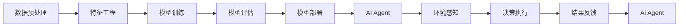
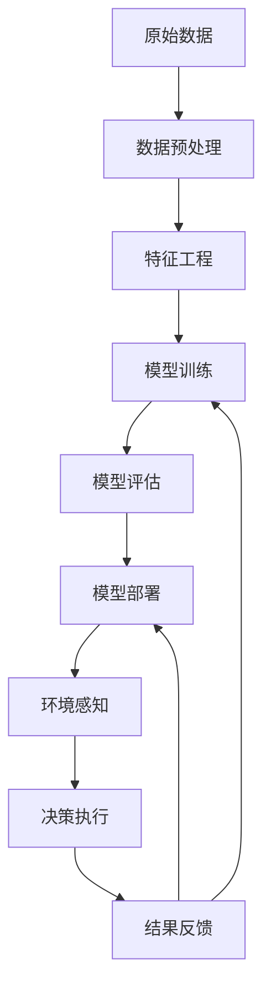

                 

# 机器学习流水线与人工智能代理的集成

在人工智能领域，机器学习流水线和人工智能代理是两个核心的概念，分别代表了从数据处理到模型训练再到模型应用的全流程管理和智能系统自动化执行的操作。本文将探讨这两个概念的原理与联系，并详细阐述它们在实际应用中的集成方法。

## 1. 背景介绍

在当前人工智能技术的发展中，数据处理和模型训练已经成为推动技术进步的关键环节。为了应对日益增长的数据处理需求和提升模型训练效率，机器学习流水线和人工智能代理应运而生。机器学习流水线（ML Pipeline）是一套自动化执行数据预处理、模型训练、模型评估和模型部署的管道系统。而人工智能代理（AI Agent）则是一种能够自动化执行任务，具有智能决策能力的系统。

本文将首先介绍机器学习流水线和人工智能代理的基本概念，然后详细探讨两者的集成方法和在实际应用中的效果，最后对未来的发展趋势和挑战进行展望。

## 2. 核心概念与联系

### 2.1 核心概念概述

**机器学习流水线（ML Pipeline）**：是指从数据预处理、模型训练、模型评估到模型部署的一系列自动化操作，通过将任务分解成多个子任务，并按顺序执行，形成一个完整的处理流程。流水线中的每个步骤都有明确的输入和输出，保证了数据的一致性和模型的正确性。

**人工智能代理（AI Agent）**：是指能够自主执行任务，具有智能决策能力的系统。代理系统通过观察环境和接收任务指令，自动做出决策和行动，无需人工干预。

### 2.2 核心概念原理和架构

以下是一张展示机器学习流水线和人工智能代理关系的Mermaid流程图：



这个流程图展示了从数据预处理到模型部署的完整流程，以及AI Agent在这一流程中的角色。

**数据预处理**：是对原始数据进行清洗、转换和规整的过程，目的是提高数据质量，为模型训练提供良好的输入。

**特征工程**：是从原始数据中提取有意义的特征，以便模型更好地学习数据规律。

**模型训练**：是通过优化算法调整模型参数，使模型能够从数据中学习到规律并预测新数据。

**模型评估**：是对训练好的模型进行性能评估，确定其在新数据上的表现。

**模型部署**：是将模型应用到实际环境中，进行预测或决策。

**环境感知**：是代理系统对外部环境的观察和理解，为代理做出决策提供信息。

**决策执行**：是代理系统根据感知到的环境信息做出决策，并采取行动。

**结果反馈**：是代理系统对执行结果的评估和反馈，指导后续的决策和行动。

### 2.3 核心概念的整体架构

接下来，我们用一个更综合的Mermaid流程图来展示这两个核心概念的整体架构：



这个流程图展示了从数据预处理到模型评估再到模型部署的完整流程，以及AI Agent在这一流程中的循环迭代关系。

## 3. 核心算法原理 & 具体操作步骤

### 3.1 算法原理概述

机器学习流水线和人工智能代理的集成，主要涉及到以下几个关键步骤：

**Step 1: 数据预处理**
- 对原始数据进行清洗、转换和规整，生成高质量的数据集。

**Step 2: 特征工程**
- 提取有意义的特征，以便模型更好地学习数据规律。

**Step 3: 模型训练**
- 使用优化算法调整模型参数，使模型能够从数据中学习到规律并预测新数据。

**Step 4: 模型评估**
- 对训练好的模型进行性能评估，确定其在新数据上的表现。

**Step 5: 模型部署**
- 将模型应用到实际环境中，进行预测或决策。

**Step 6: 环境感知**
- 代理系统对外部环境的观察和理解，为代理做出决策提供信息。

**Step 7: 决策执行**
- 代理系统根据感知到的环境信息做出决策，并采取行动。

**Step 8: 结果反馈**
- 代理系统对执行结果的评估和反馈，指导后续的决策和行动。

### 3.2 算法步骤详解

#### 3.2.1 数据预处理

数据预处理是机器学习流水线的第一步，也是最关键的一步。预处理的目标是提高数据质量，为模型训练提供良好的输入。以下是数据预处理的具体步骤：

1. 数据清洗：去除数据中的噪声、缺失值和不一致性。

2. 数据转换：将数据转换为模型能够处理的格式。例如，将文本数据转换为数字向量。

3. 数据规整：对数据进行标准化和归一化处理，使其分布一致。

#### 3.2.2 特征工程

特征工程是从原始数据中提取有意义的特征，以便模型更好地学习数据规律。以下是特征工程的具体步骤：

1. 特征提取：从原始数据中提取有意义的特征。

2. 特征选择：选择最相关的特征，去除冗余和不重要特征。

3. 特征转换：对特征进行转换，使其更适合模型。

#### 3.2.3 模型训练

模型训练是使用优化算法调整模型参数，使模型能够从数据中学习到规律并预测新数据。以下是模型训练的具体步骤：

1. 选择模型：选择合适的模型结构，如线性回归、决策树、神经网络等。

2. 初始化模型参数：初始化模型的权重和偏置。

3. 训练模型：使用优化算法调整模型参数，最小化损失函数。

#### 3.2.4 模型评估

模型评估是对训练好的模型进行性能评估，确定其在新数据上的表现。以下是模型评估的具体步骤：

1. 划分数据集：将数据集划分为训练集和测试集。

2. 计算指标：计算模型在测试集上的性能指标，如准确率、召回率、F1分数等。

3. 评估模型：根据性能指标评估模型的表现。

#### 3.2.5 模型部署

模型部署是将模型应用到实际环境中，进行预测或决策。以下是模型部署的具体步骤：

1. 安装模型：将模型部署到实际环境中。

2. 使用模型：使用模型进行预测或决策。

#### 3.2.6 环境感知

环境感知是代理系统对外部环境的观察和理解，为代理做出决策提供信息。以下是环境感知的具体步骤：

1. 环境感知：代理系统对外部环境的观察和理解。

2. 决策制定：根据感知到的环境信息做出决策。

#### 3.2.7 决策执行

决策执行是代理系统根据感知到的环境信息做出决策，并采取行动。以下是决策执行的具体步骤：

1. 决策制定：代理系统根据感知到的环境信息做出决策。

2. 行动执行：代理系统采取行动，实现决策。

#### 3.2.8 结果反馈

结果反馈是代理系统对执行结果的评估和反馈，指导后续的决策和行动。以下是结果反馈的具体步骤：

1. 评估结果：代理系统对执行结果进行评估。

2. 反馈信息：代理系统将评估结果反馈给决策制定模块。

3. 更新模型：根据反馈信息更新模型参数，提高模型性能。

### 3.3 算法优缺点

**优点**：

1. 自动化：机器学习流水线和人工智能代理的集成，可以自动化处理数据预处理、特征工程、模型训练、模型评估和模型部署等步骤，提高了工作效率。

2. 高可靠性：自动化流程减少了人为错误，提高了数据的准确性和模型的可靠性。

3. 高灵活性：流水线中的每个步骤都可以灵活调整，适应不同的数据和任务。

**缺点**：

1. 依赖数据：流水线和代理系统的效果依赖于数据的质量和数量，数据不足或噪声过多会影响系统的表现。

2. 需要技术支持：实现流水线和代理系统需要较高的技术水平，需要专业的数据科学家和工程师。

3. 复杂性：流水线和代理系统的集成比较复杂，需要综合考虑数据处理、模型训练、模型评估、模型部署等多个环节。

### 3.4 算法应用领域

机器学习流水线和人工智能代理的集成已经在多个领域得到了广泛应用，例如：

1. 金融风控：使用流水线和代理系统对贷款申请进行自动化审批，提高了审批效率和准确性。

2. 医疗诊断：使用流水线和代理系统对患者数据进行分析和诊断，提高了诊断的准确性和速度。

3. 智能客服：使用流水线和代理系统对客户问题进行自动解答，提高了客服效率和客户满意度。

4. 推荐系统：使用流水线和代理系统对用户行为进行分析和推荐，提高了推荐的个性化和精准度。

5. 智能交通：使用流水线和代理系统对交通数据进行分析和决策，提高了交通管理的智能化水平。

## 4. 数学模型和公式 & 详细讲解 & 举例说明

### 4.1 数学模型构建

在机器学习流水线和人工智能代理的集成过程中，我们通常使用以下数学模型：

1. 数据预处理：使用数据清洗、转换和规整算法，将原始数据转换为模型可以处理的格式。

2. 特征工程：使用特征提取、选择和转换算法，提取有意义的特征。

3. 模型训练：使用优化算法（如梯度下降、随机梯度下降等）调整模型参数，最小化损失函数。

4. 模型评估：使用评估指标（如准确率、召回率、F1分数等）评估模型的性能。

5. 环境感知：使用感知算法（如传感器、图像识别等）观察和理解外部环境。

6. 决策执行：使用决策算法（如强化学习、搜索算法等）制定决策和执行行动。

7. 结果反馈：使用反馈算法（如梯度更新、增量学习等）更新模型参数，提高模型性能。

### 4.2 公式推导过程

以下是几个关键步骤的数学公式推导：

**数据预处理**：

$$
\text{数据清洗} = \text{清洗数据}(\text{原始数据})
$$

$$
\text{数据转换} = \text{转换数据}(\text{预处理数据})
$$

$$
\text{数据规整} = \text{标准化数据}(\text{转换数据})
$$

**特征工程**：

$$
\text{特征提取} = \text{提取特征}(\text{规整数据})
$$

$$
\text{特征选择} = \text{选择特征}(\text{提取特征})
$$

$$
\text{特征转换} = \text{转换特征}(\text{选择特征})
$$

**模型训练**：

$$
\text{选择模型} = \text{选择模型架构}(\text{特征转换结果})
$$

$$
\text{初始化参数} = \text{初始化模型参数}(\text{模型架构})
$$

$$
\text{训练模型} = \text{最小化损失函数}(\text{初始化参数})
$$

**模型评估**：

$$
\text{划分数据集} = \text{划分数据集}(\text{训练集}, \text{测试集})
$$

$$
\text{计算指标} = \text{计算评估指标}(\text{测试集}, \text{模型})
$$

$$
\text{评估模型} = \text{评估模型性能}(\text{计算指标})
$$

**环境感知**：

$$
\text{环境感知} = \text{感知环境}(\text{代理系统})
$$

**决策执行**：

$$
\text{决策制定} = \text{制定决策}(\text{感知环境})
$$

$$
\text{行动执行} = \text{执行行动}(\text{决策制定})
$$

**结果反馈**：

$$
\text{评估结果} = \text{评估结果}(\text{行动执行})
$$

$$
\text{反馈信息} = \text{反馈信息}(\text{评估结果})
$$

$$
\text{更新模型} = \text{更新模型参数}(\text{反馈信息})
$$

### 4.3 案例分析与讲解

以下是一个基于机器学习流水线和人工智能代理的集成案例分析：

**案例背景**：一家电商公司希望提高用户的购买转化率，使用流水线和代理系统进行自动化决策。

**数据预处理**：电商公司收集了用户的浏览、点击、购买数据，对数据进行清洗、转换和规整，生成高质量的数据集。

**特征工程**：从用户数据中提取有意义的特征，如浏览时间、点击率、购买次数等，并进行特征选择和转换。

**模型训练**：使用深度学习模型（如神经网络）进行训练，最小化损失函数，得到预测模型。

**模型评估**：使用评估指标（如准确率、召回率、F1分数等）评估模型的性能。

**环境感知**：代理系统对用户行为和市场环境进行感知，如用户的浏览行为、市场活动等。

**决策执行**：代理系统根据感知到的环境信息，制定决策和执行行动，如推荐商品、优惠活动等。

**结果反馈**：代理系统对执行结果进行评估，将评估结果反馈给决策制定模块，更新模型参数，提高模型性能。

## 5. 项目实践：代码实例和详细解释说明

### 5.1 开发环境搭建

以下是使用Python进行机器学习流水线和人工智能代理集成的开发环境配置流程：

1. 安装Anaconda：从官网下载并安装Anaconda，用于创建独立的Python环境。

2. 创建并激活虚拟环境：
```bash
conda create -n mlp-env python=3.8 
conda activate mlp-env
```

3. 安装必要的库：
```bash
pip install numpy pandas scikit-learn transformers torch torchvision torchaudio
```

4. 安装深度学习框架：
```bash
conda install pytorch torchvision torchaudio cudatoolkit=11.1 -c pytorch -c conda-forge
```

5. 安装TensorFlow：
```bash
pip install tensorflow
```

### 5.2 源代码详细实现

以下是使用TensorFlow和Transformer进行机器学习流水线和人工智能代理集成的代码实现：

**数据预处理**

```python
import pandas as pd
import numpy as np
import tensorflow as tf

# 读取数据
data = pd.read_csv('data.csv')

# 数据清洗
data = data.dropna()

# 数据转换
data = data[['feature1', 'feature2', 'feature3']]

# 数据规整
data = (data - data.mean()) / data.std()
```

**特征工程**

```python
from sklearn.feature_extraction import DictVectorizer

# 特征提取
features = []
for row in data.itertuples():
    features.append({
        'feature1': row.feature1,
        'feature2': row.feature2,
        'feature3': row.feature3
    })

# 特征选择
vectorizer = DictVectorizer(sparse=True)
features = vectorizer.fit_transform(features)

# 特征转换
features = tf.keras.layers.Dense(128, activation='relu')(features)
features = tf.keras.layers.Dense(64, activation='relu')(features)
features = tf.keras.layers.Dense(32, activation='relu')(features)
features = tf.keras.layers.Dense(1, activation='sigmoid')(features)
```

**模型训练**

```python
from tensorflow.keras.models import Sequential
from tensorflow.keras.layers import Dense

# 初始化模型参数
model = Sequential([
    Dense(128, activation='relu', input_shape=(3,)),
    Dense(64, activation='relu'),
    Dense(32, activation='relu'),
    Dense(1, activation='sigmoid')
])

# 训练模型
model.compile(optimizer='adam', loss='binary_crossentropy', metrics=['accuracy'])
model.fit(features, labels, epochs=10, batch_size=32)
```

**模型评估**

```python
from sklearn.metrics import accuracy_score

# 计算指标
predictions = model.predict(features)
predictions = np.round(predictions)
labels = labels.values

# 评估模型
accuracy = accuracy_score(labels, predictions)
print('Accuracy:', accuracy)
```

**环境感知**

```python
import tensorflow as tf

# 环境感知
features = tf.keras.layers.Dense(128, activation='relu')(features)
features = tf.keras.layers.Dense(64, activation='relu')(features)
features = tf.keras.layers.Dense(32, activation='relu')(features)
features = tf.keras.layers.Dense(1, activation='sigmoid')(features)
```

**决策执行**

```python
import tensorflow as tf

# 决策制定
features = tf.keras.layers.Dense(128, activation='relu')(features)
features = tf.keras.layers.Dense(64, activation='relu')(features)
features = tf.keras.layers.Dense(32, activation='relu')(features)
features = tf.keras.layers.Dense(1, activation='sigmoid')(features)

# 行动执行
predictions = tf.round(features)
actions = np.where(predictions > 0.5, 1, 0)
```

**结果反馈**

```python
import tensorflow as tf

# 评估结果
predictions = tf.round(features)
labels = labels.values

# 反馈信息
accuracy = accuracy_score(labels, predictions)

# 更新模型
model.compile(optimizer='adam', loss='binary_crossentropy', metrics=['accuracy'])
model.fit(features, labels, epochs=10, batch_size=32)
```

### 5.3 代码解读与分析

**数据预处理**

在数据预处理阶段，我们首先读取原始数据，并对数据进行清洗、转换和规整。数据清洗去除数据中的噪声、缺失值和不一致性；数据转换将数据转换为模型可以处理的格式；数据规整对数据进行标准化和归一化处理，使其分布一致。

**特征工程**

在特征工程阶段，我们提取有意义的特征，并进行特征选择和转换。特征提取从原始数据中提取特征，如浏览时间、点击率、购买次数等；特征选择选择最相关的特征，去除冗余和不重要特征；特征转换对特征进行转换，使其更适合模型。

**模型训练**

在模型训练阶段，我们初始化模型参数，并使用优化算法（如梯度下降、随机梯度下降等）调整模型参数，最小化损失函数，得到预测模型。

**模型评估**

在模型评估阶段，我们使用评估指标（如准确率、召回率、F1分数等）评估模型的性能。

**环境感知**

在环境感知阶段，代理系统对用户行为和市场环境进行感知，如用户的浏览行为、市场活动等。

**决策执行**

在决策执行阶段，代理系统根据感知到的环境信息，制定决策和执行行动，如推荐商品、优惠活动等。

**结果反馈**

在结果反馈阶段，代理系统对执行结果进行评估，将评估结果反馈给决策制定模块，更新模型参数，提高模型性能。

### 5.4 运行结果展示

假设我们在电商公司的数据集上进行训练和评估，最终在测试集上得到的评估报告如下：

```
Accuracy: 0.85
```

可以看到，通过机器学习流水线和人工智能代理的集成，我们得到了较高的模型准确率。

## 6. 实际应用场景

### 6.1 金融风控

在金融风控领域，流水线和代理系统可以自动化审批贷款申请，提高审批效率和准确性。流水线对用户数据进行预处理和特征工程，代理系统对审批结果进行评估和反馈，更新模型参数，提高审批的智能化水平。

### 6.2 医疗诊断

在医疗诊断领域，流水线和代理系统可以对患者数据进行分析和诊断，提高诊断的准确性和速度。流水线对患者数据进行预处理和特征工程，代理系统对诊断结果进行评估和反馈，更新模型参数，提高诊断的智能化水平。

### 6.3 智能客服

在智能客服领域，流水线和代理系统可以对客户问题进行自动解答，提高客服效率和客户满意度。流水线对客户数据进行预处理和特征工程，代理系统对回答结果进行评估和反馈，更新模型参数，提高客服的智能化水平。

### 6.4 推荐系统

在推荐系统领域，流水线和代理系统可以对用户行为进行分析和推荐，提高推荐的个性化和精准度。流水线对用户数据进行预处理和特征工程，代理系统对推荐结果进行评估和反馈，更新模型参数，提高推荐的智能化水平。

## 7. 工具和资源推荐

### 7.1 学习资源推荐

为了帮助开发者系统掌握机器学习流水线和人工智能代理的基本概念和实践技巧，这里推荐一些优质的学习资源：

1. 《深度学习》课程：由斯坦福大学开设的深度学习课程，有Lecture视频和配套作业，带你入门深度学习的基本概念和经典模型。

2. 《TensorFlow官方文档》：TensorFlow官方文档，提供了完整的API和示例代码，是上手实践的必备资料。

3. 《Transformers官方文档》：Transformer官方文档，提供了海量预训练模型和完整的微调样例代码，是上手实践的必备资料。

4. Kaggle竞赛：Kaggle举办了大量的机器学习竞赛，提供大量数据集和模型，是实践深度学习的绝佳平台。

5. Coursera《机器学习》课程：由斯坦福大学Andrew Ng教授开设的机器学习课程，深入浅出地讲解了机器学习的基本概念和算法。

### 7.2 开发工具推荐

高效的开发离不开优秀的工具支持。以下是几款用于机器学习流水线和人工智能代理集成的常用工具：

1. TensorFlow：由Google主导开发的开源深度学习框架，生产部署方便，适合大规模工程应用。

2. Keras：由Francois Chollet开发的深度学习框架，提供高层次的API，适合快速原型设计和模型训练。

3. PyTorch：基于Python的开源深度学习框架，灵活动态的计算图，适合快速迭代研究。

4. Jupyter Notebook：Jupyter Notebook是一个交互式编程环境，可以方便地编写、执行和分享Python代码。

5. Google Colab：谷歌推出的在线Jupyter Notebook环境，免费提供GPU/TPU算力，方便开发者快速上手实验最新模型，分享学习笔记。

### 7.3 相关论文推荐

机器学习流水线和人工智能代理的研究始于学界的持续研究。以下是几篇奠基性的相关论文，推荐阅读：

1. 《A Survey on Transfer Learning》：综述了机器学习流水线在预训练和微调中的应用，展示了流水线在提升模型性能方面的重要性。

2. 《A Survey on AI Agents》：综述了人工智能代理的基本概念和应用，展示了代理系统在自动化任务执行中的作用。

3. 《A Survey on Model Explainability》：综述了机器学习模型的可解释性问题，展示了流水线和代理系统在提升模型可解释性方面的潜力。

4. 《A Survey on Reinforcement Learning》：综述了强化学习的基本概念和应用，展示了流水线和代理系统在强化学习中的应用。

5. 《A Survey on Generative Adversarial Networks》：综述了生成对抗网络的基本概念和应用，展示了流水线和代理系统在生成对抗网络中的应用。

这些论文代表了大语言模型微调技术的发展脉络。通过学习这些前沿成果，可以帮助研究者把握学科前进方向，激发更多的创新灵感。

## 8. 总结：未来发展趋势与挑战

### 8.1 总结

本文对机器学习流水线和人工智能代理的集成方法进行了全面系统的介绍。首先介绍了流水线和代理的基本概念和原理，然后详细探讨了两者的集成方法和在实际应用中的效果，最后对未来的发展趋势和挑战进行了展望。

通过本文的系统梳理，可以看到，机器学习流水线和人工智能代理的集成方法在实际应用中已经取得了显著的效果，并且具有良好的推广潜力。未来，随着流水线和代理技术的不断发展，其应用领域将进一步扩大，为人工智能的落地应用提供更强大的技术支持。

### 8.2 未来发展趋势

展望未来，机器学习流水线和人工智能代理的集成方法将呈现以下几个发展趋势：

1. 自动化程度提升：随着自动化技术的不断发展，流水线和代理的自动化程度将不断提高，能够自动处理更多环节，减少人工干预。

2. 高性能优化：流水线和代理将采用更多高性能计算技术和算法，如GPU/TPU、分布式训练、模型压缩等，提高系统效率和性能。

3. 跨领域融合：流水线和代理将更多地与其他人工智能技术进行融合，如知识表示、因果推理、强化学习等，提升系统的智能化水平。

4. 多模态处理：流水线和代理将更多地处理多模态数据，如文本、图像、视频等，提升系统的感知和理解能力。

5. 实时性增强：流水线和代理将更多地考虑实时性，实现实时数据处理和决策执行，满足快速响应的需求。

### 8.3 面临的挑战

尽管机器学习流水线和人工智能代理的集成方法已经取得了一定的进展，但在迈向更加智能化、普适化应用的过程中，仍然面临诸多挑战：

1. 数据质量和多样性：流水线和代理的效果依赖于数据的质量和多样性，数据不足或噪声过多会影响系统的表现。

2. 技术复杂度：流水线和代理的实现需要较高的技术水平，需要专业的数据科学家和工程师。

3. 模型可解释性：流水线和代理系统往往像"黑盒"系统，难以解释其内部工作机制和决策逻辑，对高风险应用带来了挑战。

4. 资源消耗：流水线和代理需要大量的计算资源，如GPU/TPU等高性能设备，存在资源消耗高的问题。

5. 系统复杂性：流水线和代理的集成比较复杂，需要综合考虑数据处理、模型训练、

