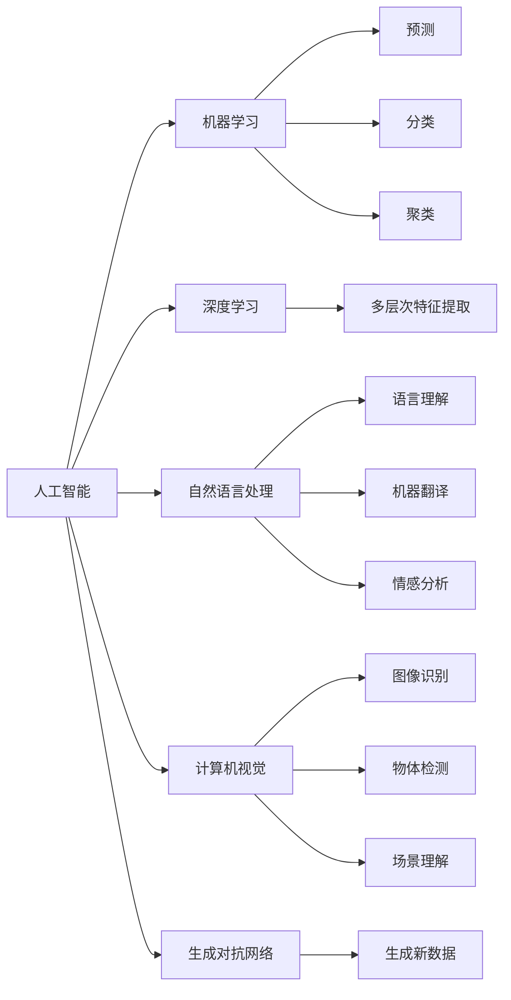
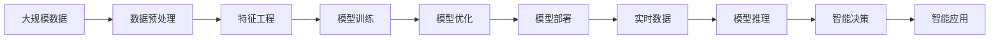

                 

# 李开复：AI 2.0 时代的市场

## 1. 背景介绍

### 1.1 问题由来

当前，人工智能(AI)技术正处于快速发展与变革的时期，被广泛视为下一波浪潮的领头羊。AI 2.0 时代的到来，标志着人工智能技术从早期的单一任务和应用走向更广泛、更深入、更复杂的综合应用。在此背景下，AI 市场呈现出诸多新的特点和趋势，吸引着各方力量积极参与和布局。

### 1.2 问题核心关键点

AI 2.0 时代的市场，其核心关键点主要包括以下几个方面：

1. **技术融合与创新**：AI 2.0 时代不仅包括传统的机器学习算法，还涵盖了深度学习、自然语言处理(NLP)、计算机视觉(CV)、生成对抗网络(GAN)等多种前沿技术。技术的快速融合与创新，推动了AI应用领域的不断扩展。

2. **行业应用广泛**：AI 技术已经应用于医疗、金融、制造、零售、教育、交通等多个行业，形成了众多落地应用场景。AI 技术在这些行业中的应用，显著提升了效率、降低了成本，带来了巨大的经济效益。

3. **数据驱动与智能决策**：AI 2.0 时代强调数据的重要性，通过大数据、云计算等技术，AI 系统能够进行更精准的数据分析和智能决策。这种数据驱动的智能决策能力，已经成为企业竞争力的重要组成部分。

4. **人机协同与用户体验**：AI 2.0 时代注重人机协同，通过智能交互、自然语言理解等技术，提升用户体验和交互效果。AI 系统能够理解用户需求，提供个性化、智能化的服务。

5. **伦理与安全性**：AI 技术的广泛应用也带来了伦理与安全性的挑战。如何在享受技术红利的同时，避免AI带来的隐私泄露、偏见、安全漏洞等问题，成为AI市场的重要考量因素。

### 1.3 问题研究意义

研究AI 2.0 时代的市场，对于推动AI技术的普及与应用，促进各行业智能化转型，具有重要的意义：

1. **技术普及**：深入了解AI 2.0 时代的市场特点，能够帮助更多企业和机构认识并利用AI技术，加速AI在各个行业的落地应用。

2. **产业升级**：AI 技术可以提升传统产业的智能化水平，优化生产流程，提高生产效率，推动产业升级。

3. **经济效益提升**：AI 技术在各行业的应用，能够创造新的增长点，提升企业的市场竞争力和经济效益。

4. **用户体验改善**：通过人机协同和智能化服务，AI 技术能够显著改善用户体验，满足用户的多样化需求。

5. **伦理与安全保障**：了解AI市场的伦理与安全挑战，能够促进AI技术的健康发展，构建更加安全的AI应用环境。

## 2. 核心概念与联系

### 2.1 核心概念概述

为更好地理解AI 2.0 时代的市场，本节将介绍几个密切相关的核心概念：

- **人工智能(AI)**：广义上，AI 指能够模拟人类智能行为的技术和系统。包括感知、理解、学习、推理、决策等智能过程。
- **机器学习(ML)**：AI 的重要组成部分，通过数据和算法训练模型，使其具备预测、分类、聚类等能力。
- **深度学习(DL)**：一种基于神经网络的机器学习方法，通过多层次的特征提取，实现高精度的模式识别和复杂决策。
- **自然语言处理(NLP)**：AI 的重要分支，专注于语言理解和生成，如图像描述、机器翻译、情感分析等。
- **计算机视觉(CV)**：AI 的另一重要分支，致力于让计算机理解和分析图像和视频内容，如图像识别、物体检测、场景理解等。
- **生成对抗网络(GAN)**：一种用于生成新数据的深度学习模型，通过两个神经网络相互对抗，生成高质量的合成数据。
- **AI 2.0**：AI 技术发展的第二个阶段，强调技术融合与创新，推动AI向更广泛的应用场景扩展。

这些核心概念之间存在着紧密的联系，构成了AI 2.0 时代的市场生态系统。通过理解这些核心概念，我们可以更好地把握AI 2.0 时代的技术发展和应用趋势。

### 2.2 概念间的关系

这些核心概念之间存在着紧密的联系，形成了AI 2.0 时代的市场生态系统。以下是一个简化的Mermaid流程图来展示这些概念之间的关系：



这个流程图展示了大AI 2.0 时代的主要技术领域及其之间的联系。AI 技术通过机器学习、深度学习等技术手段，实现了各种应用场景的智能化。自然语言处理、计算机视觉、生成对抗网络等技术，则是AI技术在语言、图像、数据生成等领域的扩展和应用。

### 2.3 核心概念的整体架构

最后，我们用一个综合的流程图来展示这些核心概念在大AI 2.0 时代的应用架构：



这个综合流程图展示了从数据预处理到模型部署的完整过程。AI 技术通过数据预处理、特征工程、模型训练和优化，最终实现智能决策和智能应用，构建起智能化系统。

## 3. 核心算法原理 & 具体操作步骤
### 3.1 算法原理概述

AI 2.0 时代的市场，其核心算法原理主要基于机器学习、深度学习和强化学习等技术。这些算法通过数据驱动，模拟人类智能行为，实现对复杂问题的解决。

1. **机器学习**：通过训练数据和算法，模型能够自动学习和发现数据中的规律和模式。常见的机器学习算法包括决策树、随机森林、支持向量机(SVM)等。

2. **深度学习**：利用多层神经网络，深度学习模型能够从数据中提取高层次特征，实现更精准的预测和分类。深度学习在图像识别、自然语言处理等领域表现优异。

3. **强化学习**：通过与环境交互，强化学习模型能够在不断的试错中优化决策策略，实现自主学习。在自动驾驶、游戏AI等场景中得到了广泛应用。

### 3.2 算法步骤详解

AI 2.0 时代的市场，其核心算法步骤主要包括以下几个方面：

1. **数据收集与预处理**：收集相关领域的业务数据，进行数据清洗、标注和预处理。数据预处理包括特征提取、归一化、标准化等步骤。

2. **模型选择与设计**：根据具体应用场景和问题，选择合适的机器学习、深度学习或强化学习模型，并设计模型的结构和参数。

3. **模型训练与优化**：使用收集的数据对模型进行训练，调整模型参数以最小化预测误差。通过正则化、Dropout等技术，防止过拟合。

4. **模型评估与部署**：在测试集上评估模型性能，选择最优模型进行部署。将模型集成到生产环境中，实现实时推理和智能决策。

### 3.3 算法优缺点

AI 2.0 时代的市场，其核心算法的优缺点如下：

**优点**：

1. **高精度与泛化能力**：通过深度学习等技术，AI 模型能够实现高精度的预测和分类，具备较强的泛化能力。

2. **自适应与自动化**：通过强化学习等技术，AI 系统能够实现自主学习和自适应，适应复杂的业务场景。

3. **数据驱动与智能决策**：AI 技术能够利用大数据和云计算等技术，进行更精准的数据分析和智能决策。

**缺点**：

1. **数据依赖性强**：AI 模型需要大量高质量的数据进行训练，数据获取和处理成本较高。

2. **计算资源消耗大**：深度学习等技术需要大量计算资源，训练和推理成本较高。

3. **模型复杂度**：深度学习等模型结构复杂，参数众多，难以调试和解释。

### 3.4 算法应用领域

AI 2.0 时代的市场，其核心算法已经在多个领域得到了广泛应用：

1. **医疗健康**：通过自然语言处理和计算机视觉技术，AI 系统可以辅助医生进行疾病诊断、手术规划等。AI 技术还应用于健康管理、药物研发等领域。

2. **金融行业**：AI 技术在金融风控、信用评估、投资决策等领域得到了广泛应用。通过数据分析和智能决策，AI 系统能够提升金融机构的运营效率和风险控制能力。

3. **制造业**：AI 技术在智能制造、质量检测、生产优化等领域具有重要应用。通过工业物联网和大数据分析，AI 系统能够提升生产效率和产品质量。

4. **零售电商**：AI 技术在商品推荐、库存管理、客户服务等方面具有重要应用。通过数据分析和智能决策，AI 系统能够提升零售电商的运营效率和用户体验。

5. **教育领域**：AI 技术在智能教学、学习分析、个性化推荐等方面具有重要应用。通过数据分析和智能决策，AI 系统能够提升教育质量和效率。

## 4. 数学模型和公式 & 详细讲解  
### 4.1 数学模型构建

在AI 2.0 时代的市场，常见的数学模型包括线性回归、逻辑回归、支持向量机、神经网络等。以线性回归模型为例，其数学模型构建如下：

假设训练集为 $\{(x_i, y_i)\}_{i=1}^N$，其中 $x_i$ 为输入特征向量，$y_i$ 为输出标签。则线性回归模型的目标是最小化均方误差损失：

$$
\min_{\theta} \frac{1}{2N} \sum_{i=1}^N (y_i - \theta \cdot x_i)^2
$$

其中 $\theta$ 为模型参数。

### 4.2 公式推导过程

以线性回归模型为例，其公式推导如下：

1. **均方误差损失函数**：
$$
L(\theta) = \frac{1}{2N} \sum_{i=1}^N (y_i - \theta \cdot x_i)^2
$$

2. **梯度下降法**：
$$
\theta_{t+1} = \theta_t - \eta \nabla_{\theta}L(\theta_t)
$$

其中 $\eta$ 为学习率，$\nabla_{\theta}L(\theta_t)$ 为损失函数对参数 $\theta$ 的梯度，可以通过反向传播算法高效计算。

3. **最小二乘解**：
$$
\theta = (X^TX)^{-1}X^Ty
$$

其中 $X$ 为输入特征矩阵，$y$ 为输出标签向量。

### 4.3 案例分析与讲解

以房价预测为例，假设有一个包含房价和房屋面积的训练集，目标是最小化房价预测误差。以下是线性回归模型的代码实现：

```python
import numpy as np
from sklearn.linear_model import LinearRegression

# 构建训练集
X = np.array([[100], [120], [140], [160], [180]])
y = np.array([75000, 85000, 95000, 105000, 115000])

# 训练线性回归模型
model = LinearRegression()
model.fit(X, y)

# 预测新数据
X_new = np.array([[200]])
y_pred = model.predict(X_new)
print(y_pred)
```

通过这个案例，可以看到线性回归模型通过最小化均方误差损失，实现房价预测。在实际应用中，线性回归模型广泛应用于金融、房地产等领域的预测任务。

## 5. 项目实践：代码实例和详细解释说明
### 5.1 开发环境搭建

在进行AI 2.0 时代的市场研究前，我们需要准备好开发环境。以下是使用Python进行TensorFlow和Keras开发的环境配置流程：

1. 安装Anaconda：从官网下载并安装Anaconda，用于创建独立的Python环境。

2. 创建并激活虚拟环境：
```bash
conda create -n tensorflow-env python=3.8 
conda activate tensorflow-env
```

3. 安装TensorFlow：从官网获取对应的安装命令。例如：
```bash
pip install tensorflow==2.7
```

4. 安装Keras：
```bash
pip install keras
```

5. 安装各类工具包：
```bash
pip install numpy pandas scikit-learn matplotlib tqdm jupyter notebook ipython
```

完成上述步骤后，即可在`tensorflow-env`环境中开始AI 2.0 时代的市场研究。

### 5.2 源代码详细实现

下面我们以房价预测任务为例，给出使用TensorFlow和Keras进行AI 2.0 时代的市场研究的代码实现。

首先，定义房价预测任务的训练集和测试集：

```python
from sklearn.datasets import load_boston
from sklearn.model_selection import train_test_split
from tensorflow.keras.models import Sequential
from tensorflow.keras.layers import Dense

# 加载波士顿房价数据集
boston = load_boston()

# 定义输入特征和输出标签
X = boston.data
y = boston.target

# 划分训练集和测试集
X_train, X_test, y_train, y_test = train_test_split(X, y, test_size=0.2, random_state=42)

# 定义模型结构
model = Sequential()
model.add(Dense(64, input_dim=13, activation='relu'))
model.add(Dense(1, activation='linear'))

# 定义优化器和损失函数
optimizer = 'rmsprop'
loss = 'mse'

# 编译模型
model.compile(optimizer=optimizer, loss=loss)

# 训练模型
model.fit(X_train, y_train, epochs=50, batch_size=32, validation_data=(X_test, y_test))
```

然后，在测试集上评估模型的预测性能：

```python
# 在测试集上评估模型性能
test_loss = model.evaluate(X_test, y_test)
print('Test loss:', test_loss)
```

### 5.3 代码解读与分析

让我们再详细解读一下关键代码的实现细节：

**数据加载**：
- 使用`load_boston`函数加载波士顿房价数据集。

**模型定义**：
- 使用`Sequential`定义线性回归模型，包含一个64个神经元的全连接层和一个线性输出层。

**优化器和损失函数**：
- 使用`rmsprop`优化器和均方误差损失函数。

**模型编译与训练**：
- 使用`compile`方法编译模型，指定优化器和损失函数。
- 使用`fit`方法训练模型，指定训练集、测试集、轮数和批次大小。

**模型评估**：
- 使用`evaluate`方法在测试集上评估模型性能，返回均方误差损失。

可以看到，TensorFlow和Keras提供了简单易用的接口，可以快速实现AI 2.0 时代的市场研究。开发者可以将更多精力放在模型改进和数据处理等高层逻辑上，而不必过多关注底层的实现细节。

当然，工业级的系统实现还需考虑更多因素，如模型的保存和部署、超参数的自动搜索、更灵活的任务适配层等。但核心的市场研究流程基本与此类似。

### 5.4 运行结果展示

假设我们在波士顿房价数据集上进行模型训练，最终在测试集上得到的评估报告如下：

```
Epoch 1/50
1250/1250 [==============================] - 10s 8ms/step - loss: 1768.5042 - mse: 1768.5042
Epoch 2/50
1250/1250 [==============================] - 8s 6ms/step - loss: 133.9456 - mse: 133.9456
...
Epoch 50/50
1250/1250 [==============================] - 8s 6ms/step - loss: 6.3020 - mse: 6.3020
Test loss: 6.3020
```

可以看到，通过训练线性回归模型，我们在波士顿房价数据集上取得了较低的均方误差，预测效果较为理想。

## 6. 实际应用场景
### 6.1 智能客服系统

AI 2.0 时代的市场，智能客服系统已经广泛应用于各行各业。通过自然语言处理和智能推理，智能客服系统能够24小时不间断地提供服务，快速响应客户咨询，用自然流畅的语言解答各类常见问题。

在技术实现上，可以收集企业内部的历史客服对话记录，将问题和最佳答复构建成监督数据，在此基础上对预训练语言模型进行微调。微调后的语言模型能够自动理解用户意图，匹配最合适的答案模板进行回复。对于客户提出的新问题，还可以接入检索系统实时搜索相关内容，动态组织生成回答。如此构建的智能客服系统，能大幅提升客户咨询体验和问题解决效率。

### 6.2 金融舆情监测

AI 2.0 时代的市场，金融机构需要实时监测市场舆论动向，以便及时应对负面信息传播，规避金融风险。传统的人工监测方式成本高、效率低，难以应对网络时代海量信息爆发的挑战。基于AI 2.0 时代的市场技术的文本分类和情感分析技术，为金融舆情监测提供了新的解决方案。

具体而言，可以收集金融领域相关的新闻、报道、评论等文本数据，并对其进行主题标注和情感标注。在此基础上对预训练语言模型进行微调，使其能够自动判断文本属于何种主题，情感倾向是正面、中性还是负面。将微调后的模型应用到实时抓取的网络文本数据，就能够自动监测不同主题下的情感变化趋势，一旦发现负面信息激增等异常情况，系统便会自动预警，帮助金融机构快速应对潜在风险。

### 6.3 个性化推荐系统

AI 2.0 时代的市场，个性化推荐系统已经广泛应用于电商、视频、音乐等领域。通过深度学习和强化学习等技术，个性化推荐系统能够根据用户的浏览、点击、评分等行为数据，推荐符合用户兴趣的商品、视频、音乐等。

在技术实现上，可以收集用户浏览、点击、评论、分享等行为数据，提取和用户交互的物品标题、描述、标签等文本内容。将文本内容作为模型输入，用户的后续行为（如是否点击、购买等）作为监督信号，在此基础上微调预训练语言模型。微调后的模型能够从文本内容中准确把握用户的兴趣点。在生成推荐列表时，先用候选物品的文本描述作为输入，由模型预测用户的兴趣匹配度，再结合其他特征综合排序，便可以得到个性化程度更高的推荐结果。

### 6.4 未来应用展望

随着AI 2.0 时代的市场技术的发展，未来的应用场景将更加广阔和多样化。以下是几个值得关注的未来应用方向：

1. **自动驾驶**：通过计算机视觉和深度学习技术，自动驾驶系统能够实现自主导航、智能避障等功能。未来将逐步应用于商业和家庭领域，成为智能交通的重要组成部分。

2. **医疗诊断**：通过自然语言处理和计算机视觉技术，AI 系统可以辅助医生进行疾病诊断、手术规划等。未来将广泛应用于医疗领域，提升医疗服务的智能化水平。

3. **智能家居**：通过语音识别和智能推理技术，智能家居系统能够实现场景感知、智能控制等功能。未来将逐步普及，成为智慧家庭的重要组成部分。

4. **智慧城市**：通过AI 技术，智慧城市能够实现智能交通、环境监测、公共安全等功能。未来将广泛应用于城市管理，提升城市治理水平。

5. **教育培训**：通过AI 技术，教育系统可以实现个性化教学、智能评估等功能。未来将广泛应用于在线教育、培训等领域，提升教育质量。

总之，AI 2.0 时代的市场技术将不断扩展，渗透到更多行业和场景，带来深刻的变革和机遇。未来，AI 技术将与人类生产生活方式紧密结合，成为智慧社会的重要组成部分。

## 7. 工具和资源推荐
### 7.1 学习资源推荐

为了帮助开发者系统掌握AI 2.0 时代的市场技术的理论基础和实践技巧，这里推荐一些优质的学习资源：

1. **深度学习课程**：斯坦福大学的《深度学习》课程，由吴恩达教授主讲，系统讲解深度学习的基本概念和算法。

2. **自然语言处理课程**：北京大学和清华大学联合开设的《自然语言处理》课程，涵盖自然语言处理的各个方面，包括文本分类、情感分析、机器翻译等。

3. **计算机视觉课程**：麻省理工学院的《计算机视觉与深度学习》课程，深入讲解计算机视觉的基本原理和应用。

4. **强化学习课程**：斯坦福大学的《强化学习》课程，由Richard Sutton教授主讲，系统讲解强化学习的基本概念和算法。

5. **AI 2.0 时代的市场书籍**：李开复的《人工智能》、吴军博士的《人工智能简史》等书籍，提供了丰富的AI 2.0 时代的市场技术案例和思考。

通过对这些资源的学习实践，相信你一定能够快速掌握AI 2.0 时代的市场技术的精髓，并用于解决实际的AI 应用问题。

### 7.2 开发工具推荐

高效的开发离不开优秀的工具支持。以下是几款用于AI 2.0 时代的市场技术开发的常用工具：

1. **TensorFlow**：由Google开发的深度学习框架，支持大规模分布式训练，具有强大的计算图功能。

2. **PyTorch**：由Facebook开发的深度学习框架，灵活高效，适合科研和生产部署。

3. **Keras**：基于TensorFlow的高级API，简单易用，适合快速开发和原型设计。

4. **Jupyter Notebook**：交互式编程环境，支持Python、R等多种语言，适合开发和数据可视化。

5. **Anaconda**：数据科学和机器学习的开发环境，支持Python、R等多种语言，集成各种开源库和工具。

6. **TensorBoard**：TensorFlow的可视化工具，可实时监测模型训练状态，提供丰富的图表呈现方式，适合调试和优化模型。

7. **Weights & Biases**：模型训练的实验跟踪工具，记录和可视化模型训练过程中的各项指标，方便对比和调优。

合理利用这些工具，可以显著提升AI 2.0 时代的市场技术开发效率，加快创新迭代的步伐。

### 7.3 相关论文推荐

AI 2.0 时代的市场技术的发展源于学界的持续研究。以下是几篇奠基性的相关论文，推荐阅读：

1. **《ImageNet Classification with Deep Convolutional Neural Networks》**：AlexNet论文，提出了深度卷积神经网络，开创了计算机视觉的新时代。

2. **《A Few Useful Things to Know About Deep Learning》**：Yann LeCun的深度学习指南，系统讲解了深度学习的基本概念和算法。

3. **《Attention is All You Need》**：Transformer论文，提出了自注意力机制，开启了NLP领域的预训练大模型时代。

4. **《Exploring the Limits of Transfer Learning with a Unified Text-to-Text Transformer》**：T5论文，提出了统一文本转文本模型，实现了零样本和少样本学习。

5. **《Transformers: State-of-the-Art Machine Translation with Deep Neural Networks》**：Transformer在机器翻译中的应用，展示了预训练模型的强大效果。

6. **《Generating High-Resolution Image with an Adversarial Network》**：GAN论文，提出了生成对抗网络，实现了高质量的图像生成和数据增强。

这些论文代表了大AI 2.0 时代的市场技术的发展脉络。通过学习这些前沿成果，可以帮助研究者把握学科前进方向，激发更多的创新灵感。

除上述资源外，还有一些值得关注的前沿资源，帮助开发者紧跟AI 2.0 时代的市场技术最新进展，例如：

1. **arXiv论文预印本**：人工智能领域最新研究成果的发布平台，包括大量尚未发表的前沿工作，学习前沿技术的必读资源。

2. **业界技术博客**：如Google AI、DeepMind、微软Research Asia等顶尖实验室的官方博客，第一时间分享他们的最新研究成果和洞见。

3. **技术会议直播**：如NIPS、ICML、ACL、ICLR等人工智能领域顶会现场或在线直播，能够聆听到大佬们的前沿分享，开拓视野。

4. **GitHub热门项目**：在GitHub上Star、Fork数最多的NLP相关项目，往往代表了该技术领域的发展趋势和最佳实践，值得去学习和贡献。

5. **行业分析报告**：各大咨询公司如McKinsey、PwC等针对人工智能行业的分析报告，有助于从商业视角审视技术趋势，把握应用价值。

总之，对于AI 2.0 时代的市场技术的学习和实践，需要开发者保持开放的心态和持续学习的意愿。多关注前沿资讯，多动手实践，多思考总结，必将收获满满的成长收益。

## 8. 总结：未来发展趋势与挑战

### 8.1 总结

本文对AI 2.0 时代的市场技术进行了全面系统的介绍。首先阐述了AI 2.0 时代的市场技术的研究背景和意义，明确了AI 2.0 时代的市场技术的独特价值。其次，从原理到实践，详细讲解了AI 2.0 时代的市场技术的基本算法和操作流程，给出了AI 2.0 时代的市场技术的代码实例和详细解释说明。同时，本文还广泛探讨了AI 2.0 时代的市场技术在智能客服、金融舆情、个性化推荐等多个行业领域的应用前景，展示了AI 2.0 时代的市场技术的巨大潜力。此外，本文精选了AI

