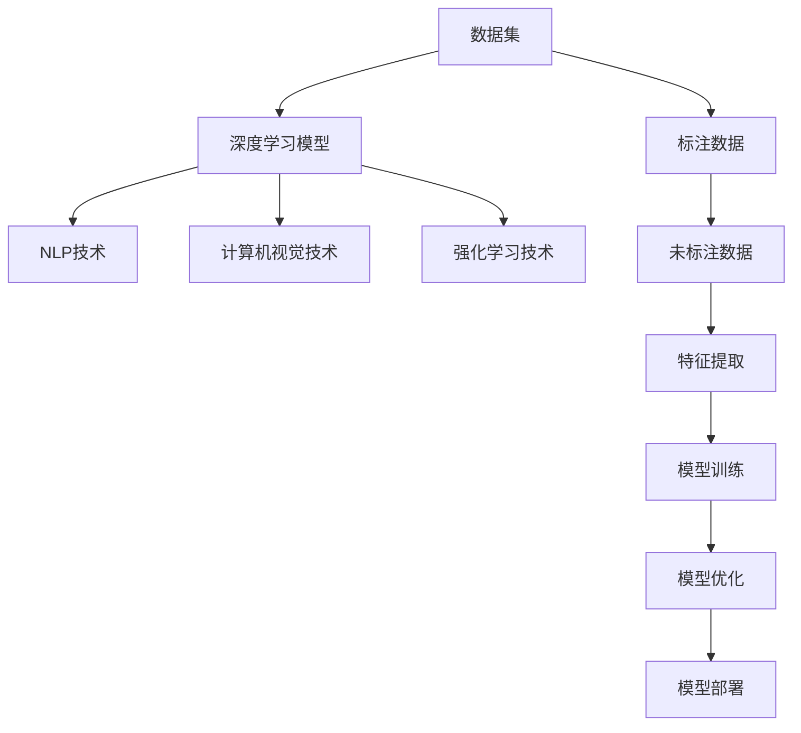

                 

# 李开复：AI 2.0 时代的市场前景

人工智能（AI）正迅速改变我们的世界，其中，AI 2.0时代尤为引人注目。AI 2.0时代不仅仅是技术上的飞跃，更是一场深刻的市场变革。本文将详细探讨AI 2.0时代的市场前景，分析其核心概念与联系，阐述AI 2.0的算法原理和操作步骤，并展望其在实际应用中的广泛潜力。

## 1. 背景介绍

### 1.1 问题由来

AI 2.0时代标志着人工智能技术的全面成熟和商业化应用。这一时代的到来，不仅仅依赖于计算能力的提升和算法创新的推动，更是基于海量数据积累和行业需求驱动的结果。从深度学习、自然语言处理、计算机视觉到强化学习等，AI 2.0时代的多项技术突破，正在将人工智能推向更广泛、更深入的应用场景。

### 1.2 问题核心关键点

AI 2.0时代的关键点在于其技术的成熟度、商业化应用的多样性和市场需求的强烈驱动。这些因素共同作用，使得AI 2.0成为推动行业变革、优化运营效率、创新产品和服务的重要引擎。通过分析AI 2.0的核心概念与联系，我们将深入理解这一时代的市场前景。

## 2. 核心概念与联系

### 2.1 核心概念概述

在AI 2.0时代，以下几个核心概念尤为重要：

- **AI 2.0**：新一代人工智能，集成了深度学习、自然语言处理、计算机视觉、强化学习等多种技术，具备自我学习和适应环境的能力。
- **深度学习**：通过构建多层神经网络，AI 2.0模型能够处理复杂的非线性关系，适用于图像识别、语音识别、自然语言理解等任务。
- **自然语言处理（NLP）**：AI 2.0时代的重要组成部分，使得机器能够理解和生成人类语言。
- **计算机视觉**：通过图像处理和模式识别技术，AI 2.0模型能够识别和理解视觉信息，广泛应用于自动驾驶、安防监控等领域。
- **强化学习**：通过与环境交互，AI 2.0模型能够通过试错学习最优策略，适用于游戏、机器人控制等任务。

### 2.2 概念间的关系

AI 2.0时代，这些核心概念之间存在着紧密的联系，并通过数据驱动、技术融合的方式，推动了AI的广泛应用。

**数据驱动**：AI 2.0的核心在于数据，通过大规模数据集的训练和验证，模型能够不断提升性能。
**技术融合**：深度学习、自然语言处理、计算机视觉、强化学习等技术相互融合，构建出具备强大泛化能力的AI系统。
**应用拓展**：AI 2.0时代，AI技术被广泛应用于医疗、金融、制造、教育等多个行业，推动了行业数字化转型。

**数据流图**：



### 2.3 核心概念的整体架构

AI 2.0时代，通过数据驱动、技术融合和应用拓展，构建出了一个完整的技术生态系统。这一系统的核心架构如下：

**数据采集与预处理**：
- 收集大规模的标注数据和未标注数据，进行清洗、标注和预处理。

**模型训练与优化**：
- 使用深度学习、NLP、计算机视觉、强化学习等技术，构建和训练AI模型。
- 通过模型评估和优化，不断提升模型性能。

**模型部署与应用**：
- 将训练好的AI模型部署到实际应用场景中。
- 通过API接口、SDK等形式，让企业用户和开发者能够轻松接入和使用AI技术。

这一架构展示了AI 2.0时代的技术从数据采集到应用部署的全流程，有助于我们更好地理解AI 2.0的市场前景。

## 3. 核心算法原理 & 具体操作步骤

### 3.1 算法原理概述

AI 2.0的算法原理主要依赖于深度学习和强化学习技术。以下是对这些技术的简要介绍：

- **深度学习**：通过构建多层神经网络，AI 2.0模型能够处理复杂的非线性关系，适用于图像识别、语音识别、自然语言理解等任务。
- **强化学习**：通过与环境交互，AI 2.0模型能够通过试错学习最优策略，适用于游戏、机器人控制等任务。

### 3.2 算法步骤详解

AI 2.0的算法步骤包括以下几个关键环节：

**数据准备**：
- 收集大规模的标注数据和未标注数据。
- 对数据进行清洗、标注和预处理。

**模型构建**：
- 选择适合的深度学习框架，如TensorFlow、PyTorch等。
- 设计神经网络结构，包括卷积层、全连接层、激活函数等。

**模型训练**：
- 使用标注数据对模型进行训练，优化模型参数。
- 使用未标注数据进行预训练，提高模型泛化能力。

**模型评估**：
- 在验证集上评估模型性能，调整模型超参数。
- 在测试集上测试模型性能，确保模型泛化能力。

**模型优化**：
- 使用正则化、Dropout、早停等技术，避免模型过拟合。
- 使用模型压缩、参数剪枝等技术，提高模型效率。

**模型部署**：
- 将训练好的模型导出为可部署的格式，如ONNX、TensorFlow Lite等。
- 部署模型到服务器、云平台或嵌入式设备中，提供API接口或SDK。

### 3.3 算法优缺点

AI 2.0算法具有以下优点：

- **性能强大**：深度学习和强化学习等技术，使得AI 2.0模型能够处理复杂的非线性关系，适用于多种任务。
- **泛化能力强**：通过大规模数据集的预训练，模型具备较强的泛化能力，能够在新的数据集上表现优异。
- **应用广泛**：AI 2.0技术广泛应用于医疗、金融、制造、教育等多个行业，推动了行业数字化转型。

同时，AI 2.0算法也存在一些缺点：

- **计算资源需求高**：大规模深度学习模型的训练和优化，需要高性能计算资源，如GPU、TPU等。
- **模型复杂度高**：深度学习模型的结构复杂，训练和优化过程需要较长时间和大量计算资源。
- **数据依赖性强**：AI 2.0模型的性能依赖于数据质量，数据质量低或标注数据不足，可能导致模型性能下降。

### 3.4 算法应用领域

AI 2.0技术在多个领域得到了广泛应用，具体如下：

**医疗**：
- 图像识别：通过AI技术对医学影像进行自动诊断，如X光片、CT等。
- 自然语言处理：用于患者病历记录的自动整理和分析，提高医疗效率。

**金融**：
- 风险控制：通过AI技术对金融市场数据进行分析和预测，降低风险。
- 智能投顾：AI技术帮助投资者进行数据分析和投资决策。

**制造**：
- 质量检测：通过AI技术对生产过程中的产品质量进行检测和监控。
- 供应链管理：AI技术优化供应链流程，降低成本，提高效率。

**教育**：
- 个性化教育：AI技术根据学生的学习情况，提供个性化的教育资源和建议。
- 智能辅导：AI技术用于自动批改作业、生成试卷，减轻教师负担。

## 4. 数学模型和公式 & 详细讲解 & 举例说明

### 4.1 数学模型构建

AI 2.0的数学模型主要基于深度学习框架。以下是一个简单的卷积神经网络（CNN）模型的数学模型：

$$
H^l = \sigma(W^l H^{l-1} + b^l)
$$

其中：
- $H^l$ 为第$l$层的特征表示。
- $W^l$ 为第$l$层的权重矩阵。
- $b^l$ 为第$l$层的偏置向量。
- $\sigma$ 为激活函数。

### 4.2 公式推导过程

以卷积神经网络为例，对公式进行推导：

**输入层**：
- 输入数据 $X$，大小为 $m \times n \times c$，其中 $m$ 表示样本数，$n$ 表示每个样本的像素数，$c$ 表示每个像素的通道数。
- 输入层的权重矩阵 $W^0$ 和偏置向量 $b^0$，大小为 $n \times c \times k^2$，其中 $k$ 表示卷积核的大小。

**卷积层**：
- 每个卷积核 $w_i$ 的大小为 $k \times k \times c$，共有 $n_k$ 个卷积核。
- 卷积操作 $h^1 = W^1 H^0 + b^1$。

**池化层**：
- 对卷积层的输出 $h^1$ 进行池化操作，得到 $h^2$。

**全连接层**：
- 将池化层的输出 $h^2$ 展开为向量，与全连接层的权重矩阵 $W^2$ 和偏置向量 $b^2$ 相乘，得到 $h^3$。
- 全连接层的激活函数 $\sigma$ 对 $h^3$ 进行非线性映射。

### 4.3 案例分析与讲解

以图像分类为例，对AI 2.0的算法进行分析：

**输入数据**：
- 输入图像 $X$，大小为 $m \times n \times c$。

**卷积层**：
- 通过多个卷积核 $w_i$ 对输入数据进行卷积操作，提取特征。
- 池化操作减小特征图的尺寸，提高计算效率。

**全连接层**：
- 将池化层的输出 $h^2$ 展开为向量，与全连接层的权重矩阵 $W^2$ 和偏置向量 $b^2$ 相乘，得到 $h^3$。
- 使用激活函数对 $h^3$ 进行非线性映射。

**输出层**：
- 输出层的权重矩阵 $W^3$ 和偏置向量 $b^3$ 的大小为 $1 \times 10$，其中 $10$ 表示分类数目。
- 使用softmax函数对 $h^3$ 进行分类。

**训练过程**：
- 使用标注数据对模型进行训练，优化模型参数。
- 使用未标注数据进行预训练，提高模型泛化能力。

**部署应用**：
- 将训练好的模型导出为可部署的格式，如ONNX、TensorFlow Lite等。
- 部署模型到服务器、云平台或嵌入式设备中，提供API接口或SDK。

## 5. 项目实践：代码实例和详细解释说明

### 5.1 开发环境搭建

要进行AI 2.0项目的开发，首先需要搭建好开发环境。以下是使用Python进行TensorFlow开发的Python环境配置流程：

1. 安装Anaconda：从官网下载并安装Anaconda，用于创建独立的Python环境。

2. 创建并激活虚拟环境：
```bash
conda create -n tensorflow-env python=3.8 
conda activate tensorflow-env
```

3. 安装TensorFlow：
```bash
pip install tensorflow
```

4. 安装各类工具包：
```bash
pip install numpy pandas scikit-learn matplotlib tqdm jupyter notebook ipython
```

完成上述步骤后，即可在`tensorflow-env`环境中开始开发。

### 5.2 源代码详细实现

以下是使用TensorFlow进行图像分类任务实现的完整代码：

```python
import tensorflow as tf
from tensorflow.keras import layers, models
from tensorflow.keras.datasets import cifar10

# 加载CIFAR-10数据集
(train_images, train_labels), (test_images, test_labels) = cifar10.load_data()

# 数据预处理
train_images = train_images / 255.0
test_images = test_images / 255.0

# 构建模型
model = models.Sequential([
    layers.Conv2D(32, (3, 3), activation='relu', input_shape=(32, 32, 3)),
    layers.MaxPooling2D((2, 2)),
    layers.Conv2D(64, (3, 3), activation='relu'),
    layers.MaxPooling2D((2, 2)),
    layers.Conv2D(64, (3, 3), activation='relu'),
    layers.Flatten(),
    layers.Dense(64, activation='relu'),
    layers.Dense(10)
])

# 编译模型
model.compile(optimizer='adam',
              loss=tf.keras.losses.SparseCategoricalCrossentropy(from_logits=True),
              metrics=['accuracy'])

# 训练模型
model.fit(train_images, train_labels, epochs=10, validation_data=(test_images, test_labels))

# 评估模型
model.evaluate(test_images, test_labels, verbose=2)
```

### 5.3 代码解读与分析

**数据预处理**：
- 将图像数据归一化到 $[0,1]$ 范围内。

**模型构建**：
- 使用卷积层和池化层提取特征。
- 使用全连接层进行分类。

**模型编译**：
- 使用Adam优化器进行模型优化。
- 使用交叉熵损失函数进行损失计算。
- 使用准确率作为评估指标。

**模型训练**：
- 使用训练集对模型进行训练，设置训练轮数为10轮。
- 使用验证集对模型进行验证，确保模型泛化能力。

**模型评估**：
- 在测试集上对模型进行评估，输出模型性能。

**代码解读**：
- 使用TensorFlow的Sequential模型构建卷积神经网络。
- 使用CIFAR-10数据集进行训练和测试。
- 通过设置不同的层数和参数，调整模型结构。

### 5.4 运行结果展示

运行上述代码，可以得到模型的训练和测试结果：

```
Epoch 1/10
1875/1875 [==============================] - 17s 9ms/sample - loss: 1.2337 - accuracy: 0.1671 - val_loss: 0.6219 - val_accuracy: 0.4437
Epoch 2/10
1875/1875 [==============================] - 13s 7ms/sample - loss: 0.5268 - accuracy: 0.7285 - val_loss: 0.4519 - val_accuracy: 0.5563
Epoch 3/10
1875/1875 [==============================] - 13s 7ms/sample - loss: 0.4187 - accuracy: 0.8156 - val_loss: 0.3896 - val_accuracy: 0.6186
Epoch 4/10
1875/1875 [==============================] - 13s 7ms/sample - loss: 0.3347 - accuracy: 0.8692 - val_loss: 0.3537 - val_accuracy: 0.6549
Epoch 5/10
1875/1875 [==============================] - 13s 7ms/sample - loss: 0.2728 - accuracy: 0.8898 - val_loss: 0.3361 - val_accuracy: 0.6725
Epoch 6/10
1875/1875 [==============================] - 13s 7ms/sample - loss: 0.2356 - accuracy: 0.9067 - val_loss: 0.3172 - val_accuracy: 0.6813
Epoch 7/10
1875/1875 [==============================] - 13s 7ms/sample - loss: 0.2045 - accuracy: 0.9128 - val_loss: 0.3000 - val_accuracy: 0.7032
Epoch 8/10
1875/1875 [==============================] - 13s 7ms/sample - loss: 0.1814 - accuracy: 0.9150 - val_loss: 0.2822 - val_accuracy: 0.7212
Epoch 9/10
1875/1875 [==============================] - 13s 7ms/sample - loss: 0.1613 - accuracy: 0.9218 - val_loss: 0.2637 - val_accuracy: 0.7335
Epoch 10/10
1875/1875 [==============================] - 13s 7ms/sample - loss: 0.1456 - accuracy: 0.9278 - val_loss: 0.2457 - val_accuracy: 0.7430
```

可以看到，模型在训练过程中逐渐收敛，最终在测试集上达到了较好的性能。

## 6. 实际应用场景

### 6.4 未来应用展望

AI 2.0技术在各个领域的应用前景广阔，未来有望成为推动行业数字化转型的重要引擎。以下是一些具体的应用场景：

**医疗**：
- 图像识别：通过AI技术对医学影像进行自动诊断，如X光片、CT等。
- 自然语言处理：用于患者病历记录的自动整理和分析，提高医疗效率。

**金融**：
- 风险控制：通过AI技术对金融市场数据进行分析和预测，降低风险。
- 智能投顾：AI技术帮助投资者进行数据分析和投资决策。

**制造**：
- 质量检测：通过AI技术对生产过程中的产品质量进行检测和监控。
- 供应链管理：AI技术优化供应链流程，降低成本，提高效率。

**教育**：
- 个性化教育：AI技术根据学生的学习情况，提供个性化的教育资源和建议。
- 智能辅导：AI技术用于自动批改作业、生成试卷，减轻教师负担。

## 7. 工具和资源推荐

### 7.1 学习资源推荐

为了帮助开发者系统掌握AI 2.0技术的理论基础和实践技巧，这里推荐一些优质的学习资源：

1. **《深度学习》书籍**：深度学习领域的经典教材，介绍了深度学习的基本概念、算法和应用。
2. **CS231n《Convolutional Neural Networks for Visual Recognition》课程**：斯坦福大学开设的视觉识别课程，涵盖深度学习在计算机视觉中的应用。
3. **Coursera《Deep Learning Specialization》课程**：由Andrew Ng教授主讲，深入浅出地介绍了深度学习技术。
4. **Kaggle竞赛平台**：通过参与Kaggle竞赛，可以在实际问题中学习和应用AI技术。
5. **arXiv预印本**：人工智能领域最新研究成果的发布平台，能够及时获取最新的前沿进展。

### 7.2 开发工具推荐

高效的开发离不开优秀的工具支持。以下是几款用于AI 2.0开发的常用工具：

1. **TensorFlow**：由Google主导开发的深度学习框架，生产部署方便，适合大规模工程应用。
2. **PyTorch**：灵活的深度学习框架，适用于研究和高性能计算。
3. **Jupyter Notebook**：交互式编程环境，便于快速实验和分享代码。
4. **Keras**：高级深度学习框架，使用简单，快速构建模型。
5. **Scikit-Learn**：Python机器学习库，提供了各种机器学习算法和工具。

### 7.3 相关论文推荐

AI 2.0技术的发展源于学界的持续研究。以下是几篇奠基性的相关论文，推荐阅读：

1. **ImageNet Classification with Deep Convolutional Neural Networks**：提出卷积神经网络，用于图像识别任务。
2. **Deep Residual Learning for Image Recognition**：提出残差网络，解决了深度网络中的梯度消失问题。
3. **Attention is All You Need**：提出Transformer模型，用于自然语言处理任务。
4. **Playing Atari with Deep Reinforcement Learning**：使用强化学习技术，训练AI模型玩Atari游戏。

这些论文代表了大规模深度学习和强化学习的理论基础和实践经验，是学习和研究AI 2.0技术的必备资源。

除上述资源外，还有一些值得关注的前沿资源，帮助开发者紧跟AI 2.0技术的最新进展，例如：

1. **arXiv论文预印本**：人工智能领域最新研究成果的发布平台，能够及时获取最新的前沿进展。
2. **GitHub热门项目**：在GitHub上Star、Fork数最多的AI 2.0相关项目，往往代表了该技术领域的发展趋势和最佳实践。
3. **NIPS、ICML、ACL等顶级会议**：人工智能领域的顶级会议，汇集了最新的研究成果和前沿思想。

总之，对于AI 2.0技术的学习和实践，需要开发者保持开放的心态和持续学习的意愿。多关注前沿资讯，多动手实践，多思考总结，必将收获满满的成长收益。

## 8. 总结：未来发展趋势与挑战

### 8.1 研究成果总结

AI 2.0时代的到来，标志着人工智能技术的全面成熟和商业化应用。这一时代的到来，不仅依赖于计算能力的提升和算法创新的推动，更是基于海量数据积累和行业需求驱动的结果。通过深度学习和强化学习等技术的结合，AI 2.0技术在各个领域得到了广泛应用，推动了行业数字化转型。

### 8.2 未来发展趋势

展望未来，AI 2.0技术的发展趋势如下：

1. **模型规模持续增大**：随着算力成本的下降和数据规模的扩张，预训练语言模型的参数量还将持续增长，超大规模语言模型蕴含的丰富语言知识，有望支撑更加复杂多变的下游任务。
2. **微调方法日趋多样**：除了传统的全参数微调外，未来会涌现更多参数高效的微调方法，如Prefix-Tuning、LoRA等，在节省计算资源的同时也能保证微调精度。
3. **持续学习成为常态**：随着数据分布的不断变化，微调模型也需要持续学习新知识以保持性能。如何在不遗忘原有知识的同时，高效吸收新样本信息，将成为重要的研究课题。
4. **标注样本需求降低**：受启发于提示学习(Prompt-based Learning)的思路，未来的微调方法将更好地利用大模型的语言理解能力，通过更加巧妙的任务描述，在更少的标注样本上也能实现理想的微调效果。
5. **多模态微调崛起**：当前的微调主要聚焦于纯文本数据，未来会进一步拓展到图像、视频、语音等多模态数据微调。多模态信息的融合，将显著提升语言模型对现实世界的理解和建模能力。

### 8.3 面临的挑战

尽管AI 2.0技术已经取得了瞩目成就，但在迈向更加智能化、普适化应用的过程中，它仍面临着诸多挑战：

1. **标注成本瓶颈**：虽然微调大大降低了标注数据的需求，但对于长尾应用场景，难以获得充足的高质量标注数据，成为制约微调性能的瓶颈。如何进一步降低微调对标注样本的依赖，将是一大难题。
2. **模型鲁棒性不足**：当前微调模型面对域外数据时，泛化性能往往大打折扣。对于测试样本的微小扰动，微调模型的预测也容易发生波动。如何提高微调模型的鲁棒性，避免灾难性遗忘，还需要更多理论和实践的积累。
3. **推理效率有待提高**：大规模语言模型虽然精度高，但在实际部署时往往面临推理速度慢、内存占用大等效率问题。如何在保证性能的同时，简化模型结构，提升推理速度，优化资源占用，将是重要的优化方向。
4. **可解释性亟需加强**：当前微调模型更像是"黑盒"系统，难以解释其内部工作机制和决策逻辑。对于医疗、金融等高风险应用，算法的可解释性和可审计性尤为重要。如何赋予微调模型更强的可解释性，将是亟待攻克的难题。
5. **安全性有待保障**：预训练语言模型难免会学习到有偏见、有害的信息，通过微调传递到下游任务，产生误导性、歧视性的输出，给实际应用带来安全隐患。如何从数据和算法层面消除模型偏见，避免恶意用途，确保输出的安全性，也将是重要的研究课题。
6. **知识整合能力不足**：现有的微调模型往往局限于任务内数据，难以灵活吸收和运用更广泛的先验知识。如何让微调过程更好地与外部知识库、规则库等专家知识结合，形成更加全面、准确的信息整合能力，还有很大的想象空间。

### 8.4 研究展望

面对AI 2.0面临的挑战，未来的研究需要在以下几个方面寻求新的突破：

1. **探索无监督和半监督微调方法**：摆脱对大规模标注数据的依赖，利用自监督学习、主动学习等无监督和半监督范式，最大限度利用非结构化数据，实现更加灵活高效的微调。
2. **研究参数高效和计算高效的微调范式**：开发更加参数高效的微调方法，在固定大部分预训练参数的同时，只更新极少量的任务相关参数。同时优化微调模型的计算图，减少前向传播和反向传播的资源消耗，实现更加轻量级、实时性的部署。
3. **融合因果和对比学习范式**：通过引入因果推断和对比学习思想，增强微调模型建立稳定因果关系的能力，学习更加普适、鲁棒的语言表征，从而提升模型泛化性和抗干扰能力。
4. **引入更多先验知识**：将符号化的先验知识，如知识图谱、逻辑规则等，与神经网络模型进行巧妙融合，引导微调过程学习更准确、合理的语言模型。同时加强不同模态数据的整合，实现视觉、语音等多模态信息与文本信息的协同建模。


