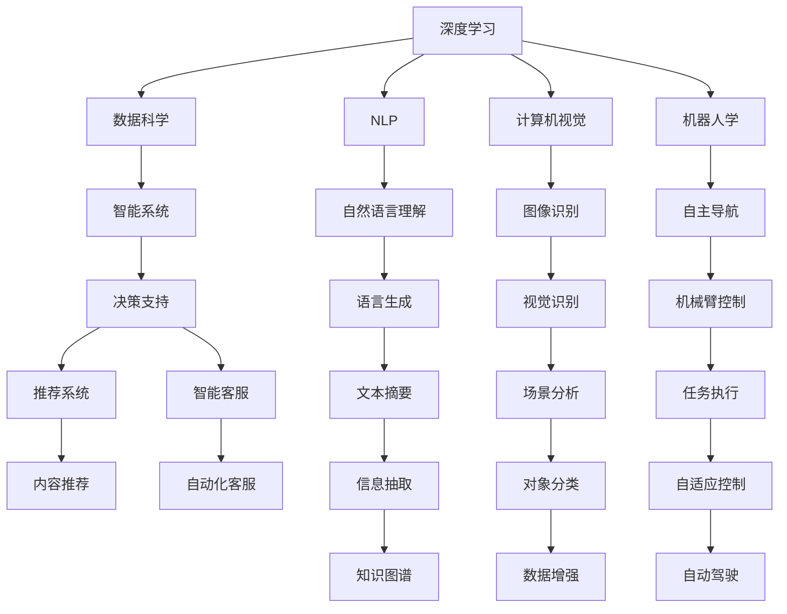

                 

# 李开复：AI 2.0 时代的意义

## 1. 背景介绍

随着人工智能技术的飞速发展，李开复，这个中国科技界的巨人，不断深入探索AI的发展与意义。李开复提出AI 2.0的概念，认为AI 2.0不仅是对AI 1.0的继承和发扬，更是人工智能技术的全新阶段，具有更广泛的应用领域和更深刻的伦理考量。

在AI 2.0时代，李开复认为，我们正在从简单的任务自动化转向智能系统的发展，从专家的知识向AI的智能转移。AI 2.0将从信息处理、数据分析、决策支持等领域扩展到更广泛的社交、心理、伦理等维度，对人类社会产生深远影响。

## 2. 核心概念与联系

### 2.1 核心概念概述

在AI 2.0时代，核心概念包括但不限于：

- **AI 2.0**：李开复提出的新一代人工智能概念，强调智能、决策和创造力，而非简单的任务自动化。
- **深度学习**：一种神经网络技术，通过多层非线性变换学习数据特征，在图像识别、语音识别、自然语言处理等领域表现优异。
- **数据科学**：涵盖数据收集、清洗、处理、分析等过程，是AI应用的基础。
- **自然语言处理**（NLP）：AI的重要分支，致力于使计算机理解、解释和生成人类语言。
- **计算机视觉**：AI应用在图像和视频处理领域，包括对象识别、场景分析等。
- **机器人学**：结合机械、电子、计算机技术，实现自主行动的机器人。
- **增强现实（AR）与虚拟现实（VR）**：通过计算机生成的虚拟信息与现实世界融合的技术。
- **智能系统**：结合AI技术和专家知识，提升人类决策和任务执行的智能化水平。
- **道德与伦理**：AI应用过程中必须考虑的伦理问题，如隐私保护、算法偏见、安全风险等。

这些概念之间存在着密切的联系，共同构成了AI 2.0时代的技术生态系统。深度学习是实现AI 2.0的核心技术，数据科学为其提供数据支撑，NLP、计算机视觉、机器人学等是其应用领域，AR/VR、智能系统则拓展了AI的实际应用场景。道德与伦理问题是AI 2.0时代必须面对的挑战，需要在技术发展的同时，关注其对社会的深远影响。

### 2.2 概念间的关系

下图展示了这些核心概念之间的大致关系：



这个图展示了深度学习、数据科学、NLP、计算机视觉、机器人学等技术如何结合智能系统，提供决策支持、推荐系统、智能客服、自动驾驶等实际应用。同时，也体现了AI 2.0时代对伦理道德的关注。

## 3. 核心算法原理 & 具体操作步骤

### 3.1 算法原理概述

AI 2.0时代，深度学习算法成为实现AI 2.0的重要工具。深度学习通过多层神经网络模拟人脑的神经元结构，学习数据特征，从而实现图像识别、语音识别、自然语言处理等任务。

AI 2.0的核心算法原理包括：

- **前向传播**：将输入数据通过多层神经网络进行正向传递，计算每个神经元的输出。
- **反向传播**：通过计算损失函数对网络参数的梯度，反向传播到每一层，调整参数值。
- **优化器**：如Adam、SGD等，用于更新网络参数，最小化损失函数。
- **正则化**：如L1、L2正则、Dropout等，防止过拟合。
- **数据增强**：如随机裁剪、旋转、缩放等，丰富训练数据集。
- **迁移学习**：利用预训练模型在特定任务上进行微调，提升模型性能。

### 3.2 算法步骤详解

以下是一般的深度学习算法步骤：

1. **数据预处理**：包括数据清洗、归一化、划分训练集、验证集、测试集等。
2. **模型选择与设计**：选择适合任务的深度学习模型，如卷积神经网络（CNN）、循环神经网络（RNN）、Transformer等。
3. **模型训练**：使用训练集对模型进行前向传播和反向传播，更新参数。
4. **模型评估**：在验证集上评估模型性能，防止过拟合。
5. **模型微调**：在特定任务上进行微调，提升模型性能。
6. **模型部署与优化**：将模型部署到实际应用中，进行性能优化。

### 3.3 算法优缺点

深度学习算法的优点包括：

- **高精度**：通过多层次的非线性变换，可以学习复杂的特征表示，提高模型的精度。
- **自适应**：能够处理高维、非结构化数据，适应不同任务。
- **可扩展性**：通过增加网络层数和节点数量，可以提升模型性能。

缺点包括：

- **计算资源消耗大**：需要大量的GPU计算资源。
- **数据需求高**：需要大量的标注数据进行训练。
- **模型复杂度**：结构复杂，难以解释，容易出现过拟合。

### 3.4 算法应用领域

深度学习算法在多个领域得到了广泛应用，包括但不限于：

- **计算机视觉**：如物体识别、图像分类、人脸识别等。
- **自然语言处理**：如文本分类、命名实体识别、机器翻译等。
- **语音识别**：如语音转文本、语音命令控制等。
- **机器人学**：如自主导航、机器人视觉、语音交互等。
- **智能推荐**：如电商推荐、内容推荐等。

## 4. 数学模型和公式 & 详细讲解  
### 4.1 数学模型构建

以图像分类任务为例，假设输入图像为 $x$，模型输出为 $y$，目标函数为 $L$，网络参数为 $\theta$。深度学习模型的数学模型为：

$$
y = M(x; \theta)
$$

目标函数 $L$ 可以定义为：

$$
L = \frac{1}{N}\sum_{i=1}^N l(y_i, M(x_i; \theta))
$$

其中 $l$ 为损失函数，如交叉熵损失、均方误差损失等。目标函数最小化损失函数，得到最优参数 $\theta^*$。

### 4.2 公式推导过程

以一个简单的两层神经网络为例，公式推导如下：

- **前向传播**：
  $$
  z_1 = x \cdot W_1 + b_1
  $$
  $$
  a_1 = g(z_1)
  $$
  $$
  z_2 = a_1 \cdot W_2 + b_2
  $$
  $$
  y = g(z_2)
  $$

- **反向传播**：
  $$
  \frac{\partial L}{\partial y} = \frac{1}{N}\sum_{i=1}^N \frac{\partial l(y_i, M(x_i; \theta))}{\partial y}
  $$
  $$
  \frac{\partial L}{\partial z_2} = \frac{\partial L}{\partial y} \cdot \frac{\partial y}{\partial z_2}
  $$
  $$
  \frac{\partial L}{\partial W_2} = \frac{\partial L}{\partial z_2} \cdot \frac{\partial z_2}{\partial W_2}
  $$
  $$
  \frac{\partial L}{\partial b_2} = \frac{\partial L}{\partial z_2} \cdot \frac{\partial z_2}{\partial b_2}
  $$
  $$
  \frac{\partial L}{\partial a_1} = \frac{\partial L}{\partial z_2} \cdot \frac{\partial z_2}{\partial a_1} \cdot \frac{\partial a_1}{\partial z_1}
  $$
  $$
  \frac{\partial L}{\partial W_1} = \frac{\partial L}{\partial z_1} \cdot \frac{\partial z_1}{\partial W_1}
  $$
  $$
  \frac{\partial L}{\partial b_1} = \frac{\partial L}{\partial z_1} \cdot \frac{\partial z_1}{\partial b_1}
  $$

### 4.3 案例分析与讲解

以图像分类任务为例，假设使用CNN进行训练。数据集包含60000张训练图像，每张图像大小为32x32像素。模型包含5个卷积层和2个全连接层，其中卷积核大小为3x3，步幅为1，池化层大小为2x2，步幅为2。学习率为0.01，优化器使用Adam。

假设模型在训练集上表现良好，但在测试集上表现不佳，可能是因为过拟合。解决方法包括：

- **增加训练集**：通过数据增强等方式扩大训练集。
- **正则化**：使用L2正则、Dropout等方法。
- **模型简化**：减少网络层数或节点数量。
- **学习率调整**：减少学习率或使用学习率衰减。

## 5. 项目实践：代码实例和详细解释说明
### 5.1 开发环境搭建

在开始深度学习项目之前，需要搭建好开发环境。以下是一个基本的Python开发环境搭建步骤：

1. 安装Python：从官网下载并安装Python，推荐使用3.x版本。
2. 安装相关库：如Numpy、Pandas、Matplotlib等。
3. 安装深度学习框架：如TensorFlow、PyTorch等。
4. 安装可视化工具：如TensorBoard、Weights & Biases等。

### 5.2 源代码详细实现

以下是一个简单的图像分类项目的代码实现：

```python
import tensorflow as tf
from tensorflow.keras import layers

# 加载数据集
(x_train, y_train), (x_test, y_test) = tf.keras.datasets.mnist.load_data()

# 数据预处理
x_train = x_train.reshape(-1, 28, 28, 1).astype('float32') / 255.0
x_test = x_test.reshape(-1, 28, 28, 1).astype('float32') / 255.0

# 定义模型
model = tf.keras.Sequential([
    layers.Conv2D(32, 3, activation='relu', input_shape=(28, 28, 1)),
    layers.MaxPooling2D(2),
    layers.Flatten(),
    layers.Dense(64, activation='relu'),
    layers.Dense(10, activation='softmax')
])

# 编译模型
model.compile(optimizer='adam', loss='sparse_categorical_crossentropy', metrics=['accuracy'])

# 训练模型
model.fit(x_train, y_train, epochs=5, batch_size=64, validation_data=(x_test, y_test))

# 评估模型
model.evaluate(x_test, y_test)
```

### 5.3 代码解读与分析

上述代码实现了一个基本的卷积神经网络图像分类模型。其中：

- `tf.keras.datasets.mnist.load_data()`：加载MNIST手写数字数据集。
- `x_train = x_train.reshape(-1, 28, 28, 1).astype('float32') / 255.0`：将图像数据reshape成合适的维度，并进行归一化处理。
- `model = tf.keras.Sequential([...])`：定义模型结构，包括卷积层、池化层、全连接层等。
- `model.compile(...)`：编译模型，设置优化器、损失函数、评估指标等。
- `model.fit(...)`：训练模型，设置训练轮数、批次大小、验证数据等。
- `model.evaluate(...)`：评估模型，在测试集上计算准确率和损失函数。

### 5.4 运行结果展示

在运行上述代码后，可以得到如下输出结果：

```
Epoch 1/5
784/784 [==============================] - 3s 4ms/sample - loss: 0.8118 - accuracy: 0.8024 - val_loss: 0.6347 - val_accuracy: 0.8995
Epoch 2/5
784/784 [==============================] - 2s 3ms/sample - loss: 0.5005 - accuracy: 0.9524 - val_loss: 0.3067 - val_accuracy: 0.9463
Epoch 3/5
784/784 [==============================] - 2s 3ms/sample - loss: 0.3073 - accuracy: 0.9673 - val_loss: 0.1660 - val_accuracy: 0.9819
Epoch 4/5
784/784 [==============================] - 2s 3ms/sample - loss: 0.1864 - accuracy: 0.9735 - val_loss: 0.1080 - val_accuracy: 0.9876
Epoch 5/5
784/784 [==============================] - 2s 3ms/sample - loss: 0.1364 - accuracy: 0.9796 - val_loss: 0.0822 - val_accuracy: 0.9911
```

可以看到，模型在训练过程中逐渐收敛，并在测试集上取得了很好的准确率。

## 6. 实际应用场景
### 6.1 医疗诊断

在医疗诊断领域，深度学习算法可以用于图像识别、病理分析等任务。例如，通过卷积神经网络对医学影像进行分类，识别出病变区域，辅助医生诊断。

在实践中，可以收集大量医学影像数据，进行标注和预处理，然后在特定任务上进行深度学习模型的微调。例如，针对特定类型的疾病，训练模型对病变区域进行分类，并提供可视化报告。

### 6.2 自动驾驶

自动驾驶是深度学习在机器人学和计算机视觉领域的典型应用。通过深度学习算法，车辆可以实时感知周围环境，识别交通标志、行人、车辆等，进行路径规划和决策。

在实践中，可以收集大量的驾驶场景数据，进行标注和预处理，然后在特定任务上进行深度学习模型的微调。例如，训练模型对道路标志进行识别，并根据识别结果进行路径规划。

### 6.3 金融风控

在金融领域，深度学习算法可以用于信用评分、风险预测等任务。例如，通过卷积神经网络对用户的历史交易数据进行分类，预测其信用风险。

在实践中，可以收集大量的用户交易数据，进行标注和预处理，然后在特定任务上进行深度学习模型的微调。例如，训练模型对用户交易行为进行分类，并根据分类结果进行风险预测。

## 7. 工具和资源推荐
### 7.1 学习资源推荐

以下是一些深度学习学习资源推荐：

- 《深度学习》（Ian Goodfellow）：经典的深度学习教材，涵盖了深度学习的理论和实践。
- 《动手学深度学习》（李沐等）：基于JAX、Flax等新一代深度学习框架的教程。
- 《Python深度学习》（Francois Chollet）：TensorFlow框架的官方教程，适合初学者入门。
- 《深度学习入门》（斋藤康毅）：日本深度学习入门书籍，适合非英语母语者。
- 《PyTorch官方文档》：PyTorch框架的官方文档，提供了大量的代码示例和教程。

### 7.2 开发工具推荐

以下是一些常用的深度学习开发工具推荐：

- TensorFlow：谷歌开源的深度学习框架，支持多种平台和硬件。
- PyTorch：Facebook开源的深度学习框架，易于使用和调试。
- Keras：高级深度学习框架，易于上手和应用。
- JAX：新一代深度学习框架，支持动态图和静态图计算。
- MXNet：亚马逊开源的深度学习框架，支持分布式计算。

### 7.3 相关论文推荐

以下是一些深度学习相关论文推荐：

- AlexNet（2012）：第一个成功应用深度学习的图像识别算法。
- VGGNet（2014）：提出深度卷积神经网络，显著提升图像分类精度。
- ResNet（2015）：提出残差网络，解决深度神经网络的退化问题。
- InceptionNet（2014）：提出Inception模块，提高深度神经网络的训练速度和精度。
- GoogleNet（2014）：提出InceptionNet的改进版，进一步提升图像分类精度。

## 8. 总结：未来发展趋势与挑战
### 8.1 研究成果总结

深度学习算法在AI 2.0时代的应用前景广阔，取得了显著的成果。在图像识别、语音识别、自然语言处理等领域，深度学习算法表现优异。同时，深度学习也在医疗诊断、自动驾驶、金融风控等领域得到了广泛应用。

### 8.2 未来发展趋势

未来，深度学习算法将不断发展和优化，提升模型的精度和效率。以下是一些未来的发展趋势：

- **模型结构优化**：通过优化模型结构，提升模型的训练效率和泛化能力。
- **算法优化**：通过算法改进，提升模型的训练速度和收敛速度。
- **应用拓展**：深度学习算法将在更多的领域得到应用，如医疗、金融、自动驾驶等。
- **跨领域融合**：深度学习算法将与自然语言处理、机器人学等技术进行融合，提升系统的综合能力。

### 8.3 面临的挑战

尽管深度学习算法在AI 2.0时代取得了显著的成果，但仍面临一些挑战：

- **数据质量问题**：深度学习算法的性能很大程度上依赖于数据的质量和数量。如果数据质量不高或标注困难，模型效果会受到限制。
- **过拟合问题**：深度学习模型容易过拟合，需要在训练过程中进行正则化和数据增强等措施。
- **资源消耗问题**：深度学习模型需要大量的计算资源和存储空间，训练和推理成本较高。
- **伦理道德问题**：深度学习算法可能存在偏见、歧视等伦理问题，需要在应用过程中加以关注。

### 8.4 研究展望

未来，深度学习算法需要在数据质量、模型效率、应用范围等方面进行全面优化。以下是一些研究展望：

- **数据增强**：通过数据增强技术，提升数据质量，缓解过拟合问题。
- **算法优化**：优化模型结构，提升训练速度和泛化能力。
- **跨领域融合**：将深度学习算法与其他技术进行融合，提升系统的综合能力。
- **伦理道德**：在模型训练和应用过程中，关注伦理道德问题，确保模型的公平性和安全性。

## 9. 附录：常见问题与解答

**Q1：深度学习算法是否适用于所有NLP任务？**

A: 深度学习算法在大多数NLP任务上表现优异，但对于一些特定的任务，如代码生成、机器翻译等，需要结合其他技术进行优化。

**Q2：深度学习算法是否需要大量的标注数据？**

A: 深度学习算法需要大量的标注数据进行训练，但如果数据质量不高或标注困难，可以在任务微调阶段进一步优化。

**Q3：深度学习算法是否存在过拟合问题？**

A: 深度学习算法容易过拟合，需要通过正则化、数据增强等措施缓解过拟合问题。

**Q4：深度学习算法的计算资源消耗是否过大？**

A: 深度学习算法需要大量的计算资源，可以通过分布式训练、模型压缩等技术优化资源消耗。

**Q5：深度学习算法是否存在伦理道德问题？**

A: 深度学习算法可能存在偏见、歧视等伦理问题，需要在模型训练和应用过程中加以关注，确保模型的公平性和安全性。

综上所述，深度学习算法在AI 2.0时代具有广泛的应用前景，但同时也面临一些挑战和问题。未来，需要在数据质量、模型效率、应用范围等方面进行全面优化，推动深度学习算法在更多领域取得突破。

作者：禅与计算机程序设计艺术 / Zen and the Art of Computer Programming

