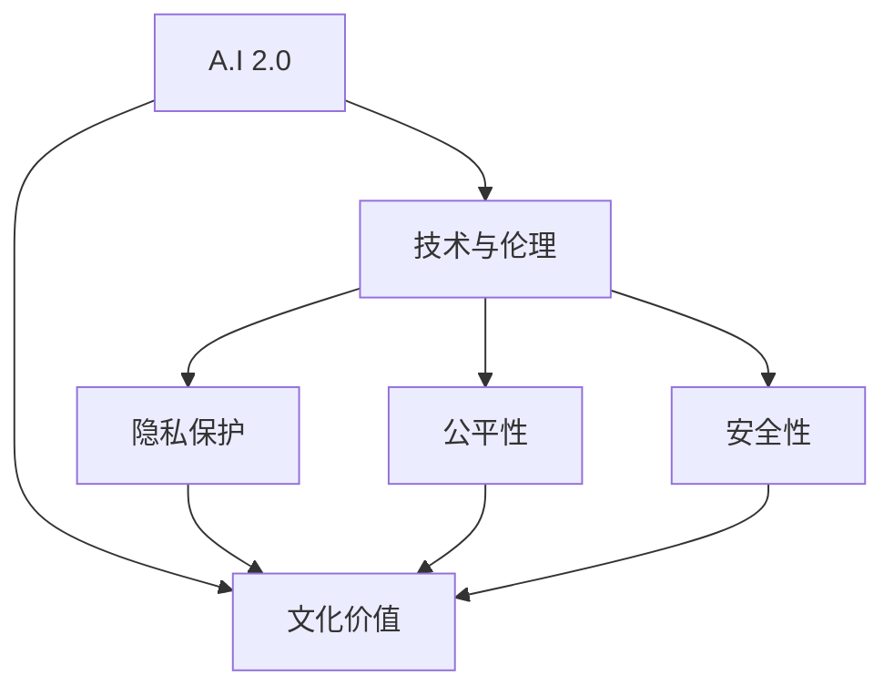

                 

# 李开复：AI 2.0 时代的文化价值

在科技日新月异的今天，人工智能（AI）正以惊人的速度发展和普及，引发了广泛的社会关注和讨论。李开复博士作为全球领先的AI专家，对AI的未来趋势和文化价值有着深刻的见解。本文将深入探讨李开复博士在AI 2.0时代的文化价值方面的思考，结合其在技术和伦理两个维度上的阐述，全面分析AI技术如何塑造未来社会，并提出应对挑战的建议。

## 1. 背景介绍

### 1.1 李开复博士的AI生涯

李开复博士是全球著名的AI专家，曾在微软、谷歌、亚马逊等公司担任高管，并在2011年创立了创新工场，致力于AI和互联网技术创业。他不仅在技术领域有着深厚的积累，而且在伦理和社会责任方面也有独到的见解。

### 1.2 AI 2.0时代背景

AI 2.0时代，以深度学习、自然语言处理、计算机视觉等为代表的AI技术已经广泛应用于各个领域，带来了生产力的大幅提升和业务的智能化转型。AI技术正在从实验室走向实际应用，从辅助人完成特定任务，转向与人类协同工作的方向发展。

## 2. 核心概念与联系

### 2.1 核心概念概述

- **AI 2.0**：指AI技术发展到第二代，即以深度学习为核心的AI技术，具有强大的自我学习和适应能力。
- **文化价值**：指AI技术在推动社会进步、提高人类生活质量、促进文化交流等方面的价值和影响。
- **技术与伦理**：指AI技术在提升效率和创造价值的同时，也需要面对隐私、安全、公平等伦理问题。

### 2.2 核心概念间的关系

AI 2.0作为一项重要的技术手段，对社会文化产生了深远的影响。它不仅推动了科技的发展，还带来了新的经济模式、教育方式和文化交流途径。然而，技术发展的同时，也伴随着伦理和道德的挑战，需要我们在享受AI带来便利的同时，关注和解决其中的问题。

通过以下Mermaid流程图，我们可以更直观地理解AI 2.0与文化价值、技术与伦理之间的关系：



## 3. 核心算法原理 & 具体操作步骤

### 3.1 算法原理概述

AI 2.0的核心算法原理是深度学习，通过大量数据的训练，模型可以自动学习特征，实现分类、预测、生成等任务。AI 2.0的文化价值在于其对社会的广泛影响，如提升工作效率、推动医疗进步、促进文化交流等。而技术与伦理的关系，则体现在如何合理应用AI，避免侵犯隐私、维护公平公正、确保数据安全等方面。

### 3.2 算法步骤详解

1. **数据准备**：收集和整理数据，确保数据的多样性和代表性。
2. **模型训练**：使用深度学习框架训练模型，优化超参数，提升模型性能。
3. **模型评估**：在验证集上评估模型效果，选择最佳模型。
4. **模型部署**：将模型集成到实际应用中，进行持续优化和迭代。

### 3.3 算法优缺点

**优点**：
- **高效性**：AI 2.0可以自动学习特征，处理大量数据，提高工作效率。
- **泛化能力**：深度学习模型具有较强的泛化能力，可以应用于多种任务。
- **创新能力**：AI 2.0带来了新的商业模式和技术创新，推动了经济和社会发展。

**缺点**：
- **黑箱问题**：深度学习模型通常是"黑箱"，难以解释其内部工作机制。
- **数据依赖**：AI 2.0对数据质量有高要求，数据偏差可能影响模型性能。
- **伦理挑战**：AI 2.0的应用涉及隐私、安全、公平等伦理问题。

### 3.4 算法应用领域

AI 2.0在医疗、教育、金融、交通、娱乐等多个领域都有广泛应用：
- **医疗**：辅助诊断、个性化治疗、药物研发等。
- **教育**：智能辅导、个性化学习、教育评估等。
- **金融**：风险评估、投资决策、客户服务等。
- **交通**：自动驾驶、智能调度、车联网等。
- **娱乐**：内容推荐、游戏智能、虚拟现实等。

## 4. 数学模型和公式 & 详细讲解

### 4.1 数学模型构建

以分类任务为例，假设我们有训练集 $D=\{(x_i, y_i)\}_{i=1}^N$，其中 $x_i$ 是输入，$y_i$ 是标签，$x_i$ 的维度为 $d$，$y_i$ 为 $1$ 或 $0$。我们希望构建一个二分类模型 $f(x; \theta)$，其中 $\theta$ 是模型参数。

目标是最小化交叉熵损失函数：
$$
\min_{\theta} \frac{1}{N} \sum_{i=1}^N L(f(x_i; \theta), y_i)
$$
其中 $L$ 是交叉熵损失函数：
$$
L(f(x; \theta), y) = -y \log f(x; \theta) - (1-y) \log (1-f(x; \theta))
$$

### 4.2 公式推导过程

对于二分类问题，模型的输出 $f(x; \theta)$ 通常采用 sigmoid 函数表示：
$$
f(x; \theta) = \sigma(\langle \theta, x \rangle)
$$
其中 $\sigma$ 为 sigmoid 函数，$\langle \cdot, \cdot \rangle$ 为点积。

梯度下降算法用于优化模型参数 $\theta$：
$$
\theta \leftarrow \theta - \alpha \nabla_{\theta} L(f(x; \theta), y)
$$
其中 $\alpha$ 为学习率，$\nabla_{\theta} L$ 为损失函数对参数的梯度。

### 4.3 案例分析与讲解

以图像分类为例，假设我们有一个手写数字识别任务，数据集包含 $N$ 张 $28 \times 28$ 的手写数字图片。我们将图片展开为一维向量 $x \in \mathbb{R}^{784}$，标签 $y \in \{0, 1, \ldots, 9\}$。使用深度神经网络模型 $f(x; \theta)$，其中 $\theta$ 为模型参数。

模型使用卷积层和池化层提取特征，输出层使用 softmax 函数：
$$
f(x; \theta) = \text{softmax}(\langle \theta, \text{conv}\{\text{pool}\{\text{conv}\{x\}\}\}\rangle)
$$

通过反向传播计算梯度，使用随机梯度下降更新模型参数：
$$
\theta \leftarrow \theta - \alpha \nabla_{\theta} \log f(x; \theta)
$$

## 5. 项目实践：代码实例和详细解释说明

### 5.1 开发环境搭建

1. **安装Python**：在Linux或Windows上安装Python 3.8或以上版本。
2. **安装TensorFlow**：
   ```bash
   pip install tensorflow==2.4.1
   ```
3. **安装Keras**：
   ```bash
   pip install keras==2.4.3
   ```

### 5.2 源代码详细实现

```python
import tensorflow as tf
from tensorflow.keras import layers

# 定义模型
model = tf.keras.Sequential([
    layers.Conv2D(32, (3, 3), activation='relu', input_shape=(28, 28, 1)),
    layers.MaxPooling2D((2, 2)),
    layers.Flatten(),
    layers.Dense(10, activation='softmax')
])

# 编译模型
model.compile(optimizer=tf.keras.optimizers.Adam(),
              loss=tf.keras.losses.SparseCategoricalCrossentropy(from_logits=True),
              metrics=['accuracy'])

# 训练模型
model.fit(x_train, y_train, epochs=10, batch_size=32)
```

### 5.3 代码解读与分析

- **Sequential模型**：通过 `Sequential` 类定义一个线性堆叠的神经网络。
- **卷积层**：使用 `Conv2D` 层进行卷积操作，提取图像特征。
- **池化层**：使用 `MaxPooling2D` 层进行下采样，减小特征维度。
- **全连接层**：使用 `Dense` 层将特征映射到输出空间，输出概率分布。
- **编译模型**：使用 `compile` 方法指定优化器、损失函数和评价指标。
- **训练模型**：使用 `fit` 方法在训练集上进行模型训练，设置训练轮数和批次大小。

### 5.4 运行结果展示

训练完成后，可以使用测试集进行模型评估：
```python
loss, accuracy = model.evaluate(x_test, y_test)
print(f'Test accuracy: {accuracy:.2f}')
```

## 6. 实际应用场景

### 6.1 医疗领域

AI 2.0在医疗领域的应用非常广泛，如辅助诊断、个性化治疗、药物研发等。AI 2.0技术可以帮助医生更准确地分析影像、病历数据，提出诊疗建议，提高医疗效率和质量。例如，IBM的Watson Health利用AI 2.0技术，成功帮助医疗机构提升了癌症诊断的准确率。

### 6.2 教育领域

AI 2.0在教育领域的应用主要体现在智能辅导、个性化学习和教育评估等方面。AI 2.0可以根据学生的学习习惯和知识掌握情况，提供个性化的学习路径和建议，提升学习效率和效果。例如，Coursera和Udacity等在线教育平台，利用AI 2.0技术，实现了智能推荐课程和学习路径，帮助学生更高效地完成学习任务。

### 6.3 金融领域

AI 2.0在金融领域的应用包括风险评估、投资决策、客户服务等方面。AI 2.0可以通过分析大量的金融数据，预测市场趋势，优化投资组合，提高投资回报率。例如，高盛利用AI 2.0技术，成功开发了智能投顾系统，为客户提供个性化的投资建议，提升了客户满意度和信任度。

### 6.4 交通领域

AI 2.0在交通领域的应用主要体现在自动驾驶、智能调度和车联网等方面。AI 2.0可以帮助车辆实现自主导航、避免障碍物、与其他车辆协同通信等功能，提升道路交通安全和效率。例如，Waymo和特斯拉等公司，利用AI 2.0技术，正在积极研发自动驾驶汽车，预计在未来几年内实现大规模商业化部署。

## 7. 工具和资源推荐

### 7.1 学习资源推荐

1. **《深度学习》（李开复著）**：详细介绍了深度学习的原理、应用和未来趋势，适合初学者和专业人士阅读。
2. **Coursera和Udacity的AI课程**：提供系统化的AI学习路径，涵盖深度学习、自然语言处理、计算机视觉等多个方向。
3. **《Python深度学习》（Francois Chollet著）**：Keras的作者，详细介绍了TensorFlow和Keras的使用方法，适合实际开发。
4. **arXiv预印本**：收录最新的AI研究论文，了解前沿技术和研究动态。
5. **GitHub开源项目**：如TensorFlow、Keras等，提供了丰富的资源和代码示例，方便学习和实践。

### 7.2 开发工具推荐

1. **TensorFlow和Keras**：深度学习的主流框架，提供强大的计算能力和丰富的API。
2. **PyTorch**：灵活的深度学习框架，适合研究和实验。
3. **Jupyter Notebook**：交互式的编程环境，方便调试和展示代码。
4. **TensorBoard**：可视化工具，实时监控模型训练状态和性能。
5. **Git**：版本控制系统，方便团队协作和代码管理。

### 7.3 相关论文推荐

1. **《Deep Residual Learning for Image Recognition》**：He等，提出残差网络，有效解决深度网络退化问题。
2. **《ImageNet Classification with Deep Convolutional Neural Networks》**：Krizhevsky等，提出AlexNet，开启了深度学习在计算机视觉领域的应用。
3. **《Attention is All You Need》**：Vaswani等，提出Transformer模型，显著提升了NLP任务的性能。
4. **《Neural Machine Translation by Jointly Learning to Align and Translate》**：Bahdanau等，提出Seq2Seq模型，推动了机器翻译的发展。

## 8. 总结：未来发展趋势与挑战

### 8.1 研究成果总结

李开复博士认为，AI 2.0技术的普及和发展，将极大地提升社会的生产力，带来新的经济模式和文化价值。AI 2.0不仅能够优化现有的业务流程，还能创造新的业务机会和商业模式。

### 8.2 未来发展趋势

1. **技术进步**：AI 2.0技术将继续快速进步，推动自动驾驶、机器人、智慧城市等领域的发展。
2. **应用普及**：AI 2.0技术将逐步普及到各个行业，提升各行各业的效率和竞争力。
3. **跨领域融合**：AI 2.0技术将与其他领域的技术融合，如物联网、5G等，推动新一代技术的发展。

### 8.3 面临的挑战

1. **伦理问题**：AI 2.0技术在带来便利的同时，也引发了隐私、安全、公平等伦理问题。
2. **数据质量**：AI 2.0技术对数据质量有高要求，数据偏差可能影响模型性能。
3. **技术瓶颈**：AI 2.0技术仍面临计算资源和存储成本的限制，需要进一步优化和创新。

### 8.4 研究展望

未来，AI 2.0技术的发展将面临更多的挑战和机遇。我们需要在技术创新、应用推广和伦理规范等方面共同努力，推动AI 2.0技术的健康发展，实现科技与社会的和谐共进。

## 9. 附录：常见问题与解答

**Q1：如何确保AI 2.0技术的伦理规范？**

A: 确保AI 2.0技术的伦理规范，需要在技术开发和应用过程中，引入伦理审查机制，制定明确的伦理准则和规范。例如，在医疗领域，AI 2.0应用需要符合隐私保护和数据安全的要求，避免侵犯患者隐私。

**Q2：AI 2.0技术对就业市场有何影响？**

A: AI 2.0技术的发展，将带来就业市场的变革。一方面，AI 2.0技术将替代部分重复性、低技能的工作，降低企业的运营成本。另一方面，AI 2.0技术也将创造新的就业机会，如数据分析、AI开发和维护等。因此，我们需要在就业市场转型过程中，做好技能培训和职业转换的准备工作。

**Q3：AI 2.0技术如何推动社会公平？**

A: AI 2.0技术可以通过提供普惠性、可访问性的服务，推动社会公平。例如，在教育领域，AI 2.0技术可以帮助偏远地区的学生获得高质量的教育资源，缩小城乡教育差距。在医疗领域，AI 2.0技术可以帮助欠发达地区的居民获得更好的医疗服务，提升医疗公平性。

**Q4：AI 2.0技术如何应对数据质量问题？**

A: AI 2.0技术对数据质量有高要求，因此需要采取数据清洗、数据增强、数据标注等方法，提升数据的质量和多样性。同时，引入无监督学习、半监督学习等方法，提高模型对数据偏差的鲁棒性。

**Q5：AI 2.0技术如何应对计算资源限制？**

A: 应对计算资源限制，可以采用模型压缩、模型剪枝、分布式训练等方法，优化模型的计算效率和资源占用。同时，利用云计算和边缘计算等技术，提供弹性计算资源，支持大规模AI应用的部署和运行。

---

作者：禅与计算机程序设计艺术 / Zen and the Art of Computer Programming

