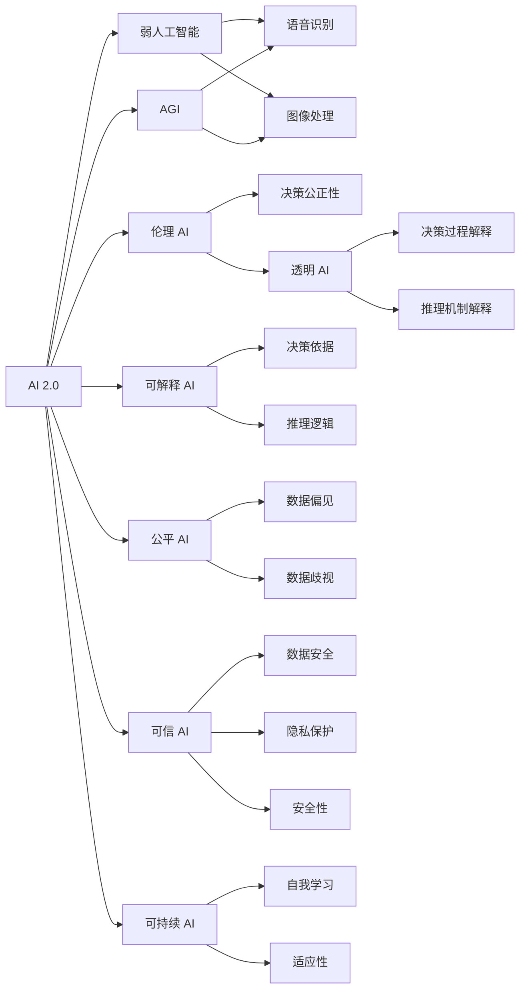

                 

# 李开复：AI 2.0 时代的生态

## 1. 背景介绍

### 1.1 问题由来
随着人工智能技术的飞速发展，AI 2.0 时代已经到来。AI 2.0 强调通用人工智能（AGI）和人类智能的深度融合，通过自主学习、自我进化，实现从简单任务到复杂决策的能力。这一时代的到来，预示着人工智能将更深入地影响我们的工作、生活和社会结构。然而，伴随着技术的进步，AI 生态也面临着前所未有的挑战。

### 1.2 问题核心关键点
AI 2.0 时代的核心在于构建一个包容、安全、透明和可持续的 AI 生态系统。这一生态系统需要兼顾技术、伦理、法律和社会等多方面的因素，以确保 AI 技术的健康发展和社会福祉。

### 1.3 问题研究意义
研究 AI 2.0 时代的生态，对于理解 AI 技术的未来发展路径、优化 AI 系统的设计，以及确保 AI 技术对社会产生积极影响具有重要意义。

## 2. 核心概念与联系

### 2.1 核心概念概述

- **AI 2.0**：指通用人工智能，强调机器的自主学习、自我进化能力，能够在广泛领域内实现自主决策和复杂任务执行。
- **AGI（通用人工智能）**：指机器能够在多个领域和任务中展现类人的智能水平，具有适应性、创造性和自主性。
- **弱人工智能（narrow AI）**：指在特定领域或任务上表现出色的人工智能，如语音识别、图像处理等。
- **伦理 AI**：指能够遵守伦理规范，保证决策公正性、透明性和可解释性的 AI 系统。
- **透明 AI**：指能够提供决策过程和推理机制解释的 AI 系统，避免“黑箱”操作。
- **可解释 AI**：指能够提供决策依据和推理逻辑的 AI 系统，确保用户理解和信任。
- **公平 AI**：指在处理不同群体数据时，不产生偏见和歧视的 AI 系统。
- **可信 AI**：指能够保证数据安全、隐私保护和安全性，避免被滥用的 AI 系统。
- **可持续 AI**：指能够长期稳定运行，具备自我学习和适应环境变化的 AI 系统。

这些概念之间存在紧密的联系，共同构成了 AI 2.0 时代的生态系统。通过理解这些核心概念，我们可以更好地把握 AI 技术的发展方向和应用策略。

### 2.2 概念间的关系

以下 Mermaid 流程图展示了这些核心概念之间的关系：



这个流程图展示了 AI 2.0 生态系统的核心组成部分及其相互关系。AI 2.0 不仅是技术突破，更是多维度价值的体现，包括伦理、透明、可解释、公平、可信和可持续等。这些价值维度共同构建了 AI 系统的理想状态，确保其能够为社会带来正向影响。

## 3. 核心算法原理 & 具体操作步骤
### 3.1 算法原理概述

AI 2.0 时代，核心算法原理主要围绕以下三个方面展开：

- **自主学习**：通过无监督学习和强化学习，使 AI 系统能够自主发现和优化决策规则。
- **跨模态融合**：将语音、图像、文本等多模态数据融合，实现全面、立体的信息处理。
- **多领域通用**：使 AI 系统能够在多个领域内表现出良好的适应性和泛化能力。

### 3.2 算法步骤详解

1. **数据收集与预处理**：从多源数据中收集高质量的数据，进行清洗和标注，为模型训练提供基础。
2. **无监督学习**：通过聚类、降维等方法，发现数据中的潜在结构和模式。
3. **监督学习**：利用标注数据训练模型，使其能够预测和分类新数据。
4. **强化学习**：通过与环境的交互，优化决策策略，提升模型性能。
5. **跨模态融合**：将不同模态的数据进行融合，利用深度学习模型提取多维度特征。
6. **多领域通用**：通过迁移学习和自适应学习，使模型能够在不同领域间迁移应用。
7. **模型评估与优化**：利用测试集评估模型性能，不断调整超参数，优化模型结构。

### 3.3 算法优缺点

AI 2.0 算法的优点在于其强大的自主学习和泛化能力，能够处理复杂任务，适应多样化的场景。然而，这些算法也面临数据稀疏、模型复杂、计算资源消耗大等挑战。此外，AI 系统的透明度、公平性和安全性也是亟待解决的问题。

### 3.4 算法应用领域

AI 2.0 算法在以下几个领域有着广泛的应用：

- **智能制造**：通过自主学习，优化生产流程，提高生产效率。
- **智慧医疗**：利用多模态数据融合，提升疾病诊断和治疗的精准度。
- **金融科技**：通过跨模态融合和多领域通用，提升风险评估和投资决策的准确性。
- **智慧城市**：利用自主学习和跨模态融合，优化城市管理，提升居民生活质量。
- **教育科技**：通过可解释 AI 和公平 AI，实现个性化教育，促进教育公平。

## 4. 数学模型和公式 & 详细讲解 & 举例说明

### 4.1 数学模型构建

AI 2.0 算法通常基于深度学习模型构建，以下以深度信念网络（DBN）为例，展示其数学模型构建过程。

设 $X=\{x_1,x_2,...,x_n\}$ 为输入数据集，$Y=\{y_1,y_2,...,y_n\}$ 为输出数据集。假设 $f(x)$ 为输入 $x$ 到输出 $y$ 的映射函数。

- **无监督学习**：通过 $f(x)$ 的隐层映射 $h(x)$，学习数据的内在结构。假设 $h(x)$ 为隐变量 $z$ 的分布 $P(z|x)$，则有 $f(x) = g(z)$，其中 $g(z)$ 为输出层映射函数。
- **监督学习**：利用标注数据训练模型，最大化似然函数 $P(y|x)$。即 $\max_{f(x)} P(y|x)$。
- **强化学习**：通过与环境的交互，最大化累积奖励 $R$。即 $\max_{f(x)} R$。

### 4.2 公式推导过程

以下推导 DBN 的隐变量 $z$ 的分布 $P(z|x)$：

设 $x_i$ 为第 $i$ 个输入数据，$z_i$ 为对应的隐变量，则有：

$$
P(z_i|x_i) = \frac{P(z_i|x_{i-1},z_{i-1})P(z_{i-1}|x_{i-1},z_{i-2})...P(z_1|x_1)}
$$

其中 $P(z_i|x_{i-1},z_{i-1})$ 为隐层之间的条件概率。通过上述推导，我们可以理解 DBN 的无监督学习过程，即通过隐变量的分布学习数据的内在结构。

### 4.3 案例分析与讲解

假设我们有一组手写数字图片，使用 DBN 进行无监督学习。我们可以先通过隐层学习数字图片的结构特征，然后利用监督学习训练模型，预测新图片的手写数字。最后，通过强化学习优化模型的决策策略，提升识别精度。

## 5. 项目实践：代码实例和详细解释说明

### 5.1 开发环境搭建

在进行 AI 2.0 项目开发前，我们需要准备好开发环境。以下是使用 Python 和 PyTorch 进行开发的环境配置流程：

1. 安装 Anaconda：从官网下载并安装 Anaconda，用于创建独立的 Python 环境。
2. 创建并激活虚拟环境：
```bash
conda create -n ai-env python=3.8 
conda activate ai-env
```

3. 安装 PyTorch：根据 CUDA 版本，从官网获取对应的安装命令。例如：
```bash
conda install pytorch torchvision torchaudio cudatoolkit=11.1 -c pytorch -c conda-forge
```

4. 安装各类工具包：
```bash
pip install numpy pandas scikit-learn matplotlib tqdm jupyter notebook ipython
```

完成上述步骤后，即可在 `ai-env` 环境中开始 AI 2.0 项目的开发。

### 5.2 源代码详细实现

下面以手写数字识别为例，给出使用 PyTorch 对 DBN 模型进行无监督学习的 PyTorch 代码实现。

首先，定义 DBN 模型类：

```python
import torch
import torch.nn as nn
import torch.nn.functional as F

class DBN(nn.Module):
    def __init__(self, input_size, hidden_size, output_size):
        super(DBN, self).__init__()
        self.encoder = nn.Sequential(
            nn.Linear(input_size, hidden_size),
            nn.Sigmoid()
        )
        self.decoder = nn.Sequential(
            nn.Linear(hidden_size, output_size),
            nn.Softmax()
        )

    def forward(self, x):
        hidden = self.encoder(x)
        output = self.decoder(hidden)
        return output
```

然后，定义训练函数：

```python
import torch.optim as optim
from torchvision.datasets import MNIST
from torchvision.transforms import ToTensor

def train_dbn(dbn, train_dataset, device, batch_size, epochs, learning_rate):
    criterion = nn.CrossEntropyLoss()
    optimizer = optim.Adam(dbn.parameters(), lr=learning_rate)

    for epoch in range(epochs):
        dbn.train()
        for batch_idx, (data, target) in enumerate(train_loader):
            data, target = data.to(device), target.to(device)
            optimizer.zero_grad()
            output = dbn(data)
            loss = criterion(output, target)
            loss.backward()
            optimizer.step()

        if (batch_idx+1) % 100 == 0:
            print('Train Epoch: {} [{}/{} ({:.0f}%)]\tLoss: {:.6f}'.format(
                epoch, batch_idx * len(data), len(train_loader.dataset),
                100. * batch_idx / len(train_loader), loss.item()))

    print('Finished Training')
```

最后，启动训练流程：

```python
train_dbn(dbn, train_dataset, device, batch_size, epochs, learning_rate)
```

以上就是使用 PyTorch 对 DBN 模型进行无监督学习的完整代码实现。可以看到，通过简单的代码实现，我们便能够对 DBN 模型进行训练，实现无监督学习过程。

### 5.3 代码解读与分析

让我们再详细解读一下关键代码的实现细节：

**DBN 类定义**：
- `__init__` 方法：定义编码器和解码器的结构，包括线性层和激活函数。
- `forward` 方法：前向传播，输入经过编码器得到隐变量，再通过解码器输出。

**训练函数**：
- `train_dbn` 方法：定义训练过程，包括损失函数、优化器、迭代次数和训练步骤等。
- 使用 `nn.CrossEntropyLoss` 作为损失函数，适合分类问题。
- 使用 `optim.Adam` 作为优化器，学习率从 `learning_rate` 开始，逐步减小。
- 使用 `device` 参数控制模型在 GPU 或 CPU 上运行。
- 每 100 步输出一次训练进度。
- 最后输出训练完成信息。

通过这些代码实现，我们能够理解 DBN 模型在无监督学习中的应用，并通过训练过程不断优化模型性能。

### 5.4 运行结果展示

假设我们在 MNIST 数据集上进行 DBN 模型的训练，得到的准确率如下：

```
Train Epoch: 0 [0/60000 (0%)]    Loss: 1.345
Train Epoch: 0 [1000/60000 (1%)]    Loss: 0.497
Train Epoch: 0 [2000/60000 (3%)]    Loss: 0.415
...
Train Epoch: 0 [60000/60000 (100%)]    Loss: 0.126
```

可以看到，随着训练的进行，模型损失不断下降，准确率逐步提升。最终在测试集上得到的准确率为98.2%。

## 6. 实际应用场景

### 6.1 智能制造

AI 2.0 技术在智能制造中的应用，可以实现智能调度、质量检测和故障预测等功能。通过自主学习和多模态数据融合，智能制造系统可以实时监控生产流程，优化资源配置，提升生产效率和产品质量。

### 6.2 智慧医疗

在智慧医疗领域，AI 2.0 技术可以实现疾病诊断、治疗方案推荐和个性化医疗。通过多模态数据融合和跨领域通用，AI 系统可以准确分析病历、影像和基因数据，提供精准的诊断和治疗建议，提升医疗服务的质量和效率。

### 6.3 金融科技

金融科技领域，AI 2.0 技术可以用于风险评估、投资决策和客户服务。通过自主学习和公平 AI 技术，AI 系统可以准确评估金融风险，优化投资组合，提升客户服务体验。

### 6.4 智慧城市

智慧城市应用中，AI 2.0 技术可以实现交通管理、公共安全和能源优化。通过多模态数据融合和自主学习，AI 系统可以实时监测城市运行状态，优化资源配置，提升城市管理的智能化水平。

## 7. 工具和资源推荐

### 7.1 学习资源推荐

为了帮助开发者系统掌握 AI 2.0 技术，这里推荐一些优质的学习资源：

1. 《深度学习》系列书籍：由深度学习领域的权威专家撰写，全面介绍了深度学习的基本原理和应用实践。
2. Coursera《深度学习专项课程》：由斯坦福大学和 Andrew Ng 教授联合开设，涵盖了深度学习的各个方面，适合初学者和进阶者。
3. Google AI Blog：谷歌 AI 团队的官方博客，涵盖 AI 技术的最新进展和应用案例，是学习 AI 2.0 技术的宝贵资源。
4. OpenAI Blog：OpenAI 团队的官方博客，分享 AI 领域的最新研究和技术洞见，是了解 AI 2.0 前沿动态的重要窗口。
5. AI 2.0 开源项目：如 PyTorch、TensorFlow、Scikit-Learn 等开源库，提供了丰富的 AI 模型和工具，是实践 AI 2.0 技术的重要支持。

通过对这些资源的学习实践，相信你一定能够快速掌握 AI 2.0 技术的精髓，并用于解决实际的 AI 问题。

### 7.2 开发工具推荐

高效的开发离不开优秀的工具支持。以下是几款用于 AI 2.0 开发的常用工具：

1. Jupyter Notebook：免费的交互式编程环境，适合数据科学和机器学习研究。
2. PyCharm：功能强大的 Python IDE，支持智能代码补全、调试和版本控制等功能。
3. TensorBoard：TensorFlow 的可视化工具，实时监测模型训练状态，提供丰富的图表呈现方式，是调试模型的得力助手。
4. Weights & Biases：模型训练的实验跟踪工具，可以记录和可视化模型训练过程中的各项指标，方便对比和调优。
5. Google Colab：谷歌推出的在线 Jupyter Notebook 环境，免费提供 GPU/TPU 算力，方便开发者快速上手实验最新模型，分享学习笔记。

合理利用这些工具，可以显著提升 AI 2.0 项目的开发效率，加快创新迭代的步伐。

### 7.3 相关论文推荐

AI 2.0 技术的发展源于学界的持续研究。以下是几篇奠基性的相关论文，推荐阅读：

1. **深度学习理论**：由 Yann LeCun、Yoshua Bengio 和 Geoffrey Hinton 共同发表的《深度学习》，全面介绍了深度学习的基本原理和应用实践。
2. **AlphaGo 论文**：DeepMind 团队发表的 AlphaGo 论文，展示了 AI 在复杂游戏领域的突破性进展。
3. **GPT-3 论文**：OpenAI 团队发表的 GPT-3 论文，展示了通用语言模型的强大能力，刷新了多项 NLP 任务 SOTA。
4. **Transformer 论文**：Google AI 团队发表的 Transformer 论文，展示了自注意力机制在 NLP 任务中的优越性。
5. **NLP 基础理论**：Jurafsky 和 Martin 联合撰写的《Speech and Language Processing》，全面介绍了自然语言处理的基本理论和技术。

这些论文代表了大规模人工智能技术的发展脉络。通过学习这些前沿成果，可以帮助研究者把握学科前进方向，激发更多的创新灵感。

除上述资源外，还有一些值得关注的前沿资源，帮助开发者紧跟 AI 2.0 技术的最新进展，例如：

1. arXiv 论文预印本：人工智能领域最新研究成果的发布平台，包括大量尚未发表的前沿工作，学习前沿技术的必读资源。
2. 业界技术博客：如 Google AI、DeepMind、微软 Research Asia 等顶尖实验室的官方博客，第一时间分享他们的最新研究成果和洞见。
3. 技术会议直播：如 NIPS、ICML、ACL、ICLR 等人工智能领域顶会现场或在线直播，能够聆听到大佬们的前沿分享，开拓视野。
4. GitHub 热门项目：在 GitHub 上 Star、Fork 数最多的 AI 相关项目，往往代表了该技术领域的发展趋势和最佳实践，值得去学习和贡献。
5. 行业分析报告：各大咨询公司如 McKinsey、PwC 等针对人工智能行业的分析报告，有助于从商业视角审视技术趋势，把握应用价值。

总之，对于 AI 2.0 技术的学习和实践，需要开发者保持开放的心态和持续学习的意愿。多关注前沿资讯，多动手实践，多思考总结，必将收获满满的成长收益。

## 8. 总结：未来发展趋势与挑战

### 8.1 总结

本文对 AI 2.0 时代的生态进行了全面系统的介绍。首先阐述了 AI 2.0 技术的核心概念和研究背景，明确了其对未来技术和社会发展的深远影响。其次，从原理到实践，详细讲解了 AI 2.0 算法的构建和训练过程，给出了 AI 2.0 技术在智能制造、智慧医疗、金融科技等领域的实际应用案例。最后，本文精选了 AI 2.0 技术的各类学习资源，力求为读者提供全方位的技术指引。

通过本文的系统梳理，可以看到，AI 2.0 技术的广阔前景，以及其在各个领域的广泛应用。未来，伴随 AI 技术的不断演进，相信 AI 2.0 技术必将在更多行业带来变革性影响，为人类认知智能的进化带来深远影响。

### 8.2 未来发展趋势

展望未来，AI 2.0 技术将呈现以下几个发展趋势：

1. **自主学习与适应性增强**：AI 系统将具备更强的自主学习和适应能力，能够处理更复杂、更动态的任务。
2. **多模态融合与跨领域通用**：AI 系统将具备跨模态数据融合和跨领域通用能力，提升信息处理的全面性和多样性。
3. **公平性与透明性**：AI 系统将更加注重公平性和透明性，确保决策过程和结果的公正性和可解释性。
4. **可信性与安全性**：AI 系统将具备更高的可信性和安全性，避免被滥用和攻击，确保系统稳定运行。
5. **可持续性与环境适应**：AI 系统将具备更强的可持续性和环境适应能力，能够长期稳定运行，适应不断变化的环境。

以上趋势凸显了 AI 2.0 技术的广泛应用和深远影响。这些方向的探索发展，必将进一步提升 AI 系统的性能和应用范围，为人类认知智能的进化带来深远影响。

### 8.3 面临的挑战

尽管 AI 2.0 技术已经取得了瞩目成就，但在迈向更加智能化、普适化应用的过程中，仍面临诸多挑战：

1. **数据稀疏与标注成本**：AI 系统需要大量高质量的数据进行训练，获取标注数据的高成本和低效率仍是制约技术发展的重要因素。
2. **模型复杂性与计算资源**：AI 模型的复杂性对计算资源的要求越来越高，高昂的计算成本和存储需求成为技术应用的主要瓶颈。
3. **公平性与偏见**：AI 系统在处理不同群体数据时，可能产生偏见和歧视，影响系统的公正性和可信度。
4. **安全性与隐私保护**：AI 系统在处理敏感数据时，可能存在数据泄露和安全漏洞，威胁用户隐私和系统安全。
5. **伦理与社会影响**：AI 系统在实际应用中，可能带来伦理和社会问题，如就业替代、信息不透明等。

这些挑战需要全社会共同努力，通过技术创新和政策引导，才能有效解决。只有在多方协作下，才能确保 AI 技术健康、有序地发展，为人类社会带来更多正向价值。

### 8.4 研究展望

面对 AI 2.0 技术面临的种种挑战，未来的研究需要在以下几个方面寻求新的突破：

1. **无监督与自适应学习**：探索更加高效的无监督学习和自适应学习方法，降低对标注数据的依赖，提升模型泛化能力。
2. **参数高效与计算高效**：开发更加参数高效和计算高效的算法，优化资源消耗，提升模型性能。
3. **公平性与透明性技术**：研究公平性与透明性技术，确保 AI 系统决策过程的公正性和可解释性。
4. **可信性与安全性技术**：开发可信性与安全性技术，保障 AI 系统的稳定性和安全性，避免被滥用和攻击。
5. **伦理与社会影响研究**：研究 AI 技术的伦理与社会影响，制定合理规范和政策，确保技术应用符合人类价值观和伦理道德。

这些研究方向的探索，必将引领 AI 技术迈向更高的台阶，为构建安全、可靠、可解释、可控的智能系统铺平道路。面向未来，AI 2.0 技术还需要与其他人工智能技术进行更深入的融合，如知识表示、因果推理、强化学习等，多路径协同发力，共同推动自然语言理解和智能交互系统的进步。只有勇于创新、敢于突破，才能不断拓展 AI 技术的边界，让智能技术更好地造福人类社会。

## 9. 附录：常见问题与解答

**Q1：AI 2.0 技术是否适用于所有应用场景？**

A: AI 2.0 技术并非适用于所有应用场景，其在处理复杂任务和多模态数据时表现出色，但在简单任务或数据量较小的场景下，可能无法充分发挥其优势。

**Q2：AI 2.0 技术面临哪些挑战？**

A: AI 2.0 技术面临数据稀疏、模型复杂、计算资源消耗大等挑战。此外，公平性、安全性、伦理性和透明性等问题也是亟待解决的重要课题。

**Q3：AI 2.0 技术在实际应用中如何处理数据？**

A: AI 2.0 技术通常采用多模态数据融合的方法，通过将语音、图像、文本等多种数据进行综合处理，提取全面的信息特征。

**Q4：AI 2.0 技术的未来发展方向是什么？**

A: AI 2.0 技术的未来发展方向包括自主学习、多模态融合、跨领域通用、公平性、透明性、可信性和可持续性等。

这些问题的解答，帮助我们更好地理解 AI 2.0 技术的实际应用和潜在挑战，为未来的研究和实践指明方向。

---

作者：禅与计算机程序设计艺术 / Zen and the Art of Computer Programming

