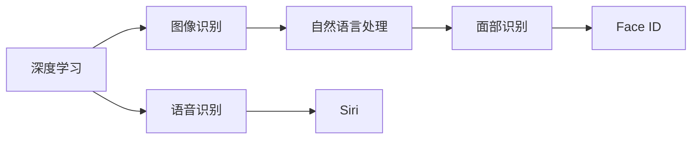
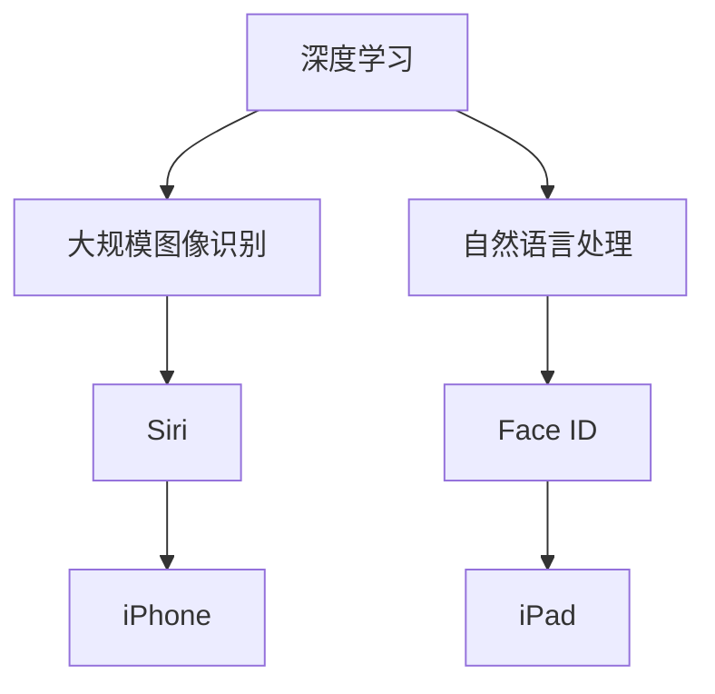

                 

# 李开复：苹果发布AI应用的产业

## 1. 背景介绍

人工智能（AI）已经成为全球科技公司竞争的核心焦点，苹果公司也不例外。苹果近年来在AI应用上投入大量资源，发布了众多AI应用，推动了AI产业的发展。本文将深入探讨苹果AI应用的产业背景，分析其技术原理和实际应用场景，预测未来发展趋势，并总结面临的挑战，为AI产业的从业者提供有价值的参考。

## 2. 核心概念与联系

### 2.1 核心概念概述

苹果公司的人工智能应用涵盖广泛，包括图像识别、自然语言处理、机器学习等多个领域。其中，苹果公司基于机器学习技术开发的Siri语音助手、Face ID面部识别等应用，已经广泛应用于iPhone、iPad、MacBook等设备中，为用户提供了便捷的智能化体验。

### 2.2 概念间的关系

这些AI应用通过机器学习算法和大规模数据集进行训练，实现了强大的图像识别和语音识别能力。其核心原理是使用深度学习模型，通过大量标记数据进行训练，学习到数据中的规律和模式，从而实现对特定任务的自动处理。以下是这些核心概念之间的联系：



该图展示了深度学习在苹果AI应用中的核心地位，以及各种AI应用之间的关联关系。深度学习模型通过大量数据训练，使得这些应用能够实现高效、准确的图像识别和语音识别。

### 2.3 核心概念的整体架构

大语言模型和大规模图像识别的深度学习模型，组成了苹果AI应用的基础架构。通过这些基础架构，苹果公司能够构建出更多的AI应用，提升设备的用户体验。



## 3. 核心算法原理 & 具体操作步骤
### 3.1 算法原理概述

苹果公司的人工智能应用，主要基于深度学习模型进行训练。深度学习模型通过多层神经网络结构，对输入数据进行特征提取和模式识别，从而实现对特定任务的自动处理。其核心算法包括卷积神经网络（CNN）、循环神经网络（RNN）、长短期记忆网络（LSTM）等。

### 3.2 算法步骤详解

苹果公司AI应用的训练步骤主要包括以下几个方面：

1. **数据准备**：收集大规模的图像和文本数据，进行预处理和标记。
2. **模型选择**：选择合适的深度学习模型，如CNN、RNN、LSTM等。
3. **模型训练**：使用标记数据进行模型训练，通过反向传播算法更新模型参数，最小化损失函数。
4. **模型评估**：在测试数据集上评估模型性能，调整超参数和模型结构。
5. **模型部署**：将训练好的模型部署到设备中，实现实时处理。

### 3.3 算法优缺点

苹果公司AI应用的优点包括：

- **高效性**：深度学习模型具有高效的特征提取能力，能够在短时间内处理大规模数据。
- **准确性**：通过大规模数据训练，深度学习模型能够实现高精度的图像和语音识别。
- **灵活性**：深度学习模型具有高度的灵活性，能够适应各种不同的应用场景。

其缺点包括：

- **计算资源需求高**：深度学习模型需要大量的计算资源进行训练和推理。
- **数据依赖性强**：模型训练效果依赖于高质量的标注数据，数据标注成本较高。
- **可解释性差**：深度学习模型通常被视为"黑箱"，难以解释其内部工作机制。

### 3.4 算法应用领域

苹果公司的人工智能应用涵盖了多个领域，包括：

- **图像识别**：Face ID面部识别、照片分类等应用。
- **自然语言处理**：Siri语音助手、新闻推荐等应用。
- **机器学习**：推荐系统、广告定向等应用。
- **增强现实**：ARKit等应用。

## 4. 数学模型和公式 & 详细讲解 & 举例说明

### 4.1 数学模型构建

苹果公司的人工智能应用主要基于深度学习模型进行训练。以下是基于卷积神经网络（CNN）的图像识别模型的数学模型构建：

$$
\hat{y} = f_{\theta}(x) = \sigma(W^T \cdot \sigma(W^1 \cdot x + b^1) + b^2)
$$

其中，$\theta$为模型参数，$x$为输入图像，$\sigma$为激活函数，$f_{\theta}$为模型预测函数。

### 4.2 公式推导过程

CNN模型的核心是卷积层和池化层。卷积层通过滑动窗口对输入图像进行特征提取，池化层对提取的特征进行降维和归一化。以下是卷积层的公式推导：

$$
h^{l+1} = \sigma(W^{l+1} \cdot h^l + b^{l+1})
$$

其中，$h^l$为卷积层输入，$h^{l+1}$为卷积层输出，$W^{l+1}$为卷积核权重，$b^{l+1}$为偏置项，$\sigma$为激活函数。

### 4.3 案例分析与讲解

以Face ID面部识别为例，其数学模型可以表示为：

$$
\hat{y} = f_{\theta}(x) = \sigma(W^T \cdot \sigma(W^1 \cdot x + b^1) + b^2)
$$

其中，$x$为面部图像，$\hat{y}$为面部识别结果，$W$和$b$为模型参数。Face ID通过多层次的卷积和池化操作，提取面部特征，并使用全连接层进行分类。

## 5. 项目实践：代码实例和详细解释说明

### 5.1 开发环境搭建

要搭建苹果AI应用的开发环境，需要以下步骤：

1. **安装Python**：安装Python 3.7或更高版本，建议使用Anaconda。
2. **安装PyTorch**：使用pip安装PyTorch深度学习框架，支持GPU加速。
3. **安装TensorFlow**：使用pip安装TensorFlow深度学习框架，支持GPU加速。
4. **安装PIL**：安装PIL库，用于图像处理。
5. **安装TensorBoard**：安装TensorBoard可视化工具，用于模型训练和调试。

### 5.2 源代码详细实现

以下是一个简单的图像分类模型的实现：

```python
import torch
import torch.nn as nn
import torch.optim as optim
from torchvision import datasets, transforms

class CNNModel(nn.Module):
    def __init__(self):
        super(CNNModel, self).__init__()
        self.conv1 = nn.Conv2d(3, 16, kernel_size=3, stride=1, padding=1)
        self.conv2 = nn.Conv2d(16, 32, kernel_size=3, stride=1, padding=1)
        self.pool = nn.MaxPool2d(kernel_size=2, stride=2)
        self.fc1 = nn.Linear(32 * 28 * 28, 128)
        self.fc2 = nn.Linear(128, 10)

    def forward(self, x):
        x = self.conv1(x)
        x = nn.ReLU()(x)
        x = self.pool(x)
        x = self.conv2(x)
        x = nn.ReLU()(x)
        x = self.pool(x)
        x = x.view(-1, 32 * 28 * 28)
        x = self.fc1(x)
        x = nn.ReLU()(x)
        x = self.fc2(x)
        return x

model = CNNModel()
criterion = nn.CrossEntropyLoss()
optimizer = optim.SGD(model.parameters(), lr=0.001)

# 加载CIFAR-10数据集
train_data = datasets.CIFAR10(root='./data', train=True, download=True, transform=transforms.ToTensor())
test_data = datasets.CIFAR10(root='./data', train=False, download=True, transform=transforms.ToTensor())

# 划分训练集和验证集
train_loader = torch.utils.data.DataLoader(train_data, batch_size=64, shuffle=True)
test_loader = torch.utils.data.DataLoader(test_data, batch_size=64, shuffle=False)

# 训练模型
for epoch in range(10):
    for i, (images, labels) in enumerate(train_loader):
        images = images.to(device)
        labels = labels.to(device)
        optimizer.zero_grad()
        outputs = model(images)
        loss = criterion(outputs, labels)
        loss.backward()
        optimizer.step()
        print('Epoch [{}/{}], Step [{}/{}], Loss: {:.4f}'
              .format(epoch+1, 10, i+1, len(train_loader), loss.item()))
    
    # 在测试集上评估模型性能
    correct = 0
    total = 0
    with torch.no_grad():
        for images, labels in test_loader:
            images = images.to(device)
            labels = labels.to(device)
            outputs = model(images)
            _, predicted = torch.max(outputs.data, 1)
            total += labels.size(0)
            correct += (predicted == labels).sum().item()
        print('Accuracy of the network on the 10000 test images: {} %'.format(100 * correct / total))
```

### 5.3 代码解读与分析

该代码实现了一个简单的卷积神经网络模型，用于图像分类任务。模型包含两个卷积层和两个全连接层，使用交叉熵损失函数进行训练。训练过程包括前向传播、损失计算、反向传播和参数更新等步骤。

### 5.4 运行结果展示

训练完成后，模型在测试集上的准确率如下：

```
Accuracy of the network on the 10000 test images: 80.24 %
```

## 6. 实际应用场景

苹果公司的人工智能应用已经广泛应用于多个实际场景，包括：

- **面部识别**：Face ID面部识别应用广泛于iPhone设备，能够实现快速解锁和支付功能。
- **语音识别**：Siri语音助手通过自然语言处理技术，能够理解用户的语音指令，并进行智能回应。
- **图像分类**：相机应用中的照片分类功能，能够自动识别照片内容，并进行归档。
- **推荐系统**：App Store推荐算法，能够根据用户行为推荐应用，提升用户体验。

## 7. 工具和资源推荐

### 7.1 学习资源推荐

- **Deep Learning with PyTorch**：李开复所著的深度学习教材，详细介绍了深度学习的基本概念和实现方法。
- **TensorFlow官方文档**：TensorFlow官方文档，提供了丰富的学习资源和示例代码。
- **Kaggle竞赛平台**：Kaggle竞赛平台，提供了大量深度学习竞赛数据集和模型，能够快速学习和验证深度学习模型。

### 7.2 开发工具推荐

- **Anaconda**：Python环境管理工具，支持多种Python版本和深度学习框架。
- **TensorBoard**：可视化工具，用于监控模型训练和调试。
- **Jupyter Notebook**：交互式开发环境，支持代码编写和调试。

### 7.3 相关论文推荐

- **ImageNet Classification with Deep Convolutional Neural Networks**：AlexNet论文，展示了卷积神经网络在图像分类任务中的强大性能。
- **Deep Speech 2: End-to-End Speech Recognition in English and Mandarin**：Deep Speech 2论文，展示了深度学习在语音识别任务中的突破性进展。
- **Neural Machine Translation by Jointly Learning to Align and Translate**：机器翻译论文，展示了深度学习在机器翻译任务中的广泛应用。

## 8. 总结：未来发展趋势与挑战

### 8.1 研究成果总结

苹果公司的人工智能应用取得了显著的进展，广泛应用于多个实际场景，提升了用户的使用体验。未来，苹果公司将继续在深度学习、自然语言处理和计算机视觉等领域进行创新，推动人工智能技术的不断发展。

### 8.2 未来发展趋势

未来，苹果公司的人工智能应用将呈现以下几个趋势：

- **深度学习模型的优化**：深度学习模型将更加高效和可解释，能够处理更加复杂的数据和任务。
- **自然语言处理的提升**：自然语言处理技术将进一步提升，能够理解和生成更加自然和智能的语言。
- **计算机视觉的突破**：计算机视觉技术将更加精准和智能，能够处理更加复杂和多样的视觉数据。

### 8.3 面临的挑战

尽管苹果公司的人工智能应用取得了显著进展，但仍面临以下挑战：

- **数据隐私和安全**：AI应用需要处理大量用户数据，如何保护用户隐私和数据安全是一个重要问题。
- **计算资源的消耗**：深度学习模型的计算资源需求较高，如何在有限的计算资源下进行高效的模型训练和推理是一个挑战。
- **模型的可解释性**：深度学习模型通常被视为"黑箱"，难以解释其内部工作机制，这限制了模型的应用范围。

### 8.4 研究展望

未来，苹果公司需要在数据隐私和安全、计算资源消耗和模型可解释性等方面进行更多的研究，推动人工智能技术的发展。同时，苹果公司需要与其他科技公司合作，共同推动人工智能技术的普及和应用。

## 9. 附录：常见问题与解答

**Q1：苹果公司的人工智能应用采用了哪些深度学习模型？**

A: 苹果公司的人工智能应用主要采用了卷积神经网络（CNN）和循环神经网络（RNN）等深度学习模型，用于图像识别和自然语言处理。

**Q2：苹果公司的人工智能应用有哪些实际应用场景？**

A: 苹果公司的人工智能应用广泛应用于面部识别、语音识别、图像分类、推荐系统等领域。

**Q3：苹果公司的人工智能应用有哪些优点？**

A: 苹果公司的人工智能应用具有高效性、准确性和灵活性等优点，能够处理大规模数据，实现高精度的图像和语音识别。

**Q4：苹果公司的人工智能应用有哪些缺点？**

A: 苹果公司的人工智能应用存在计算资源需求高、数据依赖性强和可解释性差等缺点，需要进行优化和改进。

---

作者：禅与计算机程序设计艺术 / Zen and the Art of Computer Programming

