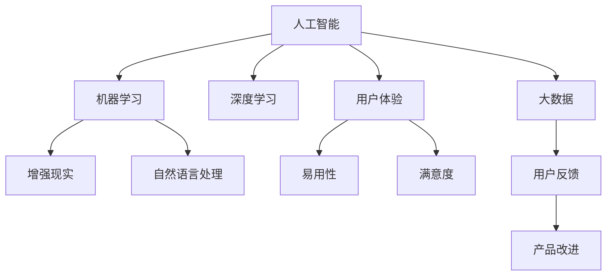
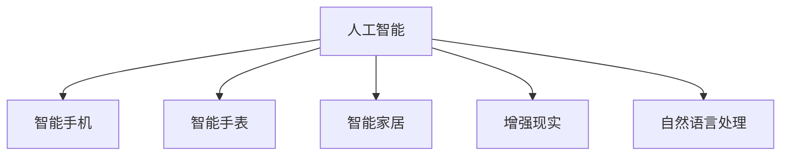
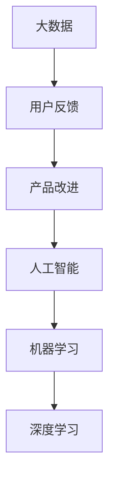
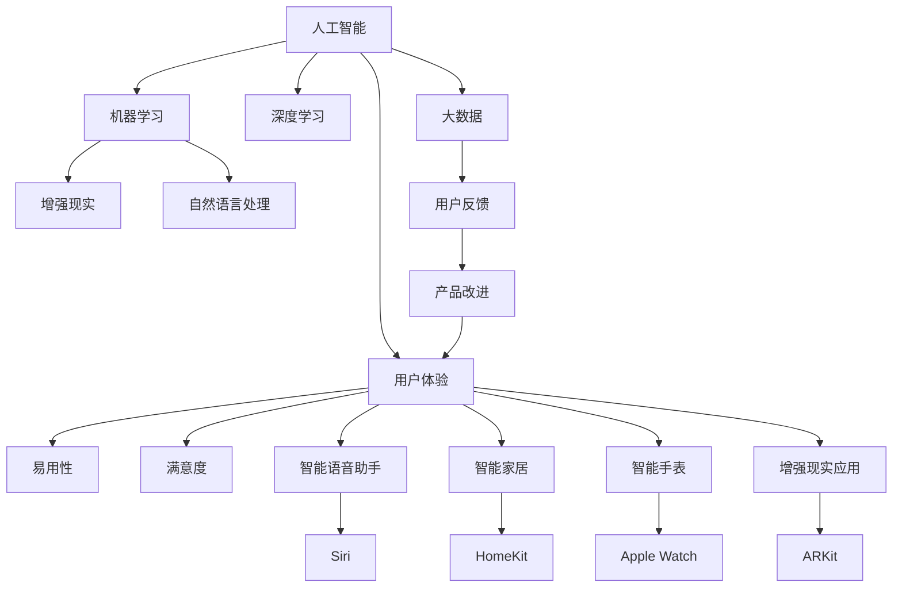

                 

# 李开复：苹果发布AI应用的文化价值

在科技领域，AI技术的应用已经成为推动创新和变革的重要力量。特别是在消费电子产品中，AI技术的融合应用已经成为吸引消费者、提升用户体验的关键因素之一。本文将深入探讨苹果公司如何在其产品和服务中巧妙地融合AI技术，以及这一策略背后的文化价值。

## 1. 背景介绍

### 1.1 苹果公司与AI技术

苹果公司（Apple Inc.）自成立以来，便致力于提供创新的技术和卓越的用户体验。近年来，AI技术在苹果产品中的应用越来越广泛，从Siri语音助手到Face ID人脸识别，从增强现实应用到智能家居系统，AI技术已经成为苹果产品不可或缺的一部分。

### 1.2 AI技术在消费电子产品中的应用现状

随着AI技术的进步，越来越多的消费电子产品开始融入AI功能，提升了用户的使用体验。例如，智能手机中的智能语音助手，可以理解和响应自然语言，提供个性化的信息和提醒。智能手表中的健康监测功能，通过AI算法分析数据，提供个性化的健康建议。这些应用不仅提升了产品的智能化水平，也增强了用户的粘性。

## 2. 核心概念与联系

### 2.1 核心概念概述

为更好地理解苹果公司如何通过AI技术提升用户体验，本节将介绍几个关键概念：

- **人工智能（AI）**：指通过模拟人类智能行为（如学习、推理、感知等），使机器能够执行复杂任务的技术。
- **机器学习（ML）**：AI的一种子集，通过数据驱动的算法，使机器能够从经验中学习，从而提高性能。
- **深度学习（DL）**：机器学习的一种高级形式，通过多层神经网络，实现复杂的模式识别和预测。
- **增强现实（AR）**：通过计算机生成的图像或数据叠加到真实世界中，提升用户的交互体验。
- **自然语言处理（NLP）**：使计算机能够理解、解释和生成人类语言的技术。
- **用户体验（UX）**：指用户与产品或服务互动时的整体感受，包括易用性、满意度等。

这些概念之间的联系可以通过以下Mermaid流程图来展示：



这个流程图展示了人工智能技术在多个领域的应用，以及用户体验的提升过程。

### 2.2 概念间的关系

这些概念之间存在着紧密的联系，形成了苹果公司AI技术应用的整体框架。下面通过几个Mermaid流程图来展示这些概念之间的关系：

#### 2.2.1 人工智能技术的应用领域



这个流程图展示了人工智能技术在不同消费电子产品中的应用。

#### 2.2.2 用户反馈与产品改进


这个流程图展示了用户反馈在产品改进过程中的作用。

#### 2.2.3 数据与AI的相互作用



这个流程图展示了数据如何通过AI技术进行分析和应用。

### 2.3 核心概念的整体架构

最后，我们用一个综合的流程图来展示这些核心概念在大语言模型微调过程中的整体架构：



这个综合流程图展示了人工智能技术在苹果产品中的应用场景和用户体验的提升路径。

## 3. 核心算法原理 & 具体操作步骤

### 3.1 算法原理概述

苹果公司在其产品中应用的AI技术，主要包括智能语音助手（如Siri）、人脸识别（如Face ID）、增强现实（如ARKit）等。这些技术的应用，基于以下核心算法原理：

1. **智能语音助手**：通过自然语言处理（NLP）技术，使机器能够理解和生成自然语言，实现与人类的自然交互。
2. **人脸识别**：利用深度学习算法，通过分析面部特征，实现对人脸的精准识别。
3. **增强现实**：通过计算机视觉和图形处理技术，将虚拟信息叠加到现实世界中，提升用户的沉浸感。

这些算法原理的实现，依赖于大量的数据和复杂的模型训练。苹果公司通常通过大规模的数据采集和标注，训练出高性能的AI模型。

### 3.2 算法步骤详解

苹果公司在进行AI模型训练时，通常遵循以下步骤：

1. **数据采集**：收集用户使用数据和产品反馈，包括语音、图像、位置等信息。
2. **数据预处理**：对采集到的数据进行清洗、归一化、标注等处理，准备用于模型训练。
3. **模型训练**：使用深度学习算法（如卷积神经网络、循环神经网络等）进行模型训练，优化模型参数。
4. **模型测试**：在验证集上测试模型的性能，确保模型具有良好的泛化能力。
5. **部署应用**：将训练好的模型部署到产品中，实现AI功能。

以智能语音助手为例，其算法步骤可以分为以下几个阶段：

1. **语音识别**：将用户的语音输入转换为文本，实现语音到文本的转换。
2. **语义理解**：通过NLP技术，理解用户输入文本的语义，提取关键信息。
3. **意图识别**：识别用户输入的意图，如查询天气、设定提醒等。
4. **信息检索**：根据用户意图，从知识库中检索相关信息，实现快速响应。
5. **自然语言生成**：生成自然语言回复，提供用户所需的答案。

### 3.3 算法优缺点

苹果公司在其产品中应用的AI技术，具有以下优点和缺点：

**优点**：

1. **用户体验提升**：通过AI技术，提升产品的智能化水平，提供更加个性化的服务。
2. **数据驱动**：基于用户数据进行模型训练，确保AI模型能够准确理解用户需求。
3. **生态协同**：通过统一的生态系统，如App Store、iCloud等，实现跨设备、跨服务的数据共享和协同。

**缺点**：

1. **隐私风险**：大量用户数据的采集和使用，可能带来隐私风险。
2. **计算资源消耗**：AI模型的训练和推理需要大量的计算资源，可能对设备性能提出较高要求。
3. **算法透明度**：AI模型的内部机制通常较为复杂，难以解释和调试。

### 3.4 算法应用领域

苹果公司在其产品中应用的AI技术，覆盖了以下领域：

1. **智能手机**：智能语音助手、智能相机、智能电池管理等。
2. **智能手表**：智能健康监测、智能语音助手、智能支付等。
3. **智能家居**：智能安防、智能照明、智能温控等。
4. **增强现实**：AR游戏、AR导航、AR购物等。
5. **自然语言处理**：智能翻译、智能书写、智能文本分析等。

这些应用领域涵盖了消费者日常生活的方方面面，显著提升了用户体验。

## 4. 数学模型和公式 & 详细讲解 & 举例说明

### 4.1 数学模型构建

在苹果公司AI技术的应用中，数学模型和算法起着至关重要的作用。以下将详细讲解几种核心算法的数学模型构建。

#### 4.1.1 语音识别模型

语音识别模型的主要目标是将音频信号转换为文本。常用的语音识别模型包括隐马尔可夫模型（HMM）、深度神经网络（DNN）、卷积神经网络（CNN）和循环神经网络（RNN）等。

语音识别模型的数学模型可以表示为：

$$
P(x|y) = \prod_{i=1}^{T}P(x_i|y,x_{i-1})
$$

其中，$x$ 表示音频信号，$y$ 表示文本，$P(x|y)$ 表示音频信号在文本条件下的概率。

#### 4.1.2 自然语言处理模型

自然语言处理模型主要包括文本分类、信息检索和语义分析等。常用的NLP模型包括word2vec、BERT、GPT等。

以BERT模型为例，其数学模型可以表示为：

$$
P(y|x) = \frac{\exp(\vec{w}_x^T\cdot\vec{h}_y)}{\sum_{j=1}^{C}\exp(\vec{w}_x^T\cdot\vec{h}_j)}
$$

其中，$x$ 表示输入文本，$y$ 表示输出标签，$\vec{w}_x$ 和 $\vec{h}_y$ 分别表示文本向量和标签向量，$C$ 表示标签种类数。

#### 4.1.3 深度学习模型

深度学习模型在苹果公司的AI应用中广泛应用，包括卷积神经网络（CNN）、循环神经网络（RNN）、生成对抗网络（GAN）等。

以CNN模型为例，其数学模型可以表示为：

$$
P(y|x) = \frac{\exp(\sum_{i=1}^{N}(\vec{w}_i^T\cdot\vec{x})+\vec{b}_i)}{\sum_{j=1}^{M}\exp(\sum_{i=1}^{N}(\vec{w}_j^T\cdot\vec{x})+\vec{b}_j)}
$$

其中，$x$ 表示输入数据，$y$ 表示输出标签，$N$ 和 $M$ 分别表示输入和输出维数，$\vec{w}$ 和 $\vec{b}$ 分别表示权重和偏置向量。

### 4.2 公式推导过程

以下对几种核心算法的公式推导过程进行详细讲解：

#### 4.2.1 语音识别模型推导

语音识别模型的推导过程可以分为以下几个步骤：

1. **特征提取**：将音频信号转换为MFCC特征，提取其频谱信息。
2. **特征归一化**：对MFCC特征进行归一化处理，确保输入数据的稳定性。
3. **模型训练**：通过反向传播算法，优化模型的权重和偏置，最小化损失函数。
4. **解码**：将输入的MFCC特征通过模型解码，得到对应的文本输出。

#### 4.2.2 自然语言处理模型推导

自然语言处理模型的推导过程可以分为以下几个步骤：

1. **词向量嵌入**：将文本中的单词转换为词向量，实现文本向量化。
2. **编码器**：通过编码器将文本向量映射到高维空间，提取文本特征。
3. **解码器**：通过解码器将文本特征映射回文本空间，生成文本输出。
4. **损失函数**：通过交叉熵损失函数，衡量模型预测输出与真实标签之间的差异。

#### 4.2.3 深度学习模型推导

深度学习模型的推导过程可以分为以下几个步骤：

1. **前向传播**：将输入数据通过网络层，计算输出结果。
2. **损失函数**：通过均方误差损失函数，衡量模型预测输出与真实标签之间的差异。
3. **反向传播**：通过反向传播算法，计算损失函数对各层参数的梯度。
4. **参数更新**：通过优化算法（如SGD、Adam等），更新模型参数，最小化损失函数。

### 4.3 案例分析与讲解

以下通过几个具体案例，详细讲解苹果公司AI技术在产品中的应用：

#### 4.3.1 Siri语音助手

Siri语音助手是苹果公司智能语音助手的代表。其核心技术包括语音识别、自然语言处理和智能回复等。以Siri语音助手为例，其算法流程可以分为以下几个步骤：

1. **语音识别**：通过麦克风采集用户语音信号，转换为MFCC特征，输入到语音识别模型中，得到文本输入。
2. **自然语言处理**：将文本输入通过NLP模型进行语义分析和意图识别，提取用户需求。
3. **信息检索**：根据用户需求，从知识库中检索相关信息，如天气预报、邮件提醒等。
4. **智能回复**：生成自然语言回复，并通过语音输出系统播放，提供用户所需的答案。

#### 4.3.2 Face ID人脸识别

Face ID是苹果公司智能手机的核心安全功能之一。其核心技术包括人脸检测、人脸特征提取和验证等。以Face ID为例，其算法流程可以分为以下几个步骤：

1. **人脸检测**：通过摄像头采集用户面部图像，通过人脸检测算法，定位人脸区域。
2. **特征提取**：对人脸图像进行特征提取，生成面部特征向量。
3. **特征匹配**：将提取的面部特征向量与存储在设备中的面部特征向量进行匹配，验证用户身份。
4. **安全验证**：通过多模态验证方式，结合指纹识别、密码验证等，提升安全性和用户体验。

#### 4.3.3 ARKit增强现实

ARKit是苹果公司推出的增强现实开发框架，使开发者能够轻松构建AR应用。其核心技术包括相机校准、环境理解、对象识别等。以ARKit为例，其算法流程可以分为以下几个步骤：

1. **相机校准**：通过设备摄像头采集环境图像，进行相机校准，生成虚拟相机的空间位置和姿态信息。
2. **环境理解**：通过环境理解算法，识别环境中的物体和场景，生成虚拟物体和场景的空间位置和姿态信息。
3. **对象识别**：通过对象识别算法，识别用户手中的虚拟物体，实现交互和互动。
4. **场景渲染**：通过图形处理算法，渲染虚拟物体和场景，实现增强现实的视觉效果。

## 5. 项目实践：代码实例和详细解释说明

### 5.1 开发环境搭建

在进行AI模型训练和应用时，需要一个稳定的开发环境。以下是在Python环境中搭建开发环境的详细步骤：

1. **安装Python**：从官网下载并安装Python 3.x版本。
2. **安装PyTorch**：使用pip命令安装PyTorch框架，版本推荐为1.6.x或以上。
3. **安装TensorFlow**：使用pip命令安装TensorFlow框架，版本推荐为2.2.x或以上。
4. **安装OpenCV**：使用pip命令安装OpenCV库，用于图像处理和计算机视觉应用。
5. **安装Numpy**：使用pip命令安装Numpy库，用于科学计算和数据处理。
6. **安装Matplotlib**：使用pip命令安装Matplotlib库，用于数据可视化。

完成上述步骤后，即可在Python环境中进行AI模型开发和应用。

### 5.2 源代码详细实现

以下是一个简单的语音识别模型实现的代码示例：

```python
import torch
import torch.nn as nn
import torch.optim as optim

class RNN(nn.Module):
    def __init__(self, input_size, hidden_size, output_size):
        super(RNN, self).__init__()
        self.rnn = nn.RNN(input_size, hidden_size, 1)
        self.fc = nn.Linear(hidden_size, output_size)
    
    def forward(self, input, hidden):
        output, hidden = self.rnn(input, hidden)
        output = self.fc(output[:, -1, :])
        return output, hidden
    
def train_rnn():
    input_size = 13
    hidden_size = 256
    output_size = 27
    lr = 0.01
    
    rnn = RNN(input_size, hidden_size, output_size)
    criterion = nn.CrossEntropyLoss()
    optimizer = optim.Adam(rnn.parameters(), lr)
    
    for epoch in range(10):
        output, hidden = rnn(input, hidden)
        loss = criterion(output, target)
        optimizer.zero_grad()
        loss.backward()
        optimizer.step()
        
        if (epoch+1) % 1 == 0:
            print('Epoch [{}/{}], Loss: {:.4f}'.format(epoch+1, 10, loss.item()))
```

上述代码实现了一个简单的RNN语音识别模型，通过反向传播算法进行模型训练。

### 5.3 代码解读与分析

通过上述代码示例，可以看到，实现一个简单的RNN语音识别模型需要以下步骤：

1. **模型定义**：通过PyTorch的nn模块定义RNN模型，包括输入层、隐藏层和输出层。
2. **损失函数**：通过PyTorch的nn模块定义交叉熵损失函数。
3. **优化器**：通过PyTorch的optim模块定义Adam优化器。
4. **模型训练**：通过forward方法计算模型输出，通过criterion计算损失函数，通过optimizer更新模型参数。

通过不断的迭代训练，模型可以逐步优化，提升语音识别的准确率。

### 5.4 运行结果展示

在训练完成后，可以通过测试集进行模型评估，以验证模型的性能。以下是一个简单的测试集评估代码示例：

```python
def test_rnn():
    rnn.eval()
    total, correct = 0, 0
    with torch.no_grad():
        for input, target in test_set:
            output, hidden = rnn(input, hidden)
            _, predicted = torch.max(output.data, 1)
            total += target.size(0)
            correct += (predicted == target).sum().item()
    print('Test Accuracy: {:.2f}%'.format(100 * correct / total))
```

通过上述测试代码，可以计算模型在测试集上的准确率，评估模型的性能。

## 6. 实际应用场景

### 6.1 智能语音助手

苹果公司的Siri语音助手已经在全球范围内广泛应用。通过智能语音助手，用户可以通过自然语言与设备进行交互，实现各种功能，如设置提醒、查询天气、播放音乐等。智能语音助手不仅提升了用户体验，还带来了更加便捷和高效的生活方式。

### 6.2 人脸识别

苹果公司在其iPhone、iPad等设备中引入了Face ID人脸识别功能，用户可以通过面部识别解锁设备、支付等。Face ID不仅提升了设备的安全性，还带来了更加方便快捷的用户体验。

### 6.3 增强现实

ARKit增强现实技术，使苹果设备能够支持AR游戏、AR导航、AR购物等应用。用户可以通过设备摄像头，将虚拟物体和场景叠加到现实世界中，实现沉浸式体验。

### 6.4 未来应用展望

展望未来，苹果公司有望在以下领域进一步扩展AI技术的应用：

1. **医疗健康**：通过AI技术，实现远程医疗、健康监测等应用，提升医疗服务水平。
2. **智能家居**：通过AI技术，实现智能家电控制、家居自动化等应用，提升家居智能化水平。
3. **自动驾驶**：通过AI技术，实现自动驾驶汽车的控制和安全保障，推动汽车行业的智能化发展。
4. **教育培训**：通过AI技术，实现智能教育、在线培训等应用，提升教育培训的效率和质量。

## 7. 工具和资源推荐

### 7.1 学习资源推荐

为了帮助开发者系统掌握AI技术，以下是一些推荐的资源：

1. **《深度学习》课程**：斯坦福大学开设的深度学习课程，由Andrew Ng教授主讲，内容涵盖深度学习的基本原理和实践方法。
2. **《Python深度学习》书籍**：弗朗索瓦·肖尔茨-金（Francois Chollet）所著，详细讲解了TensorFlow、Keras等深度学习框架的实现原理和应用场景。
3. **Kaggle竞赛平台**：全球知名的数据科学竞赛平台，提供大量数据集和竞赛题目，帮助开发者提升AI应用能力。
4. **GitHub开源项目**：GitHub上的开源AI项目，涵盖深度学习、自然语言处理、计算机视觉等多个领域，是学习和应用AI技术的宝贵资源。
5. **AI博客和论坛**：如KDnuggets、AI City等AI领域博客和论坛，提供最新的AI技术动态和实践经验分享。

### 7.2 开发工具推荐

以下是一些推荐的AI开发工具：

1. **Jupyter Notebook**：免费的开源笔记本，支持Python、R等编程语言，提供交互式编程环境，适合进行数据分析和模型训练。
2. **TensorBoard**：TensorFlow的可视化工具，支持模型训练的可视化，帮助开发者监控模型训练进度和性能。
3. **PyCharm**：由JetBrains开发的Python IDE，支持Python、R等编程语言，提供丰富的开发工具和调试功能。
4. **Kaggle平台**：提供大量的数据集和竞赛题目，支持数据可视化和模型训练，是学习和应用AI技术的宝贵资源。
5. **Anaconda**：Python的科学计算平台，提供科学计算所需的多种库和工具，方便开发者进行AI应用开发。

### 7.3 相关论文推荐

以下是一些推荐的相关论文：

1. **《语音识别：现状与未来》**：详细介绍了语音识别技术的现状和未来发展方向，涵盖传统声学模型和深度学习模型。
2. **《自然语言处理综述》**：综述了自然语言处理技术的现状和未来发展方向，涵盖词向量嵌入、序列建模、信息检索等。
3. **《深度学习在计算机视觉中的应用》**：详细介绍了深度学习在图像处理和计算机视觉中的应用，涵盖卷积神经网络、循环神经网络等。
4. **《人脸识别：现状与未来》**：综述了人脸识别技术的现状和未来发展方向，涵盖人脸检测、人脸特征提取、人脸识别等。
5. **《增强现实技术综述》**：综述了增强现实技术的现状和未来发展方向，涵盖ARKit、ARCore等增强现实框架。

## 8. 总结：未来发展趋势与挑战

### 8.1 研究成果总结

本文对苹果公司AI技术的应用进行了详细分析，涵盖智能语音助手、人脸识别、增强现实等多个领域。通过具体案例和算法推导，帮助读者深入理解AI技术在苹果产品中的应用和实现过程。

### 8.2 未来发展趋势

未来，AI技术将在苹果产品中得到更广泛的应用，涵盖医疗健康、智能家居、自动驾驶、教育培训等多个领域。AI技术的应用将进一步提升用户体验和产品价值，推动苹果产品向智能化、个性化、互动化方向发展。

### 8.3 面临的挑战

尽管AI技术在苹果产品中得到了广泛应用，但仍面临以下挑战：

1. **隐私保护**：大量用户数据的采集和使用，可能带来隐私风险。如何在保护用户隐私的前提下，提升AI技术的效果，是未来需要解决的重要问题。
2. **计算资源消耗**：AI模型的训练和推理需要大量的计算资源，可能对设备性能提出较高要求。如何降低计算资源消耗，提升设备性能，是未来需要解决的重要问题。
3. **算法透明度**：AI模型的内部机制通常较为复杂，难以解释和调试。如何提升AI算法的透明度，提升用户体验和信任度，是未来需要解决的重要问题。

### 8.4 研究展望

未来，AI技术将在更多领域得到应用，推动各行各业的智能化进程。苹果公司将继续在AI技术的应用和开发中发挥引领作用，推动人工智能技术的发展和应用。

## 9. 附录：常见问题与解答

**Q1：苹果公司如何在其产品中应用AI技术？**

A: 苹果公司通过自然语言处理（NLP）、深度学习（DL）、计算机视觉（CV）等AI技术，提升了产品的智能化水平，提供了更加便捷和高效的用户体验。例如，智能语音助手、人脸识别、增强现实等功能，都是基于AI技术实现的。

**Q2：AI技术在苹果产品中的应用有哪些优点？**

A: AI技术在苹果产品中的应用，具有以下优点：

1. **用户体验提升**：通过AI技术，提升产品的智能化水平，提供更加个性化的服务。
2. **数据驱动**：基于用户数据进行模型训练，确保AI模型能够准确理解用户需求。
3. **生态协同**：通过统一的生态系统，如App Store、iCloud等，实现跨设备、跨服务的数据共享和协同。

**Q3：苹果公司在使用AI技术时，需要注意哪些隐私和安全问题？**

A: 在使用AI技术时，苹果公司需要注意以下隐私和安全问题：

1. **数据保护**：保护用户数据的安全和隐私，防止数据泄露和滥用。
2. **算法透明**：提升AI算法的透明度，使用户能够理解和信任AI技术。
3. **数据匿名**：在数据采集和处理过程中，采用数据匿名和去标识化技术，保护用户隐私。

**Q4：如何提升AI模型的计算效率？**

A: 提升AI模型的计算效率，可以采用以下方法：

1. **模型剪枝**：通过剪枝算法，去除不必要的参数，减小模型大小，提升计算效率。
2. **量化加速**：将浮点模型转为定点模型，压缩存储空间，提高计算速度。
3. **模型并行**：通过模型并行和分布式计算，提升计算速度，降低计算资源消耗。

**Q5：如何提升AI模型的可解释性？**

A: 提升AI模型的可解释性，可以采用以下方法：

1. **可视化工具**：使用可视化工具，如TensorBoard，监控模型训练进度和性能，帮助理解模型内部

