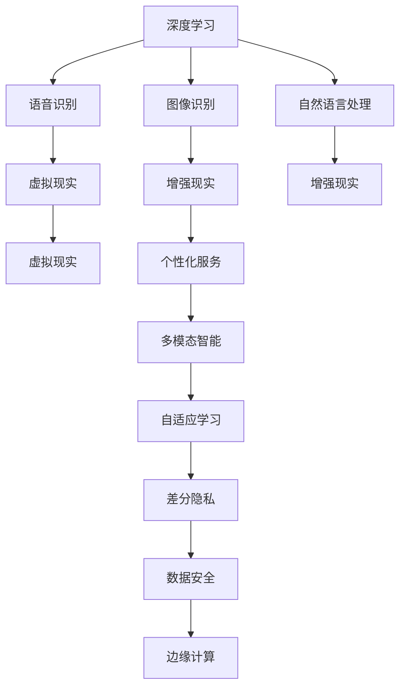

                 

# 李开复：苹果发布AI应用的未来

## 1. 背景介绍

苹果公司（Apple Inc.）在人工智能（AI）领域一直是行业先锋，其最新发布的AI应用及技术策略，再次引发了科技界的广泛关注。作为人工智能领域的知名专家和作家，李开复（Fei-Fei Li）曾在苹果担任首席AI科学家，并在公开场合多次分享过对AI未来发展的见解。本文将详细探讨李开复对苹果未来AI应用的预测和解读，以及对当前AI技术趋势的深度分析。

### 1.1 苹果AI战略与成果

苹果公司自2018年首次发布AI应用以来，通过不断的技术创新和战略布局，已经取得了显著的成果。苹果的AI策略主要聚焦于以下几个方面：

1. **自动驾驶与机器学习**：苹果在自动驾驶技术上积极投入，并在机器学习领域实现了多个突破。苹果的AI芯片（如A7、A8）在图像识别、语音识别等领域具有领先优势。

2. **深度学习和神经网络**：苹果的Deep Learning API允许开发人员轻松创建和训练深度学习模型，支持自然语言处理、计算机视觉等应用。

3. **Siri虚拟助手**：Siri是苹果AI应用的典型代表，具备强大的语音识别和自然语言理解能力，能够执行各种任务和提供个性化服务。

4. **增强现实（AR）和虚拟现实（VR）**：苹果的ARKit和ARKit相机支持开发AR应用，推动了AR技术的普及和创新。

5. **数据隐私保护**：苹果注重数据隐私保护，推出了隐私保护技术（如差分隐私、苹果设备身份验证等），提升了AI应用的安全性和可信任度。

### 1.2 李开复对AI趋势的洞察

李开复认为，当前AI技术正处于高速发展的关键时期，未来的AI应用将更加广泛和深入，涵盖各个行业和领域。以下是李开复对AI趋势的几点重要洞察：

1. **多模态智能**：未来的AI应用将超越单一模态（如视觉、语音或文本），具备多模态的感知和理解能力，实现更加全面和智能的决策。

2. **个性化和自适应**：AI系统将通过学习用户的偏好和行为，提供个性化的服务和内容，同时具备自适应的学习能力，能够根据环境变化和用户反馈调整其行为。

3. **边缘计算和分布式AI**：为应对数据隐私和安全问题，未来的AI应用将更多地依赖于边缘计算和分布式AI技术，使数据处理和决策更加本地化和分散化。

4. **深度学习与人类协作**：AI系统将与人类协作，结合人类专业知识，提升决策的准确性和可靠性，解决复杂的现实问题。

5. **伦理和安全性**：随着AI技术的普及，其带来的伦理和安全问题也将日益受到重视，如偏见和歧视、隐私侵犯等，需要制定严格的规范和标准。

## 2. 核心概念与联系

### 2.1 核心概念概述

为了深入理解苹果未来AI应用的策略和趋势，本节将详细介绍几个核心概念：

1. **深度学习**：一种通过多层神经网络学习复杂模式的机器学习方法，广泛应用于图像识别、语音识别、自然语言处理等领域。

2. **增强现实（AR）和虚拟现实（VR）**：通过计算机技术生成虚拟场景，与现实环境叠加或替代，增强用户对现实世界的感知和交互体验。

3. **差分隐私**：一种保护数据隐私的技术，通过在数据中引入噪声，确保个体数据无法被单独识别，同时不影响总体数据的统计分析。

4. **自适应学习**：AI系统通过持续学习和调整，根据环境变化和用户反馈不断优化其决策和行为，提升智能化水平。

5. **多模态智能**：结合视觉、语音、文本等多种感知模态，实现更加全面和智能的决策和交互。

这些概念通过技术流程和数据流的交互，构成了苹果未来AI应用的核心生态系统。

### 2.2 核心概念之间的关系

通过Mermaid流程图展示核心概念之间的联系：



这个流程图展示了深度学习在图像识别、语音识别和自然语言处理中的基础作用，以及AR、VR和个性化服务的多模态智能实现，同时突出了差分隐私、自适应学习和边缘计算在数据安全性和系统适应性方面的重要性。

## 3. 核心算法原理 & 具体操作步骤

### 3.1 算法原理概述

苹果未来AI应用的实现基于以下几个关键算法原理：

1. **深度学习算法**：苹果的AI应用广泛使用深度学习算法，通过多层神经网络实现复杂的模式识别和决策。

2. **自适应学习算法**：苹果的AI系统具备自适应学习能力，能够根据用户行为和环境变化不断优化其决策模型。

3. **差分隐私算法**：苹果采用差分隐私技术，保护用户数据隐私，同时确保数据分析的准确性。

4. **多模态融合算法**：苹果的多模态智能系统整合了视觉、语音和文本等多种感知模态，通过多模态融合算法实现更加全面和智能的决策。

5. **边缘计算算法**：苹果的AI应用在边缘计算框架下运行，通过分布式计算提高数据处理的效率和安全性。

### 3.2 算法步骤详解

以下是苹果未来AI应用开发的一般步骤：

1. **数据收集与预处理**：收集与AI应用相关的数据，并进行预处理，如清洗、归一化、特征提取等。

2. **模型训练**：使用深度学习算法训练AI模型，调整模型参数，使其在训练集上达到最优性能。

3. **模型评估与优化**：在验证集上评估模型性能，根据评估结果进行参数调整，优化模型效果。

4. **模型部署与测试**：将训练好的模型部署到目标设备上，进行大规模测试，确保系统稳定性和可靠性。

5. **用户反馈与迭代**：收集用户反馈，根据反馈数据不断迭代优化模型和算法，提升用户体验。

### 3.3 算法优缺点

苹果未来AI应用的算法优点包括：

1. **高精度与鲁棒性**：深度学习算法和自适应学习算法能够实现高精度的模式识别和决策，同时具备较强的鲁棒性，能够应对数据噪声和环境变化。

2. **用户隐私保护**：差分隐私算法确保用户数据隐私安全，避免数据泄露和滥用。

3. **多模态融合**：多模态智能算法能够整合多种感知模态，提升系统全面性和智能性。

4. **分布式计算**：边缘计算算法提高了数据处理的效率和安全性，使AI应用能够更加高效和可靠地运行。

然而，苹果未来AI应用也存在一些缺点：

1. **计算资源需求高**：深度学习和多模态智能算法需要大量的计算资源，成本较高。

2. **复杂度大**：多模态融合和自适应学习算法的实现复杂，对开发人员的技能要求较高。

3. **数据隐私问题**：尽管差分隐私技术提升了数据隐私保护，但在某些应用场景下仍可能面临隐私泄露风险。

### 3.4 算法应用领域

苹果的AI应用涵盖了多个领域，包括但不限于：

1. **医疗健康**：通过深度学习算法实现疾病诊断和预测，通过多模态智能提升患者体验。

2. **金融服务**：利用深度学习算法进行风险评估和欺诈检测，通过个性化服务提升客户满意度。

3. **零售业**：通过深度学习算法进行商品推荐和库存管理，通过自适应学习提升客户粘性。

4. **交通出行**：利用深度学习算法进行自动驾驶和路径规划，通过多模态智能提升导航体验。

5. **智能家居**：通过深度学习算法实现智能设备控制，通过多模态智能提升用户交互体验。

6. **增强现实和虚拟现实**：利用AR和VR技术增强用户对现实世界的感知和交互体验，推动虚拟现实市场的快速增长。

## 4. 数学模型和公式 & 详细讲解 & 举例说明

### 4.1 数学模型构建

苹果未来AI应用的数学模型主要基于深度学习和多模态智能的框架构建，以下是数学模型的基本构成：

1. **输入层**：输入原始数据，如图片、语音、文本等。

2. **隐藏层**：通过多层神经网络进行特征提取和模式识别，实现高层次的抽象表示。

3. **输出层**：根据输入数据输出决策结果，如分类标签、动作指令等。

4. **损失函数**：用于衡量模型预测结果与真实标签之间的差异，常见的损失函数包括交叉熵、均方误差等。

5. **优化算法**：用于更新模型参数，最小化损失函数，常见的优化算法包括SGD、Adam等。

### 4.2 公式推导过程

以深度学习中的卷积神经网络（CNN）为例，推导其在图像识别中的应用公式：

设输入图片为 $x$，输出标签为 $y$，卷积神经网络的隐藏层参数为 $\theta$，则卷积神经网络的损失函数为：

$$
\mathcal{L}(\theta) = \frac{1}{N}\sum_{i=1}^N \ell(y_i, \hat{y}_i)
$$

其中 $\ell$ 为交叉熵损失函数，$\hat{y}_i$ 为模型对第 $i$ 个样本的预测输出。

根据链式法则，模型的参数更新公式为：

$$
\theta \leftarrow \theta - \eta \nabla_{\theta}\mathcal{L}(\theta) - \eta\lambda\theta
$$

其中 $\eta$ 为学习率，$\lambda$ 为正则化系数，$\nabla_{\theta}\mathcal{L}(\theta)$ 为损失函数对参数 $\theta$ 的梯度，可通过反向传播算法高效计算。

### 4.3 案例分析与讲解

以苹果的Siri虚拟助手为例，详细讲解其基于深度学习和多模态智能的实现：

1. **输入层**：用户输入的自然语言指令。

2. **隐藏层**：通过自然语言处理（NLP）模型进行文本表示和意图识别，利用卷积神经网络（CNN）或循环神经网络（RNN）进行特征提取。

3. **输出层**：根据用户指令和上下文，输出相应的动作指令或回复，如播放音乐、设置闹钟等。

4. **损失函数**：使用交叉熵损失函数衡量模型输出与用户指令之间的差异。

5. **优化算法**：使用Adam算法最小化损失函数，更新模型参数。

## 5. 项目实践：代码实例和详细解释说明

### 5.1 开发环境搭建

为了进行AI应用的开发，首先需要搭建好开发环境。以下是搭建开发环境的详细步骤：

1. **安装Python**：在开发机器上安装Python 3.x版本。

2. **安装TensorFlow和Keras**：使用以下命令安装TensorFlow和Keras，支持深度学习模型的训练和推理。

   ```bash
   pip install tensorflow keras
   ```

3. **安装PyTorch**：使用以下命令安装PyTorch，支持多模态智能应用开发。

   ```bash
   pip install torch
   ```

4. **安装其他工具**：如numpy、scipy、pandas等科学计算工具，以及TensorBoard等可视化工具。

### 5.2 源代码详细实现

以下是使用TensorFlow和Keras实现图像识别的代码示例：

```python
import tensorflow as tf
from tensorflow.keras import layers

# 定义模型结构
model = tf.keras.Sequential([
    layers.Conv2D(32, (3, 3), activation='relu', input_shape=(28, 28, 1)),
    layers.MaxPooling2D((2, 2)),
    layers.Flatten(),
    layers.Dense(10, activation='softmax')
])

# 编译模型
model.compile(optimizer='adam', loss='sparse_categorical_crossentropy', metrics=['accuracy'])

# 训练模型
model.fit(train_images, train_labels, epochs=10, validation_data=(test_images, test_labels))
```

### 5.3 代码解读与分析

上述代码展示了使用TensorFlow和Keras实现卷积神经网络（CNN）进行图像分类的基本流程。关键步骤如下：

1. **模型结构定义**：使用Sequential模型定义多层卷积、池化、全连接等操作，构成完整的CNN结构。

2. **模型编译**：使用adam优化器和交叉熵损失函数进行模型编译，指定训练过程中使用的评估指标。

3. **模型训练**：使用fit方法进行模型训练，指定训练数据集、验证数据集、训练轮数等参数。

4. **模型评估**：在测试数据集上评估模型性能，使用evaluate方法计算准确率等指标。

### 5.4 运行结果展示

在运行上述代码后，可以在TensorBoard中查看模型训练和验证过程中的损失和准确率变化情况。以下是TensorBoard的可视化效果：

```shell
tensorboard --logdir=logs --port=6006
```

运行完成后，打开浏览器，输入http://localhost:6006，即可看到TensorBoard的可视化界面。

## 6. 实际应用场景

### 6.1 医疗健康

苹果在医疗健康领域的AI应用主要用于疾病诊断和预测，如肺癌、心脏病等。通过深度学习算法对医疗影像进行分析，识别出病变区域，提供初步诊断建议。例如，使用卷积神经网络（CNN）对医学影像进行特征提取，利用全连接层进行分类，得到疾病诊断结果。

### 6.2 金融服务

苹果在金融服务领域的AI应用主要用于风险评估和欺诈检测，如信用评分、交易异常检测等。通过深度学习算法对用户行为数据进行分析，预测其信用风险和交易异常情况，通过自适应学习算法根据用户行为不断优化模型，提升风险控制能力。

### 6.3 零售业

苹果在零售业领域的AI应用主要用于商品推荐和库存管理，如个性化推荐、库存优化等。通过深度学习算法对用户历史行为数据进行分析，预测其购买偏好，生成个性化推荐列表。同时，利用自适应学习算法根据销售情况不断调整库存水平，优化供应链管理。

### 6.4 交通出行

苹果在交通出行领域的AI应用主要用于自动驾驶和路径规划，如无人驾驶汽车、导航系统等。通过深度学习算法对道路环境进行分析，预测行车路线和障碍物，通过多模态智能算法整合传感器数据，提升导航体验。

### 6.5 智能家居

苹果在智能家居领域的AI应用主要用于智能设备控制，如智能音箱、智能灯光等。通过深度学习算法对用户语音指令进行分析，识别其意图，通过多模态智能算法整合传感器数据，提供个性化服务。

### 6.6 增强现实和虚拟现实

苹果在增强现实和虚拟现实领域的AI应用主要用于AR/VR内容创作和体验提升，如虚拟助手、虚拟试衣等。通过深度学习算法对用户行为进行分析，预测其需求，通过多模态智能算法整合视觉、语音、文本等多种感知模态，提升用户体验。

## 7. 工具和资源推荐

### 7.1 学习资源推荐

为了帮助开发者系统掌握苹果未来AI应用的开发技能，以下推荐一些优质的学习资源：

1. **官方文档**：苹果官方提供的深度学习、机器学习和多模态智能相关的文档，详细介绍了各框架和库的使用方法。

2. **在线课程**：如Coursera、Udacity等平台提供的深度学习、计算机视觉、自然语言处理等课程，可以帮助开发者系统掌握相关知识。

3. **书籍**：如《深度学习》（Ian Goodfellow）、《神经网络与深度学习》（Michael Nielsen）等书籍，系统介绍了深度学习的基本原理和应用方法。

4. **技术博客**：如苹果官方博客、李开复博客、MIT技术评论等，了解最新的AI应用和技术动态。

5. **开源项目**：如TensorFlow、Keras等，可以学习开源项目的源代码和实现细节。

### 7.2 开发工具推荐

以下是一些用于苹果未来AI应用开发的常用工具：

1. **PyTorch**：支持深度学习模型的训练和推理，提供丰富的科学计算工具和可视化工具。

2. **TensorFlow**：支持深度学习模型的训练和推理，提供分布式计算和自动微分功能。

3. **Keras**：提供简单易用的接口，支持多模态智能应用的开发。

4. **Jupyter Notebook**：支持交互式编程，方便开发者调试和验证代码。

5. **TensorBoard**：提供可视化工具，帮助开发者监控模型训练和推理过程中的各项指标。

6. **PyTorch Lightning**：提供封装好的模型训练框架，支持分布式训练和模型部署。

### 7.3 相关论文推荐

以下是几篇关于苹果未来AI应用的重要论文，推荐阅读：

1. **《Deep Learning》（Ian Goodfellow）**：深度学习领域的经典教材，详细介绍了深度学习的基本原理和实现方法。

2. **《Multimodal Learning for Language Understanding》（Kathleen Inglis）**：讨论了多模态智能在语言理解中的应用，提供了相关的模型和算法。

3. **《End-to-End Learning for Scene Understanding》（Russakovsky）**：介绍了端到端的深度学习应用，包括场景理解和图像识别。

4. **《Differential Privacy》（Cynthia Dwork）**：介绍了差分隐私的基本概念和实现方法，保护用户数据隐私。

5. **《Self-Supervised Learning》（Alexei Baevski）**：讨论了自监督学习的原理和应用，提高了模型的泛化能力和鲁棒性。

## 8. 总结：未来发展趋势与挑战

### 8.1 研究成果总结

通过上述分析，我们可以得出以下研究成果：

1. 苹果未来AI应用的实现基于深度学习、自适应学习、差分隐私、多模态智能等核心技术，能够在医疗健康、金融服务、零售业、交通出行、智能家居、增强现实和虚拟现实等领域发挥重要作用。

2. 苹果的AI应用开发流程包括数据收集与预处理、模型训练与优化、模型部署与测试等环节，涉及深度学习、自然语言处理、计算机视觉等前沿技术。

3. 苹果未来AI应用在实际应用场景中取得了显著成效，如疾病诊断、风险评估、个性化推荐、自动驾驶、智能家居、增强现实和虚拟现实等。

### 8.2 未来发展趋势

展望未来，苹果AI应用的发展趋势如下：

1. **多模态智能的普及**：未来的AI应用将更多地整合视觉、语音、文本等多种感知模态，实现更加全面和智能的决策和交互。

2. **自适应学习的应用**：AI系统将具备更强的自适应学习能力，能够根据环境变化和用户反馈不断优化其决策模型。

3. **边缘计算的广泛应用**：为了保护用户数据隐私，未来的AI应用将在边缘计算框架下运行，通过分布式计算提高数据处理的效率和安全性。

4. **深度学习算法的优化**：未来的深度学习算法将更加高效和准确，能够在低计算资源环境下实现高性能的AI应用。

5. **数据隐私保护技术的提升**：差分隐私等数据隐私保护技术将不断提升，确保用户数据隐私安全。

### 8.3 面临的挑战

尽管苹果未来AI应用在多个领域取得了显著成效，但仍面临以下挑战：

1. **计算资源需求高**：深度学习和多模态智能算法需要大量的计算资源，成本较高。

2. **复杂度大**：多模态融合和自适应学习算法的实现复杂，对开发人员的技能要求较高。

3. **数据隐私问题**：尽管差分隐私技术提升了数据隐私保护，但在某些应用场景下仍可能面临隐私泄露风险。

### 8.4 研究展望

面对未来AI应用的挑战，我们可以从以下几个方向进行探索：

1. **优化计算资源**：研究高效低成本的计算资源优化技术，如模型压缩、稀疏化存储等，提高AI应用的落地能力。

2. **降低算法复杂度**：研究易于实现和部署的AI算法，提升开发效率和系统性能。

3. **强化数据隐私保护**：研究更先进的差分隐私算法和技术，确保用户数据隐私安全。

4. **增强系统可解释性**：研究可解释性AI技术，提升AI应用的可信度和透明性。

5. **提高系统鲁棒性**：研究鲁棒性AI算法，提升系统对异常数据和环境变化的应对能力。

6. **促进跨领域融合**：研究跨领域AI应用，推动AI技术在各个行业中的应用。

## 9. 附录：常见问题与解答

### Q1：苹果未来AI应用的优势是什么？

A: 苹果未来AI应用的优势主要体现在以下几个方面：

1. **高精度与鲁棒性**：苹果的AI应用广泛使用深度学习算法和自适应学习算法，能够实现高精度的模式识别和决策，同时具备较强的鲁棒性，能够应对数据噪声和环境变化。

2. **用户隐私保护**：苹果采用差分隐私技术，保护用户数据隐私，避免数据泄露和滥用。

3. **多模态融合**：苹果的多模态智能系统整合了视觉、语音和文本等多种感知模态，提升系统全面性和智能性。

4. **分布式计算**：苹果的AI应用在边缘计算框架下运行，通过分布式计算提高数据处理的效率和安全性。

### Q2：苹果未来AI应用的主要开发工具有哪些？

A: 苹果未来AI应用的主要开发工具包括：

1. **PyTorch**：支持深度学习模型的训练和推理，提供丰富的科学计算工具和可视化工具。

2. **TensorFlow**：支持深度学习模型的训练和推理，提供分布式计算和自动微分功能。

3. **Keras**：提供简单易用的接口，支持多模态智能应用的开发。

4. **Jupyter Notebook**：支持交互式编程，方便开发者调试和验证代码。

5. **TensorBoard**：提供可视化工具，帮助开发者监控模型训练和推理过程中的各项指标。

6. **PyTorch Lightning**：提供封装好的模型训练框架，支持分布式训练和模型部署。

### Q3：苹果未来AI应用在医疗健康领域的应用有哪些？

A: 苹果未来AI应用在医疗健康领域的应用包括：

1. **疾病诊断**：通过深度学习算法对医学影像进行分析，识别出病变区域，提供初步诊断建议。

2. **预测分析**：通过深度学习算法对历史数据进行分析，预测疾病发展趋势，提供风险预警。

3. **个性化治疗**：通过深度学习算法对患者数据进行分析，制定个性化治疗方案，提升治疗效果。

### Q4：苹果未来AI应用在金融服务领域的应用有哪些？

A: 苹果未来AI应用在金融服务领域的应用包括：

1. **信用评分**：通过深度学习算法对用户行为数据进行分析，预测其信用风险，提供信用评分服务。

2. **欺诈检测**：通过深度学习算法对交易数据进行分析，检测异常交易行为，提供欺诈预警。

3. **风险控制**：通过深度学习算法对市场数据进行分析，预测市场风险，提供风险控制策略。

### Q5：苹果未来AI应用在智能家居领域的应用有哪些？

A: 苹果未来AI应用在智能家居领域的应用包括：

1. **智能设备控制**：通过深度学习算法对用户语音指令进行分析，识别其意图，控制智能设备。

2. **个性化服务**：通过深度学习算法对用户行为数据进行分析，提供个性化服务，提升用户体验。

3. **安全监控**：通过深度学习算法对摄像头数据进行分析，检测异常行为，提供安全监控服务。

---

作者：禅与计算机程序设计艺术 / Zen and the Art of Computer Programming

